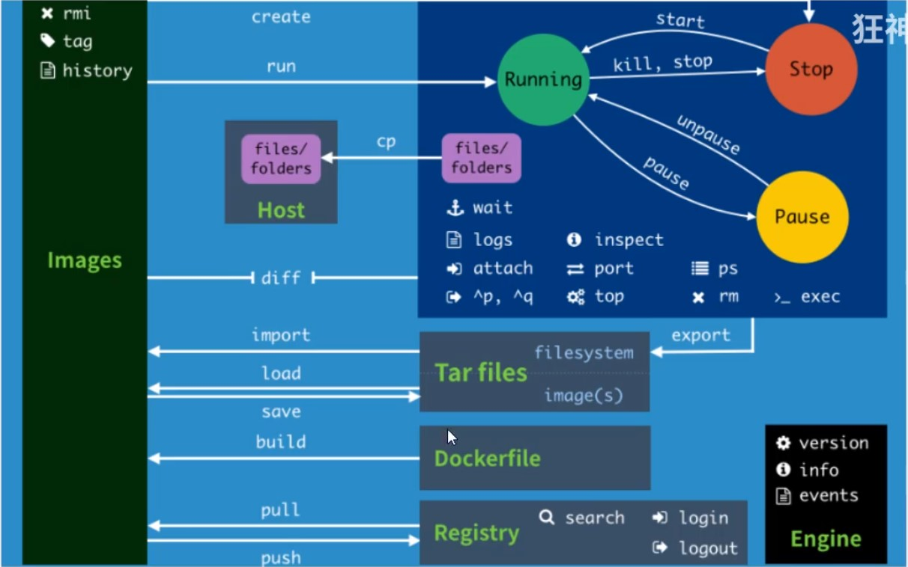
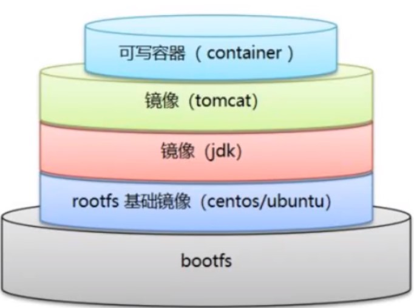
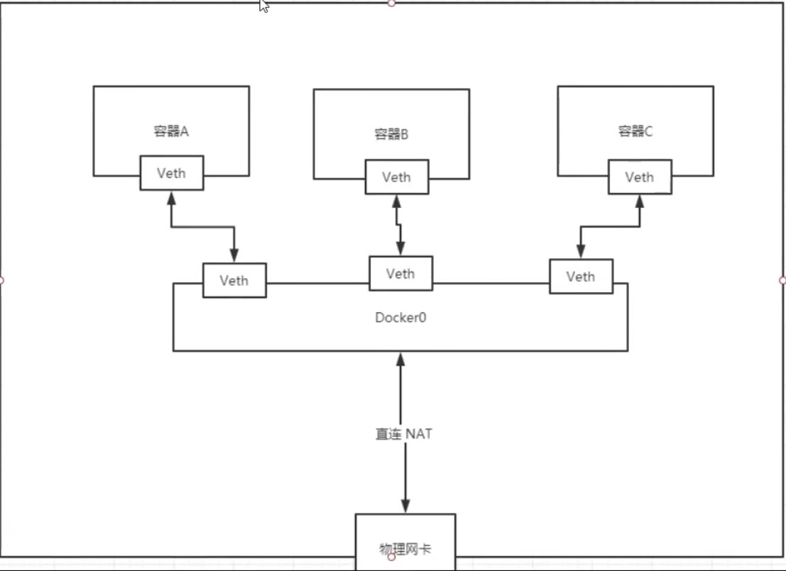
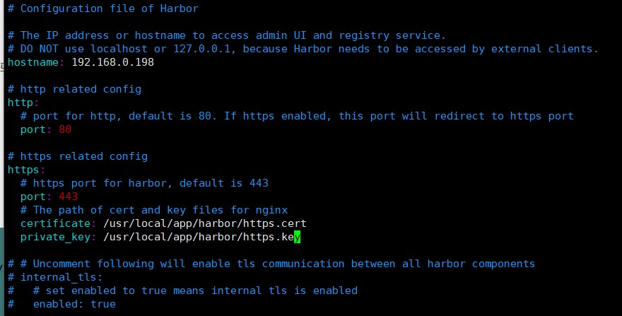

# Docker学习笔记

### Docker常用命令

##### 帮助命令

> ```shell
> docker version				# 显示docker的版本信息
> docker info					# 显示docker的系统信息
> docker [command] --help		# 查看docker命令的帮助信息
> ```

##### 镜像命令

> ```shell
> docker images				# 查看所有本地主机上的镜像
> 
> vagrant@ubuntu-bionic:~$ sudo docker images
> REPOSITORY   TAG       IMAGE ID       CREATED        SIZE
> redis        latest    b29265c0674f   2 months ago   105MB
> mysql        5.7       3473143edd4d   2 months ago   449MB
> # 解释
> REPOSITORY 			镜像的仓库源
> TAG					镜像的标签
> IMAGE ID			镜像的ID
> CREATED				镜像的创建时间
> SIZE				镜像的大小
> # 可选项
> -a,--all			# 列出所有镜像
> -q,--quiet 			# 只显示镜像的ID
> 
> docker search   	# 搜索镜像
> 
> NAME                              DESCRIPTION                                     STARS     OFFICIAL   AUTOMATED
> mysql                             MySQL is a widely used, open-source relation…   10999     [OK]       
> mariadb                           MariaDB Server is a high performing open sou…   4165      [OK]       
> mysql/mysql-server                Optimized MySQL Server Docker images. Create…   815                  [OK]
> percona                           Percona Server is a fork of the MySQL relati…   544       [OK]       
> phpmyadmin                        phpMyAdmin - A web interface for MySQL and M…   240       [OK]       
> #可选项，通过收藏来过滤
> --filter=STARS=3000  #搜索出来的镜像就是STARS大于3000的
> 
> docker pull   	# 下载镜像
> # 执行版本下载
> docker pull mysql:5.7
> 
> docker rmi   # 删除镜像
> docker rmi -f $(docker images -aq) 删除全部的镜像
> ```

##### 容器命令

> ```shell
> # 新建容器并启动
> docker run [可选参数] image
> # 参数说明
> --name="Name"	容器名字
> -d 				后台方式启动
> -it 			使用交互方式运行，进入容器查看内容
> -p(小写)		  指定容器的端口	-p 8080:8080
> 	-p	主机端口:容器端口(常用)
> 	-p  ip:主机端口:容器端口
> 	-p  容器端口
> 	容器端口
> -P(大写)		  随机指定端口,容器内部端口随机映射到主机的端口
> 
> # 列出所有运行的容器
> docker ps [可选参数]	不带参数只显示当前正在运行的容器
> -a		列出当前正在运行的容器 + 历史运行过容器
> -n=?	显示最近创建的容器 ？表示个数
> -q 		只显示容器的编号
> 
> # 退出容器
> exit 			# 直接退出并停止容器
> ctrl + P + Q   	# 容器不停止退出
> 
> # 删除容器
> docker rm 容器id		# 删除指定容器，不能删除正在运行的容器，如果要强制删除docekr rm -f 容器id
> docker rm -f $(docker ps -aq)	# 删除所有的容器
> 
> # 启动和停止容器的操作
> docker start 容器id		# 启动容器
> docker restart 容器id		# 重启容器
> docker stop	容器id		# 停止当前正在运行的容器
> docker kill 容器id		# 强制停止当前容器
> 
> ```

##### 常用其他命令

> ```shell
> docker run -d 镜像名 
> root@ubuntu-bionic:~# docker run -d centos
> # 问题docker ps，发现centos停止了
> # 常见的坑，docker容器使用后台运行，必须要有一个前台进程，docker发现没有前台应用，就会自动停止
> 
> # 查看日志
> docker logs	[可选参数]
>    --details        Show extra details provided to logs
> -f, --follow         Follow log output
>    --since string   Show logs since timestamp (e.g. 2013-01-02T13:23:37Z) or relative (e.g. 42m for 42 minutes)
> -n, --tail 要显示的日志条数
> -t, --timestamps     显示时间戳
>    --until string   显示某个时间之前的日志
> 
> # 查看docker容器中的进程信息
> docker top 容器id
> 
> # 查看镜像的元数据
> docker inspect 容器id
> 
> # 进入当前正在运行的容器
> 
> # 方式一 进入容器后开启一个新的终端
> docker exec -it 容器id /bin/bash
> 
> # 方式二 进入容器正在执行的终端，不会启动新的进程
> docker attach 容器id
> 
> 
> # 从容器内拷贝文件到主机上
> docker cp 容器id:容器内路径 目的主机路径
> ```

##### 小结

> 
>
> ```shell
> attach    Attach to a running container  										# 当前shell下attach连接指定运行镜像
> build     Build an image from a Dockerfile  									# 通过Dockerfile定制镜像
> commit    Create a new image from a containers changes  						# 提交当前容器为新的镜像
> cp    	  Copy files/folders from a container to a HOSTDIR or to STDOUT  		# 从容器中拷贝指定文件或者目录到宿主机中
> create    Create a new container  												# 创建一个新的容器，同run 但不启动容器
> diff      Inspect changes on a containers filesystem  							# 查看docker容器变化
> events    Get real time events from the server									# 从docker服务获取容器实时事件
> exec      Run a command in a running container									# 在已存在的容器上运行命令
> export    Export a containers filesystem as a tar archive  						# 导出容器的内容流作为一个tar归档文件(对应import)
> history   Show the history of an image  										# 展示一个镜像形成历史
> images    List images  															# 列出系统当前镜像
> import    Import the contents from a tarball to create a filesystem image  		# 从tar包中的内容创建一个新的文件系统映像(对应export)
> info      Display system-wide information  										# 显示系统相关信息
> inspect   Return low-level information on a container or image  				# 查看容器详细信息
> kill      Kill a running container  											# kill指定docker容器
> load      Load an image from a tar archive or STDIN  							# 从一个tar包中加载一个镜像(对应save)
> login     Register or log in to a Docker registry								# 注册或者登陆一个docker源服务器
> logout    Log out from a Docker registry  										# 从当前Docker registry退出
> logs      Fetch the logs of a container  										# 输出当前容器日志信息
> pause     Pause all processes within a container								# 暂停容器
> port      List port mappings or a specific mapping for the CONTAINER  			# 查看映射端口对应的容器内部源端口
> ps        List containers  														# 列出容器列表
> pull      Pull an image or a repository from a registry  						# 从docker镜像源服务器拉取指定镜像或者库镜像
> push      Push an image or a repository to a registry  							# 推送指定镜像或者库镜像至docker源服务器
> rename    Rename a container  													# 重命名容器
> restart   Restart a running container  											# 重启运行的容器
> rm        Remove one or more containers  										# 移除一个或者多个容器
> rmi       Remove one or more images  											# 移除一个或多个镜像(无容器使用该镜像才可以删除，否则需要删除相关容器才可以继续或者-f强制删除)
> run       Run a command in a new container  									# 创建一个新的容器并运行一个命令
> save      Save an image(s) to a tar archive										# 保存一个镜像为一个tar包(对应load)
> search    Search the Docker Hub for images  									# 在dockerhub中搜索镜像
> start     Start one or more stopped containers									# 启动容器
> stats     Display a live stream of container(s) resource usage statistics  		# 统计容器使用资源
> stop      Stop a running container  											# 停止容器
> tag       Tag an image into a repository  										# 给源中镜像打标签
> top       Display the running processes of a container 							# 查看容器中运行的进程信息
> unpause   Unpause all processes within a container  							# 取消暂停容器
> version   Show the Docker version information									# 查看容器版本号
> wait      Block until a container stops, then print its exit code  				# 截取容器停止时的退出状态值
> ```

### 提交镜像

> ```shell
> docker commit 提交容器成为一个新的副本
> # 命令和git原理类似
> docker commit -m "提交的描述信息" -a="作者" 容器id 目标镜像名:[TAG]
> ```

### 容器数据卷

##### 使用数据卷

> **方式一：直接使用命令来挂载**
>
> ```shell
> docker run -it -v 主机目录:容器内目录
> # 示例
> root@ubuntu-bionic:~/document# docker run -it -v /root/document:/home centos /bin/bash
> ```
>
> *具名挂载、匿名挂载、指定路径挂载*
>
> 匿名挂载：-v 容器内路径
>
> 具名挂载：-v 卷名:容器内路径
>
> 指定路径挂载：-v /宿主机路径:容器内路径
>
> *拓展*
>
> ```shell
> # 通过 -v 容器内路径:ro,rw 改变读写权限
> # 一旦设置了这个权限，容器对挂载出来的内容就有限制了
> docker run -d -P --name nginx02  -v juming-nginx:/etc/nginx:ro nginx
> docker run -d -P --name nginx02  -v juming-nginx:/etc/nginx:rw nginx
> # 解释
> ro : readonly 只读 	说明这个路径只能通过宿主机来操作，容器内部是无法操作的
> rw : readwrite 读写
> ```
>
> **方式二：使用Dockerfile构建**
>
> Dockerfile就是用来构建docker镜像的构建文件
>
> ```shell
> # 创建一个Dockerfile文件，名字可以随意，建议Dockerfile
> # 文件中的内容 指令（大写）参数
> FROM centos
> VOLUME ["volume01","volume02"]
> CMD echo "---end---"
> CMD /bin/bash
> 
> # 根据Dockerfile文件构建容器
> root@ubuntu-bionic:~/document# docker build -f dockerfile1 -t charles/centos .
> 
> # 多个容器共享数据卷
> root@ubuntu-bionic:~/document# docker run -it --name docker01 charles/centos /bin/bash
> root@ubuntu-bionic:~/document# docker run -it --name docker02 --volumes-from docker01 charles/centos
> 当更改容器1中的volume01和volume02中的内容是，容器2中的volume01和volume02中相应的数据会同步改变，宿主机中的内容也会相应改变
> 
> # 应用场景
> 多个mysql实现数据共享
> 容器之间配置信息的传递
> 容器之间配置信息的传递，数据卷容器的生命周期一直持续到没有容器为止
> 但是一旦你持久化到了宿主机，这个时候宿主机的数据是不会删除的
> ```

### Dockerfile

##### 基础概念

> Dockerfile是用来构建docker镜像的文件！命令参数脚本！
>
> 构建步骤：
>
> 1. 编写一个Dockerfile文件
> 2. docker build 构建成为一个镜像
> 3. docker run 运行镜像
> 4. docker push 发布镜像(DockerHub、阿里云镜像仓库)

##### Dockerfile构建过程

> **基础知识**
>
> 1. 每个保留关键字（指令）都必须是大写字母
> 2. 执行顺序是从上到下
> 3. #表示注释
> 4. 每一个指令都会创建提交一个新的镜像层，并提交
>
> 
>
> dockerfile是面向开发的，我们要发布项目，做镜像，就需要编写dockerfile文件
>
> DockerFile：构建文件，定义了一切的步骤，源代码
>
> DockerImage：通过Dockerfile构建生成的镜像，最终发布和运行的产品

##### Dockerfile的指令

> | 指令       | 说明                                                         |
> | ---------- | ------------------------------------------------------------ |
> | FROM       | 功能为指定基础镜像，并且必须是第一条指令。功能为指定基础镜像，并且必须是第一条指令。同时意味着接下来所写的指令将作为镜像的第一层开始 |
> | MAINTAINER | 指定维护者信息（姓名+邮箱）                                  |
> | RUN        | 镜像构建的时候运行的命令，在命令前面加上RUN即可              |
> | ADD        | 步骤，COPY文件到容器内，会自动解压                           |
> | WORKDIR    | 设置镜像的工作目录                                           |
> | VOLUME     | 设置卷，挂载主机目录                                         |
> | EXPOSE     | 指定容器对外暴露的端口                                       |
> | CMD        | 指定容器启动的时候需要运行的命令，只有最后一个会生效，可被替代 |
> | ENTRYPOINT | 指定容器启动的时候需要运行的命令，可以追加命令               |
> | ONBUILD    | 当构建一个被继承的Dockerfile这个时候就会运行ONBUILD的指令，触发指令。这个命令只对当前镜像的子镜像生效。 |
> | COPY       | 类似ADD命令，将文件拷贝到镜像中，与ADD的区别：COPY的<src>只能是本地文件，其他用法一致 |
> | ENV        | 构建的时候，设置环境变量                                     |
>
> **Dockerfile文件编写示例**
>
> ```dockerfile
> FROM centos
> MAINTAINER charles<charles@gmail.com>
> ENV MYPATH /usr/local
> WORKDIR $MYPATH
> RUN yum -y install vim
> RUN yum -y install net-tools
> EXPOSE 80
> CMD echo $MYPATH
> CMD echo "---end---"
> CMD /bin/bash
> ```
>
> **部署tomcat示例**
>
> ```dockerfile
> FROM centos
> MAINTAINER charles<charles@gmail.com>
> ADD jdk-8u271-linux-x64.rpm /usr/local/
> ADD apache-tomcat-9.0.41.tar.gz /usr/local
> RUN rpm -ivh /usr/local/jdk-8u271-linux-x64.rpm
> RUN yum -y install vim
> ENV MYPATH /usr/local
> WORKDIR $MYPATH
> ENV CATALINA_HOME /usr/local/apache-tomcat-9.0.41
> ENV CATALINA_BASE /usr/local/apache-tomcat-9.0.41
> ENV PATH $PATH:$CATALINA_HOME/lib:$CATALINA_HOME/bin
> EXPOSE 8080
> CMD /usr/local/apache-tomcat-9.0.41/bin/startup.sh && tail -F /usr/local/apache-tomcat-9.0.41/bin/logs/catalina.out
> ```
>
> 构建镜像命令
>
> ```shell
> docker build -t diytomcat .
> ```
>
> 创建容器命令
>
> ```shell
> docker run -d -p 9090:8080 --name charlestomcat -v /root/document/webapps/test:/usr/local/apache-tomcat-9.0.41/webapps/test -v /root/document/logs:/usr/local/apache-tomcat-9.0.41/logs diytomcat
> ```

### Docker网络

##### 基础概念

> docker宿主机可以ping通docker容器内部
>
> docker容器之间可以相互ping通
>
> docker容器网络原理图
>
> 
>
> Docker中的所有网络接口都是虚拟的，虚拟的转发效率高
>
> 只要容器删除，对应的一对网桥就没了
>
> **--link**
>
> ```shell
> docker run -d -P --name tomcat03 --link tomcat02 tomcat
> root@ubuntu-bionic:~/document# docker exec -it tomcat03 ping tomcat02
> PING tomcat02 (172.17.0.5) 56(84) bytes of data.
> 64 bytes from tomcat02 (172.17.0.5): icmp_seq=1 ttl=64 time=0.098 ms
> 64 bytes from tomcat02 (172.17.0.5): icmp_seq=2 ttl=64 time=0.072 ms
> 64 bytes from tomcat02 (172.17.0.5): icmp_seq=3 ttl=64 time=0.064 ms
> 64 bytes from tomcat02 (172.17.0.5): icmp_seq=4 ttl=64 time=0.051 ms
> 64 bytes from tomcat02 (172.17.0.5): icmp_seq=5 ttl=64 time=0.054 ms
> ```
>
> *本质探究：*--link就是我们在hosts配置中增加了一个host映射
>
> ```shell
> root@ubuntu-bionic:~/document# docker exec -it tomcat03 cat /etc/hosts
> 127.0.0.1	localhost
> ::1	localhost ip6-localhost ip6-loopback
> fe00::0	ip6-localnet
> ff00::0	ip6-mcastprefix
> ff02::1	ip6-allnodes
> ff02::2	ip6-allrouters
> 172.17.0.5	tomcat02 d23b803f711e
> 172.17.0.6	eec2ccdac4c2
> ```
>
> --link已经不建议使用
>
> 自定义网络不适用docker0
>
> docker0问题：不支持容器名连接访问

##### 自定义网络

> 查看所有docker网络
>
> ```shell
> root@ubuntu-bionic:~/document# docker network ls
> NETWORK ID     NAME      DRIVER    SCOPE
> 74c3c65b6d5c   bridge    bridge    local
> b0e49a7fb727   host      host      local
> ff1b8dbb3201   none      null      local
> ```
>
> **网络模式**
>
> * bridge ：桥接docker（默认）
> * none：不配置网络
> * host：和宿主机共享网络
> * container：容器网络连通（用的少）
>
> **创建自定义网络**
>
> ```shell
> docker network create --driver bridge --subnet 172.18.0.0/16 --gateway 172.18.0.1 mynet
> 
> root@ubuntu-bionic:~/document# docker network ls
> NETWORK ID     NAME      DRIVER    SCOPE
> 74c3c65b6d5c   bridge    bridge    local
> b0e49a7fb727   host      host      local
> 5397ef922d32   mynet     bridge    local
> ff1b8dbb3201   none      null      local
> ```
>
> 用自定义网络创建容器
>
> ```shell
> docker run -d -P --name tomcat-net-01 --net mynet tomcat
> docker run -d -P --name tomcat-net-02 --net mynet tomcat
> ```
>
> 自定义网络，容器可以通过容器名互相ping通
>
> ```shell
> root@ubuntu-bionic:~/document# docker exec -it tomcat-net-01 ping tomcat-net-02
> PING tomcat-net-02 (172.18.0.3) 56(84) bytes of data.
> 64 bytes from tomcat-net-02.mynet (172.18.0.3): icmp_seq=1 ttl=64 time=0.079 ms
> 64 bytes from tomcat-net-02.mynet (172.18.0.3): icmp_seq=2 ttl=64 time=0.051 ms
> 64 bytes from tomcat-net-02.mynet (172.18.0.3): icmp_seq=3 ttl=64 time=0.048 ms
> 64 bytes from tomcat-net-02.mynet (172.18.0.3): icmp_seq=4 ttl=64 time=0.049 ms
> 64 bytes from tomcat-net-02.mynet (172.18.0.3): icmp_seq=5 ttl=64 time=0.052 ms
> ```
>
> 将一个容器连接到自定义网络中
>
> ```shell
> root@ubuntu-bionic:~/document# docker network connect mynet tomcat01
> ```
>
> 

### 搭建Docker私有仓库

> **Harbor简介**
>
> - 虽然Docker官方提供了公共的镜像仓库，但是从安全和效率等方面考虑，部署我们私有环境内的Registry也是非常必要的。
> - Harbor是由VMware公司开源的企业级的Docker Registry管理项目，相比docker官方拥有更丰富的权限权利和完善的架构设计，适用大规模docker集群部署提供仓库服务。
> - 它主要提供 Dcoker Registry 管理界面UI，可基于角色访问控制,镜像复制， AD/LDAP 集成，日志审核等功能，完全的支持中文。
>
> **安装步骤**
>
> *先安装docker与docker-compose*
>
> *安装docker-compose*
>
> 先下载docker-compose离线安装包( 下载地址：https://github.com/docker/compose/releases )
>
> ```shell
> mv docker-compose-Linux-x86_64 /usr/local/bin/docker-compose
> ```
>
> *安装Harbor*
>
> 先下载Harbor离线安装包( 下载地址：https://github.com/goharbor/harbor/releases )
>
> ```shell
> # 解压离线Harbor离线安装包
> tar -zxvf harbor-offline-installer-v2.3.0.tgz 
> cp -ra harbor /usr/local/app
> ```
>
> 修改harbor配置文件
>
> ```shell
> cp harbor.yml.tmpl harbor.yml
> ```
>
> 
>
> 
>
> 修改以下内容
>
> ```shell
> hostname = 192.168.0.198 #修改harbor的启动ip，这里需要依据系统ip设置
> 
> port: 80 #harbor的端口,有两个端口,http协议(80)和https协议(443)
> 
> harbor_admin_password = harbor12345   #修改harbor的admin用户的密码
> 
> data_volume: /harbor/data #修改harbor存储位置
> ```
>
> 生成SSL证书
>
> ```shell
> openssl genrsa -out ca.key 4096
> openssl req -x509 -new -nodes -sha512 -days 3650 -subj "/C=CN/ST=Beijing/L=Beijing/O=example/OU=Personal/CN=192.168.0.198" -key ca.key -out ca.crt
> openssl genrsa -out 192.168.0.198.key 4096
> openssl req -sha512 -new -subj "/C=CN/ST=Beijing/L=Beijing/O=example/OU=Personal/CN=192.168.0.198" -key 192.168.0.198.key -out 192.168.0.198.csr
> 
> cat > v3.ext <<-EOF
> authorityKeyIdentifier=keyid,issuer
> basicConstraints=CA:FALSE
> keyUsage = digitalSignature, nonRepudiation, keyEncipherment, dataEncipherment
> extendedKeyUsage = serverAuth
> subjectAltName = IP:192.168.0.198
> EOF
> 
> openssl x509 -req -sha512 -days 3650 -extfile v3.ext -CA ca.crt -CAkey ca.key -CAcreateserial -in 192.168.0.198.csr -out 192.168.0.198.crt
> 
> ```
>
> 修改/etc/docker/daemon.json
>
> ```json
> {
>   "registry-mirrors": ["https://7o196ybs.mirror.aliyuncs.com"],
>   "insecure-registries":["192.168.0.198"]
> }
> ```
>
> 重启docker
>
> ```shell
> systemctl restart docker
> ```
>
> 正式安装harbor
>
> ```shell
> ./prepare
> ./install.sh
> ```

