# ElasticSearch学习笔记

6.x版本与7.x版本api区别大

- 7.x版本使用流行Restfull API
- 7.x版本废弃了type（相当于数据库表）概念

## 一、windows版安装

#### 1、下载windows版elasticsearch7.6.1

下载地址：https://www.elastic.co/cn/downloads/past-releases#elasticsearch

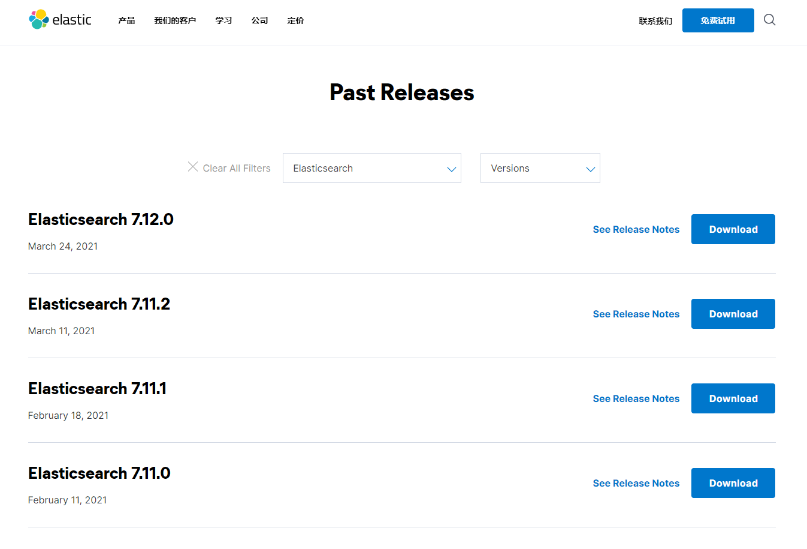

#### 2、解压即可使用

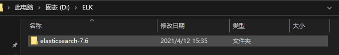

#### 3、目录结构

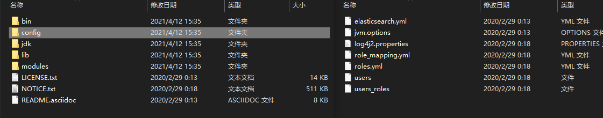

- config文件夹中有几个重要配置文件：

  log4j2.properties    日志配置文件

  jvm.options     java虚拟机相关配置

  elasticsearch.yml      主要配置，如集群配置端口配置

- modules   功能模块

- plugins    插件，ik分词器也是插件


#### 4、跨域配置

> 不配置跨域，则elasticsearch-head无法连接
>
> 在elasticsearch.yml中添加如下配置
>
> 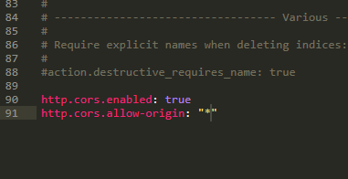

#### 5、启动：双击.bat文件

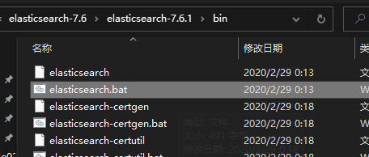

#### 6、启动之后在浏览器中输入localhost:9200

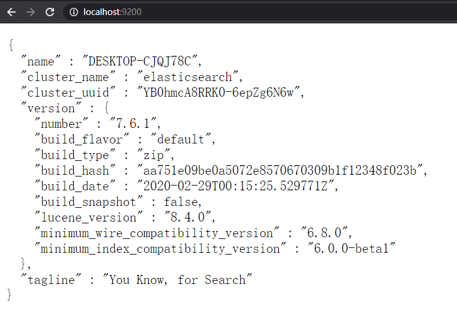

> name  是主机名
>
> cluster_name  集群名，一台主机也是集群，默认集群名就是elasticsearch

#### 6、安装可视化插件 head

> 这是一个数据展示工具，查询操作可以使用Kibana

==确保本地拥有nodejs环境==

下载地址：https://github.com/mobz/elasticsearch-head

将 elasticsearch-head-master.zip 压缩包下载后解压

进入目录运行命令 ==cnmp install==

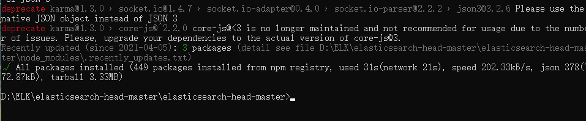

再使用命令启动 ==npm run start==

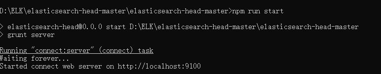

浏览器中输入localhost:9100，并连接elasticsearch服务

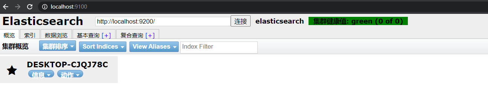

#### 7、安装Kibana

相当于可视化客户端，用于做查询操作

==需要本地nodejs环境==

下载地址：https://www.elastic.co/cn/downloads/past-releases#kibana

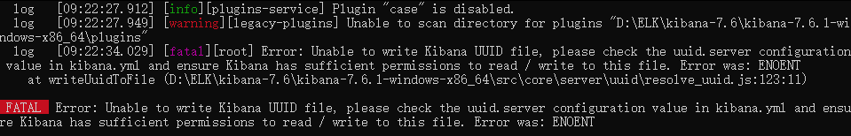

解压缩（非常耗时），通过bin目录中的命令启动

## 二、基本使用和概念

The Elastic Stack, 包括 Elasticsearch、Kibana、Beats 和 Logstash（也称为 ELK Stack）。能够安全可靠地获取任何来源、任何格式的数据，然后实时地对数据进行搜索、分析和可视化。Elaticsearch，简称为 ES， ES 是一个， 开源的高扩展的分布式全文搜索引擎，是整个 ElasticStack 技术栈的核心。它可以近乎实时的存储、检索数据；本身扩展性很好，可以扩展到上百台服务器，处理 PB 级别的数据。

es就相当于数据库，一个索引就相当于一个数据库，下面就创建了一个chenlong索引（数据库）

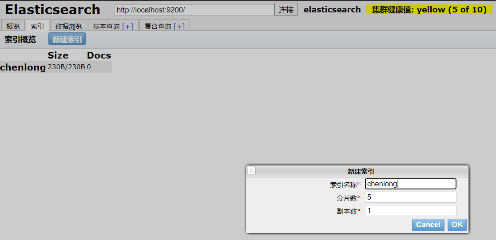


#### 1、底层数据存储方式

> elasticsearch是面向文档，一切都是json，比如数据库也是一个json，每一个文档都是一个json文档，可以通过fastjson自动转换
>
> 索引：一个文档集合

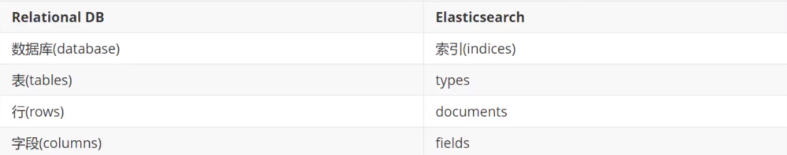

#### 2、分片机制

#### 3、倒排索引

elasticsearch使用的是一种称为倒排索引的结构，采用Lucene倒排索引作为底层。这种结构适用于快速全文搜索，文档通过分词器进行分词操作，将一个文档分割成一系列词语，再通过词语建立倒排索引。

举例：1、假如有两个文档，内容分别如下

>  文档1：I like red apple.
>
>  文档2：I have an apple tree.

通过英语分词器可以得到如下词条（重复的只保留一个）

> I  like red apple have an tree

通过这些词条可以生成如下倒排索引，列出每个词条在哪个文档有出现

| term  | 文档1 | 文档2 |
| ----- | ----- | ----- |
| I     | √     | √     |
| like  | √     | ×     |
| red   | √     | ×     |
| apple | √     | √     |
| have  | ×     | √     |
| an    | ×     | √     |
| tree  | ×     | √     |

现在假如搜索 I like ，可以发现词条 I 在两个文档中都有，词条like只有文档1有，因为两个文档都有相关词条出现，但是文档1的匹配度更高，所以会按照匹配度输出搜索结果，这就是倒排索引的原理。中文搜索原理类似，只不过要使用中文分词器


>  倒排索引可以完全过滤掉无关数据，无需搜索全文和全部数据，效率高
>
>  一个索引会分成若干个分片，存储在集群中，每个分片其实就是一个倒排索引

#### 4、IK分词器

下载地址：https://github.com/medcl/elasticsearch-analysis-ik

下载解压到elasticsearch的plugins目录

重启elasticsearch可以看到分词器插件加载，可以通过bin目录中的elasticsearch-plugin命令查看加载进来的插件

> elasticsearch-plugin list

IK分词器有两种算法，一种的==ik_max_word== 最细粒度划分，另一种是==ik_smart== 最少切分，最细粒度划分就是将一个文本尽可能划分出所有可能的词条，最少切分就是将一个文本尽可能少的切分但要保证切分出来的都是词条

在Kibana上进行测试：==ik_smart== 

```
get _analyze
{
  "analyzer":"ik_smart",
  "text":"中国共产党"
}
```

得到如下切分结果：

```
{
  "tokens" : [
    {
      "token" : "中国共产党",
      "start_offset" : 0,
      "end_offset" : 5,
      "type" : "CN_WORD",
      "position" : 0
    }
  ]
}
```

测试：==ik_max_word== 

```
get _analyze
{
  "analyzer":"ik_max_word",
  "text":"中国共产党"
}
```

得到如下切分结果：

```
{
  "tokens" : [
    {
      "token" : "中国共产党",
      "start_offset" : 0,
      "end_offset" : 5,
      "type" : "CN_WORD",
      "position" : 0
    },
    {
      "token" : "中国",
      "start_offset" : 0,
      "end_offset" : 2,
      "type" : "CN_WORD",
      "position" : 1
    },
    {
      "token" : "国共",
      "start_offset" : 1,
      "end_offset" : 3,
      "type" : "CN_WORD",
      "position" : 2
    },
    {
      "token" : "共产党",
      "start_offset" : 2,
      "end_offset" : 5,
      "type" : "CN_WORD",
      "position" : 3
    },
    {
      "token" : "共产",
      "start_offset" : 2,
      "end_offset" : 4,
      "type" : "CN_WORD",
      "position" : 4
    },
    {
      "token" : "党",
      "start_offset" : 4,
      "end_offset" : 5,
      "type" : "CN_CHAR",
      "position" : 5
    }
  ]
}
```

注意点：如果字段类型是keyword类型，那么分词器不会对他起作用，而text类型可以

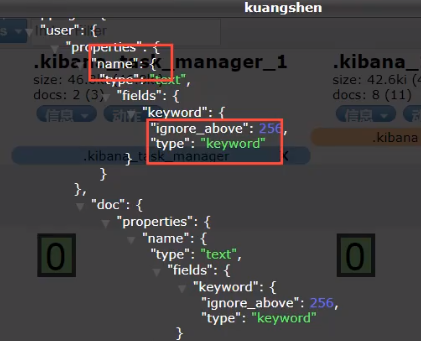


#### 5、IK分词器字典

IK分词器之所以能将一句中文拆分成多个词条，那是因为IK分词器中的字典，字典中包含的词条IK分词器才能理解。

假如有一个词条 “苹果”， 但是字典中没有，那么IK分词器就无法理解，会继续将其拆分成可以理解的两个词条 "苹" 和 "果"

因此对于一些IK分词器字典中没有的词条，需要我们加入到该字典中，步骤如下：

在ik分词器的config目录下创建一个文件==kuang.dic==添加词条“苹果”，注意每个词条独占一行

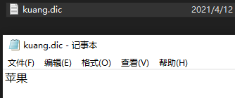

然后在IKAnalyzer.cfg.xml文件中配置刚才创建的字典文件

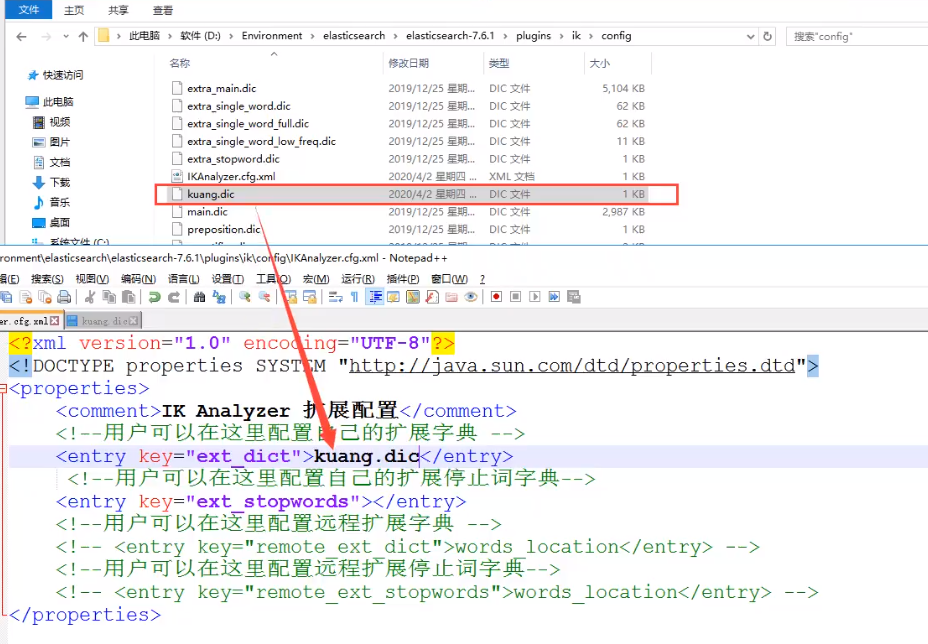

重启elasticsearch服务即可

#### 6、elasticsearch  Restfull API

> get： 请求类型
>
> _analyze： 资源名
>
> json部分： 请求体中的数据

```
get _analyze
{
  "analyzer":"ik_smart",
  "text":"中国共产党"
}
```

基本命令：

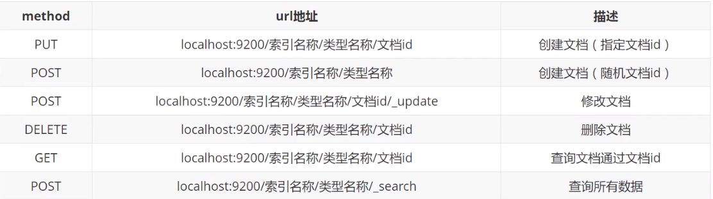


## 三、数据操作

#### 1、索引操作

创建索引，指定字段

```
PUT /kuangshen2
{
  "mappings": {
    "properties": {
      "name":{
        "type": "text"
      },
      "age":{
        "type": "long"
      },
      "birthday":{
        "type": "date"
      }
    }
  }
}
```


#### 2、文档操作

###### 添加一个文档

> 在kuangshen索引中添加第一个文档，1就是该文档的_id属性值

```
PUT /kuangshen/_doc/1
{
  "name":"狂神说",
  "age":12,
  "desc":"一顿操作猛如虎，一看是个250",
  "tags":["技术宅","暖男","直男"]
}
```

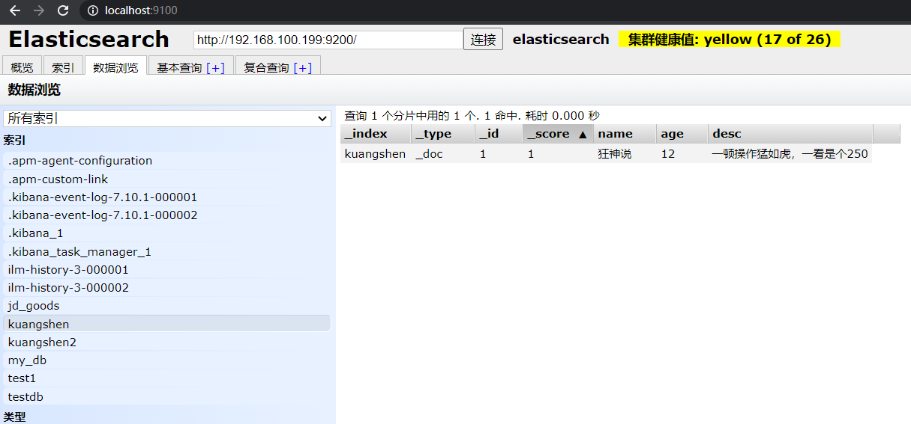

多添加几个数据

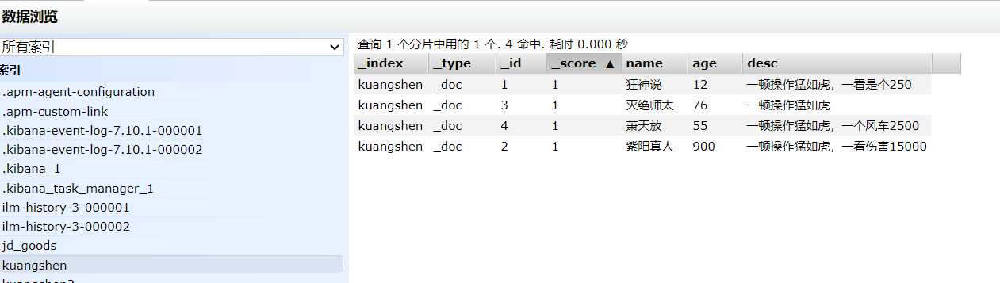


###### 更新文档数据

> 更新操作可以使用==PUT== 、==POST==以及 ==POST _update==方式，这三种方式有区别：
>
> 如果全部字段都有修改，那么三种方式都可以，如果只修改部分字段，那么PUT和POST方式未修改的字段会置空，也就是说只有POST _update方式可以动态修改，想改哪个字段就改哪个字段
>
> 写法也不同，POST _update方式需要doc包裹，而其他两种不用，如下：
>
> ```
> PUT /kuangshen/_doc/1
> {
> "name":"chen1"
> }
> 
> POST /kuangshen/_doc/1
> {
> "name":"chen2"
> }
> 
> POST /kuangshen/_doc/1/_update
> {
> "doc":{
>  "name":"chen3"
> }
> }
> ```

#### 3、查询

###### 简单查询

```
GET /kuangshen/_doc/_search         //_search查询默认写法
{
  "query":{            //查询的匹配条件
    "match":{
      "name":"狂神"
     }
   },
   "_source":["name","desc"]    //查询结果中显示的字段，不写则默认返回所有字段
}
```


###### 复合查询

> 复合查询需要使用bool
>
> bool中包含有四种判断条件
>
> must：必须匹配
>
> should：
>
> must_not：必须不匹配
>
> filter：

```
GET /jd_index/_doc/_search
{
  "query": {
    "bool": {
      
      "must": [],
      "should": [],
      "must_not": [],
      "filter": {}
      
    }
  }
}
```


==过滤结果字段==：相当于指定select后的字段，而不是select *

```
"_source":["name","desc"]
```

==排序==：下面是按照age降序，有了排序规则后返回的结果就没有分值了，都是null

```
"sort":[
    {
      "age":{
        "order":"desc"
      }
    }
  ]
```

==分页==：从0开始取2条

```
"from": 0,
"size": 2
```

==精确查询==：term

> term查询是直接通过倒排索引指定的词条进行精确的查找
>
> match查询会使用分词器解析，先分析文档，然后通过分析的文档进行查询
>
> 注意：text和keyword的区别，keyword类型的字段不会被分词器解析，假如有一个keyword类型的字段name，值是 "陈龙2" ，通过term查询  name=陈龙  的文档是查不到的，因为分词器不会解析keyword类型的字段值，因此倒排索引中也没有 陈龙 这个词条，只有 陈龙2这个词条

==高亮查询==：highlight

> 下面是对desc字段进行高亮，注意高亮字段必须是查询条件里的字段

```
GET /kuangshen/_doc/_search
{
  "query":{
    "match":{
      "desc":"一顿"
    }
  },

  "highlight":{
    "fields":{
      "desc":{}
    }
  }
}
```

查询结果中就多了一个highlight部分

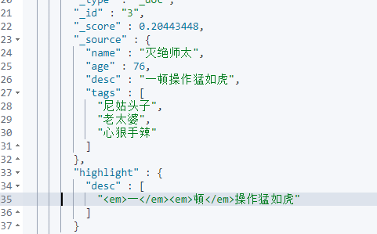

也可以自定义highlight部分的标签

```
GET /kuangshen/_doc/_search
{
  "query":{
    "match":{
      "desc":"一顿"
    }
  },

  "highlight":{
    "pre_tags":"<p class='key' style='color:red'>",
    "post_tags":"</p>",
    "fields":{
      "desc":{}
    }
  }
}
```

替换成了自定义标签

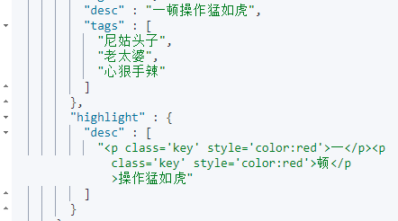


#### 4、映射mapping

mapping是处理数据的方式和规则方面做一些限制，如某个字段的数据类型、默认值、分析器、是否被索引等等，这些都是映射里面可以设置的，其它就是处理es里面数据的一些使用规则设置也叫做映射，按着最优规则处理数据对性能提高很大，因此才需要建立映射，并且需要思考如何建立映射才能对性能更好。

## 四、springboot集成

#### 1、导入依赖

```xml
<dependency>
    <groupId>org.springframework.boot</groupId>
    <artifactId>spring-boot-starter-data-elasticsearch</artifactId>
</dependency>
```


#### 2、修改elasticsearch版本和线上一致

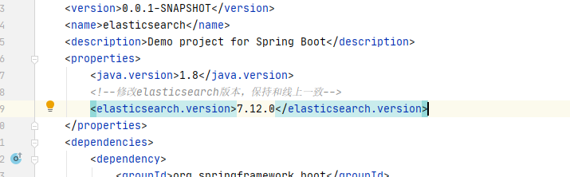

#### 3、创建elasticsearch配置类

```java
import org.apache.http.HttpHost;
import org.elasticsearch.client.RestClient;
import org.elasticsearch.client.RestHighLevelClient;
import org.springframework.context.annotation.Bean;
import org.springframework.context.annotation.Configuration;

@Configuration
public class ElasticsearchConfig {

    @Bean
    public RestHighLevelClient restHighLevelClient(){
        RestHighLevelClient restHighLevelClient = new RestHighLevelClient(
                //有多少台elasticsearch就配置多少个
                RestClient.builder(new HttpHost("192.168.100.199",9200,"http"))
        );
        return restHighLevelClient;
    }
}
```

#### 4、索引操作api

```java
public class TestController {

    @Autowired
    @Qualifier("restHighLevelClient")
    private RestHighLevelClient client;

    /**
     * 创建索引
     * @return
     */
    @RequestMapping("create_index")
    Object test1() throws IOException {

        //创建索引请求
        CreateIndexRequest request = new CreateIndexRequest("chen_index");
        //客户端执行请求   请求参数默认
        CreateIndexResponse createIndexResponse = client.indices().create(request, RequestOptions.DEFAULT);
        //打印结果
        System.out.println(createIndexResponse.toString());
        return null;
    }
    
    /**
     * 判断索引是否存在
     */
    @RequestMapping("exists_index")
    Object test2() throws IOException {
        GetIndexRequest request = new GetIndexRequest("chen_index");
        boolean exists = client.indices().exists(request, RequestOptions.DEFAULT);
        System.out.println(exists);
        return null;
    }

    /**
     * 删除索引
     */
    @RequestMapping("rm_index")
    Object test3() throws IOException {
        DeleteIndexRequest request = new DeleteIndexRequest("chen_index");
        AcknowledgedResponse delete = client.indices().delete(request, RequestOptions.DEFAULT);
        System.out.println(delete.isAcknowledged());
        return null;
    }
}
```

#### 5、文档操作api

###### 创建、更新、删除

```java
/**
     * 创建文档
     */
    @RequestMapping("create_doc")
    Object test4() throws IOException {
        User user = new User("狂神说", 21);
        //创建请求
        IndexRequest request = new IndexRequest("chen_index");
        // put /chen_index/_doc/1
        request.id("1");
        request.timeout(TimeValue.timeValueSeconds(1));
        request.timeout("1s");

        request.source(JSON.toJSONString(user), XContentType.JSON);

        IndexResponse index = client.index(request, RequestOptions.DEFAULT);

        System.out.println(index.toString());
        System.out.println(index.status());

        return null;
    }

    /**
     * 根据id判断某个文档是否存在
     */
    @RequestMapping("exists_doc")
    Object test5() throws IOException {
        GetRequest request = new GetRequest("chen_index", "1");
        //不获取_source的上下文
//        request.fetchSourceContext(new FetchSourceContext(false));
//        request.storedFields("name");

        boolean exists = client.exists(request, RequestOptions.DEFAULT);
        System.out.println(exists);
        return null;
    }

    /**
     * 根据id获取文档信息
     */
    @RequestMapping("get_doc")
    Object test6() throws IOException {
        GetRequest request = new GetRequest("chen_index", "1");
        GetResponse resp = client.get(request, RequestOptions.DEFAULT);

        //打印文档内容
        System.out.println(resp.getSourceAsString());
        System.out.println(resp.getSource());  //完整信息
        return null;
    }

    /**
     * 根据id更新文档
     */
    @RequestMapping("update_doc")
    Object test7() throws IOException {
        UpdateRequest request = new UpdateRequest("chen_index", "1");
        request.timeout("1s");

        User user = new User();
        user.setName("哼");
        request.doc(JSON.toJSONString(user), XContentType.JSON);

        UpdateResponse update = client.update(request, RequestOptions.DEFAULT);
        System.out.println(update.status());
        return null;
    }


    /**
     * 根据id删除文档
     */
    @RequestMapping("delete_doc")
    Object test8() throws IOException {
        DeleteRequest request = new DeleteRequest("chen_index", "1");
        request.timeout("1s");

        DeleteResponse update = client.delete(request, RequestOptions.DEFAULT);
        System.out.println(update.status());
        return null;
    }
```

###### 批量操作

```java
/**
 * 批量插入，其他批量操作也可以这样
 */
@RequestMapping("batch_create_doc")
Object test9() throws IOException {
    BulkRequest bulkRequest = new BulkRequest();
    bulkRequest.timeout("10s");

    ArrayList<User> users = new ArrayList<>();
    users.add(new User("chen1",21));
    users.add(new User("chen2",22));
    users.add(new User("chen3",23));
    users.add(new User("chen4",24));

    for(int i=0 ; i<users.size(); i++){
        IndexRequest request = new IndexRequest("chen_index");
        request.id(""+(i+1));
        request.source(JSON.toJSONString(users.get(i)),XContentType.JSON);
        bulkRequest.add(request);
    }

    BulkResponse bulk = client.bulk(bulkRequest,RequestOptions.DEFAULT);
    System.out.println(bulk.hasFailures());  //false表示成功

    return null;
}
```

###### 查询

```java
/**
 * 查询
 */
Object test10() throws IOException {

    SearchRequest searchRequest = new SearchRequest("chen_index");

    //构建搜索条件
    SearchSourceBuilder searchSourceBuilder = new SearchSourceBuilder();
    //查询条件使用工具来实现
    TermQueryBuilder termQueryBuilder = QueryBuilders.termQuery("name", "chen");

    searchSourceBuilder.query(termQueryBuilder);
    searchSourceBuilder.timeout(new TimeValue(60, TimeUnit.SECONDS));

    searchRequest.source(searchSourceBuilder);

    SearchResponse search = client.search(searchRequest, RequestOptions.DEFAULT);

    System.out.println(search.getHits());
    System.out.println(JSON.toJSONString(search.getHits()));

    return null;
}
```

## 五、实战

#### 1、java爬虫

html爬取可以使用jsoup包，音乐影视爬取可以使用tika包

导入依赖

```xml
<dependency>
    <groupId>org.jsoup</groupId>
    <artifactId>jsoup</artifactId>
    <version>1.10.2</version>
</dependency>
```

创建工具类

```java
import com.example.elasticsearch.pojo.Product;
import org.jsoup.Jsoup;
import org.jsoup.nodes.Document;
import org.jsoup.nodes.Element;
import org.jsoup.select.Elements;
import org.springframework.util.StringUtils;

import java.net.URL;
import java.net.URLEncoder;
import java.util.ArrayList;
import java.util.List;

public class HttpParseUtils {


//    public static void main(String[] args) throws Exception {
//
//        List<Product> list = getProductWithKey("心理学");
//        for (Product p: list) {
//            System.out.println(p);
//        }
//
//    }

    public static List<Product> getProductWithKey(String key) throws Exception {
        if (StringUtils.isEmpty(key)){
            throw new Exception();
        }

        String url = "https://search.jd.com/Search?keyword=" + URLEncoder.encode(key, "UTF-8");
        System.out.println(url);
        URL url1 = new URL(url);

        //解析网页  document就是js中的Document页面对象，所有在js中可以使用的方法这里都可以使用
        Document document = Jsoup.parse(url1, 30000);
        Element j_goodsList = document.getElementById("J_goodsList");
        Elements lis = j_goodsList.getElementsByTag("li");

        ArrayList<Product> products = new ArrayList<>();
        for (Element li : lis) {

            String img = li.getElementsByTag("img").eq(0).attr("data-lazy-img");  //source-data-lazy-img
            String title = li.getElementsByClass("p-name").eq(0).text();
            String price = li.getElementsByClass("p-price").eq(0).text();
            String shop = li.getElementsByClass("p-shopnum").eq(0).text();

            Product product = new Product();
            product.setImg(img);
            product.setTitle(title);
            product.setPrice(price);
            product.setShop(shop);

            products.add(product);
        }

        return products;
    }

}
```

爬取数据批量存入es

```java
/**
 * 爬取数据存入es
 */
@RequestMapping("data")
Object test11(@RequestParam String key) throws Exception {

    List<Product> list = HttpParseUtils.getProductWithKey(key);

    BulkRequest bulkRequest = new BulkRequest();
    bulkRequest.timeout("10s");

    for(int i=0 ; i<list.size(); i++){
        IndexRequest request = new IndexRequest("jd_index");
        request.id(""+(i+1));
        request.source(JSON.toJSONString(list.get(i)),XContentType.JSON);
        bulkRequest.add(request);
    }

    BulkResponse bulk = client.bulk(bulkRequest,RequestOptions.DEFAULT);
    System.out.println(bulk.hasFailures());  //false表示成功

    return null;
}
```

es查询数据返回前端

```java
/**
 * 数据查询
 */
@RequestMapping("getdata")
Object test12(@RequestParam String key) throws IOException {
    SearchRequest searchRequest = new SearchRequest("jd_index");

    //构建搜索条件
    SearchSourceBuilder searchSourceBuilder = new SearchSourceBuilder();
    //查询条件使用工具来实现
    TermQueryBuilder termQueryBuilder = QueryBuilders.termQuery("title", key);

    searchSourceBuilder.query(termQueryBuilder);
    searchSourceBuilder.timeout(new TimeValue(60, TimeUnit.SECONDS));

    searchRequest.source(searchSourceBuilder);

    SearchResponse response = client.search(searchRequest, RequestOptions.DEFAULT);

    ArrayList<Object> objects = new ArrayList<>();
    //解析结果
    for(SearchHit hit : response.getHits().getHits()){
        objects.add(hit.getSourceAsMap());
    }

    return objects;
}
```