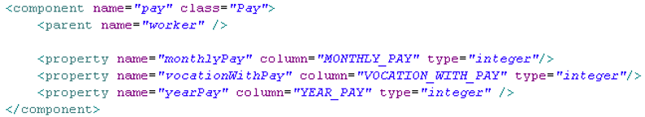

# Hibernate学习笔记

### 基本介绍

##### 什么是Hibernate

> * 一个Java领域的持久化框架
> * 一个ORM框架

##### 对象的持久化

> * 狭义的理解，”持久化“仅仅指把对象永久保存到数据库中
> * 广义的理解，“持久化”包括和数据库相关的各种操作：
>   * 保存：把对象永久保存到数据库中
>   * 更新：更新数据库中对象（记录）的状态
>   * 删除：从数据库中删除一个对象
>   * 查询：根据特定的查询条件，把符合查询条件的一个或多个对象从数据库加载到内存中
>   * 加载：根据特定的OID，把一个对象从数据库加载到内存中。
>
> 为了在系统中能够找到所需对象，需要为每一个对象分配一个唯一的标志号。在关系数据库中称之为主键，而在对象术语中，则叫做对象标志( Object identifier-OID )

##### ORM

> ORM( Object / Relation Mapping ) ：对象/关系映射
>
> * ORM主要解决对象-关系的映射
>
>   | 面向对象概念 | 面向关系概念   |
>   | ------------ | -------------- |
>   | 类           | 表             |
>   | 对象         | 表的行（记录） |
>   | 属性         | 表的列（字段） |
>
> * ORM的思想：将关系数据库中表中的记录映射成为对象，以对象的形式展现，程序员可以把对数据库的操作转化为对对象的操作
>
> * ORM采用元数据来描述对象-关系映射细节，元数据通常采用XML格式，并且存放在专门的对象-关系映射文件中

##### 流行的ORM框架

> * Hibernate：
>   * 非常优秀，成熟的ORM框架
>   * 完成对象的持久化操作
>   * Hibernate允许开发者采用面向对象的方式来操作关系数据库
>   * 消除那些针对特定数据库厂商的SQL代码
> * MyBatis：
>   * 相比Hibernate更灵活，运行速度快
>   * 开发速度慢，不支持纯粹的面向对象操作，需熟悉sql语句，并且熟练使用sql语句优化功能
> * TopLink
> * OJB

##### 入门案例

> ```java
> // News.java
> package com.atguigu.demo;
> import java.sql.Blob;
> import java.util.Date;
> 
> public class News {
> 	
> 	private Integer id;
> 	private String title;
> 	private String author;
> 	
> 	private String desc;
> 	
> 	//使用 title + "," + content 可以来描述当前的 News 记录. 
> 	//即 title + "," + content 可以作为 News 的 desc 属性值
> 	
> 	private String content;
> 	
> 	private Blob picture;
> 	
> 	public Blob getPicture() {
> 		return picture;
> 	}
> 
> 	public void setPicture(Blob picture) {
> 		this.picture = picture;
> 	}
> 
> 	public String getContent() {
> 		return content;
> 	}
> 
> 	public void setContent(String content) {
> 		this.content = content;
> 	}
> 	
> 	public String getDesc() {
> 		return desc;
> 	}
> 
> 	public void setDesc(String desc) {
> 		this.desc = desc;
> 	}
> 
> 
> 
> 	private Date date;
> 
> 	public Integer getId() { //property
> 		return id;
> 	}
> 
> 	public void setId(Integer id) {
> 		this.id = id;
> 	}
> 
> 	public String getTitle() {
> 		return title;
> 	}
> 
> 	public void setTitle(String title) {
> 		this.title = title;
> 	}
> 
> 	public String getAuthor() {
> 		return author;
> 	}
> 
> 	public void setAuthor(String author) {
> 		this.author = author;
> 	}
> 
> 	public Date getDate() {
> 		return date;
> 	}
> 
> 	public void setDate(Date date) {
> 		this.date = date;
> 	}
> 
> 	public News(String title, String author, Date date) {
> 		super();
> 		this.title = title;
> 		this.author = author;
> 		this.date = date;
> 	}
> 	
> 	public News() {
> 		// TODO Auto-generated constructor stub
> 	}
> 
> 	@Override
> 	public String toString() {
> 		return "News [id=" + id + ", title=" + title + ", author=" + author
> 				+ ", date=" + date + "]";
> 	}
> }
> ```
>
> ```java
> // HibernateTest.java
> package com.atguigu.demo;
> import org.hibernate.Session;
> import org.hibernate.SessionFactory;
> import org.hibernate.Transaction;
> import org.hibernate.cfg.Configuration;
> import org.hibernate.service.ServiceRegistry;
> import org.hibernate.service.ServiceRegistryBuilder;
> import org.junit.Test;
> import java.util.Date;
> 
> public class HibernateTest {
> 
>     @Test
>     public void test(){
> 
>         // 1.创建一个SessionFactory对象
>         // 1) 创建Configuration对象：对应hibernate的基本配置信息和对象关系映射
>         SessionFactory sessionFactory = null;
>         Configuration configuration = new Configuration().configure();
> 
>         /// 4.0之前这样创建 ，后面已标记为废弃
>         // sessionFactory = configuration.buildSessionFactory();
>         // 2) 创建一个ServiceRegistry对象 : hibernate4.X 新添加的对象
>         // hibernate的任何配置和服务都需要在该对象中注册后才能有效
>         ServiceRegistry serviceRegistry = new ServiceRegistryBuilder().applySettings(configuration.getProperties()).buildServiceRegistry();
>         // 3)
>         sessionFactory = configuration.buildSessionFactory(serviceRegistry);
> 
>         // 2.创建一个Session对象
>         Session session = sessionFactory.openSession();
>         // 3.开启事务
>         Transaction transaction = session.beginTransaction();
>         // 4.执行保存操作
>         News news = new News("Java","ATGUIGU",new Date(new java.util.Date().getTime()));
>         session.save(news);
>         // 5.提交事务
>         transaction.commit();
>         // 6.关闭session
>         session.close();
>         // 7.关闭SessionFactory
>         sessionFactory.close();
>     }
> }
> ```
>
> ```xml
> hibernate.cfg.xml
> <?xml version="1.0" encoding="UTF-8"?>
> <!DOCTYPE hibernate-configuration PUBLIC
>         "-//Hibernate/Hibernate Configuration DTD 3.0//EN"
>         "http://hibernate.sourceforge.net/hibernate-configuration-3.0.dtd">
> <hibernate-configuration>
>     <session-factory>
> 
>         <!-- 配置连接数据库的基本信息 -->
>         <property name="connection.username">root</property>
>         <property name="connection.password">root</property>
>         <property name="connection.driver_class">com.mysql.jdbc.Driver</property>
>         <property name="connection.url">jdbc:mysql://192.168.0.199:3306/test</property>
> 
>         <!-- 配置 hibernate 的基本信息 -->
>         <!-- hibernate 所使用的数据库方言 -->
>         <property name="dialect">org.hibernate.dialect.MySQL5InnoDBDialect</property>
> 
>         <!-- 执行操作时是否在控制台打印 SQL -->
>         <property name="show_sql">true</property>
> 
>         <!-- 是否对 SQL 进行格式化 -->
>         <property name="format_sql">true</property>
> 
>         <!-- 指定自动生成数据表的策略 -->
>         <property name="hbm2ddl.auto">update</property>
> 
>         <!-- 指定关联的 .hbm.xml 文件 -->
>         <mapping resource="com/atguigu/demo/News.hbm.xml"/>
>     </session-factory>
> </hibernate-configuration>
> ```
>
> ```xml
> News.hbm.xml
> <?xml version="1.0"?>
> <!DOCTYPE hibernate-mapping PUBLIC "-//Hibernate/Hibernate Mapping DTD 3.0//EN"
> "http://hibernate.sourceforge.net/hibernate-mapping-3.0.dtd">
> <hibernate-mapping>
>     <class name="com.atguigu.demo.News" table="NEWS">
>     	
>         <id name="id" type="java.lang.Integer">
>             <column name="ID" />
>             <!-- 指定主键的生成方式, native: 使用数据库本地方式 -->
>             <generator class="native" />
>         </id>
>         <property name="title" type="java.lang.String">
>             <column name="TITLE" />
>         </property>
>         <property name="author" type="java.lang.String">
>             <column name="AUTHOR"/>
>         </property>
>         <property name="date" type="java.sql.Date">
>             <column name="DATE" />
>         </property>
>     </class>
> </hibernate-mapping>
> ```
>
> **创建持久化Java类的条件**
>
> * 提供一个无参的构造器：使Hibernate可以使用Constructor.newInstance() 来实例化持久化类
> * 提供一个标识属性( identifier property )：通常映射为数据库表的主键字段，如果没有该属性，一些功能将不起作用，如：Session.saveOrUpdate() 
> * 为类的持久化类字段声明访问方法( get/set )：Hibernate对JavaBean风格的属性属性持久化。
> * 使用非final类：在运行时生成代理是Hibernate的一个重要的功能。如果持久化类没有实现任何接口，Hibernate使用CGLIB生成代理。如果使用的是final类，则无法生成CGLIB代理
> * 重写equals和hashCode方法：如果需要把持久化类的实例放到Set中（当需要进行关联映射时），则应该重写这两个方法
> * Hibernate不要求持久化类继承任何父类或实现接口，这可以保证代码不被污染，这就是Hibernate被称为低侵入式设计的原因
>
> **Hibernate配置文件的两个配置项**
>
> * hbm2ddl.auto：该属性可帮助程序员实现正向工程，即由java代码生成数据库脚本，进而生成具体的表结构。取值create | update | create_drop | validate
>   * create：会根据.hbm.xml文件来生成数据表，但是每次运行都会删除上一次的表，重新生成表，哪怕二次没有任何改变
>   * create-drop：会根据.hbm.xml文件生成表，但是SessionFactory一关闭，表就自动删除
>   * update：==最常用的属性值==，也会根据.hbm.xml文件生成表，但若.hbm.xml文件和数据库中对应的数据表的表结构不同，Hibernate将更新数据表结构，但不会删除已有的行和列
>   * validate：会和数据库中的表进行比较，若.hbm.xml文件中的列在数据表中不存在，则抛出异常
> * format_sql：是否将SQL转化为格式良好的SQL，取值true | false

### Session接口

##### session概述

> * Session接口是Hibernate向应用程序提供的操纵数据库的最主要的接口，它提供了基本的保存，更新，删除和加载Java对象的方法
> * Session具有一个缓存，位于缓存中的对象称为持久化对象，它和数据库中的相关记录对应。Session能够在某些时间点，按照缓存中对象的变化来执行相关的SQL语句，来同步更新数据库，这一过程被称为刷新缓存( flush )
> * 站在持久化的角度，Hibernate把对象分为4种状态：持久化状态，临时状态，游离状态，删除状态。Session的特定方法能使对象从一个状态转换到另一个状态

##### Session缓存

> * 在Session接口的实现中包含一系列的Java集合，这些Java集合构成了Session缓存，只要Session实例没有结束生命周期，且没有清理缓存，则存放在它缓存中的对象也不会结束生命周期
> * Session缓存可减少Hibernate应用程序访问数据库的频率

##### flush缓存

> * flush：Session按照缓存中对象属性的变化来同步更新数据库
> * 默认情况下Session在以下时间点刷新缓存：
>   * 显示调用Session的flush方法
>   * 当应用程序调用Transaction的commit方法时，该方法先刷新缓存，然后再向数据库提交事务
>   * 当应用程序执行一些查询( HQL，Criteria )操作时，如果缓存中持久化对象的属性已经发生了变化，会先flush缓存，以保证查询结果能够反映持久化对象的最新状态
> * flush缓存的例外情况：如果对象使用native生成器生成OID，那么当调用Session的save() 方法保存对象时，会立即执行向数据库插入该实体的insert语句
> * commit() 和 flush() 方法的区别：flush执行一系列sql语句，但不提交事务；commit 方法先调用flush() 方法，然后提交事务。提交事务意味着对数据库的操作永久保存下来。
>
> **实例代码**
>
> ```java
> package com.atguigu.demo;
> import org.hibernate.Session;
> import org.hibernate.SessionFactory;
> import org.hibernate.Transaction;
> import org.hibernate.cfg.Configuration;
> import org.hibernate.service.ServiceRegistry;
> import org.hibernate.service.ServiceRegistryBuilder;
> import org.junit.After;
> import org.junit.Before;
> import org.junit.Test;
> import java.util.Date;
> 
> public class HibernateTest {
>     private SessionFactory sessionFactory;
>     private Session session;
>     private Transaction transaction;
> 
>     @Before
>     public void init(){
>         Configuration configuration = new Configuration().configure();
>         ServiceRegistry serviceRegistry = new ServiceRegistryBuilder().applySettings(configuration.getProperties()).buildServiceRegistry();
>         sessionFactory = configuration.buildSessionFactory(serviceRegistry);
>         session = sessionFactory.openSession();
>         transaction = session.beginTransaction();
>     }
> 
>     @After
>     public void destroy(){
>         transaction.commit();
>         session.close();
>         sessionFactory.close();
>     }
> 
>     @Test
>     public void test(){
>         News news = (News) session.get(News.class, 1);
>         System.out.println(news);
>         // 第二次查询不会发送sql语句，会直接从Hibernate一级缓存中取数据
>         News news1 = (News) session.get(News.class, 1);
>         System.out.println(news1);
>     }
> 
>     /**
>      *  flush：使数据表中的记录和Session缓存中的对象的状态保持一致。为了保持一致，则可能会发送对应的SQL语句
>      *  1. 在Transaction的commit() 方法中：先调用session的flush方法，再提交事务
>      *  2. flush() 方法可能会发送SQL语句，但不会提交事务
>      *  3. 注意：在未提交事务或显示的调用session.flush方法之前，也有可能会进行flush操作
>      *     1）执行HQL或QBC查询，会先进行flush操作，以得到数据表的最新的记录
>      *     2) 若记录的ID是由底层数据库使用自增的方式生成的，则在调用save()方法后，就会立即发送insert语句，因为
>      *     save方法后，必须保证对象的ID是存在的
>      */
>     @Test
>     public void testSessionFlush(){
>         News news = (News) session.get(News.class, 1);
>         news.setAuthor("oracle");
>         News news2 = (News) session.createCriteria(News.class).uniqueResult();
>         System.out.println(news2);
>     }
> 
>     @Test
>     public void testSessionFlush2(){
>         News news = new News("Java", "Sun",new Date());
>         session.save(news);
>     }
> 
>     /**
>      *  refresh()：会强制发送SELECT语句，以使Session缓存中的对象状态和数据表中对应的记录保持一致
>      *  这里要体现效果，必须要修改mysql事务的隔离级别，在hibernate.cfg.xml修改配置
>      *   <!--设置Hibernate的事务隔离级别-->
>      *   <property name="connection.isolation">2</property>
>      */
>     @Test
>     public void testRefresh(){
>         News news = (News) session.get(News.class, 1);
>         System.out.println(news);
>         session.refresh(news);
>         System.out.println(news);
>     }
> 
>     /**
>      *  clear(): 清理缓存
>      */
>     @Test
>     public void testClear(){
>         News news = (News) session.get(News.class,1);
>         session.clear();
>         News news1 = (News) session.get(News.class,1);
>     }
> }
> ```

##### Session核心方法

> **持久化对象的状态**
>
> * 临时对象( Transient )：
>   * 在使用代理主键的情况下，OID通常为null
>   * 不处于Session的缓存中
>   * 在数据库中没有对应的记录
> * 持久化对象（也叫“托管”）( Persist )：
>   * OID不为null
>   * 位于Session缓存中
>   * 若在数据库中已经有和其对应的记录，持久化对象和数据库中的相关记录对应
>   * Session在flush缓存时，会根据持久化对象的属性变化，来同步更新数据库
>   * 在同一个Session实例的缓存中，数据库表中的每条记录只对应唯一的持久化对象
>
> **Session的update()方法**
>
> * Session 的 update() 方法使一个游离对象转变为持久化对象, 并且计划执行一条 update 语句.
>
> * 若希望 Session 仅当修改了 News 对象的属性时, 才执行 update() 语句, 可以把映射文件中 <class> 元素的 select-before-update 设为 true. 该属性的默认值为 false
>
> * 当update()方法关联一个游离对象时, 如果在Session的缓存中已经存在相同OID的持久化对象会抛出异常
>
> * 当 update() 方法关联一个游离对象时, 如果在数据库中不存在相应的记录, 也会抛出异常.
>
> ```java
>  @Test
> public void testUpdate(){
>     News news = (News) session.get(News.class, 1);
>     transaction.commit();
>     session.close();
>     //        news.setId(100);
>     session = sessionFactory.openSession();
>     transaction = session.beginTransaction();
>     //        news.setAuthor("SUN");
>     News news2 = (News) session.get(News.class, 1);
>     session.update(news);
> }
> ```
>
> **Session 的 saveOrUpdate() 方法**
>
> * Session 的 saveOrUpdate() 方法同时包含了 save() 与 update() 方法的功能
> * 如果是游离对象，则执行update()，如果是临时对象则执行save()
> * 判断对象为临时对象的标准
>   * Java对象的OID为null
>   * 映射文件中为<id>设置了unsaved-value属性，并且Java对象的OID取值与这个unsaved-value属性值匹配
> * 若ID不为空，但是数据表里没有对应的记录，会抛出异常
> * OID值等于id的unsaved-value属性值的对象，也被认为是一个游离对象
>
> ```java
> @Test
> public void testSaveOrUpdate(){
>     News news = new News("FF", "ff", new Date());
>     session.saveOrUpdate(news);
> }
> ```
>
> **Session 的 delete() 方法**
>
> * Session 的 delete() 方法既可以删除一个游离对象, 也可以删除一个持久化对象
> * Session 的 delete() 方法处理过程
>   * 计划执行一条 delete 语句
>   * 把对象从 Session 缓存中删除, 该对象进入删除状态
> * Hibernate 的 cfg.xml 配置文件中有一个*hibernate.use_identifier_rollback* 属性, 其默认值为 false，若把它设为 true, 将改变 delete() 方法的运行行为: delete() 方法会把持久化对象或游离对象的 OID 设置为 null, 使它们变为临时对象
>
> ```java
> /**
>      *  执行删除操作，只要OID和数据表中的一条记录对应，就会准备执行delete操作，
>      *  若OID在数据表中没有对应的记录，则抛出异常
>      *
>      *  可以通过设置hibernate配置文件hibernate.use_identifier_rollback为true，
>      *  使删除对象后，把其OID置为null
>      */
> @Test
> public void testDelete(){
>     News news = new News();
>     news.setId(32768);
>     session.delete(news);
> }
> ```
>
> **对象的状态转换图**
>
> 
>
> ```java
> /**
>      *  evict：从session缓存中把指定的持久化对象移除
>      *
>      */
> @Test
> public void testEvict(){
>     News news1 = (News) session.get(News.class, 1);
>     News news2 = (News) session.get(News.class, 2);
>     news1.setTitle("AA");
>     news2.setTitle("BB");
>     // 这里news1不会更新
>     session.evict(news1);
> }
> ```
>
> ```java
> @Test
> public void testBlob() throws Exception {
>     News news = new News();
>     news.setAuthor("charles");
>     news.setTitle("my first book");
>     news.setDate(new Date());
>     InputStream stream = new FileInputStream("1.jpg");
>     Blob picture = Hibernate.getLobCreator(session).createBlob(stream,stream.available());
>     news.setPicture(picture);
>     session.save(news);
> }
> ```
>
> 
>
> **通过 Hibernate 调用存储过程**
>
> * Work 接口: 直接通过 JDBC API 来访问数据库的操作
>
> ```java
> public interface Work{
>     // 通过JDBCAPI来访问数据库的操作
>     public void execute(Connection connection) throws SQLException;
> }
> ```
>
> * Session 的 doWork(Work) 方法用于执行 Work 对象指定的操作, 即调用 Work 对象的 execute() 方法. Session 会把当前使用的数据库连接传递给 execute() 方法
>
> ```java
> Work work = new Work(){
>     @Override
>     public void execute(Connection connection) throws SQLException{
>         String procedure = "{ call testProcedure() }";
>         CallableStatement cstmt = connection.prepareCall(procedure);
>         cstmt.executeUpdate();
>     }
> }
> session.doWork(work);
> ```
>
> **Hibernate 与触发器协同工作**
>
> * Hibernate 与数据库中的触发器协同工作时, 会造成两类问题
>   * 触发器使 Session 的缓存中的持久化对象与数据库中对应的数据不一致:触发器运行在数据库中, 它执行的操作对 Session 是透明的
>   * Session 的 update() 方法盲目地激发触发器: 无论游离对象的属性是否发生变化, 都会执行 update 语句, 而 update 语句会激发数据库中相应的触发器
> * 解决方案：
>   * 在执行完 Session 的相关操作后, 立即调用 Session 的 flush() 和 refresh() 方法, 迫使 Session 的缓存与数据库同步(refresh() 方法重新从数据库中加载对象)
>   * 在映射文件的的 <class> 元素中设置 select-before-update 属性: 当 Session 的 update 或 saveOrUpdate() 方法更新一个游离对象时, 会先执行 Select 语句, 获得当前游离对象在数据库中的最新数据, 只有在不一致的情况下才会执行 update 语句

### Hibernate配置文件

> **hibernate.cfg.xml的常用属性**
>
> * JDBC 连接属性
>   * connection.url：数据库URL
>   * connection.username：数据库用户名
>   * connection.password：数据库用户密码
>   * connection.driver_class：数据库JDBC驱动
>   * dialect：配置数据库的方言，根据底层的数据库不同产生不同的 sql 语句，Hibernate 会针对数据库的特性在访问时进行优化
> * C3P0 数据库连接池属性
>   * hibernate.c3p0.max_size: 数据库连接池的最大连接数
>   * hibernate.c3p0.min_size: 数据库连接池的最小连接数
>   * hibernate.c3p0.timeout:  数据库连接池中连接对象在多长时间没有使用过后，就应该被销毁
>   * hibernate.c3p0.max_statements: 缓存 Statement 对象的数量
>   * hibernate.c3p0.idle_test_period: 表示连接池*检测线程*多长时间检测一次池内的所有链接对象是否超时. 连接池本身不会把自己从连接池中移除，而是专门有一个线程按照一定的时间间隔来做这件事，这个线程通过比较连接对象最后一次被使用时间和当前时间的时间差来和 timeout 做对比，进而决定是否销毁这个连接对象。
>   * hibernate.c3p0.acquire_increment: 当数据库连接池中的连接耗尽时, 同一时刻获取多少个数据库连接
> * 其他
>   * show_sql：是否将运行期生成的SQL输出到日志以供调试。取值 true | false 
>   * format_sql：是否将 SQL 转化为格式良好的 SQL . 取值 true | false
>   * hbm2ddl.auto：在启动和停止时自动地创建，更新或删除数据库模式。取值 create | update | create-drop | validate
>   * hibernate.jdbc.fetch_size
>     * 实质是调用 Statement.setFetchSize() 方法设定 JDBC的 Statement 读取数据的时候每次从数据库中取出的记录条数。例如一次查询1万条记录，对于Oracle的JDBC驱动来说，是不会 1 次性把1万条取出来的，而只会取出 fetchSize 条数，当结果集遍历完了这些记录以后，再去数据库取 fetchSize 条数据。因此大大节省了无谓的内存消耗。Fetch Size设的越大，读数据库的次数越少，速度越快；Fetch Size越小，读数据库的次数越多，速度越慢。Oracle数据库的JDBC驱动默认的Fetch Size = 10，是一个保守的设定，根据测试，当Fetch Size=50时，性能会提升1倍之多，当 fetchSize=100，性能还能继续提升20%，Fetch Size继续增大，性能提升的就不显著了。并不是所有的数据库都支持Fetch Size特性，例如MySQL就不支持
>   * hibernate.jdbc.batch_size
>     * 设定对数据库进行批量删除，批量更新和批量插入的时候的批次大小，类似于设置缓冲区大小的意思。batchSize 越大，批量操作时向数据库发送sql的次数越少，速度就越快。测试结果是当Batch Size=0的时候，使用Hibernate对Oracle数据库删除1万条记录需要25秒，Batch Size = 50的时候，删除仅仅需要5秒！Oracle数据库 batchSize=30 的时候比较合适。
>
> **对象关系映射文件（*.hbm.xml）**
>
> * POJO 类和关系数据库之间的映射可以用一个XML文档来定义。
> * 通过 POJO 类的数据库映射文件，Hibernate可以理解持久化类和数据表之间的对应关系，也可以理解持久化类属性与数据库表列之间的对应关系
> * 在运行时 Hibernate 将根据这个映射文件来生成各种 SQL 语句
> * 映射文件的扩展名为 .hbm.xml
> * hibernate-mapping（映射文件说明）
>   * 类层次：class
>     * 主键：id
>     * 基本类型:property
>     * 实体引用类: many-to-one | one-to-one
>     * 集合:set | list | map | array
>       * one-to-many
>       * many-to-many
>     * 子类:subclass | joined-subclass
>     * 其它:component | any 等
>   * 查询语句:query（用来放置查询语句，便于对数据库查询的统一管理和优化）
> * 每个Hibernate-mapping中可以同时定义多个类. 但更推荐为每个类都创建一个单独的映射文件
> * hibernate-mapping是 hibernate映射文件的根元素
>   * schema: 指定所映射的数据库schema的名称。若指定该属性, 则表明会自动添加该schema 前缀
>   * catalog:指定所映射的数据库catalog的名称。
>   * default-cascade(默认为none): 设置hibernate默认的级联风格. 若配置 Java 属性,集合映射时没有指定 cascade 属性,则 Hibernate 将采用此处指定的级联风格
>   * default-access (默认为property): 指定 Hibernate 的默认的属性访问策略。默认值为property, 即使用 getter, setter 方法来访问属性.若指定 access,则Hibernate会忽略getter/setter方法,而通过反射访问成员变量
>   * default-lazy(默认为 true): 设置 Hibernat morning的延迟加载策略. 该属性的默认值为 true, 即启用延迟加载策略. 若配置 Java 属性映射, 集合映射时没有指定 lazy 属性, 则 Hibernate 将采用此处指定的延迟加载策略 
>   * auto-import (默认为 true): 指定是否可以在查询语言中使用非全限定的类名（仅限于本映射文件中的类）
>   * package (可选): 指定一个包前缀，如果在映射文档中没有指定全限定的类名， 就使用这个作为包名
> * class 元素用于指定类和表的映射
>   * name:指定该持久化类映射的持久化类的类名
>   * table:指定该持久化类映射的表名, Hibernate 默认以持久化类的类名作为表名
>   * dynamic-insert: 若设置为 true, 表示当保存一个对象时, 会动态生成 insert 语句, insert 语句中仅包含所有取值不为 null 的字段. 默认值为 false
>   * dynamic-update: 若设置为 true, 表示当更新一个对象时, 会动态生成 update 语句, update 语句中仅包含所有取值需要更新的字段. 默认值为 false
>   * select-before-update:设置 Hibernate 在更新某个持久化对象之前是否需要先执行一次查询. 默认值为 false
>   * batch-size:指定根据 OID 来抓取实例时每批抓取的实例数
>   * lazy: 指定是否使用延迟加载
>   * mutable: 若设置为 true, 等价于所有的 <property> 元素的 update 属性为 false, 表示整个实例不能被更新. 默认为 true
>   * discriminator-value: 指定区分不同子类的值. 当使用 <subclass/> 元素来定义持久化类的继承关系时需要使用该属性
>
> **映射对象标识符**
>
> * Hibernate 使用对象标识符(OID) 来建立内存中的对象和数据库表中记录的对应关系. 对象的 OID 和数据表的主键对应. Hibernate 通过标识符生成器来为主键赋值
> * Hibernate 推荐在数据表中使用代理主键, 即不具备业务含义的字段. 代理主键通常为整数类型, 因为整数类型比字符串类型要节省更多的数据库空间
> * 在对象-关系映射文件中, <id> 元素用来设置对象标识符. <generator> 子元素用来设定标识符生成器
> * Hibernate 提供了标识符生成器接口: IdentifierGenerator, 并提供了各种内置实现
> * id：设定持久化类的 OID 和表的主键的映射
>   * name: 标识持久化类 OID 的属性名  
>   * column: 设置标识属性所映射的数据表的列名(主键字段的名字). 
>   * unsaved-value:若设定了该属性, Hibernate 会通过比较持久化类的 OID 值和该属性值来区分当前持久化类的对象是否为临时对象
>   * type:指定 Hibernate 映射类型. Hibernate 映射类型是 Java 类型与 SQL 类型的桥梁. 如果没有为某个属性显式设定映射类型, Hibernate 会运用反射机制先识别出持久化类的特定属性的 Java 类型, 然后自动使用与之对应的默认的 Hibernate 映射类型
>   * Java 的基本数据类型和包装类型对应相同的 Hibernate 映射类型. 基本数据类型无法表达 null, 所以对于持久化类的 OID 推荐使用包装类型
>   * generator：设定持久化类设定标识符生成器
>     * class: 指定使用的标识符生成器全限定类名或其缩写名
>
> **主键生成策略generator**
>
> * Hibernate提供的内置标识符生成器: 
>
> | 标识符生成器 | 描述                                                         |
> | ------------ | ------------------------------------------------------------ |
> | increment    | 适用于代理主键，由Hibernate自动以递增方式生成【increment 标识符生成器由 Hibernate 以递增的方式为代理主键赋值；Hibernate 会先读取 NEWS 表中的主键的最大值, 而接下来向 NEWS 表中插入记录时, 就在 max(id) 的基础上递增, 增量为 1；由于 increment 生存标识符机制不依赖于底层数据库系统, 因此它适合所有的数据库系统；适用于只有单个 Hibernate 应用进程访问同一个数据库的场合, 在集群环境下不推荐使用它；OID 必须为 long, int 或 short 类型, 如果把 OID 定义为 byte 类型, 在运行时会抛出异常】 |
> | identity     | 适用于代理主键，由底层数据库生成标识符【identity 标识符生成器由底层数据库来负责生成标识符, 它要求底层数据库把主键定义为自动增长字段类型；由于 identity 生成标识符的机制依赖于底层数据库系统, 因此, 要求底层数据库系统必须支持自动增长字段类型. 支持自动增长字段类型的数据库包括: DB2, Mysql, MSSQLServer, Sybase 等；OID 必须为 long, int 或 short 类型, 如果把 OID 定义为 byte 类型, 在运行时会抛出异常】 |
> | sequence     | 适用于代理主键，Hibernate根据底层数据库的序列生成标识符，这要求底层数据库支持序列【sequence  标识符生成器利用底层数据库提供的序列来生成标识符；Hibernate 在持久化一个 News 对象时, 先从底层数据库的 news_seq 序列中获得一个唯一的标识号, 再把它作为主键值；由于 sequence 生成标识符的机制依赖于底层数据库系统的序列, 因此, 要求底层数据库系统必须支持序列. 支持序列的数据库包括: DB2, Oracle 等；OID 必须为 long, int 或 short 类型, 如果把 OID 定义为 byte 类型, 在运行时会抛出异常】 |
> | hilo         | 适用于代理主键，Hibernate分局high/low算法生成标识符【hilo 标识符生成器由 Hibernate 按照一种 high/low 算法生成标识符, 它从数据库的特定表的字段中获取 high 值；Hibernate 在持久化一个 News 对象时, 由 Hibernate 负责生成主键值. hilo 标识符生成器在生成标识符时, 需要读取并修改 HI_TABLE 表中的 NEXT_VALUE 值；由于 hilo 生存标识符机制不依赖于底层数据库系统, 因此它适合所有的数据库系统；OID 必须为 long, int 或 short 类型, 如果把 OID 定义为 byte 类型, 在运行时会抛出异常】 |
> | seqhilo      | 适用于代理主键，使用一个高/低位算法来高效的生成long,short或者int类型的标识符 |
> | native       | 适用于代理主键，根据底层数据库自动生成标识符的方式，自动选择identity、sequence或者hilo【native 标识符生成器依据底层数据库对自动生成标识符的支持能力, 来选择使用 identity, sequence 或 hilo 标识符生成器；由于 native 能根据底层数据库系统的类型, 自动选择合适的标识符生成器, 因此很适合于跨数据库平台开发；OID 必须为 long, int 或 short 类型, 如果把 OID 定义为 byte 类型, 在运行时会抛出异常】 |
> | uuid.hex     | 适用于代理主键，Hibernate采用128位的UUID算法生成标识符       |
> | uuid.string  | 适用于代理主键，UUID被编码成一个16字符长的字符串             |
> | assigned     | 适用于自然主键，由Java应用程序负责生成标识符                 |
> | foreign      | 适用于代理主键，使用另外一个相关联的对象的标识符             |
>
> **属性（Property）**
>
> * property 元素用于指定类的属性和表的字段的映射
>   * name:指定该持久化类的属性的名字
>   * column:指定与类的属性映射的表的字段名. 如果没有设置该属性, Hibernate 将直接使用类的属性名作为字段名
>   * type:指定 Hibernate 映射类型. Hibernate 映射类型是 Java 类型与 SQL 类型的桥梁. 如果没有为某个属性显式设定映射类型, Hibernate 会运用反射机制先识别出持久化类的特定属性的 Java 类型, 然后自动使用与之对应的默认的 Hibernate 映射类型
>   * not-null:若该属性值为 true, 表明不允许为 null, 默认为 false
>   * access:指定 Hibernate 的默认的属性访问策略。默认值为 property, 即使用 getter, setter 方法来访问属性. 若指定 field, 则 Hibernate 会忽略 getter/setter 方法, 而通过反射访问成员变量
>   * unique: 设置是否为该属性所映射的数据列添加唯一约束
>   * index: 指定一个字符串的索引名称. 当系统需要 Hibernate 自动建表时, 用于为该属性所映射的数据列创建索引, 从而加快该数据列的查询
>   * length: 指定该属性所映射数据列的字段的长度
>   * scale: 指定该属性所映射数据列的小数位数, 对 double, float, decimal 等类型的数据列有效
>   * formula：设置一个 SQL 表达式, Hibernate 将根据它来计算出派生属性的值
>   * 派生属性: 并不是持久化类的所有属性都直接和表的字段匹配, 持久化类的有些属性的值必须在运行时通过计算才能得出来, 这种属性称为派生属性
>   * 使用 formula 属性时
>     * formula=“(sql)” 的英文括号不能少
>     * Sql 表达式中的列名和表名都应该和数据库对应, 而不是和持久化对象的属性对应
>     * 如果需要在 formula 属性中使用参数, 这直接使用 where cur.id=id 形式, 其中 id 就是参数, 和当前持久化对象的 id 属性对应的列的 id 值将作为参数传入
>
> **Java 类型, Hibernate 映射类型及 SQL 类型之间的对应关系 **
>
> | Hibernate映射类型         | Java类型                                  | 标准SQL类型 | 大小     |
> | ------------------------- | ----------------------------------------- | ----------- | -------- |
> | integer/int               | java.lang.Integer/int                     | INTEGER     | 4字节    |
> | long                      | java.lang.Long/long                       | BIGINT      | 8字节    |
> | short                     | java.lang.Short/short                     | SMALLINT    | 2字节    |
> | byte                      | java.lang.Byte/byte                       | TINYINT     | 1字节    |
> | float                     | java.lang.Float/float                     | FLOAT       | 4字节    |
> | double                    | java.lang.Double/double                   | DOUBLE      | 8字节    |
> | big_decimal               | java.math.BigDecimal                      | NUMERIC     |          |
> | character                 | java.lang.Character/java.lang.String/char | CHAR(1)     | 定长字符 |
> | string                    | java.lang.String                          | VARCHAR     | 变长字符 |
> | boolean/yes_no/true_false | java.lang.Boolean/boolean                 | BIT         | 布尔类型 |
> | date                      | java.util.Date/java.sql.Date              | DATE        | 日期     |
> | timestamp                 | java.util.Date/java.util.Timestamp        | TIMESTAMP   | 日期     |
> | calendar                  | java.util.Calendar                        | TIMESTAMP   | 日期     |
> | calendar_date             | java.util.Calendar                        | DATE        | 日期     |
> | binary                    | byte[]                                    | BLOB        | BLOB     |
> | text                      | java.lang.String                          | TEXT        | CLOB     |
> | serializable              | 实现java.io.Serializable接口的任意Java类  | BLOB        | BLOB     |
> | clob                      | java.sql.Clob                             | CLOB        | CLOB     |
> | blob                      | java.sql.Blob                             | BLOB        | BLOB     |
> | class                     | java.lang.Class                           | VARCHAR     | 定长字符 |
> | locale                    | java.util.Locale                          | VARCHAR     | 定长字符 |
> | timezone                  | java.util.TimeZone                        | VARCHAR     | 定长字符 |
> | currency                  | java.util.Currency                        | VARCHAR     | 定长字符 |
>
> **Java 时间和日期类型的 Hibernate 映射**
>
> * 在 Java 中, 代表时间和日期的类型包括: java.util.Date 和 java.util.Calendar. 此外, 在 JDBC API 中还提供了 3 个扩展了 java.util.Date 类的子类: java.sql.Date, java.sql.Time 和 java.sql.Timestamp, 这三个类分别和标准 SQL 类型中的 DATE, TIME 和 TIMESTAMP 类型对应
> * 在标准 SQL 中, DATE 类型表示日期, TIME 类型表示时间, TIMESTAMP 类型表示时间戳, 同时包含日期和时间信息
>
> | 映射类型      | Java类型                           | 标准SQL类型 | 描述                                |
> | ------------- | ---------------------------------- | ----------- | ----------------------------------- |
> | date          | java.util.Date或java.sql.Date      | DATE        | 代表日期：yyyy-MM-dd                |
> | time          | java.util.Date或java.sql.Time      | TIME        | 代表时间：HH:mm:ss                  |
> | timestamp     | java.util.Date或java.sql.Timestamp | TIMESTAMP   | 代表时间和日期：yyyy-MM-dd HH:mm:ss |
> | calendar      | java.util.Calendar                 | TIMESTAMP   | 同上                                |
> | calendar_date | java.util.Calendar                 | DATE        | 代表日期：yyyy-MM-dd                |
>
> **映射组成关系**
>
> * Hibernate 把持久化类的属性分为两种: 
>   * 值(value)类型: 没有 OID, 不能被单独持久化, 生命周期依赖于所属的持久化类的对象的生命周期
>   * 实体(entity)类型: 有 OID, 可以被单独持久化, 有独立的生命周期
> * 显然无法直接用 property 映射 pay 属性
> * Hibernate 使用 <component> 元素来映射组成关系, 该元素表名 pay 属性是 Worker 类一个组成部分, 在 Hibernate 中称之为组件
>
> 
>
> * component
>   * <component> 元素来映射组成关系
>     * class:设定组成关系属性的类型, 此处表明 pay 属性为 Pay 类型
>   * <parent> 元素指定组件属性所属的整体类
>     * name: 整体类在组件类中的属性名
>

### 一对多关联关系

> * 在领域模型中, 类与类之间最普遍的关系就是关联关系
> * 在 UML 中, 关联是有方向的
>   * 以 Customer 和 Order 为例： 一个用户能发出多个订单, 而一个订单只能属于一个客户. 从 Order 到 Customer 的关联是多对一关联; 而从 Customer 到 Order 是一对多关联
>   * 单向关联
>     * 
>   * 双向关联
>     * 
>
> **单向 n-1**
>
> * 单向 n-1 关联只需从 n 的一端可以访问 1 的一端
> * 域模型: 从 Order 到 Customer 的多对一单向关联需要在Order 类中定义一个 Customer 属性, 而在 Customer 类中无需定义存放 Order 对象的集合属性
>   * 
> * 关系数据模型:ORDERS 表中的 CUSTOMER_ID 参照 CUSTOMER 表的主键
>   * 
> * <many-to-one> 元素来映射组成关系
>   * name: 设定待映射的持久化类的属性的名字
>   * column: 设定和持久化类的属性对应的表的外键
>   * class：设定待映射的持久化类的属性的类型
>
> ```xml
> <?xml version="1.0" encoding="UTF-8"?>
> <!DOCTYPE hibernate-configuration PUBLIC
>         "-//Hibernate/Hibernate Configuration DTD 3.0//EN"
>         "http://hibernate.sourceforge.net/hibernate-configuration-3.0.dtd">
> <hibernate-configuration>
>     <session-factory>
> 
>         <!-- 配置连接数据库的基本信息 -->
>         <property name="connection.username">root</property>
>         <property name="connection.password">root</property>
>         <property name="connection.driver_class">com.mysql.jdbc.Driver</property>
>         <property name="connection.url">jdbc:mysql://192.168.0.199:3306/test</property>
> 
>         <!-- 配置 hibernate 的基本信息 -->
>         <!-- hibernate 所使用的数据库方言 -->
>         <property name="dialect">org.hibernate.dialect.MySQL5InnoDBDialect</property>
> 
>         <!-- 执行操作时是否在控制台打印 SQL -->
>         <property name="show_sql">true</property>
> 
>         <!-- 是否对 SQL 进行格式化 -->
>         <property name="format_sql">true</property>
> 
>         <!-- 指定自动生成数据表的策略 -->
>         <property name="hbm2ddl.auto">update</property>
> 
>         <!--删除对象后，使其OID置为null-->
>         <property name="use_identifier_rollback">true</property>
> 
>         <!--设置Hibernate的事务隔离级别-->
>         <property name="connection.isolation">2</property>
>         <!-- 指定关联的 .hbm.xml 文件 -->
>         <mapping resource="com/atguigu/demo/News.hbm.xml"/>
>         <mapping resource="com/atguigu/demo/Order.hbm.xml"/>
>         <mapping resource="com/atguigu/demo/Customer.hbm.xml"/>
> 
>     </session-factory>
> </hibernate-configuration>
> ```
>
> ```xml
> <?xml version="1.0"?>
> <!DOCTYPE hibernate-mapping PUBLIC "-//Hibernate/Hibernate Mapping DTD 3.0//EN"
>         "http://hibernate.sourceforge.net/hibernate-mapping-3.0.dtd">
> 
> <hibernate-mapping package="com.atguigu.demo.entity">
> 
>     <class name="Customer" table="CUSTOMERS">
> 
>         <id name="customerId" type="java.lang.Integer">
>             <column name="CUSTOMER_ID" />
>             <generator class="native" />
>         </id>
>         <property name="customerName" type="java.lang.String">
>             <column name="CUSTOMER_NAME" />
>         </property>
>     </class>
> 
> </hibernate-mapping>
> ```
>
> ```xml
> <?xml version="1.0"?>
> <!DOCTYPE hibernate-mapping PUBLIC "-//Hibernate/Hibernate Mapping DTD 3.0//EN"
>         "http://hibernate.sourceforge.net/hibernate-mapping-3.0.dtd">
> 
> <hibernate-mapping package="com.atguigu.demo.entity">
> 
>     <class name="Order" table="ORDERS">
> 
>         <id name="orderId" type="java.lang.Integer">
>             <column name="ORDER_ID" />
>             <!-- 指定主键的生成方式, native: 使用数据库本地方式 -->
>             <generator class="native" />
>         </id>
>         <property name="orderName" type="java.lang.String">
>             <column name="ORDER_NAME" />
>         </property>
>         <!-- 映射多对一的关联关系，使用many-to-one来映射多对一的关联关系
>             name : 多这一端关联的一那一端的属性的名字、
>             class : 一那一端的属性对应的类名
>             column : 一那一端在多的一端对应的数据表中的外键的名字
>         -->
>         <many-to-one name="customer" class="Customer" column="CUSTOMER_ID"></many-to-one>
>     </class>
> 
> </hibernate-mapping>
> ```
>
> ```java
> package com.atguigu.demo.entity;
> public class Customer {
>     private Integer customerId;
>     private String customerName;
> 
>     public Integer getCustomerId() {
>         return customerId;
>     }
> 
>     public void setCustomerId(Integer customerId) {
>         this.customerId = customerId;
>     }
> 
>     public String getCustomerName() {
>         return customerName;
>     }
> 
>     public void setCustomerName(String customerName) {
>         this.customerName = customerName;
>     }
> }
> ```
>
> ```java
> package com.atguigu.demo.entity;
> public class Order {
>     private Integer orderId;
>     private String orderName;
>     private Customer customer;
> 
>     public Integer getOrderId() {
>         return orderId;
>     }
> 
>     public void setOrderId(Integer orderId) {
>         this.orderId = orderId;
>     }
> 
>     public String getOrderName() {
>         return orderName;
>     }
> 
>     public void setOrderName(String orderName) {
>         this.orderName = orderName;
>     }
> 
>     public Customer getCustomer() {
>         return customer;
>     }
> 
>     public void setCustomer(Customer customer) {
>         this.customer = customer;
>     }
> }
> ```
>
> ```java
> package com.atguigu.demo;
> import com.atguigu.demo.entity.Customer;
> import com.atguigu.demo.entity.Order;
> import org.hibernate.Session;
> import org.hibernate.SessionFactory;
> import org.hibernate.Transaction;
> import org.hibernate.cfg.Configuration;
> import org.hibernate.service.ServiceRegistry;
> import org.hibernate.service.ServiceRegistryBuilder;
> import org.junit.After;
> import org.junit.Before;
> import org.junit.Test;
> 
> public class HibernateTest {
> 
>     private SessionFactory sessionFactory;
>     private Session session;
>     private Transaction transaction;
> 
>     @Before
>     public void init(){
>         Configuration configuration = new Configuration().configure();
>         ServiceRegistry serviceRegistry = new ServiceRegistryBuilder().applySettings(configuration.getProperties()).buildServiceRegistry();
>         sessionFactory = configuration.buildSessionFactory(serviceRegistry);
>         session = sessionFactory.openSession();
>         transaction = session.beginTransaction();
>     }
> 
>     @After
>     public void destroy(){
>         transaction.commit();
>         session.close();
>         sessionFactory.close();
>     }
> 
>     @Test
>     public void testDelete(){
>         // 在不设定级联关系的情况下，且1这一端的对象有n的对象在引用，则不能直接删除1这一端的对象
>         Customer customer = (Customer) session.get(Customer.class, 1);
>         session.delete(customer);
>     }
> 
>     @Test
>     public void testManyToOneSave(){
>         Customer customer = new Customer();
>         customer.setCustomerName("charles");
> 
>         Order order1 = new Order();
>         order1.setOrderName("ORDER-1");
>         Order order2 = new Order();
>         order2.setOrderName("ORDER-2");
> 
>         // 设定关联关系
>         order1.setCustomer(customer);
>         order2.setCustomer(customer);
> 
>         // 执行save操作 ： 先插入Customer，再插入Order，3条INSERT
>         // 先插入1的一端，再插入n的一端，只有INSERT语句
> 
>         // 先插入Order，再插入Customer。3条INSERT，2条UPDATE
>         // 先插入n的一端，再插入1的一端，会多出UPDATE语句
>         session.save(customer);
>         session.save(order1);
>         session.save(order2);
>     }
> 
>     @Test
>     public void testManyToOneGet(){
>         // 1. 若查询多的一端的一个对象，则默认情况下，只查询了多的一端的对象，而没有查询
>         // 关联的1的那一端的对象
>         Order order = (Order) session.get(Order.class, 1);
>         System.out.println(order.getOrderName());
> 
>         // 2. 在需要使用到关联的对象时，才发送对应的SQL语句
>         Customer customer = order.getCustomer();
>         System.out.println(customer.getCustomerName());
>         // 3. 在查询Customer对象时，由多的一端导航到1的一端时，可能会发生LazyInitializationException异常
>         // 4. 获取Order对象时，默认情况下，其关联的Customer对象是一个代理对象
>     }
> }
> ```
>
> **双向 1-n**
>
> * 双向 1-n 与 双向 n-1 是完全相同的两种情形
> * 双向 1-n 需要在 1 的一端可以访问 n 的一端, 反之依然
> * 域模型:从 Order 到 Customer 的多对一双向关联需要在Order 类中定义一个 Customer 属性, 而在 Customer 类中需定义存放 Order 对象的集合属性
>   * 
> * 关系数据模型:ORDERS 表中的 CUSTOMER_ID 参照 CUSTOMER 表的主键
>   * 
> * 当 Session 从数据库中加载 Java 集合时, 创建的是 Hibernate 内置集合类的实例, 因此在持久化类中定义集合属性时必须把属性声明为 Java 接口类型
>   * Hibernate 的内置集合类具有集合代理功能, 支持延迟检索策略
>   * 事实上, Hibernate 的内置集合类封装了 JDK 中的集合类, 这使得 Hibernate 能够对缓存中的集合对象进行脏检查, 按照集合对象的状态来同步更新数据库。
> * 在定义集合属性时, 通常把它初始化为集合实现类的一个实例. 这样可以提高程序的健壮性, 避免应用程序访问取值为 null 的集合的方法抛出 NullPointerException
> * Hibernate 使用 <set> 元素来映射 set 类型的属性
>   * name: 设定待映射的持久化类的属性的
>   * <key> 元素设定与所关联的持久化类对应的表的外键
>     * column: 指定关联表的外键名
>   * <one-to-many> 元素设定集合属性中所关联的持久化类
>     * class: 指定关联的持久化类的类名
> * <set> 元素的 inverse 属性
>   * 在hibernate中通过对 inverse 属性的来决定是由双向关联的哪一方来维护表和表之间的关系. inverse = false 的为主动方，inverse = true 的为被动方, 由主动方负责维护关联关系
>   * 在没有设置 inverse=true 的情况下，父子两边都维护父子关系 
>   * 在 1-n 关系中，将 n 方设为主控方将有助于性能改善(如果要国家元首记住全国人民的名字，不太可能，但要让全国人民知道国家元首，就容易的多)
>   * 在 1-N 关系中，若将 1 方设为主控方
>     * 会额外多出 update 语句
>     * 插入数据时无法同时插入外键列，因而无法为外键列添加非空约束
>
> ```xml
> <?xml version="1.0"?>
> <!DOCTYPE hibernate-mapping PUBLIC "-//Hibernate/Hibernate Mapping DTD 3.0//EN"
>         "http://hibernate.sourceforge.net/hibernate-mapping-3.0.dtd">
> 
> <hibernate-mapping package="com.atguigu.demo.entity">
> 
>     <class name="Customer" table="CUSTOMERS">
> 
>         <id name="customerId" type="java.lang.Integer">
>             <column name="CUSTOMER_ID" />
>             <generator class="native" />
>         </id>
>         <property name="customerName" type="java.lang.String">
>             <column name="CUSTOMER_NAME" />
>         </property>
>         <!--映射1对多的那个集合属性-->
>         <set name="orders" table="ORDERS" inverse="true">
>             <key column="CUSTOMER_ID"></key>
>             <one-to-many class="Order"/>
>         </set>
>     </class>
> </hibernate-mapping>
> ```
>
> ```xml
> <?xml version="1.0"?>
> <!DOCTYPE hibernate-mapping PUBLIC "-//Hibernate/Hibernate Mapping DTD 3.0//EN"
>         "http://hibernate.sourceforge.net/hibernate-mapping-3.0.dtd">
> 
> <hibernate-mapping package="com.atguigu.demo.entity">
> 
>     <class name="Order" table="ORDERS">
> 
>         <id name="orderId" type="java.lang.Integer">
>             <column name="ORDER_ID" />
>             <!-- 指定主键的生成方式, native: 使用数据库本地方式 -->
>             <generator class="native" />
>         </id>
>         <property name="orderName" type="java.lang.String">
>             <column name="ORDER_NAME" />
>         </property>
>         <!-- 映射多对一的关联关系，使用many-to-one来映射多对一的关联关系
>             name : 多这一端关联的一那一端的属性的名字、
>             class : 一那一端的属性对应的类名
>             column : 一那一端在多的一端对应的数据表中的外键的名字
>         -->
>         <many-to-one name="customer" class="Customer" column="CUSTOMER_ID"></many-to-one>
>     </class>
> </hibernate-mapping>
> ```
>
> ```java
> package com.atguigu.demo.entity;
> import java.util.HashSet;
> import java.util.Set;
> 
> public class Customer {
>     private Integer customerId;
>     private String customerName;
>     /**
>      *  1. 声明集合类型时，需使用接口类型，因为Hibernate在获取集合类型时，返回的是Hibernate内置的集合类型，而不是JavaSE的一个标准的集合实现
>      *  2. 需要把集合进行初始化，可以防止发生空指针异常
>      */
>     private Set<Order> orders = new HashSet<>();
> 
>     public Set<Order> getOrders() {
>         return orders;
>     }
> 
>     public void setOrders(Set<Order> orders) {
>         this.orders = orders;
>     }
> 
>     public Integer getCustomerId() {
>         return customerId;
> 
>     }
> 
>     public void setCustomerId(Integer customerId) {
>         this.customerId = customerId;
>     }
> 
>     public String getCustomerName() {
>         return customerName;
>     }
> 
>     public void setCustomerName(String customerName) {
>         this.customerName = customerName;
>     }
> }
> ```
>
> ```java
> package com.atguigu.demo.entity;
> public class Order {
>     private Integer orderId;
>     private String orderName;
>     private Customer customer;
> 
>     public Integer getOrderId() {
>         return orderId;
>     }
> 
>     public void setOrderId(Integer orderId) {
>         this.orderId = orderId;
>     }
> 
>     public String getOrderName() {
>         return orderName;
>     }
> 
>     public void setOrderName(String orderName) {
>         this.orderName = orderName;
>     }
> 
>     public Customer getCustomer() {
>         return customer;
>     }
> 
>     public void setCustomer(Customer customer) {
>         this.customer = customer;
>     }
> }
> ```
>
> ```java
> @Test
> public void testManyToOneSave(){
>     Customer customer = new Customer();
>     customer.setCustomerName("lucy");
> 
>     Order order1 = new Order();
>     order1.setOrderName("ORDER-5");
>     Order order2 = new Order();
>     order2.setOrderName("ORDER-6");
> 
>     // 设定关联关系
>     // 可以在1的一端的set节点指定inverse=true，来使1的一端放弃维护关联关系
>     order1.setCustomer(customer);
>     order2.setCustomer(customer);
> 
>     customer.getOrders().add(order1);
>     customer.getOrders().add(order2);
> 
>     // 执行save操作 ： 先插入Customer，再插入Order，3条INSERT
>     // 先插入1的一端，再插入n的一端，只有INSERT语句
> 
>     // 先插入Order，再插入Customer。3条INSERT，2条UPDATE
>     // 先插入n的一端，再插入1的一端，会多出UPDATE语句
>     session.save(customer);
>     session.save(order1);
>     session.save(order2);
> }
> 
> @Test
> public void testManyToOneGet(){
>     // 1. 若查询多的一端的一个对象，则默认情况下，只查询了多的一端的对象，而没有查询
>     // 关联的1的那一端的对象
>     Order order = (Order) session.get(Order.class, 1);
>     System.out.println(order.getOrderName());
> 
>     // 2. 在需要使用到关联的对象时，才发送对应的SQL语句
>     Customer customer = order.getCustomer();
>     System.out.println(customer.getCustomerName());
>     // 3. 在查询Customer对象时，由多的一端导航到1的一端时，可能会发生LazyInitializationException异常
>     // 4. 获取Order对象时，默认情况下，其关联的Customer对象是一个代理对象
> }
> 
> @Test
> public void testOneToManyGet(){
>     // 1.对n的一端的集合使用延迟加载
>     Customer customer = (Customer) session.get(Customer.class, 1);
>     System.out.println(customer.getCustomerName());
>     // 2.返回的多的一端的集合是Hibernate内置的集合类型
>     System.out.println(customer.getOrders().getClass());
>     // 3. 可能会发生LazyInitializationException异常
>     // 4. 在需要使用集合中的元素的时候进行初始化
> }
> ```
>
> * 在对象 – 关系映射文件中, 用于映射持久化类之间关联关系的元素, <set>, <many-to-one> 和 <one-to-one> 都有一个 cascade 属性, 它用于指定如何操纵与当前对象关联的其他对象
>
> 
>
> * <set> 元素有一个 order-by 属性, 如果设置了该属性, 当 Hibernate 通过 select 语句到数据库中检索集合对象时, 利用 order by 子句进行排序
> * order-by 属性中还可以加入 SQL 函数
>   * 

### 映射一对一关联关系

> **1-1**
>
> * 域模型
>   * 
> * 关系数据模型
>   * 按照外键映射
>   * 
> * 按照主键映射
>   * 
>
> **基于外键映射的 1-1**
>
> * 对于基于外键的1-1关联，其外键可以存放在任意一边，在需要存放外键一端，增加many-to-one元素。为many-to-one元素增加unique=“true” 属性来表示为1-1关联
> * 另一端需要使用one-to-one元素，该元素使用 property-ref 属性指定使用被关联实体主键以外的字段作为关联字段
>
> ```xml
> <?xml version="1.0"?>
> <!DOCTYPE hibernate-mapping PUBLIC "-//Hibernate/Hibernate Mapping DTD 3.0//EN"
>         "http://hibernate.sourceforge.net/hibernate-mapping-3.0.dtd">
> 
> <hibernate-mapping package="com.atguigu.demo.entity">
> 
>     <class name="Department" table="DEPARTMENTS">
> 
>         <id name="deptId" type="java.lang.Integer">
>             <column name="DEPT_ID" />
>             <generator class="native" />
>         </id>
>         <property name="deptName" type="java.lang.String">
>             <column name="DEPT_NAME" />
>         </property>
>         <!--使用many-to-one的方式来映射1-1关联关系-->
>         <many-to-one name="mgr" class="Manager" column="MGR_ID" unique="true"></many-to-one>
>     </class>
> 
> </hibernate-mapping>
> ```
>
> ```xml
> <?xml version="1.0"?>
> <!DOCTYPE hibernate-mapping PUBLIC "-//Hibernate/Hibernate Mapping DTD 3.0//EN"
>         "http://hibernate.sourceforge.net/hibernate-mapping-3.0.dtd">
> 
> <hibernate-mapping package="com.atguigu.demo.entity">
> 
>     <class name="Manager" table="MANAGERS">
> 
>         <id name="mgrId" type="java.lang.Integer">
>             <column name="MGR_ID" />
>             <generator class="native" />
>         </id>
>         <property name="mgrName" type="java.lang.String">
>             <column name="MGR_NAME" />
>         </property>
>         <!--映射1-1的关联关系：在对应的额数据表中已经有外键了，当前持久化类使用one-to-one进行映射-->
>         <!--没有外键的一端需要使用one-to-one元素，该元素使用property-ref属性指定使用被关联实体主键以外的字段作为关联字段-->
>         <one-to-one name="dept" class="Department" property-ref="mgr"></one-to-one>
>     </class>
> 
> </hibernate-mapping>
> ```
>
> ```java
> package com.atguigu.demo.entity;
> public class Department {
> 
>     private Integer deptId;
>     private String deptName;
>     private Manager mgr;
> 
>     public Integer getDeptId() {
>         return deptId;
>     }
> 
>     public void setDeptId(Integer deptId) {
>         this.deptId = deptId;
>     }
> 
>     public String getDeptName() {
>         return deptName;
>     }
> 
>     public void setDeptName(String deptName) {
>         this.deptName = deptName;
>     }
> 
>     public Manager getMgr() {
>         return mgr;
>     }
> 
>     public void setMgr(Manager mgr) {
>         this.mgr = mgr;
>     }
> }
> ```
>
> ```java
> 
> package com.atguigu.demo.entity;
> 
> public class Manager {
>     private Integer mgrId;
>     private String mgrName;
>     private Department dept;
> 
>     public Integer getMgrId() {
>         return mgrId;
>     }
> 
>     public void setMgrId(Integer mgrId) {
>         this.mgrId = mgrId;
>     }
> 
>     public String getMgrName() {
>         return mgrName;
>     }
> 
>     public void setMgrName(String mgrName) {
>         this.mgrName = mgrName;
>     }
> 
>     public Department getDept() {
>         return dept;
>     }
> 
>     public void setDept(Department dept) {
>         this.dept = dept;
>     }
> }
> ```
>
> ```java
> @Test
> public void testGet(){
>     // 1. 默认情况下对关联属性进行懒加载
>     // 2. 所以会出现懒加载异常的问题
>     Department dept = (Department) session.get(Department.class, 1);
>     System.out.println(dept.getDeptName());
>     Manager mgr = dept.getMgr();
>     System.out.println(mgr.getMgrName());
> }
> 
> @Test
> public void testGet2(){
>     // 在查询没有外键的实体对象时，使用的左外连接查询,一并查询出其关联的对象
>     // 并已经进行初始化
>     Manager mgr = (Manager) session.get(Manager.class, 1);
>     System.out.println(mgr.getMgrName());
> }
> 
> 
> @Test
> public void testSave(){
>     Department department = new Department();
>     department.setDeptName("DEPT-AA");
>     Manager manager = new Manager();
>     manager.setMgrName("MGR-AA");
>     // 设定关联关系
>     department.setMgr(manager);
>     manager.setDept(department);
> 
>     // 保存操作
>     // 建议先保存没有外键列的对象，这样会减少update语句
>     session.save(manager);
>     session.save(department);
> }
> ```
>
> **基于主键映射的 1-1**
>
> * 基于主键的映射策略:指一端的主键生成器使用 foreign 策略,表明根据”对方”的主键来生成自己的主键，自己并不能独立生成主键. <param> 子元素指定使用当前持久化类的哪个属性作为 “对方”
> * 采用foreign主键生成器策略的一端增加 one-to-one 元素映射关联属性，其one-to-one属性还应增加 constrained=“true” 属性；另一端增加one-to-one元素映射关联属性。
> * constrained(约束):指定为当前持久化类对应的数据库表的主键添加一个外键约束，引用被关联的对象(“对方”)所对应的数据库表主键
>
> ```xml
> <?xml version="1.0"?>
> <!DOCTYPE hibernate-mapping PUBLIC "-//Hibernate/Hibernate Mapping DTD 3.0//EN"
>         "http://hibernate.sourceforge.net/hibernate-mapping-3.0.dtd">
> 
> <hibernate-mapping package="com.atguigu.demo.entity">
> 
>     <class name="Department" table="DEPARTMENTS">
> 
>         <id name="deptId" type="java.lang.Integer">
>             <column name="DEPT_ID" />
>             <!--使用外键的方式来生成当前的主键-->
>             <generator class="foreign">
>                 <!--property属性指定使用当前持久化类的哪一个属性的主键作为外键-->
>                 <param name="property">mgr</param>
>             </generator>
>         </id>
>         <property name="deptName" type="java.lang.String">
>             <column name="DEPT_NAME" />
>         </property>
>         <!--采用foreign主键生成器策略的一端增加one-to-one元素映射关联属性，其
>             one-to-one节点还应增加constrained="true"属性，以使当前的主键添加外键约束
>         -->
>         <one-to-one name="mgr" class="Manager" constrained="true"></one-to-one>
>     </class>
> 
> </hibernate-mapping>
> ```
>
> ```xml
> <?xml version="1.0"?>
> <!DOCTYPE hibernate-mapping PUBLIC "-//Hibernate/Hibernate Mapping DTD 3.0//EN"
>         "http://hibernate.sourceforge.net/hibernate-mapping-3.0.dtd">
> 
> <hibernate-mapping package="com.atguigu.demo.entity">
> 
>     <class name="Manager" table="MANAGERS">
> 
>         <id name="mgrId" type="java.lang.Integer">
>             <column name="MGR_ID" />
>             <generator class="native" />
>         </id>
>         <property name="mgrName" type="java.lang.String">
>             <column name="MGR_NAME" />
>         </property>
>         <!--映射1-1的关联关系：在对应的额数据表中已经有外键了，当前持久化类使用one-to-one进行映射-->
>         <!--没有外键的一端需要使用one-to-one元素，该元素使用property-ref属性指定使用被关联实体主键以外的字段作为关联字段-->
>         <one-to-one name="dept" class="Department" property-ref="mgr"></one-to-one>
>     </class>
> </hibernate-mapping>
> ```
>
> ```java
> @Test
> public void testGet(){
>     // 1. 默认情况下对关联属性进行懒加载
>     // 2. 所以会出现懒加载异常的问题
>     Department dept = (Department) session.get(Department.class, 1);
>     System.out.println(dept.getDeptName());
>     Manager mgr = dept.getMgr();
>     System.out.println(mgr.getMgrName());
> }
> 
> @Test
> public void testGet2(){
>     // 在查询没有外键的实体对象时，使用的左外连接查询,一并查询出其关联的对象
>     // 并已经进行初始化
>     Manager mgr = (Manager) session.get(Manager.class, 1);
>     System.out.println(mgr.getMgrName());
> }
> 
> 
> @Test
> public void testSave(){
>     Department department = new Department();
>     department.setDeptName("DEPT-BB");
>     Manager manager = new Manager();
>     manager.setMgrName("MGR-BB");
>     // 设定关联关系
>     department.setMgr(manager);
>     manager.setDept(department);
> 
>     // 保存操作
>     // 先插入哪一个都不会有多余的update语句
>     session.save(manager);
>     session.save(department);
> }
> ```

### 映射多对多关联关系

> **单向 n-n**
>
> * 域模型
>   * 
> * 关系数据模型
>   * 
> * n-n 的关联必须使用连接表
> * 与 1-n 映射类似，必须为 set 集合元素添加 key 子元素，指定 CATEGORIES_ITEMS 表中参照 CATEGORIES 表的外键为 CATEGORIY_ID. 与 1-n 关联映射不同的是，建立 n-n 关联时, 集合中的元素使用 many-to-many. many-to-many 子元素的 class 属性指定 items 集合中存放的是 Item 对象, column 属性指定  CATEGORIES_ITEMS 表中参照 ITEMS 表的外键为 ITEM_ID
>
> ```xml
> <?xml version="1.0"?>
> <!DOCTYPE hibernate-mapping PUBLIC "-//Hibernate/Hibernate Mapping DTD 3.0//EN"
>         "http://hibernate.sourceforge.net/hibernate-mapping-3.0.dtd">
> 
> <hibernate-mapping package="com.atguigu.demo.entity">
> 
>     <class name="Category" table="CATEGORIES">
> 
>         <id name="id" type="java.lang.Integer">
>             <column name="ID" />
>             <generator class="native"></generator>
>         </id>
>         <property name="name" type="java.lang.String">
>             <column name="NAME" />
>         </property>
>         <!--table:指定中间表-->
>         <set name="items" table="CATEGORIES_ITEMS">
>             <key>
>                 <column name="C_ID"/>
>             </key>
>             <!--使用many-to-many指定多对多的关联关系,column指定Set集合中的持久化类在中间表的外键列的名称-->
>             <many-to-many class="Item" column="I_ID"></many-to-many>
>         </set>
>     </class>
> </hibernate-mapping>
> ```
>
> ```xml
> 
> <?xml version="1.0"?>
> <!DOCTYPE hibernate-mapping PUBLIC "-//Hibernate/Hibernate Mapping DTD 3.0//EN"
>         "http://hibernate.sourceforge.net/hibernate-mapping-3.0.dtd">
> 
> <hibernate-mapping package="com.atguigu.demo.entity">
> 
>     <class name="Item" table="ITEMS">
> 
>         <id name="id" type="java.lang.Integer">
>             <column name="ID" />
>             <generator class="native"></generator>
>         </id>
>         <property name="name" type="java.lang.String">
>             <column name="NAME" />
>         </property>
>     </class>
> </hibernate-mapping>
> ```
>
> ```java
> package com.atguigu.demo.entity;
> import java.util.HashSet;
> import java.util.Set;
> 
> public class Category {
>     private Integer id;
>     private String name;
>     private Set<Item> items = new HashSet<>();
> 
>     public Integer getId() {
>         return id;
>     }
> 
>     public void setId(Integer id) {
>         this.id = id;
>     }
> 
>     public String getName() {
>         return name;
>     }
> 
>     public void setName(String name) {
>         this.name = name;
>     }
> 
>     public Set<Item> getItems() {
>         return items;
>     }
> 
>     public void setItems(Set<Item> items) {
>         this.items = items;
>     }
> }
> ```
>
> ```java
> package com.atguigu.demo.entity;
> public class Item {
>     private Integer id;
>     private String name;
> 
>     public Integer getId() {
>         return id;
>     }
> 
>     public void setId(Integer id) {
>         this.id = id;
>     }
> 
>     public String getName() {
>         return name;
>     }
> 
>     public void setName(String name) {
>         this.name = name;
>     }
> }
> ```
>
> ```java
> package com.atguigu.demo;
> import com.atguigu.demo.entity.*;
> import org.hibernate.Session;
> import org.hibernate.SessionFactory;
> import org.hibernate.Transaction;
> import org.hibernate.cfg.Configuration;
> import org.hibernate.service.ServiceRegistry;
> import org.hibernate.service.ServiceRegistryBuilder;
> import org.junit.After;
> import org.junit.Before;
> import org.junit.Test;
> import java.util.Set;
> 
> public class HibernateTest {
>     private SessionFactory sessionFactory;
>     private Session session;
>     private Transaction transaction;
> 
>     @Before
>     public void init(){
>         Configuration configuration = new Configuration().configure();
>         ServiceRegistry serviceRegistry = new ServiceRegistryBuilder().applySettings(configuration.getProperties()).buildServiceRegistry();
>         sessionFactory = configuration.buildSessionFactory(serviceRegistry);
>         session = sessionFactory.openSession();
>         transaction = session.beginTransaction();
>     }
> 
>     @After
>     public void destroy(){
>         transaction.commit();
>         session.close();
>         sessionFactory.close();
>     }
> 
>     @Test
>     public void testGet(){
>         Category category = (Category) session.get(Category.class, 1);
>         System.out.println(category.getName());
>         Set<Item> items = category.getItems();
>         System.out.println(items.size());
> 
>     }
> 
>     @Test
>     public void testSave(){
>         Category category1 = new Category();
>         category1.setName("C-AA");
>         Category category2 = new Category();
>         category2.setName("C-BB");
>         Item item1 = new Item();
>         item1.setName("I-AA");
>         Item item2 = new Item();
>         item2.setName("I-BB");
> 
>         // 设定关联关系
>         category1.getItems().add(item1);
>         category1.getItems().add(item2);
> 
>         category2.getItems().add(item1);
>         category2.getItems().add(item2);
> 
>         session.save(category1);
>         session.save(category2);
>         session.save(item1);
>         session.save(item2);
>     }
> }
> ```
>
> **双向 n-n**
>
> * 域模型: 
>   * 
> * 关系数据模型
>   * 
>
> **双向n-n关联**
>
> * 双向 n-n 关联需要两端都使用集合属性
> * 双向n-n关联必须使用连接表
> * 集合属性应增加 key 子元素用以映射外键列, 集合元素里还应增加many-to-many子元素关联实体类
> * 在双向 n-n 关联的两边都需指定连接表的表名及外键列的列名. 两个集合元素 set 的 table 元素的值必须指定，而且必须相同。set元素的两个子元素：key 和 many-to-many 都必须指定 column 属性，其中，key 和 many-to-many 分别指定本持久化类和关联类在连接表中的外键列名，因此两边的 key 与 many-to-many 的column属性交叉相同。也就是说，一边的set元素的key的 cloumn值为a,many-to-many 的 column 为b；则另一边的 set 元素的 key 的 column 值 b,many-to-many的 column 值为 a
> * 对于双向 n-n 关联, 必须把其中一端的 inverse 设置为 true, 否则两端都维护关联关系可能会造成主键冲突
>
> ```xml
> <?xml version="1.0"?>
> <!DOCTYPE hibernate-mapping PUBLIC "-//Hibernate/Hibernate Mapping DTD 3.0//EN"
>         "http://hibernate.sourceforge.net/hibernate-mapping-3.0.dtd">
> 
> <hibernate-mapping package="com.atguigu.demo.entity">
> 
>     <class name="Category" table="CATEGORIES">
> 
>         <id name="id" type="java.lang.Integer">
>             <column name="ID" />
>             <generator class="native"></generator>
>         </id>
>         <property name="name" type="java.lang.String">
>             <column name="NAME" />
>         </property>
>         <!--table:指定中间表-->
>         <set name="items" table="CATEGORIES_ITEMS">
>             <key>
>                 <column name="C_ID"/>
>             </key>
>             <!--使用many-to-many指定多对多的关联关系,column指定Set集合中的持久化类在中间表的外键列的名称-->
>             <many-to-many class="Item" column="I_ID"></many-to-many>
>         </set>
>     </class>
> </hibernate-mapping>
> ```
>
> ```xml
> <?xml version="1.0"?>
> <!DOCTYPE hibernate-mapping PUBLIC "-//Hibernate/Hibernate Mapping DTD 3.0//EN"
>         "http://hibernate.sourceforge.net/hibernate-mapping-3.0.dtd">
> 
> <hibernate-mapping package="com.atguigu.demo.entity">
> 
>     <class name="Item" table="ITEMS">
> 
>         <id name="id" type="java.lang.Integer">
>             <column name="ID" />
>             <generator class="native"></generator>
>         </id>
>         <property name="name" type="java.lang.String">
>             <column name="NAME" />
>         </property>
>         <set name="categories" table="CATEGORIES_ITEMS" inverse="true">
>             <key>
>                 <column name="I_ID"/>
>             </key>
>             <!--使用many-to-many指定多对多的关联关系,column指定Set集合中的持久化类在中间表的外键列的名称-->
>             <many-to-many class="Category" column="C_ID"></many-to-many>
>         </set>
>     </class>
> </hibernate-mapping>
> 
> ```
>
> ```java
> 
> package com.atguigu.demo.entity;
> import java.util.HashSet;
> import java.util.Set;
> 
> public class Category {
>     private Integer id;
>     private String name;
>     private Set<Item> items = new HashSet<>();
> 
>     public Integer getId() {
>         return id;
>     }
> 
>     public void setId(Integer id) {
>         this.id = id;
>     }
> 
>     public String getName() {
>         return name;
>     }
> 
>     public void setName(String name) {
>         this.name = name;
>     }
> 
>     public Set<Item> getItems() {
>         return items;
>     }
> 
>     public void setItems(Set<Item> items) {
>         this.items = items;
>     }
> }
> 
> ```
>
> ```java
> package com.atguigu.demo.entity;
> import java.util.HashSet;
> import java.util.Set;
> 
> public class Item {
>     private Integer id;
>     private String name;
>     private Set<Category> categories = new HashSet<>();
> 
>     public Integer getId() {
>         return id;
>     }
> 
>     public void setId(Integer id) {
>         this.id = id;
>     }
> 
>     public String getName() {
>         return name;
>     }
> 
>     public void setName(String name) {
>         this.name = name;
>     }
> 
>     public Set<Category> getCategories() {
>         return categories;
>     }
> 
>     public void setCategories(Set<Category> categories) {
>         this.categories = categories;
>     }
> }
> ```
>
> ```java
> package com.atguigu.demo;
> import com.atguigu.demo.entity.*;
> import org.hibernate.Session;
> import org.hibernate.SessionFactory;
> import org.hibernate.Transaction;
> import org.hibernate.cfg.Configuration;
> import org.hibernate.service.ServiceRegistry;
> import org.hibernate.service.ServiceRegistryBuilder;
> import org.junit.After;
> import org.junit.Before;
> import org.junit.Test;
> import java.util.Set;
> 
> public class HibernateTest {
>     private SessionFactory sessionFactory;
>     private Session session;
>     private Transaction transaction;
> 
>     @Before
>     public void init(){
>         Configuration configuration = new Configuration().configure();
>         ServiceRegistry serviceRegistry = new ServiceRegistryBuilder().applySettings(configuration.getProperties()).buildServiceRegistry();
>         sessionFactory = configuration.buildSessionFactory(serviceRegistry);
>         session = sessionFactory.openSession();
>         transaction = session.beginTransaction();
>     }
> 
>     @After
>     public void destroy(){
>         transaction.commit();
>         session.close();
>         sessionFactory.close();
>     }
> 
> 
>     @Test
>     public void testGet(){
>         Category category = (Category) session.get(Category.class, 1);
>         System.out.println(category.getName());
>         Set<Item> items = category.getItems();
>         System.out.println(items.size());
> 
>     }
> 
> 
>     @Test
>     public void testSave(){
>         Category category1 = new Category();
>         category1.setName("C-AA");
>         Category category2 = new Category();
>         category2.setName("C-BB");
>         Item item1 = new Item();
>         item1.setName("I-AA");
>         Item item2 = new Item();
>         item2.setName("I-BB");
> 
>         // 设定关联关系
>         category1.getItems().add(item1);
>         category1.getItems().add(item2);
> 
>         category2.getItems().add(item1);
>         category2.getItems().add(item2);
> 
>         item1.getCategories().add(category1);
>         item1.getCategories().add(category2);
> 
>         item2.getCategories().add(category1);
>         item2.getCategories().add(category2);
> 
>         session.save(category1);
>         session.save(category2);
>         session.save(item1);
>         session.save(item2);
>     }
> }
> ```

### 继承映射

> * 对于面向对象的程序设计语言而言，继承和多态是两个最基本的概念。Hibernate 的继承映射可以理解持久化类之间的继承关系。例如：人和学生之间的关系。学生继承了人，可以认为学生是一个特殊的人，如果对人进行查询，学生的实例也将被得到。
> * Hibernate支持三种继承映射策略：
>   * 使用 subclass 进行映射：将域模型中的每一个实体对象映射到一个独立的表中，也就是说不用在关系数据模型中考虑域模型中的继承关系和多态。 
>   * 使用 joined-subclass 进行映射： 对于继承关系中的子类使用同一个表，这就需要在数据库表中增加额外的区分子类类型的字段。 
>   * 使用  union-subclass 进行映射：域模型中的每个类映射到一个表，通过关系数据模型中的外键来描述表之间的继承关系。这也就相当于按照域模型的结构来建立数据库中的表，并通过外键来建立表之间的继承关系。
>
> **采用 subclass 元素的继承映射**
>
> * 采用 subclass 的继承映射可以实现对于继承关系中父类和子类使用同一张表
> * 因为父类和子类的实例全部保存在同一个表中，因此需要在该表内增加一列，使用该列来区分每行记录到低是哪个类的实例----这个列被称为辨别者列(discriminator).
> * 在这种映射策略下，使用 subclass 来映射子类，使用 class 或 subclass 的 discriminator-value 属性指定辨别者列的值
> * 所有子类定义的字段都不能有非空约束。如果为那些字段添加非空约束，那么父类的实例在那些列其实并没有值，这将引起数据库完整性冲突，导致父类的实例无法保存到数据库中
>
> 
>
> ```xml
> <?xml version="1.0"?>
> <!DOCTYPE hibernate-mapping PUBLIC "-//Hibernate/Hibernate Mapping DTD 3.0//EN"
>         "http://hibernate.sourceforge.net/hibernate-mapping-3.0.dtd">
> 
> <hibernate-mapping package="com.atguigu.demo.entity">
> 
>     <class name="Person" table="PERSON" discriminator-value="PERSON">
>         <id name="id" type="java.lang.Integer">
>             <column name="ID" />
>             <generator class="native"></generator>
>         </id>
>         <!--配置辨别者列-->
>         <discriminator column="TYPE" type="java.lang.String"></discriminator>
>         <property name="name" type="java.lang.String">
>             <column name="NAME" />
>         </property>
>         <property name="age" type="java.lang.Integer">
>             <column name="AGE" />
>         </property>
>         <!--映射子类Student，使用subclass进行映射-->
>         <subclass name="Student" discriminator-value="STUDENT">
>             <property name="school" type="java.lang.String" column="SCHOOL"></property>
>         </subclass>
>     </class>
> 
> </hibernate-mapping>
> ```
>
> ```java
> package com.atguigu.demo.entity;
> 
> public class Person {
>     private Integer id;
>     private String name;
>     private Integer age;
> 
>     public Integer getId() {
>         return id;
>     }
> 
>     public void setId(Integer id) {
>         this.id = id;
>     }
> 
>     public String getName() {
>         return name;
>     }
> 
>     public void setName(String name) {
>         this.name = name;
>     }
> 
>     public Integer getAge() {
>         return age;
>     }
> 
>     public void setAge(Integer age) {
>         this.age = age;
>     }
> }
> ```
>
> ```java
> package com.atguigu.demo.entity;
> 
> public class Student extends Person {
>     private String school;
> 
>     public String getSchool() {
>         return school;
>     }
> 
>     public void setSchool(String school) {
>         this.school = school;
>     }
> }
> ```
>
> ```java
> package com.atguigu.demo;
> import com.atguigu.demo.entity.*;
> import org.hibernate.Session;
> import org.hibernate.SessionFactory;
> import org.hibernate.Transaction;
> import org.hibernate.cfg.Configuration;
> import org.hibernate.service.ServiceRegistry;
> import org.hibernate.service.ServiceRegistryBuilder;
> import org.junit.After;
> import org.junit.Before;
> import org.junit.Test;
> 
> import java.util.List;
> import java.util.Set;
> 
> public class HibernateTest {
> 
>     private SessionFactory sessionFactory;
>     private Session session;
>     private Transaction transaction;
> 
>     @Before
>     public void init(){
>         Configuration configuration = new Configuration().configure();
>         ServiceRegistry serviceRegistry = new ServiceRegistryBuilder().applySettings(configuration.getProperties()).buildServiceRegistry();
>         sessionFactory = configuration.buildSessionFactory(serviceRegistry);
>         session = sessionFactory.openSession();
>         transaction = session.beginTransaction();
>     }
> 
>     @After
>     public void destroy(){
>         transaction.commit();
>         session.close();
>         sessionFactory.close();
>     }
> 
>     @Test
>     public void testSave(){
>         Person person = new Person();
>         person.setAge(10);
>         person.setName("AA");
>         session.save(person);
>         Student student = new Student();
>         student.setAge(18);
>         student.setName("BB");
>         student.setSchool("ZTC");
>         session.save(student);
>     }
> 
>     /**
>      * 查询：
>      *      1. 查询父类记录，只需要查询一张数据表
>      *      2. 对于子类记录，也只需要查询一张表
>      * 缺点：
>      *      1.使用了辨别者列
>      *      2.子类独有的字段，不能添加非空约束
>      *      3.如果继承层次较深，则数据表的字段也会较多
>      */
>     @Test
>     public void testQuery(){
>         List<Person> people = session.createQuery("FROM Person").list();
>         System.out.println(people.size());
>         List<Student> students = session.createQuery("FROM Student").list();
>         System.out.println(students.size());
>     }
> }
> ```
>
> **采用 joined-subclass 元素的继承映射**
>
> * 采用 joined-subclass 元素的继承映射可以实现每个子类一张表
> * 采用这种映射策略时，父类实例保存在父类表中，子类实例由父类表和子类表共同存储。因为子类实例也是一个特殊的父类实例，因此必然也包含了父类实例的属性。于是将子类和父类共有的属性保存在父类表中，子类增加的属性，则保存在子类表中。
> * 在这种映射策略下，无须使用鉴别者列，但需要为每个子类使用 key 元素映射共有主键。
> * 子类增加的属性可以添加非空约束。因为子类的属性和父类的属性没有保存在同一个表中
> * 
>
> ```xml
> <?xml version="1.0"?>
> <!DOCTYPE hibernate-mapping PUBLIC "-//Hibernate/Hibernate Mapping DTD 3.0//EN"
>         "http://hibernate.sourceforge.net/hibernate-mapping-3.0.dtd">
> 
> <hibernate-mapping package="com.atguigu.demo.entity">
> 
>     <class name="Person" table="PERSON" discriminator-value="PERSON">
>         <id name="id" type="java.lang.Integer">
>             <column name="ID" />
>             <generator class="native"></generator>
>         </id>
>         <property name="name" type="java.lang.String">
>             <column name="NAME" />
>         </property>
>         <property name="age" type="java.lang.Integer">
>             <column name="AGE" />
>         </property>
>         <joined-subclass name="Student" table="STUDENTS">
>             <key column="STUDENT_ID"></key>
>             <property name="school" type="java.lang.String" column="SCHOOL"></property>
>         </joined-subclass>
>     </class>
> 
> </hibernate-mapping>
> ```
>
> ```java
> package com.atguigu.demo;
> import com.atguigu.demo.entity.*;
> import org.hibernate.Session;
> import org.hibernate.SessionFactory;
> import org.hibernate.Transaction;
> import org.hibernate.cfg.Configuration;
> import org.hibernate.service.ServiceRegistry;
> import org.hibernate.service.ServiceRegistryBuilder;
> import org.junit.After;
> import org.junit.Before;
> import org.junit.Test;
> import java.util.List;
> import java.util.Set;
> 
> public class HibernateTest {
>     private SessionFactory sessionFactory;
>     private Session session;
>     private Transaction transaction;
> 
>     @Before
>     public void init(){
>         Configuration configuration = new Configuration().configure();
>         ServiceRegistry serviceRegistry = new ServiceRegistryBuilder().applySettings(configuration.getProperties()).buildServiceRegistry();
>         sessionFactory = configuration.buildSessionFactory(serviceRegistry);
>         session = sessionFactory.openSession();
>         transaction = session.beginTransaction();
>     }
> 
>     @After
>     public void destroy(){
>         transaction.commit();
>         session.close();
>         sessionFactory.close();
>     }
> 
>     @Test
>     public void testGet(){
> 
>     }
> 
>     /**
>      * 插入操作：
>      *      1.对于子类对象至少需要插入到两张数据表中
>      *
>      */
>     @Test
>     public void testSave(){
>         Person person = new Person();
>         person.setAge(10);
>         person.setName("AA");
>         session.save(person);
>         Student student = new Student();
>         student.setAge(18);
>         student.setName("BB");
>         student.setSchool("ZTC");
>         session.save(student);
>     }
> 
>     /**
>      * 查询：
>      *      1. 查询父类记录，做一个左外连接查询
>      *      2. 对于子类记录，做一个内连接查询
>      * 优点：
>      *      1.不需要使用辨别者列
>      *      2.子类独有的字段，能添加非空约束
>      *      3.没有冗余的字段
>      */
>     @Test
>     public void testQuery(){
>         List<Person> people = session.createQuery("FROM Person").list();
>         System.out.println(people.size());
>         List<Student> students = session.createQuery("FROM Student").list();
>         System.out.println(students.size());
>     }
> }
> ```
>
> **采用 union-subclass 元素的继承映射**
>
> * 采用 union-subclass 元素可以实现将每一个实体对象映射到一个独立的表中。
> * 子类增加的属性可以有非空约束 --- 即父类实例的数据保存在父表中，而子类实例的数据保存在子类表中。
> * 子类实例的数据仅保存在子类表中, 而在父类表中没有任何记录
> * 在这种映射策略下，子类表的字段会比父类表的映射字段要多,因为子类表的字段等于父类表的字段、加子类增加属性的总和
> * 在这种映射策略下，既不需要使用鉴别者列，也无须使用 key 元素来映射共有主键
> * 使用 union-subclass 映射策略是不可使用 identity 的主键生成策略, 因为同一类继承层次中所有实体类都需要使用同一个主键种子, 即多个持久化实体对应的记录的主键应该是连续的. 受此影响, 也不该使用 native 主键生成策略, 因为 native 会根据数据库来选择使用 identity 或 sequence
> * 
>
> ```xml
> <?xml version="1.0"?>
> <!DOCTYPE hibernate-mapping PUBLIC "-//Hibernate/Hibernate Mapping DTD 3.0//EN"
>         "http://hibernate.sourceforge.net/hibernate-mapping-3.0.dtd">
> 
> <hibernate-mapping package="com.atguigu.demo.entity">
> 
>     <class name="Person" table="PERSON">
>         <id name="id" type="java.lang.Integer">
>             <column name="ID" />
>             <generator class="hilo"></generator>
>         </id>
>         <property name="name" type="java.lang.String">
>             <column name="NAME" />
>         </property>
>         <property name="age" type="java.lang.Integer">
>             <column name="AGE" />
>         </property>
>         <union-subclass name="Student" table="STUDENTS">
>             <property name="school" column="SCHOOL" type="string"></property>
>         </union-subclass>
>     </class>
> </hibernate-mapping>
> ```
>
> ```java
> package com.atguigu.demo;
> import com.atguigu.demo.entity.*;
> import org.hibernate.Session;
> import org.hibernate.SessionFactory;
> import org.hibernate.Transaction;
> import org.hibernate.cfg.Configuration;
> import org.hibernate.service.ServiceRegistry;
> import org.hibernate.service.ServiceRegistryBuilder;
> import org.junit.After;
> import org.junit.Before;
> import org.junit.Test;
> import java.util.List;
> 
> public class HibernateTest {
> 
>     private SessionFactory sessionFactory;
>     private Session session;
>     private Transaction transaction;
> 
>     @Before
>     public void init(){
>         Configuration configuration = new Configuration().configure();
>         ServiceRegistry serviceRegistry = new ServiceRegistryBuilder().applySettings(configuration.getProperties()).buildServiceRegistry();
>         sessionFactory = configuration.buildSessionFactory(serviceRegistry);
>         session = sessionFactory.openSession();
>         transaction = session.beginTransaction();
>     }
> 
>     @After
>     public void destroy(){
>         transaction.commit();
>         session.close();
>         sessionFactory.close();
>     }
> 
>     /**
>      * 插入操作：
>      *      1.对于子类对象至少需要插入到两张数据表中
>      *
>      */
>     @Test
>     public void testSave(){
>         Person person = new Person();
>         person.setAge(10);
>         person.setName("AA");
>         session.save(person);
>         Student student = new Student();
>         student.setAge(18);
>         student.setName("BB");
>         student.setSchool("ZTC");
>         session.save(student);
>     }
> 
>     /**
>      * 查询：
>      *      1. 查询父类记录，需要把父表记录和子表记录汇总到一起再做查询，性能稍差
>      *      2. 对于子类记录，只需要查询一张数据表
>      * 优点：
>      *      1.不需要使用辨别者列
>      *      2.子类独有的字段，能添加非空约束
>      * 缺点：
>      *      1.存在冗余的字段
>      *      2.若更新父表的字段，则更新的效率较低
>      */
>     @Test
>     public void testQuery(){
>         List<Person> people = session.createQuery("FROM Person").list();
>         System.out.println(people.size());
>         List<Student> students = session.createQuery("FROM Student").list();
>         System.out.println(students.size());
>     }
> 
>     @Test
>     public void testUpdate(){
>         String hql = "UPDATE Person p set p.age = 22";
>         session.createQuery(hql).executeUpdate();
>     }
> }
> ```
>
> **三种继承映射方式的比较 **
>
> |                    | union-subclass                                               | subclass                                                     | joined-subclass                                              |
> | ------------------ | ------------------------------------------------------------ | ------------------------------------------------------------ | ------------------------------------------------------------ |
> | 比较方面           | 每个具体类一张表                                             | 每个类分层结构一张表                                         | 每个子类一张表                                               |
> | 建立关系模型的原则 | 每个具体类对应一张表，有多少具体类就需要建立多少个独立的表   | 描述一个继承关系只用一张表                                   | 每个子类使用一张表。但这些子类所对应的表都关联到基类所对应的表中 |
> | 关系模型的优缺点   | 这种设计方式符合关系模型的设计原则，但有表中存在重复字段的问题 | 缺点有二：首先表中引入了区分子类的字段。其次，如果某个子类的某个属性的值不能为空，那么在数据库一级是不能设置该字段为NOT NULL的 | 这种设计方式完全符合关系模型的设计原则，而且不存在冗余       |
> | 可维护性           | 如果需要对基类进行修改，则需要对基类以及该类的子类所对应的所有表都进行修改 | 维护起来比较方便，只需要修改一张表                           | 维护起来比较方便，对每个类的修改只需要修改其所对应的表       |
> | 灵活性             | 映射的灵活性很大，子类可以对包括基类属性在内的每一个属性进行单独的配置 | 灵活性差，表中的冗余字段会随着子类的增多而增加               | 灵活性很好，完全是参照对象继承的方式进行映射配置             |
> | 查询的性能         | 对于子类的查询只需要访问单独的表，但对于父类的查询则需要检索所有的表 | 在任何情况下的查询都只需要处理这一张表                       | 对于父类的查询需要使用左外连接，而对于子类的查询则需要进行内连接 |
> | 维护的性能         | 对于 单个对象的持久化操作只需要处理一张表                    | 对于单个对象的持久化操作只需要处理一张表                     | 对于子类的持久化操作至少需要处理两张表                       |

### Hibernate 检索策略

> **概述**
>
> * 检索数据时的 2 个问题：
>   * 不浪费内存：当 Hibernate 从数据库中加载 Customer 对象时, 如果同时加载所有关联的 Order 对象, 而程序实际上仅仅需要访问 Customer 对象, 那么这些关联的 Order 对象就白白浪费了许多内存
>   * 更高的查询效率：发送尽可能少的 SQL 语句
>   * 
>
> **类级别的检索策略**
>
> * 类级别可选的检索策略包括立即检索和延迟检索, 默认为延迟检索
>   * 立即检索: 立即加载检索方法指定的对象
>   * 延迟检索: 延迟加载检索方法指定的对象。在使用具体的属性时，再进行加载
> * 类级别的检索策略可以通过 <class> 元素的 lazy 属性进行设置
> * 如果程序加载一个对象的目的是为了访问它的属性, 可以采取立即检索. 
> * 如果程序加载一个持久化对象的目的是仅仅为了获得它的引用, 可以采用延迟检索。注意出现懒加载异常！
> * 无论 <class> 元素的 lazy 属性是 true 还是 false, Session 的 get() 方法及 Query 的 list() 方法在类级别总是使用立即检索策略
> * 若 <class> 元素的 lazy 属性为 true 或取默认值, Session 的 load() 方法不会执行查询数据表的 SELECT 语句, 仅返回代理类对象的实例, 该代理类实例有如下特征:
>   * 由 Hibernate 在运行时采用 CGLIB 工具动态生成
>   * Hibernate 创建代理类实例时, 仅初始化其 OID 属性
>   * 在应用程序第一次访问代理类实例的非 OID 属性时, Hibernate 会初始化代理类实例
>
> **一对多和多对多的检索策略**
>
> * 在映射文件中, 用 <set> 元素来配置一对多关联及多对多关联关系. <set> 元素有 lazy 和 fetch 属性
>   * lazy: 主要决定 orders 集合被初始化的时机. 即到底是在加载 Customer 对象时就被初始化, 还是在程序访问 orders 集合时被初始化
>   * fetch: 取值为 “select” 或 “subselect” 时, 决定初始化 orders 的查询语句的形式;  若取值为”join”, 则决定 orders 集合被初始化的时机
>   * 若把 fetch 设置为 “join”, lazy 属性将被忽略
>   * <set> 元素的 batch-size 属性：用来为延迟检索策略或立即检索策略设定批量检索的数量. 批量检索能减少 SELECT 语句的数目, 提高延迟检索或立即检索的运行性能. 
>
> **<set> 元素的 lazy 和 fetch 属性**
>
> | lazy属性（默认值为true）   | fetch属性（默认值为select）  | 检索策略                                                     |
> | -------------------------- | ---------------------------- | ------------------------------------------------------------ |
> | true                       | 未显式设置（取默认值select） | 采用延迟检索策略，这是默认的检索策略，也是有限考虑使用的检索策略 |
> | false                      | 未显式设置（取默认值select） | 采用立即检索策略，当使用Hibernate二级缓存时，可以考虑使用立即检索 |
> | extra                      | 未显式设置（取默认值select） | 采用加强延迟检索策略，它尽可能延迟orders集合被初始化的时机   |
> | true,false或extra          | 未显式设置（取默认值select） | lazy属性决定采用的检索策略，即决定初始化orders集合的时机。fetch属性为select，意味着通过select语句来初始化orders集合，形式为SELECT * FROM orders WHERE customer_id IN(1,2,3,4) |
> | true,false或extra          | subselect                    | lazy属性决定采用的检索策略，即决定初始化orders集合的时机。fetch属性为subselect，意味着通过subselect语句来初始化orders集合，形式为SELECT * FROM orders WHERE customer_id IN (SELECT  id FROM customers) |
> | 未显式设置（取默认值true） | join                         | 采用迫切左外连接策略                                         |
>
> **延迟检索和增强延迟检索**
>
> * 在延迟检索(lazy 属性值为 true) 集合属性时, Hibernate 在以下情况下初始化集合代理类实例 
>   * 应用程序第一次访问集合属性: iterator(), size(), isEmpty(), contains() 等方法
>   * 通过 Hibernate.initialize() 静态方法显式初始化
> * 增强延迟检索(lazy 属性为 extra): 与 lazy=“true” 类似. 主要区别是增强延迟检索策略能进一步延迟 Customer 对象的 orders 集合代理实例的初始化时机：
>   * 当程序第一次访问 orders 属性的 iterator() 方法时, 会导致 orders 集合代理类实例的初始化
>   * 当程序第一次访问 order 属性的 size(), contains() 和 isEmpty() 方法时, Hibernate 不会初始化 orders 集合类的实例, 仅通过特定的 select 语句查询必要的信息, 不会检索所有的 Order 对象
>
> **<set> 元素的 batch-size 属性**
>
> * <set> 元素有一个 batch-size 属性, 用来为延迟检索策略或立即检索策略设定批量检索的数量. 批量检索能减少 SELECT 语句的数目, 提高延迟检索或立即检索的运行性能. 
>
> **一对多和多对多的检索策略**
>
> * 在映射文件中, 用 <set> 元素来配置一对多关联及多对多关联关系. <set> 元素有 lazy 和 fetch 属性
>   * lazy: 主要决定 orders 集合被初始化的时机. 即到底是在加载 Customer 对象时就被初始化, 还是在程序访问 orders 集合时被初始化
>   * fetch: 取值为 “select” 或 “subselect” 时, 决定初始化 orders 的查询语句的形式;  若取值为”join”, 则决定 orders 集合被初始化的时机
>   * 若把 fetch 设置为 “join”, lazy 属性将被忽略
>
> **用带子查询的 select 语句整批量初始化 orders 集合(fetch 属性为 “subselect”)**
>
> * <set> 元素的 fetch 属性: 取值为 “select” 或 “subselect” 时, 决定初始化 orders 的查询语句的形式;  若取值为”join”, 则决定 orders 集合被初始化的时机.默认值为 select 
> * 当 fetch 属性为 “subselect” 时
>   * 假定 Session 缓存中有 n 个 orders 集合代理类实例没有被初始化, Hibernate 能够通过带子查询的 select 语句, 来批量初始化 n 个 orders 集合代理类实例
>   * batch-size 属性将被忽略
>   * 子查询中的 select 语句为查询 CUSTOMERS 表 OID 的 SELECT 语句
>
> **迫切左外连接检索(fetch 属性值设为 “join”)**
>
> * <set> 元素的 fetch 属性: 取值为 “select” 或 “subselect” 时, 决定初始化 orders 的查询语句的形式;  若取值为”join”, 则决定 orders 集合被初始化的时机.默认值为 select 
> * 当 fetch 属性为 “join” 时:
>   * 检索 Customer 对象时, 会采用迫切左外连接(通过左外连接加载与检索指定的对象关联的对象)策略来检索所有关联的 Order 对象
>   * lazy 属性将被忽略
>   * Query 的list() 方法会忽略映射文件中配置的迫切左外连接检索策略, 而依旧采用延迟加载策略
>
> **多对一和一对一关联的检索策略**
>
> * 和 <set> 一样, <many-to-one> 元素也有一个 lazy 属性和 fetch 属性.
>
> | lazy属性（默认值为proxy）   | fetch属性（默认值为select）  | 检索Order对象时对关联的Customer对象使用的检索策略 |
> | --------------------------- | ---------------------------- | ------------------------------------------------- |
> | proxy                       | 未显式设置（取默认值select） | 采用延迟检索                                      |
> | no-proxy                    | 未显式设置（取默认值select） | 无代理延迟检索                                    |
> | FALSE                       | 未显式设置（取默认值select） | 立即检索                                          |
> | 未显式设置（取默认值proxy） | join                         | 迫切左外连接策略                                  |
>
> * 若 fetch 属性设为 join, 那么 lazy 属性被忽略
> * 迫切左外连接检索策略的优点在于比立即检索策略使用的 SELECT 语句更少. 
> * 无代理延迟检索需要增强持久化类的字节码才能实现
> * Query 的 list 方法会忽略映射文件配置的迫切左外连接检索策略, 而采用延迟检索策略
> * 如果在关联级别使用了延迟加载或立即加载检索策略, 可以设定批量检索的大小, 以帮助提高延迟检索或立即检索的运行性能. 
> * Hibernate 允许在应用程序中覆盖映射文件中设定的检索策略.
>
> **检索策略小结**
>
> * 类级别和关联级别可选的检索策略及默认的检索策略
>
> | 检索策略的作用域 | 可选的检索策略                       | 默认的检索策略 | 运行时行为受影响的检索方法                                   |
> | ---------------- | ------------------------------------ | -------------- | ------------------------------------------------------------ |
> | 类级别           | 立即检索；延迟检索                   | 延迟检索       | 仅影响Session的load()方法                                    |
> | 关联级别         | 立即检索；延迟检索；迫切左外连接检索 | 延迟检索       | 影响Session的load()和get()方法，以及Query API和Criteria API；例外情况是Query API会忽略映射文件中设定的迫切左外连接检索策略 |
>
> * 3 种检索策略的运行机制
>
> | 检索策略的类型   | 类级别                     | 关联级别                                                     |
> | ---------------- | -------------------------- | ------------------------------------------------------------ |
> | 立即检索         | 立即加载检索方法指定的对象 | 立即加载与检索方法指定的对象的关联对象，可以设定批量检索数量 |
> | 延迟检索         | 延迟加载检索方法指定的对象 | 延迟加载与检索方法指定的对象的关联对象，可以设定批量检索数量 |
> | 迫切左外连接检索 | 不适用                     | 通过左外连接加载与检索方法指定的对象的关联对象               |
>
> * 映射文件中用于设定检索策略的几个属性
>
> | 属性       | 类级别                                                       | 一对多关联级别                                               | 多对多关联级别                                               |
> | ---------- | ------------------------------------------------------------ | ------------------------------------------------------------ | ------------------------------------------------------------ |
> | lazy       | 1.<class>元素中lazy属性的可选值为：true(延迟检索)和false(立即检索)；2.<class>元素的lazy属性的默认值为true | 1.<set>元素中lazy属性的可选值为：true(延迟检索)、extra（增强延迟检索）和false(立即检索)；2.<set>元素的lazy属性的默认值为true | 1.<many-to-one>元素中lazy属性的可选值为：proxy(延迟检索)、no-proxy(无代理延迟检索)和false(立即检索)；2.<many-to-one>元素的lazy属性的默认值为true |
> | fetch      | 没有此属性                                                   | 1.<set>元素中fech属性的可选值为：select(select查询语句)、subselect(带子查询的select查询语句)和join(迫切左外连接检索)；2.<set>元素的fetch属性的默认值为select | 1.<many-to-one>元素中fech属性的可选值为：select(select查询语句)和join(迫切左外连接检索)；2.<many-to-one>元素的fetch属性的默认值为select |
> | batch-size | 设定批量检索的数量。可选值为一个正整数，默认值为1.如果设定此项，合理的取值在3-10之间。进适用于关联级别的立即检索和延迟检索。在<class>和<set>元素中包含此属性 | 与前面一样                                                   | 与前面一样                                                   |
>
> **比较 Hibernate 的三种检索策略**
>
> | 检索策略         | 优点                                                         | 缺点                                                         | 优先考虑使用的场合                                           |
> | ---------------- | ------------------------------------------------------------ | ------------------------------------------------------------ | ------------------------------------------------------------ |
> | 立即检索         | 对应用程序完全透明，不管对象处于持久化状态，还是游离状态，应用程序都可以方便地从一个对象导航到与它关联的对象 | (1)select语句数目多；(2)可能会加载应用程序不需要访问的对象，浪费内存空间 | (1)类级别；(2)应用程序需要立即访问的对象；(3)使用了第二级缓存 |
> | 延迟检索         | 由应用程序决定需要加载哪些对象，可以避免执行多余的select语句，以及避免加载应用程序不需要访问的对象。因此能提高检索性能，并且节省内在空间 | 应用程序如果希望访问游离状态的代理类实例，必须保证它在持久化状态时已经被初始化 | (1)一对多或者多对多关联；(2)应用程序不需要立即访问或者根本不会访问的对象 |
> | 迫切左外连接检索 | (1)对应用程序完全透明，不管对象处于持久化状态，还是游离状态，应用程序都可以方便地从一个对象导航到与它关联的对象；(2)使用了外连接，select语句数目少 | (1)可能会加载应用程序不需要访问的对象，浪费内存空间；(2)复杂的数据库表连接也会影响检索性能 | (1)多对一或者多对多关联；(2)应用程序需要立即访问的对象；(3)数据库系统具有良好的表连接性能 |

### Hibernate 检索方式

> **概述**
>
> * Hibernate 提供了以下几种检索对象的方式
>   * 导航对象图检索方式:  根据已经加载的对象导航到其他对象
>   * OID 检索方式:  按照对象的 OID 来检索对象
>   * HQL 检索方式: 使用面向对象的 HQL 查询语言
>   * QBC 检索方式: 使用 QBC(Query By Criteria) API 来检索对象. 这种 API 封装了基于字符串形式的查询语句, 提供了更加面向对象的查询接口. 
>   * 本地 SQL 检索方式: 使用本地数据库的 SQL 查询语句

##### HQL 检索方式

> **概述**
>
> * HQL(Hibernate Query Language) 是面向对象的查询语言, 它和 SQL 查询语言有些相似. 在 Hibernate 提供的各种检索方式中, HQL 是使用最广的一种检索方式. 它有如下功能:
>   * 在查询语句中设定各种查询条件
>   * 支持投影查询, 即仅检索出对象的部分属性
>   * 支持分页查询
>   * 支持连接查询
>   * 支持分组查询, 允许使用 HAVING 和 GROUP BY 关键字
>   * 提供内置聚集函数, 如 sum(), min() 和 max()
>   * 支持子查询
>   * 支持动态绑定参数
>   * 能够调用 用户定义的 SQL 函数或标准的 SQL 函数
> * HQL 检索方式包括以下步骤:
>   * 通过 Session 的 createQuery() 方法创建一个 Query 对象, 它包括一个 HQL 查询语句. HQL 查询语句中可以包含命名参数
>   * 动态绑定参数
>   * 调用 Query 相关方法执行查询语句. 
> * Qurey 接口支持方法链编程风格, 它的 setXxx() 方法返回自身实例, 而不是 void 类型
> * HQL vs SQL:
>   * HQL 查询语句是面向对象的, Hibernate 负责解析 HQL 查询语句, 然后根据对象-关系映射文件中的映射信息, 把 HQL 查询语句翻译成相应的 SQL 语句. HQL 查询语句中的主体是域模型中的类及类的属性
>   * SQL 查询语句是与关系数据库绑定在一起的. SQL 查询语句中的主体是数据库表及表的字段. 
> * 绑定参数:
>   * Hibernate 的参数绑定机制依赖于 JDBC API 中的 PreparedStatement 的预定义 SQL 语句功能.
>   * HQL 的参数绑定由两种形式:
>     * 按参数名字绑定: 在 HQL 查询语句中定义命名参数, 命名参数以 “:” 开头.
>     * 按参数位置绑定: 在 HQL 查询语句中用 “?” 来定义参数位置
>   * 相关方法:
>     * setEntity(): 把参数与一个持久化类绑定
>     * setParameter(): 绑定任意类型的参数. 该方法的第三个参数显式指定 Hibernate 映射类型
> * HQL 采用 ORDER BY 关键字对查询结果排序
> * 分页查询:
>   * setFirstResult(int firstResult): 设定从哪一个对象开始检索, 参数 firstResult 表示这个对象在查询结果中的索引位置, 索引位置的起始值为 0. 默认情况下, Query 从查询结果中的第一个对象开始检索
>   * setMaxResults(int maxResults): 设定一次最多检索出的对象的数目. 在默认情况下, Query 和 Criteria 接口检索出查询结果中所有的对象
> * 在映射文件中定义命名查询语句
>   * Hibernate 允许在映射文件中定义字符串形式的查询语句. 
>   * <query> 元素用于定义一个 HQL 查询语句, 它和 <class> 元素并列. 
>   * 在程序中通过 Session 的 getNamedQuery() 方法获取查询语句对应的 Query 对象. 
>
> *入门代码示例：*
>
> ```xml
> <?xml version="1.0"?>
> <!DOCTYPE hibernate-mapping PUBLIC "-//Hibernate/Hibernate Mapping DTD 3.0//EN"
>         "http://hibernate.sourceforge.net/hibernate-mapping-3.0.dtd">
> 
> <hibernate-mapping package="com.atguigu.demo.entity">
> 
>     <class name="com.atguigu.demo.entity.Department" table="DEPARTMENTS">
> 
>         <id name="id" type="java.lang.Integer">
>             <column name="ID" />
>             <generator class="native"></generator>
>         </id>
>         <property name="name" type="java.lang.String">
>             <column name="NAME" />
>         </property>
>         <set name="emps" table="EMPLOYEES" inverse="true" lazy="true">
>             <key>
>                 <column name="DEPT_ID"/>
>             </key>
>             <one-to-many class="Employee"></one-to-many>
>         </set>
>     </class>
> 
> </hibernate-mapping>
> ```
>
> ```xml
> <?xml version="1.0"?>
> <!DOCTYPE hibernate-mapping PUBLIC "-//Hibernate/Hibernate Mapping DTD 3.0//EN"
>         "http://hibernate.sourceforge.net/hibernate-mapping-3.0.dtd">
> 
> <hibernate-mapping package="com.atguigu.demo.entity">
> 
>     <class name="com.atguigu.demo.entity.Employee" table="EMPLOYEES">
> 
>         <id name="id" type="java.lang.Integer">
>             <column name="ID" />
>             <generator class="native"></generator>
>         </id>
>         <property name="name" type="java.lang.String">
>             <column name="NAME" />
>         </property>
>         <property name="salary" type="java.lang.Float">
>             <column name="SALARY" />
>         </property>
>         <property name="email" type="java.lang.String">
>             <column name="EMAIL" />
>         </property>
>         <many-to-one name="dept" class="Department">
>             <column name="DEPT_ID"/>
>         </many-to-one>
>     </class>
> 
> </hibernate-mapping>
> ```
>
> ```java
> package com.atguigu.demo.entity;
> import java.util.HashSet;
> import java.util.Set;
> 
> public class Department {
>     private Integer id;
>     private String name;
>     private Set<Employee> emps = new HashSet<>();
> 
>     public Integer getId() {
>         return id;
>     }
> 
>     public void setId(Integer id) {
>         this.id = id;
>     }
> 
>     public String getName() {
>         return name;
>     }
> 
>     public void setName(String name) {
>         this.name = name;
>     }
> 
>     public Set<Employee> getEmps() {
>         return emps;
>     }
> 
>     public void setEmps(Set<Employee> emps) {
>         this.emps = emps;
>     }
> }
> ```
>
> ```java
> package com.atguigu.demo.entity;
> 
> public class Employee {
>     private Integer id;
>     private String name;
>     private Float salary;
>     private String email;
>     private Department dept;
> 
>     public Integer getId() {
>         return id;
>     }
> 
>     public void setId(Integer id) {
>         this.id = id;
>     }
> 
>     public String getName() {
>         return name;
>     }
> 
>     public void setName(String name) {
>         this.name = name;
>     }
> 
>     public Float getSalary() {
>         return salary;
>     }
> 
>     public void setSalary(Float salary) {
>         this.salary = salary;
>     }
> 
>     public String getEmail() {
>         return email;
>     }
> 
>     public void setEmail(String email) {
>         this.email = email;
>     }
> 
>     public Department getDept() {
>         return dept;
>     }
> 
>     public void setDept(Department dept) {
>         this.dept = dept;
>     }
> }
> ```
>
> ```java
> package com.atguigu.demo;
> import com.atguigu.demo.entity.Department;
> import com.atguigu.demo.entity.Employee;
> import org.hibernate.Query;
> import org.hibernate.Session;
> import org.hibernate.SessionFactory;
> import org.hibernate.Transaction;
> import org.hibernate.cfg.Configuration;
> import org.hibernate.service.ServiceRegistry;
> import org.hibernate.service.ServiceRegistryBuilder;
> import org.junit.After;
> import org.junit.Before;
> import org.junit.Test;
> import java.util.List;
> 
> public class HibernateTest {
> 
>     private SessionFactory sessionFactory;
>     private Session session;
>     private Transaction transaction;
> 
>     @Before
>     public void init(){
>         Configuration configuration = new Configuration().configure();
>         ServiceRegistry serviceRegistry = new ServiceRegistryBuilder().applySettings(configuration.getProperties()).buildServiceRegistry();
>         sessionFactory = configuration.buildSessionFactory(serviceRegistry);
>         session = sessionFactory.openSession();
>         transaction = session.beginTransaction();
>     }
> 
>     @After
>     public void destroy(){
>         transaction.commit();
>         session.close();
>         sessionFactory.close();
>     }
> 
>     @Test
>     public void testHQL(){
>         // 1.创建Query对象
>         String hql = "FROM Employee e WHERE e.salary > :salary AND e.email LIKE :email AND e.dept = :dept";
>         Query query = session.createQuery(hql);
>         // 2.绑定参数
>         // Query对象调用setXXX方法支持方法链的编程风格
>         Department dept = new Department();
>         dept.setId(5);
>         query.setFloat("salary", 6000)
>              .setString("email", "%a%")
>              .setEntity("dept", dept);
>         // 3.执行查询
>         List<Employee> emps = query.list();
>         System.out.println(emps.size());
>     }
> }
> ```
>
> 

