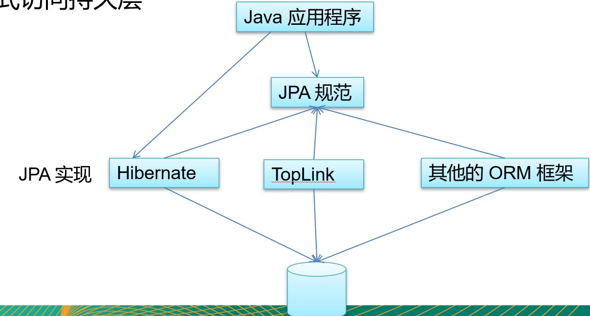
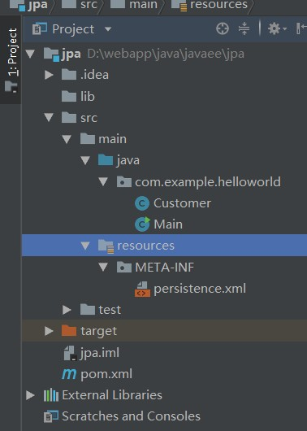
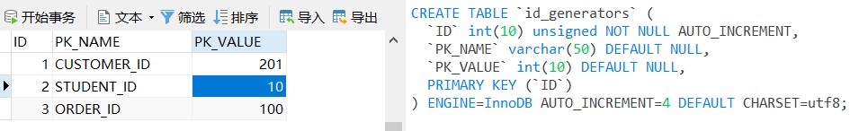
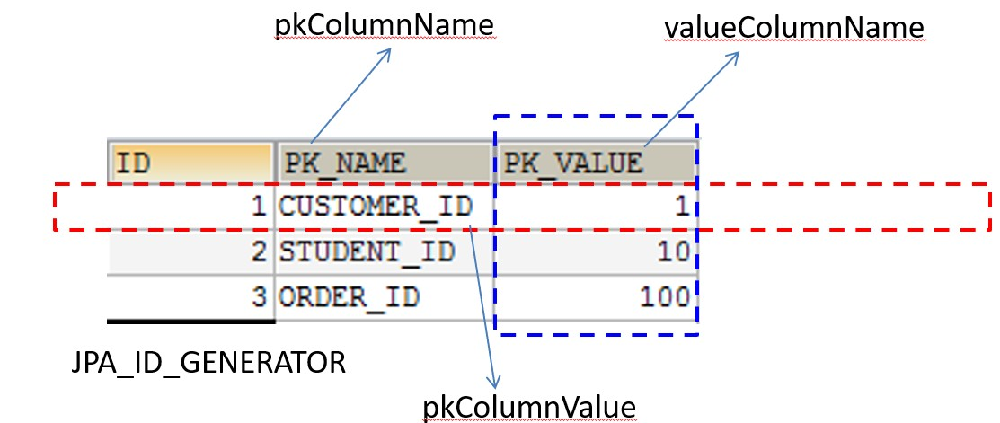
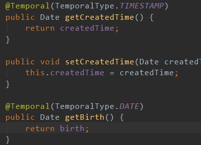
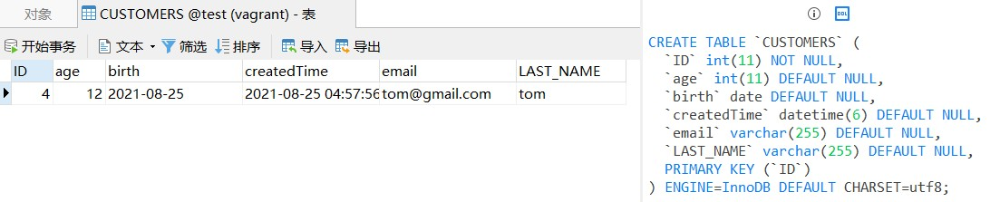
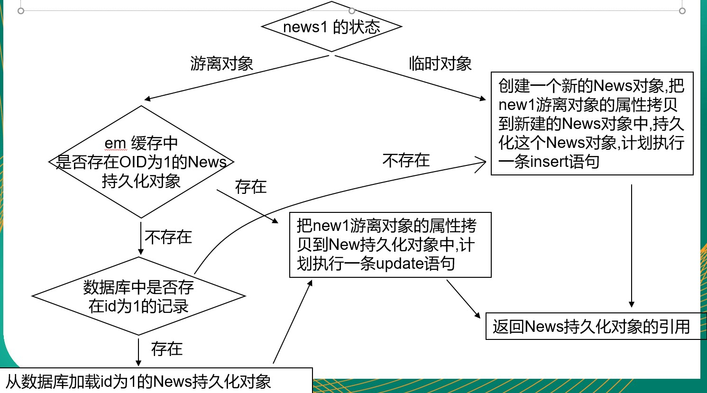
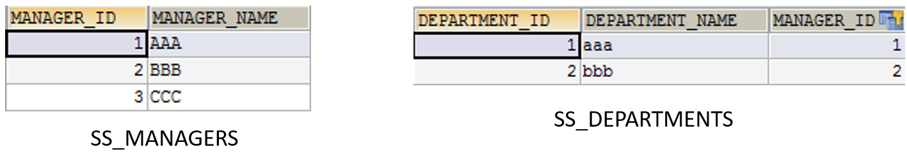
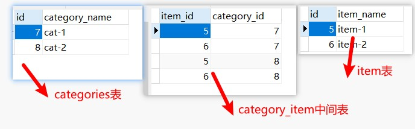

# JPA学习笔记

### JPA概述

> **JPA 是什么**
>
> * Java Persistence API：用于对象持久化的 API
> * Java EE 5.0 平台标准的 ORM 规范，使得应用程序以统一的方式访问持久层
>
> 
>
> **JPA和Hibernate的关系**
>
> * JPA 是 hibernate 的一个抽象（就像JDBC和JDBC驱动的关系）：
>   * JPA 是规范：JPA 本质上就是一种  ORM 规范，不是ORM 框架 —— 因为 JPA 并未提供 ORM 实现，它只是制订了一些规范，提供了一些编程的 API 接口，但具体实现则由 ORM 厂商提供实现
>   * Hibernate 是实现：Hibernate 除了作为 ORM 框架之外，它也是一种 JPA 实现
> * 从功能上来说， JPA 是 Hibernate 功能的一个子集
>
> **JPA 的供应商**
>
> * JPA 的目标之一是制定一个可以由很多供应商实现的 API，目前Hibernate 3.2+、TopLink 10.1+ 以及 OpenJPA 都提供了 JPA 的实现
> * Hibernate
>   * JPA 的始作俑者就是 Hibernate 的作者
>   * Hibernate 从 3.2 开始兼容 JPA
> * OpenJPA
>   * OpenJPA  是 Apache 组织提供的开源项目
> * TopLink
>   * TopLink 以前需要收费，如今开源了
>
> **JPA的优势**
>
> * 标准化:  提供相同的 API，这保证了基于JPA 开发的企业应用能够经过少量的修改就能够在不同的 JPA 框架下运行。
> * 简单易用，集成方便:  JPA 的主要目标之一就是提供更加简单的编程模型，在 JPA 框架下创建实体和创建 Java  类一样简单，只需要使用 javax.persistence.Entity 进行注释；JPA 的框架和接口也都非常简单
> * 可媲美JDBC的查询能力:  JPA的查询语言是面向对象的，JPA定义了独特的JPQL，而且能够支持批量更新和修改、JOIN、GROUP BY、HAVING 等通常只有 SQL 才能够提供的高级查询特性，甚至还能够支持子查询。
> * 支持面向对象的高级特性: JPA 中能够支持面向对象的高级特性，如类之间的继承、多态和类之间的复杂
>
> **JPA 包括 3方面的技术**
>
> * ORM  映射元数据：JPA 支持 XML 和  JDK 5.0 注解两种元数据的形式，元数据描述对象和表之间的映射关系，框架据此将实体对象持久化到数据库表中。  
> * JPA 的 API：用来操作实体对象，执行CRUD操作，框架在后台完成所有的事情，开发者从繁琐的 JDBC和 SQL代码中解脱出来。
> * 查询语言（JPQL）：这是持久化操作中很重要的一个方面，通过面向对象而非面向数据库的查询语言查询数据，避免程序和具体的  SQL 紧密耦合。
>
> **使用JPA持久化对象的步骤**
>
> * 创建 persistence.xml, 在这个文件中配置持久化单元
>   * 需要指定跟哪个数据库进行交互;
>   * 需要指定 JPA 使用哪个持久化的框架以及配置该框架的基本属性
> * 创建实体类, 使用 annotation 来描述实体类跟数据库表之间的映射关系.
> * 使用 JPA API 完成数据增加、删除、修改和查询操作
>   * 创建 EntityManagerFactory (对应 Hibernate 中的 SessionFactory);
>   * 创建 EntityManager (对应 Hibernate 中的Session);
>
> **入门示例**
>
> 项目结构图
>
> 
>
> pom.xml
>
> ```xml
> <?xml version="1.0" encoding="UTF-8"?>
> <project xmlns="http://maven.apache.org/POM/4.0.0"
>          xmlns:xsi="http://www.w3.org/2001/XMLSchema-instance"
>          xsi:schemaLocation="http://maven.apache.org/POM/4.0.0 http://maven.apache.org/xsd/maven-4.0.0.xsd">
>     <modelVersion>4.0.0</modelVersion>
> 
>     <groupId>groupId</groupId>
>     <artifactId>jpa</artifactId>
>     <version>1.0-SNAPSHOT</version>
> 
>     <dependencies>
>         <!--  hibernate 依赖 -->
>         <!-- https://mvnrepository.com/artifact/org.hibernate/hibernate-entitymanager -->
>         <dependency>
>             <groupId>org.hibernate</groupId>
>             <artifactId>hibernate-entitymanager</artifactId>
>             <version>5.4.1.Final</version>
>         </dependency>
> 
>         <!-- mysql 驱动 -->
>         <!-- https://mvnrepository.com/artifact/mysql/mysql-connector-java -->
>         <dependency>
>             <groupId>mysql</groupId>
>             <artifactId>mysql-connector-java</artifactId>
>             <version>8.0.13</version>
>         </dependency>
>     </dependencies>
> </project>
> ```
>
> persistence.xml
>
> ```xml
> <?xml version="1.0" encoding="UTF-8"?>
> <persistence xmlns="http://java.sun.com/xml/ns/persistence" version="2.0">
> 
>     <persistence-unit name="JPA-1" transaction-type="RESOURCE_LOCAL">
>         <!--
>         配置使用什么 ORM 产品来作为 JPA 的实现
>         1. 实际上配置的是  javax.persistence.spi.PersistenceProvider 接口的实现类
>         2. 若 JPA 项目中只有一个 JPA 的实现产品, 则也可以不配置该节点.
>         -->
>         <provider>org.hibernate.jpa.HibernatePersistenceProvider</provider>
> 
>         <!--添加持久化类-->
>         <class>com.example.helloworld.Customer</class>
>         <properties>
>             <!-- 连接数据库的基本信息 -->
>             <property name="javax.persistence.jdbc.driver" value="com.mysql.jdbc.Driver"/>
>             <property name="javax.persistence.jdbc.url" value="jdbc:mysql://192.168.0.199/test"/>
>             <property name="javax.persistence.jdbc.user" value="root"/>
>             <property name="javax.persistence.jdbc.password" value="root"/>
> 
>             <!-- 配置 JPA 实现产品的基本属性. 配置 hibernate 的基本属性 -->
>             <property name="hibernate.format_sql" value="true"/>
>             <property name="hibernate.show_sql" value="true"/>
>             <property name="hibernate.hbm2ddl.auto" value="update"/>
>         </properties>
>     </persistence-unit>
> </persistence>
> ```
>
> ```java
> package com.example.helloworld;
> import javax.persistence.*;
> 
> @Table(name = "CUSTOMERS")
> @Entity
> public class Customer {
> 
>     private Integer id;
>     private String lastName;
>     private String email;
>     private Integer age;
> 
>     @Column(name = "ID")
>     @GeneratedValue(strategy = GenerationType.AUTO)
>     @Id
>     public Integer getId() {
>         return id;
>     }
> 
>     public void setId(Integer id) {
>         this.id = id;
>     }
> 
>     @Column(name = "LAST_NAME")
>     public String getLastName() {
>         return lastName;
>     }
> 
>     public void setLastName(String lastName) {
>         this.lastName = lastName;
>     }
> 
>     /**
>      *  如果数据库字段名和属性名一致，则不用写@Column注解
>      */
>     public String getEmail() {
>         return email;
>     }
> 
>     public void setEmail(String email) {
>         this.email = email;
>     }
> 
>     public Integer getAge() {
>         return age;
>     }
> 
>     public void setAge(Integer age) {
>         this.age = age;
>     }
> }
> ```
>
> ```java
> package com.example.helloworld;
> import javax.persistence.EntityManager;
> import javax.persistence.EntityManagerFactory;
> import javax.persistence.EntityTransaction;
> import javax.persistence.Persistence;
> 
> public class Main {
> 
>     public static void main(String[] args) {
>         // 1. 创建EntityManagerFactory
>         String persistenceUnitName = "JPA-1";
>         EntityManagerFactory entityManagerFactory = Persistence.createEntityManagerFactory(persistenceUnitName);
>         // 2. 创建EntityManager
>         EntityManager entityManager = entityManagerFactory.createEntityManager();
>         // 3. 开启事务
>         EntityTransaction transaction = entityManager.getTransaction();
>         transaction.begin();
>         // 4. 进行持久化操作
>         Customer customer = new Customer();
>         customer.setAge(12);
>         customer.setEmail("tom@gmail.com");
>         customer.setLastName("tom");
>         entityManager.persist(customer);
>         // 5. 提交事务
>         transaction.commit();
>         // 6. 关闭EntityManager
>         entityManager.close();
>         // 7. 关闭EntityManagerFactory
>         entityManagerFactory.close();
>     }
> }
> ```

### JPA基本注解

> **@Entity**
>
> * @Entity 标注用于实体类声明语句之前，指出该Java 类为实体类，将映射到指定的数据库表。如声明一个实体类 Customer，它将映射到数据库中的 customer 表上。
>
> **@Table**
>
> * 当实体类与其映射的数据库表名不同名时需要使用 @Table 标注说明，该标注与 @Entity 标注并列使用，置于实体类声明语句之前，可写于单独语句行，也可与声明语句同行。
> * @Table 标注的常用选项是 name，用于指明数据库的表名
> * @Table标注还有两个选项 catalog 和 schema 用于设置表所属的数据库目录或模式，通常为数据库名。uniqueConstraints 选项用于设置约束条件，通常不须设置。
>
> **@Id**
>
> * @Id 标注用于声明一个实体类的属性映射为数据库的主键列。该属性通常置于属性声明语句之前，可与声明语句同行，也可写在单独行上。
> * @Id标注也可置于属性的getter方法之前。
>
> **@GeneratedValue**
>
> * @GeneratedValue  用于标注主键的生成策略，通过 strategy 属性指定。默认情况下，JPA 自动选择一个最适合底层数据库的主键生成策略：SqlServer 对应 identity，MySQL 对应 auto increment。
> * 在 javax.persistence.GenerationType 中定义了以下几种可供选择的策略：
>   * IDENTITY：采用数据库 ID自增长的方式来自增主键字段，Oracle 不支持这种方式；
>   
>   * AUTO： JPA自动选择合适的策略，是默认选项；
>   
>   * SEQUENCE：通过序列产生主键，通过 @SequenceGenerator 注解指定序列名，MySql 不支持这种方式
>   
>   * TABLE：通过表产生主键，框架借由表模拟序列产生主键，使用该策略可以使应用更易于数据库移植。
>   
>     * 将当前主键的值单独保存到一个数据库的表中，主键的值每次都是从指定的表中查询来获得
>     * 这种方法生成主键的策略可以适用于任何数据库，不必担心不同数据库不兼容造成的问题。
>   
>     ```java
>     @Column(name = "ID")
>     @TableGenerator(name = "ID_GENERATOR",table = "id_generators",pkColumnName = "PK_NAME",pkColumnValue = "CUSTOMER_ID",valueColumnName = "PK_VALUE",allocationSize = 100)
>     @GeneratedValue(strategy = GenerationType.TABLE,generator = "ID_GENERATOR")
>     @Id
>     public Integer getId() {
>         return id;
>     }
>     ```
>   
>     
>   
>     
>   
>     * name 属性表示该主键生成策略的名称，它被引用在@GeneratedValue中设置的generator 值中
>     * table 属性表示表生成策略所持久化的表名
>     * pkColumnName 属性的值表示在持久化表中，该主键生成策略所对应键值的名称
>     * valueColumnName 属性的值表示在持久化表中，该主键当前所生成的值，它的值将会随着每次创建累加
>     * pkColumnValue 属性的值表示在持久化表中，该生成策略所对应的主键
>     * allocationSize 表示每次主键值增加的大小, 默认值为 50
>
> **@Basic**
>
> * @Basic 表示一个简单的属性到数据库表的字段的映射,对于没有任何标注的 getXxxx() 方法,默认即为@Basic
> * fetch: 表示该属性的读取策略,有 EAGER 和 LAZY 两种,分别表示主支抓取和延迟加载,默认为 EAGER.
> * optional:表示该属性是否允许为null, 默认为true
>
> **@Column**
>
> * 当实体的属性与其映射的数据库表的列不同名时需要使用@Column 标注说明，该属性通常置于实体的属性声明语句之前，还可与 @Id 标注一起使用。
> * @Column 标注的常用属性是 name，用于设置映射数据库表的列名。此外，该标注还包含其它多个属性，如：unique 、nullable、length 等。
> * @Column 标注的 columnDefinition 属性: 表示该字段在数据库中的实际类型.通常 ORM 框架可以根据属性类型自动判断数据库中字段的类型,但是对于Date类型仍无法确定数据库中字段类型究竟是DATE,TIME还是TIMESTAMP.此外,String的默认映射类型为VARCHAR, 如果要将 String 类型映射到特定数据库的 BLOB 或TEXT 字段类型.
> * @Column标注也可置于属性的getter方法之前
>
> **@Transient**
>
> * 表示该属性并非一个到数据库表的字段的映射,ORM框架将忽略该属性.
> * 如果一个属性并非数据库表的字段映射,就务必将其标示为@Transient,否则,ORM框架默认其注解为@Basic
>
> **@Temporal**
>
> * 在核心的 Java API 中并没有定义 Date 类型的精度(temporal precision).  而在数据库中,表示 Date 类型的数据有 DATE, TIME, 和 TIMESTAMP 三种精度(即单纯的日期,时间,或者两者 兼备). 在进行属性映射时可使用@Temporal注解来调整精度.
>
> 
>
> 

### JPA的API

##### Persistence

> **JPA相关接口/类：Persistence**
>
> * Persistence  类是用于获取 EntityManagerFactory 实例。该类包含一个名为 createEntityManagerFactory 的 静态方法 。
> * createEntityManagerFactory 方法有如下两个重载版本。
>   * 带有一个参数的方法以 JPA 配置文件 persistence.xml 中的持久化单元名为参数
>   * 带有两个参数的方法：前一个参数含义相同，后一个参数 Map类型，用于设置 JPA 的相关属性，这时将忽略其它地方设置的属性。Map 对象的属性名必须是 JPA 实现库提供商的名字空间约定的属性名。

##### EntityManagerFactory

> **EntityManagerFactory**
>
> * EntityManagerFactory 接口主要用来创建 EntityManager 实例。该接口约定了如下4个方法：
>   * createEntityManager()：用于创建实体管理器对象实例。
>   * createEntityManager(Map map)：用于创建实体管理器对象实例的重载方法，Map 参数用于提供 EntityManager 的属性。
>   * isOpen()：检查 EntityManagerFactory 是否处于打开状态。实体管理器工厂创建后一直处于打开状态，除非调用close()方法将其关闭。
>   * close()：关闭 EntityManagerFactory 。 EntityManagerFactory 关闭后将释放所有资源，isOpen()方法测试将返回 false，其它方法将不能调用，否则将导致IllegalStateException异常。

##### EntityManager

> **EntityManager**
>
> * 在 JPA 规范中, EntityManager 是完成持久化操作的核心对象。实体作为普通 Java 对象，只有在调用 EntityManager 将其持久化后才会变成持久化对象。EntityManager 对象在一组实体类与底层数据源之间进行 O/R 映射的管理。它可以用来管理和更新 Entity Bean, 根椐主键查找 Entity Bean, 还可以通过JPQL语句查询实体。
>
> * 实体的状态:
>
>   * 新建状态:   新创建的对象，尚未拥有持久性主键。
>   * 持久化状态：已经拥有持久性主键并和持久化建立了上下文环境
>   * 游离状态：拥有持久化主键，但是没有与持久化建立上下文环境
>   * 删除状态:  拥有持久化主键，已经和持久化建立上下文环境，但是从数据库中删除。
>
> * 常用方法：
>
>   * find (Class<T> entityClass,Object primaryKey)：返回指定的 OID 对应的实体类对象，如果这个实体存在于当前的持久化环境，则返回一个被缓存的对象；否则会创建一个新的 Entity, 并加载数据库中相关信息；若 OID 不存在于数据库中，则返回一个 null。第一个参数为被查询的实体类类型，第二个参数为待查找实体的主键值。
>   * getReference (Class<T> entityClass,Object primaryKey)：与find()方法类似，不同的是：如果缓存中不存在指定的 Entity, EntityManager 会创建一个 Entity 类的代理，但是不会立即加载数据库中的信息，只有第一次真正使用此 Entity 的属性才加载，所以如果此 OID 在数据库不存在，getReference() 不会返回 null 值, 而是抛出EntityNotFoundException
>   * persist (Object entity)：用于将新创建的 Entity 纳入到 EntityManager 的管理。该方法执行后，传入 persist() 方法的 Entity 对象转换成持久化状态。
>     * 如果传入 persist() 方法的 Entity 对象已经处于持久化状态，则 persist() 方法什么都不做。
>     * 如果对删除状态的 Entity 进行 persist() 操作，会转换为持久化状态。
>     * 如果对游离状态的实体执行 persist() 操作，可能会在 persist() 方法抛出 EntityExistException(也有可能是在flush或事务提交后抛出)。
>   * remove (Object entity)：删除实例。如果实例是被管理的，即与数据库实体记录关联，则同时会删除关联的数据库记录。
>   * merge (T entity)：merge() 用于处理 Entity 的同步。即数据库的插入和更新操作
>     * 
>   * flush ()：同步持久上下文环境，即将持久上下文环境的所有未保存实体的状态信息保存到数据库中。
>   * setFlushMode (FlushModeType flushMode)：设置持久上下文环境的Flush模式。参数可以取2个枚举
>     * FlushModeType.AUTO 为自动更新数据库实体
>     * FlushModeType.COMMIT 为直到提交事务时才更新数据库记录。
>   * getFlushMode ()：获取持久上下文环境的Flush模式。返回FlushModeType类的枚举值。
>   * refresh (Object entity)：用数据库实体记录的值更新实体对象的状态，即更新实例的属性值。
>   * clear ()：清除持久上下文环境，断开所有关联的实体。如果这时还有未提交的更新则会被撤消。
>   * contains (Object entity)：判断一个实例是否属于当前持久上下文环境管理的实体。
>   * isOpen ()：判断当前的实体管理器是否是打开状态。
>   * getTransaction ()：返回资源层的事务对象。EntityTransaction实例可以用于开始和提交多个事务。
>   * close ()：关闭实体管理器。之后若调用实体管理器实例的方法或其派生的查询对象的方法都将抛出 IllegalstateException 异常，除了getTransaction 和 isOpen方法(返回 false)。不过，当与实体管理器关联的事务处于活动状态时，调用 close 方法后持久上下文将仍处于被管理状态，直到事务完成。
>   * createQuery (String qlString)：创建一个查询对象。
>   * createNamedQuery (String name)：根据命名的查询语句块创建查询对象。参数为命名的查询语句。
>   * createNativeQuery (String sqlString)：使用标准 SQL语句创建查询对象。参数为标准SQL语句字符串。
>   * createNativeQuery (String sqls, String resultSetMapping)：使用标准SQL语句创建查询对象，并指定返回结果集 Map的 名称。
>
> ```xml
> <?xml version="1.0" encoding="UTF-8"?>
> <persistence xmlns="http://java.sun.com/xml/ns/persistence" version="2.0">
>     <persistence-unit name="JPA-1" transaction-type="RESOURCE_LOCAL">
>         <!--
>         配置使用什么 ORM 产品来作为 JPA 的实现
>         1. 实际上配置的是  javax.persistence.spi.PersistenceProvider 接口的实现类
>         2. 若 JPA 项目中只有一个 JPA 的实现产品, 则也可以不配置该节点.
>         -->
>         <provider>org.hibernate.jpa.HibernatePersistenceProvider</provider>
> 
>         <!--添加持久化类-->
>         <class>com.example.helloworld.Customer</class>
>         <properties>
>             <!-- 连接数据库的基本信息 -->
>             <property name="javax.persistence.jdbc.driver" value="com.mysql.jdbc.Driver"/>
>             <property name="javax.persistence.jdbc.url" value="jdbc:mysql://192.168.0.199/test"/>
>             <property name="javax.persistence.jdbc.user" value="root"/>
>             <property name="javax.persistence.jdbc.password" value="root"/>
> 
>             <!-- 配置 JPA 实现产品的基本属性. 配置 hibernate 的基本属性 -->
>             <property name="hibernate.format_sql" value="true"/>
>             <property name="hibernate.show_sql" value="true"/>
>             <property name="hibernate.hbm2ddl.auto" value="update"/>
>         </properties>
>     </persistence-unit>
> </persistence>
> ```
>
> ```java
> package com.example.helloworld;
> import javax.persistence.*;
> import java.util.Date;
> 
> @Table(name = "CUSTOMERS")
> @Entity
> public class Customer {
> 
>     private Integer id;
>     private String lastName;
>     private String email;
>     private Integer age;
>     private Date createdTime;
>     private Date birth;
> 
>     @Column(name = "ID")
>     @GeneratedValue(strategy = GenerationType.AUTO)
>     @Id
>     public Integer getId() {
>         return id;
>     }
> 
>     public void setId(Integer id) {
>         this.id = id;
>     }
> 
>     @Column(name = "LAST_NAME")
>     public String getLastName() {
>         return lastName;
>     }
> 
>     public void setLastName(String lastName) {
>         this.lastName = lastName;
>     }
> 
>     /**
>      *  如果数据库字段名和属性名一致，则不用写@Column注解
>      */
>     public String getEmail() {
>         return email;
>     }
> 
>     public void setEmail(String email) {
>         this.email = email;
>     }
> 
>     public Integer getAge() {
>         return age;
>     }
> 
>     public void setAge(Integer age) {
>         this.age = age;
>     }
> 
>     @Transient
>     public String getInfo(){
>         return "lastName : " + lastName + " email : " + email;
>     }
> 
>     @Temporal(TemporalType.TIMESTAMP)
>     public Date getCreatedTime() {
>         return createdTime;
>     }
> 
>     public void setCreatedTime(Date createdTime) {
>         this.createdTime = createdTime;
>     }
> 
>     @Temporal(TemporalType.DATE)
>     public Date getBirth() {
>         return birth;
>     }
> 
>     public void setBirth(Date birth) {
>         this.birth = birth;
>     }
> 
>     @Override
>     public String toString() {
>         return "Customer{" +
>                 "id=" + id +
>                 ", lastName='" + lastName + '\'' +
>                 ", email='" + email + '\'' +
>                 ", age=" + age +
>                 ", createdTime=" + createdTime +
>                 ", birth=" + birth +
>                 '}';
>     }
> }
> ```
>
> ```java
> package com.example.test;
> import com.example.helloworld.Customer;
> import org.junit.After;
> import org.junit.Before;
> import org.junit.Test;
> import javax.persistence.EntityManager;
> import javax.persistence.EntityManagerFactory;
> import javax.persistence.EntityTransaction;
> import javax.persistence.Persistence;
> import java.util.Date;
> 
> public class JPATest {
> 
>     private EntityManagerFactory entityManagerFactory;
>     private EntityManager entityManager;
>     private EntityTransaction transaction;
> 
>     @Before
>     public void init(){
>         entityManagerFactory = Persistence.createEntityManagerFactory("JPA-1");
>         entityManager = entityManagerFactory.createEntityManager();
>         transaction = entityManager.getTransaction();
>         transaction.begin();
>     }
> 
>     @After
>     public void destroy(){
>         transaction.commit();
>         entityManager.close();
>         entityManagerFactory.close();
>     }
> 
>     /**
>      *  类似于hibernate中Session的get方法，直接发送SQL语句
>      */
>     @Test
>     public void testFind(){
>         Customer customer = entityManager.find(Customer.class, 1);
>         System.out.println(customer);
>     }
> 
>     /**
>      *  类似于Hibernate中Session的load方法，获取的是Customer对象一个代理类，当真正用到这个对象时，才会发送SQL语句(懒加载)
>      */
>     @Test
>     public void testGetReference(){
>         Customer customer = entityManager.getReference(Customer.class, 1);
>         System.out.println(customer);
>     }
> 
>     /**
>      *   类似于Hibernate的save方法，使对象由临时状态变为持久化状态
>      *   和Hibernate的save方法的不同之处：若对象有id，则不能执行insert操作，而会抛出异常
>      */
>     @Test
>     public void testPersist(){
>         Customer customer = new Customer();
>         customer.setAge(15);
>         customer.setBirth(new Date());
>         customer.setCreatedTime(new Date());
>         customer.setEmail("bb@163.com");
>         customer.setLastName("bb");
>         entityManager.persist(customer);
>         System.out.println(customer.getId());
>     }
> 
>     /**
>      *  类似于Hibernate的delete方法，把对象对应的记录从数据库中移除
>      *  注意：该方法只能移除持久化对象，而Hibernate的delete方法实际上还可以移除游离对象
>      */
>     @Test
>     public void testRemove(){
>         Customer customer = entityManager.find(Customer.class, 5);
>         entityManager.remove(customer);
>     }
> 
>     /**
>      *  总的来说：类似于Hibernate Session的saveOrUpdate方法
>      *  1. 若传入的是一个临时对象，会创建一个新的对象，把临时对象的属性复制到新的对象中，然后对新的对象执行持久化操作
>      *      所以新的对象中有id,但以前的临时对象中没有id
>      *  2. 若传入的是一个游离对象，即传入的对象有OID
>      *      (1) 若在EntityManager缓存中没有该对象，并且在数据库中也没有对应的记录，则JPA会创建一个新的对象，然后把当前游离对象的属性复制到新的对象，然后对新创建的对象执行insert操作
>      *     （2）若在EntityManager缓存中没有该对象,并且在数据库中有对应的记录，JPA会查询对应的记录，然后返回该记录对应的对象，再然后会把游离对象的属性复制到查询到的对象中，对查询到的对象执行update操作
>      *     （3）若在EntityManager缓存中有该对象，JPA会把游离对象的属性复制到EntityManager缓存中的对象，然后对EntityManager缓存中的对象执行update
>      */
>     @Test
>     public void testMerge1(){
>         Customer customer = new Customer();
>         customer.setAge(18);
>         customer.setBirth(new Date());
>         customer.setCreatedTime(new Date());
>         customer.setEmail("cc@163.com");
>         customer.setLastName("CC");
>         Customer customer1 = entityManager.merge(customer);
>         System.out.println(" customer id : " + customer.getId());
>         System.out.println("customer1 id : " + customer1.getId());
>     }
> 
>     @Test
>     public void testMerge2(){
>         Customer customer = new Customer();
>         customer.setAge(18);
>         customer.setBirth(new Date());
>         customer.setCreatedTime(new Date());
>         customer.setEmail("dd@163.com");
>         customer.setLastName("DD");
>         customer.setId(6);
>         Customer customer1 = entityManager.merge(customer);
>         System.out.println(" customer id : " + customer.getId());
>         System.out.println("customer1 id : " + customer1.getId());
>     }
> 
>     @Test
>     public void testMerge3(){
>         Customer customer = new Customer();
>         customer.setAge(18);
>         customer.setBirth(new Date());
>         customer.setCreatedTime(new Date());
>         customer.setEmail("EE@163.com");
>         customer.setLastName("EE");
>         customer.setId(6);
> 
>         Customer customer1 = entityManager.find(Customer.class, 6);
>         entityManager.merge(customer);
>     }
> 
>     /**
>      * 同Hibernate中Session的flush方法
>      */
>     @Test
>     public void testFlush(){
>         Customer customer = entityManager.find(Customer.class, 1);
>         System.out.println(customer);
>         customer.setLastName("AA");
>         entityManager.flush();
>     }
> 
>     /**
>      * 同Hibernate中Session的refresh方法
>      */
>     @Test
>     public void testRefresh(){
>         Customer customer = entityManager.find(Customer.class, 1);
>         customer = entityManager.find(Customer.class, 1);
>         entityManager.refresh(customer);
>     }
> }
> ```

##### EntityTransaction

> **概念**
>
> * EntityTransaction 接口用来管理资源层实体管理器的事务操作。通过调用实体管理器的getTransaction方法 获得其实例。
> * 常用方法：
>   * begin ()：用于启动一个事务，此后的多个数据库操作将作为整体被提交或撤消。若这时事务已启动则会抛出 IllegalStateException 异常。
>   * commit ()：用于提交当前事务。即将事务启动以后的所有数据库更新操作持久化至数据库中。
>   * rollback ()：撤消(回滚)当前事务。即撤消事务启动后的所有数据库更新操作，从而不对数据库产生影响。
>   * setRollbackOnly ()：使当前事务只能被撤消。
>   * getRollbackOnly ()：查看当前事务是否设置了只能撤消标志。
>   * isActive ()：查看当前事务是否是活动的。如果返回true则不能调用begin方法，否则将抛出 IllegalStateException 异常；如果返回 false 则不能调用 commit、rollback、setRollbackOnly 及 getRollbackOnly 方法，否则将抛出 IllegalStateException 异常。

### 映射关联关系

##### 单向多对一

> ```xml
> 
> <?xml version="1.0" encoding="UTF-8"?>
> <persistence xmlns="http://java.sun.com/xml/ns/persistence" version="2.0">
>     <persistence-unit name="JPA-1" transaction-type="RESOURCE_LOCAL">
>         <!--
>         配置使用什么 ORM 产品来作为 JPA 的实现
>         1. 实际上配置的是  javax.persistence.spi.PersistenceProvider 接口的实现类
>         2. 若 JPA 项目中只有一个 JPA 的实现产品, 则也可以不配置该节点.
>         -->
>         <provider>org.hibernate.jpa.HibernatePersistenceProvider</provider>
> 
>         <!--添加持久化类-->
>         <class>com.example.helloworld.Customer</class>
>         <class>com.example.helloworld.Order</class>
>         <properties>
>             <!-- 连接数据库的基本信息 -->
>             <property name="javax.persistence.jdbc.driver" value="com.mysql.jdbc.Driver"/>
>             <property name="javax.persistence.jdbc.url" value="jdbc:mysql://192.168.0.199/test"/>
>             <property name="javax.persistence.jdbc.user" value="root"/>
>             <property name="javax.persistence.jdbc.password" value="root"/>
> 
>             <!-- 配置 JPA 实现产品的基本属性. 配置 hibernate 的基本属性 -->
>             <property name="hibernate.format_sql" value="true"/>
>             <property name="hibernate.show_sql" value="true"/>
>             <property name="hibernate.hbm2ddl.auto" value="update"/>
>         </properties>
>     </persistence-unit>
> </persistence>
> ```
>
> ```java
> package com.example.helloworld;
> 
> import javax.persistence.*;
> import java.util.Date;
> 
> @Table(name = "CUSTOMERS")
> @Entity
> public class Customer {
> 
>     private Integer id;
>     private String lastName;
>     private String email;
>     private Integer age;
>     private Date createdTime;
>     private Date birth;
> 
>     @Column(name = "ID")
>     @GeneratedValue(strategy = GenerationType.AUTO)
>     @Id
>     public Integer getId() {
>         return id;
>     }
> 
>     public void setId(Integer id) {
>         this.id = id;
>     }
> 
>     @Column(name = "LAST_NAME")
>     public String getLastName() {
>         return lastName;
>     }
> 
>     public void setLastName(String lastName) {
>         this.lastName = lastName;
>     }
> 
>     /**
>      *  如果数据库字段名和属性名一致，则不用写@Column注解
>      */
>     public String getEmail() {
>         return email;
>     }
> 
>     public void setEmail(String email) {
>         this.email = email;
>     }
> 
>     public Integer getAge() {
>         return age;
>     }
> 
>     public void setAge(Integer age) {
>         this.age = age;
>     }
> 
>     @Transient
>     public String getInfo(){
>         return "lastName : " + lastName + " email : " + email;
>     }
> 
>     @Temporal(TemporalType.TIMESTAMP)
>     public Date getCreatedTime() {
>         return createdTime;
>     }
> 
>     public void setCreatedTime(Date createdTime) {
>         this.createdTime = createdTime;
>     }
> 
>     @Temporal(TemporalType.DATE)
>     public Date getBirth() {
>         return birth;
>     }
> 
>     public void setBirth(Date birth) {
>         this.birth = birth;
>     }
> 
>     @Override
>     public String toString() {
>         return "Customer{" +
>                 "id=" + id +
>                 ", lastName='" + lastName + '\'' +
>                 ", email='" + email + '\'' +
>                 ", age=" + age +
>                 ", createdTime=" + createdTime +
>                 ", birth=" + birth +
>                 '}';
>     }
> }
> ```
>
> ```java
> package com.example.helloworld;
> import javax.persistence.*;
> 
> @Table(name = "ORDERS")
> @Entity
> public class Order {
>     private Integer id;
>     private String orderName;
>     private Customer customer;
> 
>     @GeneratedValue
>     @Id
>     public Integer getId() {
>         return id;
>     }
> 
>     public void setId(Integer id) {
>         this.id = id;
>     }
> 
>     @Column(name = "ORDER_NAME")
>     public String getOrderName() {
>         return orderName;
>     }
> 
>     public void setOrderName(String orderName) {
>         this.orderName = orderName;
>     }
> 
>     /**
>      *  映射单向1-n关联关系
>      *  使用@ManyToOne来映射多对一的关联关系
>      *  使用@JoinColumn来映射外键
>      *  可以使用@ManyToOne的fetch属性来修改默认的关联属性的加载策略
>      * @return
>      */
>     @JoinColumn(name = "CUSTOMER_ID")
>     @ManyToOne(fetch = FetchType.LAZY)
>     public Customer getCustomer() {
>         return customer;
>     }
> 
>     public void setCustomer(Customer customer) {
>         this.customer = customer;
>     }
> }
> ```
>
> ```java
> package com.example.test;
> import com.example.helloworld.Customer;
> import com.example.helloworld.Order;
> import org.junit.After;
> import org.junit.Before;
> import org.junit.Test;
> import javax.persistence.EntityManager;
> import javax.persistence.EntityManagerFactory;
> import javax.persistence.EntityTransaction;
> import javax.persistence.Persistence;
> import java.util.Date;
> 
> public class JPATest {
> 
>     private EntityManagerFactory entityManagerFactory;
>     private EntityManager entityManager;
>     private EntityTransaction transaction;
> 
>     @Before
>     public void init(){
>         entityManagerFactory = Persistence.createEntityManagerFactory("JPA-1");
>         entityManager = entityManagerFactory.createEntityManager();
>         transaction = entityManager.getTransaction();
>         transaction.begin();
>     }
> 
>     @After
>     public void destroy(){
>         transaction.commit();
>         entityManager.close();
>         entityManagerFactory.close();
>     }
> 
>     /**
>      *  保存多对一关联关系时，建议先保存1的一端，后保存n的一端，这样不会多出额外的update语句
>      */
>     @Test
>     public void testManyToOne(){
>         Customer customer = new Customer();
>         customer.setAge(18);
>         customer.setBirth(new Date());
>         customer.setCreatedTime(new Date());
>         customer.setEmail("lucy@gmail.com");
>         customer.setLastName("lucy");
> 
>         Order order1 = new Order();
>         order1.setOrderName("order-1");
> 
>         Order order2 = new Order();
>         order2.setOrderName("order-2");
> 
>         // 设置关联关系
>         order1.setCustomer(customer);
>         order2.setCustomer(customer);
>         // 执行保存操作
>         entityManager.persist(customer);
>         entityManager.persist(order1);
>         entityManager.persist(order2);
>     }
> 
>     /**
>      *  默认情况下使用左外连接的方式来获取n的一端的对象和其关联的1的一端的对象
>      */
>     @Test
>     public void testManyToOneFind(){
>         Order order = entityManager.find(Order.class, 9);
>         System.out.println(order.getOrderName());
>         System.out.println(order.getCustomer().getLastName());
>     }
> 
>     /**
>      *  不能直接删除1的一端，因为有外键约束
>      */
>     @Test
>     public void testManyToOneRemove(){
> //        Order order = entityManager.find(Order.class, 9);
> //        entityManager.remove(order);
>         Customer customer = entityManager.find(Customer.class, 8);
>         entityManager.remove(customer);
>     }
> 
>     @Test
>     public void testManyToOneUpdate(){
>         Order order = entityManager.find(Order.class, 10);
>         order.getCustomer().setLastName("charles");
>     }
> 
> }
> ```

##### 单向一对多

> ```java
> package com.example.helloworld;
> import javax.persistence.*;
> import java.util.Date;
> import java.util.HashSet;
> import java.util.Set;
> 
> @Table(name = "CUSTOMERS")
> @Entity
> public class Customer {
> 
>     private Integer id;
>     private String lastName;
>     private String email;
>     private Integer age;
>     private Date createdTime;
>     private Date birth;
>     private Set<Order> orders = new HashSet<Order>();
> 
>     @Column(name = "ID")
>     @GeneratedValue(strategy = GenerationType.AUTO)
>     @Id
>     public Integer getId() {
>         return id;
>     }
> 
>     public void setId(Integer id) {
>         this.id = id;
>     }
> 
>     @Column(name = "LAST_NAME")
>     public String getLastName() {
>         return lastName;
>     }
> 
>     public void setLastName(String lastName) {
>         this.lastName = lastName;
>     }
> 
>     /**
>      *  如果数据库字段名和属性名一致，则不用写@Column注解
>      */
>     public String getEmail() {
>         return email;
>     }
> 
>     public void setEmail(String email) {
>         this.email = email;
>     }
> 
>     public Integer getAge() {
>         return age;
>     }
> 
>     public void setAge(Integer age) {
>         this.age = age;
>     }
> 
>     @Temporal(TemporalType.TIMESTAMP)
>     public Date getCreatedTime() {
>         return createdTime;
>     }
> 
>     public void setCreatedTime(Date createdTime) {
>         this.createdTime = createdTime;
>     }
> 
>     @Temporal(TemporalType.DATE)
>     public Date getBirth() {
>         return birth;
>     }
> 
>     public void setBirth(Date birth) {
>         this.birth = birth;
>     }
> 
>     /**
>      *  映射单向1-n关联关系
>      *  使用@OneToMany来映射1-n的关联关系
>      *  使用@JoinColumn来映射外键列的名称
>      *  可以使用@OneToMany的fetch属性来修改默认的加载策略
>      * @return
>      */
>     @JoinColumn(name = "CUSTOMER_ID")
>     @OneToMany(fetch = FetchType.EAGER,cascade = {CascadeType.REMOVE})
>     public Set<Order> getOrders() {
>         return orders;
>     }
> 
>     public void setOrders(Set<Order> orders) {
>         this.orders = orders;
>     }
> 
>     @Transient
>     public String getInfo(){
>         return "lastName : " + lastName + " email : " + email;
>     }
> 
>     @Override
>     public String toString() {
>         return "Customer{" +
>                 "id=" + id +
>                 ", lastName='" + lastName + '\'' +
>                 ", email='" + email + '\'' +
>                 ", age=" + age +
>                 ", createdTime=" + createdTime +
>                 ", birth=" + birth +
>                 '}';
>     }
> }
> ```
>
> ```java
> package com.example.helloworld;
> import javax.persistence.*;
> 
> @Table(name = "ORDERS")
> @Entity
> public class Order {
>     private Integer id;
>     private String orderName;
> 
>     @GeneratedValue
>     @Id
>     public Integer getId() {
>         return id;
>     }
> 
>     public void setId(Integer id) {
>         this.id = id;
>     }
> 
>     @Column(name = "ORDER_NAME")
>     public String getOrderName() {
>         return orderName;
>     }
> 
>     public void setOrderName(String orderName) {
>         this.orderName = orderName;
>     }
> }
> ```
>
> ```java
> package com.example.test;
> import com.example.helloworld.Customer;
> import com.example.helloworld.Order;
> import org.junit.After;
> import org.junit.Before;
> import org.junit.Test;
> import javax.persistence.EntityManager;
> import javax.persistence.EntityManagerFactory;
> import javax.persistence.EntityTransaction;
> import javax.persistence.Persistence;
> import java.util.Date;
> 
> public class JPATest {
> 
>     private EntityManagerFactory entityManagerFactory;
>     private EntityManager entityManager;
>     private EntityTransaction transaction;
> 
>     @Before
>     public void init(){
>         entityManagerFactory = Persistence.createEntityManagerFactory("JPA-1");
>         entityManager = entityManagerFactory.createEntityManager();
>         transaction = entityManager.getTransaction();
>         transaction.begin();
>     }
> 
>     @After
>     public void destroy(){
>         transaction.commit();
>         entityManager.close();
>         entityManagerFactory.close();
>     }
> 
>     /**
>      *  单向1-n关联关系执行保存时，一定会多出update语句
>      *  因为n的一端在插入时不会同时插入外键列
>      */
>     @Test
>     public void testOneToManyPersist(){
>         Customer customer = new Customer();
>         customer.setAge(18);
>         customer.setBirth(new Date());
>         customer.setCreatedTime(new Date());
>         customer.setEmail("tom@gmail.com");
>         customer.setLastName("tom");
> 
>         Order order1 = new Order();
>         order1.setOrderName("order-1");
> 
>         Order order2 = new Order();
>         order2.setOrderName("order-2");
> 
>         // 设置关联关系
>         customer.getOrders().add(order1);
>         customer.getOrders().add(order2);
>         // 执行保存操作
>         entityManager.persist(customer);
>         entityManager.persist(order1);
>         entityManager.persist(order2);
>     }
> 
>     /**
>      *  默认对关联的多的一方，使用懒加载
>      */
>     @Test
>     public void testOneToManyFind(){
>         Customer customer = entityManager.find(Customer.class, 11);
>         System.out.println(customer.getLastName());
>         System.out.println(customer.getOrders().size());
>     }
> 
>     /**
>      *  默认情况下，若删除1的一端，则会把关联的n的一端的外键置空，然后进行删除
>      *  可以通过修改OneToMany的cascade属性来修改默认的删除策略，实现级联删除
>      */
>     @Test
>     public void testOneToManyRemove(){
>         Customer customer = entityManager.find(Customer.class, 8);
>         entityManager.remove(customer);
>     }
> 
>     @Test
>     public void testOneToManyUpdate(){
>         Customer customer = entityManager.find(Customer.class, 14);
>         customer.getOrders().iterator().next().setOrderName("order-1-update");
>     }
> }
> ```

##### 双向一对多
> **双向一对多及多对一映射**
>
> * 双向一对多关系中，必须存在一个关系维护端，在 JPA 规范中，要求  many 的一方作为关系的维护端(owner side), one 的一方作为被维护端(inverse side)。
> * 可以在 one 方指定 @OneToMany 注释并设置 mappedBy 属性，以指定它是这一关联中的被维护端，many 为维护端。
> * 在 many 方指定 @ManyToOne 注释，并使用 @JoinColumn 指定外键名称
>
> ```java
> package com.example.helloworld;
> 
> import javax.persistence.*;
> import java.util.Date;
> import java.util.HashSet;
> import java.util.Set;
> 
> @Table(name = "CUSTOMERS")
> @Entity
> public class Customer {
> 
>  private Integer id;
>  private String lastName;
>  private String email;
>  private Integer age;
>  private Date createdTime;
>  private Date birth;
>  private Set<Order> orders = new HashSet<Order>();
> 
>  @Column(name = "ID")
>  @GeneratedValue(strategy = GenerationType.AUTO)
>  @Id
>  public Integer getId() {
>      return id;
>  }
> 
>  public void setId(Integer id) {
>      this.id = id;
>  }
> 
>  @Column(name = "LAST_NAME")
>  public String getLastName() {
>      return lastName;
>  }
> 
>  public void setLastName(String lastName) {
>      this.lastName = lastName;
>  }
> 
>  /**
>      *  如果数据库字段名和属性名一致，则不用写@Column注解
>      */
>     public String getEmail() {
>         return email;
>     }
> 
>     public void setEmail(String email) {
>         this.email = email;
>     }
> 
>     public Integer getAge() {
>         return age;
>     }
> 
>     public void setAge(Integer age) {
>         this.age = age;
>     }
> 
>     @Temporal(TemporalType.TIMESTAMP)
>     public Date getCreatedTime() {
>         return createdTime;
>     }
> 
>     public void setCreatedTime(Date createdTime) {
>         this.createdTime = createdTime;
>     }
> 
>     @Temporal(TemporalType.DATE)
>     public Date getBirth() {
>         return birth;
>     }
> 
>     public void setBirth(Date birth) {
>         this.birth = birth;
>     }
> 
>     /**
>      *  映射单向1-n关联关系
>      *  使用@OneToMany来映射1-n的关联关系
>      *  使用@JoinColumn来映射外键列的名称
>      *  可以使用@OneToMany的fetch属性来修改默认的加载策略
>      *
>      * @return
>      */
> //    @JoinColumn(name = "CUSTOMER_ID")
>     @OneToMany(fetch = FetchType.EAGER,cascade = {CascadeType.REMOVE},mappedBy = "customer")
>     public Set<Order> getOrders() {
>         return orders;
>     }
> 
>     public void setOrders(Set<Order> orders) {
>         this.orders = orders;
>     }
> 
>     @Transient
>     public String getInfo(){
>         return "lastName : " + lastName + " email : " + email;
>     }
> 
>     @Override
>     public String toString() {
>         return "Customer{" +
>                 "id=" + id +
>                 ", lastName='" + lastName + '\'' +
>                 ", email='" + email + '\'' +
>                 ", age=" + age +
>                 ", createdTime=" + createdTime +
>                 ", birth=" + birth +
>                 '}';
>     }
> }
> ```
>
> ```java
> package com.example.helloworld;
> 
> import javax.persistence.*;
> 
> @Table(name = "ORDERS")
> @Entity
> public class Order {
>     private Integer id;
>     private String orderName;
>     private Customer customer;
> 
>     @GeneratedValue
>     @Id
>     public Integer getId() {
>         return id;
>     }
> 
>     public void setId(Integer id) {
>         this.id = id;
>     }
> 
>     @Column(name = "ORDER_NAME")
>     public String getOrderName() {
>         return orderName;
>     }
> 
>     public void setOrderName(String orderName) {
>         this.orderName = orderName;
>     }
> 
>     @JoinColumn(name = "CUSTOMER_ID")
>     @ManyToOne(fetch = FetchType.LAZY)
>     public Customer getCustomer() {
>         return customer;
>     }
> 
>     public void setCustomer(Customer customer) {
>         this.customer = customer;
>     }
> }
> ```
>
> ```java
> package com.example.test;
> import com.example.helloworld.Customer;
> import com.example.helloworld.Order;
> import org.junit.After;
> import org.junit.Before;
> import org.junit.Test;
> import javax.persistence.EntityManager;
> import javax.persistence.EntityManagerFactory;
> import javax.persistence.EntityTransaction;
> import javax.persistence.Persistence;
> import java.util.Date;
> 
> public class JPATest {
> 
>     private EntityManagerFactory entityManagerFactory;
>     private EntityManager entityManager;
>     private EntityTransaction transaction;
> 
>     @Before
>     public void init(){
>         entityManagerFactory = Persistence.createEntityManagerFactory("JPA-1");
>         entityManager = entityManagerFactory.createEntityManager();
>         transaction = entityManager.getTransaction();
>         transaction.begin();
>     }
> 
>     @After
>     public void destroy(){
>         transaction.commit();
>         entityManager.close();
>         entityManagerFactory.close();
>     }
> 
>     /**
>      *  若是双向1-n的关联关系，执行保存时
>      *  若先保存n的一端，再保存1的一端，默认情况下会多出4条update语句
>      *  在进行双向1-n关联关系时，建议使用n的一方来维护关联关系，而1的一方不维护，这样会有效地减少SQL语句
>      *  注意:若在1的一端 @OneToMany 中，使用mappedBy属性，则 @OneToMany就不能再使用 @JoinColumn注解
>      */
>     @Test
>     public void testOneToManyPersist(){
>         Customer customer = new Customer();
>         customer.setAge(18);
>         customer.setBirth(new Date());
>         customer.setCreatedTime(new Date());
>         customer.setEmail("mike@gmail.com");
>         customer.setLastName("mike");
> 
>         Order order1 = new Order();
>         order1.setOrderName("order-3");
> 
>         Order order2 = new Order();
>         order2.setOrderName("order-4");
> 
>         // 设置关联关系
>         customer.getOrders().add(order1);
>         customer.getOrders().add(order2);
> 
>         order1.setCustomer(customer);
>         order2.setCustomer(customer);
>         // 执行保存操作
>         entityManager.persist(order1);
>         entityManager.persist(order2);
>         entityManager.persist(customer);
> 
>     }
> 
>     /**
>      *  默认对关联的多的一方，使用懒加载
>      */
>     @Test
>     public void testOneToManyFind(){
>         Customer customer = entityManager.find(Customer.class, 11);
>         System.out.println(customer.getLastName());
>         System.out.println(customer.getOrders().size());
>     }
> 
>     /**
>      *  默认情况下，若删除1的一端，则会把关联的n的一端的外键置空，然后进行删除
>      *  可以通过修改OneToMany的cascade属性来修改默认的删除策略，实现级联删除
>      */
>     @Test
>     public void testOneToManyRemove(){
>         Customer customer = entityManager.find(Customer.class, 8);
>         entityManager.remove(customer);
>     }
> 
>     @Test
>     public void testOneToManyUpdate(){
>         Customer customer = entityManager.find(Customer.class, 14);
>         customer.getOrders().iterator().next().setOrderName("order-1-update");
>     }
> }
> ```

##### 双向一对一

> **双向一对一映射**
>
> * 基于外键的 1-1 关联关系：在双向的一对一关联中，需要在关系被维护端(inverse side)中的 @OneToOne 注释中指定 mappedBy，以指定是这一关联中的被维护端。同时需要在关系维护端(owner side)建立外键列指向关系被维护端的主键列。
>
> **双向 1-1 不延迟加载的问题**
>
> * 如果延迟加载要起作用, 就必须设置一个代理对象
> * Manager 其实可以不关联一个 Department
> * 如果有 Department 关联就设置为代理对象而延迟加载, 如果不存在关联的 Department 就设置 null, 因为外键字段是定义在 Department 表中的,Hibernate 在不读取 Department 表的情况是无法判断是否有关联有 Deparmtment, 因此无法判断设置 null 还是代理对象, 而统一设置为代理对象,也无法满足不关联的情况, 所以无法使用延迟加载,只 有显式读取 Department.
>
> 
>
> ```java
> package com.example.helloworld;
> import javax.persistence.*;
> 
> @Table(name = "managers")
> @Entity
> public class Manager {
>     private Integer id;
>     private String mgrName;
>     private Department dept;
> 
>     @GeneratedValue
>     @Id
>     public Integer getId() {
>         return id;
>     }
> 
>     public void setId(Integer id) {
>         this.id = id;
>     }
> 
>     @Column(name = "mgr_name")
>     public String getMgrName() {
>         return mgrName;
>     }
> 
>     public void setMgrName(String mgrName) {
>         this.mgrName = mgrName;
>     }
> 
>     /**
>      *  对于不维护关联关系，没有外键的一方，使用 @OneToOne来进行映射，建议设置mappedBy属性
>      * @return
>      */
>     @OneToOne(mappedBy = "mgr",fetch = FetchType.LAZY)
>     public Department getDept() {
>         return dept;
>     }
> 
>     public void setDept(Department dept) {
>         this.dept = dept;
>     }
> }
> ```
>
> ```java
> package com.example.helloworld;
> import javax.persistence.*;
> 
> @Table(name = "departments")
> @Entity
> public class Department {
>     private Integer id;
>     private String deptName;
>     private Manager mgr;
> 
>     @GeneratedValue
>     @Id
>     public Integer getId() {
>         return id;
>     }
> 
>     public void setId(Integer id) {
>         this.id = id;
>     }
> 
>     @Column(name = "dept_name")
>     public String getDeptName() {
>         return deptName;
>     }
> 
>     public void setDeptName(String deptName) {
>         this.deptName = deptName;
>     }
> 
>     /**
>      *  使用 @OneToOne来映射1-1关联关系
>      *  若需要在当前数据表中添加主键，则需要使用@JoinColumn来进行映射，注意1-1关联关系，需要添加unique=true
>      * @return
>      */
>     @JoinColumn(name = "mgr_id",unique = true)
>     @OneToOne(fetch = FetchType.LAZY)
>     public Manager getMgr() {
>         return mgr;
>     }
> 
>     public void setMgr(Manager mgr) {
>         this.mgr = mgr;
>     }
> }
> ```
>
> ```java
> package com.example.test;
> import com.example.helloworld.Department;
> import com.example.helloworld.Manager;
> import org.junit.After;
> import org.junit.Before;
> import org.junit.Test;
> import javax.persistence.EntityManager;
> import javax.persistence.EntityManagerFactory;
> import javax.persistence.EntityTransaction;
> import javax.persistence.Persistence;
> 
> public class JPATest {
> 
>     private EntityManagerFactory entityManagerFactory;
>     private EntityManager entityManager;
>     private EntityTransaction transaction;
> 
>     @Before
>     public void init(){
>         entityManagerFactory = Persistence.createEntityManagerFactory("JPA-1");
>         entityManager = entityManagerFactory.createEntityManager();
>         transaction = entityManager.getTransaction();
>         transaction.begin();
>     }
> 
>     @After
>     public void destroy(){
>         transaction.commit();
>         entityManager.close();
>         entityManagerFactory.close();
>     }
> 
>     /**
>      *  双向1-1的关联关系，建议先保存不维护关联关系的一方，即没有外键的一方，这样不会多出update语句
>      */
>     @Test
>     public void testOneToOne(){
>         Manager manager = new Manager();
>         manager.setMgrName("M-AA");
>         Department department = new Department();
>         department.setDeptName("D-AA");
>         // 设置关联关系
>         manager.setDept(department);
>         department.setMgr(manager);
> 
>         // 执行保存操作
>         entityManager.persist(manager);
>         entityManager.persist(department);
>     }
> 
>     /**
>      *  默认情况下：
>      *      1.若获取维护关联关系的一方，则会通过左外连接获取其关联的对象
>      *      但可以通过 @OneToOne的fetch属性来修改加载策略
>      */
>     @Test
>     public void testOneToOneFind(){
>         Department department = entityManager.find(Department.class, 2);
>         System.out.println(department.getDeptName());
>         System.out.println(department.getMgr().getClass().getName());
>     }
> 
>     /**
>      *  默认情况下：
>      *    1.若获取不维护关联关系的一方，也会通过左外连接获取其关联的对象
>      *    但可以通过 @OneToOne的fetch属性来修改加载策略，但依然会再发送SQL语句来初始化其关联的对象
>      *    这说明在不维护关联关系的一方，不建议修改fetch属性
>      */
>     @Test
>     public void testOneToOneFind1(){
>         Manager manager = entityManager.find(Manager.class, 1);
>         System.out.println(manager.getMgrName());
>         System.out.println(manager.getDept().getClass().getName());
>     }
> }
> ```
>

##### 双向多对多

> * 在双向多对多关系中，我们必须指定一个关系维护端(owner side),可以通过 @ManyToMany 注释中指定 mappedBy 属性来标识其为关系维护端。
>
> 表结构
>
> 
>
> ```java
> package com.example.helloworld;
> import javax.persistence.*;
> import java.util.HashSet;
> import java.util.Set;
> 
> @Table(name = "categories")
> @Entity
> public class Category {
>     private Integer id;
>     private String categoryName;
>     private Set<Item> items = new HashSet<Item>();
> 
>     @GeneratedValue
>     @Id
>     public Integer getId() {
>         return id;
>     }
> 
>     public void setId(Integer id) {
>         this.id = id;
>     }
> 
>     @Column(name = "category_name")
>     public String getCategoryName() {
>         return categoryName;
>     }
> 
>     public void setCategoryName(String categoryName) {
>         this.categoryName = categoryName;
>     }
> 
>     @ManyToMany(mappedBy = "categories")
>     public Set<Item> getItems() {
>         return items;
>     }
> 
>     public void setItems(Set<Item> items) {
>         this.items = items;
>     }
> }
> ```
>
> ```java
> package com.example.helloworld;
> import javax.persistence.*;
> import java.util.HashSet;
> import java.util.Set;
> 
> @Table(name = "items")
> @Entity
> public class Item {
>     private Integer id;
>     private String itemName;
>     private Set<Category> categories = new HashSet<Category>();
> 
>     @GeneratedValue
>     @Id
>     public Integer getId() {
>         return id;
>     }
> 
>     public void setId(Integer id) {
>         this.id = id;
>     }
> 
>     @Column(name = "item_name")
>     public String getItemName() {
>         return itemName;
>     }
> 
>     public void setItemName(String itemName) {
>         this.itemName = itemName;
>     }
> 
>     /**
>      *  使用 @ManyToMany注解来映射多对多关联关系
>      *  使用 @JoinTable来映射中间表
>      *  1.name指向中间表的名字
>      *  2.joinColumns映射当前类所在的表在中间表中的外键
>      *      2.1 name指定外键列的列名
>      *      2.2 referencedColumnName指定外键列关联当前表的哪一列
>      *  3.inverseJoinColumns 映射关联的类所在中间表的外键
>      * @return
>      */
>     @JoinTable(name = "category_item",joinColumns = {@JoinColumn(name = "item_id",referencedColumnName = "id")},inverseJoinColumns = {@JoinColumn(name = "category_id",referencedColumnName = "id")})
>     @ManyToMany
>     public Set<Category> getCategories() {
>         return categories;
>     }
> 
>     public void setCategories(Set<Category> categories) {
>         this.categories = categories;
>     }
> }
> ```
>
> ```java
> package com.example.test;
> import com.example.helloworld.Category;
> import com.example.helloworld.Item;
> import org.junit.After;
> import org.junit.Before;
> import org.junit.Test;
> import javax.persistence.EntityManager;
> import javax.persistence.EntityManagerFactory;
> import javax.persistence.EntityTransaction;
> import javax.persistence.Persistence;
> 
> public class JPATest {
> 
>     private EntityManagerFactory entityManagerFactory;
>     private EntityManager entityManager;
>     private EntityTransaction transaction;
> 
>     @Before
>     public void init(){
>         entityManagerFactory = Persistence.createEntityManagerFactory("JPA-1");
>         entityManager = entityManagerFactory.createEntityManager();
>         transaction = entityManager.getTransaction();
>         transaction.begin();
>     }
> 
>     @After
>     public void destroy(){
>         transaction.commit();
>         entityManager.close();
>         entityManagerFactory.close();
>     }
> 
>     /**
>      *  多对多的保存
>      */
>     @Test
>     public void testManyToMany(){
>         Item item1 = new Item();
>         item1.setItemName("item-1");
>         Item item2 = new Item();
>         item2.setItemName("item-2");
> 
>         Category category1 = new Category();
>         category1.setCategoryName("cat-1");
>         Category category2 = new Category();
>         category2.setCategoryName("cat-2");
> 
>         // 设置关联关系
>         item1.getCategories().add(category1);
>         item1.getCategories().add(category2);
>         item2.getCategories().add(category1);
>         item2.getCategories().add(category2);
> 
>         category1.getItems().add(item1);
>         category1.getItems().add(item2);
>         category2.getItems().add(item1);
>         category2.getItems().add(item2);
> 
>         // 执行保存
>         entityManager.persist(item1);
>         entityManager.persist(item2);
>         entityManager.persist(category1);
>         entityManager.persist(category2);
>     }
> 
>     /**
>      *  对于关联的集合对象，默认使用懒加载的策略
>      *  使用维护关联关系的一方获取，还是使用不维护关联关系的一方获取，SQL语句相同
>      */
>     @Test
>     public void testManyToManyFind(){
> //        Item item = entityManager.find(Item.class, 5);
> //        System.out.println(item.getItemName());
> //        System.out.println(item.getCategories().size());
> 
>         Category category = entityManager.find(Category.class, 7);
>         System.out.println(category.getCategoryName());
>         System.out.println(category.getItems().size());
>     }
> }
> ```

### 二级缓存

> **使用二级缓存**
>
> * <shared-cache-mode> 节点：若 JPA 实现支持二级缓存，该节点可以配置在当前的持久化单元中是否启用二级缓存，可配置如下值：
>   * ALL：所有的实体类都被缓存
>   * NONE：所有的实体类都不被缓存. 
>   * ENABLE_SELECTIVE：标识 @Cacheable(true) 注解的实体类将被缓存
>   * DISABLE_SELECTIVE：缓存除标识 @Cacheable(false) 以外的所有实体类
>   * UNSPECIFIED：默认值，JPA 产品默认值将被使用
>
> ```xml
> <?xml version="1.0" encoding="UTF-8"?>
> <project xmlns="http://maven.apache.org/POM/4.0.0"
>          xmlns:xsi="http://www.w3.org/2001/XMLSchema-instance"
>          xsi:schemaLocation="http://maven.apache.org/POM/4.0.0 http://maven.apache.org/xsd/maven-4.0.0.xsd">
>     <modelVersion>4.0.0</modelVersion>
> 
>     <groupId>groupId</groupId>
>     <artifactId>jpa</artifactId>
>     <version>1.0-SNAPSHOT</version>
> 
>     <dependencies>
>         <!--  hibernate 依赖 -->
>         <!-- https://mvnrepository.com/artifact/org.hibernate/hibernate-entitymanager -->
>         <dependency>
>             <groupId>org.hibernate</groupId>
>             <artifactId>hibernate-entitymanager</artifactId>
>             <version>5.4.1.Final</version>
>         </dependency>
>         <!-- https://mvnrepository.com/artifact/org.hibernate/hibernate-ehcache -->
>         <dependency>
>             <groupId>org.hibernate</groupId>
>             <artifactId>hibernate-ehcache</artifactId>
>             <version>5.4.1.Final</version>
>         </dependency>
>         <!-- mysql 驱动 -->
>         <!-- https://mvnrepository.com/artifact/mysql/mysql-connector-java -->
>         <dependency>
>             <groupId>mysql</groupId>
>             <artifactId>mysql-connector-java</artifactId>
>             <version>8.0.13</version>
>         </dependency>
>         <dependency>
>             <groupId>junit</groupId>
>             <artifactId>junit</artifactId>
>             <version>4.13</version>
>             <scope>test</scope>
>         </dependency>
>     </dependencies>
> </project>
> ```
>
> ```xml
> <?xml version="1.0" encoding="UTF-8"?>
> <persistence xmlns="http://java.sun.com/xml/ns/persistence" version="2.0">
>     <persistence-unit name="JPA-1" transaction-type="RESOURCE_LOCAL">
> 
>         <!--
>         配置使用什么 ORM 产品来作为 JPA 的实现
>         1. 实际上配置的是  javax.persistence.spi.PersistenceProvider 接口的实现类
>         2. 若 JPA 项目中只有一个 JPA 的实现产品, 则也可以不配置该节点.
>         -->
>         <provider>org.hibernate.jpa.HibernatePersistenceProvider</provider>
> 
>         <!--添加持久化类-->
>         <class>com.example.helloworld.Category</class>
>         <class>com.example.helloworld.Item</class>
>         <!--配置二级缓存的策略-->
>         <shared-cache-mode>ENABLE_SELECTIVE</shared-cache-mode>
>         <properties>
>             <!-- 连接数据库的基本信息 -->
>             <property name="javax.persistence.jdbc.driver" value="com.mysql.jdbc.Driver"/>
>             <property name="javax.persistence.jdbc.url" value="jdbc:mysql://192.168.0.199/test"/>
>             <property name="javax.persistence.jdbc.user" value="root"/>
>             <property name="javax.persistence.jdbc.password" value="root"/>
> 
>             <!-- 配置 JPA 实现产品的基本属性. 配置 hibernate 的基本属性 -->
>             <property name="hibernate.format_sql" value="true"/>
>             <property name="hibernate.show_sql" value="true"/>
>             <property name="hibernate.hbm2ddl.auto" value="update"/>
>             <!--二级缓存相关-->
>             <property name="hibernate.cache.use_second_level_cache" value="true"/>
>             <property name="hibernate.cache.region.factory_class" value="org.hibernate.cache.ehcache.internal.EhcacheRegionFactory"/>
>             <property name="hibernate.cache.use_query_cache" value="true"/>
>         </properties>
>     </persistence-unit>
> </persistence>
> ```
>
> ```xml
> <ehcache>
>     <!-- Sets the path to the directory where cache .data files are created.
> 
>          If the path is a Java System Property it is replaced by
>          its value in the running VM.
> 
>          The following properties are translated:
>          user.home - User's home directory
>          user.dir - User's current working directory
>          java.io.tmpdir - Default temp file path -->
>     <diskStore path="java.io.tmpdir"/>
> 
> 
>     <!--Default Cache configuration. These will applied to caches programmatically created through
>         the CacheManager.
> 
>         The following attributes are required for defaultCache:
> 
>         maxInMemory       - Sets the maximum number of objects that will be created in memory
>         eternal           - Sets whether elements are eternal. If eternal,  timeouts are ignored and the element
>                             is never expired.
>         timeToIdleSeconds - Sets the time to idle for an element before it expires. Is only used
>                             if the element is not eternal. Idle time is now - last accessed time
>         timeToLiveSeconds - Sets the time to live for an element before it expires. Is only used
>                             if the element is not eternal. TTL is now - creation time
>         overflowToDisk    - Sets whether elements can overflow to disk when the in-memory cache
>                             has reached the maxInMemory limit.
> 
>         -->
>     <defaultCache
>         maxElementsInMemory="10000"
>         eternal="false"
>         timeToIdleSeconds="120"
>         timeToLiveSeconds="120"
>         overflowToDisk="true"
>         />
> 
>     <!--Predefined caches.  Add your cache configuration settings here.
>         If you do not have a configuration for your cache a WARNING will be issued when the
>         CacheManager starts
> 
>         The following attributes are required for defaultCache:
> 
>         name              - Sets the name of the cache. This is used to identify the cache. It must be unique.
>         maxInMemory       - Sets the maximum number of objects that will be created in memory
>         eternal           - Sets whether elements are eternal. If eternal,  timeouts are ignored and the element
>                             is never expired.
>         timeToIdleSeconds - Sets the time to idle for an element before it expires. Is only used
>                             if the element is not eternal. Idle time is now - last accessed time
>         timeToLiveSeconds - Sets the time to live for an element before it expires. Is only used
>                             if the element is not eternal. TTL is now - creation time
>         overflowToDisk    - Sets whether elements can overflow to disk when the in-memory cache
>                             has reached the maxInMemory limit.
> 
>         -->
> 
>     <!-- Sample cache named sampleCache1
>         This cache contains a maximum in memory of 10000 elements, and will expire
>         an element if it is idle for more than 5 minutes and lives for more than
>         10 minutes.
> 
>         If there are more than 10000 elements it will overflow to the
>         disk cache, which in this configuration will go to wherever java.io.tmp is
>         defined on your system. On a standard Linux system this will be /tmp"
>         -->
>     <cache name="sampleCache1"
>         maxElementsInMemory="10000"
>         eternal="false"
>         timeToIdleSeconds="300"
>         timeToLiveSeconds="600"
>         overflowToDisk="true"
>         />
> 
>     <!-- Sample cache named sampleCache2
>         This cache contains 1000 elements. Elements will always be held in memory.
>         They are not expired. -->
>     <cache name="sampleCache2"
>         maxElementsInMemory="1000"
>         eternal="true"
>         timeToIdleSeconds="0"
>         timeToLiveSeconds="0"
>         overflowToDisk="false"
>         /> -->
> 
>     <!-- Place configuration for your caches following -->
> </ehcache>
> ```
>
> ```java
> package com.example.helloworld;
> import javax.persistence.*;
> import java.util.HashSet;
> import java.util.Set;
> 
> @Cacheable(true)
> @Table(name = "categories")
> @Entity
> public class Category {
>     private Integer id;
>     private String categoryName;
>     private Set<Item> items = new HashSet<Item>();
> 
>     @GeneratedValue
>     @Id
>     public Integer getId() {
>         return id;
>     }
> 
>     public void setId(Integer id) {
>         this.id = id;
>     }
> 
>     @Column(name = "category_name")
>     public String getCategoryName() {
>         return categoryName;
>     }
> 
>     public void setCategoryName(String categoryName) {
>         this.categoryName = categoryName;
>     }
> 
>     @ManyToMany(mappedBy = "categories")
>     public Set<Item> getItems() {
>         return items;
>     }
> 
>     public void setItems(Set<Item> items) {
>         this.items = items;
>     }
> }
> ```
>
> ```java
> package com.example.test;
> import com.example.helloworld.Category;
> import org.junit.After;
> import org.junit.Before;
> import org.junit.Test;
> import javax.persistence.EntityManager;
> import javax.persistence.EntityManagerFactory;
> import javax.persistence.EntityTransaction;
> import javax.persistence.Persistence;
> 
> public class JPATest {
> 
>     private EntityManagerFactory entityManagerFactory;
>     private EntityManager entityManager;
>     private EntityTransaction transaction;
> 
>     @Before
>     public void init(){
>         entityManagerFactory = Persistence.createEntityManagerFactory("JPA-1");
>         entityManager = entityManagerFactory.createEntityManager();
>         transaction = entityManager.getTransaction();
>         transaction.begin();
>     }
> 
>     @After
>     public void destroy(){
>         transaction.commit();
>         entityManager.close();
>         entityManagerFactory.close();
>     }
> 
>     @Test
>     public void testSecondLevelCache(){
>         Category c1 = entityManager.find(Category.class, 7);
> 
>         transaction.commit();
>         entityManager.close();
>         entityManager = entityManagerFactory.createEntityManager();
>         transaction = entityManager.getTransaction();
>         transaction.begin();
> 
>         Category c2 = entityManager.find(Category.class, 7);
>     }
> }
> ```

### JPQL

##### 概念以及常用方法
> **JPQL语言**
>
> * JPQL语言，即 Java Persistence Query Language 的简称。JPQL 是一种和 SQL 非常类似的中间性和对象化查询语言，它最终会被编译成针对不同底层数据库的 SQL 查询，从而屏蔽不同数据库的差异。
> * JPQL语言的语句可以是 select 语句、update 语句或delete语句，它们都通过 Query 接口封装执行
>
> **javax.persistence.Query**
>
> * Query接口封装了执行数据库查询的相关方法。调用 EntityManager 的 createQuery、create NamedQuery 及 createNativeQuery 方法可以获得查询对象，进而可调用 Query 接口的相关方法来执行查询操作。
>
> * Query接口的主要方法
>
>   * int executeUpdate()：用于执行update或delete语句。
>   * List getResultList()：用于执行select语句并返回结果集实体列表。
>   * Object getSingleResult()：用于执行只返回单个结果实体的select语句。
>   * Query setFirstResult(int startPosition)：用于设置从哪个实体记录开始返回查询结果。
>   * Query setMaxResults(int maxResult) ：用于设置返回结果实体的最大数。与setFirstResult结合使用可实现分页查询。
>   * Query setFlushMode(FlushModeType flushMode) ：设置查询对象的Flush模式。参数可以取2个枚举值：FlushModeType.AUTO 为自动更新数据库记录，FlushMode Type.COMMIT 为直到提交事务时才更新数据库记录。
>   * setHint(String hintName, Object value) ：设置与查询对象相关的特定供应商参数或提示信息。参数名及其取值需要参考特定 JPA 实现库提供商的文档。如果第二个参数无效将抛出IllegalArgumentException异常。
>   * setParameter(int position, Object value) ：为查询语句的指定位置参数赋值。Position 指定参数序号，value 为赋给参数的值。
>   * setParameter(int position, Date d, TemporalType type) ：为查询语句的指定位置参数赋 Date 值。Position 指定参数序号，value 为赋给参数的值，temporalType 取 TemporalType 的枚举常量，包括 DATE、TIME 及 TIMESTAMP 三个，，用于将 Java 的 Date 型值临时转换为数据库支持的日期时间类型（java.sql.Date、java.sql.Time及java.sql.Timestamp）。
>   * setParameter(int position, Calendar c, TemporalType type) ：为查询语句的指定位置参数赋 Calenda r值。position 指定参数序号，value 为赋给参数的值，temporalType 的含义及取舍同前。
>   * setParameter(String name, Object value) ：为查询语句的指定名称参数赋值。
>   * setParameter(String name, Date d, TemporalType type) ：为查询语句的指定名称参数赋 Date 值。用法同前。
>   * setParameter(String name, Calendar c, TemporalType type) ：为查询语句的指定名称参数设置Calendar值。name为参数名，其它同前。该方法调用时如果参数位置或参数名不正确，或者所赋的参数值类型不匹配，将抛出 IllegalArgumentException 异常。
>
>   
>
> ```xml
> <?xml version="1.0" encoding="UTF-8"?>
> <persistence xmlns="http://java.sun.com/xml/ns/persistence" version="2.0">
>  <persistence-unit name="JPA-1" transaction-type="RESOURCE_LOCAL">
> 
>      <!--
>      配置使用什么 ORM 产品来作为 JPA 的实现
>         1. 实际上配置的是  javax.persistence.spi.PersistenceProvider 接口的实现类
>         2. 若 JPA 项目中只有一个 JPA 的实现产品, 则也可以不配置该节点.
>         -->
>         <provider>org.hibernate.jpa.HibernatePersistenceProvider</provider>
> 
>         <!--添加持久化类-->
>         <class>com.example.helloworld.Customer</class>
>         <!--配置二级缓存的策略-->
>         <shared-cache-mode>ENABLE_SELECTIVE</shared-cache-mode>
>         <properties>
>             <!-- 连接数据库的基本信息 -->
>             <property name="javax.persistence.jdbc.driver" value="com.mysql.jdbc.Driver"/>
>             <property name="javax.persistence.jdbc.url" value="jdbc:mysql://192.168.0.199/test"/>
>             <property name="javax.persistence.jdbc.user" value="root"/>
>             <property name="javax.persistence.jdbc.password" value="root"/>
> 
>             <!-- 配置 JPA 实现产品的基本属性. 配置 hibernate 的基本属性 -->
>             <property name="hibernate.format_sql" value="true"/>
>             <property name="hibernate.show_sql" value="true"/>
>             <property name="hibernate.hbm2ddl.auto" value="update"/>
>             <!--二级缓存相关-->
>             <property name="hibernate.cache.use_second_level_cache" value="true"/>
>             <property name="hibernate.cache.region.factory_class" value="org.hibernate.cache.ehcache.internal.EhcacheRegionFactory"/>
>             <property name="hibernate.cache.use_query_cache" value="true"/>
>         </properties>
>     </persistence-unit>
> </persistence>
> ```
>
> ```java
> package com.example.helloworld;
> import javax.persistence.*;
> import java.util.Date;
> import java.util.HashSet;
> import java.util.Set;
> 
> @NamedQuery(name = "testNamedQuery",query = "FROM Customer c WHERE c.id = ?1")
> @Table(name = "CUSTOMERS")
> @Entity
> public class Customer {
> 
>     private Integer id;
>     private String lastName;
>     private String email;
>     private Integer age;
>     private Date createdTime;
>     private Date birth;
>     private Set<Order> orders = new HashSet<Order>();
> 
>     public Customer() {
>     }
> 
>     public Customer(String lastName, Integer age) {
>         this.lastName = lastName;
>         this.age = age;
>     }
> 
>     @Column(name = "ID")
>     @GeneratedValue(strategy = GenerationType.AUTO)
>     @Id
>     public Integer getId() {
>         return id;
>     }
> 
>     public void setId(Integer id) {
>         this.id = id;
>     }
> 
>     @Column(name = "LAST_NAME")
>     public String getLastName() {
>         return lastName;
>     }
> 
>     public void setLastName(String lastName) {
>         this.lastName = lastName;
>     }
> 
>     /**
>      *  如果数据库字段名和属性名一致，则不用写@Column注解
>      */
>     public String getEmail() {
>         return email;
>     }
> 
>     public void setEmail(String email) {
>         this.email = email;
>     }
> 
>     public Integer getAge() {
>         return age;
>     }
> 
>     public void setAge(Integer age) {
>         this.age = age;
>     }
> 
>     @Temporal(TemporalType.TIMESTAMP)
>     public Date getCreatedTime() {
>         return createdTime;
>     }
> 
>     public void setCreatedTime(Date createdTime) {
>         this.createdTime = createdTime;
>     }
> 
>     @Temporal(TemporalType.DATE)
>     public Date getBirth() {
>         return birth;
>     }
> 
>     public void setBirth(Date birth) {
>         this.birth = birth;
>     }
> 
>     /**
>      *  映射单向1-n关联关系
>      *  使用@OneToMany来映射1-n的关联关系
>      *  使用@JoinColumn来映射外键列的名称
>      *  可以使用@OneToMany的fetch属性来修改默认的加载策略
>      *
>      * @return
>      */
> //    @JoinColumn(name = "CUSTOMER_ID")
>     @OneToMany(fetch = FetchType.EAGER,cascade = {CascadeType.REMOVE},mappedBy = "customer")
>     public Set<Order> getOrders() {
>         return orders;
>     }
> 
>     public void setOrders(Set<Order> orders) {
>         this.orders = orders;
>     }
> 
>     @Transient
>     public String getInfo(){
>         return "lastName : " + lastName + " email : " + email;
>     }
> 
>     @Override
>     public String toString() {
>         return "Customer{" +
>                 "id=" + id +
>                 ", lastName='" + lastName + '\'' +
>                 ", email='" + email + '\'' +
>                 ", age=" + age +
>                 ", createdTime=" + createdTime +
>                 ", birth=" + birth +
>                 '}';
>     }
> }
> ```
>
> ```java
> package com.example.test;
> import com.example.helloworld.Customer;
> import org.junit.After;
> import org.junit.Before;
> import org.junit.Test;
> import javax.persistence.*;
> import java.util.List;
> 
> public class JPATest {
> 
>     private EntityManagerFactory entityManagerFactory;
>     private EntityManager entityManager;
>     private EntityTransaction transaction;
> 
>     @Before
>     public void init(){
>         entityManagerFactory = Persistence.createEntityManagerFactory("JPA-1");
>         entityManager = entityManagerFactory.createEntityManager();
>         transaction = entityManager.getTransaction();
>         transaction.begin();
>     }
> 
>     @After
>     public void destroy(){
>         transaction.commit();
>         entityManager.close();
>         entityManagerFactory.close();
>     }
> 
>     /**
>      *  在高版本的Hibernate中需要在?后面加上index，从1开始，低版本不需要加
>      */
>     @Test
>     public void testJPQL(){
>         String jpql = "FROM Customer c WHERE c.age > ?1";
>         Query query = entityManager.createQuery(jpql);
>         query.setParameter( 1, 15);
>         List<Customer> customers = query.getResultList();
>         System.out.println(customers.size());
>     }
> 
>     /**
>      *  获取部分属性
>      *  默认情况下，若只查询部分属性，则将返回Object[]类型的结果，或者Object[]类型的List
>      *  也可以在实体类中创建对应的构造器，然后在JPQL语句中利用对应的构造器，返回实体类的对象
>      */
>     @Test
>     public void testPartlyProperties(){
>         String jpql = "SELECT new Customer(c.lastName,c.age) FROM Customer c WHERE c.id > ?1";
>         Query query = entityManager.createQuery(jpql);
>         query.setParameter(1, 6);
>         List<Customer> customers = query.getResultList();
>         System.out.println(customers);
>     }
> 
>     /**
>      *  在实体类前使用@NamedQuery注解，写JPQL语句
>      */
>     @Test
>     public void testNamedQuery(){
>         Query query = entityManager.createNamedQuery("testNamedQuery");
>         query.setParameter(1,1 );
>         Customer customer = (Customer) query.getSingleResult();
>         System.out.println(customer);
>     }
> 
>     /**
>      *  本地SQL查询
>      */
>     @Test
>     public void testNativeQuery(){
>         String sql = "SELECT age FROM CUSTOMERS WHERE id = ?";
>         Query query = entityManager.createNativeQuery(sql);
>         query.setParameter(1, 1);
>         Object result = query.getSingleResult();
>         System.out.println(result);
>     }
> }
> ```

##### 查询缓存

> ```xml
> <?xml version="1.0" encoding="UTF-8"?>
> <persistence xmlns="http://java.sun.com/xml/ns/persistence" version="2.0">
>     <persistence-unit name="JPA-1" transaction-type="RESOURCE_LOCAL">
> 
>         <!--
>         配置使用什么 ORM 产品来作为 JPA 的实现
>         1. 实际上配置的是  javax.persistence.spi.PersistenceProvider 接口的实现类
>         2. 若 JPA 项目中只有一个 JPA 的实现产品, 则也可以不配置该节点.
>         -->
>         <provider>org.hibernate.jpa.HibernatePersistenceProvider</provider>
> 
>         <!--添加持久化类-->
>         <class>com.example.helloworld.Customer</class>
>         <!--配置二级缓存的策略-->
>         <shared-cache-mode>ENABLE_SELECTIVE</shared-cache-mode>
>         <properties>
>             <!-- 连接数据库的基本信息 -->
>             <property name="javax.persistence.jdbc.driver" value="com.mysql.jdbc.Driver"/>
>             <property name="javax.persistence.jdbc.url" value="jdbc:mysql://192.168.0.199/test"/>
>             <property name="javax.persistence.jdbc.user" value="root"/>
>             <property name="javax.persistence.jdbc.password" value="root"/>
> 
>             <!-- 配置 JPA 实现产品的基本属性. 配置 hibernate 的基本属性 -->
>             <property name="hibernate.format_sql" value="true"/>
>             <property name="hibernate.show_sql" value="true"/>
>             <property name="hibernate.hbm2ddl.auto" value="update"/>
>             <!--二级缓存相关-->
>             <property name="hibernate.cache.use_second_level_cache" value="true"/>
>             <property name="hibernate.cache.region.factory_class" value="org.hibernate.cache.ehcache.internal.EhcacheRegionFactory"/>
>             <property name="hibernate.cache.use_query_cache" value="true"/>
>         </properties>
>     </persistence-unit>
> </persistence>
> ```
>
> ```java
> /**
>      *  使用Hibernate的查询缓存
>      */
> @Test
> public void testQueryCache(){
>     String jpql = "FROM Customer c WHERE c.age > ?1";
>     Query query = entityManager.createQuery(jpql).setHint(QueryHints.HINT_CACHEABLE, true);
>     query.setParameter(1, 6);
>     List<Customer> customers = query.getResultList();
> 
>     query = entityManager.createQuery(jpql).setHint(QueryHints.HINT_CACHEABLE, true);
>     query.setParameter(1, 6);
>     customers = query.getResultList();
> }
> ```

##### 查询子句

> **order by子句**
>
> * order by子句用于对查询结果集进行排序。和SQL的用法类似，可以用 “asc“ 和 "desc“ 指定升降序。如果不显式注明，默认为升序。
>
> ```java
> @Test
> public void testOrderBy() {
>     String jpql = "FROM Customer c WHERE c.age > ?1 ORDER BY c.age DESC";
>     Query query = entityManager.createQuery(jpql).setHint(QueryHints.HINT_CACHEABLE, true);
>     query.setParameter(1, 6);
>     List<Customer> customers = query.getResultList();
>     System.out.println(customers);
> }
> ```
>
> **group by子句与聚合查询**
>
> * group by 子句用于对查询结果分组统计，通常需要使用聚合函数。常用的聚合函数主要有 AVG、SUM、COUNT、MAX、MIN 等，它们的含义与SQL相同。例如：
>
>   * `select max(o.id) from Orders o`
>
> * 没有 group by 子句的查询是基于整个实体类的，使用聚合函数将返回单个结果值，可以使用Query.getSingleResult()得到查询结果。例如：
>
>   * ```java
>     Query query = entityManager.createQuery("select max(o.id) from Orders o");
>     Object result = query.getSingleResult();
>     Long max = (Long)result;
>     ```
>
> ```java
> @Test
> public void testGroupBy(){
>     String jpql = "SELECT o.customer FROM Order o GROUP BY o.customer HAVING count(o.id) > 2";
>     Query query = entityManager.createQuery(jpql).setHint(QueryHints.HINT_CACHEABLE, true);
>     List<Customer> customers = query.getResultList();
>     System.out.println(customers);
> }
> ```
>
> **关联查询**
>
> * 在JPQL中，很多时候都是通过在实体类中配置实体关联的类属性来实现隐含的关联(join)查询。例如：
>   * `select o from Orders o where o.address.streetNumber=2000 `
> * 上述JPQL语句编译成以下SQL时就会自动包含关联，默认为左关联。
> * 在某些情况下可能仍然需要对关联做精确的控制。为此，JPQL 也支持和 SQL 中类似的关联语法。如：
>   * left out join / left join 
>   * inner join 
>   * left join / inner join fetch 
>   * 其中，left join和left out join等义，都是允许符合条件的右边表达式中的实体为空。
> * 例如，以下外关联查询可以找出所有客户实体记录，即使它未曾订货： 
>   * `select c from Customers c left join c.orders o`
> * 以下内关联查询只找出所有曾订过商品的客户实体记录：
>   * `select c from Customers c inner join c.orders o`
> * 如果001号客户下过5次订单的话，以下fetch关联查询将得到 5个客户实体的引用，并且执行了 5 个订单的查询：
>   * `select c from Customers c left join fetch c.orders o where c.id=001`
>
> ```java
> /**
>      *  JPQL的关联查询同HQL的关联查询
>      */
> @Test
> public void testLeftOuterJoinFetch(){
>     String jpql = "FROM Customer c LEFT OUTER JOIN FETCH c.orders WHERE c.id = ?1";
>     Query query = entityManager.createQuery(jpql);
>     query.setParameter(1, 25);
>     Customer customer = (Customer) query.getSingleResult();
>     System.out.println(customer);
>     System.out.println(customer.getOrders().size());
> }
> ```

##### 子查询和内建函数

> **子查询**
>
> * JPQL也支持子查询，在 where 或 having 子句中可以包含另一个查询。当子查询返回多于 1 个结果集时，它常出现在 any、all、exist s表达式中用于集合匹配查询。它们的用法与SQL语句基本相同。
>
> ```java
> @Test
> public void testSubQuery(){
>     String jpql = "SELECT o FROM Order o WHERE o.customer = (SELECT c FROM Customer c WHERE c.lastName = ?1)";
>     Query query = entityManager.createQuery(jpql);
>     query.setParameter(1, "AA");
>     List<Order> orders = query.getResultList();
>     System.out.println(orders);
> }
> ```
>
> **JPQL函数**
>
> * JPQL提供了以下一些内建函数，包括字符串处理函数、算术函数和日期函数。
> * 字符串处理函数主要有：
>   * concat(String s1, String s2)：字符串合并/连接函数。
>   * substring(String s, int start, int length)：取字串函数。
>   * trim([leading|trailing|both,] [char c,] String s)：从字符串中去掉首/尾指定的字符或空格。
>   * lower(String s)：将字符串转换成小写形式。
>   * upper(String s)：将字符串转换成大写形式。
>   * length(String s)：求字符串的长度。
>   * locate(String s1, String s2[, int start])：从第一个字符串中查找第二个字符串(子串)出现的位置。若未找到则返回0。
> * 算术函数主要有 abs、mod、sqrt、size 等。Size 用于求集合的元素个数。
> * 日期函数主要为三个，即 current_date、current_time、current_timestamp，它们不需要参数，返回服务器上的当前日期、时间和时戳。
>
> ```java
> /**
>      *  使用JPQL内建函数
>      */
> @Test
> public void testJPQLFunc(){
>     String jpql = "SELECT upper(c.email) FROM Customer c";
>     List<String> emails = entityManager.createQuery(jpql).getResultList();
>     System.out.println(emails);
> }
> ```

##### update和delete

> **update语句**
>
> * update语句用于执行数据更新操作。主要用于针对单个实体类的批量更新
> * 以下语句将帐户余额不足万元的客户状态设置为未偿付：
>   * `update Customers c set c.status = '未偿付' where c.balance < 10000`
>
> ```java
> @Test
> public void testUpdate(){
>     String jpql = "UPDATE Customer c SET c.lastName = ?1 WHERE c.id = ?2";
>     Query query = entityManager.createQuery(jpql);
>     query.setParameter(1, "YYY");
>     query.setParameter(2, 25);
>     query.executeUpdate();
> }
> ```
>
> **delete语句**
>
> * delete语句用于执行数据更新操作。
> * 以下语句删除不活跃的、没有订单的客户：
>   * `delete from Customers c where c.status = inactive' and c.orders is empty`
>
> ```java
> @Test
> public void testDelete(){
>     String jpql = "DELETE FROM Order o WHERE o.id = ?1";
>     Query query = entityManager.createQuery(jpql);
>     query.setParameter(1, 23);
>     query.executeUpdate();
> }
> ```

