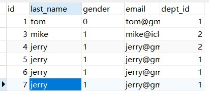
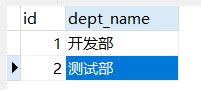

# MyBatis学习笔记

### MyBatis基本介绍

##### 入门案例

> mybatis-config.xml
>
> ```xml
> <?xml version="1.0" encoding="UTF-8" ?>
> <!DOCTYPE configuration
>      PUBLIC "-//mybatis.org//DTD Config 3.0//EN"
>      "http://mybatis.org/dtd/mybatis-3-config.dtd">
> <configuration>
>  <environments default="development">
>      <environment id="development">
>          <transactionManager type="JDBC"/>
>          <dataSource type="POOLED">
>              <property name="driver" value="com.mysql.jdbc.Driver"/>
>              <property name="url" value="jdbc:mysql://192.168.100.199/test"/>
>              <property name="username" value="root"/>
>              <property name="password" value="root"/>
>          </dataSource>
>      </environment>
>  </environments>
>  <!--将我们写好的sql映射文件一定要注册到全局配置文件中-->
>  <mappers>
>      <mapper resource="EmployeeMapper.xml"/>
>  </mappers>
> </configuration>
> ```
>
> EmployeeMapper.xml
>
> ```xml
> <?xml version="1.0" encoding="UTF-8" ?>
> <!DOCTYPE mapper
>      PUBLIC "-//mybatis.org//DTD Mapper 3.0//EN"
>      "http://mybatis.org/dtd/mybatis-3-mapper.dtd">
> <mapper namespace="com.example.mybatis.EmployeeMapper">
>  <!--
>      namespace：名称空间（随便起）
>      id：唯一标识
>      resultType：返回值类型
>      #{id}：从传递过来的参数中取出id值【占位符】
>  -->
>  <select id="selectEmp" resultType="com.example.mybatis.bean.Employee">
>    select id,last_name as lastName,email,gender from tbl_employee where id = #{id}
>  </select>
> </mapper>
> ```
>
> ```java
> package com.example.mybatis.test;
> import com.example.mybatis.bean.Employee;
> import org.apache.ibatis.io.Resources;
> import org.apache.ibatis.session.SqlSession;
> import org.apache.ibatis.session.SqlSessionFactory;
> import org.apache.ibatis.session.SqlSessionFactoryBuilder;
> import org.junit.Test;
> import java.io.IOException;
> import java.io.InputStream;
> 
> public class MyBatisTest {
>  /**
>      *  1.根据xml配置文件（全局配置文件）创建一个SqlSessionFactory对象，有数据源一些运行环境信息
>      *  2.sql映射文件，配置了每一个sql，以及sql的封装规则
>      *  3.将sql的映射文件注册在全局配置文件中
>      *  4.写代码：
>      *      1）根据全局配置文件得到SqlSessionFactory
>      *      2）使用SqlSessionFactory，获取到SqlSession对象，使用它来执行增删改查
>      *         一个sqlSession就是代表和数据库的一次会话，用完关闭
>      *      3）使用sql的唯一标识来告诉MyBatis执行哪个sql，sql语句都是保存在sql映射文件中的
>      *
>      */
>     @Test
>     public void test() throws IOException {
>         String resource = "mybatis-config.xml";
>         InputStream inputStream = Resources.getResourceAsStream(resource);
>         SqlSessionFactory sqlSessionFactory = new SqlSessionFactoryBuilder().build(inputStream);
>         // 获取sqlSession实例，能直接执行已经映射的sql语句
>         SqlSession openSession = sqlSessionFactory.openSession();
>         // selectOne()第一个参数：sql的唯一标识（namespace + id）; 第二个参数：执行sql要用的参数
>         try {
>             Employee employee = openSession.selectOne("com.example.mybatis.EmployeeMapper.selectEmp", 1);
>             System.out.println(employee);
>         } catch (Exception e) {
>             e.printStackTrace();
>         } finally {
>             openSession.close();
>         }
>     }
> }
> ```
>
> ```java
> package com.example.mybatis.bean;
> 
> public class Employee {
>     private Integer id;
>     private String lastName;
>     private String email;
>     private String gender;
> 
>     public Integer getId() {
>         return id;
>     }
> 
>     public void setId(Integer id) {
>         this.id = id;
>     }
> 
>     public String getLastName() {
>         return lastName;
>     }
> 
>     public void setLastName(String lastName) {
>         this.lastName = lastName;
>     }
> 
>     public String getEmail() {
>         return email;
>     }
> 
>     public void setEmail(String email) {
>         this.email = email;
>     }
> 
>     public String getGender() {
>         return gender;
>     }
> 
>     public void setGender(String gender) {
>         this.gender = gender;
>     }
> 
>     @Override
>     public String toString() {
>         return "Employee{" +
>                 "id=" + id +
>                 ", lastName='" + lastName + '\'' +
>                 ", email='" + email + '\'' +
>                 ", gender='" + gender + '\'' +
>                 '}';
>     }
> }
> 
> ```
>
> 第二种实现方式（通过绑定接口实现）：
>
> ```java
> package com.example.mybatis.dao;
> import com.example.mybatis.bean.Employee;
> public interface EmployeeMapper {
>     public Employee getEmpById(Integer id);
> }
> 
> ```
>
> ```xml
> <?xml version="1.0" encoding="UTF-8" ?>
> <!DOCTYPE mapper
>         PUBLIC "-//mybatis.org//DTD Mapper 3.0//EN"
>         "http://mybatis.org/dtd/mybatis-3-mapper.dtd">
> <mapper namespace="com.example.mybatis.dao.EmployeeMapper">
>     <!--
>         namespace：名称空间指定为接口的全类名
>         id：写接口里面对应的方法名
>         resultType：返回值类型
>         #{id}：从传递过来的参数中取出id值【占位符】
>     -->
>     <select id="getEmpById" resultType="com.example.mybatis.bean.Employee">
>       select id,last_name as lastName,email,gender from tbl_employee where id = #{id}
>     </select>
> </mapper>
> ```
>
> ```java
> public SqlSessionFactory getSqlSessionFactory() throws IOException {
>     String resource = "mybatis-config.xml";
>     InputStream inputStream = Resources.getResourceAsStream(resource);
>     return new SqlSessionFactoryBuilder().build(inputStream);
> }
> 
> @Test
> public void test1() throws IOException {
>     SqlSessionFactory sqlSessionFactory = getSqlSessionFactory();
>     SqlSession openSession = sqlSessionFactory.openSession();
> 
>     try {
>         // ；获取接口实现类对象
>         // 会为接口自动的创建一个代理对象，代理对象去执行增删改查
>         EmployeeMapper mapper = openSession.getMapper(EmployeeMapper.class);
>         Employee employee = mapper.getEmpById(1);
>         System.out.println(employee);
>     } finally {
>         openSession.close();
>     }
> }
> ```
>
> *小结*
>
> 接口式编程：
>
> 原生：		Dao ====> DaoImpl
>
> mybatis：  Mapper ====> xxMapper.xml
>
> sqlSession代表和数据库的一次会话，用完必须关闭；
>
> SqlSession 和 Connection 一样，都是非线程安全的，每次使用都应该去获取新的对象
>
> mapper接口没有实现类，按时mybatis会为这个接口生成一个代理对象（将接口和xml绑定）
>
> 两个重要的配置文件：
>
> ​	mybatis的全局配置文件：包含数据库连接池信息，事务管理器信息，系统运行环境信息……
>
> ​	sql映射文件：保存了每一个sql语句的映射信息，将sql抽取出来

### 基础配置

##### 全局配置文件

> **引入外部配置文件**
>
> ```properties
> jdbc.driver=com.mysql.jdbc.Driver
> jdbc.url=jdbc:mysql://192.168.100.199/test
> jdbc.username=root
> jdbc.password=root
> ```
>
> ```xml
> <?xml version="1.0" encoding="UTF-8" ?>
> <!DOCTYPE configuration
> PUBLIC "-//mybatis.org//DTD Config 3.0//EN"
> "http://mybatis.org/dtd/mybatis-3-config.dtd">
> <configuration>
> <!--
> mybatis可以使用properties来引入外部properties配置文件的内容
> resource：引入类路径下的资源
> url：引入网络路径或者磁盘路径下的资源
> -->
> <properties resource="dbconfig.properties"></properties>
> <environments default="development">
> <environment id="development">
> <transactionManager type="JDBC"/>
> <dataSource type="POOLED">
>     <property name="driver" value="${jdbc.driver}"/>
>     <property name="url" value="${jdbc.url}"/>
>     <property name="username" value="${jdbc.username}"/>
>     <property name="password" value="${jdbc.password}"/>
> </dataSource>
> </environment>
> </environments>
> <!--将我们写好的sql映射文件一定要注册到全局配置文件中-->
> <mappers>
> <mapper resource="EmployeeMapper.xml"/>
> </mappers>
> </configuration>
> ```
>
> **驼峰命名**
>
> ```xml
> <!--
> settings包含很多重要的设置项
> setting：用来设置每一个设置项
> name：设置项名
> value：设置项取值
> -->
> <settings>
> <!--是否开启驼峰命名自动映射，即从经典数据库列名 A_COLUMN 映射到经典 Java 属性名 aColumn。-->
> <setting name="mapUnderscoreToCamelCase" value="true"/>
> </settings>
> ```
>
> **类型别名（typeAliases）**
> 类型别名可为 Java 类型设置一个缩写名字。 它仅用于 XML 配置，意在降低冗余的全限定类名书写。
> typeAlias：为某个java类型取别名
> type：指定要起别名的类型全类名，默认别名是类名小写
> alias：指定新的别名
>
> *单个类别名*
>
> mybatis-config.xml
>
> ```xml
> <typeAliases>
> <typeAlias type="com.example.mybatis.bean.Employee" alias="emp"/>
> </typeAliases>
> ```
>
> EmployeeMapper.xml
>
> ```xml
> <mapper namespace="com.example.mybatis.dao.EmployeeMapper">
> <!--
> namespace：名称空间指定为接口的全类名
> id：写接口里面对应的方法名
> resultType：返回值类型
> #{id}：从传递过来的参数中取出id值【占位符】
> -->
> <select id="getEmpById" resultType="emp">
> select * from tbl_employee where id = #{id}
> </select>
> </mapper>
> ```
>
> *批量起别名*
>
> ```xml
> <typeAliases>
> <!--
> 批量起别名
> package：为某个包下的所有类批量起别名
> name：指定包名（为当前包以及下面所有的包的每一个类都起一个默认别名）
> 每一个在包 com.example.mybatis.bean 中的 Java Bean，在没有注解的情况下，会使用 Bean 的首字母小写的非限定类名来作为它的别名。
> 比如 com.example.mybatis.bean.Author 的别名为 author；若有注解，则别名为其注解值。
>  @Alias("author")
>  public class Author {
>     ...
>  }
> -->
> <package name="com.example.mybatis.bean" />
> </typeAliases>
> ```
>
> **environments运行环境**
>
> ```xml
> <!--environments：mybatis可以配置多种环境，default指定使用某种环境
> environment：配置一个具体的环境信息；必须有两个标签,id代表当前环境的唯一标识
>    transactionManager：事务管理器
>        type：事务管理器类型；JDBC(JdbcTransactionFactory)   |   MANAGED(ManagedTransactionFactory)
>              自定义事务管理器；实现TransactionFactory接口 type指定为全类名
>    dataSource：数据源
>        type：数据源类型；UNPOOLED(UnpooledDataSourceFactory) | POOLED(PooledDataSourceFactory)  |  JNDI(JndiDataSourceFactory)
>        自定义数据源：实现DataSourceFactory接口，type是全类名
> -->
> <environments default="development">
>  <environment id="test">
>      <transactionManager type="JDBC"/>
>      <dataSource type="POOLED">
>          <property name="driver" value="${jdbc.driver}"/>
>          <property name="url" value="${jdbc.url}"/>
>          <property name="username" value="${jdbc.username}"/>
>          <property name="password" value="${jdbc.password}"/>
>      </dataSource>
>  </environment>
>  <environment id="development">
>      <transactionManager type="JDBC"/>
>      <dataSource type="POOLED">
>          <property name="driver" value="${jdbc.driver}"/>
>          <property name="url" value="${jdbc.url}"/>
>          <property name="username" value="${jdbc.username}"/>
>          <property name="password" value="${jdbc.password}"/>
>      </dataSource>
>  </environment>
> </environments>
> ```
>
> **配置多数据库支持**
>
> mybatis-config.xml
>
> ```xml
> <!--databaseIdProvider支持多数据库厂商
>      DB_VENDOR：VendorDatabaseIdProvider，作用就是得到数据库厂商标识（驱动），mybatis就能根据数据库厂商标识来执行不同的sql
>      MySQL，Oracle，SQL Server，
> -->
> <databaseIdProvider type="DB_VENDOR">
>  <!--为不同数据库厂商取别名-->
>  <property name="MySQL" value="mysql"/>
>  <property name="Oracle" value="oracle"/>
>  <property name="SQL Server" value="sqlserver"/>
> </databaseIdProvider>
> ```
>
> EmployeeMapper.xml
>
> ```xml
> <?xml version="1.0" encoding="UTF-8" ?>
> <!DOCTYPE mapper
>      PUBLIC "-//mybatis.org//DTD Mapper 3.0//EN"
>      "http://mybatis.org/dtd/mybatis-3-mapper.dtd">
> <mapper namespace="com.example.mybatis.dao.EmployeeMapper">
>  <!--这里databaseId的值填上面property属性的value值-->
>  <select id="getEmpById" resultType="employee" databaseId="mysql">
>    select * from tbl_employee where id = #{id}
>  </select>
> </mapper>
> ```
>
> **映射器（mappers）**
>
> mybatis-config.xml
>
> ```xml
> <!--将我们写好的sql映射文件一定要注册到全局配置文件中-->
> <!--mappers：将sql映射注册到全局配置中
>    resource：引用类路径下的sql映射文件
>    url：引用网络路径或者磁盘路径下的sql映射文件
>    class：引用（注册）接口
>       1.必须有sql映射文件，映射文件名必须和接口同名，并且放在与接口同一目录下
>       2.没有sql映射文件，所有的sql都是利用注解写在接口上
>           推荐：比较重要的，复杂的Dao接口我们来写sql映射文件
>           不重要Dao接口为了开发快速可以使用注解
> -->
> <mappers>
>     <mapper resource="EmployeeMapper.xml"/>
>     <mapper class="com.example.mybatis.dao.EmployeeMapper"/>
>     <!--批量注册，接口名和映射文件名必须相同，并且在同一目录下，或者可以使用注解-->
>     <package name="com.example.mybatis.dao"/>
> </mappers>
> ```
>
> 注解实现sql映射
>
> ```java
> package com.example.mybatis.dao;
> import com.example.mybatis.bean.Employee;
> import org.apache.ibatis.annotations.Select;
> 
> public interface EmployeeMapper {
>     @Select("select * from tbl_employee where id = #{id}")
>     public Employee getEmpById(Integer id);
> 
>     @Select("select * from tbl_employee where last_name = #{lastName}")
>     public Employee getEmpByLastName(String lastName);
> }
> ```
>
> **增删改查**
>
> ```xml
> <?xml version="1.0" encoding="UTF-8" ?>
> <!DOCTYPE mapper
>         PUBLIC "-//mybatis.org//DTD Mapper 3.0//EN"
>         "http://mybatis.org/dtd/mybatis-3-mapper.dtd">
> <mapper namespace="com.example.mybatis.dao.EmployeeMapper">
>     <!--
>         namespace：名称空间指定为接口的全类名
>         id：写接口里面对应的方法名
>         resultType：返回值类型
>         #{id}：从传递过来的参数中取出id值【占位符】
>     -->
>     <select id="getEmpById" resultType="com.example.mybatis.bean.Employee">
>       select * from tbl_employee where id = #{id}
>     </select>
>     
>     <!--parameterType可以省略-->
>     <insert id="addEmp" parameterType="com.example.mybatis.bean.Employee">
>         insert into tbl_employee(last_name,email,gender) values (#{lastName},#{email},#{gender})
>     </insert>
> 
>     <update id="updateEmp">
>         update tbl_employee set last_name=#{lastName},email=#{email},gender=#{gender} where id=#{id}
>     </update>
> 
>     <delete id="deleteEmpById">
>         delete from tbl_employee where id=#{id}
>     </delete>
> </mapper>
> ```
>
> ```java
> package com.example.mybatis.dao;
> import com.example.mybatis.bean.Employee;
> public interface EmployeeMapper {
>     public Employee getEmpById(Integer id);
> 
>     public Long addEmp(Employee employee);
> 
>     public Boolean updateEmp(Employee employee);
> 
>     public void deleteEmpById(Integer id);
> }
> ```
>
> ```java
> public SqlSessionFactory getSqlSessionFactory() throws IOException {
>     String resource = "mybatis-config.xml";
>     InputStream inputStream = Resources.getResourceAsStream(resource);
>     return new SqlSessionFactoryBuilder().build(inputStream);
> }
> 
> /**
>      *  测试增删改查
>      *  mybatis允许增删改直接定义以下返回值
>      *      Integer，Long，Boolean
>      *  我们需要手动提交数据  sqlSessionFactory.openSession();  =====> 手动提交
>      *	sqlSessionFactory.openSession(true); =====> 自动提交
>      */
> @Test
> public void test2() throws IOException {
>     SqlSessionFactory sqlSessionFactory = getSqlSessionFactory();
>     SqlSession openSession = sqlSessionFactory.openSession();
> 
>     try {
>         EmployeeMapper mapper = openSession.getMapper(EmployeeMapper.class);
>         // 查询
>         Employee employee = mapper.getEmpById(1);
>         System.out.println(employee);
>         // 添加
>         Long rows = mapper.addEmp(new Employee(null, "jerry", "jerry@gmail.com", "1"));
>         System.out.println(rows);
>         // 修改
>         Boolean flag = mapper.updateEmp(new Employee(3, "mike", "mike@icloud.com", "1"));
>         System.out.println(flag);
>         // 删除
>         mapper.deleteEmpById(2);
>         // 手动提交数据
>         openSession.commit();
>     } finally {
>         openSession.close();
>     }
> }
> ```

### mapper映射文件

##### insert获取自增主键

> ```xml
> <!--parameterType 参数类型，可以省略
>       useGeneratedKeys ：使用自增主键，获取主键值策略
>       keyProperty：指定对应的主键属性，也就是mybatis获取到主键值以后，将这个值封装到JavaBean指定的属性
> -->
> <insert id="addEmp" parameterType="com.example.mybatis.bean.Employee" useGeneratedKeys="true" keyProperty="id">
>     insert into tbl_employee(last_name,email,gender) values (#{lastName},#{email},#{gender})
> </insert>
> ```
>
> ```java
>  // 添加
> Employee employee1 = new Employee(null, "jerry", "jerry@gmail.com", "1");
> Long rows = mapper.addEmp(employee1);
> System.out.println(employee1.getId());
> ```

##### 获取非自增主键值

> ```xml
> <insert id="addEmp" parameterType="com.example.mybatis.bean.Employee" databaseId="oracle">
>  <!--
>      keyProperty：查出的主键值封装给javaBean的哪个属性
>      order="BEFORE"：当前sql在插入sql之前运行
>             AFTER：当前sql在插入sql之后运行
>      resultType：查出的数据的返回类型
> -->
>     <selectKey keyProperty="id" order="BEFORE" resultType="Integer">
>         <!--编写查询主键的sql语句-->
>         select EMPLOYEES_SEQ.nextval from dual
>     </selectKey>
>     insert into employees(EMPLOYEE_ID,LAST_NAME,EMAIL) values (#{id},#{lastName},#{email})
> </insert>
> ```

##### 参数处理

> **单个参数**
>
> mybatis不会做特殊处理，#{参数名}  ：取出参数值
>
> **多个参数**
>
> mybatis会做特殊处理，多个参数会被封装成一个map
>
> ​		key：param1,param2...param10，或者参数的索引也可以
>
> ​		value：传入的参数值
>
> #{} 就是从map中获取指定的key值
>
> ==命名参数：==明确指定封装参数时map的key
>
> ​	  key：使用@Param注解指定的值
>
> ​	  value：参数值
>
> #{指定的key}取出对应的参数值
>
> ==POJO：==
>
> 如果多个参数正好是我们业务逻辑的数据模型，我们就可以直接传入pojo
>
> #{属性名} ：取出传入的pojo的属性值
>
> ==Map：==
>
> 如果多个参数不是业务模型中的数据，没有对应的pojo，为了方便，我们也可以传入map
>
> #{key} ：取出map中对应的值
>
> ==TO：==
>
> 如果多个参数不是业务模型中的数据，但是经常使用，推荐来编写一个TO（Transfer Object）数据传输对象
>
> ```text
> Page{
> int index;
> int size;
> }
> ```
>
> 
>
> *示例1*
>
> 接口方法定义：
>
> ```java
> public Employee getEmpByIdAndLastName(Integer id,String lastName);
> ```
>
> sql映射文件：
>
> ```xml
> <select id="getEmpByIdAndLastName" resultType="com.example.mybatis.bean.Employee">
> select * from tbl_employee where id = #{param1} and last_name = #{param2}
> </select>
> ```
>
> *示例2*
>
> 接口方法定义：
>
> ```java
> public Employee getEmpByIdAndLastName(@Param("id") Integer id, @Param("lastName") String lastName);
> ```
>
> sql映射文件：
>
> ```xml
> <select id="getEmpByIdAndLastName" resultType="com.example.mybatis.bean.Employee">
> select * from tbl_employee where id = #{id} and last_name = #{lastName}
> </select>
> ```
>
> *示例3*
>
> 接口方法定义：
>
> ```java
> public Long addEmp(Employee employee);
> ```
>
> sql映射文件：
>
> ```xml
> <insert id="addEmp" parameterType="com.example.mybatis.bean.Employee">
> insert into tbl_employee(last_name,email,gender) values (#{lastName},#{email},#{gender})
> </insert>
> ```
>
> *示例4*
>
> 接口方法定义：
>
> ```java
> public Employee getEmpByMap(Map<String,Object> map);
> ```
>
> sql映射文件：
>
> ```xml
> <select id="getEmpByMap" resultType="com.example.mybatis.bean.Employee">
> select * from tbl_employee where id = #{id} and last_name = #{lastName}
> </select>
> ```
>
> 测试：
>
> ```java
> EmployeeMapper mapper = openSession.getMapper(EmployeeMapper.class);
> Map<String,Object> map = new HashMap<>();
> map.put("id", 1);
> map.put("lastName", "tom");
> Employee employee = mapper.getEmpByMap(map);
> System.out.println(employee);
> ```
>
> **参数值的获取**
>
> #{} ：可以获取map的值或者pojo对象属性的值
>
> ${} ：可以获取map的值或者pojo对象属性的值
>
> 区别：#{} ：是以预编译的形式，将参数设置到sql语句中；PreparedStatement；sql语句中是以占位符？的形式替代参数Preparing: select * from tbl_employee where id = ? and last_name = ?
>
> ​			${}：是直接把值拼装到sql语句中，Preparing: select * from tbl_employee where id = 1 and last_name = ?
>
> 小结：大多数情况下，我们取参数的值都应该去使用#{}，原生JDBC不支持使用占位符的地方我们就可以使用${}取值，比如分表，排序，按照年份拆分表
>
> `select * from ${year}_salary where xxx		select * from tbl_employee order by  ${f_name} ${order}`
>
> #{}：更丰富的用法
>
> ​		规定参数的一些规则：
>
> ​		javaType、jdbcType、mode(存储过程)、numericScale、resultMap、typeHandler、jdbcTypeName、expression
>
> ​		jdbcType通常需要在某种特定的条件下被设置：
>
> ​			在我们的数据为null的时候，有些数据库可能不能识别mybatis对null的默认处理，比如Oracle（报错）
>
> ​			insert into employees(EMPLOYEE_ID,LAST_NAME,EMAIL) values (#{id},#{lastName},#{email,jdbcType=NULL})  默认jdbcType=OTHER
>
> ​		由于全局配置中：jdbcTypeForNull=OTHER；oracle不支持
>
> 		1. #{email,jdbcType=OTHER}
>   		2. jdbcTypeForNull=NULL

### 查询

##### select返回List

> 接口方法定义：
>
> ```java
> public List<Employee> getEmpsByLastName(String lastName);
> ```
>
> sql映射文件：
>
> ```xml
> <!--resultType：如果返回的是一个集合，要写集合中元素的类型-->
> <select id="getEmpsByLastName" resultType="com.example.mybatis.bean.Employee">
>     select * from tbl_employee where last_name like #{lastName}
> </select>
> ```
>
> 测试文件：
>
> ```java
> EmployeeMapper mapper = openSession.getMapper(EmployeeMapper.class);
> List<Employee> employees = mapper.getEmpsByLastName("%e%");
> for (Employee employee : employees) {
>     System.out.println(employee);
> }
> ```

##### select返回map

> 接口方法定义：
>
> ```java
> // 返回一条记录的map；key就是列名，值就是对应的值
> public Map<String,Object> getEmpByIdReturnMap(Integer id);
> ```
>
> sql映射文件：
>
> ```xml
> <select id="getEmpByIdReturnMap" resultType="map">
>     select * from tbl_employee where id=#{id};
> </select>
> ```
>
> 测试文件：
>
> ```java
> EmployeeMapper mapper = openSession.getMapper(EmployeeMapper.class);
> Map<String, Object> map = mapper.getEmpByIdReturnMap(1);
> System.out.println(map);
> ```
>
> **多条记录封装成一个map**
>
> 接口方法定义：
>
> ```java
> // 多条记录封装成一个map：Map<Integer,Employee>；key是这条记录的主键，值是记录封装后的javaBean
> // 告诉mybatis封装这个map的时候使用哪个属性作为map的key
> @MapKey("id")
> public Map<Integer,Employee> getEmpByLastNameLikeReturnMap(String lastName);
> ```
>
> sql映射文件：
>
> ```xml
> <select id="getEmpByLastNameLikeReturnMap" resultType="com.example.mybatis.bean.Employee">
>     select * from tbl_employee where last_name like #{lastName};
> </select>
> ```
>
> 测试文件：
>
> ```java
> EmployeeMapper mapper = openSession.getMapper(EmployeeMapper.class);
> Map<Integer, Employee> maps = mapper.getEmpByLastNameLikeReturnMap("%e%");
> System.out.println(maps);
> ```

##### resultMap

> **自定义结果映射规则**
>
> *示例1*
>
> 接口方法定义：
>
> ```java
> package com.example.mybatis.dao;
> import com.example.mybatis.bean.Employee;
> public interface EmployeeMapperPlus {
>     public Employee getEmpById(Integer id);
> }
> ```
>
> sql映射文件：
>
> ```xml
> <?xml version="1.0" encoding="UTF-8" ?>
> <!DOCTYPE mapper
>         PUBLIC "-//mybatis.org//DTD Mapper 3.0//EN"
>         "http://mybatis.org/dtd/mybatis-3-mapper.dtd">
> <mapper namespace="com.example.mybatis.dao.EmployeeMapperPlus">
> 
>     <!--自定义某个javaBean封装规则
>         type：自定义规则的java类型
>         id：唯一id，方便引用
>     -->
>     <resultMap id="myEmp" type="com.example.mybatis.bean.Employee">
>         <!--指定主键列的封装规则
>             id定义主键底层会有优化
>             column：指定哪一列对应
>             property：指定对应的javaBean属性
>         -->
>         <id column="id" property="id" />
>         <!--定义普通列封装规则-->
>         <result column="last_name" property="lastName"/>
>         <!--其他不指定的列会自动封装，但是推荐写resultMap就把全部的列都写上-->
>         <result column="email" property="email"/>
>         <result column="gender" property="gender"/>
>     </resultMap>
>     <!--resultMap：自定义结果集映射-->
>     <select id="getEmpById" resultMap="myEmp">
>         select * from tbl_employee where id=#{id}
>     </select>
> </mapper>
> ```
>
> 将sql映射文件注册到全局配置文件中
>
> ```xml
> <mappers>
>     <mapper resource="EmployeeMapper.xml"/>
>     <mapper resource="EmployeeMapperPlus.xml"/>
>     <!--批量注册，接口名和映射文件名必须相同，并且在同一目录下，或者可以使用注解-->
> </mappers>
> ```
>
> **关联查询**
>
> *级联属性封装结果集*
>
> 类定义：
>
> ```java
> package com.example.mybatis.bean;
> public class Employee {
>     private Integer id;
>     private String lastName;
>     private String email;
>     private String gender;
>     private Department dept;   
> 	......
> }
> ```
>
> ```java
> package com.example.mybatis.bean;
> public class Department {
>     private Integer id;
>     private String departmentName;
> 	......
> }
> ```
>
> sql映射文件：
>
> ```xml
> <!--联合查询：级联属性封装结果集-->
> <resultMap id="MyComplexEmp" type="com.example.mybatis.bean.Employee">
>     <id column="id" property="id"/>
>     <result column="last_name" property="lastName"/>
>     <result column="gender" property="gender"/>
>     <result column="did" property="dept.id"/>
>     <result column="dept_name" property="dept.departmentName"/>
> </resultMap>
> <select id="getEmpAndDept" resultMap="MyComplexEmp">
>     select e.id id,e.last_name last_name,e.gender gender,e.dept_id dept_id,d.id did,d.dept_name dept_name
>     from tbl_employee e,tbl_dept d where e.dept_id = d.id and e.id = 1
> </select>
> ```
>
> 测试文件：
>
> ```java
> EmployeeMapperPlus mapper = openSession.getMapper(EmployeeMapperPlus.class);
> Employee employee = mapper.getEmpAndDept(1);
> System.out.println(employee);
> ```
>
> 表结构：
>
> tbl_employee表
>
> 
>
> tbl_dept表
>
> 
>
> **association定义关联对象封装规则**
>
> 接口方法定义
>
> ```java
> public Employee getEmpAndDept(Integer id);
> ```
>
> sql映射文件定义
>
> ```xml
> <resultMap id="MyComplexEmp2" type="com.example.mybatis.bean.Employee">
>     <id column="id" property="id"/>
>     <result column="last_name" property="lastName"/>
>     <result column="gender" property="gender"/>
>     <!--association可以指定联合的JavaBean
>             property="dept"：指定哪个属性是联合的对象
>             javaType：指定这个属性对象的类型【不能省略】
>         -->
>     <association property="dept" javaType="com.example.mybatis.bean.Department">
>         <id column="did" property="id"/>
>         <result column="dept_name" property="departmentName"/>
>     </association>
> </resultMap>
> <select id="getEmpAndDept" resultMap="MyComplexEmp2">
>     select e.id id,e.last_name last_name,e.gender gender,e.dept_id dept_id,d.id did,d.dept_name dept_name
>     from tbl_employee e,tbl_dept d where e.dept_id = d.id and e.id = 1
> </select>
> ```
>
> 其他文件跟上面的例子一样
>
> **使用association进行分步查询**
>
> 接口方法定义
>
> EmployeeMapperPlus.java
>
> ```java
> public Employee getEmpByIdStep(Integer id);
> ```
>
> DepartmentMapper.java
>
> ```java
> package com.example.mybatis.dao;
> import com.example.mybatis.bean.Department;
> public interface DepartmentMapper {
>     public Department getDeptById(Integer id);
> }
> ```
>
> sql映射文件
>
> EmployeeMapperPlus.xml
>
> ```xml
> <!--使用association分步查询
>         1.先按照员工id查出员工信息
>         2.根据查询员工信息中的dept_id值，去部门表查出部门信息
>         3.部门设置到员工中
>     -->
> <resultMap id="MyEmpByStep" type="com.example.mybatis.bean.Employee">
>     <id column="id" property="id"/>
>     <result column="last_name" property="lastName"/>
>     <result column="email" property="email"/>
>     <result column="gender" property="gender"/>
>     <!--association定义关联对象的封装规则
>             select：表明当前属性是调用select指定的方法查出的结果
>             column：指定将哪一列的值传给这个方法
>             流程：使用select指定的方法（传入column指定的这列参数的值）查出对象，并封装给property指定的属性
>         -->
>     <association property="dept" select="com.example.mybatis.dao.DepartmentMapper.getDeptById" column="dept_id"></association>
> </resultMap>
> <select id="getEmpByIdStep" resultMap="MyEmpByStep">
>     select * from tbl_employee where id=#{id}
> </select>
> ```
>
> DepartmentMapper.xml
>
> ```xml
> <?xml version="1.0" encoding="UTF-8" ?>
> <!DOCTYPE mapper
>         PUBLIC "-//mybatis.org//DTD Mapper 3.0//EN"
>         "http://mybatis.org/dtd/mybatis-3-mapper.dtd">
> <mapper namespace="com.example.mybatis.dao.DepartmentMapper">
>     <select id="getDeptById" resultType="com.example.mybatis.bean.Department">
>         select id,dept_name departmentName from tbl_dept where id=#{id}
>     </select>
> </mapper>
> ```
>
> **延迟加载**
>
> 在分步查询的基础之上，在全局配置上添加以下配置，关联属性会延迟加载
>
> * lazyLoadingEnabled：延迟加载的全局开关。当开启时，所有关联对象都会延迟加载。 特定关联关系中可通过设置 `fetchType` 属性来覆盖该项的开关状态。
> * aggressiveLazyLoading：开启时，任一方法的调用都会加载该对象的所有延迟加载属性。 否则，每个延迟加载属性会按需加载（参考 lazyLoadTriggerMethods)。
>
> **collection定义关联集合封装规则**
>
> 类定义
>
> ```java
> package com.example.mybatis.bean;
> import java.util.List;
> public class Department {
>     private Integer id;
>     private String departmentName;
>     private List<Employee> emps;
>     ......
> }
> ```
>
> ```java
> package com.example.mybatis.bean;
> public class Employee {
>     private Integer id;
>     private String lastName;
>     private String email;
>     private String gender;
>     private Department dept;
>     ......
> }
> ```
>
> 接口方法定义
>
> ```java
> public Department getDeptByIdPlus(Integer id);
> ```
>
> sql映射文件
>
> ```xml
> <resultMap id="MyDept" type="com.example.mybatis.bean.Department">
>     <id column="did" property="id"/>
>     <result column="dept_name" property="departmentName"/>
>     <!--collection嵌套结果集的方式，定义关联的集合类型元素的封装规则
>             collection：定义关联的集合类型的属性的封装
>                 ofType：指定集合里面元素的类型
>         -->
>     <collection property="emps" ofType="com.example.mybatis.bean.Employee">
>         <!--定义这个集合中元素的封装规则-->
>         <id column="eid" property="id"/>
>         <result column="last_name" property="lastName"/>
>         <result column="email" property="email"/>
>         <result column="gender" property="gender" />
>     </collection>
> </resultMap>
> <select id="getDeptByIdPlus" resultMap="MyDept">
>     select d.id did,d.dept_name dept_name,e.id eid,e.last_name last_name,e.email email,e.gender gender
>     from tbl_dept d left join tbl_employee e on d.id=e.dept_id where d.id=#{id}
> </select>
> ```
>
> 测试文件
>
> ```java
> DepartmentMapper mapper = openSession.getMapper(DepartmentMapper.class);
> Department dept = mapper.getDeptByIdPlus(1);
> System.out.println(dept);
> ```
>
> **collection分步查询**
>
> 类文件定义和上面的上面的collection定义关联结果一样
>
> 接口方法定义
>
> EmployeeMapperPlus.java
>
> ```java
> public List<Employee> getEmpsByDeptId(Integer deptId);
> ```
>
> DepartmentMapper.java
>
> ```java
> public Department getDeptByIdStep(Integer id);
> ```
>
> sql映射文件
>
> DepartmentMapper.xml
>
> ```xml
> <resultMap id="MyDeptStep" type="com.example.mybatis.bean.Department">
>     <id column="id" property="id"/>
>     <result column="dept_name" property="departmentName"/>
>     <collection property="emps" select="com.example.mybatis.dao.EmployeeMapperPlus.getEmpsByDeptId" column="id" 			fetchType="lazy"></collection>
> </resultMap>
> <select id="getDeptByIdStep" resultMap="MyDeptStep">
>     select * from tbl_dept where id=#{id}
> </select>
> ```
>
> EmployeeMapperPlus.xml
>
> ```xml
> <select id="getEmpsByDeptId" resultType="com.example.mybatis.bean.Employee">
>     select * from tbl_employee where dept_id=#{deptId}
> </select>
> ```
>
> 测试文件
>
> ``` java
> DepartmentMapper mapper = openSession.getMapper(DepartmentMapper.class);
> Department dept = mapper.getDeptByIdStep(1);
> System.out.println(dept);
> ```
>
> 扩展：多列的值传递过去，将多列的值封装map传递
>
> column="{key1=column1,key2=column2}"
>
> fetchType="lazy" ：表示使用延迟加载
>
> **discriminator鉴别器**
>
> 鉴别器：mybatis可以使用discriminator判断某列的值，然后根据某列的值改变封装行为
>
> sql映射文件
>
> ```xml
> <!--封装Employee:
>         如果查出的是女生：就把部门信息查询出来，否则不查询
>         如果是男生，就把last_name这一列的值赋值给email-->
> <resultMap id="MyEmpDis" type="com.example.mybatis.bean.Employee">
>     <id column="id" property="id"/>
>     <result column="last_name" property="lastName"/>
>     <result column="email" property="email"/>
>     <result column="gender" property="gender"/>
>     <!--column：指定要判断的列名
>             javaType：列值对应的java类型
>         -->
>     <discriminator javaType="string" column="gender">
>         <!--女生 resultType：指定封装的结果类型，不能省略，或者可以用resultMap-->
>         <case value="0" resultType="com.example.mybatis.bean.Employee">
>             <association property="dept" select="com.example.mybatis.dao.DepartmentMapper.getDeptById" column="dept_id">			</association>
>         </case>
>         <!--男生-->
>         <case value="1" resultType="com.example.mybatis.bean.Employee">
>             <id column="id" property="id"/>
>             <result column="last_name" property="lastName"/>
>             <result column="last_name" property="email"/>
>             <result column="gender" property="gender"/>
>         </case>
>     </discriminator>
> </resultMap>
> 
> <select id="getEmpByIdStep" resultMap="MyEmpDis">
>     select * from tbl_employee where id=#{id}
> </select>
> ```
>
> 

