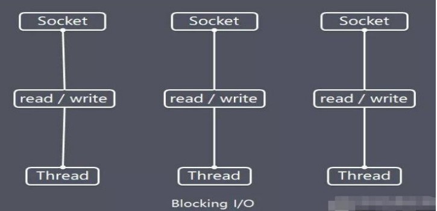
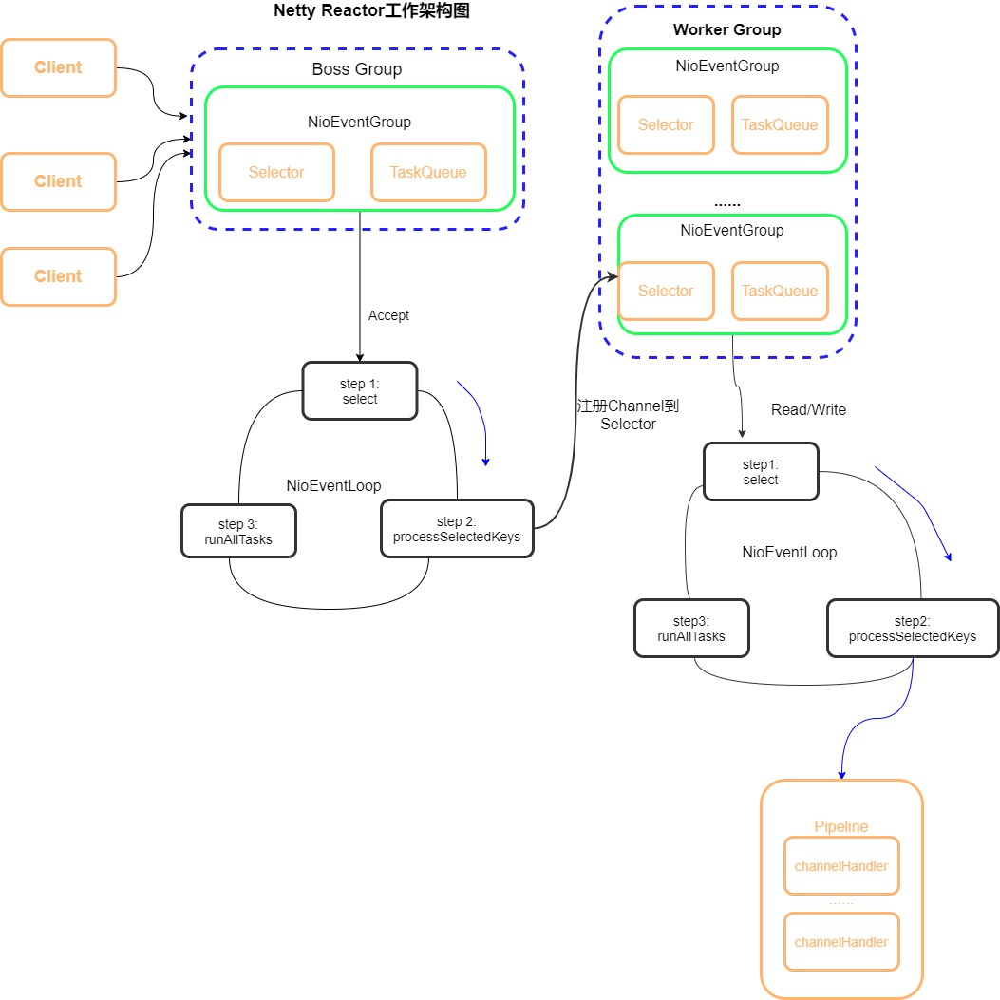

# Netty学习笔记

### Netty概述

> **Netty基本介绍**
>
> * Netty 是由 JBOSS 提供的一个 Java 开源框架，现为 Github上的独立项目。
> * Netty 是一个异步的、基于事件驱动的网络应用框架，用以快速开发高性能、高可靠性的网络 IO 程序。
> *  Netty主要针对在TCP协议下，面向Clients端的高并发应用，或者Peer-to-Peer场景下的大量数据持续传输的应用。
> * Netty本质是一个NIO框架，适用于服务器通讯相关的多种应用场景
> * Netty 可以帮助你快速、简单的开发出一个网络应用，相当于简化和流程化了 NIO 的开发过程
> * Netty 是目前最流行的 NIO 框架，Netty 在互联网领域、大数据分布式计算领域、游戏行业、通信行业等获得了广泛的应用，知名的 Elasticsearch 、Dubbo 框架内部都采用了 Netty。
> *  要透彻理解Netty ， 需要先学习 NIO ， 这样我们才能阅读 Netty 的源码。
>
> **Netty的应用场景**
>
> * 互联网行业
>   * 互联网行业：在分布式系统中，各个节点之间需要远程服务调用，高性能的 RPC 框架必不可少，Netty 作为异步高性能的通信框架，往往作为基础通信组件被这些 RPC 框架使用。
>   * 典型的应用有：阿里分布式服务框架Dubbo 的 RPC 框架使用 Dubbo 协议进行节点间通信，Dubbo 协议默认使用Netty 作为基础通信组件，用于实现各进程节点之间的内部通信
> * 游戏行业
>   *  无论是手游服务端还是大型的网络游戏，Java 语言得到了越来越广泛的应用
>   * Netty 作为高性能的基础通信组件，提供了 TCP/UDP 和 HTTP 协议栈，方便定制和开发私有协议栈，账号登录服务器
>   *  地图服务器之间可以方便的通过 Netty进行高性能的通信
> * 大数据领域
>   *  经典的 Hadoop 的高性能通信和序列化组件 Avro 的 RPC 框架，默认采用 Netty 进行跨界点通信
>   * 它的 Netty Service 基于 Netty 框架二次封装实现。
> * 其它开源项目使用到Netty
>
> **Netty的优点**
>
> Netty 对 JDK 自带的 NIO 的 API 进行了封装，解决了以下问题。
>
> * 设计优雅：适用于各种传输类型的统一 API 阻塞和非阻塞 Socket；基于灵活且可扩展的事件模型，可以清晰地分离关注点；高度可定制的线程模型 - 单线程，一个或多个线程池.
> * 使用方便：详细记录的 Javadoc，用户指南和示例；没有其他依赖项，JDK 5（Netty3.x）或 6（Netty 4.x）就足够了。
> * 高性能、吞吐量更高：延迟更低；减少资源消耗；最小化不必要的内存复制。
> * 安全：完整的 SSL/TLS 和 StartTLS 支持。
> * 社区活跃、不断更新：社区活跃，版本迭代周期短，发现的 Bug 可以被及时修复，同时，更多的新功能会被加入

### I/O模型

> **I/O模型基本说明**
>
> *  I/O 模型简单的理解：就是用什么样的通道进行数据的发送和接收，很大程度上决定了程序通信的性能
> * Java共支持3种网络编程模型/IO模式：BIO、NIO、AIO
> * Java BIO ： 同步并阻塞( 传统阻塞型)，服务器实现模式为一个连接一个线程，即客户端有连接请求时服务器端就需要启动一个线程进行处理，如果这个连接不做任何事情会造成不必要的线程开销
> *  Java NIO ：  同步非阻塞，服务器实现模式为一个线程处理多个请求(连接)，即客户端发送的连接请求都会注册到多路复用器上，多路复用器轮询到连接有I/O请求就进行处理
> * Java AIO(NIO.2) ：  异步非阻塞，AIO 引入异步通道的概念，采用了 Proactor 模式，简化了程序编写，有效的请求才启动线程，它的特点是先由操作系统完成后才通知服务端程序
>
> **BIO 、NIO 、AIO 适用场景分析**
>
> *  BIO方式适用于连接数目比较小且固定的架构，这种方式对服务器资源要求比较高，并发局限于应用中，JDK1.4以前的唯一选择，但程序简单易理解。
> * NIO方式适用连接数目多且连接比较短（轻操作）的架构，比如聊天服务器，弹幕系统，服务器间通讯等。编程比较复杂，JDK1.4开始支持。
> * AIO方式使用于 连接数目多且连接比较长（重操作）的架构，比如相册服务器，充分调用OS参与并发操作，编程比较复杂，JDK7开始支持。
>
> **Java BIO基本介绍**
>
> *  Java BIO 就是 传统的java io  编程，其相关的类和接口在 java.io
> *  BIO(blocking I/O) ：  同步阻塞 ，服务器实现模式为一个连接一个线程，即客户端有连接请求时服务器端就需要启动一个线程进行处理，如果这个连接不做任何事情会造成不必要的线程开销，可以通过线程池机制改善(实现多个客户连接服务器)。
> *  BIO方式适用于连接数目比较小且固定的架构，这种方式对服务器资源要求比较高，并发局限于应用中，JDK1.4以前的唯一选择，程序简单易理解
>
> **BIO 编程简单流程**
>
> 1. 服务器端启动一个ServerSocket
> 2. 客户端启动Socket对服务器进行通信，默认情况下服务器端需要对每个客户建立一个线程与之通讯
> 3. 客户端发出请求后, 先咨询服务器是否有线程响应，如果没有则会等待，或者被拒绝
>
> **BIO工作原理图**
>
> 
>
> **BIO存在的问题**
>
> * 每个请求都需要创建独立的线程，与对应的客户端进行数据Read，业务处理，数据 Write 。
> * 当并发数较大时，需要 创建大量线程来处理连接，系统资源占用较大。
> * 连接建立后，如果当前线程暂时没有数据可读，则线程就阻塞在Read 操作上，造成线程资源浪费
>
> *BIO代码示例*
>
> ```java
> package com.example.bio;
> import java.io.IOException;
> import java.io.InputStream;
> import java.net.ServerSocket;
> import java.net.Socket;
> import java.util.concurrent.ExecutorService;
> import java.util.concurrent.Executors;
> 
> public class BIOServer {
>     public static void main(String[] args) throws IOException {
>         // 1. 创建一个线程池
>         // 2. 如果有客户端连接，就创建一个线程，与之通讯
>         ExecutorService executorService = Executors.newCachedThreadPool();
>         // 创建ServerSocket
>         ServerSocket serverSocket = new ServerSocket(6666);
>         System.out.println("服务器启动了...");
> 
>         while(true){
>             //监听，等待客户端连接
>             final Socket socket = serverSocket.accept();
>             System.out.println("连接到一个客户端");
>             // 创建一个线程，与之通讯
>             executorService.execute(new Runnable() {
>                 public void run() {
>                     // 可以和客户端通讯
>                     handler(socket);
>                 }
>             });
>         }
>     }
> 
>     /**
>      * 编写一个handler方法，和客户端通讯
>      */
>     public static void handler(Socket socket){
>         byte[] bytes = new byte[1024];
>         System.out.println("线程信息：id = " + Thread.currentThread().getId() + " 线程名：" + Thread.currentThread().getName());
>         InputStream is = null;
>         // 通过socket获取输入流
>         try {
>             is = socket.getInputStream();
>             // 循环读取客户端发送的数据
>             while(true){
>                 System.out.println("线程信息：id = " + Thread.currentThread().getId() + " 线程名：" + Thread.currentThread().getName());
>                 int read = is.read(bytes);
>                 if(read != -1){
>                     // 输出客户端发送的数据
>                     System.out.println(new String(bytes,0,read));
>                 }else{
>                     break;
>                 }
>             }
>         } catch (IOException e) {
>             e.printStackTrace();
>         }finally {
>             System.out.println("关闭client连接");
>             if(is != null){
>                 try {
>                     is.close();
>                 } catch (IOException e) {
>                     e.printStackTrace();
>                 }
>             }
>             try {
>                 socket.close();
>             } catch (IOException e) {
>                 e.printStackTrace();
>             }
>         }
>     }
> }
> ```
>
> **Java NIO 基本介绍**
>
> * Java NIO 全称 java non-blocking IO，是指 JDK 提供的新API。从 JDK1.4 开始，Java 提供了一系列改进的输入/输出的新特性，被统称为 NIO(即 New IO)，是同步非阻塞的
> *  NIO 相关类都被放在 java.nio 包及子包下，并且对原 java.io包中的很多类进行改写。
> * NIO 有三大核心部分：Channel( 通道)，Buffer( 缓冲区),Selector( 选择器)
> *  NIO是 面向缓冲区  ，或者面向块编程的。数据读取到一个它稍后处理的缓冲区，需要时可在缓冲区中前后移动，这就增加了处理过程中的灵活性，使用它可以提供 非阻塞式的高伸缩性网络
> *  Java NIO的非阻塞模式，使一个线程从某通道发送请求或者读取数据，但是它仅能得到目前可用的数据，如果目前没有数据可用时，就什么都不会获取，而 不是保持线程阻塞，所以直至数据变的可以读取之前，该线程可以继续做其他的事情。 非阻塞写也是如此，一个线程请求写入一些数据到某通道，但不需要等待它完全写入，这个线程同时可以去做别的事情。
> *  通俗理解：NIO是可以做到用一个线程来处理多个操作的。假设有10000个请求过来,根据实际情况，可以分配50或者100个线程来处理。不像之前的阻塞IO那样，非得分配10000个。
> *  HTTP2.0使用了多路复用的技术，做到同一个连接并发处理多个请求，而且并发请求的数量比HTTP1.1大了好几个数量级。
>
> **NIO和BIO的比较**
>
> *  BIO以流的方式处理数据,而NIO以块的方式处理数据,块 I/O 的效率比流 I/O 高很多
> *  BIO是阻塞的，NIO则是非阻塞的
> * BIO基于字节流和字符流进行操作，而 NIO 基于 Channel(通道)和 Buffer(缓冲区)进行操作，数据总是从通道读取到缓冲区中，或者从缓冲区写入到通道中。Selector(选择器)用于监听多个通道的事件（比如：连接请求，数据到达等），因此使用单个线程就可以监听多个客户端通道
>
> *NIO代码示例*
>
> ```java
> package com.example.chat;
> import java.io.IOException;
> import java.net.InetSocketAddress;
> import java.nio.ByteBuffer;
> import java.nio.channels.*;
> import java.util.Iterator;
> 
> public class GroupChatServer {
>     private Selector selector;
>     private ServerSocketChannel serverSocketChannel;
>     private static final int PORT = 6667;
> 
>     public GroupChatServer() {
>         try {
>             // 得到选择器
>             selector = Selector.open();
>             // 获取通道
>             serverSocketChannel = ServerSocketChannel.open();
>             // 绑定端口
>             serverSocketChannel.socket().bind(new InetSocketAddress(PORT));
>             // 设置非阻塞模式
>             serverSocketChannel.configureBlocking(false);
>             // 将serverSocketChannel注册到selector
>             serverSocketChannel.register(selector, SelectionKey.OP_ACCEPT);
>         } catch (IOException e) {
>             e.printStackTrace();
>         }
>     }
> 
>     public void listen(){
>         try {
> 
>             while (true){
>                 int count = selector.select();
>                 // 有事件处理
>                 if(count > 0){
>                     // 遍历得到selectionKey集合
>                     Iterator<SelectionKey> iterator = selector.selectedKeys().iterator();
>                     while (iterator.hasNext()){
>                         // 取出selectionKey
>                         SelectionKey key = iterator.next();
>                         // 监听到accept
>                         if(key.isAcceptable()){
>                             SocketChannel sc = serverSocketChannel.accept();
>                             // 设置非阻塞
>                             sc.configureBlocking(false);
>                             // 将该sc注册到selector
>                             sc.register(selector, SelectionKey.OP_READ);
>                             // 提示
>                             System.out.println(sc.getRemoteAddress() + " 上线");
>                         }
>                         // 通道发生read事件，即通道是可读的状态
>                         if(key.isReadable()){
>                             // 处理读
>                             readData(key);
>                         }
>                         // 手动从集合中删除当前的selectionKey，防止重复操作
>                         iterator.remove();
>                     }
>                 }else{
>                     System.out.println("等待...");
>                 }
>             }
> 
>         } catch (Exception e) {
>             e.printStackTrace();
>         }finally {
> 
>         }
>     }
> 
>     /**
>      * 读取客户端消息
>      */
>     private void readData(SelectionKey key){
>         // 定义一个SocketChannel
>         SocketChannel channel = null;
>         try {
>             // 得到channel
>             channel = (SocketChannel) key.channel();
>             // 创建缓冲区
>             ByteBuffer buffer = ByteBuffer.allocate(1024);
>             int count = channel.read(buffer);
>             if(count > 0){
>                 // 把缓冲区的数据转成字符串
>                 String msg = new String(buffer.array());
>                 // 输出该消息
>                 System.out.println("from 客户端：" + msg);
>                 // 向其它的客户端转发消息
>                 sendInfoToOtherClients(msg, channel);
>             }
>         } catch (IOException e) {
>             try {
>                 System.out.println(channel.getRemoteAddress() + " 离线了");
>                 // 取消注册
>                 key.cancel();
>                 // 关闭通道
>                 channel.close();
>             } catch (IOException e1) {
>                 e1.printStackTrace();
>             }
>         }
>     }
> 
>     /**
>      * 转发消息给其它的客户端
>      */
>     private void sendInfoToOtherClients(String msg,SocketChannel self) throws IOException {
>         System.out.println("服务器转发消息中...");
>         System.out.println("服务器转发数据给客户端线程: " + Thread.currentThread().getName());
>         // 遍历所有注册到selector上的SocketChannel，并排除self
>         for (SelectionKey key : selector.keys()) {
>             // 通过key取出对应的SocketChannel
>             Channel targetChannel = key.channel();
>             // 排除自己
>             if(targetChannel instanceof SocketChannel && targetChannel != self){
>                 // 转换类型
>                 SocketChannel dest = (SocketChannel) targetChannel;
>                 // 将msg存储到buffer
>                 ByteBuffer buffer = ByteBuffer.wrap(msg.getBytes());
>                 // 将buffer的数据写入通道
>                 dest.write(buffer);
>             }
>         }
>     }
> 
>     public static void main(String[] args) {
>         GroupChatServer groupChatServer = new GroupChatServer();
>         groupChatServer.listen();
>     }
> }
> ```
>
> ```java
> package com.example.chat;
> import java.io.IOException;
> import java.net.InetSocketAddress;
> import java.nio.ByteBuffer;
> import java.nio.channels.SelectionKey;
> import java.nio.channels.Selector;
> import java.nio.channels.SocketChannel;
> import java.util.Iterator;
> import java.util.Scanner;
> 
> public class GroupChatClient {
>     // 服务器IP
>     private final String HOST = "127.0.0.1";
>     // 服务器端口
>     private final int PORT = 6667;
>     private Selector selector;
>     private SocketChannel socketChannel;
>     private String username;
> 
>     public GroupChatClient() throws IOException {
>         selector = Selector.open();
>         // 连接服务器
>         socketChannel = SocketChannel.open(new InetSocketAddress(HOST,PORT));
>         // 设置非阻塞
>         socketChannel.configureBlocking(false);
>         // 将channel注册到selector
>         socketChannel.register(selector, SelectionKey.OP_READ);
>         // 得到username
>         username = socketChannel.getLocalAddress().toString().substring(1);
>         System.out.println(username + "is OK!");
>     }
> 
>     /**
>      * 向服务器发送消息
>      */
>     public void sendInfo(String info){
>         info = username + "说：" + info;
>         try {
>             socketChannel.write(ByteBuffer.wrap(info.getBytes()));
> 
>         } catch (IOException e) {
>             e.printStackTrace();
>         } finally {
>         }
>     }
> 
>     /**
>      * 读取从服务器回复的消息
>      */
>     public void readInfo(){
>         try {
>             int readCount = selector.select();
>             // 有事件发生的通道
>             if(readCount > 0){
>                 Iterator<SelectionKey> iterator = selector.selectedKeys().iterator();
>                 while(iterator.hasNext()){
>                     SelectionKey key = iterator.next();
>                     if(key.isReadable()){
>                         // 得到相关通道
>                         SocketChannel sc = (SocketChannel) key.channel();
>                         // 得到一个buffer
>                         ByteBuffer buffer = ByteBuffer.allocate(1024);
>                         // 读取
>                         sc.read(buffer);
>                         // 把读到的缓冲区的数据转成字符串
>                         String msg = new String(buffer.array());
>                         System.out.println(msg.trim());
>                     }
>                 }
>                 iterator.remove();
>             }else{
> 
>             }
>         } catch (IOException e) {
>             e.printStackTrace();
>         }
>     }
> 
>     public static void main(String[] args) throws IOException {
>         GroupChatClient chatClient = new GroupChatClient();
>         // 启动一个线程，每隔3秒读取从服务器端发送数据
>         new Thread(){
>             @Override
>             public void run() {
>                 while (true){
>                     System.out.println("读取消息中...");
>                     chatClient.readInfo();
>                     try {
>                         Thread.currentThread().sleep(3000);
>                     } catch (InterruptedException e) {
>                         e.printStackTrace();
>                     }
>                 }
>             }
>         }.start();
>         // 发送数据给服务器端
>         Scanner scanner = new Scanner(System.in);
>         while(scanner.hasNextLine()){
>             String s = scanner.nextLine();
>             chatClient.sendInfo(s);
>         }
>     }
> }
> ```
>
> **Java AIO 基本介绍 基本介绍**
>
> * JDK 7 引入了 Asynchronous I/O，即 AIO。在进行 I/O 编程中，常用到两种模式：Reactor和 Proactor。Java 的 NIO 就是 Reactor，当有事件触发时，服务器端得到通知，进行相应的处理
> *  AIO 即 NIO2.0，叫做异步不阻塞的 IO。AIO 引入异步通道的概念，采用了Proactor 模式，简化了程序编写，有效的请求才启动线程，它的特点是先由操作系统完成后才通知服务端程序启动线程去处理，一般适用于连接数较多且连接时间较长的应用
>
> **原生NIO存在的问题**
>
> * NIO 的类库和 API 繁杂，使用麻烦：需要熟练掌握 Selector、ServerSocketChannel、SocketChannel、ByteBuffer 等。
> * 需要具备其他的额外技能：要熟悉 Java 多线程编程，因为 NIO 编程涉及到 Reactor模式，你必须对多线程和网络编程非常熟悉，才能编写出高质量的 NIO 程序。
> * 开发工作量和难度都非常大：例如客户端面临断连重连、网络闪断、半包读写、失败缓存、网络拥塞和异常流的处理等等。
> * JDK NIO 的 Bug：例如臭名昭著的 Epoll Bug，它会导致 Selector 空轮询，最终导致 CPU 100%。直到 JDK 1.7 版本该问题仍旧存在，没有被根本解决。
>
> **线程模型基本介绍**
>
> * 不同的线程模式，对程序的性能有很大影响，为了搞清Netty 线程模式，我们来系统的讲解下各个线程模式，最后看看Netty 线程模型有什么优越性.
> * 目前存在的线程模型有：
>   * 传统阻塞 I/O 服务模型
>   * Reactor 模式
> * 根据 Reactor  的数量和处理资源池线程的数量不同，有3种典型的实现
>   * 单 Reactor 单线程
>   * 单 Reactor 多线程
>   * 主从Reactor 多线程
> *  Netty 线程模式(Netty主要基于主从 Reactor多线程模型做了一定的改进，其中主从Reactor 多线程模型有多个 Reactor)
>
> **Netty模型原理图**
>
> 
>
> * Netty抽象出两组线程池 BossGroup 专门负责接收客户端的连接,WorkerGroup 专门负责网络的读写
> *  BossGroup 和 WorkerGroup 类型都是 NioEventLoopGroup
> *  NioEventLoopGroup 相当于一个事件循环组, 这个组中含有多个事件循环 ，每一个事件循环是 NioEventLoop
> *  NioEventLoop 表示一个不断循环的执行处理任务的线程， 每个NioEventLoop 都有一个selector , 用于监听绑定在其上的socket的网络通讯
> * NioEventLoopGroup 可以有多个线程, 即可以含有多个NioEventLoop
> * 每个Boss NioEventLoop 循环执行的步骤有3步
>   * 轮询accept 事件
>   * 处理accept 事件 , 与client建立连接 , 生成NioScocketChannel , 并将其注册到某个worker NIOEventLoop 上的 selector
>   * 处理任务队列的任务 ， 即runAllTasks
> * 每个Worker NIOEventLoop 循环执行的步骤
>   * 轮询read, write 事件
>   * 处理i/o事件， 即read , write 事件，在对应NioScocketChannel 处理
>   * 处理任务队列的任务 ， 即 runAllTasks
> * 每个Worker NIOEventLoop 处理业务时，会使用pipeline(管道), pipeline中包含了channel，即通过pipeline可以获取到对应通道，管道中维护了很多的处理器

### Netty入门示例

> ```xml
> <?xml version="1.0" encoding="UTF-8"?>
> <project xmlns="http://maven.apache.org/POM/4.0.0"
>       xmlns:xsi="http://www.w3.org/2001/XMLSchema-instance"
>       xsi:schemaLocation="http://maven.apache.org/POM/4.0.0 http://maven.apache.org/xsd/maven-4.0.0.xsd">
>  <modelVersion>4.0.0</modelVersion>
> 
>  <groupId>com.example</groupId>
>  <artifactId>nettydemo</artifactId>
>  <version>1.0-SNAPSHOT</version>
>  <build>
>      <plugins>
>          <plugin>
>              <groupId>org.apache.maven.plugins</groupId>
>              <artifactId>maven-compiler-plugin</artifactId>
>              <configuration>
>                  <source>7</source>
>                  <target>7</target>
>              </configuration>
>          </plugin>
>      </plugins>
>  </build>
> 
>  <dependencies>
>      <!-- https://mvnrepository.com/artifact/io.netty/netty-all -->
>      <dependency>
>          <groupId>io.netty</groupId>
>          <artifactId>netty-all</artifactId>
>          <version>4.1.67.Final</version>
>      </dependency>
>  </dependencies>
> </project>
> ```
>
> ```java
> package com.example.netty;
> import io.netty.bootstrap.ServerBootstrap;
> import io.netty.channel.ChannelFuture;
> import io.netty.channel.ChannelInitializer;
> import io.netty.channel.ChannelOption;
> import io.netty.channel.EventLoopGroup;
> import io.netty.channel.nio.NioEventLoopGroup;
> import io.netty.channel.socket.SocketChannel;
> import io.netty.channel.socket.nio.NioServerSocketChannel;
> 
> public class NettyServer {
>     public static void main(String[] args) throws InterruptedException {
>         // 创建 BossGroup 和 WorkerGroup
>         // 说明：
>         // 1. 创建两个线程组 bossGroup 和 workerGroup
>         // 2. bossGroup只是处理连接请求，真正的业务处理，会交给workerGroup处理
>         // 3. 两个都是无限循环
>         // bossGroup 和 workerGroup 含有的子线程（NioEventLoop）的个数，默认是实际的逻辑CPU核数 * 2
>         EventLoopGroup bossGroup = new NioEventLoopGroup(1);
>         EventLoopGroup workerGroup = new NioEventLoopGroup(3);
>         try {
>             // 创建服务端的启动对象，配置参数
>             ServerBootstrap bootstrap = new ServerBootstrap();
>             // 使用链式编程来进行设置
>             // 这是设置两个线程组
>             bootstrap.group(bossGroup,workerGroup)
>                       // 使用NioSocketChannel作为服务器的通道实现
>                      .channel(NioServerSocketChannel.class)
>                       // 设置线程队列等待连接的个数
>                      .option(ChannelOption.SO_BACKLOG, 128)
>                        // 设置保持活动连接状态
>                      .childOption(ChannelOption.SO_KEEPALIVE, true)
>                       // 创建一个通道初始化对象
>                      .childHandler(new ChannelInitializer<SocketChannel>() {
>                          // 给pipeline设置处理器
>                          @Override
>                          protected void initChannel(SocketChannel ch) {
>                             ch.pipeline().addLast(new NettyServerHandler());
>                          }
>                      }); // 给workerGroup的EventLoop对应的管道设置处理器
> 
>             System.out.println("...服务器 is ready ...");
>             // 绑定一个端口，并且同步,生成一个ChannelFuture对象（这里相当于启动服务器，并绑定端口）
>             ChannelFuture cf = bootstrap.bind(6668).sync();
>             // 对关闭通道事件进行监听
>             cf.channel().closeFuture().sync();
>         } catch (InterruptedException e) {
>             e.printStackTrace();
>         }finally {
>             bossGroup.shutdownGracefully();
>             workerGroup.shutdownGracefully();
>         }
>     }
> }
> ```
>
> ```java
> package com.example.netty;
> import io.netty.bootstrap.Bootstrap;
> import io.netty.channel.ChannelFuture;
> import io.netty.channel.ChannelInitializer;
> import io.netty.channel.EventLoopGroup;
> import io.netty.channel.nio.NioEventLoopGroup;
> import io.netty.channel.socket.SocketChannel;
> import io.netty.channel.socket.nio.NioSocketChannel;
> 
> public class NettyClient {
>  public static void main(String[] args) throws InterruptedException {
>      // 客户端需要一个事件循环组
>      EventLoopGroup group = new NioEventLoopGroup();
>      try {
>          // 创建客户端启动对象
>          Bootstrap bootstrap = new Bootstrap();
>          // 设置相关参数
>          // 设置线程组
>          bootstrap.group(group)
>                   // 设置客户端通道的实现类
>                   .channel(NioSocketChannel.class)
>                   .handler(new ChannelInitializer<SocketChannel>() {
>                       @Override
>                       protected void initChannel(SocketChannel ch) {
>                           // 加入自己的处理器
>                           ch.pipeline().addLast(new NettyClientHandler());
>                       }
>                   });
>          System.out.println("客户端 is OK ...");
>          // 启动客户端去连接服务端
>          ChannelFuture cf = bootstrap.connect("127.0.0.1", 6668).sync();
>          // 监听关闭通道事件
>          cf.channel().closeFuture().sync();
>      } catch (InterruptedException e) {
>          e.printStackTrace();
>      } finally {
>          group.shutdownGracefully();
>      }
>  }
> }
> ```
>
> ```java
> package com.example.netty;
> import io.netty.buffer.ByteBuf;
> import io.netty.buffer.Unpooled;
> import io.netty.channel.Channel;
> import io.netty.channel.ChannelHandlerContext;
> import io.netty.channel.ChannelInboundHandlerAdapter;
> import io.netty.channel.ChannelPipeline;
> import io.netty.util.CharsetUtil;
> 
> /**
>  *  1. 我们自定义一个Handler，需要继承netty规定好的某个HandlerAdapter
>  *  2. 这时我们自定义的Handler，才能称之为一个Handler
>  */
> public class NettyServerHandler extends ChannelInboundHandlerAdapter {
>     /**
>      *  读取数据事件（这里我们可以读取客户端发送的消息）
>      *  1. ChannelHandlerContext ctx ：上下文对象，含有管道pipeline，通道channel，地址
>      *  2. Object msg ： 客户端发送的数据，默认Object
>      */
>     @Override
>     public void channelRead(ChannelHandlerContext ctx, Object msg) throws Exception {
>         System.out.println("服务器读取线程： " + Thread.currentThread().getName());
>         System.out.println("server ctx = " + ctx);
> 
>         Channel channel = ctx.channel();
>         // 本质上底层是一个双向链表
>         ChannelPipeline pipeline = ctx.pipeline();
> 
> 
>         // 将msg转成一个ByteBuf，ByteBuf是netty提供的，不是NIO提供的
>         ByteBuf buf = (ByteBuf) msg;
>         System.out.println("客户端发送的消息是：" + buf.toString(CharsetUtil.UTF_8));
>         System.out.println("客户端地址：" + ctx.channel().remoteAddress());
>     }
> 
>     /**
>      * 数据读取完毕
>      */
>     @Override
>     public void channelReadComplete(ChannelHandlerContext ctx) throws Exception {
>         // 将数据写入到缓存并刷新，通常我们要对发送的数据进行编码
>         ctx.writeAndFlush(Unpooled.copiedBuffer("hello,客户端!",CharsetUtil.UTF_8));
>     }
> 
>     /**
>      * 异常处理
>      */
>     @Override
>     public void exceptionCaught(ChannelHandlerContext ctx, Throwable cause) throws Exception {
>         ctx.close();
>     }
> }
> ```
>
> ```java
> package com.example.netty;
> import io.netty.buffer.ByteBuf;
> import io.netty.buffer.Unpooled;
> import io.netty.channel.ChannelHandlerContext;
> import io.netty.channel.ChannelInboundHandlerAdapter;
> import io.netty.util.CharsetUtil;
> 
> public class NettyClientHandler extends ChannelInboundHandlerAdapter {
> 
>     /**
>      *  当通道就绪就会触发该方法
>      */
>     @Override
>     public void channelActive(ChannelHandlerContext ctx) throws Exception {
>         System.out.println("Client ctx : " + ctx);
>         ctx.writeAndFlush(Unpooled.copiedBuffer("hello,server!",CharsetUtil.UTF_8));
>     }
> 
>     /**
>      * 当通道有读取事件时，会触发
>      */
>     @Override
>     public void channelRead(ChannelHandlerContext ctx, Object msg) throws Exception {
>         ByteBuf buf = (ByteBuf) msg;
>         System.out.println("服务器回复的消息： " + buf.toString(CharsetUtil.UTF_8));
>         System.out.println("服务器地址： " + ctx.channel().remoteAddress());
>     }
> 
>     /**
>      * 异常处理
>      */
>     @Override
>     public void exceptionCaught(ChannelHandlerContext ctx, Throwable cause) throws Exception {
>         cause.printStackTrace();
>         ctx.close();
>     }
> }
> ```
>

### taskQueue

> **任务队列中的Task有3种典型使用场景**
>
> * 用户程序自定义的普通任务
> * 用户自定义定时任务
> * 非当前 Reactor 线程调用 Channel 的各种方法
>   * 例如在==推送系统==的业务线程里面，根据==用户的标识==，找到对应的==Channel 引用==，然后调用 Write 类方法向该用户推送消息，就会进入到这种场景。最终的 Write 会提交到任务队列中后被==异步消费==
>
> ```java
> @Override
> public void channelRead(ChannelHandlerContext ctx, Object msg) throws Exception {
>     // 这里我们有一个耗时长的业务 -> 异步执行 -> 提交到该channel对应的NioEventLoop的taskQueue中
>     // 解决方案1，用户程序自定义的普通任务
>     ctx.channel().eventLoop().execute(new Runnable() {
>         @Override
>         public void run() {
>             try {
>                 Thread.sleep(5 * 1000);
>                 ctx.writeAndFlush(Unpooled.copiedBuffer("Hello,客户端，喵喵喵111...", CharsetUtil.UTF_8));
>             } catch (InterruptedException e) {
>                 System.out.println("发生异常：" + e.getMessage());
>             }
>         }
>     });
> 
>     // 解决方案2 用户自定义定时任务，这个任务是放在scheduleTaskQueue中的
>     ctx.channel().eventLoop().schedule(new Runnable() {
>         @Override
>         public void run() {
>             try {
>                 Thread.sleep(5 * 1000);
>                 ctx.writeAndFlush(Unpooled.copiedBuffer("Hello,客户端，schedule定时任务...", CharsetUtil.UTF_8));
>             } catch (InterruptedException e) {
>                 System.out.println("发生异常：" + e.getMessage());
>             }
>         }
>     }, 5, TimeUnit.SECONDS);
> 
> 
>     System.out.println("go on ...");
> }
> ```
>
> **Netty模型方案再说明**
>
> *  Netty 抽象出两组 线程池，BossGroup 专门负责接收客户端连接，WorkerGroup 专门负责网络读写操作。
> *  NioEventLoop 表示一个不断循环执行处理任务的线程，每个 NioEventLoop 都有一个selector，用于监听绑定在其上的 socket 网络通道。
> *  NioEventLoop 内部采用串行化设计，从消息的读取->解码->处理->编码->发送，始终由IO线程NioEventLoop负责
>   * NioEventLoopGroup下包含多个NioEventLoop
>   * 每个NioEventLoop 中包含有一个 Selector，一个 taskQueue
>   * 每个NioEventLoop 的 Selector 上可以注册监听多个 NioChannel
>   * 每个NioChannel 只会绑定在唯一的 NioEventLoop 上
>   * 每个NioChannel 都绑定有一个自己的 ChannelPipeline

### 异步模型

> **异步模型基本介绍**
>
> *  异步的概念和同步相对。当一个异步过程调用发出后，调用者不能立刻得到结果。实际处理这个调用的组件在完成后，通过状态、通知和回调来通知调用者。
> * Netty 中的 I/O 操作是异步的，包括 Bind、Write、Connect 等操作会简单的返回一个ChannelFuture。
> * 调用者并不能立刻获得结果，而是通过 Future-Listener 机制，用户可以方便的主动获取或者通过通知机制获得 IO 操作结果
> *  Netty 的异步模型是建立在 future 和 callback 的之上的。callback 就是回调。重点说Future，它的核心思想是：假设一个方法 fun，计算过程可能非常耗时，等待 fun返回显然不合适。那么可以在调用 fun 的时候，立马返回一个 Future，后续可以通过Future去监控方法 fun 的处理过程(即 ： Future-Listener 机制)
>
> **Future 说明**
>
> * 表示异步的执行结果, 可以通过它提供的方法来检测执行是否完成，比如检索计算等等
> *  ChannelFuture 是一个接口 ： public interface ChannelFuture extends Future<Void>我们可以添加监听器，当监听的事件发生时，就会通知到监听器
>
> **Future-Listener 机制**
>
> *  当 Future 对象刚刚创建时，处于非完成状态，调用者可以通过返回的 ChannelFuture来获取操作执行的状态，注册监听函数来执行完成后的操作。
> * 常见有如下操作
>   * 通过 isDone 方法来判断当前操作是否完成
>   * 通过 isSuccess 方法来判断已完成的当前操作是否成功
>   * 通过 getCause 方法来获取已完成的当前操作失败的原因
>   * 通过 isCancelled 方法来判断已完成的当前操作是否被取消
>   * 通过 addListener 方法来注册监听器，当操作已完成(isDone 方法返回完成)，将会通知指定的监听器；如果 Future 对象已完成，则通知指定的监听器
> * 相比传统阻塞 I/O，执行 I/O 操作后线程会被阻塞住, 直到操作完成；异步处理的好处是不会造成线程阻塞，线程在 I/O 操作期间可以执行别的程序，在高并发情形下会更稳定和更高的吞吐量
>
> ```java
> // 绑定一个端口，并且同步,生成一个ChannelFuture对象（这里相当于启动服务器，并绑定端口）
> ChannelFuture cf = bootstrap.bind(6668).sync();
> // 给cf注册监听器，监听我们关心的事件
> cf.addListener(new ChannelFutureListener() {
>     @Override
>     public void operationComplete(ChannelFuture future) throws Exception {
>         if(cf.isSuccess()){
>             System.out.println("监听端口6668成功！");
>         }else{
>             System.out.println("监听端口失败！");
>         }
>     }
> });
> ```
>
> 
