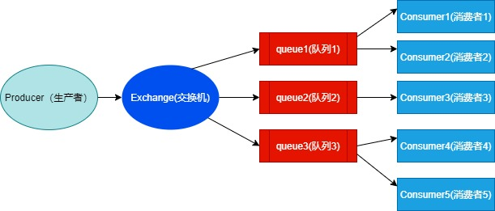

# RabbitMQ学习笔记

### RabbitMQ的角色分类

> 1. **none**：
>    * 不能访问management plugin（RabbitMQ的web管理界面）
> 2. **management**：查看自己相关节点信息
>    * 列出自己可以通过AMQP登录的虚拟机
>    * 查看自己的虚拟机节点virtual hosts的queues,exchanges和bindings信息
>    * 查看和关闭自己的channels和connections
>    * 查看有关自己的虚拟机节点virtual hosts的统计信息。包括其他用户这个节点virtual hosts中的活动信息
> 3. **Policymaker**：
>    * 包含management所有权限
>    * 查看、创建和删除自己的virtual hosts所属的policies和parameters信息
> 4. **Monitoring**：
>    * 包含management所有权限
>    * 罗列出所有的virtual hosts，包括不能登录的virtual hosts
>    * 查看其他用户的connections和channels信息
>    * 查看节点级别的数据如clustering和memory使用情况
>    * 查看所有的virtual hosts的全局统计信息
> 5. **Administrator**：
>    * 具备所有权限

### 入门案例（简单模式）

> 引入依赖
>
> ```xml
> <dependencies>
>     <dependency>
>         <groupId>com.rabbitmq</groupId>
>         <artifactId>amqp-client</artifactId>
>         <version>5.10.0</version>
>     </dependency>
> </dependencies>
> ```
>
> 生产者代码：
>
> ```java
> package com.example.rabbitmq.simple;
> import com.rabbitmq.client.Channel;
> import com.rabbitmq.client.Connection;
> import com.rabbitmq.client.ConnectionFactory;
> 
> public class Producer {
> 
>     public static void main(String[] args) throws Exception {
>         Connection connection = null;
>         Channel channel = null;
>         try {
>             // 1.创建连接工厂
>             ConnectionFactory connectionFactory = new ConnectionFactory();
>             connectionFactory.setHost("192.168.100.199");
>             connectionFactory.setPort(5672);
>             connectionFactory.setUsername("root");
>             connectionFactory.setPassword("root");
>             connectionFactory.setVirtualHost("/");
>             // 2.创建连接Connection
>             connection = connectionFactory.newConnection("生产者");
>             // 3.通过连接获取通道Channel
>             channel = connection.createChannel();
>             // 4.通过通道创建交换机，队列，绑定关系，路由key
>             String queueName = "queue1";
>             /**
>              * @param1 队列的名称
>              * @param2 是否要持久化durable=false
>              * @param3 排他性，是否是一个独占队列
>              * @param4 是否自动删除，随着最后一个消息被消费者消费完毕之后，是否把队列自动删除
>              * @param5 携带附属参数
>              */
>             channel.queueDeclare(queueName,true,false,false,null);
>             // 5.准备消息内容
>             String message = "不见五陵豪杰墓，无花无酒锄作田！";
>             // 6.发送消息给队列queue
>             channel.basicPublish("", queueName,null, message.getBytes());
>         } catch (Exception e) {
>             e.printStackTrace();
>         } finally {
> 
>             if(connection != null){
>                 // 7.关闭连接
>                 connection.close();
>             }
>             if(channel != null && channel.isOpen()){
>                 // 8.关闭通道
>                 channel.close();
>             }
>         }
> 
>     }
> }
> ```
>
> 消费者代码：
>
> ```java
> package com.example.rabbitmq.simple;
> import com.rabbitmq.client.*;
> import java.io.IOException;
> 
> public class Consumer {
> 
>     public static void main(String[] args) throws Exception {
>         Connection connection = null;
>         Channel channel = null;
>         try {
>             // 1.创建连接工厂
>             ConnectionFactory connectionFactory = new ConnectionFactory();
>             connectionFactory.setHost("192.168.100.199");
>             connectionFactory.setPort(5672);
>             connectionFactory.setUsername("root");
>             connectionFactory.setPassword("root");
>             connectionFactory.setVirtualHost("/");
>             // 2.创建连接Connection
>             connection = connectionFactory.newConnection("生产者");
>             // 3.通过连接获取通道Channel
>             channel = connection.createChannel();
>             String queueName = "queue1";
>             channel.basicConsume(queueName, true, new DeliverCallback() {
>                 public void handle(String cousumerTag, Delivery message) throws IOException {
>                     System.out.println("收到的消息是：" + new String(message.getBody(), "UTF-8"));
>                 }
>             }, new CancelCallback() {
>                 public void handle(String s) {
>                     System.out.println("接收失败了...");
>                 }
>             });
> 
>             System.out.println("开始接收消息...");
>             System.in.read();
> 
>         } catch (Exception e) {
>             e.printStackTrace();
>         } finally {
> 
>             if(connection != null){
>                 // 7.关闭连接
>                 connection.close();
>             }
>             if(channel != null && channel.isOpen()){
>                 // 8.关闭通道
>                 channel.close();
>             }
>         }
> 
>     }
> }
> ```

### 交换机（exchange）

> **交换机的作用**
>
>
> 在RabbitMQ中，生产者不是直接将消息发送给消费者，生成者根本不知道这个消息要传递给哪些队列。实际上，生产者只是将消息发送到交换机。交换机收到消息后，根据交换机的类型和配置来处理消息，有如下几种情况：
>
> * 将消息传送到特定的队列
> * 有可能发送到多个队列中
> * 也有可能丢弃消息
>
> RabbitMQ各个组件的功能重新归纳一下如下：
>
> * 生产者：发送消息
> * 交换机：将收到的消息根据路由规则路由到特定队列
> * 队列：用于存储消息
> * 消费者：收到消息并消费
>
> **交换机的类型**
>
> * Direct exchange（直连交换机）
> * Fanout exchange（扇型交换机）
> * Topic exchange（主题交换机）
> * Headers exchange（头交换机）
>
> 另外RabbitMQ默认定义一些交换机：
>
> * 默认交换机
> * amq.* exchanges
> * 还有一类特殊的交换机：Dead Letter Exchange（死信交换机）
>
> **Direct exchange（直连交换机）**
> 直连型交换机（direct exchange）是根据消息携带的==路由键==（routing key）将消息投递给对应队列的，步骤如下：
>
> 1. 将一个队列绑定到某个交换机上，同时赋予该绑定一个路由键（routing key）
> 2. 当一个携带着路由值为R的消息被发送给直连交换机时，交换机会把它路由给绑定值同样为R的队列。
>
> **Fanout exchange（扇型交换机）**
> 扇型交换机（funout exchange）将消息路由给绑定到它身上的所有队列。不同于直连交换机，*路由键在此类型上不起作用*。如果N个队列绑定到某个扇型交换机上，当有消息发送给此扇型交换机时，交换机会将消息的发送给这所有的N个队列
>
> **Topic exchange（主题交换机）**
> 主题交换机（topic exchanges）中，队列通过==路由键==绑定到交换机上，然后，交换机根据消息里的==路由值==，将消息*路由给一个或多个绑定队列*。
>
> **扇型交换机和主题交换机异同：**
>
> 1. 对于*扇型交换机*路由键是没有意义的，只要有消息，它都*发送到它绑定的所有队列上*
> 2. 对于*主题交换机*，路由规则由路由键决定，*只有满足路由键的规则，消息才可以路由到对应的队列上*
>
> **Headers exchange（头交换机）**
> 类似主题交换机，但是头交换机使用多个消息属性来代替路由键建立路由规则。通过判断消息头的值能否与指定的绑定相匹配来确立路由规则。
> 此交换机有个重要参数：==”x-match”==
>
> * 当”x-match”为“any”时，消息头的任意一个值被匹配就可以满足条件
> * 当”x-match”设置为“all”的时候，就需要消息头的所有值都匹配成功
>
> **默认交换机**
> 默认交换机（default exchange）实际上是一个由RabbitMQ预先声明好的名字为空字符串的直连交换机（direct exchange）。它有一个特殊的属性使得它对于简单应用特别有用处：那就是每个新建队列（queue）都会自动绑定到默认交换机上，绑定的路由键（routing key）名称与队列名称相同。
>
> 如：当你声明了一个名为”hello”的队列，RabbitMQ会自动将其绑定到默认交换机上，绑定（binding）的路由键名称也是为”hello”。因此，当携带着名为”hello”的路由键的消息被发送到默认交换机的时候，此消息会被默认交换机路由至名为”hello”的队列中。即默认交换机看起来貌似能够直接将消息投递给队列，如同我们之前文章里看到一例子。
>
> **类似amq.*的名称的交换机**
>
> 这些是RabbitMQ默认创建的交换机。这些队列名称被预留做RabbitMQ内部使用，不能被应用使用，否则抛出403 (ACCESS_REFUSED)错误
>
> **Dead Letter Exchange（死信交换机）**
> 在默认情况，如果消息在投递到交换机时，交换机发现此消息没有匹配的队列，则这个消息将被悄悄丢弃。为了解决这个问题，RabbitMQ中有一种交换机叫死信交换机。当消费者不能处理接收到的消息时，将这个消息重新发布到另外一个队列中，等待重试或者人工干预。这个过程中的exchange和queue就是所谓的Dead Letter Exchange 和 Queue
>
> **交换机的属性**
>
> * Name：交换机名称
> * Durability：是否持久化。如果持久性，则RabbitMQ重启后，交换机还存在
> * Auto-delete：当所有与之绑定的消息队列都完成了对此交换机的使用后，删掉它
> * Arguments：扩展参数

### fanout模式（发布订阅模式）

> fanout模式示意图
>
> 
>
> 代码示例：
>
> 生产者
>
> ```java
> package com.example.rabbitmq.routing;
> import com.rabbitmq.client.Channel;
> import com.rabbitmq.client.Connection;
> import com.rabbitmq.client.ConnectionFactory;
> 
> public class Producer {
> 
>     public static void main(String[] args) throws Exception {
>         Connection connection = null;
>         Channel channel = null;
>         try {
>             // 创建连接工厂
>             ConnectionFactory connectionFactory = new ConnectionFactory();
>             connectionFactory.setHost("192.168.100.199");
>             connectionFactory.setPort(5672);
>             connectionFactory.setUsername("root");
>             connectionFactory.setPassword("root");
>             connectionFactory.setVirtualHost("/");
>             // 创建连接Connection
>             connection = connectionFactory.newConnection("生产者");
>             // 通过连接获取通道Channel
>             channel = connection.createChannel();
>             // 定义交换机名称
>             String exchangeName = "fanout-exchange";
>             // 指定交换机的类型
>             String type = "fanout";
>             // 创建交换机
>             channel.exchangeDeclare(exchangeName, type);
>             // 通过通道创建交换机，队列，绑定关系，路由key
>             String queueName1 = "queue1";
>             String queueName2 = "queue2";
>             String queueName3 = "queue3";
>             /** 声明队列
>              * @param1 队列的名称
>              * @param2 是否要持久化durable=false
>              * @param3 排他性，是否是一个独占队列
>              * @param4 是否自动删除，随着最后一个消息被消费者消费完毕之后，是否把队列自动删除
>              * @param5 携带附属参数
>              */
>             channel.queueDeclare(queueName1,true,false,false,null);
>             channel.queueDeclare(queueName2,true,false,false,null);
>             channel.queueDeclare(queueName3,true,false,false,null);
> 
>             channel.queueBind(queueName1,exchangeName , "");
>             channel.queueBind(queueName2,exchangeName , "");
>             channel.queueBind(queueName3,exchangeName , "");
>             // 准备消息内容
>             String message = "不见五陵豪杰墓，无花无酒锄作田！";
>             // 定义路由key
>             String routeKey = "";
>             // 发送消息给队列queue
>             channel.basicPublish(exchangeName,routeKey,null, message.getBytes());
>         } catch (Exception e) {
>             e.printStackTrace();
>         } finally {
> 
>             if(connection != null){
>                 // 关闭连接
>                 connection.close();
>             }
>             if(channel != null && channel.isOpen()){
>                 // 关闭通道
>                 channel.close();
>             }
>         }
> 
>     }
> }
> ```
>
> 消费者
>
> ```java
> package com.example.rabbitmq.routing;
> import com.rabbitmq.client.*;
> import java.io.IOException;
> import java.util.concurrent.TimeoutException;
> 
> public class Consumer {
> 
>     private static Runnable runnable = new Runnable() {
> 
>         public void run() {
> 
>             Connection connection = null;
>             Channel channel = null;
>             try {
>                 // 创建连接工厂
>                 ConnectionFactory connectionFactory = new ConnectionFactory();
>                 connectionFactory.setHost("192.168.100.199");
>                 connectionFactory.setPort(5672);
>                 connectionFactory.setUsername("root");
>                 connectionFactory.setPassword("root");
>                 connectionFactory.setVirtualHost("/");
>                 // 获取队列的名称
>                 final String queueName = Thread.currentThread().getName();
>                 // 创建连接Connection
>                 connection = connectionFactory.newConnection("生产者");
>                 // 通过连接获取通道Channel
>                 channel = connection.createChannel();
>                 // 定义交换机名称
>                 String exchangeName = "fanout-exchange";
>                 channel.queueBind(queueName, exchangeName, "");
>                 channel.basicConsume(queueName, true, new DeliverCallback() {
>                     public void handle(String cousumerTag, Delivery message) throws IOException {
>                         System.out.println(queueName + " 收到的消息是：" + new String(message.getBody(), "UTF-8"));
>                     }
>                 }, new CancelCallback() {
>                     public void handle(String s) {
>                         System.out.println("接收失败了...");
>                     }
>                 });
> 
>                 System.out.println(queueName + " 开始接收消息...");
>                 System.in.read();
> 
>             } catch (Exception e) {
>                 e.printStackTrace();
>             } finally {
> 
>                 if(connection != null){
>                     // 关闭连接
>                     try {
>                         connection.close();
>                     } catch (IOException e) {
>                         e.printStackTrace();
>                     }
>                 }
>                 if(channel != null && channel.isOpen()){
>                     // 关闭通道
>                     try {
>                         channel.close();
>                     } catch (IOException e) {
>                         e.printStackTrace();
>                     } catch (TimeoutException e) {
>                         e.printStackTrace();
>                     }
>                 }
>             }
>         }
>     };
> 
>     public static void main(String[] args){
> 
>         // 启动三个线程执行
>         new Thread(runnable,"queue1").start();
>         new Thread(runnable,"queue2").start();
>         new Thread(runnable,"queue3").start();
> 
>     }
> }
> ```

### direct模式

> direct模式示意图
>
> 
>
> 代码示例
>
> ```java
> package com.example.rabbitmq.routing;
> import com.rabbitmq.client.Channel;
> import com.rabbitmq.client.Connection;
> import com.rabbitmq.client.ConnectionFactory;
> 
> public class Producer {
> 
>     public static void main(String[] args) throws Exception {
>         Connection connection = null;
>         Channel channel = null;
>         try {
>             // 创建连接工厂
>             ConnectionFactory connectionFactory = new ConnectionFactory();
>             connectionFactory.setHost("192.168.100.199");
>             connectionFactory.setPort(5672);
>             connectionFactory.setUsername("root");
>             connectionFactory.setPassword("root");
>             connectionFactory.setVirtualHost("/");
>             // 创建连接Connection
>             connection = connectionFactory.newConnection("生产者");
>             // 通过连接获取通道Channel
>             channel = connection.createChannel();
>             // 定义交换机名称
>             String exchangeName = "direct-exchange";
>             // 指定交换机的类型
>             String type = "direct";
>             // 创建交换机
>             channel.exchangeDeclare(exchangeName, type);
>             // 通过通道创建交换机，队列，绑定关系，路由key
>             String queueName1 = "queue1";
>             String queueName2 = "queue2";
>             String queueName3 = "queue3";
>             /** 声明队列
>              * @param1 队列的名称
>              * @param2 是否要持久化durable=false
>              * @param3 排他性，是否是一个独占队列
>              * @param4 是否自动删除，随着最后一个消息被消费者消费完毕之后，是否把队列自动删除
>              * @param5 携带附属参数
>              */
>             channel.queueDeclare(queueName1,true,false,false,null);
>             channel.queueDeclare(queueName2,true,false,false,null);
>             channel.queueDeclare(queueName3,true,false,false,null);
> 
>             channel.queueBind(queueName1,exchangeName , "");
>             channel.queueBind(queueName2,exchangeName , "");
>             channel.queueBind(queueName3,exchangeName , "");
>             // 准备消息内容
>             String message = "不见五陵豪杰墓，无花无酒锄作田！";
>             // 定义路由key
>             String routeKey = "wx";
>             // 发送消息给队列queue
>             channel.basicPublish(exchangeName,routeKey,null, message.getBytes());
>         } catch (Exception e) {
>             e.printStackTrace();
>         } finally {
> 
>             if(connection != null){
>                 // 关闭连接
>                 connection.close();
>             }
>             if(channel != null && channel.isOpen()){
>                 // 关闭通道
>                 channel.close();
>             }
>         }
> 
>     }
> }
> ```
>
> ```java
> package com.example.rabbitmq.routing;
> import com.rabbitmq.client.*;
> import java.io.IOException;
> import java.util.concurrent.TimeoutException;
> 
> public class Consumer {
> 
>     private static Runnable runnable = new Runnable() {
> 
>         public void run() {
> 
>             Connection connection = null;
>             Channel channel = null;
>             try {
>                 // 创建连接工厂
>                 ConnectionFactory connectionFactory = new ConnectionFactory();
>                 connectionFactory.setHost("192.168.100.199");
>                 connectionFactory.setPort(5672);
>                 connectionFactory.setUsername("root");
>                 connectionFactory.setPassword("root");
>                 connectionFactory.setVirtualHost("/");
>                 // 获取队列的名称
>                 final String queueName = Thread.currentThread().getName();
>                 // 创建连接Connection
>                 connection = connectionFactory.newConnection("生产者");
>                 // 通过连接获取通道Channel
>                 channel = connection.createChannel();
>                 // 定义交换机名称
>                 String exchangeName = "direct-exchange";
>                 String routingKey = "";
>                 if("queue1".equals(queueName)){
>                     routingKey = "email";
>                 }else if("queue2".equals(queueName)){
>                     routingKey = "sms";
>                 }else {
>                     routingKey = "wx";
>                 }
>                 channel.queueBind(queueName, exchangeName, routingKey);
>                 channel.basicConsume(queueName, true, new DeliverCallback() {
>                     public void handle(String cousumerTag, Delivery message) throws IOException {
>                         System.out.println(queueName + " 收到的消息是：" + new String(message.getBody(), "UTF-8"));
>                     }
>                 }, new CancelCallback() {
>                     public void handle(String s) {
>                         System.out.println("接收失败了...");
>                     }
>                 });
> 
>                 System.out.println(queueName + " 开始接收消息...");
>                 System.in.read();
> 
>             } catch (Exception e) {
>                 e.printStackTrace();
>             } finally {
> 
>                 if(connection != null){
>                     // 关闭连接
>                     try {
>                         connection.close();
>                     } catch (IOException e) {
>                         e.printStackTrace();
>                     }
>                 }
>                 if(channel != null && channel.isOpen()){
>                     // 关闭通道
>                     try {
>                         channel.close();
>                     } catch (IOException e) {
>                         e.printStackTrace();
>                     } catch (TimeoutException e) {
>                         e.printStackTrace();
>                     }
>                 }
>             }
>         }
>     };
> 
>     public static void main(String[] args){
> 
>         // 启动三个线程执行
>         new Thread(runnable,"queue1").start();
>         new Thread(runnable,"queue2").start();
>         new Thread(runnable,"queue3").start();
> 
>     }
> }
> ```

### topic模式

> topic模式示意图
>
> 
>
> 代码示例
>
> ```java
> package com.example.rabbitmq.routing;
> import com.rabbitmq.client.Channel;
> import com.rabbitmq.client.Connection;
> import com.rabbitmq.client.ConnectionFactory;
> 
> public class Producer {
> 
>     public static void main(String[] args) throws Exception {
>         Connection connection = null;
>         Channel channel = null;
>         try {
>             // 创建连接工厂
>             ConnectionFactory connectionFactory = new ConnectionFactory();
>             connectionFactory.setHost("192.168.100.199");
>             connectionFactory.setPort(5672);
>             connectionFactory.setUsername("root");
>             connectionFactory.setPassword("root");
>             connectionFactory.setVirtualHost("/");
>             // 创建连接Connection
>             connection = connectionFactory.newConnection("生产者");
>             // 通过连接获取通道Channel
>             channel = connection.createChannel();
>             // 定义交换机名称
>             String exchangeName = "topic-exchange";
>             // 指定交换机的类型
>             String type = "topic";
>             // 创建交换机
>             channel.exchangeDeclare(exchangeName, type);
>             // 通过通道创建交换机，队列，绑定关系，路由key
>             String queueName1 = "queue1";
>             String queueName2 = "queue2";
>             String queueName3 = "queue3";
>             /** 声明队列
>              * @param1 队列的名称
>              * @param2 是否要持久化durable=false
>              * @param3 排他性，是否是一个独占队列
>              * @param4 是否自动删除，随着最后一个消息被消费者消费完毕之后，是否把队列自动删除
>              * @param5 携带附属参数
>              */
>             channel.queueDeclare(queueName1,true,false,false,null);
>             channel.queueDeclare(queueName2,true,false,false,null);
>             channel.queueDeclare(queueName3,true,false,false,null);
> 
>             channel.queueBind(queueName1,exchangeName , "com.#");
>             channel.queueBind(queueName2,exchangeName , ".course.*");
>             channel.queueBind(queueName3,exchangeName , "#.order.*");
>             // 准备消息内容
>             String message = "不见五陵豪杰墓，无花无酒锄作田！";
>             // 定义路由key
>             String routeKey = "com.course.order.abc";
>             // 发送消息给队列queue
>             channel.basicPublish(exchangeName,routeKey,null, message.getBytes());
>         } catch (Exception e) {
>             e.printStackTrace();
>         } finally {
> 
>             if(connection != null){
>                 // 关闭连接
>                 connection.close();
>             }
>             if(channel != null && channel.isOpen()){
>                 // 关闭通道
>                 channel.close();
>             }
>         }
> 
>     }
> }
> ```
>
> ```java
> package com.example.rabbitmq.routing;
> import com.rabbitmq.client.*;
> import java.io.IOException;
> import java.util.concurrent.TimeoutException;
> 
> public class Consumer {
> 
>     private static Runnable runnable = new Runnable() {
> 
>         public void run() {
> 
>             Connection connection = null;
>             Channel channel = null;
>             try {
>                 // 创建连接工厂
>                 ConnectionFactory connectionFactory = new ConnectionFactory();
>                 connectionFactory.setHost("192.168.100.199");
>                 connectionFactory.setPort(5672);
>                 connectionFactory.setUsername("root");
>                 connectionFactory.setPassword("root");
>                 connectionFactory.setVirtualHost("/");
>                 // 获取队列的名称
>                 final String queueName = Thread.currentThread().getName();
>                 // 创建连接Connection
>                 connection = connectionFactory.newConnection("生产者");
>                 // 通过连接获取通道Channel
>                 channel = connection.createChannel();
>                 // 定义交换机名称
>                 String exchangeName = "topic-exchange";
>                 String routingKey = "";
>                 // 这里#表示，有0个或者多个  *表示有且只有一个
>                 if("queue1".equals(queueName)){
>                     routingKey = "com.#";
>                 }else if("queue2".equals(queueName)){
>                     routingKey = "*.course.*";
>                 }else {
>                     routingKey = "#.order.*";
>                 }
>                 channel.queueBind(queueName, exchangeName, routingKey);
>                 channel.basicConsume(queueName, true, new DeliverCallback() {
>                     public void handle(String cousumerTag, Delivery message) throws IOException {
>                         System.out.println(queueName + " 收到的消息是：" + new String(message.getBody(), "UTF-8"));
>                     }
>                 }, new CancelCallback() {
>                     public void handle(String s) {
>                         System.out.println("接收失败了...");
>                     }
>                 });
> 
>                 System.out.println(queueName + " 开始接收消息...");
>                 System.in.read();
> 
>             } catch (Exception e) {
>                 e.printStackTrace();
>             } finally {
> 
>                 if(connection != null){
>                     // 关闭连接
>                     try {
>                         connection.close();
>                     } catch (IOException e) {
>                         e.printStackTrace();
>                     }
>                 }
>                 if(channel != null && channel.isOpen()){
>                     // 关闭通道
>                     try {
>                         channel.close();
>                     } catch (IOException e) {
>                         e.printStackTrace();
>                     } catch (TimeoutException e) {
>                         e.printStackTrace();
>                     }
>                 }
>             }
>         }
>     };
> 
>     public static void main(String[] args){
> 
>         // 启动三个线程执行
>         new Thread(runnable,"queue1").start();
>         new Thread(runnable,"queue2").start();
>         new Thread(runnable,"queue3").start();
> 
>     }
> }
> ```

### Work模式

> 主要有两种模式：
>
> 1. 轮询模式的分发：一个消费者一条，按均分配
> 2. 公平分发：根据消费者的消费能力进行公平分发，处理快的处理的多，处理慢的，处理的少；按劳分配
>
> ```java
> package com.example.rabbitmq.routing;
> import com.rabbitmq.client.Channel;
> import com.rabbitmq.client.Connection;
> import com.rabbitmq.client.ConnectionFactory;
> import com.rabbitmq.client.MessageProperties;
> import java.io.IOException;
> 
> public class NewTask {
> 
>     private static final String TASK_QUEUE_NAME = "task_queue";
>     //需要发送的消息列表
>     public static final String[] msgs = {"task 1", "task 2", "task 3", "task 4", "task 5", "task 6"};
> 
>     public static void main(String[] argv){
>         ConnectionFactory factory = new ConnectionFactory();
>         factory.setHost("192.168.100.199");
>         factory.setVirtualHost("/");
>         factory.setUsername("root");
>         factory.setPassword("root");
>         Connection connection = null;
>         Channel channel = null;
>         try {
>             connection = factory.newConnection();
>             channel = connection.createChannel();
>             channel.queueDeclare(TASK_QUEUE_NAME, true, false, false, null);
> 
>             for(int i = 0;i < msgs.length;i++){
>                 channel.basicPublish("", TASK_QUEUE_NAME,
>                         MessageProperties.PERSISTENT_TEXT_PLAIN,
>                         msgs[i].getBytes("UTF-8"));
>                 System.out.println(" 发送信息： '" + msgs[i] + "'");
>             }
> 
>         }catch (Exception e){
>             System.out.println("连接失败");
>         }finally {
>             if(channel != null && channel.isOpen()){
>                 try {
>                     channel.close();
>                 } catch (Exception e) {
>                     e.printStackTrace();
>                 }
>             }
>             if(connection != null){
>                 try {
>                     connection.close();
>                 } catch (IOException e) {
>                     e.printStackTrace();
>                 }
>             }
>         }
>     }
> }
> ```
>
> ```java
> package com.example.rabbitmq.routing;
> import com.rabbitmq.client.Channel;
> import com.rabbitmq.client.Connection;
> import com.rabbitmq.client.ConnectionFactory;
> import com.rabbitmq.client.DeliverCallback;
> 
> public class Worker1 {
> 
>     private static final String TASK_QUEUE_NAME = "task_queue";
> 
>     public static void main(String[] argv) throws Exception {
>         ConnectionFactory factory = new ConnectionFactory();
>         factory.setHost("192.168.100.199");
>         factory.setVirtualHost("/");
>         factory.setUsername("root");
>         factory.setPassword("root");
>         final Connection connection = factory.newConnection();
>         final Channel channel = connection.createChannel();
> 
>         channel.queueDeclare(TASK_QUEUE_NAME, true, false, false, null);
>         System.out.println(" worker1正在接收消息......");
> 
>         channel.basicQos(1);      // 需要公平分发时开启，这里表示每次给该消费者发送几条消息，等消费者消费完了这几条消息，才会发下一次的消息
> 
>         DeliverCallback deliverCallback = (consumerTag, delivery) -> {
>             String message = new String(delivery.getBody(), "UTF-8");
> 
>             System.out.println(" worker1接收到消息： '" + message + "'");
>             try {
>                 doWork(message);
>             } finally {
>                 System.out.println("worker1处理完毕");
>                 channel.basicAck(delivery.getEnvelope().getDeliveryTag(), false);   // 公平分发需要手动ack应答开启
>             }
>         };
> 
>         channel.basicConsume(TASK_QUEUE_NAME, false, deliverCallback, consumerTag -> { });  //公平分发设为false，必须手动ack应答
>     }
> 
>     private static void doWork(String task) {
>         try {
>             Thread.sleep(1000);
>             System.out.println(task + "：处理完毕");
>         } catch (InterruptedException e) {
>             e.printStackTrace();
>         }
>     }
> }
> ```
>
> 可以开启多个worker程序，代码是一样的

### SpringBoot整合

> **引入依赖**
>
> ```xml
> <dependency>
>     <groupId>org.springframework.boot</groupId>
>     <artifactId>spring-boot-starter-amqp</artifactId>
> </dependency>
> ```
>
> **fanout模式**
>
> *生产者代码：*
>
> ```yaml
> spring:
>   rabbitmq:
>     host: 192.168.100.199
>     port: 5672
>     virtual-host: /
>     username: root
>     password: root
> ```
>
> ```java
> package com.example.rabbitmq.config;
> import org.springframework.amqp.core.Binding;
> import org.springframework.amqp.core.BindingBuilder;
> import org.springframework.amqp.core.FanoutExchange;
> import org.springframework.amqp.core.Queue;
> import org.springframework.context.annotation.Bean;
> import org.springframework.context.annotation.Configuration;
> 
> @Configuration
> public class RabbitMQConfig {
> 
>     // 声明注册fanout模式的交换机
>     @Bean
>     public FanoutExchange fanoutExchange() {
>         return new FanoutExchange("fanout_order_exchange", true, false);
>     }
> 
>     // 声明队列 sms.fanout.queue   email.fanout.queue  wx.fanout.queue
>     @Bean
>     public Queue smsQueue() {
>         return new Queue("sms.fanout.queue", true);
>     }
> 
>     @Bean
>     public Queue emailQueue() {
>         return new Queue("email.fanout.queue", true);
>     }
> 
>     @Bean
>     public Queue wxQueue() {
>         return new Queue("wx.fanout.queue", true);
>     }
> 
>     // 完成绑定关系
>     @Bean
>     public Binding smsBinding() {
>         return BindingBuilder.bind(smsQueue()).to(fanoutExchange());
>     }
> 
>     @Bean
>     public Binding emailBinding() {
>         return BindingBuilder.bind(emailQueue()).to(fanoutExchange());
>     }
> 
>     @Bean
>     public Binding wxBinding() {
>         return BindingBuilder.bind(wxQueue()).to(fanoutExchange());
>     }
> }
> ```
>
> ```java
> package com.example.rabbitmq.service;
> import org.springframework.amqp.rabbit.core.RabbitTemplate;
> import org.springframework.beans.factory.annotation.Autowired;
> import org.springframework.stereotype.Service;
> import java.util.UUID;
> 
> @Service
> public class OrderService {
> 
>     @Autowired
>     private RabbitTemplate rabbitTemplate;
> 
>     /**
>      * 模拟用户下单
>      *
>      * @param userId
>      * @param productId
>      * @param num
>      */
>     public void makeOrder(String userId, String productId, int num) {
> 
>         // 生成订单ID
>         String orderId = UUID.randomUUID().toString();
>         System.out.println("订单创建成功 ：" + orderId);
>         // 通过MQ来完成消息的分发
>         String exchangeName = "fanout_order_exchange";
>         String routingKey = "";
>         rabbitTemplate.convertAndSend(exchangeName, routingKey, orderId);
>     }
> }
> ```
>
> ```java
> package com.example.rabbitmq;
> import com.example.rabbitmq.service.OrderService;
> import org.junit.jupiter.api.Test;
> import org.springframework.beans.factory.annotation.Autowired;
> import org.springframework.boot.test.context.SpringBootTest;
> 
> @SpringBootTest
> class SpringbootOrderRabbitmqProducerApplicationTests {
>     @Autowired
>     private OrderService orderService;
> 
>     @Test
>     void contextLoads() {
>         orderService.makeOrder("1", "1", 12);
>     }
> }
> ```
>
> *消费者代码：*
>
> ```java
> package com.example.rabbitmq.service.fanout;
> import org.springframework.amqp.rabbit.annotation.RabbitHandler;
> import org.springframework.amqp.rabbit.annotation.RabbitListener;
> import org.springframework.stereotype.Service;
> 
> @RabbitListener(queues = {"email.fanout.queue"})  // 绑定队列
> @Service
> public class FanoutEmailConsumer {
> 
>     @RabbitHandler  // 定义消息处理器
>     public void receiveMessage(String message){
>         System.out.println("email 消费者接收到了信息：" + message);
>     }
> }
> ```
>
> ```java
> package com.example.rabbitmq.service.fanout;
> import org.springframework.amqp.rabbit.annotation.RabbitHandler;
> import org.springframework.amqp.rabbit.annotation.RabbitListener;
> import org.springframework.stereotype.Service;
> 
> @RabbitListener(queues = {"sms.fanout.queue"})  // 绑定队列
> @Service
> public class FanoutSMSConsumer {
> 
>     @RabbitHandler  // 定义消息处理器
>     public void receiveMessage(String message){
>         System.out.println("sms 消费者接收到了信息：" + message);
>     }
> }
> ```
>
> ```java
> package com.example.rabbitmq.service.fanout;
> import org.springframework.amqp.rabbit.annotation.RabbitHandler;
> import org.springframework.amqp.rabbit.annotation.RabbitListener;
> import org.springframework.stereotype.Service;
> 
> @RabbitListener(queues = {"wx.fanout.queue"})  // 绑定队列
> @Service
> public class FanoutWXConsumer {
> 
>     @RabbitHandler  // 定义消息处理器
>     public void receiveMessage(String message){
>         System.out.println("wx 消费者接收到了信息：" + message);
>     }
> }
> ```
>
> **direct模式**
>
> *生产者代码：*
>
> ```java
> package com.example.rabbitmq.config;
> import org.springframework.amqp.core.*;
> import org.springframework.context.annotation.Bean;
> import org.springframework.context.annotation.Configuration;
> 
> @Configuration
> public class RabbitMQConfig {
> 
>     // 声明注册direct模式的交换机
>     @Bean
>     public DirectExchange directExchange() {
>         return new DirectExchange("direct_order_exchange", true, false);
>     }
> 
>     // 声明队列 sms.direct.queue   email.direct.queue  wx.direct.queue
>     @Bean
>     public Queue smsQueue() {
>         return new Queue("sms.direct.queue", true);
>     }
> 
>     @Bean
>     public Queue emailQueue() {
>         return new Queue("email.direct.queue", true);
>     }
> 
>     @Bean
>     public Queue wxQueue() {
>         return new Queue("wx.direct.queue", true);
>     }
> 
>     // 完成绑定关系 with指定路由key
>     @Bean
>     public Binding smsBinding() {
>         return BindingBuilder.bind(smsQueue()).to(directExchange()).with("sms");
>     }
> 
>     @Bean
>     public Binding emailBinding() {
>         return BindingBuilder.bind(emailQueue()).to(directExchange()).with("email");
>     }
> 
>     @Bean
>     public Binding wxBinding() {
>         return BindingBuilder.bind(wxQueue()).to(directExchange()).with("wx");
>     }
> }
> ```
>
> ```java
> package com.example.rabbitmq.service;
> import org.springframework.amqp.rabbit.core.RabbitTemplate;
> import org.springframework.beans.factory.annotation.Autowired;
> import org.springframework.stereotype.Service;
> import java.util.UUID;
> 
> @Service
> public class OrderService {
> 
>     @Autowired
>     private RabbitTemplate rabbitTemplate;
> 
>     /**
>      * 模拟用户下单
>      *
>      * @param userId
>      * @param productId
>      * @param num
>      */
>     public void makeOrder(String userId, String productId, int num) {
> 
>         // 生成订单ID
>         String orderId = UUID.randomUUID().toString();
>         System.out.println("订单创建成功 ：" + orderId);
>         // 通过MQ来完成消息的分发
>         String exchangeName = "direct_order_exchange";
>         String routingKey = "sms";
>         rabbitTemplate.convertAndSend(exchangeName, routingKey, orderId);
>         routingKey = "email";
>         rabbitTemplate.convertAndSend(exchangeName, routingKey, orderId);
>     }
> }
> ```
>
> ```java
> package com.example.rabbitmq;
> import com.example.rabbitmq.service.OrderService;
> import org.junit.jupiter.api.Test;
> import org.springframework.beans.factory.annotation.Autowired;
> import org.springframework.boot.test.context.SpringBootTest;
> 
> @SpringBootTest
> class SpringbootOrderRabbitmqProducerApplicationTests {
> 
>     @Autowired
>     private OrderService orderService;
> 
>     @Test
>     void contextLoads() {
>         orderService.makeOrder("1", "1", 12);
>     }
> }
> ```
>
> *消费者代码：*
>
> ```java
> package com.example.rabbitmq.service.direct;
> import org.springframework.amqp.rabbit.annotation.RabbitHandler;
> import org.springframework.amqp.rabbit.annotation.RabbitListener;
> import org.springframework.stereotype.Service;
> 
> @RabbitListener(queues = {"email.direct.queue"})  // 绑定队列
> @Service
> public class DirectEmailConsumer {
> 
>     @RabbitHandler  // 定义消息处理器
>     public void receiveMessage(String message){
>         System.out.println("email 消费者接收到了信息：" + message);
>     }
> }
> ```
>
> ```java
> package com.example.rabbitmq.service.direct;
> import org.springframework.amqp.rabbit.annotation.RabbitHandler;
> import org.springframework.amqp.rabbit.annotation.RabbitListener;
> import org.springframework.stereotype.Service;
> 
> @RabbitListener(queues = {"sms.direct.queue"})  // 绑定队列
> @Service
> public class DirectSMSConsumer {
> 
>     @RabbitHandler  // 定义消息处理器
>     public void receiveMessage(String message){
>         System.out.println("sms 消费者接收到了信息：" + message);
>     }
> }
> ```
>
> ```java
> package com.example.rabbitmq.service.direct;
> import org.springframework.amqp.rabbit.annotation.RabbitHandler;
> import org.springframework.amqp.rabbit.annotation.RabbitListener;
> import org.springframework.stereotype.Service;
> 
> @RabbitListener(queues = {"wx.direct.queue"})  // 绑定队列
> @Service
> public class DirectWXConsumer {
> 
>     @RabbitHandler  // 定义消息处理器
>     public void receiveMessage(String message){
>         System.out.println("wx 消费者接收到了信息：" + message);
>     }
> }
> ```
>
> **topic模式**
>
> *生产者代码：*
>
> ```java
> package com.example.rabbitmq.service;
> import org.springframework.amqp.rabbit.core.RabbitTemplate;
> import org.springframework.beans.factory.annotation.Autowired;
> import org.springframework.stereotype.Service;
> import java.util.UUID;
> 
> @Service
> public class OrderService {
> 
>     @Autowired
>     private RabbitTemplate rabbitTemplate;
> 
>     /**
>      * 模拟用户下单
>      *
>      * @param userId
>      * @param productId
>      * @param num
>      */
>     public void makeOrder(String userId, String productId, int num) {
> 
>         // 生成订单ID
>         String orderId = UUID.randomUUID().toString();
>         System.out.println("订单创建成功 ：" + orderId);
>         // 通过MQ来完成消息的分发
>         String exchangeName = "topic_order_exchange";
>         String routingKey = "com.sms";
>         rabbitTemplate.convertAndSend(exchangeName, routingKey, orderId);
>     }
> }
> ```
>
> ```java
> package com.example.rabbitmq;
> import com.example.rabbitmq.service.OrderService;
> import org.junit.jupiter.api.Test;
> import org.springframework.beans.factory.annotation.Autowired;
> import org.springframework.boot.test.context.SpringBootTest;
> 
> @SpringBootTest
> class SpringbootOrderRabbitmqProducerApplicationTests {
> 
>     @Autowired
>     private OrderService orderService;
> 
>     @Test
>     void contextLoads() {
>         orderService.makeOrder("1", "1", 12);
>     }
> }
> ```
>
> *消费者代码：*
>
> 这里提供一种使用非配置类的方式绑定交换机和队列的方法【使用注解方式，但是推荐使用配置类方式，方便扩展】
>
> ```java
> package com.example.rabbitmq.service.topic;
> import org.springframework.amqp.core.ExchangeTypes;
> import org.springframework.amqp.rabbit.annotation.*;
> import org.springframework.stereotype.Service;
> 
> @RabbitListener(bindings = @QueueBinding(
>     value = @Queue(value = "email.topic.queue",durable = "true",autoDelete = "false"),    // 绑定队列
>     exchange = @Exchange(value = "topic_order_exchange",type = ExchangeTypes.TOPIC), // 绑定交换机
>     key = "*.email.#"
> ))
> @Service
> public class TopicEmailConsumer {
> 
>     @RabbitHandler  // 定义消息处理器
>     public void receiveMessage(String message){
>         System.out.println("email 消费者接收到了信息：" + message);
>     }
> }
> ```
>
> ```java
> package com.example.rabbitmq.service.topic;
> import org.springframework.amqp.core.ExchangeTypes;
> import org.springframework.amqp.rabbit.annotation.*;
> import org.springframework.stereotype.Service;
> 
> @RabbitListener(bindings = @QueueBinding(
>     value = @Queue(value = "sms.topic.queue",durable = "true",autoDelete = "false"),    // 绑定队列
>     exchange = @Exchange(value = "topic_order_exchange",type = ExchangeTypes.TOPIC), // 绑定交换机
>     key = "#.sms.#"
> ))
> @Service
> public class TopicSMSConsumer {
> 
>     @RabbitHandler  // 定义消息处理器
>     public void receiveMessage(String message){
>         System.out.println("sms 消费者接收到了信息：" + message);
>     }
> }
> ```
>
> ```java
> package com.example.rabbitmq.service.topic;
> import org.springframework.amqp.core.ExchangeTypes;
> import org.springframework.amqp.rabbit.annotation.*;
> import org.springframework.stereotype.Service;
> 
> @RabbitListener(bindings = @QueueBinding(
>     value = @Queue(value = "wx.topic.queue",durable = "true",autoDelete = "false"),    // 绑定队列
>     exchange = @Exchange(value = "topic_order_exchange",type = ExchangeTypes.TOPIC), // 绑定交换机
>     key = "com.#"
> ))
> @Service
> public class TopicWXConsumer {
> 
>     @RabbitHandler  // 定义消息处理器
>     public void receiveMessage(String message){
>         System.out.println("wx 消费者接收到了信息：" + message);
>     }
> }
> ```

### 队列消息过期时间

>  ```java
> @Bean
> public Queue smsQueue() {
>     // 设置队列消息过期时间
>     Map<String,Object> args = new HashMap<>();
>     args.put("x-message-ttl",5000); // 这里一定是int类型
>     return new Queue("sms.ttl.queue", true,false,false,args);
> }
>  ```
>
> **给单条消息设置过期时间**
>
> ```java
> public void makeOrder(String userId, String productId, int num) {
>     // 生成订单ID
>     String orderId = UUID.randomUUID().toString();
>     System.out.println("订单创建成功 ：" + orderId);
>     // 通过MQ来完成消息的分发
>     String exchangeName = "direct_ttl_exchange";
>     String routingKey = "email";
>     // 给消息设置过期时间
>     MessagePostProcessor processor = new MessagePostProcessor() {
>         @Override
>         public Message postProcessMessage(Message message) throws AmqpException {
>             message.getMessageProperties().setExpiration("5000");   // 设置过期时间，单位：毫秒
>             message.getMessageProperties().setContentEncoding("UTF-8"); // 设置消息编码
>             return message;
>         }
>     };
>     rabbitTemplate.convertAndSend(exchangeName, routingKey, orderId,processor);
> }
> ```

### 死信队列

> **死信队列介绍**
>
> - 死信队列：DLX，`dead-letter-exchange`
> - 利用DLX，当消息在一个队列中变成死信 `(dead message)` 之后，它能被重新publish到另一个Exchange，这个Exchange就是DLX
>
> **消息变成死信有以下几种情况**
>
> - 消息被拒绝(basic.reject / basic.nack)，并且requeue = false
> - 消息TTL过期
> - 队列达到最大长度
>
> **死信处理过程**
>
> - DLX也是一个正常的Exchange，和一般的Exchange没有区别，它能在任何的队列上被指定，实际上就是设置某个队列的属性。
> - 当这个队列中有死信时，RabbitMQ就会自动的将这个消息重新发布到设置的Exchange上去，进而被路由到另一个队列。
> - 可以监听这个队列中的消息做相应的处理。
>
>  **死信队列设置**
>
> 1. 首先需要设置死信队列的exchange和queue，然后进行绑定：
> 2. 然后需要有一个监听，去监听这个队列进行处理
> 3. 然后我们进行正常声明交换机、队列、绑定，只不过我们需要在队列加上一个参数即可：`arguments.put(" x-dead-letter-exchange"，"dlx.exchange");`，这样消息在过期、requeue、 队列在达到最大长度时，消息就可以直接路由到死信队列！
>
> 代码示例：
>
> ```java
> @Bean
> public Queue smsQueue() {
>     // 设置队列消息过期时间
>     Map<String,Object> args = new HashMap<>();
>     args.put("x-message-ttl",5000); // 这里一定是int类型
>     args.put("x-max-length",5);
>     args.put("x-dead-letter-exchange", "dead_direct_exchange");  // 这里指的是接收死信消息的交换机，可以自己创建一个普通的交换机，然后用一个队列来绑定这个交换机来接收死信消息，
>     // 这个sms队列消息过期后就会被发到死信交换机dead_direct_exchange，然后通过这个交换机发送到其绑定的队列中
>     args.put("x-dead-letter-routing-key", "dead");
>     return new Queue("ttl.direct.queue", true,false,false,args);
> }
> ```
>

### 集群搭建

>  **初始化环境**
> 分别修改主机名
>
> ```shell
> hostnamectl set-hostname rabbit-node1
> ```
>
> 修改每台机器的 /etc/hosts 文件
>
> ```shell
> cat >> /etc/hosts <<EOF
> 192.168.0.12 rabbit-node1
> 192.168.0.14 rabbit-node2
> 192.168.0.15 rabbit-node3
> EOF
> ```
>
> 重启虚拟机便于系统识别hosts
>
> ```shell
> # 重启网络
> systemctl restart network
> setenforce 0
> # 重启
> init 6
> ```
>
> **配置 Erlang Cookie**
> 将 rabbit-node1 上的 ==.erlang.cookie==文件拷贝到其他两台主机上。该 cookie 文件相当于密钥令牌，集群中的 RabbitMQ 节点需要通过交换密钥令牌以获得相互认证，因此处于同一集群的所有节点需要具有相同的密钥令牌，否则在搭建过程中会出现 Authentication Fail 错误。
>
> RabbitMQ 服务启动时，erlang VM 会自动创建该 cookie 文件，默认的存储路径为 /var/lib/rabbitmq/.erlang.cookie 或 $HOME/.erlang.cookie，该文件是一个隐藏文件，需要使用 ls -al 命令查看。（拷贝.cookie时，各节点都必须停止MQ服务）：
>
> ```shell
> # 停止所有服务，构建Erlang的集群环境
> systemctl stop rabbitmq-server
> scp /var/lib/rabbitmq/.erlang.cookie root@rabbit-node2:/var/lib/rabbitmq/
> scp /var/lib/rabbitmq/.erlang.cookie root@rabbit-node3:/var/lib/rabbitmq/
> ```
>
> 由于你可能在三台主机上使用不同的账户进行操作，为避免后面出现权限不足的问题，这里建议将 cookie 文件原来的 400 权限改为 600，命令如下：
>
> ```shell
> chmod 600 /var/lib/rabbitmq/.erlang.cookie
> ```
>
> 注：cookie 中的内容就是一行随机字符串，可以使用 cat 命令查看。
>
> **启动服务**
> 在三台主机上均执行以下命令，启动 RabbitMQ 服务：
>
> ```shell
> systemctl start rabbitmq-server
> ```
>
> *开通 EPMD 端口*
>
> epmd进程使用的端口。用于RabbitMQ节点和CLI工具的端点发现服务。
>
> ```shell
> # 开启防火墙 4369 端口
> firewall-cmd --zone=public --add-port=4369/tcp --permanent
> # 重启
> systemctl restart firewalld.service
> ```
>
> **集群搭建**
> RabbitMQ 集群的搭建需要选择其中任意一个节点为基准，将其它节点逐步加入。这里我们以 rabbit-node1 为基准节点，将 rabbit-node2 和 rabbit-node3 加入集群。在 rabbit-node2 和rabbit-node3 上执行以下命令：
>
> ```shell
> # 1.停止服务
> rabbitmqctl stop_app
> # 2.重置状态
> rabbitmqctl reset
> # 3.节点加入, 在一个node加入cluster之前，必须先停止该node的rabbitmq应用，即先执行stop_app
> # rabbit-node2加入node1, rabbit-node3加入node2
> rabbitmqctl join_cluster rabbit@rabbit-node1
> # 4.启动服务
> rabbitmqctl start_app
> ```
>
> join_cluster 命令有一个可选的参数 --ram ，该参数代表新加入的节点是内存节点，默认是磁盘节点。如果是内存节点，则所有的队列、交换器、绑定关系、用户、访问权限和 vhost 的元数据都将存储在内存中，如果是磁盘节点，则存储在磁盘中。内存节点可以有更高的性能，但其重启后所有配置信息都会丢失，因此RabbitMQ 要求在集群中至少有一个磁盘节点，其他节点可以是内存节点。当内存节点离开集群时，它可以将变更通知到至少一个磁盘节点；然后在其重启时，再连接到磁盘节点上获取元数据信息。除非是将 RabbitMQ 用于 RPC 这种需要超低延迟的场景，否则在大多数情况下，RabbitMQ 的性能都是够用的，可以采用默认的磁盘节点的形式。这里为了演示， rabbit-node3 我就设置为内存节点。
>
> 另外，如果节点以磁盘节点的形式加入，则需要先使用 reset 命令进行重置，然后才能加入现有群集，重置节点会删除该节点上存在的所有的历史资源和数据。采用内存节点的形式加入时可以略过 reset 这一步，因为内存上的数据本身就不是持久化的。