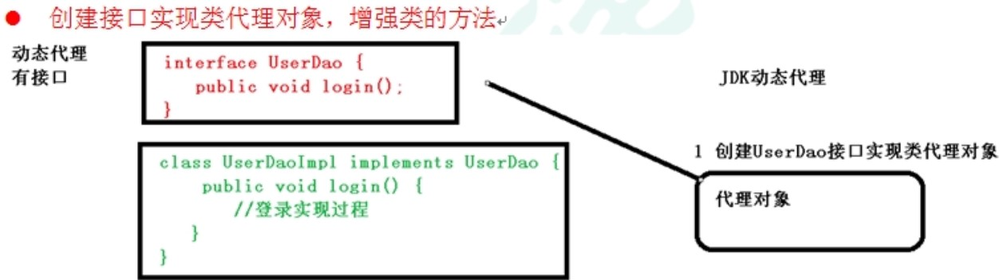
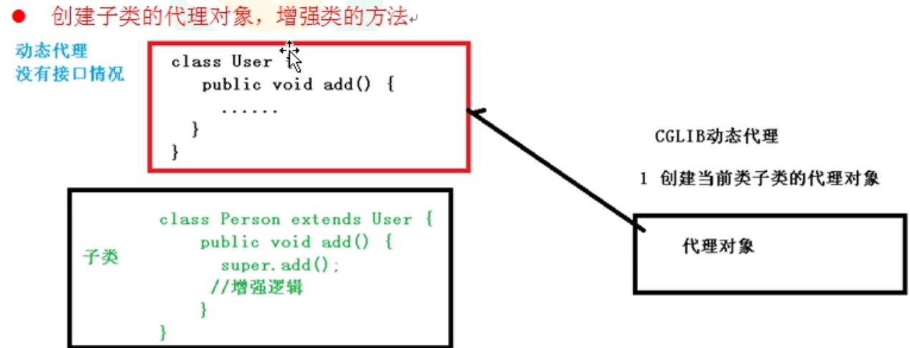
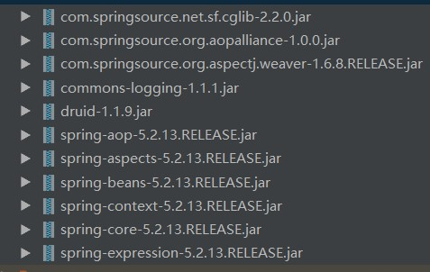
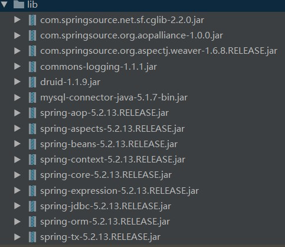
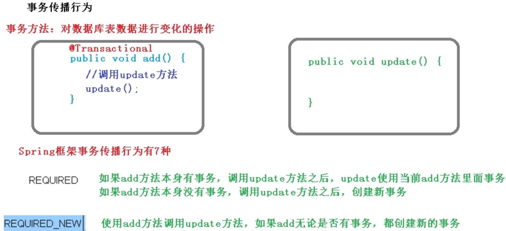
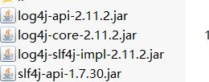

# Spring学习笔记

-----

### Spring基本介绍

##### Spring框架概述

> 1. Spring是轻量级的开源的JavaEE框架
>
> 2. Spring可以解决企业应用开发的复杂性
>
> 3. Spring有两个核心部分：IOC和AOP
>
>    (1) IOC：控制反转，把创建对象的过程交给Spring进行管理
>
>    (4) AOP：面向切面，不修改源代码进行功能增强
>
> 4. Spring特点：
>
>    (1) 方便解耦，简化开发
>
>    (2) AOP编程支持
>
>    (3) 方便程序测试
>
>    (4) 方便和其他框架进行整合
>
>    (5) 方便进行事务的操作
>
>    (6) 降低JavaEE API开发难度
>
> **入门案例**
>
> 需要导入的包：
>
> 1. commons-logging-1.1.1.jar
> 2. spring-beans-5.2.13.RELEASE.jar
> 3. spring-context-5.2.13.RELEASE.jar
> 4. spring-core-5.2.13.RELEASE.jar
> 5. spring-expression-5.2.13.RELEASE.jar
>
> ```java
> package com.atguigu.spring5.test;
> 
> import com.atguigu.spring5.User;
> import org.junit.Test;
> import org.springframework.context.ApplicationContext;
> import org.springframework.context.support.ClassPathXmlApplicationContext;
> 
> public class TestSpring5 {
> 
>     @Test
>     public void testAdd(){
>         // 1.加载Spring配置文件
>         ApplicationContext context = new ClassPathXmlApplicationContext("bean1.xml");
>         // 2.获取配置创建的对象
>         User user = context.getBean("user", User.class);
>         System.out.println(user);
>         user.add();
>     }
> }
> ```
>
> ```java
> package com.atguigu.spring5;
> public class User {
>     public void add(){
>         System.out.println("add......");
>     }
> }
> ```
>
> ```xml
> <?xml version="1.0" encoding="UTF-8"?>
> <beans xmlns="http://www.springframework.org/schema/beans"
>        xmlns:xsi="http://www.w3.org/2001/XMLSchema-instance"
>        xsi:schemaLocation="http://www.springframework.org/schema/beans http://www.springframework.org/schema/beans/spring-beans.xsd">
> 
>     <bean id="user" class="com.atguigu.spring5.User"></bean>
> </beans>
> ```

##### IOC容器

> **什么是IOC**
>
> (1) 控制反转，把对象创建和对象之间的调用过程，交给Spring进行管理
>
> (2) 使用IOC目的：为了降低耦合度
>
> **IOC底层原理**
>
> (1) xml解析、工厂模式、反射
>
> **IOC过程**
>
> 第一步：xml配置文件，配置创建的对象
>
> ```xml
> <bean id="dao" class="com.atguigu.UserDao"></bean>
> ```
>
> 第二步：有Service类和dao类，创建工厂类
>
> ```java
> class UserFactory {
> public static UserDao getDao(){
> String classValue = class属性值;  // xml解析
> Class clazz = Class.forName(classValue);	// 通过反射创建对象
> return (UserDao)clazz.newInstance();
> }
> }
> ```
>
> **IOC接口**
>
> 1. IOC思想基于IOC容器完成，IOC容器底层就是对象工厂
>
> 2. Spring提供IOC容器实现两种方式：（两个接口）
>
>    (1) BeanFactory：IOC容器基本实现，是Spring内部使用接口，不提供给开发人员使用，在加载配置文件的时候不会创建对象，而是在获取对象时才去创建对象
>
>    (2) ApplicationContext：BeanFactory接口的子接口，提供更多更强大的功能，一般由开发人员进行使用，在加载配置文件的时候就会根据配置创建对象
>
> 3. ApplicationContext接口有实现类（FileSystemXmlApplicationContext、ClassPathXmlApplicationContext）
>
> **IOC操作---Bean管理**
>
> 1. 什么是Bean管理
>
>    (1) Spring创建对象
>
>    (2) Spring注入属性
>
> 2. Bean管理操作有两种方式
>
>    (1) 基于xml配置文件方式实现
>
>    *基于xml方式创建对象*
>
>    a. 在Spring配置文件中，使用bean标签，标签里面添加对应属性，就可以实现对象创建
>
>    b. 在bean标签有很多属性，介绍常用的属性
>
>    	* id属性：唯一标识
>    	* class属性：类全路径(包类路径)
>    	* 创建对象的时候，默认也是执行无参数构造方法完成对象创建
>
>    *基于xml方式注入属性*
>
>    a. DI：依赖注入，就是注入属性
>
>    第一种注入方式：使用set方法进行注入
>
>    第二种方式：使用有参构造进行注入
>
>    ```java
>    package com.atguigu.spring5;
>    public class Book {
>
>        private String bname;
>        private String bauthor;
>
>        public Book() {
>        }
>
>        public Book(String bname, String bauthor) {
>            this.bname = bname;
>            this.bauthor = bauthor;
>        }
>
>        public String getBname() {
>            return bname;
>        }
>
>        public void setBname(String bname) {
>            this.bname = bname;
>        }
>
>        public String getBauthor() {
>            return bauthor;
>        }
>
>        public void setBauthor(String bauthor) {
>            this.bauthor = bauthor;
>        }
>
>        public void test(){
>            System.out.println(bname + "::" + bauthor);
>        }
>    }
>    ```
>
>    ```java
>    package com.atguigu.spring5.test;
>
>    import com.atguigu.spring5.Book;
>    import com.atguigu.spring5.User;
>    import org.junit.Test;
>    import org.springframework.context.ApplicationContext;
>    import org.springframework.context.support.ClassPathXmlApplicationContext;
>
>    public class TestSpring5 {
>
>        @Test
>        public void testAdd(){
>            // 1.加载Spring配置文件
>            ApplicationContext context = new ClassPathXmlApplicationContext("bean1.xml");
>            // 2.获取配置创建的对象
>            User user = context.getBean("user", User.class);
>            System.out.println(user);
>            user.add();
>        }
>
>        @Test
>        public void testBook1(){
>            ApplicationContext context = new ClassPathXmlApplicationContext("bean1.xml");
>            Book book = context.getBean("book", Book.class);
>            book.test();
>        }
>    }
>    ```
>
>    ```xml
>    <?xml version="1.0" encoding="UTF-8"?>
>    <beans xmlns="http://www.springframework.org/schema/beans"
>           xmlns:xsi="http://www.w3.org/2001/XMLSchema-instance"
>           xsi:schemaLocation="http://www.springframework.org/schema/beans http://www.springframework.org/schema/beans/spring-beans.xsd">
>        <bean id="user" class="com.atguigu.spring5.User"></bean>
>        <!--set方法注入属性-->
>     <!--   <bean id="book" class="com.atguigu.spring5.Book">
>            &lt;!&ndash;使用property完成属性注入
>                name : 类的属性名称
>                value : 类的属性的值
>            &ndash;&gt;
>            <property name="bname" value="易筋经"></property>
>            <property name="bauthor" value="达摩老祖"></property>
>        </bean>-->
>
>        <!--有参构造注入属性-->
>        <bean id="book" class="com.atguigu.spring5.Book">
>            <constructor-arg name="bname" value="北冥神功"></constructor-arg>
>            <constructor-arg name="bauthor" value="远古大能"></constructor-arg>
>        </bean>
>    </beans>
>    ```
>
>    第三种方式：p名称空间注入（底层用的是set方法注入）
>
>    ```xml
>    <?xml version="1.0" encoding="UTF-8"?>
>    <beans xmlns="http://www.springframework.org/schema/beans"
>           xmlns:xsi="http://www.w3.org/2001/XMLSchema-instance"
>           xmlns:p="http://www.springframework.org/schema/p"
>           xsi:schemaLocation="http://www.springframework.org/schema/beans http://www.springframework.org/schema/beans/spring-beans.xsd">
>        <bean id="book" class="com.atguigu.spring5.Book" p:bname="九阳神功" p:bauthor="无名氏"></bean>
>    </beans>
>    ```
>
>    特殊情况：
>
>    1. 注入空值
>
>    ```xml
>    <?xml version="1.0" encoding="UTF-8"?>
>    <beans xmlns="http://www.springframework.org/schema/beans"
>           xmlns:xsi="http://www.w3.org/2001/XMLSchema-instance"
>           xsi:schemaLocation="http://www.springframework.org/schema/beans http://www.springframework.org/schema/beans/spring-beans.xsd">
>
>        <bean id="book" class="com.atguigu.spring5.Book">
>            <property name="bname">
>                <null></null>
>            </property>
>            <property name="bauthor">
>                <null></null>
>            </property>
>        </bean>
>    </beans>
>    ```
>
>    2. 属性包含特殊符号
>
>    ```xml
>    <?xml version="1.0" encoding="UTF-8"?>
>    <beans xmlns="http://www.springframework.org/schema/beans"
>           xmlns:xsi="http://www.w3.org/2001/XMLSchema-instance"
>           xsi:schemaLocation="http://www.springframework.org/schema/beans http://www.springframework.org/schema/beans/spring-beans.xsd">
>    <!--第一种方式：使用转义字符-->
>
>    <!--第二种方式，使用CDATA-->
>    <bean id="book" class="com.atguigu.spring5.Book">
>        <property name="bname">
>            <value><![CDATA[<<太极拳>>]]></value>
>        </property>
>        <property name="bauthor">
>            <value><![CDATA["张三丰"]]></value>
>        </property>
>    </bean>
>    </beans>
>    ```
>
>    注入外部Bean
>
>    代码示例如下：
>
>    UserService.java
>
>    ```java
>    package com.atguigu.spring5.service;
>
>    import com.atguigu.spring5.dao.UserDao;
>
>    public class UserService {
>        private UserDao userDao;
>
>        public UserDao getUserDao() {
>            return userDao;
>        }
>
>        public void setUserDao(UserDao userDao) {
>            this.userDao = userDao;
>        }
>
>        public void add(){
>            System.out.println("service add ...");
>            userDao.update();
>        }
>    }
>    ```
>
>    UserDao.java
>
>    ```java
>    package com.atguigu.spring5.dao;
>
>    public interface UserDao {
>        public void update();
>    }
>    ```
>
>    UserDaoImpl.java
>
>    ```java
>    package com.atguigu.spring5.dao;
>
>    public class UserDaoImpl implements UserDao {
>        @Override
>        public void update() {
>            System.out.println("dao update ...");
>        }
>    }
>    ```
>
>    bean1.xml
>
>    ```xml
>    <?xml version="1.0" encoding="UTF-8"?>
>    <beans xmlns="http://www.springframework.org/schema/beans"
>           xmlns:xsi="http://www.w3.org/2001/XMLSchema-instance"
>           xsi:schemaLocation="http://www.springframework.org/schema/beans http://www.springframework.org/schema/beans/spring-beans.xsd">
>
>        <bean id="userService" class="com.atguigu.spring5.service.UserService">
>            <property name="userDao" ref="userDaoImpl"></property>
>        </bean>
>        <bean id="userDaoImpl" class="com.atguigu.spring5.dao.UserDaoImpl"></bean>
>    </beans>
>    ```
>
>    TestBean.java
>
>    ```java
>    package com.atguigu.spring5.test;
>
>    import com.atguigu.spring5.service.UserService;
>    import org.junit.Test;
>    import org.springframework.context.ApplicationContext;
>    import org.springframework.context.support.ClassPathXmlApplicationContext;
>
>    public class TestBean {
>        @Test
>        public void testAdd(){
>            ApplicationContext context = new ClassPathXmlApplicationContext("bean1.xml");
>            UserService userService = context.getBean("userService", UserService.class);
>            userService.add();
>        }
>    }
>    ```
>
>    内部bean
>
>    ```xml
>    <?xml version="1.0" encoding="UTF-8"?>
>    <beans xmlns="http://www.springframework.org/schema/beans"
>           xmlns:xsi="http://www.w3.org/2001/XMLSchema-instance"
>           xsi:schemaLocation="http://www.springframework.org/schema/beans http://www.springframework.org/schema/beans/spring-beans.xsd">
>        <!--内部bean-->
>        <bean id="emp" class="com.atguigu.spring5.bean.Emp">
>            <property name="ename" value="lucy"></property>
>            <property name="gender" value="女"></property>
>            <!--设置对象类型属性-->
>            <property name="dept">
>                <bean id="dept" class="com.atguigu.spring5.bean.Dept">
>                    <property name="dname" value="客服部"></property>
>                </bean>
>            </property>
>        </bean>
>    </beans>
>    ```
>
>    级联赋值
>
>    第一种写法
>
>    ```xml
>    <?xml version="1.0" encoding="UTF-8"?>
>    <beans xmlns="http://www.springframework.org/schema/beans"
>           xmlns:xsi="http://www.w3.org/2001/XMLSchema-instance"
>           xsi:schemaLocation="http://www.springframework.org/schema/beans http://www.springframework.org/schema/beans/spring-beans.xsd">
>        <!--内部bean-->
>        <bean id="emp" class="com.atguigu.spring5.bean.Emp">
>            <property name="ename" value="lucy"></property>
>            <property name="gender" value="女"></property>
>            <!--设置对象类型属性-->
>            <property name="dept" ref="dept"></property>
>        </bean>
>        <bean id="dept" class="com.atguigu.spring5.bean.Dept">
>            <property name="dname" value="财务部"></property>
>        </bean>
>    </beans>
>    ```
>
>    第二种写法
>
>    ```xml
>    <?xml version="1.0" encoding="UTF-8"?>
>    <beans xmlns="http://www.springframework.org/schema/beans"
>           xmlns:xsi="http://www.w3.org/2001/XMLSchema-instance"
>           xsi:schemaLocation="http://www.springframework.org/schema/beans http://www.springframework.org/schema/beans/spring-beans.xsd">
>        <!--内部bean-->
>        <bean id="emp" class="com.atguigu.spring5.bean.Emp">
>            <property name="ename" value="lucy"></property>
>            <property name="gender" value="女"></property>
>            <!--设置对象类型属性-->
>            <property name="dept" ref="dept"></property>
>            <!--需要在Emp类中生成dept的get方法getDept()-->
>            <property name="dept.dname" value="销售部"></property>
>        </bean>
>        <bean id="dept" class="com.atguigu.spring5.bean.Dept">
>            <property name="dname" value="财务部"></property>
>        </bean>
>    </beans>
>    ```
>
>    xml注入集合属性
>
>    ```xml
>    <?xml version="1.0" encoding="UTF-8"?>
>    <beans xmlns="http://www.springframework.org/schema/beans"
>           xmlns:xsi="http://www.w3.org/2001/XMLSchema-instance"
>           xsi:schemaLocation="http://www.springframework.org/schema/beans http://www.springframework.org/schema/beans/spring-beans.xsd">
>        <!--集合类型属性注入-->
>        <bean id="stu" class="com.atguigu.spring5.collecttype.Stu">
>            <!--数组类型注入-->
>            <property name="courses">
>                <array>
>                    <value>英语</value>
>                    <value>数学</value>
>                </array>
>            </property>
>            <!--List类型注入-->
>            <property name="list">
>                <list>
>                    <value>宁毅</value>
>                    <value>宁立恒</value>
>                    <value>血手人屠</value>
>                </list>
>            </property>
>            <!--Map类型注入-->
>            <property name="maps">
>                <map>
>                    <entry key="java" value="java课程"></entry>
>                    <entry key="dbms" value="数据库课程"></entry>
>                </map>
>            </property>
>            <!--Set类型注入-->
>            <property name="sets">
>                <set>
>                    <value>MySQL</value>
>                    <value>Redis</value>
>                </set>
>            </property>
>            <!--注入list集合类型，值是对象-->
>            <property name="courseList">
>                <list>
>                    <ref bean="course1"></ref>
>                    <ref bean="course2"></ref>
>                </list>
>            </property>
>        </bean>
>        <!--创建多个course对象-->
>        <bean id="course1" class="com.atguigu.spring5.collecttype.Course">
>            <property name="cno" value="1"></property>
>            <property name="cname" value="Spring5框架"></property>
>        </bean>
>        <bean id="course2" class="com.atguigu.spring5.collecttype.Course">
>            <property name="cno" value="2"></property>
>            <property name="cname" value="MyBatis框架"></property>
>        </bean>
>    </beans>
>    ```
>
>    抽取集合公共部分
>
>    ```xml
>    <?xml version="1.0" encoding="UTF-8"?>
>    <beans xmlns="http://www.springframework.org/schema/beans"
>           xmlns:xsi="http://www.w3.org/2001/XMLSchema-instance"
>           xmlns:util="http://www.springframework.org/schema/util"
>           xsi:schemaLocation="http://www.springframework.org/schema/beans http://www.springframework.org/schema/beans/spring-beans.xsd
>                               http://www.springframework.org/schema/util  http://www.springframework.org/schema/util/spring-util.xsd">
>        <!--提取list集合类型属性注入-->
>        <util:list id="bookList">
>            <value>易筋经</value>
>            <value>九阴真经</value>
>            <value>九阳神功</value>
>        </util:list>
>        <!--提取list集合类型属性注入-->
>        <bean id="book" class="com.atguigu.spring5.collecttype.Book">
>            <property name="list" ref="bookList"></property>
>        </bean>
>    </beans>
>    ```
>
>    工厂Bean
>
>    ```java
>    package com.atguigu.spring5.factorybean;
>
>    import com.atguigu.spring5.collecttype.Course;
>    import org.springframework.beans.factory.FactoryBean;
>
>    public class MyBean implements FactoryBean<Course> {
>        @Override
>        public Course getObject() throws Exception {
>            // 定义返回的bean
>            Course course = new Course();
>            course.setCno(1);
>            course.setCname("数学");
>            return course;
>        }
>
>        @Override
>        public Class<?> getObjectType() {
>            return null;
>        }
>
>        @Override
>        public boolean isSingleton() {
>            return false;
>        }
>    }
>    ```
>
>    ```java
>    package com.atguigu.spring5.collecttype;
>
>    public class Course {
>
>        private Integer cno;
>        private String cname;
>
>        public void setCname(String cname) {
>            this.cname = cname;
>        }
>
>        public void setCno(Integer cno) {
>            this.cno = cno;
>        }
>
>        @Override
>        public String toString() {
>            return "Course{" +
>                    "cno=" + cno +
>                    ", cname='" + cname + '\'' +
>                    '}';
>        }
>    }
>    ```
>
>    ```java
>    public void test5(){
>        ApplicationContext context = new ClassPathXmlApplicationContext("bean3.xml");
>        Course course = context.getBean("myBean", Course.class);
>        System.out.println(course);
>    }
>    ```
>
>    ```xml
>    <?xml version="1.0" encoding="UTF-8"?>
>    <beans xmlns="http://www.springframework.org/schema/beans"
>           xmlns:xsi="http://www.w3.org/2001/XMLSchema-instance"
>           xsi:schemaLocation="http://www.springframework.org/schema/beans http://www.springframework.org/schema/beans/spring-beans.xsd">
>        <bean id="myBean" class="com.atguigu.spring5.factorybean.MyBean"></bean>
>    </beans>
>    ```
>
>    如何设置bean是单实例还是多实例
>
>    a. 在Spring配置文件bean标签里面有属性（scope）用于设置单实例还是多实例
>
>    b. scope属性值
>
>    第一个值：默认值，singleton，表示单实例对象（加载配置文件时，创建对象）
>
>    第二个值：prototype，表示多实例对象（获取对象的时候创建）
>
>    bean生命周期
>
>    a. 通过构造器创建bean实例（无参构造）
>
>    b. 为bean的属性设置值和对其他bean引用（调用set方法）
>
>    c. 把bean实例传递给bean前置处理器的方法
>
>    d. 调用bean的初始化方法（需要进行配置初始化方法）
>
>    e. 把bean实例传递给bean后置处理器的方法
>
>    f. bean可以使用了（对象获取到了）
>
>    g. 当容器关闭的时候，调用bean的销毁方法（需要进行配置销毁的方法） 
>
>    xml自动装配
>
>    什么是自动装配
>
>    a. 根据指定装配规则（属性名称或者属性类型）,Spring自动将匹配的属性值进行注入
>
>    bean标签属性autowire，配置自动装配
>
>    autowire属性常用两个值：
>
>    ​	byName根据属性名称注入，注入值bean的id值和类属性名称一样
>
>    ​	byType根据属性类型注入
>
>    ```xml
>    <?xml version="1.0" encoding="UTF-8"?>
>    <beans xmlns="http://www.springframework.org/schema/beans"
>           xmlns:xsi="http://www.w3.org/2001/XMLSchema-instance"
>           xsi:schemaLocation="http://www.springframework.org/schema/beans http://www.springframework.org/schema/beans/spring-beans.xsd">
>        <bean id="emp" class="com.atguigu.spring5.autowire.Emp" autowire="byType"></bean>
>        <bean id="dept" class="com.atguigu.spring5.autowire.Dept"></bean>
>    </beans>
>    ```
>
>    引入外部属性文件
>
>    ```xml
>    <?xml version="1.0" encoding="UTF-8"?>
>    <beans xmlns="http://www.springframework.org/schema/beans"
>           xmlns:xsi="http://www.w3.org/2001/XMLSchema-instance"
>           xmlns:util="http://www.springframework.org/schema/util"
>           xmlns:context="http://www.springframework.org/schema/context"
>           xsi:schemaLocation="http://www.springframework.org/schema/beans http://www.springframework.org/schema/beans/spring-beans.xsd
>                               http://www.springframework.org/schema/util http://www.springframework.org/schema/util/spring-util.xsd
>                               http://www.springframework.org/schema/context  http://www.springframework.org/schema/context/spring-context.xsd">
>        <!-- 直接配置 -->
>        <!--<bean id="dataSource" class="com.alibaba.druid.pool.DruidDataSource">-->
>            <!--<property name="driverClassName" value="com.alibaba.druid.pool.DruidDataSource"></property>-->
>            <!--<property name="url" value="jdbc:mysql://localhost:3306/userDb"></property>-->
>            <!--<property name="username" value="root"></property>-->
>            <!--<property name="password" value="root"></property>-->
>        <!--</bean>-->
>        <!--引入外部属性文件-->
>        <context:property-placeholder location="classpath:jdbc.properties" />
>        <bean id="dataSource" class="com.alibaba.druid.pool.DruidDataSource">
>            <property name="driverClassName" value="${prop.driverClass}"></property>
>            <property name="url" value="${prop.url}"></property>
>            <property name="username" value="${prop.userName}"></property>
>            <property name="password" value="${prop.password}"></property>
>        </bean>
>    </beans>
>    ```
>
>    ```properties
>    prop.driverClass=com.mysql.jdbc.Driver
>    prop.url=jdbc:mysql://localhost:3306/userDb
>    prop.userName=root
>    prop.password=root
>    ```
>
>    (2) 基于注解方式实现
>
>    Spring针对Bean管理中创建对象提供注解
>
>    a. @Component
>
>    b. @Service
>
>    c. @Controller
>
>    d. @Repository
>
>    上面四个注解功能是一样的，都可以用来创建bean实例
>
>    注解方式创建对象示例：
>
>    ```xml
>    <?xml version="1.0" encoding="UTF-8"?>
>    <beans xmlns="http://www.springframework.org/schema/beans"
>           xmlns:xsi="http://www.w3.org/2001/XMLSchema-instance"
>           xmlns:context="http://www.springframework.org/schema/context"
>           xsi:schemaLocation="http://www.springframework.org/schema/beans http://www.springframework.org/schema/beans/spring-beans.xsd
>                               http://www.springframework.org/schema/context http://www.springframework.org/schema/context/spring-context.xsd">
>        <!--开启组件扫描
>            1. 如果扫描多个包，多个包使用逗号隔开
>            2. 扫描包上层目录
>        -->
>        <context:component-scan base-package="com.atguigu.spring5.dao,com.atguigu.spring5.service"></context:component-scan>
>    </beans>
>    ```
>
>    ```java
>    package com.atguigu.spring5.service;
>
>    import org.springframework.stereotype.Component;
>
>    // 在注解里面value属性值可以省略不写
>    // 默认值是类名称，首字母小写
>    @Component(value = "userService")
>    public class UserService {
>        public void add(){
>            System.out.println("service add...");
>        }
>    }
>    ```
>
>    ```java
>    package com.atguigu.spring5.test;
>
>    import com.atguigu.spring5.service.UserService;
>    import org.junit.Test;
>    import org.springframework.context.ApplicationContext;
>    import org.springframework.context.support.ClassPathXmlApplicationContext;
>
>    public class TestDemo {
>        @Test
>        public void test(){
>            ApplicationContext context = new ClassPathXmlApplicationContext("bean1.xml");
>            UserService userService = context.getBean("userService", UserService.class);
>            userService.add();
>        }
>    }
>    ```
>
>    组件扫描配置
>
>    ```xml
>    <?xml version="1.0" encoding="UTF-8"?>
>    <beans xmlns="http://www.springframework.org/schema/beans"
>           xmlns:xsi="http://www.w3.org/2001/XMLSchema-instance"
>           xmlns:context="http://www.springframework.org/schema/context"
>           xsi:schemaLocation="http://www.springframework.org/schema/beans http://www.springframework.org/schema/beans/spring-beans.xsd
>                               http://www.springframework.org/schema/context http://www.springframework.org/schema/context/spring-context.xsd">
>
>        <!--示例1
>            use-default-filters="false" 表示现在不使用默认filter，自己配置filter
>            context:include-filter： 设置扫描哪些内容
>            这个示例表示扫描com.atguigu.spring5包下，带有@Controller注解的类
>        -->
>        <!--
>        <context:component-scan base-package="com.atguigu.spring5" use-default-filters="false">
>            <context:include-filter type="annotation" expression="org.springframework.stereotype.Controller"></context:include-filter>
>        </context:component-scan>
>        -->
>
>        <!--示例2
>            下面配置扫描包的所有内容
>            context:exclude-filter：设置哪些内容不进行扫描
>        -->
>        <context:component-scan base-package="com.atguigu.spring5">
>            <context:exclude-filter type="annotation" expression="org.springframework.stereotype.Controller"></context:exclude-filter>
>        </context:component-scan>
>    </beans>
>    ```
>
>    基于注解方式实现属性注入
>
>    a. @Autowired：根据属性类型进行自动装配（如果接口有多个实现类，会找不到）
>
>    b. @Qualifier：根据属性名称进行注入（接口有多个实现类，可以使用名称注入）
>
>    c. @Resource：可以根据属性类型注入，也可以根据名称注入
>
>    d. @Value：注入普通类型属性
>
>    ```java
>    package com.atguigu.spring5.service;
>    import com.atguigu.spring5.dao.UserDao;
>    import org.springframework.beans.factory.annotation.Autowired;
>    import org.springframework.stereotype.Service;
>
>    // 在注解里面value属性值可以省略不写
>    // 默认值是类名称，首字母小写
>    @Service
>    public class UserService {
>        @Autowired	// 根据类型注入
>        private UserDao userDao;
>
>        public void add(){
>            System.out.println("service add...");
>            userDao.add();
>        }
>    }
>    ```
>
>    ```java
>    package com.atguigu.spring5.service;
>    import com.atguigu.spring5.dao.UserDao;
>    import org.springframework.beans.factory.annotation.Autowired;
>    import org.springframework.beans.factory.annotation.Qualifier;
>    import org.springframework.stereotype.Service;
>
>    // 在注解里面value属性值可以省略不写
>    // 默认值是类名称，首字母小写
>    @Service
>    public class UserService {
>        @Autowired
>        @Qualifier(value = "userDaoImpl1")  // 根据属性名称注入，使用Qualifier注解时，@Autowired也要一起使用
>        private UserDao userDao;
>
>        public void add(){
>            System.out.println("service add...");
>            userDao.add();
>        }
>    }
>    ```
>
>
>    //=============================================================
>    package com.atguigu.spring5.dao;
>
>    import org.springframework.stereotype.Repository;
>
>    @Repository(value = "userDaoImpl1")
>    public class UserDaoImpl implements UserDao {
>
>        @Override
>        public void add() {
>            System.out.println("userDaoImpl1 add ...");
>        }
>    }
>    ```
> 
>    ```java
>    package com.atguigu.spring5.service;
>    import com.atguigu.spring5.dao.UserDao;
>    import org.springframework.beans.factory.annotation.Value;
>    import org.springframework.stereotype.Service;
>    import javax.annotation.Resource;
> 
>    // 在注解里面value属性值可以省略不写
>    // 默认值是类名称，首字母小写
>    @Service
>    public class UserService {
>    //    @Resource   // 根据类型进行注入
>        @Resource(name = "userDaoImpl1")    // 根据名称进行注入
>        private UserDao userDao;
> 
>        @Value(value = "Tom") // 注入普通属性
>        private String name;
> 
>        public void add(){
>            System.out.println("service add..." + name);
>            userDao.add();
>        }
>    }
>    ```
>
>    完全注解开发
>
>    ```java
>    package com.atguigu.spring5.config;
>    import org.springframework.context.annotation.ComponentScan;
>    import org.springframework.context.annotation.Configuration;
> 
>    @Configuration  // 作为配置类，替代xml配置文件
>    @ComponentScan(basePackages = {"com.atguigu.spring5"})
>    public class SpringConfig {
> 
>    }
>    ```
>
>    ```java
>    public void test2(){
>        ApplicationContext context = new AnnotationConfigApplicationContext(SpringConfig.class);
>        UserService userService = context.getBean("userService", UserService.class);
>        userService.add();
>    }
>    ```

### AOP

##### AOP基本概念

> **什么是AOP**
>
> 1. 面向切面编程，利用AOP可以对业务逻辑的各个部分进行隔离，从而使得业务逻辑各部分之间的耦合度降低，提高程序的可重用性，同时提高了开发效率
> 2. 通俗描述：不通过修改源代码方式，在主干功能里面添加新功能

##### AOP底层原理

> 1. 底层使用了动态代理
>
>    1. 有两种情况的动态代理
>
>       1. 第一种  有接口情况，使用JDK动态代理
>
>          示意图：
>
>          
>
>       2. 第二种  没有接口情况，使用CGLIB动态代理
>
>          示意图
>
>          
>
>    AOP(JDK动态代理)
>
>    1. 使用JDK动态代理，使用Proxy类里面的方法创建代理对象
>
>    2. 调用newProxyInstance方法【    newProxyInstance(ClassLoader loader,Class<?>[] interfaces, InvocationHandler h)    】
>
>       方法有三个参数，第一个参数：类加载器；第二个参数：增强方法所在的类，这个类实现的接口，支持多个接口；第三个参数：实现这个接口InvocationHandler，创建代理对象，写增强的方法
>
>       代码示例：
>
>       ```java
>       package com.atguigu.spring5;
>       import java.lang.reflect.InvocationHandler;
>       import java.lang.reflect.Method;
>       import java.lang.reflect.Proxy;
>       import java.util.Arrays;
>       
>       public class JDKProxy {
>       
>           public static void main(String[] args) {
>               // 创建接口实现类代理对象
>               Class[] interfaces = {UserDao.class};
>       //        第一种方法：匿名内部类
>       //        Proxy.newProxyInstance(JDKProxy.class.getClassLoader(), interfaces, new InvocationHandler() {
>       //            @Override
>       //            public Object invoke(Object proxy, Method method, Object[] args) throws Throwable {
>       //                return null;
>       //            }
>       //        });
>       //        第二种方法：创建类实现InvocationHandler接口
>               UserDaoImpl userDao = new UserDaoImpl();
>               UserDao dao = (UserDao)Proxy.newProxyInstance(JDKProxy.class.getClassLoader(), interfaces, new UserDaoProxy(userDao));
>               int result = dao.add(1, 2);
>               System.out.println("result : " + result);
>           }
>       }
>       
>       class UserDaoProxy implements InvocationHandler{
>       
>           // 把创建的是谁的代理对象，就把谁传递过来
>           // 有参构造传递
>           private Object obj;
>           public UserDaoProxy(Object obj){
>               this.obj = obj;
>           }
>       
>           // 增强的逻辑
>           @Override
>           public Object invoke(Object proxy, Method method, Object[] args) throws Throwable {
>       
>               // 方法之前执行
>               System.out.println("方法之前执行......" + method.getName() + " : " + Arrays.toString(args));
>       
>               Object res = method.invoke(obj,args);
>       
>               // 方法之后执行
>               System.out.println("方法之后执行......");
>               return res;
>           }
>       }
>       ```
>
>       ```java
>       package com.atguigu.spring5;
>       
>       public interface UserDao {
>       
>           public int add (int a,int b);
>           public String update(String id);
>       }
>       ```
>
>       ```java
>       package com.atguigu.spring5;
>       
>       public class UserDaoImpl implements UserDao {
>           @Override
>           public int add(int a, int b) {
>               return a + b;
>           }
>       
>           @Override
>           public String update(String id) {
>               return id;
>           }
>       }
>       ```

##### AOP操作术语

> 1. 连接点 （类里面哪些方法可以被增强，这些方法称为连接点）
> 2. 切入点 （实际被真正增强的方法，称为切入点）
> 3. 通知（增强）实际增强的逻辑部分称为通知或增强【通知有多种类型：前置通知，后置通知，环绕通知，异常通知，最终通知】
> 4. 切面  （把通知应用到切入点的过程叫做切面）

##### AOP操作（准备）

> 1. Spring框架一般基于AspectJ实现AOP操作
>
>    AspectJ不是Spring组成部分，是独立的AOP框架，一般把AspectJ和Spring框架一起使用，进行AOP操作
>
> 2. 基于AspectJ实现AOP操作
>
>    两种方式：基于xml配置文件实现和基于注解方式实现
>
> 3. 引入AOP相关依赖
>
> 
>
> 4. 切入点表达式
>
>    切入点表达式作用：知道对哪个类里面的哪个方法进行增强
>
>    语法结构：execution( [权限修饰符] [返回类型] [类全路径] [方法名称] (参数列表) )
>
>    举例1：对com.atguigu.dao.BookDao类里面的add进行增强
>
>    execution(*com.atguigu.dao.BookDao.add(..)) 【 *表示任意权限修饰符 】
>
>    举例2：对com.atguigu.dao.BookDao类里面的所有方法进行增强
>
>    execution( * com.atguigu.dao.BookDao. *(..))
>
>    举例3：对com.atguigu.dao包里面的所有类里面的所有方法进行增强
>
>    execution( * com.atguigu.dao.*. *(..))

##### AspectJ注解

> ```java
> package com.atguigu.spring5.aopanno;
> import org.springframework.stereotype.Component;
> // 被增强的类
> @Component
> public class User {
>  public void add(){
>      System.out.println("add ......");
>  }
> }
> ```
>
> ```java
> package com.atguigu.spring5.aopanno;
> import org.aspectj.lang.ProceedingJoinPoint;
> import org.aspectj.lang.annotation.*;
> import org.springframework.core.annotation.Order;
> import org.springframework.stereotype.Component;
> 
> // 增强类
> @Component
> @Aspect
> @Order(3)
> public class UserProxy {
> 
>  // 相同切入点抽取
>  @Pointcut(value = "execution(* com.atguigu.spring5.aopanno.User.add(..))")
>  public void pointDemo(){
> 
>  }
> 
>  // 前置通知
>  // @Before注解表示前置通知，在被增强的方法的前面执行
>  @Before(value = "pointDemo()")
>  public void before(){
>      System.out.println("before......");
>  }
> 
>  // 后置通知也叫返回通知
>  // @AfterReturning注解表示后置通知，在被增强的方法返回结果之后执行，有异常不会执行
>  @AfterReturning(value = "execution(* com.atguigu.spring5.aopanno.User.add(..))")
>  public void afterReturning(){
>      System.out.println("afterReturning......");
>  }
> 
>  // 最终通知
>  // @After注解表示最终通知，在被增强的方法的后面执行，也叫最终通知，不管有没有异常都会执行
>  @After(value = "pointDemo()")
>  public void after(){
>      System.out.println("after......");
>  }
> 
>  // 异常通知
>  // @AfterThrowing注解表示异常通知，在被增强的方法出现异常时执行
>  @AfterThrowing(value = "execution(* com.atguigu.spring5.aopanno.User.add(..))")
>  public void afterThrowing(){
>      System.out.println("afterThrowing......");
>  }
> 
>  // 环绕通知
>  // @Around注解表示环绕通知，在被增强的方法的前面和后面执行
>  @Around(value = "execution(* com.atguigu.spring5.aopanno.User.add(..))")
>  public void around(ProceedingJoinPoint proceedingJoinPoint) throws Throwable {
>      System.out.println("环绕之前......");
>      // 被增强方法执行
>      proceedingJoinPoint.proceed();
>      System.out.println("环绕之后......");
>  }
> }
> ```
>
> ```java
> package com.atguigu.spring5.aopanno;
> import org.aspectj.lang.annotation.Aspect;
> import org.aspectj.lang.annotation.Before;
> import org.springframework.core.annotation.Order;
> import org.springframework.stereotype.Component;
> 
> // 有多个增强类对同一个方法进行增强，可以设置增强类优先级
> // 在增强类上面添加注解@Order(数字类型值)，值越小优先级越高，从0开始
> // 增强类
> @Component
> @Aspect
> @Order(1)
> public class PersonProxy {
> 
>  // 前置通知
>  // @Before注解表示前置通知，在被增强的方法的前面执行
>  @Before(value = "execution(* com.atguigu.spring5.aopanno.User.add(..))")
>  public void before(){
>      System.out.println("PersonProxy before......");
>  }
> }
> ```
>
> ```java
> package com.atguigu.spring5.test;
> import com.atguigu.spring5.aopanno.User;
> import org.junit.Test;
> import org.springframework.context.ApplicationContext;
> import org.springframework.context.support.ClassPathXmlApplicationContext;
> 
> public class TestAop {
> 
>  @Test
>  public void test(){
>      ApplicationContext context = new ClassPathXmlApplicationContext("bean.xml");
>      User user = context.getBean("user", User.class);
>      user.add();
>  }
> }
> ```
>
> ```xml
> <?xml version="1.0" encoding="UTF-8"?>
> <beans xmlns="http://www.springframework.org/schema/beans"
>     xmlns:xsi="http://www.w3.org/2001/XMLSchema-instance"
>     xmlns:context="http://www.springframework.org/schema/context"
>     xmlns:aop="http://www.springframework.org/schema/aop"
>     xsi:schemaLocation="http://www.springframework.org/schema/beans http://www.springframework.org/schema/beans/spring-beans.xsd
>                         http://www.springframework.org/schema/context  http://www.springframework.org/schema/context/spring-context.xsd
>                         http://www.springframework.org/schema/aop http://www.springframework.org/schema/aop/spring-aop.xsd">
>  <!--开启注解扫描-->
>  <context:component-scan base-package="com.atguigu.spring5.aopanno"></context:component-scan>
>  <!--开启Aspect生成代理对象-->
>  <aop:aspectj-autoproxy></aop:aspectj-autoproxy>
> </beans>
> ```
>
> AOP操作（xml配置）
>
> ```java
> package com.atguigu.spring5.aopxml;
> import com.atguigu.spring5.aopanno.User;
> public class Book extends User {
>     public void buy(){
>         System.out.println("buy ......");
>     }
> }
> ```
>
> ```java
> package com.atguigu.spring5.aopxml;
> public class BookProxy {
>     public void before(){
>         System.out.println("before ......");
>     }
> }
> ```
>
> ```xml
> <?xml version="1.0" encoding="UTF-8"?>
> <beans xmlns="http://www.springframework.org/schema/beans"
>        xmlns:xsi="http://www.w3.org/2001/XMLSchema-instance"
>        xmlns:context="http://www.springframework.org/schema/context"
>        xmlns:aop="http://www.springframework.org/schema/aop"
>        xsi:schemaLocation="http://www.springframework.org/schema/beans http://www.springframework.org/schema/beans/spring-beans.xsd
>                            http://www.springframework.org/schema/context  http://www.springframework.org/schema/context/spring-context.xsd
>                            http://www.springframework.org/schema/aop http://www.springframework.org/schema/aop/spring-aop.xsd">
>     <!--创建对象-->
>     <bean id="book" class="com.atguigu.spring5.aopxml.Book"></bean>
>     <bean id="bookProxy" class="com.atguigu.spring5.aopxml.BookProxy"></bean>
>     <!--配置AOP增强-->
>     <aop:config>
>         <!--配置切入点-->
>         <aop:pointcut id="p" expression="execution(* com.atguigu.spring5.aopxml.Book.buy(..))" />
>         <!--配置切面-->
>         <aop:aspect ref="bookProxy">
>             <!--增强作用在具体的方法上  这里表示BookProxy中的before方法作用在id = p配置的方法上-->
>             <aop:before method="before" pointcut-ref="p" />
>         </aop:aspect>
>     </aop:config>
> </beans>
> ```
>
> ```java
> @Test
> public void test1(){
>     ApplicationContext context = new ClassPathXmlApplicationContext("bean1.xml");
>     Book book = context.getBean("book", Book.class);
>     book.buy();
> }
> ```
>
> 完全注解开发（配置类）
>
> ```java
> package com.atguigu.spring5.config;
> import org.springframework.context.annotation.ComponentScan;
> import org.springframework.context.annotation.Configuration;
> import org.springframework.context.annotation.EnableAspectJAutoProxy;
> 
> @Configuration
> @ComponentScan(basePackages = {"com.atguigu.spring5"})
> @EnableAspectJAutoProxy(proxyTargetClass = true)
> public class SpringConfig {
> }
> ```

### JdbcTemplate

##### 概念和准备

> 1. 什么是JdbcTemplate
>
>    a. Spring框架对JDBC进行封装，使用JdbcTemplate可以方便地实现对数据库的操作
>
>    导入包:
>
>    
>
>    b. 在spring配置文件配置连接池
>
>    ```xml
>    <!--数据库连接池-->
>    <bean id="dataSource" class="com.alibaba.druid.pool.DruidDataSource" destroy-method="close">
>        <property name="url" value="jdbc:mysql://192.168.100.199/test" />
>        <property name="username" value="root" />
>        <property name="password" value="root" />
>        <property name="driverClassName" value="com.mysql.jdbc.Driver" />
>    </bean>
>    ```
>
>    c. 配置JdbcTemplate对象，注入DataSource

##### 增删改查

> ```java
> package com.atguigu.spring5.service;
> import com.atguigu.spring5.dao.BookDao;
> import com.atguigu.spring5.entity.Book;
> import org.springframework.beans.factory.annotation.Autowired;
> import org.springframework.stereotype.Service;
> import java.util.List;
> 
> @Service
> public class BookService {
> 
>     // 注入dao
>     @Autowired
>     private BookDao bookDao;
> 
>     // 添加的方法
>     public void addBook(Book book){
>         bookDao.add(book);
>     }
> 
>     // 修改的方法
>     public void updateBook(Book book){
>         bookDao.updateBook(book);
>     }
> 
>     // 删除的方法
>     public void deleteBook(String id){
>         bookDao.delete(id);
>     }
> 
>     // 查询表记录数
>     public int findCount(){
>         return bookDao.selectCount();
>     }
> 
>     // 查询返回对象
>     public Book findOne(String id){
>         return bookDao.findBookInfo(id);
>     }
> 
>     // 查询返回集合
>     public List<Book> findAll(){
>         return bookDao.findAllBook();
>     }
> 
>     // 批量添加
>     public void batchAdd(List<Object[]> batchArgs){
>         bookDao.batchAddBook(batchArgs);
>     }
> 
>     // 批量修改
>     public void batchUpdate(List<Object[]> batchArgs){
>         bookDao.batchUpdateBook(batchArgs);
>     }
> 
>     // 批量删除
>     public void batchDelete(List<Object[]> batchArgs){
>         bookDao.batchDeleteBook(batchArgs);
>     }
> }
> ```
>
> ```java
> package com.atguigu.spring5.dao;
> import com.atguigu.spring5.entity.Book;
> 
> import java.util.List;
> 
> public interface BookDao {
> 
>     void add(Book book);
> 
>     void updateBook(Book book);
> 
>     void delete(String id);
> 
>     int selectCount();
> 
>     Book findBookInfo(String id);
> 
>     List<Book> findAllBook();
> 
>     void batchAddBook(List<Object[]> batchArgs);
> 
>     void batchUpdateBook(List<Object[]> batchArgs);
> 
>     void batchDeleteBook(List<Object[]> batchArgs);
> }
> ```
>
> ```java
> package com.atguigu.spring5.dao;
> import com.atguigu.spring5.entity.Book;
> import org.springframework.beans.factory.annotation.Autowired;
> import org.springframework.jdbc.core.BeanPropertyRowMapper;
> import org.springframework.jdbc.core.JdbcTemplate;
> import org.springframework.stereotype.Repository;
> import java.util.Arrays;
> import java.util.List;
> 
> @Repository
> public class BookDaoImpl implements BookDao {
> 
>     // 注入JdbcTemplate
>     @Autowired
>     private JdbcTemplate jdbcTemplate;
> 
>     @Override
>     public void add(Book book) {
>         String sql = "insert into t_book values (?,?,?)";
>         jdbcTemplate.update(sql,book.getUserId(),book.getUsername(),book.getUstatus());
>     }
> 
>     // 修改
>     @Override
>     public void updateBook(Book book) {
>         String sql = "update t_book set username = ?,ustatus = ? where user_id = ?";
>         Object[] args  = {book.getUsername(),book.getUstatus(),book.getUserId()};
>         int update = jdbcTemplate.update(sql, args);
>         System.out.println(update);
>     }
> 
>     // 删除
>     @Override
>     public void delete(String id) {
>         String sql = "delete from t_book where user_id = ?";
>         int update = jdbcTemplate.update(sql, id);
>         System.out.println(update);
>     }
> 
>     // 查询返回某个值
>     @Override
>     public int selectCount() {
>         String sql = "select count(*) from t_book";
>         Integer count = jdbcTemplate.queryForObject(sql, Integer.class);
>         return count;
>     }
> 
>     // 查询返回对象
>     @Override
>     public Book findBookInfo(String id) {
>         String sql = "select * from t_book where user_id = ?";
>         // 调用方法
>         Book book = jdbcTemplate.queryForObject(sql, new BeanPropertyRowMapper<Book>(Book.class), id);
>         return book;
>     }
> 
>     @Override
>     public List<Book> findAllBook() {
>         String sql = "select * from t_book";
>         List<Book> bookList = jdbcTemplate.query(sql, new BeanPropertyRowMapper<Book>(Book.class));
>         return bookList;
>     }
> 
>     @Override
>     public void batchAddBook(List<Object[]> batchArgs) {
>         String sql = "insert into t_book values(?,?,?)";
>         int[] ints = jdbcTemplate.batchUpdate(sql, batchArgs);
>         System.out.println(Arrays.toString(ints));
>     }
> 
>     @Override
>     public void batchUpdateBook(List<Object[]> batchArgs) {
>         String sql = "update t_book set username = ?,ustatus = ? where user_id = ?";
>         int[] ints = jdbcTemplate.batchUpdate(sql, batchArgs);
>         System.out.println(Arrays.toString(ints));
>     }
> 
>     @Override
>     public void batchDeleteBook(List<Object[]> batchArgs) {
>         String sql = "delete from t_book where user_id = ?";
>         int[] ints = jdbcTemplate.batchUpdate(sql, batchArgs);
>         System.out.println(Arrays.toString(ints));
>     }
> }
> ```
>
> ```java
> package com.atguigu.spring5.entity;
> public class Book {
>     private String userId;
>     private String username;
>     private String ustatus;
> 
>     public String getUserId() {
>         return userId;
>     }
> 
>     public void setUserId(String userId) {
>         this.userId = userId;
>     }
> 
>     public String getUsername() {
>         return username;
>     }
> 
>     public void setUsername(String username) {
>         this.username = username;
>     }
> 
>     public String getUstatus() {
>         return ustatus;
>     }
> 
>     public void setUstatus(String ustatus) {
>         this.ustatus = ustatus;
>     }
> 
>     @Override
>     public String toString() {
>         return "Book{" +
>                 "userId='" + userId + '\'' +
>                 ", username='" + username + '\'' +
>                 ", ustatus='" + ustatus + '\'' +
>                 '}';
>     }
> }
> ```
>
> ```java
> package com.atguigu.spring5.test;
> import com.atguigu.spring5.entity.Book;
> import com.atguigu.spring5.service.BookService;
> import org.junit.Test;
> import org.springframework.context.ApplicationContext;
> import org.springframework.context.support.ClassPathXmlApplicationContext;
> import java.util.ArrayList;
> import java.util.List;
> 
> public class TestBook {
> 
>     @Test
>     public void testJdbcTemplate(){
>         ApplicationContext context = new ClassPathXmlApplicationContext("bean.xml");
>         BookService bookService = context.getBean("bookService", BookService.class);
> 
>         // 添加
> //        Book book = new Book();
> //        book.setUserId("2");
> //        book.setUsername("数据库");
> //        book.setUstatus("1");
> //        bookService.addBook(book);
>         // 修改
> //        Book book1 = new Book();
> //        book1.setUserId("1");
> //        book1.setUsername("操作系统");
> //        book1.setUstatus("0");
> //        bookService.updateBook(book1);
>         // 删除
> //        bookService.deleteBook("1");
> 
>         // 查询返回某个值
> //        int count = bookService.findCount();
> //        System.out.println(count);
>         // 查询返回 某个对象
> //        Book book2 = bookService.findOne("1");
> //        System.out.println(book2);
>         // 查询返回集合
> //        List<Book> all = bookService.findAll();
> //        System.out.println(all);
> 
>         // 批量添加
> //        List<Object[]> batchArgs = new ArrayList<>();
> //        Object[] o1 = {"4","javascript","1"};
> //        Object[] o2 = {"5","mybatis","0"};
> //        Object[] o3 = {"6","软件工程","1"};
> //        batchArgs.add(o1);
> //        batchArgs.add(o2);
> //        batchArgs.add(o3);
> //        bookService.batchAdd(batchArgs);
> 
>         // 批量修改
> //        List<Object[]> batchArgs = new ArrayList<>();
> //        Object[] o1 = {"计算机组成原理","1","4"};
> //        Object[] o2 = {"数据结构","0","5"};
> //        Object[] o3 = {"大学物理","1","6"};
> //        batchArgs.add(o1);
> //        batchArgs.add(o2);
> //        batchArgs.add(o3);
> //        bookService.batchUpdate(batchArgs);
> 
>         List<Object[]> batchArgs = new ArrayList<>();
>         Object[] o1 = {"4"};
>         Object[] o2 = {"5"};
>         batchArgs.add(o1);
>         batchArgs.add(o2);
>         bookService.batchDelete(batchArgs);
>     }
> }
> ```
>
> ```xml
> <?xml version="1.0" encoding="UTF-8"?>
> <beans xmlns="http://www.springframework.org/schema/beans"
>        xmlns:xsi="http://www.w3.org/2001/XMLSchema-instance"
>        xmlns:context="http://www.springframework.org/schema/context"
>        xmlns:aop="http://www.springframework.org/schema/aop"
>        xsi:schemaLocation="http://www.springframework.org/schema/beans http://www.springframework.org/schema/beans/spring-beans.xsd
>                            http://www.springframework.org/schema/context  http://www.springframework.org/schema/context/spring-context.xsd
>                            http://www.springframework.org/schema/aop http://www.springframework.org/schema/aop/spring-aop.xsd">
>     <!--开启组件扫描-->
>     <context:component-scan base-package="com.atguigu.spring5"></context:component-scan>
>     <!--数据库连接池-->
>     <bean id="dataSource" class="com.alibaba.druid.pool.DruidDataSource" destroy-method="close">
>         <property name="url" value="jdbc:mysql://192.168.100.199/test" />
>         <property name="username" value="root" />
>         <property name="password" value="root" />
>         <property name="driverClassName" value="com.mysql.jdbc.Driver" />
>     </bean>
>     <!--创建JdbcTemplate对象-->
>     <bean id="jdbcTemplate" class="org.springframework.jdbc.core.JdbcTemplate">
>         <!--注入dataSource-->
>         <property name="dataSource" ref="dataSource"/>
>     </bean>
> </beans>
> ```

##### 事务

> **事务概念**
>
> 1. 事务是数据库操作操作最基本单元，逻辑上一组操作，要么都成功，如果有一个操作失败，则所有操作都失败
> 2. 典型场景：银行转账
>
> **事务的四个特性(ACID)**
>
> 1. 原子性
> 2. 一致性
> 3. 隔离性
> 4. 持久性
>
> **事务操作（Spring事务管理介绍）**
>
> 1. 事务添加到JavaEE三层结构里面Service层（业务逻辑层）
>
> 2. 在Spring进行事务管理操作操作
>
>    有两种方式：编程式事务管理和声明式事务管理（使用）
>
> 3. 声明式事务管理
>
>    （1）基于注解方式
>
>    （2）基于xml配置文件方式
>
> 4. 在Spring进行声明式事务管理，底层使用AOP原理
>
> 5. Spring事务管理API
>
>    提供一个接口，代表事务管理器，这个接口针对不同的框架提供不同的实现类
>
> **注解声明式事务操作**
>
> 1. 在Spring配置文件配置事务管理器
>
> 2. 在Spring配置文件开启事务注解
>
> 3. 在service类上面（或者service类里面方法上面）添加事务注解
>
>    (1) @Transactional，这个注解添加到类上面，也可以添加到方法上面
>
>    (2) 如果这个注解添加到类上面，这个类里面所有的方法都添加事务
>
>    (3) 如果把这个注解添加到方法上面，则是为这个方法添加事务
>
> **声明式事务管理参数配置**
>
> 1. propagation：事务传播行为
>
>    | 传播属性         | 描述                                                         |
>    | ---------------- | ------------------------------------------------------------ |
>    | REQUIRED（默认） | 如果有事务在运行，当前的方法就在这个事务内运行，否则，就启动一个新的事务，并在自己的事务内运行 |
>    | REQUIRED_NEW     | 当前的方法必须启动新事务，并在它自己的事务内运行。如果有事务正在运行，应该将它挂起 |
>    | SUPPORTS         | 如果有事务在运行，当前的方法就在这个事务内运行，否则它可以不运行在事务中 |
>    | NOT_SUPPORTED    | 当前的方法不应该运行在事务中，如果有运行的事务，将它挂起     |
>    | MANDATORY        | 当前的方法必须运行在事务内部，如果没有正在运行的事务 ，就抛出异常 |
>    | NEVER            | 当前的方法不应该运行在事务中，如果有运行的事务，就抛出异常   |
>    | NESTED           | 如果有事务在运行，当前的方法就应该在这个事务的嵌套事务内运行，否则，就启动一个新的事务，并在它自己的事务内运行 |
>
>    
>
> 2. ioslation：事务隔离级别
>
>    | 隔离级别                                         | 脏读 | 不可重复读 | 幻读 |
>    | ------------------------------------------------ | ---- | ---------- | ---- |
>    | READ UNCOMMITTED（读未提交）                     | 有   | 有         | 有   |
>    | READ COMMITTED（读已提交）                       | 无   | 有         | 有   |
>    | REPEATABLE READ（可重复读）【MySQL默认隔离级别】 | 无   | 无         | 有   |
>    | SERIALIZABLE（串行化）                           | 无   | 无         | 无   |
>
> 3. timeout：超时时间【事务需要在一定时间内进行提交，如果不提交就会进行回滚，默认值是-1即不超时，设置时间以秒单位进行计算】
>
> 4. readOnly：是否只读【默认值是false，表示可以读也可以写，设置成true后，只能进行查询操作】
>
> 5. rollbackFor：回滚【设置出现哪些异常进行事务回滚】0
>
> 6. noRollbckFor：不回滚【设置出现哪些异常不进行事务回滚】
>
> ```java
> package com.atguigu.spring5.service;
> 
> import com.atguigu.spring5.dao.UserDao;
> import org.springframework.beans.factory.annotation.Autowired;
> import org.springframework.stereotype.Service;
> import org.springframework.transaction.annotation.Isolation;
> import org.springframework.transaction.annotation.Propagation;
> import org.springframework.transaction.annotation.Transactional;
> 
> @Service
> public class UserService {
> 
>     @Autowired
>     private UserDao userDao;
> 
>     // 转账方法
>     // propagation：配置事务传播行为
>     // isolation：配置事务的隔离级别
>     // timeout：配置事务超时时间
>     // readOnly：配置是否只允许读操作即查询操作
>     @Transactional(propagation = Propagation.REQUIRED,isolation = Isolation.REPEATABLE_READ,timeout = -1,readOnly = false)  // 这个注解可以添加到类上面，也可以添加到方法上面
>     public void accountMoney(){
>         userDao.reduceMoney();
> //        int i = 10/0;
>         userDao.addMoney();
>     }
> }
> ```
>
> ```java
> package com.atguigu.spring5.dao;
> public interface UserDao {
>     public void addMoney();
>     public void reduceMoney();
> }
> ```
>
> ```java
> package com.atguigu.spring5.dao;
> 
> import org.springframework.beans.factory.annotation.Autowired;
> import org.springframework.jdbc.core.JdbcTemplate;
> import org.springframework.stereotype.Repository;
> 
> @Repository
> public class UserDaoImpl implements UserDao{
> 
>     @Autowired
>     private JdbcTemplate jdbcTemplate;
> 
>     @Override
>     public void addMoney() {
>         String sql = "update t_account set money = money - ? where username = ?";
>         jdbcTemplate.update(sql, 100,"lucy");
> 
>     }
> 
>     @Override
>     public void reduceMoney() {
>         String sql = "update t_account set money = money + ? where username = ?";
>         jdbcTemplate.update(sql, 100,"mary");
>     }
> }
> ```
>
> ```xml
> <?xml version="1.0" encoding="UTF-8"?>
> <beans xmlns="http://www.springframework.org/schema/beans"
>        xmlns:xsi="http://www.w3.org/2001/XMLSchema-instance"
>        xmlns:context="http://www.springframework.org/schema/context"
>        xmlns:aop="http://www.springframework.org/schema/aop"
>        xmlns:tx="http://www.springframework.org/schema/tx"
>        xsi:schemaLocation="http://www.springframework.org/schema/beans http://www.springframework.org/schema/beans/spring-beans.xsd
>                            http://www.springframework.org/schema/context  http://www.springframework.org/schema/context/spring-context.xsd
>                            http://www.springframework.org/schema/aop http://www.springframework.org/schema/aop/spring-aop.xsd
>                            http://www.springframework.org/schema/tx  http://www.springframework.org/schema/tx/spring-tx.xsd">
>     <!--开启组件扫描-->
>     <context:component-scan base-package="com.atguigu.spring5"></context:component-scan>
>     <!--数据库连接池-->
>     <bean id="dataSource" class="com.alibaba.druid.pool.DruidDataSource" destroy-method="close">
>         <property name="url" value="jdbc:mysql://192.168.100.199/test" />
>         <property name="username" value="root" />
>         <property name="password" value="root" />
>         <property name="driverClassName" value="com.mysql.jdbc.Driver" />
>     </bean>
>     <!--创建JdbcTemplate对象-->
>     <bean id="jdbcTemplate" class="org.springframework.jdbc.core.JdbcTemplate">
>         <!--注入dataSource-->
>         <property name="dataSource" ref="dataSource"/>
>     </bean>
>     <!--创建事务管理器-->
>     <bean id="transactionManager" class="org.springframework.jdbc.datasource.DataSourceTransactionManager">
>         <!--注入数据源-->
>         <property name="dataSource" ref="dataSource"></property>
>     </bean>
>     <!--开启事务注解-->
>     <tx:annotation-driven transaction-manager="transactionManager"></tx:annotation-driven>
> </beans>
> ```
>
> ```java
> package com.atguigu.spring5.test;
> import com.atguigu.spring5.service.UserService;
> import org.junit.Test;
> import org.springframework.context.ApplicationContext;
> import org.springframework.context.support.ClassPathXmlApplicationContext;
> public class TestTX {
>     @Test
>     public void test(){
>         ApplicationContext context = new ClassPathXmlApplicationContext("bean.xml");
>         UserService userService = context.getBean("userService", UserService.class);
>         userService.accountMoney();
>     }
> }
> ```
>
> **XML声明式事务管理**
>
> ```xml
> <?xml version="1.0" encoding="UTF-8"?>
> <beans xmlns="http://www.springframework.org/schema/beans"
>        xmlns:xsi="http://www.w3.org/2001/XMLSchema-instance"
>        xmlns:context="http://www.springframework.org/schema/context"
>        xmlns:aop="http://www.springframework.org/schema/aop"
>        xmlns:tx="http://www.springframework.org/schema/tx"
>        xsi:schemaLocation="http://www.springframework.org/schema/beans http://www.springframework.org/schema/beans/spring-beans.xsd
>                            http://www.springframework.org/schema/context  http://www.springframework.org/schema/context/spring-context.xsd
>                            http://www.springframework.org/schema/aop http://www.springframework.org/schema/aop/spring-aop.xsd
>                            http://www.springframework.org/schema/tx  http://www.springframework.org/schema/tx/spring-tx.xsd">
>     <!--开启组件扫描-->
>     <context:component-scan base-package="com.atguigu.spring5"></context:component-scan>
>     <!--数据库连接池-->
>     <bean id="dataSource" class="com.alibaba.druid.pool.DruidDataSource" destroy-method="close">
>         <property name="url" value="jdbc:mysql://192.168.100.199/test" />
>         <property name="username" value="root" />
>         <property name="password" value="root" />
>         <property name="driverClassName" value="com.mysql.jdbc.Driver" />
>     </bean>
>     <!--创建JdbcTemplate对象-->
>     <bean id="jdbcTemplate" class="org.springframework.jdbc.core.JdbcTemplate">
>         <!--注入dataSource-->
>         <property name="dataSource" ref="dataSource"/>
>     </bean>
>     <!--创建事务管理器-->
>     <bean id="transactionManager" class="org.springframework.jdbc.datasource.DataSourceTransactionManager">
>         <!--注入数据源-->
>         <property name="dataSource" ref="dataSource"></property>
>     </bean>
>     <!--配置通知-->
>     <tx:advice id="txadvice">
>         <!--配置事务参数-->
>         <tx:attributes>
>             <!--指定哪种规则的方法上面添加事务-->
>             <tx:method name="accountMoney" propagation="REQUIRED"/>
>             <!--<tx:method name="account*" />-->
>         </tx:attributes>
>     </tx:advice>
>     <!--配置切入点和切面-->
>     <aop:config>
>         <!--切入点-->
>         <aop:pointcut id="pt" expression="execution(* com.atguigu.spring5.service.UserService.*(..))" />
>         <!--配置切面-->
>         <aop:advisor advice-ref="txadvice" pointcut-ref="pt"/>
>     </aop:config>
> </beans>
> ```
>
> **完全注解声明式事务管理**
>
> ```java
> package com.atguigu.spring5.config;
> import com.alibaba.druid.pool.DruidDataSource;
> import org.springframework.context.annotation.Bean;
> import org.springframework.context.annotation.ComponentScan;
> import org.springframework.context.annotation.Configuration;
> import org.springframework.jdbc.core.JdbcTemplate;
> import org.springframework.jdbc.datasource.DataSourceTransactionManager;
> import org.springframework.transaction.annotation.EnableTransactionManagement;
> import javax.sql.DataSource;
> 
> @Configuration  // 配置类
> @ComponentScan(basePackages = {"com.atguigu.spring5"})  // 组件扫描
> @EnableTransactionManagement    // 开启事务
> public class TXConfig {
> 
>     // 创建数据库连接池
>     @Bean
>     public DruidDataSource getDruidDataSource(){
>         DruidDataSource dataSource = new DruidDataSource();
>         dataSource.setDriverClassName("com.mysql.jdbc.Driver");
>         dataSource.setUrl("jdbc:mysql://192.168.100.199/test");
>         dataSource.setUsername("root");
>         dataSource.setPassword("root");
>         return dataSource;
>     }
> 
>     // 创建JdbcTemplate对象
>     @Bean
>     public JdbcTemplate getJdbcTemplate(DataSource dataSource){
>         // 到IOC容器中根据类型找到dataSource
>         JdbcTemplate jdbcTemplate = new JdbcTemplate();
>         // 注入dataSource
>         jdbcTemplate.setDataSource(dataSource);
>         return jdbcTemplate;
>     }
> 
>     // 创建事务管理器
>     @Bean
>     public DataSourceTransactionManager getDataSourceTransactionManager(DataSource dataSource){
>         DataSourceTransactionManager transactionManager = new DataSourceTransactionManager();
>         transactionManager.setDataSource(dataSource);
>         return transactionManager;
>     }
> }
> ```
>
> ```java
> package com.atguigu.spring5.test;
> import com.atguigu.spring5.config.TXConfig;
> import com.atguigu.spring5.service.UserService;
> import org.junit.Test;
> import org.springframework.context.ApplicationContext;
> import org.springframework.context.annotation.AnnotationConfigApplicationContext;
> 
> public class TestTX {
> 
>     @Test
>     public void test(){
>         ApplicationContext context = new AnnotationConfigApplicationContext(TXConfig.class);
>         UserService userService = context.getBean("userService", UserService.class);
>         userService.accountMoney();
>     }
> }
> ```

### Spring5新功能

##### 新功能概述

> 1. 整个Spring5框架的代码基于Java8，运行时兼容JDK9，许多不建议使用的类和方法在代码库中删除
>
> 2. Spring5自带了通用的日志封装
>
>    (1) Spring5已经移除了Log4jConfigListener，官方建议使用Log4j2
>
>    (2) Spring5整合Log4j2
>
>    第一步：引入jar包
>
>    
>    
>    第二步：创建Log4j2.xml
>    
>    ```xml
>    <?xml version="1.0" encoding="UTF-8"?>
>    <!--日志级别以及优先级排序: OFF > FATAL > ERROR > WARN > INFO > DEBUG > TRACE > ALL -->
>    <!--Configuration后面的status用于设置log4j2自身内部的信息输出，可以不设置，当设置成trace时，可以看到log4j2内部各种详细输出-->
>    <configuration status="DEBUG">
>        <!--先定义所有的appender-->
>        <appenders>
>            <!--输出日志信息到控制台-->
>            <console name="Console" target="SYSTEM_OUT">
>                <!--控制日志输出的格式-->
>                <PatternLayout pattern="%d{yyyy-MM-dd HH:mm:ss.SSS} [%t] %-5level %logger{36} - %msg%n"/>
>            </console>
>        </appenders>
>        <!--然后定义logger，只有定义了logger并引入的appender，appender才会生效-->
>        <!--root：用于指定项目的根日志，如果没有单独指定Logger，则会使用root作为默认的日志输出-->
>        <loggers>
>            <root level="info">
>                <appender-ref ref="Console"/>
>            </root>
>        </loggers>
>    </configuration>
>    ```
>    
> 3. Spring5框架核心容器支持@Nullable注解
>
>    (1) @Nullable注解可以使用在方法上面，属性上面，参数上面，表示方法返回可以为空，属性值可以为空，参数值可以为空
>
> 4. Spring5核心容器支持函数式风格GenericApplicationContext
>
> ```java
> // 函数式风格创建对象，交给Spring进行管理
> @Test
> public void test(){
>     // 创建GenericApplicationContext对象
>     GenericApplicationContext context = new GenericApplicationContext();
>     // 调用context的方法对象注册
>     context.refresh();
>     //        context.registerBean(User.class,() -> new User());
>     context.registerBean("user1",User.class,() -> new User());
>     // 获取在Spring注册的对象
>     //        User user = (User) context.getBean("com.atguigu.spring5.test.User");
>     User user = (User) context.getBean("user1");
>     user.add();
> }
> ```
>
> **Spring5整合JUnit4**
>
> ```java
> package com.atguigu.spring5.test;
> 
> import com.atguigu.spring5.service.UserService;
> import org.junit.Test;
> import org.junit.runner.RunWith;
> import org.springframework.beans.factory.annotation.Autowired;
> import org.springframework.test.context.ContextConfiguration;
> import org.springframework.test.context.junit4.SpringJUnit4ClassRunner;
> 
> @RunWith(SpringJUnit4ClassRunner.class)     // 单元测试框架版本
> @ContextConfiguration("classpath:bean.xml")    // 加载配置文件
> public class JTest4 {
>     @Autowired
>     private UserService userService;
> 
>     @Test
>     public void test(){
>         userService.accountMoney();
>     }
> }
> ```
>
> **Spring5整合JUnit5**
>
> ```java
> package com.atguigu.spring5.test;
> import com.atguigu.spring5.service.UserService;
> import org.junit.jupiter.api.Test;
> import org.junit.jupiter.api.extension.ExtendWith;
> import org.springframework.beans.factory.annotation.Autowired;
> import org.springframework.test.context.ContextConfiguration;
> import org.springframework.test.context.junit.jupiter.SpringExtension;
> import org.springframework.test.context.junit.jupiter.SpringJUnitConfig;
> 
> // 第一种方式
> //@ExtendWith(SpringExtension.class)
> //@ContextConfiguration("classpath:bean.xml")
> 
> // 第二种方式
> @SpringJUnitConfig(locations = "classpath:bean.xml")
> public class JTest5 {
>     @Autowired
>     private UserService userService;
> 
>     @Test
>     public void test(){
>         userService.accountMoney();
>     }
> }
> ```

##### Webflux

> **SpringWebflux介绍**
>
> 1. Webflux是Spring5添加新的模块，用于web开发的，功能和SpringMVC类似，Webflux使用当前一种比较流行的响应式编程出现的框架
> 2. 传统web框架，比如SpringMVC，这些都是基于Servlet容器运行的，Webflux是一种异步非阻塞的框架，异步非阻塞的框架在servlet3.1以后才支持，核心是基于Reactor的相关API实现的
>
> **响应式编程**
>
> 响应式编程是一种面向数据流和变化传播的编程范式。这意味着可以在编程语言中很方便地表达静态或动态的数据流，而相关的计算模型会自动将变化的值通过数据流进行传播。电子表格程序就是响应式编程的一个例子。单元格可以包含字面值或类似"=B1+C1"的公式，而包含公式的单元格的值会依据其他单元格的值的变化而变化。
>
> **Java8及其之前的版本实现响应式编程**
>
> ```java
> package com.atguigu.demoreactor.reactor8;
> import java.util.Observable;
> public class ObserverDemo extends Observable {
> 
>     public static void main(String[] args) {
> 
>         ObserverDemo observer = new ObserverDemo();
>         // 添加观察者
>         observer.addObserver((o,arg) -> {
>             System.out.println("发生了变化");
>         });
> 
>         observer.addObserver((o,arg) -> {
>             System.out.println("手动被观察者通知，准备改变");
>         });
> 
>         observer.setChanged();  // 数据变化
>         observer.notifyObservers(); // 通知
>     }
> }
> ```
>
> **响应式编程(Reactor实现)**
>
> 1. 响应式编程操作中，Reactor是满足Reactive规范的框架
>
> 2. Reactor有两个核心类，Mono和Flux，这两个类都实现了Publisher接口，提供了丰富的操作符。Flux对象实现发布者，返回N个元素；Mono也实现了发布者接口，返回0或者1个元素
>
> 3. Flux和Mono都是数据流的发布者，使用Flux和Mono都可以发出三种数据信号：元素值，错误信号，完成信号；错误信号和完成信号都代表终止信号，终止信号用于告诉订阅者数据流结束了，错误信号终止数据流同时把错误信息传递给订阅者
>
>    ```java
>    package com.atguigu.demoreactor.reactor8;
>    import reactor.core.publisher.Flux;
>    import reactor.core.publisher.Mono;
>    import java.util.Arrays;
>    import java.util.List;
>    import java.util.stream.Stream;
>    
>    public class TestReactor {
>    
>        public static void main(String[] args) {
>            // just方法直接声明
>            Flux.just(1,2,3,4).subscribe(System.out::println);
>            Mono.just(1).subscribe(System.out::println);
>    
>            // 其他的方法
>    //        Integer[] arr = {1,2,3,4};
>    //        Flux.fromArray(arr);
>    //
>    //        List<Integer> list = Arrays.asList(arr);
>    //        Flux.fromIterable(list);
>    //
>    //        Stream<Integer> stream = list.stream();
>    //        Flux.fromStream(stream);
>        }
>    }
>    ```
>
> 4. 三种信号特点：
>
>    * 错误信号和完成信号都是终止信号，不能共存
>    * 如果没有发送任何元素值，而是直接发送错误或者完成信号，表示是空数据流
>    * 如果没有错误信号，没有完成信号，表示是无限数据流
>
> 5. 调用just或者其他方法只是声明数据流，数据流并没有发出，只有进行订阅后才会触发数据流，不订阅什么都不会发生
>
> 6. SpringWebflux执行流程和核心API
>
>    * Webflux基于Reactor，默认容器是Netty

