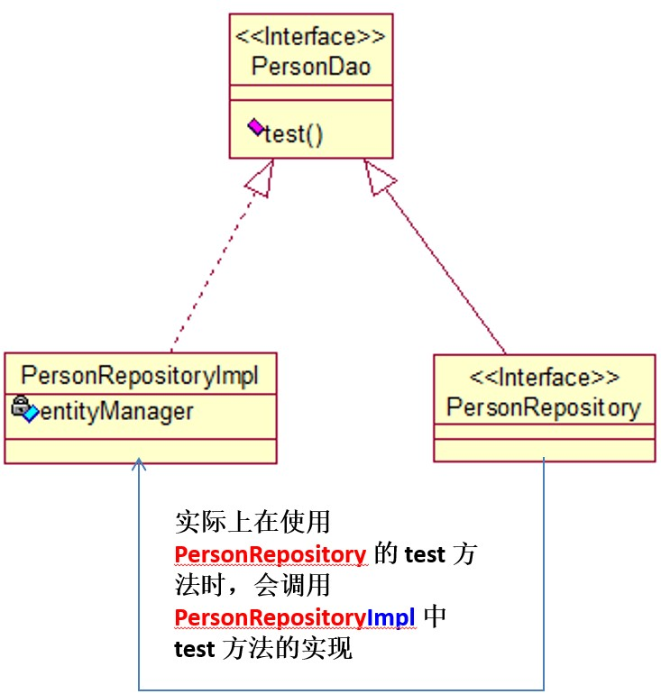

# Spring Data 学习笔记

### SpringData概述

> **简介**
>
> * Spring Data : Spring 的一个子项目。用于简化数据库访问，支持NoSQL 和 关系数据存储。其主要目标是使数据库的访问变得方便快捷。
> * SpringData 项目所支持 NoSQL 存储：
>   * MongoDB （文档数据库）
>   * Neo4j（图形数据库）
>   * Redis（键/值存储）
>   * Hbase（列族数据库）
> * SpringData 项目所支持的关系数据存储技术：
>   * JDBC
>   * JPA
> * JPA Spring Data : 致力于减少数据访问层 (DAO) 的开发量. 开发者唯一要做的，就只是声明持久层的接口，其他都交给 Spring Data JPA 来帮你完成！
> * 框架怎么可能代替开发者实现业务逻辑呢？比如：当有一个 UserDao.findUserById()  这样一个方法声明，大致应该能判断出这是根据给定条件的 ID 查询出满足条件的 User  对象。Spring Data JPA 做的便是规范方法的名字，根据符合规范的名字来确定方法需要实现什么样的逻辑。
>
> **入门示例**
>
> * 使用 Spring Data JPA 进行持久层开发需要的四个步骤：
>   * 配置 Spring 整合 JPA
>   * 在 Spring 配置文件中配置 Spring Data，让 Spring 为声明的接口创建代理对象。配置了` <jpa:repositories> `后，Spring 初始化容器时将会扫描 base-package  指定的包目录及其子目录，为继承 Repository 或其子接口的接口创建代理对象，并将代理对象注册为 Spring Bean，业务层便可以通过 Spring 自动封装的特性来直接使用该对象。
>   * 声明持久层的接口，该接口继承  Repository，Repository 是一个标记型接口，它不包含任何方法，如必要，Spring Data 可实现 Repository 其他子接口，其中定义了一些常用的增删改查，以及分页相关的方法。
>   * 在接口中声明需要的方法。Spring Data 将根据给定的策略（具体策略稍后讲解）来为其生成实现代码。
>
> applicationContext.xml
>
> ```xml
> <?xml version="1.0" encoding="UTF-8"?>
> <beans xmlns="http://www.springframework.org/schema/beans"
> 	xmlns:xsi="http://www.w3.org/2001/XMLSchema-instance"
> 	xmlns:context="http://www.springframework.org/schema/context"
> 	xmlns:tx="http://www.springframework.org/schema/tx"
> 	xmlns:jpa="http://www.springframework.org/schema/data/jpa"
> 	xsi:schemaLocation="http://www.springframework.org/schema/beans http://www.springframework.org/schema/beans/spring-beans.xsd
> 		http://www.springframework.org/schema/data/jpa http://www.springframework.org/schema/data/jpa/spring-jpa-1.3.xsd
> 		http://www.springframework.org/schema/tx http://www.springframework.org/schema/tx/spring-tx-4.0.xsd
> 		http://www.springframework.org/schema/context http://www.springframework.org/schema/context/spring-context-4.0.xsd">
> 
> 	<!-- 配置自动扫描的包 -->
> 	<context:component-scan base-package="com.atguigu.springdata"></context:component-scan>
> 
> 	<!-- 1. 配置数据源 -->
> 	<context:property-placeholder location="classpath:db.properties"/>
> 
> 	<bean id="dataSource"
> 		class="com.mchange.v2.c3p0.ComboPooledDataSource">
> 		<property name="user" value="${jdbc.user}"></property>
> 		<property name="password" value="${jdbc.password}"></property>	
> 		<property name="driverClass" value="${jdbc.driverClass}"></property>
> 		<property name="jdbcUrl" value="${jdbc.jdbcUrl}"></property>
> 		
> 		<!-- 配置其他属性 -->
> 	</bean>
> 
> 	<!-- 2. 配置 JPA 的 EntityManagerFactory -->
> 	<bean id="entityManagerFactory" 
> 		class="org.springframework.orm.jpa.LocalContainerEntityManagerFactoryBean">
> 		<property name="dataSource" ref="dataSource"></property>
> 		<property name="jpaVendorAdapter">
> 			<bean class="org.springframework.orm.jpa.vendor.HibernateJpaVendorAdapter"></bean>
> 		</property>
> 		<property name="packagesToScan" value="com.atguigu.springdata"></property>
> 		<property name="jpaProperties">
> 			<props>
> 				<!-- 二级缓存相关 -->
> 				<!--  
> 				<prop key="hibernate.cache.region.factory_class">org.hibernate.cache.ehcache.EhCacheRegionFactory</prop>
> 				<prop key="net.sf.ehcache.configurationResourceName">ehcache-hibernate.xml</prop>
> 				-->
> 				<!-- 生成的数据表的列的映射策略 -->
> 				<prop key="hibernate.ejb.naming_strategy">org.hibernate.cfg.ImprovedNamingStrategy</prop>
> 				<!-- hibernate 基本属性 -->
> 				<prop key="hibernate.dialect">org.hibernate.dialect.MySQL5InnoDBDialect</prop>
> 				<prop key="hibernate.show_sql">true</prop>
> 				<prop key="hibernate.format_sql">true</prop>
> 				<prop key="hibernate.hbm2ddl.auto">update</prop>
> 			</props>
> 		</property>
> 	</bean>
> 
> 	<!-- 3. 配置事务管理器 -->
> 	<bean id="transactionManager"
> 		class="org.springframework.orm.jpa.JpaTransactionManager">
> 		<property name="entityManagerFactory" ref="entityManagerFactory"></property>	
> 	</bean>
> 
> 	<!-- 4. 配置支持注解的事务 -->
> 	<tx:annotation-driven transaction-manager="transactionManager"/>
> 
> 	<!-- 5. 配置 SpringData -->
> 	<!-- 加入  jpa 的命名空间 -->
> 	<!-- base-package: 扫描 Repository Bean 所在的 package -->
> 	<jpa:repositories base-package="com.atguigu.springdata"
> 		entity-manager-factory-ref="entityManagerFactory"></jpa:repositories>
> </beans>
> ```
>
> ```java
> package com.atguigu.springdata;
> import javax.persistence.Entity;
> import javax.persistence.GeneratedValue;
> import javax.persistence.Id;
> import javax.persistence.Table;
> import java.util.Date;
> 
> @Table(name = "person")
> @Entity
> public class Person {
>     private Integer id;
>     private String lastName;
>     private String email;
>     private Date birth;
> 
>     @GeneratedValue
>     @Id
>     public Integer getId() {
>         return id;
>     }
> 
>     public void setId(Integer id) {
>         this.id = id;
>     }
> 
>     public String getLastName() {
>         return lastName;
>     }
> 
>     public void setLastName(String lastName) {
>         this.lastName = lastName;
>     }
> 
>     public String getEmail() {
>         return email;
>     }
> 
>     public void setEmail(String email) {
>         this.email = email;
>     }
> 
>     public Date getBirth() {
>         return birth;
>     }
> 
>     public void setBirth(Date birth) {
>         this.birth = birth;
>     }
> 
>     @Override
>     public String toString() {
>         return "Person{" +
>                 "id=" + id +
>                 ", lastName='" + lastName + '\'' +
>                 ", email='" + email + '\'' +
>                 ", birth=" + birth +
>                 '}';
>     }
> }
> ```
>
> ```java
> package com.atguigu.springdata;
> import org.springframework.data.repository.Repository;
> 
> public interface PersonRepository extends Repository<Person,Integer> {
>     /**
>      *  根据lastName来获取对应的Person
>      * @param lastName
>      * @return
>      */
>     Person getPersonByLastName(String lastName);
> }
> ```
>
> ```java
> package com.atguigu.springdata.test;
> import com.atguigu.springdata.Person;
> import com.atguigu.springdata.PersonRepository;
> import org.junit.Test;
> import org.springframework.context.ApplicationContext;
> import org.springframework.context.support.ClassPathXmlApplicationContext;
> 
> import javax.sql.DataSource;
> import java.sql.SQLException;
> 
> public class SpringDataTest {
> 
>     private ApplicationContext ctx = null;
>     {
>         ctx = new ClassPathXmlApplicationContext("applicationContext.xml");
>     }
> 
>     @Test
>     public void testJpa(){
>         PersonRepository personRepository = ctx.getBean(PersonRepository.class);
>         Person person = personRepository.getPersonByLastName("AA");
>         System.out.println(person);
>     }
> }
> ```
>

### Repository 接口

> **Repository 接口概述**
>
> * Repository 接口是 Spring Data 的一个核心接口，它不提供任何方法，开发者需要在自己定义的接口中声明需要的方法 
>   * `public interface Repository<T, ID extends Serializable> { } `
> * Spring Data可以让我们只定义接口，只要遵循 Spring Data的规范，就无需写实现类。  
> * 与继承 Repository 等价的一种方式，就是在持久层接口上使用 @RepositoryDefinition 注解，并为其指定 domainClass 和 idClass 属性。如下两种方式是完全等价的
>
> **Repository 的子接口**
>
> * 基础的 Repository 提供了最基本的数据访问功能，其几个子接口则扩展了一些功能。它们的继承关系如下： 
>   * Repository： 仅仅是一个标识，表明任何继承它的均为仓库接口类
>   * CrudRepository： 继承 Repository，实现了一组 CRUD 相关的方法 
>   * PagingAndSortingRepository： 继承 CrudRepository，实现了一组分页排序相关的方法 
>   * JpaRepository： 继承 PagingAndSortingRepository，实现一组 JPA 规范相关的方法 
>   * 自定义的 XxxxRepository 需要继承 JpaRepository，这样的 XxxxRepository 接口就具备了通用的数据访问控制层的能力。
>   * JpaSpecificationExecutor： 不属于Repository体系，实现一组 JPA Criteria 查询相关的方法 
>
> ```java
> package com.atguigu.springdata;
> import org.springframework.data.repository.Repository;
> import org.springframework.data.repository.RepositoryDefinition;
> 
> /**
>  *  1. Repository是一个空接口，即是一个标记接口
>  *  2. 若我们定义的接口继承了Repository，则该接口会被IOC容器识别为一个Repository Bean，纳入到IOC容器中，
>  *  进而可以在该接口中定义满足一定规范的方法
>  *  3. 实际上也可以通过注解 @RepositoryDefinition来替代继承Repository接口
>  */
> public interface PersonRepository extends Repository<Person,Integer> {
>     /**
>      *  根据lastName来获取对应的Person
>      * @param lastName
>      * @return
>      */
>     Person getPersonByLastName(String lastName);
> }
> 
> //@RepositoryDefinition(domainClass = Person.class,idClass = Integer.class)
> //public interface PersonRepository{
> //    Person getPersonByLastName(String lastName);
> //}
> ```

### 方法定义规范

> **简单条件查询**
>
> * 简单条件查询: 查询某一个实体类或者集合 
>
> * 按照 Spring Data 的规范，查询方法以 find | read | get 开头，涉及条件查询时，条件的属性用条件关键字连接，要注意的是：条件属性以首字母大写。 
>
> * 例如：定义一个 Entity 实体类 
>
>   * ```java
>     class User｛
>         private String firstName;
>     	private String lastName;
>     ｝ 
>     ```
>
>   * 使用And条件连接时，应这样写：`findByLastNameAndFirstName(String lastName,String firstName);` 条件的属性名称与个数要与参数的位置与个数一一对应 
>
> **支持的关键字**
>
> * 直接在接口中定义查询方法，如果是符合规范的，可以不用写实现，目前支持的关键字写法如下：
>
> | 关键字            | 例子                                 | JPQL语句                                        |
> | ----------------- | ------------------------------------ | ----------------------------------------------- |
> | And               | findByLastnameAndFirstname           | ...  where x.lastname = ?1 and x.firstname = ?2 |
> | Or                | findByLastnameOrFirstname            | ...  where x.lastname = ?1 or x.firstname = ?2  |
> | Between           | findByStartDateBetween               | ...  where x.startDate between ?1 and ?2        |
> | LessThan          | findByAgeLessThan                    | ...   where x.age < ?1                          |
> | GreaterThan       | findByAgeGreaterThan                 | ...  where x.age > ?1                           |
> | After             | findByStartDateAfter                 | ...  where x.startDate > ?1                     |
> | Before            | findByStartDateBefore                | ...  where x.startDate < ?1                     |
> | IsNull            | findByAgeIsNull                      | ...  where x.age is null                        |
> | IsNotNull,NotNull | findByAge(Is)NotNull                 | ...  where x.age not null                       |
> | Like              | findByFirstnameLike                  | ...  where x.firstname like ?1                  |
> | NotLike           | findByFirstnameNotLike               | ... where x.firstname not like ?1               |
> | StartingWith      | findByFirstnameStartingWith          | ...  where x.firstname like ?1 (关键字 +  %)    |
> | EndingWith        | findByFirstnameEndingWith            | ... where x.firstname like ?1 (% + 关键字)      |
> | Containing        | findByFirstnameContaining            | ... where x.firstname like ?1 (% + 关键字 + %)  |
> | OrderBy           | findByAgeOrderByLastnameDesc         | ...  where x.age = ?1 order by x.lastname desc  |
> | Not               | findByLastnameNot                    | ...  where x.lastname <> ?1                     |
> | In                | findByAgeIn(Collection<Age> ages)    | ... where x.age in ?1                           |
> | NotIn             | findByAgeNotIn(Collection<Age> ages) | ...  where x.age not in ?1                      |
> | TRUE              | findByActiveTrue()                   | ...  where x.active = true                      |
> | FALSE             | findByActiveFalse()                  | ... where x.active = false                      |
>
> **查询方法解析流程**
>
> * 假如创建如下的查询：findByUserDepUuid()，框架在解析该方法时，首先剔除 findBy，然后对剩下的属性进行解析，假设查询实体为Doc
>   * 先判断 userDepUuid （根据 POJO 规范，首字母变为小写）是否为查询实体的一个属性，如果是，则表示根据该属性进行查询；如果没有该属性，继续第二步；
>   * 从右往左截取第一个大写字母开头的字符串(此处为Uuid)，然后检查剩下的字符串是否为查询实体的一个属性，如果是，则表示根据该属性进行查询；如果没有该属性，则重复第二步，继续从右往左截取；最后假设 user 为查询实体的一个属性；
>   * 接着处理剩下部分（DepUuid），先判断 user 所对应的类型是否有depUuid属性，如果有，则表示该方法最终是根据 “ Doc.user.depUuid” 的取值进行查询；否则继续按照步骤 2 的规则从右往左截取，最终表示根据 “Doc.user.dep.uuid” 的值进行查询。
>   * 可能会存在一种特殊情况，比如 Doc包含一个 user 的属性，也有一个 userDep 属性，此时会存在混淆。可以明确在属性之间加上 "_" 以显式表达意图，比如 "findByUser_DepUuid()" 或者 "findByUserDep_uuid()"
> * 特殊的参数： 还可以直接在方法的参数上加入分页或排序的参数，比如：
>   * Page<UserModel> findByName(String name, Pageable pageable);
>   * List<UserModel> findByName(String name, Sort sort);
>
> ```java
> package com.atguigu.springdata;
> import javax.persistence.*;
> import java.util.Date;
> 
> @Table(name = "person")
> @Entity
> public class Person {
>     private Integer id;
>     private String lastName;
>     private String email;
>     private Date birth;
>     private Address address;
>     private Integer addressId;
> 
>     @GeneratedValue
>     @Id
>     public Integer getId() {
>         return id;
>     }
> 
>     public void setId(Integer id) {
>         this.id = id;
>     }
> 
>     public String getLastName() {
>         return lastName;
>     }
> 
>     public void setLastName(String lastName) {
>         this.lastName = lastName;
>     }
> 
>     public String getEmail() {
>         return email;
>     }
> 
>     public void setEmail(String email) {
>         this.email = email;
>     }
> 
>     public Date getBirth() {
>         return birth;
>     }
> 
>     public void setBirth(Date birth) {
>         this.birth = birth;
>     }
> 
>     @JoinColumn(name = "address_id")
>     @ManyToOne
>     public Address getAddress() {
>         return address;
>     }
> 
>     public void setAddress(Address address) {
>         this.address = address;
>     }
> 
>     @Column(name = "add_id")
>     public Integer getAddressId() {
>         return addressId;
>     }
> 
>     public void setAddressId(Integer addressId) {
>         this.addressId = addressId;
>     }
> 
>     @Override
>     public String toString() {
>         return "Person{" +
>                 "id=" + id +
>                 ", lastName='" + lastName + '\'' +
>                 ", email='" + email + '\'' +
>                 ", birth=" + birth +
>                 '}';
>     }
> }
> ```
>
> ```java
> package com.atguigu.springdata;
> 
> import javax.persistence.Entity;
> import javax.persistence.GeneratedValue;
> import javax.persistence.Id;
> import javax.persistence.Table;
> 
> @Table(name = "addresses")
> @Entity
> public class Address {
>     private Integer id;
>     private String province;
>     private String city;
> 
>     @GeneratedValue
>     @Id
>     public Integer getId() {
>         return id;
>     }
> 
>     public void setId(Integer id) {
>         this.id = id;
>     }
> 
>     public String getProvince() {
>         return province;
>     }
> 
>     public void setProvince(String province) {
>         this.province = province;
>     }
> 
>     public String getCity() {
>         return city;
>     }
> 
>     public void setCity(String city) {
>         this.city = city;
>     }
> }
> ```
>
> ```java
> package com.atguigu.springdata;
> import org.springframework.data.repository.Repository;
> import org.springframework.data.repository.RepositoryDefinition;
> 
> import java.util.Date;
> import java.util.List;
> 
> /**
>  *  1. Repository是一个空接口，即是一个标记接口
>  *  2. 若我们定义的接口继承了Repository，则该接口会被IOC容器识别为一个Repository Bean，纳入到IOC容器中，
>  *  进而可以在该接口中定义满足一定规范的方法
>  *  3. 实际上也可以通过注解 @RepositoryDefinition来替代继承Repository接口
>  *
>  *  在Repository中声明方法
>  *  1. 不是随便声明的，而需要符合一定的规范
>  *  2. 查询方法以 find | read | get 开头
>  *  3. 涉及条件查询时，条件的属性用条件关键字连接
>  *  4. 要注意的是：条件属性以首字母大写
>  *  5. 支持属性的级联查询，若当前类有符合条件的属性，则优先使用，而不使用级联属性
>  *      若需要使用级联属性，则属性之间使用_进行连接
>  *
>  */
> public interface PersonRepository extends Repository<Person,Integer> {
>     /**
>      *  根据lastName来获取对应的Person
>      * @param lastName
>      * @return
>      */
>     Person getPersonByLastName(String lastName);
> 
>     /**
>      *  where lastName like ?% and id < ?
>      * @param lastName
>      * @param id
>      * @return
>      */
>     List<Person> getPersonByLastNameStartsWithAndIdLessThan(String lastName,Integer id);
> 
>     /**
>      *  where lastName like %? and id < ?
>      * @param lastName
>      * @param id
>      * @return
>      */
>     List<Person> getPersonByLastNameEndingWithAndIdLessThan(String lastName,Integer id);
> 
>     /**
>      *  where email in (?,?,?) and birth < ?
>      * @param emails
>      * @param birth
>      * @return
>      */
>     List<Person> getByEmailInAndBirthLessThan(List<String> emails, Date birth);
> 
>     /**
>      *  where address.id > ?
>      * @param id
>      * @return
>      */
>     List<Person> getByAddressIdGreaterThan(Integer id);
> //    List<Person> getByAddress_IdGreaterThan(Integer id);
> }
> 
> //@RepositoryDefinition(domainClass = Person.class,idClass = Integer.class)
> //public interface PersonRepository{
> //    Person getPersonByLastName(String lastName);
> //}
> ```
>
> ```java
> package com.atguigu.springdata.test;
> import com.atguigu.springdata.Person;
> import com.atguigu.springdata.PersonRepository;
> import org.junit.Test;
> import org.springframework.context.ApplicationContext;
> import org.springframework.context.support.ClassPathXmlApplicationContext;
> import java.util.Arrays;
> import java.util.Date;
> import java.util.List;
> 
> public class SpringDataTest {
> 
>     private ApplicationContext ctx = null;
>     private PersonRepository personRepository = null;
> 
>     {
>         ctx = new ClassPathXmlApplicationContext("applicationContext.xml");
>         personRepository = ctx.getBean(PersonRepository.class);
>     }
> 
>     @Test
>     public void testJpa(){
>         Person person = personRepository.getPersonByLastName("AA");
>         System.out.println(person);
>     }
> 
>     @Test
>     public void testKeyWords(){
>         List<Person> people = personRepository.getPersonByLastNameStartsWithAndIdLessThan("X", 6);
>         System.out.println(people);
> 
>         people = personRepository.getPersonByLastNameEndingWithAndIdLessThan("X", 6);
>         System.out.println(people);
> 
>         people = personRepository.getByEmailInAndBirthLessThan(Arrays.asList("aa@gmail.com","bb@gmail.com","cc@gmail.com"), new Date());
>         System.out.println(people);
>     }
> 
>     @Test
>     public void testKeyWords2(){
>         List<Person> people = personRepository.getByAddressIdGreaterThan(1);
>         System.out.println(people);
>     }
> }
> ```

### Query注解

> **使用@Query自定义查询**
>
> * 这种查询可以声明在 Repository 方法中，摆脱像命名查询那样的约束，将查询直接在相应的接口方法中声明，结构更为清晰，这是 Spring data 的特有实现。
>
> **索引参数与命名参数**
>
> * 索引参数如下所示，索引值从1开始，查询中 ”?X” 个数需要与方法定义的参数个数相一致，并且顺序也要一致 
> * 命名参数（推荐使用这种方式）：可以定义好参数名，赋值时采用@Param("参数名")，而不用管顺序。
> * 如果是 @Query 中有 LIKE 关键字，后面的参数需要前面或者后面加 %，这样在传递参数值的时候就可以不加 %：
>
> **用@Query来指定本地查询**
>
> * 还可以使用@Query来指定本地查询，只要设置nativeQuery为true
>
> ```java
> /**
>      *  查询id值最大的那个Person
>      *  使用 @Query注解可以自定义JPQL语句以实现更灵活的查询
>      * @return
>      */
> @Query("SELECT p FROM Person p WHERE p.id = (SELECT max(p2.id) FROM Person p2)")
> Person getMaxIdPerson();
> 
> /**
>      * 传递参数的方式1，使用占位符，参数需要按顺序传递
>      */
> @Query("SELECT p FROM Person p WHERE p.lastName LIKE %?1% AND p.email = ?2")
> List<Person> testQueryAnnotationParams1(String lastName,String email);
> 
> /**
>      * 传递参数的方式2，使用命名参数方式，不需要按顺序，名字相同即可，可以在占位符上添加"%"
>      */
> @Query("SELECT p FROM Person p WHERE p.lastName LIKE %:lastName% AND p.email = :email")
> List<Person> testQueryAnnotationParams2(@Param("email") String email, @Param("lastName") String lastName);
> 
> /**
>      *  原生SQL查询
>      * @return
>      */
> @Query(value = "SELECT count(id) FROM person",nativeQuery = true)
> Long getTotalCount();
> ```
>
> ```java
> package com.atguigu.springdata.test;
> import com.atguigu.springdata.Person;
> import com.atguigu.springdata.PersonRepository;
> import org.junit.Test;
> import org.springframework.context.ApplicationContext;
> import org.springframework.context.support.ClassPathXmlApplicationContext;
> 
> import java.util.List;
> 
> public class SpringDataTest {
> 
>     private ApplicationContext ctx = null;
>     private PersonRepository personRepository = null;
> 
>     {
>         ctx = new ClassPathXmlApplicationContext("applicationContext.xml");
>         personRepository = ctx.getBean(PersonRepository.class);
>     }
> 
>     @Test
>     public void testJpa(){
> 
>     }
> 
>     @Test
>     public void testQueryAnnotation(){
>         Person person = personRepository.getMaxIdPerson();
>         System.out.println(person);
>     }
> 
>     @Test
>     public void testQueryAnnotationParams1(){
>         List<Person> people = personRepository.testQueryAnnotationParams1("A", "aa@gmail.com");
>         System.out.println(people);
> 
>         people = personRepository.testQueryAnnotationParams2("aa@gmail.com", "A");
>         System.out.println(people);
>     }
> 
>     @Test
>     public void testNativeQuery(){
>         Long count = personRepository.getTotalCount();
>         System.out.println(count);
>     }
> }
> ```
>

### @Modifying 注解和事务

> **@Query 与 @Modifying 执行更新操作**
>
> * @Query 与 @Modifying 这两个 annotation一起声明，可定义个性化更新操作，例如只涉及某些字段更新时最为常用
> * 注意：
>   * 方法的返回值应该是 int，表示更新语句所影响的行数
>   * 在调用的地方必须加事务，没有事务不能正常执行
>
> **事务**
>
> * Spring Data 提供了默认的事务处理方式，即所有的查询均声明为只读事务。
> * 对于自定义的方法，如需改变 Spring Data 提供的事务默认方式，可以在方法上注解 @Transactional 声明 
> * 进行多个 Repository 操作时，也应该使它们在同一个事务中处理，按照分层架构的思想，这部分属于业务逻辑层，因此，需要在 Service 层实现对多个 Repository 的调用，并在相应的方法上声明事务。 
>
> ```java
> /**
>      *  可以通过自定义的JPQL完成UPDATE和DELETE操作。注意JPQL不支持INSERT操作
>      *  在 @Query注解中编写JPQL语句，但必须使用 @Modifying进行修饰，以通知SpringData，这是一个UPDATE或DELETE操作
>      *  UPDATE或DELETE操作需要使用事务，此时需要定义Service，在Service层的方法上添加事务操作
>      *  默认情况下，SpringData的每个方法上有事务，但都是一个只读事务，他们不能完成修改操作
>      * @param id
>      * @param email
>      */
> @Modifying
> @Query("UPDATE Person p SET p.email = :email WHERE p.id = :id")
> void updatePersonEmail(@Param("id") Integer id,@Param("email") String email);
> ```
>
> ```java
> package com.atguigu.springdata;
> import org.springframework.beans.factory.annotation.Autowired;
> import org.springframework.stereotype.Service;
> import org.springframework.transaction.annotation.Transactional;
> 
> @Service
> public class PersonService {
>     @Autowired
>     private PersonRepository personRepository;
> 
>     @Transactional
>     public void updatePersonEmail(Integer id,String email){
>         personRepository.updatePersonEmail(id, email);
>     }
> }
> ```
>
> ```java
> package com.atguigu.springdata.test;
> import com.atguigu.springdata.PersonRepository;
> import com.atguigu.springdata.PersonService;
> import org.junit.Test;
> import org.springframework.context.ApplicationContext;
> import org.springframework.context.support.ClassPathXmlApplicationContext;
> 
> public class SpringDataTest {
>     private ApplicationContext ctx = null;
>     private PersonRepository personRepository = null;
>     private PersonService personService = null;
> 
>     {
>         ctx = new ClassPathXmlApplicationContext("applicationContext.xml");
>         personRepository = ctx.getBean(PersonRepository.class);
>         personService = ctx.getBean(PersonService.class);
>     }
> 
>     @Test
>     public void testJpa(){
> 
>     }
> 
>     @Test
>     public void testModifying(){
>         personService.updatePersonEmail(1, "mmmmm@gmail.com");
>     }
> }
> ```

### CrudRepository

> **常用方法**
>
> * CrudRepository 接口提供了最基本的对实体类的添删改查操作 
>   * T save(T entity);//保存单个实体 
>   * Iterable<T> save(Iterable<? extends T> entities);//保存集合
>   * T findOne(ID id);//根据id查找实体 
>   * boolean exists(ID id);//根据id判断实体是否存在 
>   * Iterable<T> findAll();//查询所有实体,不用或慎用!
>   * long count();//查询实体数量
>   * void delete(ID id);//根据Id删除实体
>   * void delete(T entity);//删除一个实体 
>   * void delete(Iterable<? extends T> entities);//删除一个实体的集合
>   * void deleteAll();//删除所有实体,不用或慎用! 
>
> ```java
> package com.atguigu.springdata;
> import org.springframework.data.jpa.repository.Modifying;
> import org.springframework.data.jpa.repository.Query;
> import org.springframework.data.repository.CrudRepository;
> 
> public interface PersonRepository extends CrudRepository<Person,Integer> {
>     @Modifying
>     @Query("UPDATE Person p SET p.email = :email WHERE p.id = :id")
>     void updatePersonEmail(@Param("id") Integer id,@Param("email") String email);
> }
> ```
>
> ```java
> package com.atguigu.springdata;
> import org.springframework.beans.factory.annotation.Autowired;
> import org.springframework.stereotype.Service;
> import org.springframework.transaction.annotation.Transactional;
> import java.util.List;
> 
> @Service
> public class PersonService {
>     @Autowired
>     private PersonRepository personRepository;
> 
>     @Transactional(rollbackFor = Exception.class)
>     public void updatePersonEmail(Integer id,String email){
>         personRepository.updatePersonEmail(id, email);
>     }
> 
>     @Transactional(rollbackFor = Exception.class)
>     public void savePeople(List<Person> people){
>         personRepository.save(people);
>     }
> }
> ```
>
> ```java
> package com.atguigu.springdata.test;
> import com.atguigu.springdata.Person;
> import com.atguigu.springdata.PersonRepository;
> import com.atguigu.springdata.PersonService;
> import org.junit.Test;
> import org.springframework.context.ApplicationContext;
> import org.springframework.context.support.ClassPathXmlApplicationContext;
> import java.util.ArrayList;
> import java.util.Date;
> import java.util.List;
> 
> public class SpringDataTest {
> 
>     private ApplicationContext ctx = null;
>     private PersonRepository personRepository = null;
>     private PersonService personService = null;
> 
>     {
>         ctx = new ClassPathXmlApplicationContext("applicationContext.xml");
>         personRepository = ctx.getBean(PersonRepository.class);
>         personService = ctx.getBean(PersonService.class);
>     }
> 
>     @Test
>     public void testJpa(){
> 
>     }
> 
>     @Test
>     public void testCrudRepository(){
>         List<Person> people = new ArrayList<>();
>         for (int i = 'a'; i <= 'z'; i++) {
>             Person person = new Person();
>             person.setAddressId(i + 1);
>             person.setBirth(new Date());
>             person.setEmail((char)i + "" + (char)i + "@example.com");
>             person.setLastName((char)i + "" + (char)i);
>             people.add(person);
>         }
>         personService.savePeople(people);
>     }
> }
> ```

### PagingAndSortingRepository

> * 该接口提供了分页与排序功能 
>   * Iterable<T> findAll(Sort sort); //排序 
>   * Page<T> findAll(Pageable pageable); //分页查询（含排序功能）
>
> ```java
> @Test
> public void testPagingAndSortingRepository(){
>     int pageNo = 3 - 1;
>     int pageSize = 5;
>     // Pageable接口，通常使用的是其实现类PageRequest，其中封装了分页需要的信息
>     Sort.Order order1 = new Sort.Order(Sort.Direction.DESC, "id");
>     Sort.Order order2 = new Sort.Order(Sort.Direction.ASC, "email");
>     Sort sort = new Sort(order1,order2);
>     Pageable pageable = new PageRequest(pageNo,pageSize,sort);
>     //        Pageable pageable = new PageRequest(pageNo,pageSize);
>     Page<Person> page = personRepository.findAll(pageable);
>     System.out.println("总记录数 ： " + page.getTotalElements());
>     System.out.println("当前第几页： " + (page.getNumber() + 1));
>     System.out.println("总页数： " + page.getTotalPages());
>     System.out.println("当前页面的List ： " + page.getContent());
>     System.out.println("当前页面的记录数：" + page.getNumberOfElements());
> }
> ```

### JpaRepository

> * 该接口提供了JPA的相关功能 
>   * List<T> findAll(); //查找所有实体 
>   * List<T> findAll(Sort sort); //排序、查找所有实体 
>   * List<T> save(Iterable<? extends T> entities);//保存集合 
>   * void flush();//执行缓存与数据库同步 
>   * T saveAndFlush(T entity);//强制执行持久化 
>   * void deleteInBatch(Iterable<T> entities);//删除一个实体集合 
>
> ```java
> public interface PersonRepository extends JpaRepository<Person,Integer> {}
> ```
>
> ```java
> @Test
> public void testJpaRepository(){
>     Person person = new Person();
>     person.setBirth(new Date());
>     person.setEmail("xyz@gmail.com");
>     person.setLastName("xyz");
>     person.setId(28);
>     // 相当于hibernate中的merge方法
>     Person person1 = personRepository.saveAndFlush(person);
>     System.out.println(person == person1);
> }
> ```

### JpaSpecificationExecutor

> * 不属于Repository体系，实现一组 JPA Criteria 查询相关的方法 
> * Specification：封装  JPA Criteria 查询条件。通常使用匿名内部类的方式来创建该接口的对象
>
> ```java
> public interface PersonRepository extends JpaRepository<Person,Integer> ,JpaSpecificationExecutor<Person> {}
> ```
>
> ```java
> /**
>      *  实现带查询条件的分页 id > 5的条件
>      *  Page<T> findAll(Specification<T> spec, Pageable pageable);
>      *  Specification：封装了JPA Criteria查询的查询条件
>      *  Pageable：封装了请求分页的信息：例如pageNo,pageSize,Sort
>      */
> @Test
> public void testJpaSpecificationExecutor(){
>     int pageNo = 3 - 1;
>     int pageSize = 5;
>     PageRequest pageable = new PageRequest(pageNo,pageSize);
>     // 通常使用Specification的匿名内部类
>     Specification<Person> specification = new Specification<Person>() {
>         /**
>              * @param root 代表查询的实体类
>              * @param criteriaQuery 可以从中得到Root对象，即告知JPA Criteria查询要查询哪一个实体类，还可以来添加查询条件
>              *                       还可以结合EntityManager对象得到最终查询的TypedQuery对象
>              * @param criteriaBuilder   criteriaBuilder对象，用于创建Criteria相关对象的工厂，可以从中获取到Predicate对象
>              * @return Predicate类型，代表一个查询条件
>              */
>         @Override
>         public Predicate toPredicate(Root<Person> root, CriteriaQuery<?> criteriaQuery, CriteriaBuilder criteriaBuilder) {
>             Path path = root.get("id");
>             Predicate predicate = criteriaBuilder.gt(path, 5);
>             return predicate;
>         }
>     };
>     Page<Person> page = personRepository.findAll(specification,pageable);
>     System.out.println("总记录数 ： " + page.getTotalElements());
>     System.out.println("当前第几页： " + (page.getNumber() + 1));
>     System.out.println("总页数： " + page.getTotalPages());
>     System.out.println("当前页面的List ： " + page.getContent());
>     System.out.println("当前页面的记录数：" + page.getNumberOfElements());
> }

### 自定义 Repository 方法

> **为某一个 Repository 上添加自定义方法**
>
> * 步骤：
>   * 定义一个接口: 声明要添加的, 并自实现的方法
>   * 提供该接口的实现类: 类名需在要声明的 Repository 后添加 Impl, 并实现方法
>   * 声明 Repository 接口, 并继承第一步声明的接口
>   * 使用.
>   * 注意: 默认情况下, Spring Data 会在 base-package 中查找 "接口名Impl" 作为实现类. 也可以通过　repository-impl-postfix　声明后缀. 
>
> ```java
> package com.atguigu.springdata;
> public interface PersonDao {
>     void test();
> }
> 
> ```
>
> ```java
> package com.atguigu.springdata;
> import javax.persistence.EntityManager;
> import javax.persistence.PersistenceContext;
> 
> public class PersonRepositoryImpl implements PersonDao{
> 
>     /**
>      *  @PersistenceContext与@Resource区别
>      *
>      *  @PersistenceContext
>      *  这个是JPA中的注解，PersistenceContext，称为持久化上下文，它一般包含有当前事务范围内的，被管理的实体对象(Entity)的数据。
>      *  每个EntityManager，都会跟一个PersistenceContext相关联。PersistenceContext中存储的是实体对象的数据，而关系数据库中存储的是记录。
>      *  注入的是实体管理器，执行持久化操作的，需要配置文件persistence.xml。
>      *  注入一堆保存实体类状态的数据结构，针对实体类的不同状态(四种,managedh或detached等)可以做出不同的反应(merge,persist等等)，
>      *  其实就是把数据从数据库里提出，然后在内存里处理的，再返回数据库的法则。
>      *  @Resource
>      *  是注入容器提供的资源对象，比如SessionContext MessageDrivenContext。或者你那个name指定的JNDI对象，
>      *  可以理解为资源->数据源->也就是数据连接，基本上就是告诉程序数据库在哪里
>      */
>     @PersistenceContext
>     private EntityManager entityManager;
> 
>     @Override
>     public void test() {
>         Person person = entityManager.find(Person.class, 11);
>         System.out.println("------" + person);
>     }
> }
> ```
>
> ```java
> package com.atguigu.springdata;
> import org.springframework.data.jpa.repository.JpaRepository;
> import org.springframework.data.jpa.repository.JpaSpecificationExecutor;
> 
> public interface PersonRepository extends JpaRepository<Person,Integer> ,JpaSpecificationExecutor<Person>,PersonDao{
> 
> }
> ```
>
> ```java
> package com.atguigu.springdata.test;
> import com.atguigu.springdata.PersonRepository;
> import org.junit.Test;
> import org.springframework.context.ApplicationContext;
> import org.springframework.context.support.ClassPathXmlApplicationContext;
> 
> public class SpringDataTest {
> 
>     private ApplicationContext ctx = null;
>     private PersonRepository personRepository = null;
> 
>     {
>         ctx = new ClassPathXmlApplicationContext("applicationContext.xml");
>         personRepository = ctx.getBean(PersonRepository.class);
>     }
> 
>     @Test
>     public void testCustomRepositoryMethod(){
>         personRepository.test();
>     }
> }
> ```
>
> 
>
> **为所有的 Repository 都添加自实现的方法**
>
> * 步骤：
>   * 声明一个接口, 在该接口中声明需要自定义的方法, 且该接口需要继承 Spring Data 的 Repository.
>   * 提供 1) 所声明的接口的实现类. 且继承 SimpleJpaRepository, 并提供方法的实现
>   * 定义 JpaRepositoryFactoryBean 的实现类, 使其生成 1) 定义的接口实现类的对象
>   * 修改 <jpa:repositories /> 节点的 factory-class 属性指向 3) 的全类名
>   * 注意: 全局的扩展实现类不要用 Imp 作为后缀名, 或为全局扩展接口添加 @NoRepositoryBean 注解告知  Spring Data: Spring Data 不把其作为 Repository

