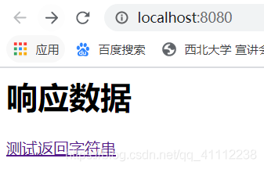
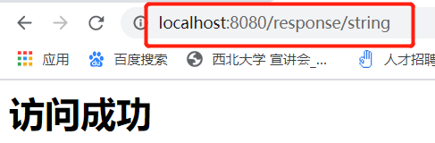
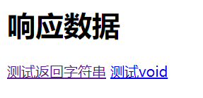
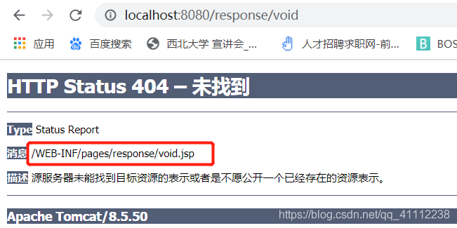

# SpringMVC 学习笔记

### SpringMVC基本介绍

##### 入门案例

> HelloWorld程序
>
> ```java
> HelloController.java
> package com.example.controller;
> import org.springframework.stereotype.Controller;
> import org.springframework.web.bind.annotation.RequestMapping;
> 
> @Controller
> public class HelloController {
>     @RequestMapping("/hello")
>     public String sayHello(){
>         System.out.println("HelloWorld!");
>         return "success";
>     }
> }
> ```
>
> ```xml
> springmvc.xml
> <?xml version="1.0" encoding="UTF-8"?>
> <beans xmlns="http://www.springframework.org/schema/beans"
>        xmlns:xsi="http://www.w3.org/2001/XMLSchema-instance"
>        xmlns:context="http://www.springframework.org/schema/context"
>        xsi:schemaLocation="http://www.springframework.org/schema/beans http://www.springframework.org/schema/beans/spring-beans.xsd
>                            http://www.springframework.org/schema/context  http://www.springframework.org/schema/context/spring-context.xsd">
>        <!--开启组件扫描 -->
>        <context:component-scan base-package="com.example.controller"></context:component-scan>
>        <!--注册视图解析器 -->
>        <bean id="viewResolver" class="org.springframework.web.servlet.view.InternalResourceViewResolver">
>             <!--配置前缀-->
>             <property name="prefix" value="/WEB-INF/pages/" />
>             <!--配置后缀-->
>             <property name="suffix" value=".jsp" />
>        </bean>
> </beans>
> ```
>
> ```xml
> web.xml
> <?xml version="1.0" encoding="UTF-8"?>
> <web-app xmlns="http://xmlns.jcp.org/xml/ns/javaee"
>          xmlns:xsi="http://www.w3.org/2001/XMLSchema-instance"
>          xsi:schemaLocation="http://xmlns.jcp.org/xml/ns/javaee http://xmlns.jcp.org/xml/ns/javaee/web-app_4_0.xsd" version="4.0">
>   <display-name>SpringMVC quickstart</display-name>
>   <welcome-file-list>
>     <welcome-file>index.jsp</welcome-file>
>   </welcome-file-list>
>   <!--核心控制器-->
>   <servlet>
>     <servlet-name>springmvc</servlet-name>
>     <servlet-class>org.springframework.web.servlet.DispatcherServlet</servlet-class>
>     <!--配置初始化参数，读取配置文件-->
>     <init-param>
>       <param-name>contextConfigLocation</param-name>
>       <param-value>classpath:springmvc.xml</param-value>
>     </init-param>
>     <!--启动项（在服务器启动的时候就初始化）-->
>     <load-on-startup>1</load-on-startup>
>   </servlet>
>   <servlet-mapping>
>     <servlet-name>springmvc</servlet-name>
>     <url-pattern>/</url-pattern>
>   </servlet-mapping>
> </web-app>
> ```
>
> **入门案例加载流程（服务启动）**
>
> 1. 初始化DispatcherServlet，读取springmvc.xml配置文件（初始化Spring容器）
> 2. 注册HelloController到容器中
> 3. 实例化视图解析器（InternalResourceViewResolver）
>
> **请求响应流程**
>
> 
>
> **涉及组件**
>
> * DispatcherServlet：前端控制器
>   用户请求到达前端控制器，它就相当于 mvc 模式中的 c，dispatcherServlet 是整个流程控制的中心，由它调用其它组件处理用户的请求，dispatcherServlet 的存在降低了组件之间的耦合性。
>
> * HandlerMapping：处理器映射器
>   HandlerMapping 负责根据用户请求找到 Handler 即处理器，SpringMVC 提供了不同的映射器实现不同的映射方式，例如：配置文件方式，实现接口方式，注解方式等
>
> * Handler：处理器
>   它就是我们开发中要编写的具体业务控制器。由 DispatcherServlet 把用户请求转发到 Handler。由Handler 对具体的用户请求进行处理。
>
> * HandlAdapter：处理器适配器
>   通过 HandlerAdapter 对处理器进行执行，这是适配器模式的应用，通过扩展适配器可以对更多类型的处理器进行执行
>
> * View Resolver：视图解析器
>   负责将处理结果生成 View 视图，View Resolver 首先根据逻辑视图名解析成物理视图名
>   即具体的页面地址，再生成 View 视图对象，最后对 View 进行渲染将处理结果通过页面展示给用户。
>
> * View：视图
>   SpringMVC 框架提供了很多的 View 视图类型的支持，包括：jstlView、freemarkerView、pdfView等。我们最常用的视图就是 jsp。
>   一般情况下需要通过页面标签或页面模版技术将模型数据通过页面展示给用户，需要由程序员根据业务需求开发具体的页面。
>
> * `<mvc:annotation-driven>`
>   在 SpringMVC 的各个组件中，处理器映射器、处理器适配器、视图解析器称为 SpringMVC 的三大组件。
>   使用该标签自动加载 RequestMappingHandlerMapping （处理映射器）和RequestMappingHandlerAdapter（ 处理器适配器）替代注解处理器和适配器的配置。
>   注意：
>   一般开发中，我们都需要写上此标签（入门案例中不写也行)
>   明确：
>   我们只需要编写处理具体业务的控制器以及视图
>
> **@RequestMapping注解**
> ==作用：==
> 建立请求url和处理方法之间的对应关系
>
> ==作用位置：==
> 类 请求url的第一级访问目录 不写相当于根目录，需要以`/`开头
> 方法 请求url的第二级访问目录，可以不以`/`开头
>
> ==属性：==
>
> 1. value/path：绑定路径，可配置多个，一般情况下只配一个
>
>    ```java
>    @RequestMapping(path = {"hello1","hello2","hello3"})
>    public String sayHello(){
>        System.out.println("HelloWorld!");
>        return "success";
>    }
>    ```
>
> 2. method：指定访问方式，可配置多个，默认是任何方式都支持
>
>    ```java
>    @RequestMapping(path = {"hello1","hello2","hello3"},method = {RequestMethod.POST})
>    public String sayHello(){
>        System.out.println("HelloWorld!");
>        return "success";
>    }
>    ```
>
> 3. params：指定必须携带的参数，可以配置多个，不带就报错
>
>    ```java
>    @RequestMapping(path = "hello",method = RequestMethod.GET,params = {"age=18"})
>    public String sayHello(){
>        System.out.println("HelloWorld!");
>        return "success";
>    }
>    ```
>
> 4. headers：指定必须携带的请求头，可以配置多个，不带就报错
>
>    ```java
>    @RequestMapping(path = "hello",method = RequestMethod.GET,headers = {"AAA"})
>    public String sayHello(){
>        System.out.println("HelloWorld!");
>        return "success";
>    }
>    ```

### 常用注解

##### 请求参数绑定

> **基本参数绑定**
>
> ```java
> /**
>  *  基本参数绑定
>  *  前提：方法的形参要和请求的参数一致
>  */
> @RequestMapping("/save")
> public String save(String name,Integer age){
>     System.out.println("save方法：");
>     System.out.println(name + "::" + age);
>     return "success";
> }
> ```
>
> **POJO类型作为参数**
>
> 1. 请求参数是简单类型（基本类型，String类型）
>    * 方法的形参和请求参数的name一致就可以
> 2. 请求参数类型是pojo对象类型
>    * 形参就写pojo对象
>    * pojo的属性名必须和请求参数的name一致
> 3. 请求参数类型是pojo对象类型，包含集合
>    * 形参就写pojo对象
>    * pojo的属性名必须和请求参数的name一致
>    * 如果包含List，list的属性名[下标].pojo属性名
>    * 如果包含Map，map的属性名[key].pojo属性名
>
> 代码示例：
>
> ```jsp
> <%@page language="java" contentType="text/html;charset=UTF-8" %>
> <html>
> <body>
> <h2>POJO类型参数绑定</h2>
> <form action="/account/update" method="post">
>     用户名：<input type="text" name="name" /> <br>
>     金额：<input type="text" name="money" /> <br>
>     省份：<input type="text" name="address.provinceName" /> <br>
>     城市：<input type="text" name="address.cityName" /> <br>
>     <input type="submit" value="保存">
> </form>
> 
> <h2>POJO类中包含List</h2>
> <form action="/account/delete" method="post">
>     用户名称：<input type="text" name="username" /> <br>
>     用户密码：<input type="text" name="password" /> <br>
>     用户年龄：<input type="text" name="age" /> <br>
>     账户1 名称：<input type="text" name="accounts[0].name" /> <br>
>     账户1 金额：<input type="text" name="accounts[0].money" /> <br>
>     账户2 名称：<input type="text" name="accounts[1].name" /> <br>
>     账户2 金额：<input type="text" name="accounts[1].money" /> <br>
> 
>     <input type="submit" value="保存">
> </form>
> 
> <h2>POJO类中包含Map</h2>
> <form action="/account/findAll" method="post">
>     用户名称：<input type="text" name="username" /> <br>
>     用户密码：<input type="text" name="password" /> <br>
>     用户年龄：<input type="text" name="age" /> <br>
>     账户1 名称：<input type="text" name="accountMap['one'].name" /> <br>
>     账户1 金额：<input type="text" name="accountMap['one'].money" /> <br>
>     账户2 名称：<input type="text" name="accountMap['two'].name" /> <br>
>     账户2 金额：<input type="text" name="accountMap['two'].money" /> <br>
> 
>     <input type="submit" value="保存">
> </form>
> </body>
> </html>
> ```
>
> ```java
> package com.example.pojo;
> import java.io.Serializable;
> public class Account implements Serializable {
>     private String name;
>     private Double money;
>     private Address address;
>     public String getName() {
>         return name;
>     }
> 
>     public void setName(String name) {
>         this.name = name;
>     }
> 
>     public Double getMoney() {
>         return money;
>     }
> 
>     public void setMoney(Double money) {
>         this.money = money;
>     }
> 
>     public Address getAddress() {
>         return address;
>     }
> 
>     public void setAddress(Address address) {
>         this.address = address;
>     }
> 
>     @Override
>     public String toString() {
>         return "Account{" +
>                 "name='" + name + '\'' +
>                 ", money=" + money +
>                 ", address=" + address +
>                 '}';
>     }
> }
> ```
>
> ```java
> package com.example.pojo;
> import java.io.Serializable;
> public class Address implements Serializable {
>     private String provinceName;
>     private String cityName;
> 
>     public String getProvinceName() {
>         return provinceName;
>     }
> 
>     public void setProvinceName(String provinceName) {
>         this.provinceName = provinceName;
>     }
> 
>     public String getCityName() {
>         return cityName;
>     }
> 
>     public void setCityName(String cityName) {
>         this.cityName = cityName;
>     }
> 
>     @Override
>     public String toString() {
>         return "Address{" +
>                 "provinceName='" + provinceName + '\'' +
>                 ", cityName='" + cityName + '\'' +
>                 '}';
>     }
> }
> ```
>
> ```java
> package com.example.pojo;
> import java.io.Serializable;
> import java.util.List;
> import java.util.Map;
> 
> public class User implements Serializable {
>     private String username;
>     private String password;
>     private Integer age;
>     private List<Account> accounts;
>     private Map<String,Account> accountMap;
> 
>     public String getUsername() {
>         return username;
>     }
> 
>     public void setUsername(String username) {
>         this.username = username;
>     }
> 
>     public String getPassword() {
>         return password;
>     }
> 
>     public void setPassword(String password) {
>         this.password = password;
>     }
> 
>     public Integer getAge() {
>         return age;
>     }
> 
>     public void setAge(Integer age) {
>         this.age = age;
>     }
> 
>     public List<Account> getAccounts() {
>         return accounts;
>     }
> 
>     public void setAccounts(List<Account> accounts) {
>         this.accounts = accounts;
>     }
> 
>     public Map<String, Account> getAccountMap() {
>         return accountMap;
>     }
> 
>     public void setAccountMap(Map<String, Account> accountMap) {
>         this.accountMap = accountMap;
>     }
> 
>     @Override
>     public String toString() {
>         return "User{" +
>                 "username='" + username + '\'' +
>                 ", password='" + password + '\'' +
>                 ", age=" + age +
>                 ", accounts=" + accounts +
>                 ", accountMap=" + accountMap +
>                 '}';
>     }
> }
> ```
>
> ```java
> package com.example.controller;
> import com.example.pojo.Account;
> import com.example.pojo.User;
> import org.springframework.stereotype.Controller;
> import org.springframework.web.bind.annotation.RequestMapping;
> @Controller
> @RequestMapping("/account")
> public class AccountController {
> 
>     /**
>      *  基本参数绑定
>      *  前提：方法的形参要和请求的参数一致
>      */
>     @RequestMapping("/save")
>     public String save(String name,Integer age){
>         System.out.println("save方法：");
>         System.out.println(name + "::" + age);
>         return "success";
>     }
> 
>     /**
>      *  pojo类型绑定
>      *  前提：pojo的属性名要和请求参数的名称一致
>      */
>     @RequestMapping("/update")
>     public String update(Account account){
>         System.out.println(account);
>         return "success";
>     }
> 
>     /**
>      *  pojo类型绑定-List集合
>      *  前提：pojo的属性名要和请求参数的名称一致
>      */
>     @RequestMapping("delete")
>     public String delete(User user){
>         System.out.println(user);
>         return "success";
>     }
> 
>     /**
>      *  pojo类型绑定-Map集合
>      *  前提：pojo的属性名要和请求参数的名称一致
>      */
>     @RequestMapping("findAll")
>     public String findAll(User user){
>         System.out.println(user);
>         return "success";
>     }
> }
> ```

##### 请求参数乱码处理

> web.xml中配置
>
> ```xml
> <!--配置springmvc提供的编码过滤器-->
> <filter>
>     <filter-name>encodingFilter</filter-name>
>     <filter-class>org.springframework.web.filter.CharacterEncodingFilter</filter-class>
>     <!--初始化参数-->
>     <init-param>
>         <param-name>encoding</param-name>
>         <param-value>UTF-8</param-value>
>     </init-param>
> </filter>
> <filter-mapping>
>     <filter-name>encodingFilter</filter-name>
>     <url-pattern>/*</url-pattern>
> </filter-mapping>
> ```

##### 配置自定义类型转换器

>
>springmvc.xml
>
>```xml
><?xml version="1.0" encoding="UTF-8"?>
><beans xmlns="http://www.springframework.org/schema/beans"
>xmlns:xsi="http://www.w3.org/2001/XMLSchema-instance"
>xmlns:context="http://www.springframework.org/schema/context"
>xmlns:mvc="http://www.springframework.org/schema/mvc"
>xsi:schemaLocation="http://www.springframework.org/schema/beans http://www.springframework.org/schema/beans/spring-beans.xsd
>        http://www.springframework.org/schema/context  http://www.springframework.org/schema/context/spring-context.xsd http://www.springframework.org/schema/mvc http://www.springframework.org/schema/mvc/spring-mvc.xsd">
><!--开启组件扫描 -->
><context:component-scan base-package="com.example.controller"></context:component-scan>
><!--注册视图解析器 -->
><bean id="viewResolver" class="org.springframework.web.servlet.view.InternalResourceViewResolver">
><!--配置前缀-->
><property name="prefix" value="/WEB-INF/pages/" />
><!--配置后缀-->
><property name="suffix" value=".jsp" />
></bean>
><!--配置类型转换器-->
><bean id="conversionServiceFactoryBean" class="org.springframework.context.support.ConversionServiceFactoryBean">
><property name="converters">
><bean class="com.example.convert.String2Date"></bean>
></property>
></bean>
><!--配置注解，1.自定义组件（类型转换器）2.忽略静态资源  3. 响应JSON...-->
><mvc:annotation-driven conversion-service="conversionServiceFactoryBean"></mvc:annotation-driven>
></beans>
>```
>
>String2Date.java
>
>```java
>package com.example.convert;
>import org.springframework.core.convert.converter.Converter;
>import java.text.ParseException;
>import java.text.SimpleDateFormat;
>import java.util.Date;
>
>/**
>*  时间类型转换器
>*  String：表示请求参数类型
>*  Date：表示请求参数要转换成的类型
>*/
>public class String2Date implements Converter<String,Date> {
>
> @Override
> public Date convert(String source) {
>     SimpleDateFormat simpleDateFormat = new SimpleDateFormat("yyyy-mm-dd");
>     try {
>         Date date = simpleDateFormat.parse(source);
>         System.out.println(date);
>         return date;
>     } catch (ParseException e) {
>         e.printStackTrace();
>         return null;
>     }
> }
>}
>```
>
>```java
>@RequestMapping("findById")
>public String findById(Date birthday){
> // 方式一：string类型来接收，自己转换 缺点：用到转换的方法每次都要写
> //        SimpleDateFormat simpleDateFormat = new SimpleDateFormat("yyyy-mm-dd");
> //        try {
> //            Date date = simpleDateFormat.parse(birthday);
> //            System.out.println(date);
> //        } catch (ParseException e) {
> //            e.printStackTrace();
> //        }
>
> // 方式二：Date类型来接收，配置自定义类型转换器 优点：值配置一次，全局生效
> System.out.println("自定义类型转换器转化类型" + birthday);
> return "success";
>}
>```
>
>**使用ServletAPI获取请求参数**
>
>```java
>@RequestMapping("count")
>public String count(HttpServletRequest request, HttpServletResponse response, HttpSession session){
> String name = request.getParameter("name");
> System.out.println(name);
> System.out.println(request);
> System.out.println(response);
> System.out.println(session);
> return "success";
>}
>```
>
>**@RequestParam**
>
>作用：
>将请求参数和控制器中方法形参绑定（请求参数名和形参名不再要求相同）
>属性：
>`name/value` 和请求参数名一致，可省略
>`required` 指定请求参数是否必填项，默认值是true
>`defaultValue` 未提供请求参数时的默认值
>
>```jsp
><%@page language="java" contentType="text/html;charset=UTF-8" %>
><html>
><body>
> <h1>常用注解</h1>
> <h3>@RequestParam</h3>
> <a href="/account/testRequestParam?name=张三&age=18">测试@RequestParam</a>
></body>
></html>
>```
>
>```java
>@RequestMapping("/testRequestParam")
>public String testRequestParam(@RequestParam(value = "name",required = false,defaultValue = "tom") String username, @RequestParam("age") Integer userage){
> System.out.println("name : " + username + " age: " + userage);
> return "success";
>}
>```
>
>**@RequestBody**
>
>作用：
>用于获取请求体的内容，直接使用得到的是key=value形式的字符串
>把获取的json数据转换成pojo对象
>（get方式不可用）
>
>```jsp
><h3>@RequestBody</h3>
><form action="/account/testRequestBody" method="post">
>  用户名：<input type="text" name="username"> <br>
>  密码：<input type="password" name="password"> <br>
>  <input type="submit" value="提交">
></form>
>```
>
>```java
>@RequestMapping("/testRequestBody")
>public String testRequestBody(@RequestBody String params){
>  System.out.println(params);
>  return "success";
>}
>// 获取的参数形式类似(params的值)：username=%E4%B9%94%E5%B3%B0&password=123
>```
>
>**@PathVariable**
>作用：
>绑定url中的占位符，例如请求url中/delete/{id}，{id}就是url占位符
>url支持占位符是spring3.0后加入的，是springmvc支持rest风格url的一个重要标志
>属性：
>name/value ：指定url中占位符名称
>required ：指定是否必须提供占位符
>
>```jsp
><h3>@PathVariable</h3>
><a href="/account/testPathVariable/1">@PathVariable</a>
>```
>
>```java
>@RequestMapping("/testPathVariable/{id}")
>public String testPathVariable(@PathVariable("id") String ids){
>  System.out.println(ids);
>  return "success";
>}
>// 注意：@RequestMapping注解花括号（{}）里面的值，跟@PathVariable注解圆括号里面的值必须一样
>```
>
>**@RequestHeader注解**
>
>作用：
>获取指定请求头的值
>属性：
>`value`：请求头的名称
>
>```java
>@RequestMapping("/testRequestHeader")
>public String testRequestHeader(@RequestHeader("User-Agent") String info){
>   System.out.println(info);
>   return "success";
>}
>```
>
>**@CookieValue注解**
>
>作用：
>用于把指定 cookie 名称的值传入控制器方法参数。
>属性：
>`value`：指定 cookie 的名称。
>`required`：是否必须有此 cookie。
>
>```java
>@RequestMapping("/cookie")
>public String testCookieValue(@CookieValue("JSESSIONID") String id){
>    System.out.println(id);
>    return "success";
>}
>```

### 响应数据

##### 返回值分类

> **三种响应格式**
>
> *字符串*
>
> 控制器中的方法返回字符串可以指定逻辑视图名，通过视图解析器解析为物理视图地址
> 逻辑视图：success
> 物理视图：/WEB-INF/pages/success.jsp
>
> ```java
> @Controller
> @RequestMapping("/response")
> public class ResponseController {
>     
>     @RequestMapping("/string")
>     public String testStr(){
>         return "success";
>     }
> }
> ```
>
> ```jsp
> <%@ page contentType="text/html;charset=UTF-8" language="java" %>
> <html>
> <body>
> 
> <h1>响应数据</h1>
> 
> <a href="/response/string">测试返回字符串</a>
> 
> </body>
> </html>
> ```
>
> 测试：
>
> 
>
> 
>
> *void*
>
> **默认访问视图解析器前缀+requestmapping路径+视图解析器后缀**
> index.jsp中添加链接
>
> ```jsp
> <a href="/response/void">测试void</a>
> ```
>
> 控制器中添加方法
>
> ```java
> @RequestMapping("/void")
> public void testVoid(){
> }
> ```
>
> 
>
> 
>
> *ModelandView*
>
> 可以通过request域存放对象，通过设置视图名实现跳转
> index.jsp中添加链接
>
> ```jsp
> <a href="/response/modelandview">测试modelAndView</a>
> ```
>
> 控制器中添加方法
>
> ```java
> @RequestMapping("/modelandview")
> public ModelAndView testModelandView() {
>     ModelAndView modelAndView = new ModelAndView();
>     modelAndView.setViewName("success");
>     modelAndView.addObject("msg","Hello World");
>     return modelAndView;
> }
> ```
>
> 修改success.jsp
>
> ```jsp
> <%@ page contentType="text/html;charset=UTF-8" language="java" isELIgnored="false" %>
> <html>
> <head>
>     <title>Title</title>
> </head>
> <body>
>     <h1>访问成功</h1><br>
>     获取request域存储的值:${msg}
> </body>
> </html>
> ```

##### 转发和重定向

> 前提：控制器方法返回值类型必须是String
>
> *转发*
>
> 转发到页面：
> 语法：forward:+绝对地址
>
> ```java
> @RequestMapping("/forward")
> public String forward(){
>     return "forward:/WEB-INF/pages/suceess.jsp";
> }
> ```
>
> index.jsp中添加链接
>
> ```jsp
> <a href="/response/forward">测试转发</a>
> ```
>
> 转发到控制器其他方法：
> 语法：forward:+类上requestmapping的地址+方法上requestmapping的地址
>
> ```java
> @RequestMapping("/forward")
> public String forward(){
>     return "forward:/response/string";
> }
> ```
>
> 结果和上面是一样的（等同于访问之前响应类型为字符串的例子效果）
>
> *重定向*
>
> 重定向到页面：
> 语法：redirect:+绝对地址
> 注意：不能重定向访问WEB-INF下的资源
>
> ```java
> @RequestMapping("/testRedirect")
> public String testRedirect(){
>     return "redirect:/redirect.jsp";
> }
> ```
>
> 重定向到控制器其他方法：
> 语法：redirect:+类上requestmapping的地址+方法上requestmapping的地址
>
> ```java
> @RequestMapping("/testRedirect")
> public String testRedirect(){
>     return "redirect:/response/string";
> }
> ```
>
> 重定向到外部链接
>
> ```java
> @RequestMapping("/testRedirect")
> public String testRedirect(){
>     return "redirect:http://www.baidu.com";
> }
> ```
>
> **转发和重定向的区别**
>
> - 转发是一次请求，重定向是两次
> - 转发地址栏不变，重定向改变
> - 转发只能到内部资源，重定向可以到内部或外部
> - 转发可以到WEB-INF下资源，重定向不可以

##### 响应JSON

>  **ResponseBody响应json数据**
>
>  *步骤*
>
>  1. 导入Jackson坐标
>  2.  把什么对象转换为json，方法返回值就定义什么类型
>  3. 在方法的上面，或者方法的返回值前添加@ResponseBody注解
>
>  Jackson坐标
>
>  ```xml
>  <dependency>
>      <groupId>com.fasterxml.jackson.core</groupId>
>      <artifactId>jackson-databind</artifactId>
>      <version>2.9.0</version>
>  </dependency>
>  
>  <dependency>
>      <groupId>com.fasterxml.jackson.core</groupId>
>      <artifactId>jackson-core</artifactId>
>      <version>2.9.0</version>
>  </dependency>
>  
>  <dependency>
>      <groupId>com.fasterxml.jackson.core</groupId>
>      <artifactId>jackson-annotations</artifactId>
>      <version>2.9.0</version>
>  </dependency>
>  ```
>
>  ```java
>  @RequestMapping("/test")
>  @ResponseBody
>  public User test(@RequestBody User user){
>      System.out.println(user);
>      return user;
>  }
>  ```
>
>  在springmvc中进行忽略静态资源的配置(否则js文件引入失败）
>
>  ```xml
>  <!--
>    忽略静态资源
>    mapping:匹配请求地址
>    location：对应资源所在的目录（webapp）
>  -->
>  <!-- 或者使用以下配置，使用默认servelt处理器 -->
>  <mvc:default-servlet-handler/>
>  ```
>
>  

