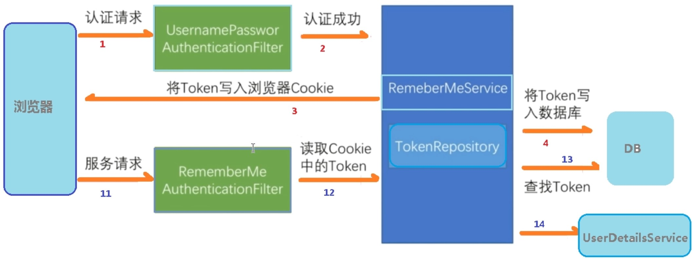
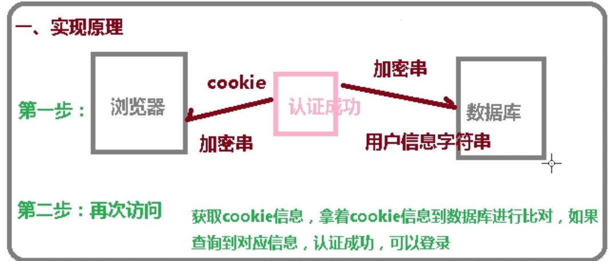

# SpringSecurity学习笔记

### 用户认证

> **通过配置文件设置用户名和密码**
>
> ```properties
> server.port=8111
> spring.security.user.name=admin
> spring.security.user.password=admin
> ```
>
> **通过配置类设置用户名和密码**
>
> ```java
> package com.atguigu.securitydemo1.config;
> import org.springframework.context.annotation.Bean;
> import org.springframework.context.annotation.Configuration;
> import org.springframework.security.config.annotation.authentication.builders.AuthenticationManagerBuilder;
> import org.springframework.security.config.annotation.web.configuration.WebSecurityConfigurerAdapter;
> import org.springframework.security.crypto.bcrypt.BCryptPasswordEncoder;
> import org.springframework.security.crypto.password.PasswordEncoder;
> 
> @Configuration
> public class SecurityConfig extends WebSecurityConfigurerAdapter {
> 
>     @Override
>     protected void configure(AuthenticationManagerBuilder auth) throws Exception {
> 
>         BCryptPasswordEncoder passwordEncoder = new BCryptPasswordEncoder();
>         String password = passwordEncoder.encode("12345");
>         auth.inMemoryAuthentication().withUser("admin").password(password).roles("admin");
>     }
> 
>     @Bean
>     public PasswordEncoder password(){
>         return new BCryptPasswordEncoder();
>     }
> }
> ```
>
> **自定义实现类设置用户名和密码**
>
> ```java
> package com.atguigu.securitydemo1.config;
> import org.springframework.beans.factory.annotation.Autowired;
> import org.springframework.context.annotation.Bean;
> import org.springframework.context.annotation.Configuration;
> import org.springframework.security.config.annotation.authentication.builders.AuthenticationManagerBuilder;
> import org.springframework.security.config.annotation.web.configuration.WebSecurityConfigurerAdapter;
> import org.springframework.security.core.userdetails.UserDetailsService;
> import org.springframework.security.crypto.bcrypt.BCryptPasswordEncoder;
> import org.springframework.security.crypto.password.PasswordEncoder;
> 
> @Configuration
> public class SecurityConfigTest extends WebSecurityConfigurerAdapter {
> 
>     @Autowired
>     private UserDetailsService userDetailsService;
> 
>     @Override
>     protected void configure(AuthenticationManagerBuilder auth) throws Exception {
>         auth.userDetailsService(userDetailsService).passwordEncoder(password());
>     }
> 
>     @Bean
>     PasswordEncoder password(){
>         return new BCryptPasswordEncoder();
>     }
> }
> ```
>
> ```java
> package com.atguigu.securitydemo1.service;
> import org.springframework.security.core.GrantedAuthority;
> import org.springframework.security.core.authority.AuthorityUtils;
> import org.springframework.security.core.userdetails.User;
> import org.springframework.security.core.userdetails.UserDetails;
> import org.springframework.security.core.userdetails.UserDetailsService;
> import org.springframework.security.core.userdetails.UsernameNotFoundException;
> import org.springframework.security.crypto.bcrypt.BCryptPasswordEncoder;
> import org.springframework.stereotype.Service;
> import java.util.List;
> 
> @Service("userDetailsService")
> public class MyUserDetailsService implements UserDetailsService {
>     @Override
>     public UserDetails loadUserByUsername(String s) throws UsernameNotFoundException {
>         List<GrantedAuthority> auths = AuthorityUtils.commaSeparatedStringToAuthorityList("role");
>         return new User("mary", new BCryptPasswordEncoder().encode("123"), auths);
>     }
> }
> ```
>
> **自定义设置登录页面**
>
> ```java
> package com.atguigu.securitydemo1.config;
> import org.springframework.beans.factory.annotation.Autowired;
> import org.springframework.context.annotation.Bean;
> import org.springframework.context.annotation.Configuration;
> import org.springframework.security.config.annotation.authentication.builders.AuthenticationManagerBuilder;
> import org.springframework.security.config.annotation.web.builders.HttpSecurity;
> import org.springframework.security.config.annotation.web.configuration.WebSecurityConfigurerAdapter;
> import org.springframework.security.core.userdetails.UserDetailsService;
> import org.springframework.security.crypto.bcrypt.BCryptPasswordEncoder;
> import org.springframework.security.crypto.password.PasswordEncoder;
> 
> @Configuration
> public class SecurityConfigTest extends WebSecurityConfigurerAdapter {
> 
>     @Autowired
>     private UserDetailsService userDetailsService;
> 
>     @Override
>     protected void configure(AuthenticationManagerBuilder auth) throws Exception {
>         auth.userDetailsService(userDetailsService).passwordEncoder(password());
>     }
> 
>     @Override
>     protected void configure(HttpSecurity http) throws Exception {
>         http.formLogin()    // 自定义自己编写的登录页面
>             .loginPage("/login.html")  // 登录页面设置
>             .loginProcessingUrl("/user/login")   // 登录访问路径
>             .defaultSuccessUrl("/test/index").permitAll()   // 登录成功之后，跳转的路径
>             .and().authorizeRequests()
>             .antMatchers("/","/test/hello","/user/login").permitAll()   // 设置哪些路径可以直接访问，不需要认证
>             .anyRequest().authenticated()
>             .and().csrf().disable();    // 关闭csrf防护
>     }
> 
>     @Bean
>     PasswordEncoder password(){
>         return new BCryptPasswordEncoder();
>     }
> }
> ```
>
> ```java
> package com.atguigu.securitydemo1.controller;
> import org.springframework.web.bind.annotation.GetMapping;
> import org.springframework.web.bind.annotation.RequestMapping;
> import org.springframework.web.bind.annotation.RestController;
> 
> @RestController
> @RequestMapping("/test")
> public class TestController {
>     @GetMapping("hello")
>     public String hello(){
>         return "hello security";
>     }
> 
>     @GetMapping("index")
>     public String index(){
>         return "hello index";
>     }
> }
> ```

### 基于权限访问控制

> 第一个方法：==hasAuthority==方法
>
> 如果当前的主体具有指定的权限，则返回true，否则返回false
>
> 1. 在配置类中设置当前访问地址有哪些权限
>
> ```java
> // 当前登录用户，只有具有admins权限才可以访问这个路径
> .antMatchers("/test/index").hasAuthority("admins")
> ```
>
> 2. 在UserDetailsService，把返回的User对象设置权限
>
> ```java
> List<GrantedAuthority> auths = AuthorityUtils.commaSeparatedStringToAuthorityList("admins");
> ```
>
> 第二个方法：==hasAnyAuthority==方法
>
> 如果当前的主体有任何提供的角色（给定一个用逗号分隔的字符串列表）的话，返回true
>
> ```java
> .antMatchers("/test/index").hasAnyAuthority("admins,manager")
> ```
>
> 第三个方法：==hasRole== 方法
>
> 如果当前主体具有指定的角色，则返回true
>
> ```java
> .antMatchers("/test/index").hasRole("sale")
> ```
>
> ```java
> List<GrantedAuthority> auths = AuthorityUtils.commaSeparatedStringToAuthorityList("ROLE_sale");
> ```
>
> 第四个方法：==hasAnyRole==方法
>
> 表示用户具有任何一个角色都可以访问
>
> ```java
> .antMatchers("/test/index").hasAnyRole("sale,admin")
> ```
>
> ```java
> List<GrantedAuthority> auths = AuthorityUtils.commaSeparatedStringToAuthorityList("ROLE_sale,ROLE_admin");
> ```

### 自定义403页面

> ```java
> package com.atguigu.securitydemo1.config;
> import org.springframework.beans.factory.annotation.Autowired;
> import org.springframework.context.annotation.Bean;
> import org.springframework.context.annotation.Configuration;
> import org.springframework.security.config.annotation.authentication.builders.AuthenticationManagerBuilder;
> import org.springframework.security.config.annotation.web.builders.HttpSecurity;
> import org.springframework.security.config.annotation.web.configuration.WebSecurityConfigurerAdapter;
> import org.springframework.security.core.userdetails.UserDetailsService;
> import org.springframework.security.crypto.bcrypt.BCryptPasswordEncoder;
> import org.springframework.security.crypto.password.PasswordEncoder;
> 
> @Configuration
> public class SecurityConfigTest extends WebSecurityConfigurerAdapter {
> 
>     @Autowired
>     private UserDetailsService userDetailsService;
> 
>     @Override
>     protected void configure(AuthenticationManagerBuilder auth) throws Exception {
>         auth.userDetailsService(userDetailsService).passwordEncoder(password());
>     }
> 
>     @Override
>     protected void configure(HttpSecurity http) throws Exception {
> 
>         // 配置没有权限访问跳转自定义页面
>         http.exceptionHandling().accessDeniedPage("/unauth.html");
>         http.formLogin()    // 自定义自己编写的登录页面
>             .loginPage("/login.html")  // 登录页面设置
>             .loginProcessingUrl("/user/login")   // 登录访问路径
>             .defaultSuccessUrl("/test/index").permitAll()   // 登录成功之后，跳转的路径
>             .and().authorizeRequests()
>             .antMatchers("/","/test/hello","/user/login").permitAll()   // 设置哪些路径可以直接访问，不需要认证
>             .antMatchers("/test/index").hasAnyRole("sale")
>             .anyRequest().authenticated()
>             .and().csrf().disable();    // 关闭csrf防护
>     }
> 
>     @Bean
>     PasswordEncoder password(){
>         return new BCryptPasswordEncoder();
>     }
> }
> ```

### 注解使用

##### @Secured

> 判断是否具有角色，另外需要注意的是这里匹配的字符串需要添加前缀"ROLE_"，使用注解要先开启注解功能
>
> 开启注解
>
> ```java
> package com.atguigu.securitydemo1;
> import org.mybatis.spring.annotation.MapperScan;
> import org.springframework.boot.SpringApplication;
> import org.springframework.boot.autoconfigure.SpringBootApplication;
> import org.springframework.security.config.annotation.method.configuration.EnableGlobalMethodSecurity;
> 
> @MapperScan(basePackages = {"com.atguigu.securitydemo1.mapper"})
> @EnableGlobalMethodSecurity(securedEnabled = true)
> @SpringBootApplication
> public class Securitydemo1Application {
> 
>     public static void main(String[] args) {
>         SpringApplication.run(Securitydemo1Application.class, args);
>     }
> }
> ```
>
> 在controller的方法上面使用注解，设置角色
>
> ```java
> package com.atguigu.securitydemo1.controller;
> import org.springframework.security.access.annotation.Secured;
> import org.springframework.web.bind.annotation.GetMapping;
> import org.springframework.web.bind.annotation.RequestMapping;
> import org.springframework.web.bind.annotation.RestController;
> 
> @RestController
> @RequestMapping("/test")
> public class TestController {
> 
>     @GetMapping("update")
>     @Secured({"ROLE_admin","ROLE_manager"})
>     public String update(){
>         return "hello update";
>     }
> }
> ```

##### @PreAuthorize

> 在进入方法之前，进行权限验证，如果有权限才能访问方法
>
> 开启注解
>
> ```java
> package com.atguigu.securitydemo1;
> import org.mybatis.spring.annotation.MapperScan;
> import org.springframework.boot.SpringApplication;
> import org.springframework.boot.autoconfigure.SpringBootApplication;
> import org.springframework.security.config.annotation.method.configuration.EnableGlobalMethodSecurity;
> 
> @MapperScan(basePackages = {"com.atguigu.securitydemo1.mapper"})
> @EnableGlobalMethodSecurity(securedEnabled = true,prePostEnabled = true)
> @SpringBootApplication
> public class Securitydemo1Application {
> 
>     public static void main(String[] args) {
>         SpringApplication.run(Securitydemo1Application.class, args);
>     }
> }
> ```
>
> 在controller的方法上面使用注解
>
> ```java
> @GetMapping("update")
> @PreAuthorize("hasAnyAuthority('admins')")
> public String update(){
>     return "hello update";
> }
> ```
>
> ```java
> public UserDetails loadUserByUsername(String username) throws UsernameNotFoundException {
>     // 根据用户名查询数据库
>     QueryWrapper<Users> wrapper = new QueryWrapper<>();
>     wrapper.eq("username", username);
>     Users users = usersMapper.selectOne(wrapper);
>     if(users == null){  // 数据库没有用户名，认证失败
>         throw new UsernameNotFoundException("用户名不存在！");
>     }
>     List<GrantedAuthority> auths = AuthorityUtils.commaSeparatedStringToAuthorityList("admins");
>     return new User(users.getUsername(), new BCryptPasswordEncoder().encode(users.getPassword()), auths);
> }
> ```

##### @PostAuthorize

> 在方法执行之后，进行权限验证，适合验证方法带有返回值的权限，方法体会执行，但是不会有返回值，还是提示没有访问权限
>
> 开启注解
>
> ```java
> @EnableGlobalMethodSecurity(securedEnabled = true,prePostEnabled = true)
> @SpringBootApplication
> public class Securitydemo1Application {
>     public static void main(String[] args) {
>         SpringApplication.run(Securitydemo1Application.class, args);
>     }
> }
> ```
>
> 在controller的方法上面使用注解
>
> ```java
> @GetMapping("update")
> @PostAuthorize("hasAnyAuthority('admins')")
> public String update(){
>     System.out.println("update ...... ");
>     return "hello update";
> }
> ```

##### @PostFilter

> 权限验证之后对数据进行过滤留下用户名是admin1的数据，表达式中的filterObject引用的是方法返回值List中的某一个元素
>
> 注意：@PostFilter注解只有在控制器方法的return返回值是一个集合的时候才可以使用；
>
> @PostFilter注解的作用：如果控制器方法的return返回值是一个集合，此注解可以对return的这个集合进行过滤输出；
>
> 使用@PostFilte注解可以对集合类型的返回值进行过滤。使用@PostFilter时，Spring Security将移除使对应表达式即的结果为false的元素。
>
> 这个例子将会只返回username=admin1的数据
>
> ```java
> @RequestMapping("getAll")
> @PostFilter("filterObject.username == 'admin1'")
> public List<Users> getAllUser(){
>     ArrayList<Users> list = new ArrayList<>();
>     list.add(new Users(1,"admin1","pwd123"));
>     list.add(new Users(2,"admin2","pwd456"));
>     return list;
> }
> ```

##### PreFilter

> 注意：只有在控制器方法的参数是集合类型的时候才能使用@PreFilter注解
>
> @PreFilter注解的作用：可以过滤控制器方法的参数；
>
> 这个例子将会值接收参数中id为偶数的数据
>
> ```java
> @RequestMapping("testPreFilter")
> @PreFilter("filterObject.id % 2 == 0")
> public List<Users> getTestPreFilter(@RequestBody List<Users> list){
>     System.out.println(list);
>     list.forEach(t -> {
>         System.out.println("id : " + t.getId() + " username : " + t.getUsername());
>     });
>     return list;
> }
> ```

##### 用户注销

> 在配置类中添加退出映射地址
>
> ```java
> package com.atguigu.securitydemo1.config;
> import org.springframework.beans.factory.annotation.Autowired;
> import org.springframework.context.annotation.Bean;
> import org.springframework.context.annotation.Configuration;
> import org.springframework.security.config.annotation.authentication.builders.AuthenticationManagerBuilder;
> import org.springframework.security.config.annotation.web.builders.HttpSecurity;
> import org.springframework.security.config.annotation.web.configuration.WebSecurityConfigurerAdapter;
> import org.springframework.security.core.userdetails.UserDetailsService;
> import org.springframework.security.crypto.bcrypt.BCryptPasswordEncoder;
> import org.springframework.security.crypto.password.PasswordEncoder;
> 
> @Configuration
> public class SecurityConfigTest extends WebSecurityConfigurerAdapter {
> 
>     @Autowired
>     private UserDetailsService userDetailsService;
> 
>     @Override
>     protected void configure(AuthenticationManagerBuilder auth) throws Exception {
>         auth.userDetailsService(userDetailsService).passwordEncoder(password());
>     }
> 
>     @Override
>     protected void configure(HttpSecurity http) throws Exception {
>         // 退出配置
>         http.logout().logoutUrl("/logout").logoutSuccessUrl("/test/hello").permitAll();
> 
>         // 配置没有权限访问跳转自定义页面
>         http.exceptionHandling().accessDeniedPage("/unauth.html");
>         http.formLogin()    // 自定义自己编写的登录页面
>             .loginPage("/login.html")  // 登录页面设置
>             .loginProcessingUrl("/user/login")   // 登录访问路径
>             .defaultSuccessUrl("/success.html").permitAll()   // 登录成功之后，跳转的路径
>             .and().authorizeRequests()
>             .antMatchers("/","/test/hello","/user/login").permitAll()   // 设置哪些路径可以直接访问，不需要认证
>             .antMatchers("/test/index").hasAnyRole("sale")
>             .anyRequest().authenticated()
>             .and().csrf().disable();    // 关闭csrf防护
>     }
> 
>     @Bean
>     PasswordEncoder password(){
>         return new BCryptPasswordEncoder();
>     }
> }
> ```

##### 自动登录

> 自动登录流程
>
> 
>
> 
>
> 实现流程
>
> 1. 创建表
>
> ```sql
> CREATE TABLE `persistent_logins` (
> `username` varchar(64) NOT NULL,
> `series` varchar(64) NOT NULL,
> `token` varchar(64) NOT NULL,
> `last_used` timestamp NOT NULL DEFAULT CURRENT_TIMESTAMP ON UPDATE
> CURRENT_TIMESTAMP,
> PRIMARY KEY (`series`)
> ) ENGINE=InnoDB DEFAULT CHARSET=utf8;
> ```
>
> 2. 添加数据源
>
> ```properties
> spring:
> datasource:
> driver-class-name: com.mysql.jdbc.Driver
> url: jdbc:mysql://192.168.200.128:3306/test
> username: root
> password: root
> ```
>
> 3. 配置类中配置自动登录
>
> ```java
> package com.atguigu.securitydemo1.config;
> import org.springframework.beans.factory.annotation.Autowired;
> import org.springframework.context.annotation.Bean;
> import org.springframework.context.annotation.Configuration;
> import org.springframework.security.config.annotation.authentication.builders.AuthenticationManagerBuilder;
> import org.springframework.security.config.annotation.web.builders.HttpSecurity;
> import org.springframework.security.config.annotation.web.configuration.WebSecurityConfigurerAdapter;
> import org.springframework.security.core.userdetails.UserDetailsService;
> import org.springframework.security.crypto.bcrypt.BCryptPasswordEncoder;
> import org.springframework.security.crypto.password.PasswordEncoder;
> import org.springframework.security.web.authentication.rememberme.JdbcTokenRepositoryImpl;
> import org.springframework.security.web.authentication.rememberme.PersistentTokenRepository;
> import javax.sql.DataSource;
> 
> @Configuration
> public class SecurityConfigTest extends WebSecurityConfigurerAdapter {
> 
>     @Autowired
>     private UserDetailsService userDetailsService;
> 
>     // 注入数据源
>     @Autowired
>     private DataSource dataSource;
> 
>     @Bean
>     public PersistentTokenRepository persistentTokenRepository(){
>         JdbcTokenRepositoryImpl jdbcTokenRepository = new JdbcTokenRepositoryImpl();
>         jdbcTokenRepository.setDataSource(dataSource);
> //        jdbcTokenRepository.setCreateTableOnStartup(true);  // 设置启动时自动创建表
>         return jdbcTokenRepository;
>     }
> 
>     @Override
>     protected void configure(AuthenticationManagerBuilder auth) throws Exception {
>         auth.userDetailsService(userDetailsService).passwordEncoder(password());
>     }
> 
>     @Override
>     protected void configure(HttpSecurity http) throws Exception {
>         // 退出配置
>         http.logout().logoutUrl("/logout").logoutSuccessUrl("/test/hello").permitAll();
> 
>         // 配置没有权限访问跳转自定义页面
>         http.exceptionHandling().accessDeniedPage("/unauth.html");
>         http.formLogin()    // 自定义自己编写的登录页面
>             .loginPage("/login.html")  // 登录页面设置
>             .loginProcessingUrl("/user/login")   // 登录访问路径
>             .defaultSuccessUrl("/success.html").permitAll()   // 登录成功之后，跳转的路径
>             .and().authorizeRequests()
>             .antMatchers("/","/test/hello","/user/login").permitAll()   // 设置哪些路径可以直接访问，不需要认证
>             .antMatchers("/test/index").hasAnyRole("sale")
>             .anyRequest().authenticated()
>             .and().rememberMe().tokenRepository(persistentTokenRepository())    // 自动登录
>             .tokenValiditySeconds(60)   // 设置token有效期，单位是秒
>             .userDetailsService(userDetailsService)  //设置使用的UserDetailsService
>             .and().csrf().disable();    // 关闭csrf防护
>     }
> 
>     @Bean
>     PasswordEncoder password(){
>         return new BCryptPasswordEncoder();
>     }
> }
> ```

### CSRF防护

> **概念**
>
> 跨站请求伪造（英语：Cross-site request forgery），也被称为 one-click attack 或者 session riding，通常缩写为 CSRF 或者 XSRF， 是一种挟制用户在当前已登录的 Web 应用程序上执行非本意的操作的攻击方法。跟跨网站脚本（XSS）相比，XSS利用的是用户对指定网站的信任，CSRF 利用的是网站对用户网页浏览器的信任。跨站请求攻击，简单地说，是攻击者通过一些技术手段欺骗用户的浏览器去访问一个自己曾经认证过的网站并运行一些操作（如发邮件，发消息，甚至财产操作如转账和购买商品）。由于浏览器曾经认证过，所以被访问的网站会认为是真正的用户操作而去运行。这利用了 web 中用户身份验证的一个漏洞： 简单的身份验证只能保证请求发自某个用户的浏览器，却不能保证请求本身是用户自愿发出的。从 Spring Security 4.0 开始，默认情况下会启用 CSRF 保护，以防止 CSRF 攻击应用程序，Spring Security CSRF 会针对 PATCH，POST，PUT 和 DELETE 方法进行防护。
>
>  示例：
>
> 添加依赖
>
> ```xml
> <dependencies>
>     <!--对Thymeleaf添加Spring Security支持-->
>     <!-- https://mvnrepository.com/artifact/org.thymeleaf.extras/thymeleaf-extras-springsecurity5 -->
>     <dependency>
>         <groupId>org.thymeleaf.extras</groupId>
>         <artifactId>thymeleaf-extras-springsecurity5</artifactId>
>     </dependency>
>     <dependency>
>         <groupId>org.springframework.boot</groupId>
>         <artifactId>spring-boot-starter-thymeleaf</artifactId>
>     </dependency>
>     <dependency>
>         <groupId>com.baomidou</groupId>
>         <artifactId>mybatis-plus-boot-starter</artifactId>
>         <version>3.4.2</version>
>     </dependency>
>     <dependency>
>         <groupId>mysql</groupId>
>         <artifactId>mysql-connector-java</artifactId>
>     </dependency>
>     <dependency>
>         <groupId>org.projectlombok</groupId>
>         <artifactId>lombok</artifactId>
>     </dependency>
>     <dependency>
>         <groupId>org.springframework.boot</groupId>
>         <artifactId>spring-boot-starter-web</artifactId>
>     </dependency>
>     <dependency>
>         <groupId>org.springframework.boot</groupId>
>         <artifactId>spring-boot-starter-security</artifactId>
>     </dependency>
>     <dependency>
>         <groupId>org.springframework.boot</groupId>
>         <artifactId>spring-boot-starter-test</artifactId>
>         <scope>test</scope>
>     </dependency>
> </dependencies>
> ```
>
> 配置文件
>
> ```java
> package com.atguigu.securitydemo1.config;
> import org.springframework.context.annotation.Configuration;
> import org.springframework.security.config.annotation.authentication.builders.AuthenticationManagerBuilder;
> import org.springframework.security.config.annotation.web.builders.HttpSecurity;
> import org.springframework.security.config.annotation.web.configuration.WebSecurityConfigurerAdapter;
> import org.springframework.security.core.userdetails.UserDetailsService;
> import org.springframework.security.crypto.bcrypt.BCryptPasswordEncoder;
> import javax.annotation.Resource;
> 
> @Configuration
> public class SecurityConfig extends WebSecurityConfigurerAdapter {
>     @Resource
>     UserDetailsService userDetailsService;
> 
>     //实现用户身份认证
>     @Override
>     protected void configure(AuthenticationManagerBuilder auth) throws Exception {
>         BCryptPasswordEncoder encoder = new BCryptPasswordEncoder();
>         auth.userDetailsService(userDetailsService).passwordEncoder(encoder);
>     }
> 
>     @Override
>     protected void configure(HttpSecurity http) throws Exception {
>         //配置url的访问权限
>         http.authorizeRequests()
>                 .antMatchers("/").permitAll()
>                 .antMatchers("/**update**").permitAll()
>                 .antMatchers("/login/**").permitAll()
>                 .anyRequest().authenticated();
> 
>         //关闭csrf保护功能
>         //http.csrf().disable();
> //
>         //使用自定义的登录窗口
>         http.formLogin()
>                 .loginPage("/userLogin").permitAll()
>                 .usernameParameter("username").passwordParameter("password")
>                 .defaultSuccessUrl("/")
>                 .failureUrl("/userLogin?error");
> //        http.csrf().disable();
>     }
> }
> ```
>
> ```html
> <!DOCTYPE html>
> <html xmlns="http://www.w3.org/1999/xhtml" xmlns:th="http://www.thymeleaf.org">
> <head>
>     <meta charset="UTF-8">
>     <title>用户修改</title>
> </head>
> <body>
> <div align="center">
>     <form  method="post" action="update_token">
>       <input type="hidden" th:name="${_csrf.parameterName}" th:value="${_csrf.token}"/>
>         用户名: <input type="text" name="username" /><br />
>         密&nbsp;&nbsp;码: <input type="password" name="password" /><br />
>         <button type="submit">修改</button>
>     </form>
> </div>
> </body>
> </html>
> ```
>
> ```java
> package com.atguigu.securitydemo1.service;
> import com.atguigu.securitydemo1.mapper.UsersMapper;
> import org.springframework.beans.factory.annotation.Autowired;
> import org.springframework.security.core.authority.SimpleGrantedAuthority;
> import org.springframework.security.core.userdetails.User;
> import org.springframework.security.core.userdetails.UserDetails;
> import org.springframework.security.core.userdetails.UserDetailsService;
> import org.springframework.security.core.userdetails.UsernameNotFoundException;
> import org.springframework.security.crypto.bcrypt.BCryptPasswordEncoder;
> import org.springframework.stereotype.Service;
> import java.util.ArrayList;
> import java.util.List;
> 
> @Service("userDetailsService")
> public class MyUserDetailsService implements UserDetailsService {
> 
>     @Autowired
>     private UsersMapper usersMapper;
> 
>     @Override
>     public UserDetails loadUserByUsername(String username) throws UsernameNotFoundException {
> 
>         List<SimpleGrantedAuthority> list = new ArrayList<>();
>         list.add(new SimpleGrantedAuthority("role"));
>         UserDetails userDetails = new User("lucy", new BCryptPasswordEncoder().encode("123")
>                 , list);
>         return userDetails;
>     }
> }
> ```
>

### 自定义权限验证

> 开启注解
>
> ```java
> package com.atguigu.securitydemo1;
> import org.mybatis.spring.annotation.MapperScan;
> import org.springframework.boot.SpringApplication;
> import org.springframework.boot.autoconfigure.SpringBootApplication;
> import org.springframework.security.config.annotation.method.configuration.EnableGlobalMethodSecurity;
> 
> @MapperScan(basePackages = {"com.atguigu.securitydemo1.mapper"})
> @EnableGlobalMethodSecurity(prePostEnabled = true)
> @SpringBootApplication
> public class Securitydemo1Application {
> 
>     public static void main(String[] args) {
>         SpringApplication.run(Securitydemo1Application.class, args);
>     }
> }
> ```
>
> 编写自定义鉴权类
>
> ```java
> package com.atguigu.securitydemo1.service;
> import org.springframework.stereotype.Service;
> 
> @Service("ss")
> public class MyAuthService {
> 
>     public boolean hasPermission(String permisson){
>         if("admin".equals(permisson)){
>             return true;
>         }
>         else if("dev".equals(permisson)){
>             return true;
>         }else{
>             return false;
>         }
>     }
> }
> ```
>
> 在需要鉴权的接口上添加注解
>
> ```java
> package com.atguigu.securitydemo1.controller;
> import com.atguigu.securitydemo1.entity.Users;
> import org.springframework.security.access.prepost.PreAuthorize;
> import org.springframework.web.bind.annotation.GetMapping;
> import org.springframework.web.bind.annotation.RequestMapping;
> import org.springframework.web.bind.annotation.RestController;
> import java.util.ArrayList;
> import java.util.List;
> 
> @RestController
> @RequestMapping("/test")
> public class TestController {
>     
>     @RequestMapping("/403")
>     public String test403(){
>         return "你没有权限访问此页面";
>     }
> 
>     @GetMapping("admin")
>     @PreAuthorize("@ss.hasPermission('admin')")
>     public String testAdmin(){
>         System.out.println("test admin....");
>         return "test admin ...";
>     }
> 
>     @GetMapping("dev")
>     @PreAuthorize("@ss.hasPermission('dev')")
>     public String testDev(){
>         System.out.println("test dev....");
>         return "test dev ....";
>     }
>     
>     @GetMapping("other")
>     @PreAuthorize("@ss.hasPermission('other')")
>     public String testOther(){
>         System.out.println("test other....");
>         return "test other...";
>     }
> }
> ```
>
> 添加授权失败的配置
>
> ```java
> package com.atguigu.securitydemo1.config;
> import org.springframework.context.annotation.Configuration;
> import org.springframework.security.config.annotation.authentication.builders.AuthenticationManagerBuilder;
> import org.springframework.security.config.annotation.web.builders.HttpSecurity;
> import org.springframework.security.config.annotation.web.configuration.WebSecurityConfigurerAdapter;
> import org.springframework.security.core.userdetails.UserDetailsService;
> import org.springframework.security.crypto.bcrypt.BCryptPasswordEncoder;
> 
> import javax.annotation.Resource;
> 
> @Configuration
> public class SecurityConfig extends WebSecurityConfigurerAdapter {
>     @Resource
>     UserDetailsService userDetailsService;
> 
>     //实现用户身份认证
>     @Override
>     protected void configure(AuthenticationManagerBuilder auth) throws Exception {
>         BCryptPasswordEncoder encoder = new BCryptPasswordEncoder();
>         auth.userDetailsService(userDetailsService).passwordEncoder(encoder);
>     }
> 
>     @Override
>     protected void configure(HttpSecurity http) throws Exception {
>         //配置url的访问权限
>         http.authorizeRequests()
>                 .antMatchers("/").permitAll()
>                 .antMatchers("/**update**").permitAll()
>                 .antMatchers("/login/**").permitAll()
>                 .anyRequest().authenticated();
> 
>         //关闭csrf保护功能
> //        http.csrf().disable();
> //
>         //使用自定义的登录窗口
>         http.formLogin()
>                 .loginPage("/userLogin").permitAll()
>                 .usernameParameter("username").passwordParameter("password")
>                 .defaultSuccessUrl("/")
>                 .failureUrl("/userLogin?error")
>                 .and().exceptionHandling().accessDeniedPage("/test/403");
> //        http.csrf().disable();
>     }
> }
> ```
>
> 

