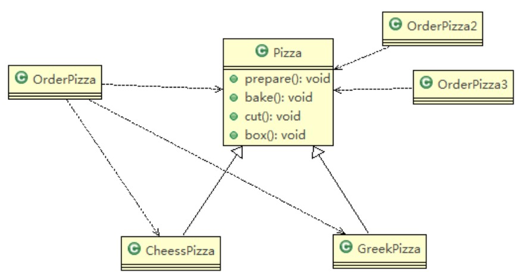
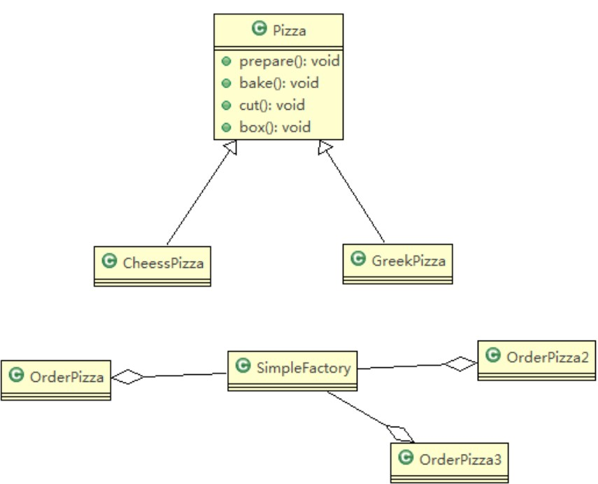
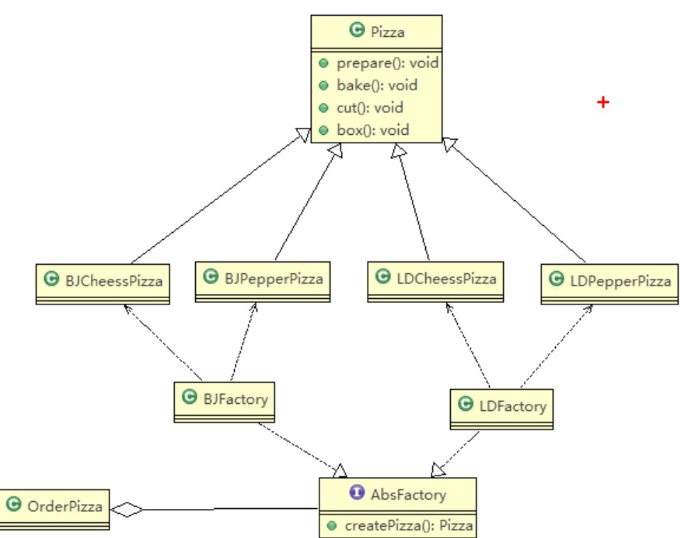

# 设计模式学习笔记

### 设计模式概述

> 软件工程中，设计模式（design pattern）是对软件设计中==普遍存在==（反复出现）的各种问题，所提出的==解决方案==。
>
> 设计模式的目的：
>
> 1. 代码的重用性
> 2. 可读性
> 3. 可扩展性
> 4. 可靠性
> 5. 使程序呈现高内聚，低耦合的特性
>
> 设计模式七大原则：
>
> 1. 单一职责原则 (Single Responsibility Principe)
> 2. 接口隔离原则 (Interface Segregation Priciple)
> 3. 依赖倒置原则 (Dependence Inversion Principle)
> 4. 里氏替换原则 (Liskov Substitution Principle)
> 5. 开闭原则 (Open-Closed Principle)
> 6. 迪米特法则 (Law Of Demeter)
> 7. 合成复用原则 (Composite Reuse Principle)

### 设计模式原则

##### 单一职责原则

> **基本介绍**
>
> 对类来说，即一个类应该只负责一项职责，如类A负责两个不同的职责：职责1，职责2。当职责1需求变更而改变A时，可能造成职责2执行错误，所以需要将类A的粒度分解为A1,A2
>
> 代码示例
>
> *修改前*
>
> ```java
> package com.designpattern.principle;
> 
> public class SingleResponsibility1 {
>     public static void main(String[] args) {
>         Vehicle vehicle = new Vehicle();
>         vehicle.run("摩托车");
>         vehicle.run("汽车");
>         vehicle.run("飞机");
>     }
> }
> 
> // 交通工具类
> class Vehicle{
>     public void run(String vehicle){
>         System.out.println(vehicle + "在公路上跑......");
>     }
> }
> // 这里的设计违反了单一职责原则，这个交通工具类既管理公路上跑的，又管天上飞的
> ```
>
> *修改后*
>
> ```java
> package com.designpattern.principle;
> 
> public class SingleResponsibility1 {
>     public static void main(String[] args) {
>         RoadVehicle roadVehicle = new RoadVehicle();
>         AirVehicle airVehicle = new AirVehicle();
>         roadVehicle.run("摩托车");
>         roadVehicle.run("汽车");
>         airVehicle.run("飞机");
>     }
> }
> 
> // 交通工具类
> class RoadVehicle{
>     public void run(String vehicle){
>         System.out.println(vehicle + "在公路上跑......");
>     }
> }
> 
> class AirVehicle{
>     public void run(String vehicle){
>         System.out.println(vehicle + "在天上飞......");
>     }
> }
> // 这里实现了类的单一职责原则，缺点是改动较大
> ```
>
> *方案2修改*
>
> ```java
> package com.designpattern.principle;
> 
> public class SingleResponsibility1 {
>     public static void main(String[] args) {
>         Vehicle vehicle = new Vehicle();
>         vehicle.run("摩托车");
>         vehicle.run("汽车");
>         vehicle.runAir("飞机");
>     }
> }
> 
> // 交通工具类
> class Vehicle{
>     public void run(String vehicle){
>         System.out.println(vehicle + "在公路上跑......");
>     }
> 
>     public void runAir(String vehicle){
>         System.out.println(vehicle + "在天上飞......");
>     }
> }
> // 这里虽然没有在类这个级别上遵守单一职责原则，但是在方法级别上，仍然是遵守单一职责原则的
> ```
>
> **单一职责原则注意事项和细节**
>
> 1. 降低类的复杂度，一个类只负责一项职责
> 2. 提高类的可读性，可维护性
> 3. 降低变更引起的风险
> 4. 通常情况下，我们应当遵守单一职责原则，只有逻辑足够简单，才可以在代码级违反单一职责原则；只有类中方法数量足够少，可以在方法级别保持单一职责原则

##### 接口隔离原则

> **基本介绍**
>
> 客户端不应该依赖它不需要的接口，即一个类对另一个类的依赖应该建立在最小的接口上
>
> 
>
> 如上图所示，类A只需要用到operation1(),operation2(),operation3()三个方法，而B实现了接口,A通过接口来依赖B，类C只需要用到接口中的operation4(),operation5()两个方法，而D也实现了接口，同样C也需要通过接口来依赖D，这个时候最好的做法，是将接口进行拆分，将这个接口拆分成几个独立的接口，类A和类C分别与它们需要的接口建立依赖关系。
>
> 示意图如下：
>
> 

##### 依赖倒置原则

> **基本介绍**
>
> 依赖倒置原则是指
>
> 1. 高层模块不应该依赖低层模块，二者都应该依赖其抽象
> 2. 抽象不应该依赖其细节，细节应该依赖抽象
> 3. 依赖倒置的中心思想是面向接口编程
> 4. 依赖倒置原则是基于这样的设计理念：相对于细节的多变性，抽象的东西要稳定的多。以抽象为基础搭建的架构比以细节为基础的架构要稳定的多。在java中，抽象指的是接口或抽象类，细节就是具体的实现类
> 5. 使用接口或抽象类的目的是制定好规范，而不涉及任何具体的操作，把展现细节的任务交给它们的实现类去完成
>
> 代码示例
>
> *修改前*
>
> ```java
> package com.designpattern.principle;
> 
> public class DependencyInversion {
> 
>     public static void main(String[] args) {
>         Person person = new Person();
>         person.receive(new Email());
>     }
> }
> 
> class Email{
>     public String getInfo(){
>         return "电子邮件信息：Hello,World!";
>     }
> }
> 
> class Person{
>     public void receive(Email email){
>         System.out.println(email.getInfo());
>     }
> }
> // 缺点：如果我们获取的对象是微信，短信等，则需要新增类，同时Person也要增加相应的接收方法
> // 解决思路：引入一个抽象的接口IReceiver，表示接收者，这样Person类与接口IReceiver发生依赖
> // 因为Email，微信等等属于接收的范围，他们各自实现IReceiver接口，这样就实现了依赖倒置原则
> ```
>
> *修改后*
>
> ```java
> package com.designpattern.principle;
> 
> public class DependencyInversion {
> 
>     public static void main(String[] args) {
>         Person person = new Person();
>         person.receive(new Email());
>     }
> }
> 
> // 定义接口
> interface IReceiver{
>     public String getInfo();
> }
> 
> class Email implements IReceiver{
>     public String getInfo(){
>         return "电子邮件信息：Hello,World!";
>     }
> }
> 
> class SMS implements IReceiver{
>     public String getInfo(){
>         return "短信信息：Hello,World!";
>     }
> }
> 
> class Person{
>     public void receive(IReceiver receiver){
>         System.out.println(receiver.getInfo());
>     }
> }
> ```

##### 里氏替换原则

> **基本介绍**
>
> 1. 如果对每个类型为T1的对象o1，都有类型为T2的对象o2，使得以T1定义的所有程序P在所有的对象o1都替换成o2时，程序P的行为没有发生变化，那么类型T2是类型T1的子类型，换句话说，所有引用基类的地方必须能透明地使用其子类的对象
> 2. 在使用继承时，遵循里氏替换原则，在子类中尽量不要重写父类的方法
> 3. 里氏替换原则告诉我们，继承实际上让两个类耦合性增强了，在适当的情况下，可以通过聚合，组合，依赖来解决问题
> 4. 如果一定要重写父类的方法，可以让原来的父类和子类都继承一个更通俗的基类，原有的继承关系去掉，采用依赖，组合，聚合等关系替代

##### 开闭原则

> **基本介绍**
>
> 1. 开闭原则是编程中最基础、最重要的设计原则
> 2. 一个软件实体，如类，模块和函数应该对扩展开放，对修改关闭。用抽象构建框架，用实现扩展细节
> 3. 当软件需要变化时，尽量通过扩展软件实体的行为来实现变化，而不是通过修改已有的代码来实现变化
> 4. 编程中遵循其他原则，以及使用设计模式的目的就是遵循开闭原则

##### 迪米特法则

> **基本介绍**
>
> 1. 一个对象应该对其他对象保持最少的了解
> 2. 类与类关系越密切，耦合度越大
> 3. 迪米特法则又叫最少知道原则，即一个类对自己依赖的类知道的越少越好。也就是说，对于被依赖的类不管多么复杂，都尽量将逻辑封装在类的内部。对外除了提供的public方法，不对外泄露任何信息
> 4. 迪米特法则还有个更简单的定义：只与直接的朋友通信
> 5. ==直接的朋友==：每个对象都会与其他对象有耦合关系，只要两个对象之间有耦合关系，我们就说这两个对象之间是朋友关系。耦合的方式有很多，依赖，关联，组合，聚合等。其中，我们称出现成员变量，方法参数，方法返回值中的类为直接的朋友，而出现在局部变量中的类不是直接的朋友。也就是说，陌生的类最好不要以局部变量的形式出现在类的内部

##### 合成复用原则

> **基本介绍**
>
> 原则是尽量使用合成、聚合的方式，而不是使用继承

### 设计模式

##### 设计模式的分类

> 设计模式分为三种类型，共23种
>
> 1. *创建型模式：*<u>单例模式</u>、抽象工厂模式、原型模式、建造者模式、工厂模式
> 2. *结构型模式：*适配器模式、桥接模式、<u>装饰模式</u>、组合模式、外观模式、享元模式、<u>代理模式</u>
> 3. *行为型模式：*模板方法模式、命令模式、访问者模式、迭代器模式、<u>观察者模式</u>、中介者模式、备忘录模式、解释器模式、状态模式、策略模式、职责链模式（责任链模式）

##### 单例模式

> **基本介绍**
>
> 所谓类的单例设计模式，就是采取一定的方法保证在整个的软件系统中，对某个类==只能存在一个对象实例==，并且该类只提供一个取得其对象实例的方法
>
> 单例模式有8种方式：
>
> 1. 饿汉式（静态常量）
> 2. 饿汉式（静态代码块）
> 3. 懒汉式（线程不安全）
> 4. 懒汉式（线程安全，同步方法）
> 5. 懒汉式（线程安全，同步代码块）
> 6. 双重检查
> 7. 静态内部类
> 8. 枚举
>
> **方式一：饿汉式（静态常量）**
>
> ```java
> // 饿汉式（静态变量）
> class Singleton{
> 
>     // 本类内部创建对象实例
>     private final static Singleton instance = new Singleton();
> 
>     // 构造器私有化
>     private Singleton(){}
> 
>     // 提供公有的静态方法，返回实例对象
>     public static Singleton getInstance(){
>         return instance;
>     }
> }
> ```
>
> 优缺点说明：
>
> 1. 优点：这种写法比较简单，就是在类装载时就完成实例化。避免了线程同步问题。
> 2. 缺点：在类装载的时候就完成实例化，没有达到Lazy Loading的效果。如果从始至终从未使用过这个示例，则会造成内存的浪费
> 3. 这种方式基于classloader机制避免了多线程的同步问题，不过，instance在类装载时就实例化，在单例模式中大多数都是调用getInstance方法，但是导致类装载的原因有很多种，因此不能确定有其他的方式（或者其他的静态方法）导致类装载，这时候初始化instance就没有达到Lazy Loading的效果。
> 4. 结论：这种单例模式可用，可能造成内存浪费
>
> **方式二：饿汉式（静态代码块）**
>
> ```java
> class Singleton{
> 
>     // 本类内部创建对象实例
>     private static Singleton instance;
> 
>     // 构造器私有化
>     private Singleton(){}
> 
>     static { // 在静态代码块中创建单例对象
>         instance = new Singleton();
>     }
> 
>     // 提供公有的静态方法，返回实例对象
>     public static Singleton getInstance(){
>         return instance;
>     }
> }
> ```
>
> 优缺点说明：
>
> 1. 这种方式和上面的方式类似，只不过将类的实例化的过程放在了静态代码块中，也是在类装载的时候，就执行静态代码块中的代码，初始化类的实例。优缺点和上面是一样的。
> 2. 结论：这种单例模式可用，但是可能造成内存浪费
>
> **方式三：懒汉式（线程不安全）**
>
> ```java
> class Singleton{
> 
>     // 本类内部创建对象实例
>     private static Singleton instance;
> 
>     // 构造器私有化
>     private Singleton(){}
> 
>     // 提供公有的静态方法，返回实例对象
>     public static Singleton getInstance(){
>         if(instance == null){
>             instance = new Singleton();
>         }
>         return instance;
>     }
> }
> ```
>
> 优缺点说明：
>
> 1. 起到了Lazy Loading的效果，但是只能在单线程下使用
> 2. 如果在多线程下，一个线程进入了if(instance == null)判断语句块，还未来得及往下执行，另一个线程也通过了这个判断语句，这时便会产生多个实例。所以在多线程环境下不可使用这种方式
> 3. 结论：在实际开发中，不要使用这种方式
>
> **方式四：懒汉式（线程安全，同步方法）**
>
> ```java
> class Singleton{
> 
>     // 本类内部创建对象实例
>     private static Singleton instance;
> 
>     // 构造器私有化
>     private Singleton(){}
> 
>     // 提供公有的静态方法，返回实例对象
>     public static synchronized Singleton getInstance(){
>         if(instance == null){
>             instance = new Singleton();
>         }
>         return instance;
>     }
> }
> ```
>
> 优缺点说明：
>
> 1. 解决了线程不安全问题
> 2. 效率太低了，每个线程在想获得类的实例的时候，执行getInstance方法都要进行同步。而其实这个方法只执行一次实例化代码就够了，后面的想获得该类实例，直接return就行了，方法进行同步效率太低
> 3. 结论：在实际开发中，不推荐使用这种方式
>
> **方式五：懒汉式（线程安全，同步代码块）**
>
> ```java
> class Singleton{
> 
>     // 本类内部创建对象实例
>     private static Singleton instance;
> 
>     // 构造器私有化
>     private Singleton(){}
> 
>     // 提供公有的静态方法，返回实例对象
>     public static Singleton getInstance(){
>         if(instance == null){
>             synchronized (Singleton.class){
>                 instance = new Singleton();
>             }
>         }
>         return instance;
>     }
> }
> ```
>
> 优缺点说明：
>
> 1. 这种方式，本意是想对第四种实现方式的改进，因为前面同步方法效率太低，改为同步产生实例化的代码块
> 2. 但是这种同步并不能起到线程同步的作用，跟第3种实现方式遇到的情形一致，假如一个线程进入了if(instance == null)判断语句块，还未来得及往下执行，另一个线程也通过了这个判断语句，这时便会产生多个实例
> 3. 在实际开发中，不推荐使用这种方式
>
> **方式六：双重检查 (Double-Check)**
>
> ```java
> class Singleton{
> 
>     // 本类内部创建对象实例
>     private static volatile Singleton instance;
> 
>     // 构造器私有化
>     private Singleton(){}
> 
>     // 提供公有的静态方法，返回实例对象
>     public static Singleton getInstance(){
>         if(instance == null){
>             synchronized (Singleton.class){
>                 if(instance == null){
>                     instance = new Singleton();
>                 }
>             }
>         }
>         return instance;
>     }
> }
> ```
>
> 优缺点说明：
>
> 1. Double-Check概念是多线程开发中常使用到的，如代码中所示，我们进行了两次if(instance == null)检查，这样就可以保证线程安全了
> 2. 这样，实例化代码只用执行一次，后面再次访问时，判断if(instance == null)，直接return实例化对象，也避免反复进行方法同步
> 3. 线程安全，延迟加载，效率较高
> 4. 结论：在实际开发中，推荐使用这种单例设计模式
>
> **方式七：静态内部类**
>
> ```java
> class Singleton{
>     // 构造器私有化
>     private Singleton(){}
>     private static class SingletonInstance{
>         private static final Singleton INSTANCE = new Singleton();
>     }
> 
>     public static Singleton getInstance(){
>         return SingletonInstance.INSTANCE;
>     }
> }
> ```
>
> 优缺点说明：
>
> 1. 这种方式采用了类装载的机制来保证初始化实例时只有一个线程
> 2. 静态内部类方式在Singleton类被装载时并不会立即实例化，而是在需要实例化时，调用getInstance方法，才会装载SingletonInstance类，从而完成Singleton的实例化
> 3. 类的静态属性只会在第一次加载类的时候初始化，所以在这里，JVM帮助我们保证了线程的安全性，在类进行初始化时，别的线程是无法进入的
> 4. 优点：避免了线程不安全，利用静态内部类特点实现延迟加载，效率高
> 5. 结论：推荐使用
>
> **方式八：枚举**
>
> ```java
> enum Singleton{
>     INSTANCE;
>     public void sayOk(){
>         System.out.println("ok...");
>     }
> }
> ```
>
> 优缺点说明：
>
> 1. 借助JDK1.5中添加的枚举来实现单例模式，不仅能避免多线程同步问题，而且还能防止反序列化重新创建新的对象
> 2. 这种方式是Effective Java作者Josh Bloch提倡的方式
> 3. 结论：推荐使用

##### 简单工厂模式

> **基本介绍**
>
> 1. 简单工厂模式是属于创建型模式，是工厂模式的一种。简单工厂模式是由一个工厂对象决定创建出哪一种产品类的实例。简单工厂模式是工厂模式家族中最简单实用的模式
> 2. 简单工厂模式：定义了一个创建对象的类，由这个类来封装实例化对象的行为
> 3. 在软件开发中，当我们会用到大量地创建某种，某类对象时，就会使用到工厂模式
>
> 代码示例：
>
> *修改前*
>
> ```java
> package com.designpattern.factory;
> public abstract class Pizza {
>     protected String name;  // 名字
>     // 准备原材料，不同的披萨不一样，因此就我们做成抽象方法
>     public abstract void prepare();
> 
>     public void bake(){
>         System.out.println(name + " baking...");
>     }
> 
>     public void cut(){
>         System.out.println(name + " cutting...");
>     }
> 
>     public void box(){
>         System.out.println(name + " boxing...");
>     }
> 
>     public void setName(String name){
>         this.name = name;
>     }
> }
> ```
>
> ```java
> package com.designpattern.factory;
> public class CheesePizza extends Pizza {
>     @Override
>     public void prepare() {
>         System.out.println("给制作奶酪披萨准备原材料...");
>     }
> }
> ```
>
> ```java
> package com.designpattern.factory;
> public class GreekPizza extends Pizza {
>     @Override
>     public void prepare() {
>         System.out.println("给希腊披萨准备原材料...");
>     }
> }
> ```
>
> ```java
> package com.designpattern.factory;
> public class OrderPizza {
> 
>     public OrderPizza(){
>         Pizza pizza = null;
>         String orderType = "greek"; // 订购披萨的类型，由用户输入
>         if(orderType.equals("greek")){
>             pizza = new GreekPizza();
>             pizza.setName("希腊披萨");
>         }else if(orderType.equals("cheese")){
>             pizza = new CheesePizza();
>             pizza.setName("奶酪披萨");
>         }
> 
>         // 输出pizza制作过程
>         pizza.prepare();
>         pizza.bake();
>         pizza.cut();
>         pizza.box();
>     }
> }
> ```
>
> 传统方式优缺点：
>
> 1. 优点是比较好理解，简单易操作
> 2. 缺点是违反了设计模式的OCP原则，即对扩展开放，对修改关闭，即当我们给类增加新功能的时候，尽量不修改代码，或者尽可能少修改代码
> 3. 改进思路分析：修改代码可以接受，但是如果我们在其他地方也有创建Pizza的代码，就意味着也需要修改，而创建Pizza的代码，往往有多处；我们可以把创建Pizza对象封装到一个类中，这样我们有新的Pizza种类时，只需要修改该类即可，其他有创建Pizza对象的代码就不需要修改了
>
> UML类图示例：
>
> 
>
> 改进后
>
> 
>
> *修改后*
>
> ```java
> package com.designpattern.factory;
> public class SimpleFactory {
> 
>     public Pizza createPizza(String orderType){
>         Pizza pizza = null;
>         if(orderType.equals("greek")){
>             pizza = new GreekPizza();
>             pizza.setName("希腊披萨");
>         }else if(orderType.equals("cheese")){
>             pizza = new CheesePizza();
>             pizza.setName("奶酪披萨");
>         }
> 
>         return pizza;
>     }
> }
> ```
>
> ```java
> package com.designpattern.factory;
> public class OrderPizza {
>     SimpleFactory simpleFactory;
>     Pizza pizza = null;
> 
>     public OrderPizza(SimpleFactory simpleFactory){
>         setSimpleFactory(simpleFactory);
>     }
> 
>     public void setSimpleFactory(SimpleFactory simpleFactory){
>         String orderType = "cheese"; // 由用户输入
>         this.simpleFactory = simpleFactory;
>         pizza = this.simpleFactory.createPizza(orderType);
>         if(pizza != null){
>             pizza.prepare();
>             pizza.bake();
>             pizza.cut();
>             pizza.box();
>         }
>     }
> }
> ```
>
> ```java
> package com.designpattern.factory;
> public class PizzaStore {
>     public static void main(String[] args) {
>         new OrderPizza(new SimpleFactory());
>     }
> }
> ```
>

##### 工厂方法模式

> **基本介绍**
>
> 1. 定义一个创建对象的抽象方法，由子类决定要实例化的类，工厂方法模式将对象的实例化推迟到子类
>
> 代码示例：
>
> ```java
> package com.designpattern.factory;
> public abstract class OrderPizza {
>     abstract Pizza createPizza(String orderType);
>     public OrderPizza(){
>         Pizza pizza = null;
>         String orderType = "cheese"; // 用户输入
>         pizza = createPizza(orderType);
>         if(pizza != null){
>             pizza.prepare();
>             pizza.bake();
>             pizza.cut();
>             pizza.box();
>         }
>     }
> }
> ```
>
> ```java
> package com.designpattern.factory;
> public class BJOrderPizza extends OrderPizza {
>     @Override
>     Pizza createPizza(String orderType) {
>         Pizza pizza = null;
>         if(orderType.equals("cheese")){
>             pizza = new BJCheesePizza();
>         }else if(orderType.equals("pepper")){
>             pizza = new BJPepperPizza();
>         }
>         return pizza;
>     }
> }
> ```
>
> ```java
> package com.designpattern.factory;
> public class LDOrderPizza extends OrderPizza {
>     @Override
>     Pizza createPizza(String orderType) {
>         Pizza pizza = null;
>         if(orderType.equals("cheese")){
>             pizza = new LDCheesePizza();
>         }else if(orderType.equals("pepper")){
>             pizza = new LDPepperPizza();
>         }
>         return pizza;
>     }
> }
> ```
>
> ```java
> package com.designpattern.factory;
> public class BJCheesePizza extends Pizza{
>     @Override
>     public void prepare() {
>         setName("北京奶酪披萨");
>         System.out.println("北京的奶酪披萨准备原材料...");
>     }
> }
> ```
>
> ```java
> package com.designpattern.factory;
> public class LDCheesePizza extends Pizza {
>     @Override
>     public void prepare() {
>         setName("伦敦奶酪披萨");
>         System.out.println("伦敦的奶酪披萨准备原材料...");
>     }
> }
> ```
>
> ```java
> package com.designpattern.factory;
> public abstract class Pizza {
>     protected String name;  // 名字
>     // 准备原材料，不同的披萨不一样，因此我们做成抽象方法
>     public abstract void prepare();
> 
>     public void bake(){
>         System.out.println(name + " baking...");
>     }
> 
>     public void cut(){
>         System.out.println(name + " cutting...");
>     }
> 
>     public void box(){
>         System.out.println(name + " boxing...");
>     }
> 
>     public void setName(String name){
>         this.name = name;
>     }
> }
> ```
>
> ```java
> package com.designpattern.factory;
> public class PizzaStore {
>     public static void main(String[] args) {
>         new LDOrderPizza();
>     }
> }
> ```

##### 抽象工厂模式

> **基本介绍**
>
> 1. 抽象工厂模式：定义了一个interface用于创建相关或有依赖关系的对象簇，而无需指明具体的类
> 2. 抽象工厂模式可以将==简单工厂模式==和==工厂方法模式==进行整合
> 3. 从设计层面来看，抽象工厂模式就是对简单工厂模式的改进（或者称为进一步的抽象）
> 4. 将工厂抽象成两层AbsFactory(抽象工厂)和具体实现的工厂子类。程序员可以根据创建对象类型使用对应的工厂子类，这样将单个的简单工厂类变成了工厂簇，更利于代码的维护和扩展
>
> UML类图
>
> 
>
> 代码示例：
>
> ```java
> package com.designpattern.factory;
> // 抽象工厂模式的抽象层
> public interface AbsFactory {
>     // 让工厂子类来具体实现
>     public Pizza createPizza(String orderType);
> }
> ```
>
> ```java
> package com.designpattern.factory;
> public class BJFactory implements AbsFactory {
>     @Override
>     public Pizza createPizza(String orderType) {
>         Pizza pizza = null;
>         if(orderType.equals("cheese")){
>             pizza = new BJCheesePizza();
>         }else if(orderType.equals("pepper")){
>             pizza = new BJPepperPizza();
>         }
>         return pizza;
>     }
> }
> ```
>
> ```java
> package com.designpattern.factory;
> public class LDFactory implements AbsFactory {
>     @Override
>     public Pizza createPizza(String orderType) {
>         Pizza pizza = null;
>         if(orderType.equals("cheese")){
>             pizza = new LDCheesePizza();
>         }else if(orderType.equals("pepper")){
>             pizza = new LDPepperPizza();
>         }
>         return pizza;
>     }
> }
> ```
>
> ```java
> package com.designpattern.factory;
> public class OrderPizza {
>     AbsFactory factory;
>     public OrderPizza(AbsFactory factory){
>         setFactory(factory);
>     }
> 
>     private void setFactory(AbsFactory factory){
>         this.factory = factory;
>         Pizza pizza = null;
>         String orderType = "cheese";
>         pizza = factory.createPizza(orderType);
>         if(pizza != null){
>             pizza.prepare();
>             pizza.bake();
>             pizza.cut();
>             pizza.box();
>         }
>     }
> }
> ```
>
> ```java
> package com.designpattern.factory;
> public class PizzaStore {
>     public static void main(String[] args) {
>         new OrderPizza(new BJFactory());
>     }
> }
> ```
>
> ```java
> package com.designpattern.factory;
> public abstract class Pizza {
>     protected String name;  // 名字
>     // 准备原材料，不同的披萨不一样，因此我们做成抽象方法
>     public abstract void prepare();
> 
>     public void bake(){
>         System.out.println(name + " baking...");
>     }
> 
>     public void cut(){
>         System.out.println(name + " cutting...");
>     }
> 
>     public void box(){
>         System.out.println(name + " boxing...");
>     }
> 
>     public void setName(String name){
>         this.name = name;
>     }
> }
> ```
>
> ```java
> package com.designpattern.factory;
> public class LDCheesePizza extends Pizza {
>     @Override
>     public void prepare() {
>         setName("伦敦奶酪披萨");
>         System.out.println("伦敦的奶酪披萨准备原材料...");
>     }
> }
> ```
>
> ```java
> package com.designpattern.factory;
> public class BJCheesePizza extends Pizza{
>     @Override
>     public void prepare() {
>         setName("北京奶酪披萨");
>         System.out.println("北京的奶酪披萨准备原材料...");
>     }
> }
> ```
>
> ```java
> package com.designpattern.factory;
> public class LDPepperPizza extends Pizza {
>     @Override
>     public void prepare() {
>         setName("伦敦胡椒披萨");
>         System.out.println("伦敦的胡椒披萨准备原材料...");
>     }
> }
> ```
>
> ```java
> package com.designpattern.factory;
> public class BJPepperPizza extends Pizza {
>     @Override
>     public void prepare() {
>         setName("北京胡椒披萨");
>         System.out.println("北京的胡椒披萨准备原材料...");
>     }
> }
> ```
>
> **小结：**
>
> 1. 工厂模式的意义：
>    * 将实例化对象的代码提取出来，放到一个类中统一管理和维护，达到和主项目的依赖关系的解耦。从而提高项目的扩展和维护性
> 2. 三种工厂模式（简单工厂模式、工厂方法模式、抽象工厂模式）
> 3. 设计模式的依赖抽象原则
> 4. 创建对象实例时，不要直接new类，而是把这个new类的动作放在一个工厂的方法中，并返回。有的书上说，变量不要直接持有具体类的引用
> 5. 不要让类继承具体类，而是继承抽象类或者是实现interface（接口）
> 6. 不要覆盖基类中已经实现的方法

##### 原型模式

> **基本介绍**
>
> 1. 原型模式是指：用原型实例指定创建对象的种类，并且通过拷贝这些原型，创建新的对象
> 2. 原型模式是一种创建型设计模式，允许一个对象再创建另一个可定制的对象，无需知道如何创建的细节
> 3. 工作原理：通过将一个原型对象传给那个要发送创建的对象，这个要发动创建的对象通过请求原型对象拷贝它们自己来实施创建，即对象.clone()
>
> 代码示例：
>
> *修改前*
>
> ```java
> package com.designpattern.prototype;
> 
> public class Sheep {
>     private String name;
>     private int age;
>     private String color;
> 
>     public Sheep(String name, int age, String color) {
>         this.name = name;
>         this.age = age;
>         this.color = color;
>     }
> 
>     public String getName() {
>         return name;
>     }
> 
>     public void setName(String name) {
>         this.name = name;
>     }
> 
>     public int getAge() {
>         return age;
>     }
> 
>     public void setAge(int age) {
>         this.age = age;
>     }
> 
>     public String getColor() {
>         return color;
>     }
> 
>     public void setColor(String color) {
>         this.color = color;
>     }
> 
>     @Override
>     public String toString() {
>         return "Sheep{" +
>                 "name='" + name + '\'' +
>                 ", age=" + age +
>                 ", color='" + color + '\'' +
>                 '}';
>     }
> }
> ```
>
> ```java
> package com.designpattern.prototype;
> public class Client {
>     public static void main(String[] args) {
>         Sheep sheep = new Sheep("tom", 1, "白色");
>         Sheep sheep1 = new Sheep(sheep.getName(), sheep.getAge(), sheep.getColor());
>         Sheep sheep2 = new Sheep(sheep.getName(), sheep.getAge(), sheep.getColor());
>         System.out.println(sheep);
>         System.out.println(sheep1);
>         System.out.println(sheep2);
>     }
> }
> ```
>
> 传统方式的优缺点：
>
> 1. 优点是比较好理解，简单易操作
> 2. 在创建新对象时，总是需要重新获取原始对象的属性，如果创建的对象比较复杂时，效率较低
> 3. 总是需要重新初始化对象，而不是动态地获得对象运行时的状态，不够灵活
> 4. 改进的思路分析：Java中Object类是所有类的根类，Object类提供了一个clone()方法，该方法可以将一个Java对象复制一份，但是需要实现clone的Java类必须要实现一个接口Cloneable，该接口表示该类能够复制且具有复制的能力=> 原型模式
>
> *修改后*
>
> ```java
> package com.designpattern.prototype;
> public class Sheep implements Cloneable{
>     private String name;
>     private int age;
>     private String color;
> 
>     public Sheep(String name, int age, String color) {
>         this.name = name;
>         this.age = age;
>         this.color = color;
>     }
> 
>     public String getName() {
>         return name;
>     }
> 
>     public void setName(String name) {
>         this.name = name;
>     }
> 
>     public int getAge() {
>         return age;
>     }
> 
>     public void setAge(int age) {
>         this.age = age;
>     }
> 
>     public String getColor() {
>         return color;
>     }
> 
>     public void setColor(String color) {
>         this.color = color;
>     }
> 
>     @Override
>     public String toString() {
>         return "Sheep{" +
>                 "name='" + name + '\'' +
>                 ", age=" + age +
>                 ", color='" + color + '\'' +
>                 '}';
>     }
> 
>     @Override
>     protected Object clone(){
>         Sheep sheep = null;
>         try {
>             sheep = (Sheep) super.clone();
>         } catch (CloneNotSupportedException e) {
>             e.printStackTrace();
>         }
>         return sheep;
>     }
> }
> ```
>
> ```java
> package com.designpattern.prototype;
> public class Client {
>     public static void main(String[] args) {
>         Sheep sheep = new Sheep("tom", 1, "白色");
>         Sheep sheep2 = (Sheep) sheep.clone();
>         System.out.println(sheep);
>         System.out.println(sheep2);
>     }
> }
> ```
>
> **深拷贝**
>
> 1. 复制对象的所有基本数据类型的成员变量值
> 2. 为所有引用数据类型的成员变量申请存储空间，并复制每个引用数据类型成员变量所引用的对象，直到该对象可达的所有对象。也就是说，对象进行深拷贝要对整个对象进行拷贝
> 3. 深拷贝实现方式1：重写clone方法来实现深拷贝
> 4. 深拷贝实现方式2：通过对象序列化实现深拷贝（推荐）
>
> ```java
> package com.designpattern.prototype;
> import java.io.*;
> public class DeepProtoType implements Serializable,Cloneable {
>     public String name;
>     public DeepCloneableTarget deepCloneableTarget; // 引用类型
>     public DeepProtoType(){
>         super();
>     }
>     // 深拷贝
> 
>     @Override
>     protected Object clone() throws CloneNotSupportedException {
>         Object deep = null;
>         // 这里完成对基本数据类型（属性）和String的克隆
>         deep = super.clone();
>         // 对引用类型的属性，进行单独处理
>         DeepProtoType deepProtoType = (DeepProtoType)deep;
>         deepProtoType.deepCloneableTarget = (DeepCloneableTarget) deepCloneableTarget.clone();
>         return deepProtoType;
>     }
> 
>     // 深拷贝 - 方式2通过对象的序列化实现（推荐）
>     public Object deepClone(){
>         // 创建流对象
>         ByteArrayOutputStream bos = null;
>         ObjectOutputStream oos = null;
>         ByteArrayInputStream bis = null;
>         ObjectInputStream ois = null;
> 
>         try{
>             // 序列化
>             bos = new ByteArrayOutputStream();
>             oos = new ObjectOutputStream(bos);
>             oos.writeObject(this);  // 当前这个对象以对象流的方式输出
> 
>             // 反序列化
>             bis = new ByteArrayInputStream(bos.toByteArray());
>             ois = new ObjectInputStream(bis);
>             DeepProtoType copyObj = (DeepProtoType) ois.readObject();
>             return copyObj;
>         }catch(Exception e){
>             System.out.println(e.getMessage());
>             return null;
>         }finally {
>             // 关闭流
>             try {
>                 bos.close();
>                 oos.close();
>                 bis.close();
>                 ois.close();
>             }catch (Exception e2){
>                 System.out.println(e2.getMessage());
>             }
>         }
>     }
> }
> ```
>
> ```java
> package com.designpattern.prototype;
> import java.io.Serializable;
> 
> public class DeepCloneableTarget implements Serializable,Cloneable {
>     private static final long serialVersionUID = 1L;
>     private String cloneName;
>     private String cloneClass;
>     public DeepCloneableTarget(String cloneName,String cloneClass){
>         this.cloneName = cloneName;
>         this.cloneClass = cloneClass;
>     }
> 
>     @Override
>     protected Object clone() throws CloneNotSupportedException {
>         return super.clone();
>     }
> }
> ```
>
> ```java
> package com.designpattern.prototype;
> public class Client {
>     public static void main(String[] args) throws CloneNotSupportedException {
>         DeepProtoType p = new DeepProtoType();
>         p.name = "宋江";
>         p.deepCloneableTarget = new DeepCloneableTarget("李逵", "Person");
>         // 方式1完成深拷贝
> //        DeepProtoType p2 = (DeepProtoType) p.clone();
> //        System.out.println("p.name = " + p.name + " p.deepCloneableTarget = " + p.hashCode());
> //        System.out.println("p2.name = " + p2.name + " p2.deepCloneableTarget = " + p2.hashCode());
> 
>         // 方式2完成深拷贝
>         DeepProtoType p2 = (DeepProtoType) p.deepClone();
>         System.out.println("p.name = " + p.name + " p.deepCloneableTarget = " + p.hashCode());
>         System.out.println("p2.name = " + p2.name + " p2.deepCloneableTarget = " + p2.hashCode());
>     }
> }
> ```

##### 建造者模式

> **基本介绍**
>
> 1. 建造者模式，又叫生成器模式，是一种对象构建模式。它可以将复杂对象的建造过程抽象出来（抽象类别），使这个抽象过程的不同实现方法可以构造出不同表现（属性）的对象
> 2. 建造者模式是一步一步创建一个复杂的对象，它允许用户只通过指定复杂对象的类型和内容就可以构建它们、
> 3. 建造者模式的四个角色
>    * Product（产品角色）：一个具体的产品对象
>    * Build（抽象建造者）：创建一个Product对象的各个部件指定的接口/抽象类
>    * ConcreteBuilder（具体建造者）：实现接口，构建和装配各个部件
>    * Director（指挥者）：构建一个使用Builder接口的对象，它主要是用于创建一个复杂的对象，它主要有两个作用，一是：隔离了客户与对象的生产过程，二是：负责控制产品对象的生产过程
>
> 代码示例：
>
> *修改前*
>
> ```java
> package com.designpattern.builder;
> public abstract class AbstractHouse {
>     public abstract void buildBasic();
>     public abstract void buildWalls();
>     public abstract void roofed();
> 
>     public void build(){
>         buildBasic();
>         buildWalls();
>         roofed();
>     }
> }
> ```
>
> ```java
> package com.designpattern.builder;
> public class CommonHouse extends AbstractHouse {
>     @Override
>     public void buildBasic() {
>         System.out.println("普通房子打地基");
>     }
> 
>     @Override
>     public void buildWalls() {
>         System.out.println("普通房子砌墙");
>     }
> 
>     @Override
>     public void roofed() {
>         System.out.println("普通房子封顶");
>     }
> }
> ```
>
> ```java
> package com.designpattern.builder;
> public class Client {
>     public static void main(String[] args) {
>         CommonHouse commonHouse = new CommonHouse();
>         commonHouse.build();
>     }
> }
> ```
>
> 优缺点分析：
>
> 1. 优点是比较好理解，简单易操作
> 2. 设计的程序结构过于简单，没有设计缓存层对象，程序的扩展和维护不好，也就是说，这种设计方案，把产品（即：房子）和创建产品的过程（即：建房子流程）封装在一起，耦合性增强了
> 3. 解决方案：将产品和产品建造过程解耦 =》 建造者模式
>
> ```java
> package com.designpattern.builder;
> // 产品->Product
> public class House {
>     private String basic;
>     private String wall;
>     private String roofed;
> 
>     public String getBasic() {
>         return basic;
>     }
> 
>     public void setBasic(String basic) {
>         this.basic = basic;
>     }
> 
>     public String getWall() {
>         return wall;
>     }
> 
>     public void setWall(String wall) {
>         this.wall = wall;
>     }
> 
>     public String getRoofed() {
>         return roofed;
>     }
> 
>     public void setRoofed(String roofed) {
>         this.roofed = roofed;
>     }
> }
> ```
>
> ```java
> package com.designpattern.builder;
> // 抽象的建造者
> public abstract class HouseBuilder {
>     protected House house = new House();
>     // 将建造的流程写好，抽象的方法
>     public abstract void buildBasic();
>     public abstract void buildWalls();
>     public abstract void roofed();
>     // 建造流程
>     public House buildHouse(){
>         return house;
>     }
> }
> ```
>
> ```java
> package com.designpattern.builder;
> public class CommonHouse extends HouseBuilder {
>     @Override
>     public void buildBasic() {
>         System.out.println("普通房子打地基");
>     }
> 
>     @Override
>     public void buildWalls() {
>         System.out.println("普通房子砌墙");
>     }
> 
>     @Override
>     public void roofed() {
>         System.out.println("普通房子封顶");
>     }
> }
> ```
>
> ```java
> package com.designpattern.builder;
> public class HighBuilding extends HouseBuilder {
>     @Override
>     public void buildBasic() {
>         System.out.println("高楼打地基");
>     }
> 
>     @Override
>     public void buildWalls() {
>         System.out.println("高楼砌墙");
>     }
> 
>     @Override
>     public void roofed() {
>         System.out.println("高楼屋顶");
>     }
> }
> ```
>
> ```java
> package com.designpattern.builder;
> // 指挥者
> public class HouseDirector {
>     HouseBuilder houseBuilder = null;
>     // 构造器传入HouseBuilder
>     public HouseDirector(HouseBuilder houseBuilder){
>         this.houseBuilder = houseBuilder;
>     }
> 
>     // 通过set方法传入HouseBuilder
>     public void setHouseBuilder(HouseBuilder houseBuilder) {
>         this.houseBuilder = houseBuilder;
>     }
> 
>     // 如何处理建造房子的流程，交给指挥者
>     public House constructHouse(){
>         houseBuilder.buildBasic();
>         houseBuilder.buildWalls();
>         houseBuilder.roofed();
>         return houseBuilder.buildHouse();
>     }
> }
> ```
>
> ```java
> package com.designpattern.builder;
> public class Client {
>     public static void main(String[] args) {
>         // 盖普通房子
>         CommonHouse commonHouse = new CommonHouse();
>         // 准备创建房子的指挥者
>         HouseDirector houseDirector = new HouseDirector(commonHouse);
>         // 完成盖房子，返回产品
>         House house = houseDirector.constructHouse();
>     }
> }
> ```

##### 适配器模式

> **基本介绍**
>
> 1. 适配器模式将某个类的接口转换成客户端期望的另一个接口表示，主要目的是兼容性，让原本因接口不匹配不能一起工作的两个类可以协同工作，其别名为包装器
> 2. 适配器模式属于结构性模式
> 3. 主要分为三类：类适配器模式，对象适配器模式，接口适配器模式
>
> **工作原理**
>
> 1. 适配器模式：将一个类的接口转换成另一种接口。让原本接口不兼容的类可以兼容
> 2. 从用户的角度看不到被适配者，是解耦的
> 3. 用户调用适配器转化出来的目标接口方法，适配器再调用被适配者的相关接口方法
> 4. 用户收到反馈结果，感觉只是和目标接口交互
>
> 
>
> **类适配器模式**
>
> 基本介绍：Adapter类，通过继承src类，实现dst类接口，完成src->dst的适配
>
> 代码示例：
>
> ```java
> package com.designpattern.adapter;
> // 被适配的类
> public class Voltage220V {
>     // 输出220V的电压
>     public int output220V(){
>         int src = 220;
>         System.out.println("电压=" + src + "伏");
>         return src;
>     }
> }
> ```
>
> ```java
> package com.designpattern.adapter;
> // 适配接口
> public interface IVoltage5V {
>     public int output5V();
> }
> ```
>
> ```java
> package com.designpattern.adapter;
> // 适配器类
> public class VoltageAdapter extends Voltage220V implements IVoltage5V {
>     @Override
>     public int output5V() {
>         // 获取到220v的电压
>         int srcV = output220V();
>         int dstV = srcV / 44;
>         return dstV;
>     }
> }
> ```
>
> ```java
> package com.designpattern.adapter;
> public class Phone {
>     // 充电
>     public void charging(IVoltage5V iVoltage5V){
>         if(iVoltage5V.output5V() == 5){
>             System.out.println("电压为5V，可以充电");
>         }else if(iVoltage5V.output5V() > 5){
>             System.out.println("电压过高，无法充电");
>         }
>     }
> }
> ```
>
> ```java
> package com.designpattern.adapter;
> public class Client {
>     public static void main(String[] args) {
>         Phone phone = new Phone();
>         phone.charging(new VoltageAdapter());
>     }
> }
> 
> ```
>
> *类适配器注意事项和细节*
>
> 1. Java是单继承机制，所以类适配器需要继承src类这一点算是一个缺点，因为这要求dst必须是接口，有一定局限性
> 2. src类的方法在Adapter中都会暴露出来，也增加了使用的成本
> 3. 由于其继承了src类，所以它可以根据需求重写src类的方法，使得Adapter的灵活性增强了
>
> **对象适配器模式**
>
> 1. 基本思路和类适配器模式相同，只是将Adapter类做修改，不是继承src类，而是持有src类的实例，以解决兼容性的问题。即：持有src类，实现dst类接口，完成src->dst类的适配
> 2. 根据“合成复用原则”，在系统中尽量使用关联关系来替代继承关系
> 3. 对象适配器模式是适配器模式常用的一种
>
> 代码示例
>
> 可以对上面的代码进行修改，主要对Adapter进行修改，其他基本不要更改
>
> ```java
> package com.designpattern.adapter;
> // 适配器类
> public class VoltageAdapter extends Voltage220V implements IVoltage5V {
>     private Voltage220V voltage220V;
> 
>     // 通过构造器，传入一个Voltage220V的实例
>     public VoltageAdapter(Voltage220V voltage220V){
>         this.voltage220V = voltage220V;
>     }
> 
>     @Override
>     public int output5V() {
>         int dst = 0;
>         if(null != voltage220V){
>             int src = voltage220V.output220V(); // 获取220V电压
>             System.out.println("使用对象适配器进行转换");
>             dst = src / 44;
>         }
> 
>         return dst;
>     }
> }
> ```
>
> ```java
> package com.designpattern.adapter;
> public class Client {
>     public static void main(String[] args) {
>         Phone phone = new Phone();
>         phone.charging(new VoltageAdapter(new Voltage220V()));
>     }
> }
> ```
>
> 对象适配器模式注意事项和细节
>
> 1. 对象适配器和类适配器其实算是同一种思想，只不过实现方式不同。根据合成复用原则，使用组合替代继承，所以它解决了类适配器必须继承src的局限性问题，也不再要求dst必须是接口
> 2. 使用成本更低，更灵活
>
> **接口适配器模式**
>
> 1. 一些书籍称为适配器模式或缺省适配器模式
> 2. 当不需要全部实现接口提供的方法时，可先设计一个抽象类实现接口，并为该接口中的每个方法提供一个默认实现（空方法），那么该抽象类的子类可有选择地覆盖父类的某些方法来实现需求
> 3. 适用于一个接口不想使用其所有的方法的情况
>
> ```java
> package com.designpattern.adapter;
> public interface Interface4 {
>     public void m1();
>     public void m2();
>     public void m3();
>     public void m4();
> }
> ```
>
> ```java
> package com.designpattern.adapter;
> public abstract class AbsAdapter implements Interface4{
>     @Override
>     public void m1() {}
> 
>     @Override
>     public void m2() {}
> 
>     @Override
>     public void m3() {}
> 
>     @Override
>     public void m4() {}
> }
> ```
>
> ```java
> package com.designpattern.adapter;
> public class Client {
>     public static void main(String[] args) {
>         new AbsAdapter(){
>             @Override
>             public void m1() {
>                 System.out.println("使用了m1的方法");
>             }
>         };
>     }
> }
> ```
>
> 