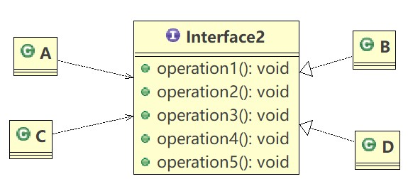
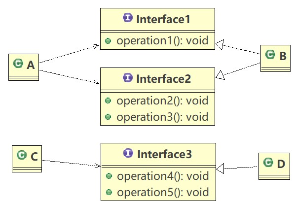

# 设计模式学习笔记

### 设计模式概述

> 软件工程中，设计模式（design pattern）是对软件设计中==普遍存在==（反复出现）的各种问题，所提出的==解决方案==。
>
> 设计模式的目的：
>
> 1. 代码的重用性
> 2. 可读性
> 3. 可扩展性
> 4. 可靠性
> 5. 使程序呈现高内聚，低耦合的特性
>
> 设计模式七大原则：
>
> 1. 单一职责原则
> 2. 接口隔离原则
> 3. 依赖倒置原则
> 4. 里氏替换原则
> 5. 开闭原则ocp
> 6. 迪米特法则
> 7. 合成复用原则

### 设计模式原则

##### 单一职责原则

> **基本介绍**
>
> 对类来说，即一个类应该只负责一项职责，如类A负责两个不同的职责：职责1，职责2。当职责1需求变更而改变A时，可能造成职责2执行错误，所以需要将类A的粒度分解为A1,A2
>
> 代码示例
>
> *修改前*
>
> ```java
> package com.designpattern.principle;
> 
> public class SingleResponsibility1 {
>     public static void main(String[] args) {
>         Vehicle vehicle = new Vehicle();
>         vehicle.run("摩托车");
>         vehicle.run("汽车");
>         vehicle.run("飞机");
>     }
> }
> 
> // 交通工具类
> class Vehicle{
>     public void run(String vehicle){
>         System.out.println(vehicle + "在公路上跑......");
>     }
> }
> // 这里的设计违反了单一职责原则，这个交通工具类既管理公路上跑的，又管天上飞的
> ```
>
> *修改后*
>
> ```java
> package com.designpattern.principle;
> 
> public class SingleResponsibility1 {
>     public static void main(String[] args) {
>         RoadVehicle roadVehicle = new RoadVehicle();
>         AirVehicle airVehicle = new AirVehicle();
>         roadVehicle.run("摩托车");
>         roadVehicle.run("汽车");
>         airVehicle.run("飞机");
>     }
> }
> 
> // 交通工具类
> class RoadVehicle{
>     public void run(String vehicle){
>         System.out.println(vehicle + "在公路上跑......");
>     }
> }
> 
> class AirVehicle{
>     public void run(String vehicle){
>         System.out.println(vehicle + "在天上飞......");
>     }
> }
> // 这里实现了类的单一职责原则，缺点是改动较大
> ```
>
> *方案2修改*
>
> ```java
> package com.designpattern.principle;
> 
> public class SingleResponsibility1 {
>     public static void main(String[] args) {
>         Vehicle vehicle = new Vehicle();
>         vehicle.run("摩托车");
>         vehicle.run("汽车");
>         vehicle.runAir("飞机");
>     }
> }
> 
> // 交通工具类
> class Vehicle{
>     public void run(String vehicle){
>         System.out.println(vehicle + "在公路上跑......");
>     }
> 
>     public void runAir(String vehicle){
>         System.out.println(vehicle + "在天上飞......");
>     }
> }
> // 这里虽然没有在类这个级别上遵守单一职责原则，但是在方法级别上，仍然是遵守单一职责原则的
> ```
>
> **单一职责原则注意事项和细节**
>
> 1. 降低类的复杂度，一个类只负责一项职责
> 2. 提高类的可读性，可维护性
> 3. 降低变更引起的风险
> 4. 通常情况下，我们应当遵守单一职责原则，只有逻辑足够简单，才可以在代码级违反单一职责原则；只有类中方法数量足够少，可以在方法级别保持单一职责原则

##### 接口隔离原则

> **基本介绍**
>
> 客户端不应该依赖它不需要的接口，即一个类对另一个类的依赖应该建立在最小的接口上
>
> 
>
> 如上图所示，类A只需要用到operation1(),operation2(),operation3()三个方法，而B实现了接口,A通过接口来依赖B，类C只需要用到接口中的operation4(),operation5()两个方法，而D也实现了接口，同样C也需要通过接口来依赖D，这个时候最好的做法，是将接口进行拆分，将这个接口拆分成几个独立的接口，类A和类C分别与它们需要的接口建立依赖关系。
>
> 示意图如下：
>
> 

##### 依赖倒置原则

> **基本介绍**
>
> 依赖倒置原则是指
>
> 1. 高层模块不应该依赖低层模块，二者都应该依赖其抽象
> 2. 抽象不应该依赖其细节，细节应该依赖抽象
> 3. 依赖倒置的中心思想是面向接口编程
> 4. 依赖倒置原则是基于这样的设计理念：相对于细节的多变性，抽象的东西要稳定的多。以抽象为基础搭建的架构比以细节为基础的架构要稳定的多。在java中，抽象指的是接口或抽象类，细节就是具体的实现类
> 5. 使用接口或抽象类的目的是制定好规范，而不涉及任何具体的操作，把展现细节的任务交给它们的实现类去完成
>
> 代码示例
>
> *修改前*
>
> ```java
> package com.designpattern.principle;
> 
> public class DependencyInversion {
> 
>     public static void main(String[] args) {
>         Person person = new Person();
>         person.receive(new Email());
>     }
> }
> 
> class Email{
>     public String getInfo(){
>         return "电子邮件信息：Hello,World!";
>     }
> }
> 
> class Person{
>     public void receive(Email email){
>         System.out.println(email.getInfo());
>     }
> }
> // 缺点：如果我们获取的对象是微信，短信等，则需要新增类，同时Person也要增加相应的接收方法
> // 解决思路：引入一个抽象的接口IReceiver，表示接收者，这样Person类与接口IReceiver发生依赖
> // 因为Email，微信等等属于接收的范围，他们各自实现IReceiver接口，这样就实现了依赖倒置原则
> ```
>
> *修改后*
>
> ```java
> package com.designpattern.principle;
> 
> public class DependencyInversion {
> 
>     public static void main(String[] args) {
>         Person person = new Person();
>         person.receive(new Email());
>     }
> }
> 
> // 定义接口
> interface IReceiver{
>     public String getInfo();
> }
> 
> class Email implements IReceiver{
>     public String getInfo(){
>         return "电子邮件信息：Hello,World!";
>     }
> }
> 
> class SMS implements IReceiver{
>     public String getInfo(){
>         return "短信信息：Hello,World!";
>     }
> }
> 
> class Person{
>     public void receive(IReceiver receiver){
>         System.out.println(receiver.getInfo());
>     }
> }
> ```

##### 里氏替换原则

> **基本介绍**
>
> 1. 如果对每个类型为T1的对象o1，都有类型为T2的对象o2，使得以T1定义的所有程序P在所有的对象o1都替换成o2时，程序P的行为没有发生变化，那么类型T2是类型T1的子类型，换句话说，所有引用基类的地方必须能透明地使用其子类的对象
> 2. 在使用继承时，遵循里氏替换原则，在子类中尽量不要重写父类的方法
> 3. 里氏替换原则告诉我们，继承实际上让两个类耦合性增强了，在适当的情况下，可以通过聚合，组合，依赖来解决问题
> 4. 如果一定要重写父类的方法，可以让原来的父类和子类都继承一个更通俗的基类，原有的继承关系去掉，采用依赖，组合，聚合等关系替代

##### 开闭原则

> **基本介绍**
>
> 1. 开闭原则是编程中最基础、最重要的设计原则
> 2. 一个软件实体，如类，模块和函数应该对扩展开放，对修改关闭。用抽象构建框架，用实现扩展细节
> 3. 当软件需要变化时，尽量通过扩展软件实体的行为来实现变化，而不是通过修改已有的代码来实现变化
> 4. 编程中遵循其他原则，以及使用设计模式的目的就是遵循开闭原则

