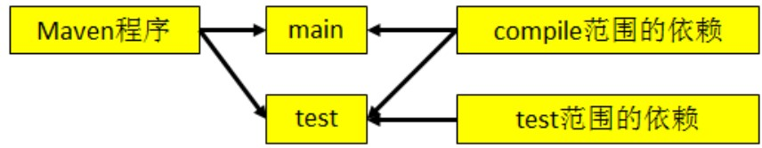
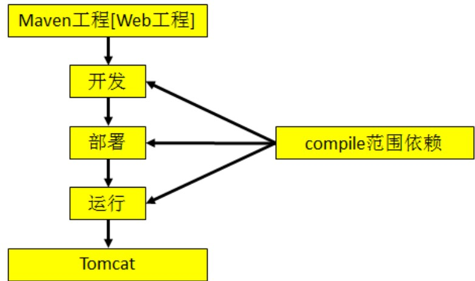
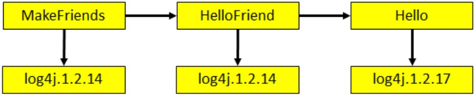
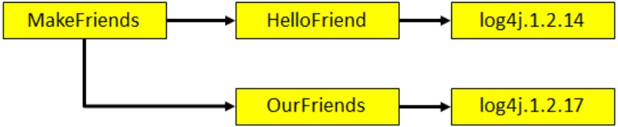

# Maven学习笔记

### Maven基本介绍

> **Maven是什么**
>
> 1. Maven是一款服务于Java平台的自动化构建工具
>
> **构建过程中的各个环节**
>
> 1. 清理：将以前编译得到的旧的class字节码文件删除，为下一次编译做准备
> 2. 编译：将Java源程序编译成class字节码文件
> 3. 测试：自动测试，自动调用JUnit程序
> 4. 报告：测试程序执行的结果
> 5. 打包：动态Web工程打war包，Java工程打jar包
> 6. 安装：Maven特定的概念---将打包得到的文件复制到仓库指定的位置
> 7. 部署：将动态Web工程生成的war包复制到Servlet容器指定的目录下，使其可以运行在Servlet容器中
>
> **Maven的核心概念**
>
> 1. 约定的目录结构
> 2. POM
> 3. 坐标
> 4. 依赖
> 5. 仓库
> 6. 生命周期/插件/目标
> 7. 继承
> 8. 聚合
>
> **第一个Maven工程**
>
> 1. 目录结构
>
>    Hello
>
>    |-----src
>
>    |-----|-----main
>
>    |-----|-----|-----java
>
>    |-----|-----|-----resources
>
>    |-----|-----test
>
>    |-----|-----|-----java
>
>    |-----|-----|-----resources
>
>    |-----pom.xml
>
>    (1) 根目录：工程名
>
>    (2) src目录：源码
>
>    (3) pom.xml文件：Maven工程的核心配置文件
>
>    (4) main目录：存放主程序
>
>    (5) test目录：存放测试程序
>
>    (6) java目录：存放Java源文件
>
>    (7) resources目录：存放框架或其他工具的配置文件
>
> **常用Maven命令**
>
> 1. 注意：执行与构建过程相关的Maven命令，必须进入pom.xml所在的目录，与构建构成相关的命令包括编译，测试，打包……
> 2. mvn clean：清理
> 3. mvn compile：编译主程序
> 4. mvn test-compile：编译测试程序
> 5. mvn test：执行测试
> 6. mvn package：打包
> 7. mvn install：安装项目到本地maven仓库
> 8. mvn site：生成站点
>
> **关于联网问题**
>
> 1. Maven的核心程序中仅仅定义了抽象的生命周期，但是具体的工作必须由特定的插件来完成。而插件本身并不包含在Maven的核心程序中。
>
> 2. 当我们执行的Maven命令需要用到某些插件时，Maven核心程序会首先到本地仓库中查找。
>
> 3. 本地仓库的默认位置：[系统中当前用户的家目录]/.m2/repository
>
> 4. Maven核心程序如果在本地仓库中找不到需要的插件，那么它会自动连接外网，到中央仓库下载。
>
> 5.  如果此时无法连接外网，则构建失败。 
>
> 6. 修改默认本地仓库的位置可以让Maven核心程序到我们事先准备好的目录下查找插件
>
>     (1) 找到Maven解压目录/conf/settings.xml
>
>     (2) 在settings.xml文件中找到localRepository标签
>     (3) 将<localRepository>/path/to/local/repo</localRepository>从注释中取出
>     (4) 将标签体内容修改为已经准备好的Maven仓库目录
>
> **POM**
>
> 1. 含义：Project Object Model  项目对象模型
> 2. pom.xml对于Maven工程是核心配置文件，与构建过程相关的一切设置都在这个文件中进行配置，重要程度相当于web.xml对于动态web工程
>
> **Maven的坐标**
>
> 使用下面三个向量在仓库中唯一定位一个Maven工程
>
> 1. groupId：公司或组织域名倒序+项目名
>
>    `<groupId>com.alibaba</groupId>`
>
> 2. artifactId：模块名
>
>    `<artifactId>easyexcel</artifactId>`
>
> 3. version：版本
>
>    `<version>2.2.7</version>`
>
> **依赖**
>
> 依赖的范围（scope）：
>
> 
>
> 1. compile
>
>    *  对主程序是否有效：有效
>    * 对测试程序是否有效：有效
>    * 是否参与打包：参与
>
> 2. test
>
>    *  对主程序是否有效：无效
>    * 对测试程序是否有效：有效
>    * 是否参与打包：不参与
>    * 典型例子：junit
>
> 3. provided
>
>    *  对主程序是否有效：有效
>    * 对测试程序是否有效：有效
>    * 是否参与打包：不参与
>    * 是否参与部署：不参与
>    * 典型例子：servlet-api.jar
>
>    
>
> 
>
> **生命周期**
>
> 1. 各个构建环节执行的顺序：不能打乱顺序，必须按照既定的正确顺序来执行。
> 2. Maven的核心程序中定义了抽象的生命周期，生命周期中各个阶段的具体任务是由插件来完成的
>
> **依赖的传递性**
>
> 1. 好处：可以传递的依赖不必在每个模块工程中声明，在最下面的工程中依赖一次即可
> 2. 注意：非compile范围的依赖不能传递，所以在各个模块中，如果有需要就得重复声明依赖
>
> **依赖的排除**
>
> 1. 需要设置依赖排除的场合：不稳定的jar包，不希望加入当前工程
>
> 2. 依赖排除的设置方式
>
>    ```xml
>    <dependency>
>        <groupId>org.springframework.boot</groupId>
>        <artifactId>spring-boot-starter-test</artifactId>
>        <scope>test</scope>
>        <exclusions>
>            <exclusion>
>                <groupId>commons-logging</groupId>
>                <artifactId>commons-logging</artifactId>
>            </exclusion>
>        </exclusions>
>    </dependency>
>    ```
>
> **依赖的原则**
>
> 作用：解决模块工程之间的jar包冲突问题
>
> 1. 验证路径最短者优先原则
>
>    
>
> 2. 验证路径相同时，先声明者优先，先声明指的是dependency标签的声明顺序
>
>    
>
> **统一管理依赖的版本**
>
> 建议配置方式：
>
> 1. 在properties标签内使用自定义标签统一声明版本号
>
> 2. 在需要统一版本的位置，使用${自定义签名}引用声明的版本号
>
>    ```xml
>    <?xml version="1.0" encoding="UTF-8"?>
>    <project xmlns="http://maven.apache.org/POM/4.0.0"
>             xmlns:xsi="http://www.w3.org/2001/XMLSchema-instance"
>             xsi:schemaLocation="http://maven.apache.org/POM/4.0.0 http://maven.apache.org/xsd/maven-4.0.0.xsd">
>        <modelVersion>4.0.0</modelVersion>
>        <groupId>com.example</groupId>
>        <artifactId>demo</artifactId>
>        <version>1.0-SNAPSHOT</version>
>    
>        <properties>
>            <example.spring.version>4.0.0.RELEASE</example.spring.version>
>        </properties>
>        <dependencies>
>            <dependency>
>                <groupId>org.springframework</groupId>
>                <artifactId>spring-core</artifactId>
>                <version>${example.spring.version}</version>
>                <scope>compile</scope>
>            </dependency>
>        </dependencies>
>    </project>
>    ```
>
> **依赖继承**
>
> ```xml
> <?xml version="1.0" encoding="UTF-8"?>
> <project xmlns="http://maven.apache.org/POM/4.0.0"
>          xmlns:xsi="http://www.w3.org/2001/XMLSchema-instance"
>          xsi:schemaLocation="http://maven.apache.org/POM/4.0.0 http://maven.apache.org/xsd/maven-4.0.0.xsd">
>     <modelVersion>4.0.0</modelVersion>
>     <groupId>com.example</groupId>
>     <artifactId>parent</artifactId>
>     <version>1.0-SNAPSHOT</version>
>     <modules>
>         <module>child</module>
>     </modules>
>     <packaging>pom</packaging>
>     <properties>
>         <junit.version>4.9</junit.version>
>     </properties>
>     <!--配置依赖的管理-->
>     <dependencyManagement>
>         <dependencies>
>             <dependency>
>                 <groupId>junit</groupId>
>                 <artifactId>junit</artifactId>
>                 <version>${junit.version}</version>
>                 <scope>test</scope>
>             </dependency>
>         </dependencies>
>     </dependencyManagement>
> </project>
> ```
>
> ```xml
> <?xml version="1.0" encoding="UTF-8"?>
> <project xmlns="http://maven.apache.org/POM/4.0.0"
>          xmlns:xsi="http://www.w3.org/2001/XMLSchema-instance"
>          xsi:schemaLocation="http://maven.apache.org/POM/4.0.0 http://maven.apache.org/xsd/maven-4.0.0.xsd">
>     <modelVersion>4.0.0</modelVersion>
>     <artifactId>child</artifactId>
>     <!--子工程中声明父工程-->
>     <parent>
>         <groupId>com.example</groupId>
>         <artifactId>parent</artifactId>
>         <version>1.0-SNAPSHOT</version>
>         <!--以当前工程的pom.xml文件为基准的父工程pom.xml文件的相对路径-->
>         <relativePath>../pom.xml</relativePath>
>     </parent>
>     <dependencies>
>         <dependency>
>             <groupId>junit</groupId>
>             <artifactId>junit</artifactId>
>             <scope>test</scope>
>         </dependency>
>     </dependencies>
> </project>
> ```
>
> 注意：配置继承后，执行maven install 命令时，要先安装父工程，再安装子工程
>
> **聚合**
>
> 作用：一键安装各个模块工程
>
> 配置方式：
>
> ```xml
> <!--配置聚合-->
> <modules>
>     <!--指定各个子工程的相对路径-->
>     <module>child</module>
> </modules>
> ```
>
> 使用方式：在聚合工程的pom.xml点右键run as maven install (eclipse中)
>
> **自动部署**
>
> 自动部署配置：
>
> ```xml
> <!--配置当前构建工程中的特殊设置-->
> <build>
>     <finalName>AtguiguWeb</finalName>
>     <!--配置构建过程中需要使用的插件-->
>     <plugins>
>         <plugin>
>             <!--cargo是一家专门从事“启动Servlet容器”的组织-->
>             <groupId>org.codehaus.cargo</groupId>
>             <artifactId>cargo-maven2-plugin</artifactId>
>             <version>1.2.3</version>
>             <!--针对插件进行的配置-->
>             <configuration>
>                 <!--配置当前系统中容器的位置-->
>                 <container>
>                     <containerId>tomcat6x</containerId>
>                     <home>D:\DevInstall\apache-tomcat-6.0.39</home>
>                 </container>
>                 <configuration>
>                     <type>existing</type>
>                     <home>D:\DevInstall\apache-tomcat-6.0.39</home>
>                     <!-- 如果Tomcat端口为默认值8080则不必设置该属性 -->
>                     <properties>
>                         <cargo.servlet.port>8989</cargo.servlet.port>
>                     </properties>
>                 </configuration>
>             </configuration>
>             <!--配置插件在什么情况下执行-->
>             <executions>
>                 <execution>
>                     <id>cargo-run</id>
>                     <!--生命周期的阶段-->
>                     <phase>install</phase>
>                     <goals>
>                         <!--插件的目标-->
>                         <goal>run</goal>
>                     </goals>
>                 </execution>
>             </executions>
>         </plugin>
>     </plugins>
> </build>
> ```
>
> 

