# JavaFX学习笔记

### 入门示例

项目结构

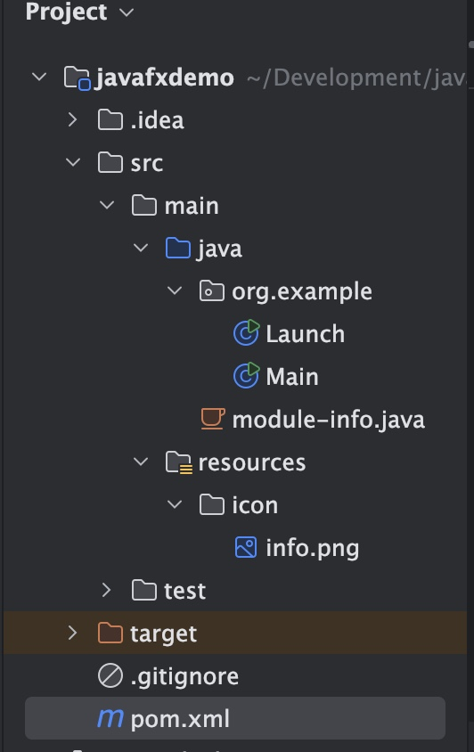

main.java

```java
package org.example;

import javafx.application.Application;

public class Main {
    public static void main(String[] args) {
        System.out.println("main ===== " + Thread.currentThread().getName());
        Application.launch(Launch.class,args);
    }
}
```

Launch.java

```java
package org.example;

import cn.hutool.core.io.resource.ResourceUtil;
import javafx.application.Application;
import javafx.scene.image.Image;
import javafx.stage.Stage;
import java.net.URL;

public class Launch extends Application {
    @Override
    public void init() throws Exception {
        System.out.println("init ===== " + Thread.currentThread().getName());
    }

    @Override
    public void stop() throws Exception {
        System.out.println("stop ===== " + Thread.currentThread().getName());
    }

    @Override
    public void start(Stage stage) throws Exception {
        System.out.println("start ===== " + Thread.currentThread().getName());
        // 设置标题
        stage.setTitle("JavaFX入门");
        // 获取图标资源
        System.out.println(this.getClass().getResource("/icon/info.png"));
        // 设置标题栏图标
        stage.getIcons().add(new Image(this.getClass().getResourceAsStream("/icon/info.png")));
        // 设置窗口宽度
        stage.setWidth(1000);
        // 设置窗口高度
        stage.setHeight(500);
        // 设置最小化
//        stage.setIconified(true);
        // 设置最大化
        stage.setMaximized(true);
        stage.show();
        stage.close();
    }
}
```

pom.xml

```xml
<?xml version="1.0" encoding="UTF-8"?>
<project xmlns="http://maven.apache.org/POM/4.0.0"
         xmlns:xsi="http://www.w3.org/2001/XMLSchema-instance"
         xsi:schemaLocation="http://maven.apache.org/POM/4.0.0 http://maven.apache.org/xsd/maven-4.0.0.xsd">
    <modelVersion>4.0.0</modelVersion>

    <groupId>org.example</groupId>
    <artifactId>javafxdemo</artifactId>
    <version>1.0-SNAPSHOT</version>

    <properties>
        <maven.compiler.source>21</maven.compiler.source>
        <maven.compiler.target>21</maven.compiler.target>
        <project.build.sourceEncoding>UTF-8</project.build.sourceEncoding>
    </properties>
    <dependencies>
        <!-- https://mvnrepository.com/artifact/org.openjfx/javafx-controls -->
        <dependency>
            <groupId>org.openjfx</groupId>
            <artifactId>javafx-controls</artifactId>
            <version>22.0.1</version>
        </dependency>
        <dependency>
            <groupId>org.openjfx</groupId>
            <artifactId>javafx-fxml</artifactId>
            <version>22.0.1</version>
        </dependency>
        <!-- https://mvnrepository.com/artifact/cn.hutool/hutool-all -->
        <dependency>
            <groupId>cn.hutool</groupId>
            <artifactId>hutool-all</artifactId>
            <version>5.8.27</version>
        </dependency>
    </dependencies>


</project>
```

module-info.java

```java
module org.example{
    requires javafx.controls;
    requires cn.hutool;
    exports org.example;
}
```

### Stage窗口，窗口风格，模态框

> **Stage常用方法**
>
> ```java
>     public void start(Stage stage) throws Exception{
>         // 设置标题
>         stage.setTitle("JavaFX入门");
>         // 设置窗口宽度
>         stage.setWidth(300);
>         // 设置窗口高度
>         stage.setHeight(300);
>         // 设置透明度
>         // stage.setOpacity(0.5);
>         // 设置窗口置顶
>         // stage.setAlwaysOnTop(true);
>         // 设置X，Y坐标
>         stage.setX(100);
>         stage.setY(100);
>         // 监听窗口x轴坐标的变化
>         stage.xProperty().addListener(new ChangeListener<Number>() {
>             @Override
>             public void changed(ObservableValue<? extends Number> observableValue, Number oldValue, Number newValue) {
>                 System.out.println("oldValue: " + oldValue);
>                 System.out.println("newValue: " + newValue);
>             }
>         });
>       	// 设置窗口风格,可选值：DECORATED，TRANSPARENT，UNDECORATED，UNIFIED，UTILITY
>       	// 常用的有DECORATED和UTILITY
>         stage.initStyle(StageStyle.DECORATED);
>         stage.show();
>     }
> ```
>
> **模态框**
>
> ```java
> public void start(Stage stage) throws Exception{
>   stage.show();
>   Stage s1 = new Stage();
>   s1.setTitle("s1");
>   // 设置模态框，当s1窗口没有关闭时，不能操作stage窗口
>   s1.initOwner(stage);
>   s1.initModality(Modality.WINDOW_MODAL);
>   s1.show();
> }
> ```
>

### Platform类的使用

> ```java
> package org.example;
> 
> import javafx.application.Application;
> import javafx.application.ConditionalFeature;
> import javafx.application.Platform;
> import javafx.stage.Stage;
> 
> public class Launch extends Application {
>     @Override
>     public void init() throws Exception {
>     }
> 
>     @Override
>     public void stop() throws Exception {
>     }
> 
>     @Override
>     public void start(Stage stage) throws Exception{
>         // 在空闲的时间执行Runnable接口里面的内容，适合在后台执行轻量级的任务，底层是用队列实现的
>         Platform.runLater(()->{
>             System.out.println("run later test!!!");
>             System.out.println(Thread.currentThread().getName());
>         });
>         // 设置是否隐式退出，设置为true，关闭窗口即关闭程序，设置为false时，关闭窗口时，程序不会退出
>         Platform.setImplicitExit(true);
>         // 检查目标运行平台是否支持某些特性
>         boolean supported = Platform.isSupported(ConditionalFeature.SCENE3D);
>         System.out.println("is supported scene3D  :  " + supported);
>         stage.show();
>     }
> }
> ```

### Screen类

> ```java
> public void start(Stage stage) throws Exception{
>   Screen screen = Screen.getPrimary();
>   Rectangle2D rec1 = screen.getBounds();
>   Rectangle2D rec2 = screen.getVisualBounds();
>   // 下面是全部屏幕，宽高和坐标
>   System.out.println("左上角x = " + rec1.getMinX() + "  左上角y = " + rec1.getMinX());
>   System.out.println("右下角x = " + rec1.getMaxX() + "  右下角y = " + rec1.getMaxY());
>   System.out.println("宽度 = " + rec1.getWidth() + "  高度 = " + rec1.getHeight());
> 
>   // 下面是可视区域屏幕，宽高和坐标
>   System.out.println("左上角x = " + rec2.getMinX() + "  左上角y = " + rec2.getMinX());
>   System.out.println("右下角x = " + rec2.getMaxX() + "  右下角y = " + rec2.getMaxY());
>   System.out.println("宽度 = " + rec2.getWidth() + "  高度 = " + rec2.getHeight());
> 
>   // 当前屏幕DPI
>   double dpi = screen.getDpi();
>   System.out.println("当前屏幕DPI = " + dpi);
> }
> ```
>

### Scene类

> ```java
> public void start(Stage stage) throws Exception{
>   HostServices host = getHostServices();
>   host.showDocument("http://cn.bing.com");
>   URL url = getClass().getResource("/icon/info.png");
>   String path = url.toExternalForm();
>   Button button = new Button("按钮");
>   button.setCursor(Cursor.MOVE);
>   button.setPrefWidth(100);
>   button.setPrefHeight(50);
>   Group group = new Group();
>   group.getChildren().add(button);
>   Scene scene = new Scene(group);
>   // 设置鼠标形状
>   // scene.setCursor(Cursor.CLOSED_HAND);
>   scene.setCursor(Cursor.cursor(path));
>   stage.setScene(scene);
>   stage.setWidth(300);
>   stage.setHeight(300);
>   stage.show();
> }
> ```

### Group容器的使用

> ```java
> public void start(Stage stage) throws Exception{
>   Button b1 = new Button("btn1");
>   Button b2 = new Button("btn2");
>   Button b3 = new Button("btn3");
>   b1.setLayoutX(0);
>   b1.setLayoutY(20);
>   b2.setLayoutX(150);
>   b2.setLayoutY(20);
>   b3.setLayoutX(300);
>   b3.setLayoutY(20);
> 
>   b1.setPrefWidth(100);
>   b1.setPrefHeight(50);
>   Group group = new Group();
>   // 往Group容器中添加子组件
>   group.getChildren().addAll(b1,b2,b3);
>   group.setOpacity(0.5);
>   Object[] arrs = group.getChildren().toArray();
>   for (Object obj : arrs) {
>     Button btn = (Button) obj;
>     btn.setPrefWidth(100);
>     btn.setPrefHeight(50);
>   }
>   // 给按钮增加点击事件
>   b1.setOnAction(new EventHandler<ActionEvent>() {
>     @Override
>     public void handle(ActionEvent actionEvent) {
>       Button b4 = new Button("b4");
>       group.getChildren().add(b4);
>     }
>   });
>   // 给Group容器添加监听器
>   group.getChildren().addListener(new ListChangeListener<Node>() {
>     @Override
>     public void onChanged(Change<? extends Node> change) {
>       System.out.println("当前子组件数量 = " + change.getList().size());
>     }
>   });
>   // 设置子组件是否有默认尺寸
>   // group.setAutoSizeChildren(false);
>   // 移除Group容器中的组件
>   // group.getChildren().remove(0);
>   // 移除Group容器中所有子组件
>   // group.getChildren().clear();
>   Scene scene = new Scene(group);
>   stage.setScene(scene);
>   stage.setWidth(500);
>   stage.setHeight(300);
>   stage.show();
> }
> ```

### Button按钮

> ```java
> Button b1 = new Button();
> // 设置按钮上的文本
> b1.setText("按钮一");
> // 设置按钮位置
> b1.setLayoutX(100);
> b1.setLayoutY(100);
> // 设置按钮的宽和高
> b1.setPrefWidth(100);
> b1.setPrefHeight(50);
> // 设置字体
> //        b1.setFont(Font.font("sans-serif", 20));
> //        b1.setTextFill(Paint.valueOf("#CD0000"));
> // 设置背景色，圆角,背景四个角的空白填充
> //        BackgroundFill bgf = new BackgroundFill(Paint.valueOf("#8FBC8F"),new CornerRadii(10),new Insets(5));
> //        Background bg = new Background(bgf);
> //        b1.setBackground(bg);
> //        // 设置边框颜色，边框样式，边框圆角，边框宽度
> //        BorderStroke bos = new BorderStroke(Paint.valueOf("#7B68EE"), BorderStrokeStyle.SOLID,new CornerRadii(10),new BorderWidths(5));
> //        Border border = new Border(bos);
> //        b1.setBorder(border);
> b1.setStyle("-fx-background-color: #7CCD7C;-fx-background-radius: 20;-fx-text-fill: #CD0000");
> // 设置按钮的单击事件
> b1.setOnAction(new EventHandler<ActionEvent>() {
>   @Override
>   public void handle(ActionEvent event) {
>     Button btn = (Button) event.getSource();
>     System.out.println("按钮文本是：" + btn.getText());
>   }
> });
> Group group = new Group();
> group.getChildren().add(b1);
> Scene scene = new Scene(group);
> stage.setScene(scene);
> stage.setWidth(500);
> stage.setHeight(300);
> stage.show();
> ```

### 双击事件和检测键盘按键

> ```java
> public void start(Stage stage) throws Exception{
>   Button b1 = new Button();
>   // 设置按钮上的文本
>   b1.setText("按钮一");
>   // 设置按钮位置
>   b1.setLayoutX(100);
>   b1.setLayoutY(100);
>   // 设置按钮的宽和高
>   b1.setPrefWidth(100);
>   b1.setPrefHeight(50);
>   b1.setStyle("-fx-background-color: #7CCD7C;-fx-background-radius: 20;-fx-text-fill: #CD0000");
>   // 设置按钮的单击事件
>   b1.setOnAction(new EventHandler<ActionEvent>() {
>     @Override
>     public void handle(ActionEvent event) {
>       Button btn = (Button) event.getSource();
>       System.out.println("按钮文本是：" + btn.getText());
>     }
>   });
>   b1.addEventHandler(MouseEvent.MOUSE_CLICKED, new EventHandler<MouseEvent>() {
>     @Override
>     public void handle(MouseEvent mouseEvent) {
>       System.out.println("鼠标按键 = " + mouseEvent.getButton().name());
>       if(mouseEvent.getClickCount() == 2){
>         System.out.println("鼠标双击了！");
>       }
>     }
>   });
>   // 监听键盘按键按下事件
>   b1.setOnKeyPressed(new EventHandler<KeyEvent>() {
>     @Override
>     public void handle(KeyEvent keyEvent) {
>       System.out.println("按下的按键是：" + keyEvent.getCode().getName());
>     }
>   });
>   // 监听键盘按键释放事件
>   b1.setOnKeyReleased(new EventHandler<KeyEvent>() {
>     @Override
>     public void handle(KeyEvent keyEvent) {
>       System.out.println("释放");
>     }
>   });
>   Group group = new Group();
>   group.getChildren().add(b1);
>   Scene scene = new Scene(group);
>   stage.setScene(scene);
>   stage.setWidth(500);
>   stage.setHeight(300);
>   stage.show();
> }
> ```
>

### 设置快捷键

> ```java
> @Override
> public void start(Stage stage) throws Exception{
> Button b1 = new Button();
> // 设置按钮上的文本
> b1.setText("按钮一");
> // 设置按钮位置
> b1.setLayoutX(100);
> b1.setLayoutY(100);
> // 设置按钮的宽和高
> b1.setPrefWidth(100);
> b1.setPrefHeight(50);
> b1.setStyle("-fx-background-color: #7CCD7C;-fx-background-radius: 20;-fx-text-fill: #CD0000");
> b1.setOnAction(new EventHandler<ActionEvent>() {
> @Override
> public void handle(ActionEvent event) {
> System.out.println("setOnAction");
> }
> });
> Group group = new Group();
> group.getChildren().add(b1);
> Scene scene = new Scene(group);
> // 设置快捷键
> // 第一种
> KeyCombination kc1 = new KeyCodeCombination(KeyCode.C, KeyCombination.ALT_DOWN, KeyCombination.CONTROL_DOWN);
> Mnemonic m1 = new Mnemonic(b1, kc1);
> scene.addMnemonic(m1);
> // 第二种 不常用
> KeyCombination kc2 = new KeyCharacterCombination("A", KeyCombination.ALT_DOWN);
> Mnemonic m2 = new Mnemonic(b1, kc2);
> scene.addMnemonic(m2);
> // 第三种 不常用
> KeyCombination kc3 = new KeyCodeCombination(KeyCode.K, KeyCombination.SHIFT_DOWN, KeyCombination.CONTROL_DOWN,KeyCombination.ALT_DOWN,KeyCombination.META_DOWN,KeyCombination.SHORTCUT_DOWN);
> Mnemonic m3 = new Mnemonic(b1, kc3);
> scene.addMnemonic(m3);
> // 第四种 推荐使用
> KeyCombination kcc = new KeyCodeCombination(KeyCode.Y, KeyCombination.SHORTCUT_DOWN);
> scene.getAccelerators().put(kcc, new Runnable() {
> @Override
> public void run() {
> System.out.println("run 方法");
> b1.fire();
> }
> });
> 
> stage.setScene(scene);
> stage.setWidth(500);
> stage.setHeight(300);
> stage.show();
> }
> ```

### 文本框，密码框，标签

> ```java
> @Override
> public void start(Stage stage) throws Exception{
>   TextField tf = new TextField();
>   tf.setText("这是文本框");
>   tf.setLayoutX(100);
>   tf.setLayoutY(20);
>   tf.setFont(Font.font(14));
>   Tooltip tip = new Tooltip("这是提示！");
>   tip.setFont(Font.font(12));
>   tf.setTooltip(tip);
>   tf.setPromptText("请输入七个字以下");
>   tf.setFocusTraversable(false);
>   tf.textProperty().addListener(new ChangeListener<String>() {
>     @Override
>     public void changed(ObservableValue<? extends String> observableValue, String oldValue, String newValue) {
>       System.out.println(newValue);
>     }
>   });
>   // 监听文本框选择了哪几个字
>   tf.selectedTextProperty().addListener(new ChangeListener<String>() {
>     @Override
>     public void changed(ObservableValue<? extends String> observableValue, String oldValue, String newValue) {
>       System.out.println(newValue);
>     }
>   });
> 
>   // 密码框
>   PasswordField pwf = new PasswordField();
>   pwf.setLayoutX(100);
>   pwf.setLayoutY(60);
>   // 标签
>   Label label = new Label();
>   label.setText("这是标签");
>   label.setLayoutX(100);
>   label.setLayoutY(90);
>   label.setOnMouseClicked(new EventHandler<MouseEvent>() {
>     @Override
>     public void handle(MouseEvent mouseEvent) {
>       System.out.println("鼠标单击事件触发！");
>     }
>   });
>   // 设置标签文字颜色
>   label.setTextFill(Paint.valueOf("red"));
>   Group root = new Group();
>   root.getChildren().addAll(tf,pwf,label);
>   Scene scene = new Scene(root);
>   stage.setScene(scene);
>   stage.setWidth(500);
>   stage.setHeight(300);
>   stage.show();
> }
> ```

### AnchorPane布局类

> ```java
> @Override
> public void start(Stage stage) throws Exception{
>   Button b1 = new Button("button1");
>   b1.setLayoutX(100.0);
>   b1.setLayoutY(100.0);
>   Button b2 = new Button("Button2");
>   Button b3 = new Button("Button3");
>   Button b4 = new Button("Button4");
>   AnchorPane ap = new AnchorPane();
>   ap.getChildren().addAll(b2,b1);
>   ap.setStyle("-fx-background-color: #FF3E96");
> 
>   Group g1 = new Group();
>   Group g2 = new Group();
>   g1.getChildren().addAll(b1,b2);
>   g2.getChildren().addAll(b3,b4);
>   // 距离参考点上面100个像素
>   AnchorPane.setTopAnchor(g1,100.0);
>   // 距离参考点左边100个像素
>   AnchorPane.setLeftAnchor(g1,100.0);
>   AnchorPane.setTopAnchor(g2,200.0);
>   AnchorPane.setLeftAnchor(g2,200.0);
>   ap.getChildren().addAll(g1,g2);
>   Scene scene = new Scene(ap);
>   stage.setScene(scene);
>   stage.setWidth(500);
>   stage.setHeight(300);
>   stage.show();
> }
> ```

>```java
>public void start(Stage stage) throws Exception{
>  AnchorPane ap = new AnchorPane();
>  ap.setStyle("-fx-background-color: #FF3E96");
>  AnchorPane ap2 = new AnchorPane();
>  ap2.setStyle("-fx-background-color: #80aaff");
>  ap.getChildren().add(ap2);
>  Scene scene = new Scene(ap);
>  stage.setScene(scene);
>  stage.setWidth(500);
>  stage.setHeight(300);
>  stage.show();
>
>  // 因为stage  show才会进行宽高初始化，所以获取stage宽高要在show之后
>  // 距离参考点上面100个像素
>  AnchorPane.setTopAnchor(ap2,0.0);
>  // 距离参考点左边100个像素
>  AnchorPane.setLeftAnchor(ap2,0.0);
>  AnchorPane.setRightAnchor(ap2,ap.getWidth() / 2);
>  AnchorPane.setBottomAnchor(ap2,ap.getHeight() / 2);
>  stage.widthProperty().addListener(new ChangeListener<Number>() {
>    @Override
>    public void changed(ObservableValue<? extends Number> observableValue, Number number, Number t1) {
>      AnchorPane.setRightAnchor(ap2,ap.getWidth() / 2);
>    }
>  });
>  stage.heightProperty().addListener(new ChangeListener<Number>() {
>    @Override
>    public void changed(ObservableValue<? extends Number> observableValue, Number number, Number t1) {
>      AnchorPane.setBottomAnchor(ap2,ap.getHeight() / 2);
>    }
>  });
>}
>```

### HBox和VBox

> ```java
> public void start(Stage stage) throws Exception{
>   Button b1 = new Button("按钮一");
>   Button b2 = new Button("按钮二");
>   Button b3 = new Button("按钮三");
>   AnchorPane ap = new AnchorPane();
>   ap.setStyle("-fx-background-color: #AEEEEE");
>   // 水平布局
>   HBox hb = new HBox();
>   // 垂直布局
>   // VBox hb = new VBox();
>   hb.setPrefWidth(200);
>   hb.setPrefHeight(100);
>   // 设置内边距
>   hb.setPadding(new Insets(10));
>   // 子组件之间的间距
>   hb.setSpacing(10);
>   // 设置外边距
>   HBox.setMargin(b1,new Insets(10));
>   // 设置对齐方式【下方居中对齐】
>   hb.setAlignment(Pos.BOTTOM_CENTER);
>   hb.setStyle("-fx-background-color: #E066FF");
>   hb.getChildren().addAll(b1,b2,b3);
>   ap.getChildren().addAll(hb);
>   Scene scene = new Scene(ap);
>   stage.setScene(scene);
>   stage.setWidth(500);
>   stage.setHeight(300);
>   stage.show();
> }
> ```

### setManaged和setVisible以及setOpacity

* setManaged:控制组件是否存在，类似于css中的display:none，设置为false，组件不再占用空间
* setVisible: 控制组件的可见性：类似于css中的visibility:hidden，设置为false，组件依然占用空间，只是不可见
* setOpacity:控制组件的透明度

### BorderPane布局类

> ```java
> public void start(Stage stage) throws Exception{
>   AnchorPane ap1 = new AnchorPane();
>   ap1.setStyle("-fx-background-color: #00FF7F");
>   ap1.setPrefSize(100, 100);
> 
>   AnchorPane ap2 = new AnchorPane();
>   ap2.setStyle("-fx-background-color: #8B658B");
>   ap2.setPrefSize(100, 100);
> 
>   AnchorPane ap3 = new AnchorPane();
>   ap3.setStyle("-fx-background-color: #FF6A6A");
>   ap3.setPrefSize(100, 100);
> 
>   AnchorPane ap4 = new AnchorPane();
>   ap4.setStyle("-fx-background-color: #FFA500");
>   ap4.setPrefSize(100, 100);
> 
>   AnchorPane ap5 = new AnchorPane();
>   ap5.setStyle("-fx-background-color: #8B8989");
>   ap5.setPrefSize(100, 100);
> 
>   // 设置上下左右中间的布局方式
>   BorderPane bp = new BorderPane();
>   bp.setStyle("-fx-background-color: #EECBAD");
>   bp.setTop(ap1);
>   bp.setBottom(ap2);
>   bp.setLeft(ap3);
>   bp.setRight(ap4);
>   bp.setCenter(ap5);
> 
>   Scene scene = new Scene(bp);
>   stage.setScene(scene);
>   stage.setWidth(500);
>   stage.setHeight(300);
>   stage.show();
> }
> ```

### FlowPane布局类

> ```java
> // 流式布局，子组件根据空间自动调整位置
> public void start(Stage stage) throws Exception{
>   Button b1 = new Button("按钮一");
>   Button b2 = new Button("按钮二");
>   Button b3 = new Button("按钮三");
>   Button b4 = new Button("按钮四");
>   Button b5 = new Button("按钮五");
>   Button b6 = new Button("按钮六");
>   FlowPane fp = new FlowPane();
>   fp.getChildren().addAll(b1,b2,b3,b4,b5,b6);
>   // fp.setMargin(b1,new Insets(0,10,0,10));
>   // 设置子组件的水平间距
>   fp.setHgap(10);
>   // 设置子组件的垂直间距
>   fp.setVgap(10);
>   Scene scene = new Scene(fp);
>   stage.setScene(scene);
>   stage.setWidth(500);
>   stage.setHeight(300);
>   stage.show();
> }
> ```

### GridPane布局类

> ```java
> public void start(Stage stage) throws Exception{
>   Button b1 = new Button("按钮一");
>   Button b2 = new Button("按钮二");
>   Button b3 = new Button("按钮三");
>   Button b4 = new Button("按钮四");
>   Button b5 = new Button("按钮五");
>   Button b6 = new Button("按钮六");
>   Button b7 = new Button("按钮七");
>   Button b8 = new Button("按钮八");
>   // 网格布局
>   GridPane grid = new GridPane();
>   grid.setStyle("-fx-background-color: #EE6AA7");
>   grid.setHgap(10);
>   grid.setVgap(10);
>   // 设置子组件在GridPane里的第几列第几行
>   grid.add(b1, 0, 0);
>   grid.add(b2, 1, 0);
>   grid.add(b3, 2, 0);
>   grid.add(b4, 3, 0);
>   grid.add(b5, 0, 1);
>   grid.add(b6, 1, 1);
>   grid.add(b7, 2, 1);
>   grid.add(b8, 3, 1);
>   Scene scene = new Scene(grid);
>   stage.setScene(scene);
>   stage.setWidth(500);
>   stage.setHeight(300);
>   stage.show();
> }
> ```

### StackPane布局类

> ```java
> public void start(Stage stage) throws Exception{
>   Button b1 = new Button("按钮一");
>   Button b2 = new Button("按钮二");
>   Button b3 = new Button("按钮三");
>   Button b4 = new Button("按钮四");
>   Button b5 = new Button("按钮五");
>   // 只显示最后一个加入容器的子组件
>   StackPane stack = new StackPane();
>   stack.setStyle("-fx-background-color: #EE6AA7");
>   stack.getChildren().addAll(b1,b2,b3,b4,b5);
>   stack.setPadding(new Insets(10));
>   stack.setAlignment(Pos.BOTTOM_LEFT);
>   Scene scene = new Scene(stack);
>   stage.setScene(scene);
>   stage.setWidth(500);
>   stage.setHeight(300);
>   stage.show();
> }
> ```

### TextFlow布局类

> ```java
> public void start(Stage stage) throws Exception{
>   // 文字布局
>   Text t1 = new Text("刻晴\n");
>   Text t2 = new Text("宵宫\n");
>   Text t3 = new Text("神里绫华\n");
>   // 设置字体
>   t1.setFont(Font.font(20));
>   // 设置颜色
>   t1.setFill(Paint.valueOf("#FF82AB"));
>   t2.setFont(Font.font(20));
>   t3.setFont(Font.font(20));
>   TextFlow tf = new TextFlow();
>   tf.setStyle("-fx-background-color: #EECFA1");
>   tf.getChildren().addAll(t1, t2, t3);
>   // 设置行间距
>   tf.setLineSpacing(10);
>   // 设置文字对齐方式
>   tf.setTextAlignment(TextAlignment.CENTER);
>   Scene scene = new Scene(tf);
>   stage.setScene(scene);
>   stage.setWidth(500);
>   stage.setHeight(300);
>   stage.show();
> }
> ```

### TilePane布局类

> ```java
> public void start(Stage stage) throws Exception{
>   Button b1 = new Button("按钮一");
>   Button b2 = new Button("按钮二");
>   Button b3 = new Button("按钮三");
>   Button b4 = new Button("按钮四");
>   Button b5 = new Button("按钮五");
>   Button b6 = new Button("按钮六");
>   // 瓷砖瓦片布局，每块都保持一样
>   TilePane tile = new TilePane();
>   tile.setStyle("-fx-background-color: #EE6AA7");
>   tile.getChildren().addAll(b1,b2,b3,b4,b5,b6);
>   tile.setHgap(10);
>   tile.setVgap(10);
>   tile.setMargin(b1,new Insets(20));
>   Scene scene = new Scene(tile);
>   stage.setScene(scene);
>   stage.setWidth(500);
>   stage.setHeight(300);
>   stage.show();
> }
> ```

### DialogPane布局类

> ```java
> public void start(Stage stage) throws Exception{
>   Button btn = new Button("点击弹出窗口");
>   AnchorPane ap = new AnchorPane();
>   ap.setStyle("-fx-background-color: #fff");
>   AnchorPane.setTopAnchor(btn,100.00);
>   AnchorPane.setLeftAnchor(btn,100.00);
>   ap.getChildren().add(btn);
>   btn.setOnAction(new EventHandler<ActionEvent>() {
>     @Override
>     public void handle(ActionEvent event) {
>       // 对话框面板
>       DialogPane dp = new DialogPane();
>       dp.setHeaderText("提示信息");
>       dp.setContentText("提示详细内容");
>       // 设置按钮
>       dp.getButtonTypes().add(ButtonType.APPLY);
>       dp.getButtonTypes().add(ButtonType.CANCEL);
>       Button applyBtn = (Button) dp.lookupButton(ButtonType.APPLY);
>       Button cancelBtn = (Button) dp.lookupButton(ButtonType.CANCEL);
>       // 设置左上角图片
>       ImageView iv = new ImageView("file:src/main/resources/icon/info.png");
>       iv.setFitHeight(30);
>       iv.setFitWidth(30);
>       dp.setGraphic(iv);
>       dp.setExpandableContent(new Text("这是扩展内容"));
>       Stage stage1 = new Stage();
>       Scene sc = new Scene(dp);
>       stage1.setScene(sc);
>       stage1.initOwner(stage);
>       stage1.initModality(Modality.WINDOW_MODAL);
>       stage1.initStyle(StageStyle.UTILITY);
>       stage1.setResizable(false);
>       stage1.show();
>       applyBtn.setOnAction(new EventHandler<ActionEvent>() {
>         @Override
>         public void handle(ActionEvent event) {
>           System.out.println("apply按钮被点击了！");
>         }
>       });
>       cancelBtn.setOnAction(new EventHandler() {
>         @Override
>         public void handle(Event event) {
>           stage1.close();
>         }
>       });
>     }
>   });
>   Scene scene = new Scene(ap);
>   stage.setScene(scene);
>   stage.setWidth(500);
>   stage.setHeight(300);
>   stage.show();
> }
> ```

### 多任务

> ```java
> package org.example;
> 
> import javafx.application.Application;
> import javafx.concurrent.ScheduledService;
> import javafx.concurrent.Task;
> import javafx.event.ActionEvent;
> import javafx.event.EventHandler;
> import javafx.scene.Scene;
> import javafx.scene.control.Button;
> import javafx.scene.control.Label;
> import javafx.scene.layout.AnchorPane;
> import javafx.scene.paint.Paint;
> import javafx.scene.text.Font;
> import javafx.stage.Stage;
> import javafx.util.Duration;
> 
> public class Launch extends Application {
>     @Override
>     public void init() throws Exception {
> 
>     }
> 
>     @Override
>     public void stop() throws Exception {
> 
>     }
> 
>     @Override
>     public void start(Stage stage) throws Exception{
>         Button btn = new Button("点击运行多任务");
>         AnchorPane ap = new AnchorPane();
>         ap.setStyle("-fx-background-color: #fff");
>         AnchorPane.setTopAnchor(btn,100.00);
>         AnchorPane.setLeftAnchor(btn,100.00);
>         Label label = new Label();
>         label.setTextFill(Paint.valueOf("#FF00FF"));
>         label.setFont(Font.font(50));
>         label.setText("0");
>         AnchorPane.setTopAnchor(label,30.00);
>         AnchorPane.setLeftAnchor(label,150.00);
>         ap.getChildren().addAll(btn,label);
>         // 运行多任务
>         btn.setOnAction(new EventHandler<ActionEvent>() {
>             @Override
>             public void handle(ActionEvent event) {
>                 MyScheduledService myService = new MyScheduledService(label);
>                 // 设置2秒后执行
>                 myService.setDelay(Duration.seconds(2.00));
>                 // 设置运行间隔为1秒
>                 myService.setPeriod(Duration.seconds(1.00));
>                 myService.start();
>             }
>         });
> 
>         Scene scene = new Scene(ap);
>         stage.setScene(scene);
>         stage.setWidth(500);
>         stage.setHeight(300);
>         stage.show();
>     }
> 
> }
> 
> class MyScheduledService extends ScheduledService<Integer> {
>     public static int num = 0;
>     public Label label;
>     MyScheduledService(Label label) {
>         this.label = label;
>     }
>     @Override
>     protected Task<Integer> createTask() {
>         return new Task<Integer>() {
>             // 此方法不是UI线程执行的
>             @Override
>             protected Integer call() throws Exception {
>                 System.out.println("call method " + Thread.currentThread().getName());
>                 return num++;
>             }
> 
>             // 这个方法是UI线程执行的
>             @Override
>             protected void updateValue(Integer value) {
>                 System.out.println("updateValue method " + Thread.currentThread().getName());
>                 System.out.println("updateValue " + value);
>                 label.setText(String.valueOf(num));
>                 super.updateValue(value);
>             }
>         };
>     }
> }
> ```

### 简单登录窗口示例

> ```java
> public void start(Stage stage) throws Exception{
>   Label lName = new Label("账号：");
>   Label lPassword = new Label("密码：");
> 
>   TextField tName = new TextField();
>   PasswordField pPassword = new PasswordField();
> 
>   Button loginBtn = new Button("登录");
>   Button clearBtn = new Button("清除");
> 
>   GridPane gp = new GridPane();
>   gp.setStyle("-fx-background-color: #FFEBCD");
>   gp.add(lName,0,0);
>   gp.add(tName,1,0);
>   gp.add(lPassword,0,1);
>   gp.add(pPassword,1,1);
>   gp.add(clearBtn,0,2);
>   gp.add(loginBtn,1,2);
>   gp.setHgap(10);
>   gp.setVgap(10);
>   gp.setAlignment(Pos.CENTER);
>   GridPane.setMargin(loginBtn,new Insets(0,0,0,120));
> 
>   clearBtn.setOnAction(new EventHandler<ActionEvent>() {
>     @Override
>     public void handle(ActionEvent event) {
>       tName.setText("");
>       pPassword.setText("");
>     }
>   });
> 
>   loginBtn.setOnAction(new EventHandler<ActionEvent>() {
>     @Override
>     public void handle(ActionEvent event) {
>       tName.setUserData("admin");
>       pPassword.setUserData("12345");
>       String name = tName.getText();
>       String password = pPassword.getText();
>       if(tName.getUserData().equals(name) && pPassword.getUserData().equals(password)){
>         System.out.println("登录成功！");
>         stage.close();
>       }else{
>         System.out.println("登录失败！");
>         // 设置渐入动画
>         FadeTransition ft = new FadeTransition();
>         ft.setDuration(Duration.seconds(0.5));
>         ft.setNode(gp);
>         ft.setFromValue(0);
>         ft.setToValue(1);
>         ft.play();
>       }
>     }
>   });
> 
>   Scene scene = new Scene(gp);
>   stage.setScene(scene);
>   stage.setWidth(500);
>   stage.setHeight(300);
>   stage.show();
> }
> ```

### Hyperlink超链接

> ```java
> // 点击这个链接默认不会打开浏览器
> Hyperlink link = new Hyperlink("http://www.sina.com.cn");
> // 触发点击事件，打开浏览器
> link.setOnAction(new EventHandler<ActionEvent>() {
>   @Override
>   public void handle(ActionEvent event) {
>     System.out.println(link.getText());
>     HostServices host = getHostServices();
>     host.showDocument(link.getText());
>   }
> });
> ```

### 菜单的使用

> **MenuBar,Menu,MenuItem【菜单栏，菜单，菜单项】**
>
> ```java
> public void start(Stage stage) throws Exception{
> AnchorPane ap = new AnchorPane();
> ap.setStyle("-fx-background-color: #ffffff");
> // 创建菜单栏
> MenuBar menuBar = new MenuBar();
> // 创建菜单
> Menu menu1 = new Menu("菜单一");
> Menu menu2 = new Menu("菜单二");
> Menu menu3 = new Menu("菜单三");
> Menu menu4 = new Menu("菜单四");
> 
> ImageView iv = new ImageView("file:src/main/resources/icon/info.png");
> iv.setFitHeight(20);
> iv.setFitWidth(20);
> // 创建菜单项
> MenuItem item1 = new MenuItem("菜单项一",iv);
> item1.setAccelerator(KeyCombination.valueOf("Ctrl+1"));
> MenuItem item2 = new MenuItem("菜单项二");
> MenuItem item3 = new MenuItem("菜单项三");
> MenuItem item4 = new MenuItem("菜单项四");
> MenuItem item5 = new MenuItem("菜单项五");
> 
> item1.setOnAction(new EventHandler<ActionEvent>() {
> @Override
> public void handle(ActionEvent event) {
> System.out.println("菜单项一被点击了～");
> }
> });
> 
> menu1.getItems().addAll(item1, item2, item3);
> menu2.getItems().addAll(item4, item5);
> menuBar.getMenus().addAll(menu1, menu2, menu3, menu4);
> ap.getChildren().add(menuBar);
> Scene scene = new Scene(ap);
> stage.setScene(scene);
> stage.setWidth(500);
> stage.setHeight(300);
> stage.show();
> menuBar.setPrefWidth(ap.getWidth());
> ap.widthProperty().addListener((observable, oldValue, newValue) -> {
> menuBar.setPrefWidth(newValue.doubleValue());
> });
> }
> ```
>
> **子菜单，分隔符，单选，多选**
>
> ```java
> public void start(Stage stage) throws Exception{
> AnchorPane ap = new AnchorPane();
> ap.setStyle("-fx-background-color: #ffffff");
> // 创建菜单栏
> MenuBar menuBar = new MenuBar();
> // 创建菜单
> Menu menu1 = new Menu("菜单一");
> Menu menu2 = new Menu("菜单二");
> Menu menu3 = new Menu("菜单三");
> Menu menu4 = new Menu("菜单四");
> // 分割器，分隔符
> SeparatorMenuItem separator1 = new SeparatorMenuItem();
> SeparatorMenuItem separator2 = new SeparatorMenuItem();
> SeparatorMenuItem separator3 = new SeparatorMenuItem();
> 
> // 创建菜单项
> MenuItem item1 = new MenuItem("菜单项一");
> MenuItem item2 = new MenuItem("菜单项二");
> MenuItem item3 = new MenuItem("菜单项三");
> 
> item1.setOnAction(new EventHandler<ActionEvent>() {
> @Override
> public void handle(ActionEvent event) {
> System.out.println("菜单项一被点击了～");
> }
> });
> 
> // 菜单项的子菜单
> Menu m = new Menu("菜单");
> MenuItem subItem1 = new MenuItem("子菜单1");
> MenuItem subItem2 = new MenuItem("子菜单2");
> m.getItems().addAll(subItem1,subItem2);
> 
> // 单选
> ToggleGroup tg = new ToggleGroup();
> RadioMenuItem rm1 = new RadioMenuItem("选项一");
> RadioMenuItem rm2 = new RadioMenuItem("选项二");
> RadioMenuItem rm3 = new RadioMenuItem("选项三");
> rm1.setToggleGroup(tg);
> rm2.setToggleGroup(tg);
> rm3.setToggleGroup(tg);
> menu2.getItems().addAll(rm1,rm2,rm3);
> 
> // 多选
> CheckMenuItem cm1 = new CheckMenuItem("选项1");
> CheckMenuItem cm2 = new CheckMenuItem("选项2");
> CheckMenuItem cm3 = new CheckMenuItem("选项3");
> menu3.getItems().addAll(cm1,cm2,cm3);
> 
> menu1.getItems().addAll(item1, separator1,item2, separator2,item3,m);
> menuBar.getMenus().addAll(menu1, menu2, menu3, menu4);
> ap.getChildren().add(menuBar);
> Scene scene = new Scene(ap);
> stage.setScene(scene);
> stage.setWidth(500);
> stage.setHeight(300);
> stage.show();
> menuBar.setPrefWidth(ap.getWidth());
> ap.widthProperty().addListener((observable, oldValue, newValue) -> {
> menuBar.setPrefWidth(newValue.doubleValue());
> });
> }
> ```
>
> **CustomMenuItem**
>
> ```java
> public void start(Stage stage) throws Exception{
> AnchorPane ap = new AnchorPane();
> ap.setStyle("-fx-background-color: #ffffff");
> // 创建菜单栏
> MenuBar menuBar = new MenuBar();
> // 创建菜单
> Menu menu1 = new Menu("菜单一");
> Menu menu2 = new Menu("菜单二");
> Menu menu3 = new Menu("菜单三");
> 
> MenuItem item1 = new MenuItem("菜单项1");
> MenuItem item2 = new MenuItem("菜单项2");
> MenuItem item3 = new MenuItem("菜单项3");
> // 自定义菜单项
> CustomMenuItem cm1 = new CustomMenuItem();
> Button btn = new Button("按钮1");
> cm1.setContent(btn);
> 
> CustomMenuItem cm2 = new CustomMenuItem();
> ProgressBar bar = new ProgressBar(0.5);
> cm2.setContent(bar);
> 
> menu1.getItems().addAll(item1, item2, item3,cm1,cm2);
> menuBar.getMenus().addAll(menu1, menu2, menu3);
> ap.getChildren().add(menuBar);
> Scene scene = new Scene(ap);
> stage.setScene(scene);
> stage.setWidth(500);
> stage.setHeight(300);
> stage.show();
> }
> ```
>
> **MenuButton**
>
> ```java
> @Override
> public void start(Stage stage) throws Exception{
> AnchorPane ap = new AnchorPane();
> ap.setStyle("-fx-background-color: #ffffff");
> // 创建菜单栏
> MenuBar menuBar = new MenuBar();
> // 创建菜单
> Menu menu1 = new Menu("菜单一");
> Menu menu2 = new Menu("菜单二");
> Menu menu3 = new Menu("菜单三");
> 
> MenuItem item1 = new MenuItem("菜单项1");
> MenuItem item2 = new MenuItem("菜单项2");
> MenuItem item3 = new MenuItem("菜单项3");
> 	// 按钮菜单
> MenuButton mb = new MenuButton("按钮菜单");
> AnchorPane.setTopAnchor(mb,100.0);
> MenuItem item4 = new MenuItem("菜单项4");
> MenuItem item5 = new MenuItem("菜单项5");
> MenuItem item6 = new MenuItem("菜单项6");
> mb.getItems().addAll( item4, item5, item6);
> 
> menu1.getItems().addAll(item1, item2, item3);
> menuBar.getMenus().addAll(menu1, menu2, menu3);
> ap.getChildren().addAll(menuBar,mb);
> Scene scene = new Scene(ap);
> stage.setScene(scene);
> stage.setWidth(500);
> stage.setHeight(300);
> stage.show();
> }
> ```
>
> **SplitMenuButton**
>
> ```java
> @Override
> public void start(Stage stage) throws Exception{
> AnchorPane ap = new AnchorPane();
> ap.setStyle("-fx-background-color: #ffffff");
> // 创建菜单栏
> MenuBar menuBar = new MenuBar();
> // 创建菜单
> Menu menu1 = new Menu("菜单一");
> Menu menu2 = new Menu("菜单二");
> Menu menu3 = new Menu("菜单三");
> 
> MenuItem item1 = new MenuItem("菜单项1");
> MenuItem item2 = new MenuItem("菜单项2");
> MenuItem item3 = new MenuItem("菜单项3");
> // 箭头和按钮分割的按钮菜单
> SplitMenuButton smb = new SplitMenuButton();
> smb.setText("分割按钮菜单");
> AnchorPane.setTopAnchor(smb, 50.0);
> MenuItem item4 = new MenuItem("菜单项4");
> MenuItem item5 = new MenuItem("菜单项5");
> MenuItem item6 = new MenuItem("菜单项6");
> smb.getItems().addAll(item4, item5, item6);
> 
> menu1.getItems().addAll(item1, item2, item3);
> menuBar.getMenus().addAll(menu1, menu2, menu3);
> ap.getChildren().addAll(menuBar,smb);
> Scene scene = new Scene(ap);
> stage.setScene(scene);
> stage.setWidth(500);
> stage.setHeight(300);
> stage.show();
> }
> ```
>
> **ContextMenu**
>
> ```java
> @Override
> public void start(Stage stage) throws Exception{
> AnchorPane ap = new AnchorPane();
> ap.setStyle("-fx-background-color: #ffffff");
> Button btn = new Button("按钮1");
> // 右键单击弹出菜单
> ContextMenu cm = new ContextMenu();
> MenuItem item1 = new MenuItem("菜单项1");
> MenuItem item2 = new MenuItem("菜单项2");
> MenuItem item3 = new MenuItem("菜单项3");
> cm.getItems().addAll(item1, item2, item3);
> 
> btn.setContextMenu(cm);
> 
> // 右键菜单弹出事件
> btn.setOnContextMenuRequested(new EventHandler<ContextMenuEvent>() {
>  @Override
>  public void handle(ContextMenuEvent contextMenuEvent) {
>    System.out.println("右键菜单弹出事件触发了～");
>  }
> });
> ap.getChildren().addAll(btn);
> Scene scene = new Scene(ap);
> stage.setScene(scene);
> stage.setWidth(500);
> stage.setHeight(300);
> stage.show();
> }
> ```
>


### TitledPane折叠面板
>
> ```java
> @Override
> public void start(Stage stage) throws Exception{
> AnchorPane ap = new AnchorPane();
> ap.setStyle("-fx-background-color: #ffffff");
> VBox vBox = new VBox();
> // 可折叠面板
> TitledPane tp1 = new TitledPane("TitledPane 1", new Button("Button 1"));
> TitledPane tp2 = new TitledPane();
> tp2.setText("TitledPane 2");
> tp2.setContent(new Button("Button 2"));
> vBox.getChildren().addAll(tp1, tp2);
> ap.getChildren().addAll(vBox);
> Scene scene = new Scene(ap);
> stage.setScene(scene);
> stage.setWidth(500);
> stage.setHeight(300);
> stage.show();
> }
> ```

### Accordion
>
> ```java
> @Override
> public void start(Stage stage) throws Exception{
> AnchorPane ap = new AnchorPane();
> ap.setStyle("-fx-background-color: #ffffff");
> // 用来在里面放多个可折叠面板的容器,每次只能展开一个面板
> Accordion acc = new Accordion();
> TitledPane tp1 = new TitledPane("TitledPane 1", new Button("Button 1"));
> TitledPane tp2 = new TitledPane();
> tp2.setText("TitledPane 2");
> tp2.setContent(new Button("Button 2"));
> acc.getPanes().addAll(tp1, tp2);
> // 监听展开属性变化
> acc.expandedPaneProperty().addListener(new ChangeListener<TitledPane>() {
>  @Override
>  public void changed(ObservableValue<? extends TitledPane> observableValue, TitledPane oldVal, TitledPane newVal) {
>    System.out.println(newVal.getText());
>  }
> });
> ap.getChildren().addAll(acc);
> Scene scene = new Scene(ap);
> stage.setScene(scene);
> stage.setWidth(500);
> stage.setHeight(300);
> stage.show();
> }
> ```
>

### TabPane和Tab

> ```java
> @Override
> public void start(Stage stage) throws Exception{
>   AnchorPane ap = new AnchorPane();
>   ap.setStyle("-fx-background-color: #ffffff");
>   TabPane tp = new TabPane();
>   tp.setPrefWidth(300);
>   tp.setPrefHeight(300);
>   Tab tab1 = new Tab("tab1");
>   Tab tab2 = new Tab("tab2");
>   Tab tab3 = new Tab("tab3");
>   tab1.setContent(new Button("button 1"));
>   tab2.setContent(new Button("button 2"));
>   tab3.setContent(new Button("button 3"));
>   tp.getTabs().addAll(tab1, tab2, tab3);
>   // 设置是否允许关闭标签
>   tab2.setClosable(false);
>   // 设置切换标签的面板位置
>   tp.setSide(Side.RIGHT);
>   // 选择打开哪一个标签页
>   tp.getSelectionModel().selectLast();
>   // 监听切换标签页事件
>   tp.getSelectionModel().selectedItemProperty().addListener(new ChangeListener<Tab>() {
>     @Override
>     public void changed(ObservableValue<? extends Tab> observableValue, Tab oldVal, Tab newVal) {
>       System.out.println(newVal.getText());
>     }
>   });
>   // 设置标签切换触发事件的处理方法
>   tab1.setOnSelectionChanged(new EventHandler<Event>() {
>     @Override
>     public void handle(Event event) {
>       Tab t = (Tab) event.getSource();
>       System.out.println(t);
>     }
>   });
>   ap.getChildren().addAll(tp);
>   Scene scene = new Scene(ap);
>   stage.setScene(scene);
>   stage.setWidth(500);
>   stage.setHeight(300);
>   stage.show();
> }
> ```

### RadioButton和CheckBox

> ```java
> @Override
> public void start(Stage stage) throws Exception{
> AnchorPane ap = new AnchorPane();
> ap.setStyle("-fx-background-color: #ffffff");
> HBox box = new HBox(10);
> ToggleGroup tg = new ToggleGroup();
> RadioButton r1 = new RadioButton("RadioButton 1");
> RadioButton r2 = new RadioButton("RadioButton 2");
> RadioButton r3 = new RadioButton("RadioButton 3");
> RadioButton r4 = new RadioButton("RadioButton 4");
> r1.setToggleGroup(tg);
> r2.setToggleGroup(tg);
> r3.setToggleGroup(tg);
> r4.setToggleGroup(tg);
> 
> // 监听r1属性变化
> r1.selectedProperty().addListener(new ChangeListener<Boolean>() {
>  @Override
>  public void changed(ObservableValue<? extends Boolean> observableValue, Boolean oldVal, Boolean newVal) {
>    System.out.println(newVal);
>  }
> });
> // 监听ToggleGroup子组件状态
> tg.selectedToggleProperty().addListener(new ChangeListener<Toggle>() {
>  @Override
>  public void changed(ObservableValue<? extends Toggle> observableValue, Toggle oldVal, Toggle newVal) {
>    RadioButton rb = (RadioButton) newVal;
>    System.out.println(rb.getText());
>  }
> });
> box.getChildren().addAll(r1, r2, r3, r4);
> ap.getChildren().addAll(box);
> Scene scene = new Scene(ap);
> stage.setScene(scene);
> stage.setWidth(500);
> stage.setHeight(300);
> stage.show();
> }
> ```
>
> ```java
> @Override
> public void start(Stage stage) throws Exception{
>   AnchorPane ap = new AnchorPane();
>   ap.setStyle("-fx-background-color: #ffffff");
>   HBox box = new HBox(10);
>   CheckBox c1 = new CheckBox("CheckBox 1");
>   CheckBox c2 = new CheckBox("CheckBox 2");
>   CheckBox c3 = new CheckBox("CheckBox 3");
>   CheckBox c4 = new CheckBox("CheckBox 4");
>   box.getChildren().addAll(c1, c2, c3, c4);
>   // 监听checkbox选中属性变化
>   c1.selectedProperty().addListener(new ChangeListener<Boolean>() {
>     @Override
>     public void changed(ObservableValue<? extends Boolean> observableValue, Boolean oldVal, Boolean newVal) {
>       System.out.println(newVal);
>     }
>   });
> 
>   ap.setOnMouseClicked(new EventHandler<MouseEvent>() {
>     @Override
>     public void handle(MouseEvent mouseEvent) {
>       Object[] objs = box.getChildren().toArray();
>       for (Object obj : objs) {
>         CheckBox c = (CheckBox) obj;
>         System.out.println(c.getText() + " : " + c.isSelected());
>       }
>     }
>   });
> 
>   ap.getChildren().addAll(box);
>   Scene scene = new Scene(ap);
>   stage.setScene(scene);
>   stage.setWidth(500);
>   stage.setHeight(300);
>   stage.show();
> }
> ```
>

### TextArea

> ```java
> @Override
> public void start(Stage stage) throws Exception{
>   AnchorPane ap = new AnchorPane();
>   ap.setStyle("-fx-background-color: #ffffff");
>   TextArea area = new TextArea();
>   area.setFont(Font.font(16));
>   area.setText("神里绫华");
>   // 设置是否允许自动换行，超出宽度自动换行
>   area.setWrapText(false);
>   // 设置初始是几行几列
>   area.setPrefRowCount(5);
>   area.setPrefColumnCount(10);
>   // 追加文本
>   area.appendText("宵宫");
>   // 插入文本
>   area.insertText(4,"纳西妲");
>   // 选中全部文本
>   area.selectAll();
>   // 获取文本长度
>   int length = area.getLength();
>   System.out.println(length);
>   ap.getChildren().addAll(area);
>   Scene scene = new Scene(ap);
>   stage.setScene(scene);
>   stage.setWidth(500);
>   stage.setHeight(300);
>   stage.show();
> }
> ```

### 文本框限制用户输入格式

> ```java
> @Override
> public void start(Stage stage) throws Exception{
>   AnchorPane ap = new AnchorPane();
>   ap.setStyle("-fx-background-color: #ffffff");
>   TextArea area = new TextArea();
>   TextField tf = new TextField();
>   // 限制用户输入格式
>   //        tf.setTextFormatter(new TextFormatter<String>(new UnaryOperator<TextFormatter.Change>() {
>   //            @Override
>   //            public TextFormatter.Change apply(TextFormatter.Change t) {
>   //                String text = t.getText();
>   //                if(text.matches("[a-z]*")){
>   //                    return t;
>   //                }
>   //                return null;
>   //            }
>   //        }));
>   tf.setTextFormatter(new TextFormatter<String>(new StringConverter<String>() {
>     @Override
>     public String toString(String s) {
>       System.out.println("tostring = " + s);
>       return s;
>     }
> 
>     @Override
>     public String fromString(String s) {
>       System.out.println("fromString = " + s);
>       if(s.contains("5")){
>         String value = s.replace("5","五");
>         return value;
>       }
>       return s;
>     }
>   }));
>   tf.commitValue();
>   ap.getChildren().addAll(tf);
>   Scene scene = new Scene(ap);
>   stage.setScene(scene);
>   stage.setWidth(500);
>   stage.setHeight(300);
>   stage.show();
> }
> ```
>

### 简单实现文本框的关键词查询和文本排序

> ```java
> public void start(Stage stage) throws Exception{
>   AnchorPane ap = new AnchorPane();
>   ap.setStyle("-fx-background-color: #ffffff");
>   TextField tf = new TextField();
>   Button findBtn = new Button("查找");
>   Button sortBtn = new Button("排序");
>   HBox hBox = new HBox(10);
>   hBox.setAlignment(Pos.CENTER);
>   hBox.getChildren().addAll(tf, findBtn, sortBtn);
>   TextArea area = new TextArea();
>   area.setFont(Font.font(16));
>   VBox vBox = new VBox(10);
>   vBox.getChildren().addAll(hBox,area);
>   vBox.setPrefWidth(300);
> 
>   AnchorPane.setTopAnchor(vBox,10.0);
>   AnchorPane.setLeftAnchor(vBox,10.0);
>   ap.getChildren().addAll(vBox);
>   Scene scene = new Scene(ap);
>   stage.setScene(scene);
>   stage.setWidth(500);
>   stage.setHeight(300);
>   stage.show();
> 
>   // 文本查找
>   findBtn.setOnAction(new EventHandler<ActionEvent>() {
>     @Override
>     public void handle(ActionEvent event) {
> 
>       area.getParagraphs().forEach(new Consumer<CharSequence>() {
>         @Override
>         public void accept(CharSequence t) {
>           String findVal = tf.getText();
>           String value = t.toString();
>           if(value.contains(findVal)){
>             area.requestFocus();
>             int i = value.indexOf(findVal);
>             int index = findVal.length() + i;
>             area.selectRange(i,index);
>           }
>         }
>       });
>     }
>   });
> 
>   // 文本排序
>   sortBtn.setOnAction(new EventHandler<ActionEvent>() {
>     @Override
>     public void handle(ActionEvent event) {
>       char[] charArr = area.getText().toCharArray();
>       Arrays.sort(charArr);
>       area.setText(String.valueOf(charArr));
>     }
>   });
> 
> }
> ```

### ButtonBar的使用

> ```java
> public void start(Stage stage) throws Exception{
>   AnchorPane ap = new AnchorPane();
>   ap.setStyle("-fx-background-color: #ffffff");
>   ButtonBar btnBar = new ButtonBar();
>   Button b1 = new Button("按钮一");
>   Button b2 = new Button("按钮二");
>   Button b3 = new Button("按钮三");
>   ButtonBar.setButtonData(b1, ButtonBar.ButtonData.APPLY);
>   ButtonBar.setButtonData(b2, ButtonBar.ButtonData.FINISH);
>   ButtonBar.setButtonData(b3, ButtonBar.ButtonData.NO);
>   btnBar.getButtons().addAll(b1,b2,b3);
>   ap.getChildren().addAll(btnBar);
>   Scene scene = new Scene(ap);
>   stage.setScene(scene);
>   stage.setWidth(500);
>   stage.setHeight(300);
>   stage.show();
> 
> }
> ```

### ChoiceBox(下拉选择)

> ```java
> @Override
> public void start(Stage stage) throws Exception{
> AnchorPane ap = new AnchorPane();
> ap.setStyle("-fx-background-color: #ffffff");
> ChoiceBox<String> cb = new ChoiceBox<>();
> cb.getItems().addAll("A", "B", "C");
> // 设置默认选择的值
> cb.setValue("B");
> // 设置选中哪个值
> cb.getSelectionModel().select("A");
> ap.getChildren().addAll(cb);
> Scene scene = new Scene(ap);
> stage.setScene(scene);
> stage.setWidth(500);
> stage.setHeight(300);
> stage.show();
> 
> // 监听选项选中变化
> cb.getSelectionModel().selectedItemProperty().addListener(new ChangeListener<String>() {
>  @Override
>  public void changed(ObservableValue<? extends String> observableValue, String oldVal, String newVal) {
>    System.out.println(newVal);
>  }
> });
> }
> ```
>
> **加载对象类型数据**
>
> ```java
> package org.example;
> 
> import javafx.application.Application;
> import javafx.scene.Scene;
> import javafx.scene.control.ChoiceBox;
> import javafx.scene.layout.AnchorPane;
> import javafx.stage.Stage;
> import javafx.util.StringConverter;
> 
> public class Launch extends Application {
>     @Override
>     public void init() throws Exception {
> 
>     }
> 
>     @Override
>     public void stop() throws Exception {
> 
>     }
> 
>     @Override
>     public void start(Stage stage) throws Exception{
>         AnchorPane ap = new AnchorPane();
>         ap.setStyle("-fx-background-color: #ffffff");
>         Student s1 = new Student("宵宫",16,90);
>         Student s2 = new Student("神里绫华",15,92);
>         Student s3 = new Student("雷电将军",18,95);
>         Student s4 = new Student("刻晴",16,98);
>         Student s5 = new Student("胡桃",16,86);
>         ChoiceBox<Student> cb = new ChoiceBox<>();
> //        cb.setValue(s1);
>         cb.getItems().addAll(s1,s2,s3,s4,s5);
>         cb.setConverter(new StringConverter<Student>() {
>             @Override
>             public String toString(Student stu) {
>                 if (stu == null) {  // cb不设置默认值，这里就会有一个值为null，需要进行处理
>                     return "默认值";
>                 }
>                 String val = stu.getName() + "-" + stu.getAge() + "-" + stu.getScore();
>                 return val;
>             }
> 
>             @Override
>             public Student fromString(String s) {
>                 return null;
>             }
>         });
>         ap.getChildren().addAll(cb);
>         Scene scene = new Scene(ap);
>         stage.setScene(scene);
>         stage.setWidth(500);
>         stage.setHeight(300);
>         stage.show();
>     }
> 
> }
> 
> class Student{
>     private String name;
>     private int age;
>     private double score;
>     public Student(String name, int age, double score) {
>         this.name = name;
>         this.age = age;
>         this.score = score;
>     }
> 
>     public String getName() {
>         return name;
>     }
> 
>     public void setName(String name) {
>         this.name = name;
>     }
> 
>     public int getAge() {
>         return age;
>     }
> 
>     public void setAge(int age) {
>         this.age = age;
>     }
> 
>     public double getScore() {
>         return score;
>     }
> 
>     public void setScore(double score) {
>         this.score = score;
>     }
> }
> ```
>
> **级联列表**
>
> ```java
>  @Override
>     public void start(Stage stage) throws Exception{
> 
>         ObservableList<String> list1 = FXCollections.observableArrayList();
>         list1.addAll("数字","字母");
> 
>         ObservableList<String> list2 = FXCollections.observableArrayList();
>         list2.addAll("a","b","c","d","e","f");
> 
>         ObservableList<String> list3 = FXCollections.observableArrayList();
>         list3.addAll("1","2","3","4","5","6","7","8","9");
> 
>         AnchorPane ap = new AnchorPane();
>         ap.setStyle("-fx-background-color: #ffffff");
>         ChoiceBox<String> cb1 = new ChoiceBox<>();
>         cb1.setItems(list1);
>         ChoiceBox<String> cb2 = new ChoiceBox<>();
>         cb1.getItems().addAll();
> 
>         AnchorPane.setLeftAnchor(cb2,100.00);
>         ap.getChildren().addAll(cb1,cb2);
>         Scene scene = new Scene(ap);
>         stage.setScene(scene);
>         stage.setWidth(500);
>         stage.setHeight(300);
>         stage.show();
> 
>         cb1.getSelectionModel().selectedItemProperty().addListener(new ChangeListener<String>() {
>             @Override
>             public void changed(ObservableValue<? extends String> observableValue, String oldVal, String newVal) {
>                 if("数字".equals(newVal)){
>                     cb2.setItems(list3);
>                 } else if ("字母".equals(newVal)) {
>                     cb2.setItems(list2);
>                 }
>             }
>         });
>     }
> ```
>

### ComboBox

> ```java
> public void start(Stage stage) throws Exception{
> 
>   AnchorPane ap = new AnchorPane();
>   ap.setStyle("-fx-background-color: #ffffff");
>   Button btn = new Button("点击搜索");
>   ComboBox<String> cbb = new ComboBox<>();
>   cbb.getItems().addAll("A", "B", "C", "D", "E", "F");
>   cbb.setEditable(true);
>   cbb.setPromptText("请输入。。。");
>   // 设置默认显示多少行
>   cbb.setVisibleRowCount(3);
>   AnchorPane.setTopAnchor(cbb,30.0);
>   ap.getChildren().addAll(cbb,btn);
>   Scene scene = new Scene(ap);
>   stage.setScene(scene);
>   stage.setWidth(500);
>   stage.setHeight(300);
>   stage.show();
> 
>   cbb.getSelectionModel().selectedItemProperty().addListener((observable, oldValue, newValue) -> {
>     System.out.println(newValue);
>   });
> 
>   cbb.setOnAction(new EventHandler<ActionEvent>() {
>     @Override
>     public void handle(ActionEvent event) {
>       System.out.println("set on action event");
>     }
>   });
> }
> ```
>

### setCellFactory

>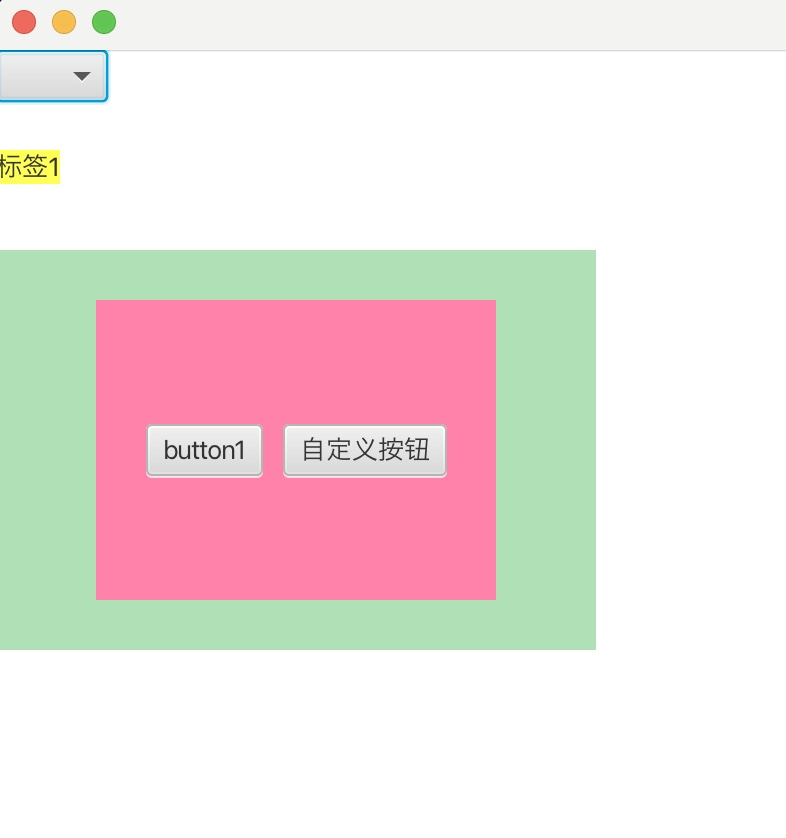
>
>```java
>package org.example;
>
>import javafx.application.Application;
>import javafx.geometry.Pos;
>import javafx.scene.Scene;
>import javafx.scene.control.*;
>import javafx.scene.layout.AnchorPane;
>import javafx.scene.layout.HBox;
>import javafx.stage.Stage;
>import javafx.util.Callback;
>import javafx.util.StringConverter;
>
>public class Launch extends Application {
>    @Override
>    public void init() throws Exception {
>
>    }
>
>    @Override
>    public void stop() throws Exception {
>
>    }
>
>    @Override
>    public void start(Stage stage) throws Exception{
>
>        AnchorPane ap = new AnchorPane();
>        ap.setStyle("-fx-background-color: #ffffff");
>        Label lab1 = new Label();
>        lab1.setText("标签1");
>        lab1.setStyle("-fx-background-color: #ffff55");
>
>        MyListCell<String> myCell = new MyListCell<>();
>        myCell.updateItem("自定义按钮",true);
>        ComboBox<String> cbb = new ComboBox<>();
>        cbb.getItems().addAll("A", "B", "C");
>        cbb.setConverter(new StringConverter<String>() {
>            @Override
>            public String toString(String s) {
>                System.out.println(s);
>                return s;
>            }
>
>            @Override
>            public String fromString(String s) {
>                return null;
>            }
>        });
>        cbb.setCellFactory(new Callback<ListView<String>, ListCell<String>>() {
>            @Override
>            public ListCell<String> call(ListView<String> stringListView) {
>                ListCell<String> listCell = new ListCell<>();
>                stringListView.getItems().forEach(item->listCell.setText(item));
>                return listCell;
>            }
>        });
>
>        AnchorPane.setTopAnchor(lab1,50.0);
>        AnchorPane.setTopAnchor(myCell,100.0);
>        ap.getChildren().addAll(cbb,lab1,myCell);
>        Scene scene = new Scene(ap);
>        stage.setScene(scene);
>        stage.setWidth(500);
>        stage.setHeight(500);
>        stage.show();
>    }
>
>}
>
>class MyListCell<T> extends ListCell<String> {
>    @Override
>    protected void updateItem(String item, boolean empty) {
>        super.updateItem(item, empty);
>        HBox hBox = new HBox(10);
>        hBox.setAlignment(Pos.CENTER);
>        hBox.setMaxWidth(200);
>        hBox.setMaxHeight(150);
>        hBox.setStyle("-fx-background-color: #FF82AB");
>        hBox.getChildren().addAll(new Button("button1"),new Button(item));
>
>        this.setStyle("-fx-background-color: #B0E0B6");
>        this.setPrefWidth(300);
>        this.setPrefHeight(200);
>        this.setAlignment(Pos.CENTER);
>        this.setContentDisplay(ContentDisplay.CENTER);
>        this.setGraphic(hBox);
>    }
>}
>```

### ColorPicker和DatePicker

> 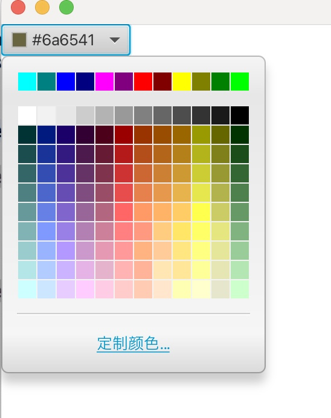
>
> 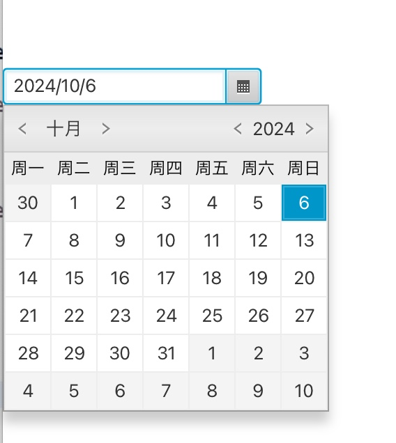
>
> 
>
> ```java
> package org.example;
> 
> import javafx.application.Application;
> import javafx.event.ActionEvent;
> import javafx.event.EventHandler;
> import javafx.scene.Scene;
> import javafx.scene.control.ColorPicker;
> import javafx.scene.control.DatePicker;
> import javafx.scene.layout.AnchorPane;
> import javafx.scene.paint.Color;
> import javafx.stage.Stage;
> 
> import java.time.LocalDate;
> 
> public class Launch extends Application {
>     @Override
>     public void init() throws Exception {
> 
>     }
> 
>     @Override
>     public void stop() throws Exception {
> 
>     }
> 
>     @Override
>     public void start(Stage stage) throws Exception{
> 
>         AnchorPane ap = new AnchorPane();
>         ap.setStyle("-fx-background-color: #ffffff");
>         // 颜色选择器
>         ColorPicker cp = new ColorPicker(Color.valueOf("#ffff55"));
> //        cp.valueProperty().addListener(new ChangeListener<Color>() {
> //            @Override
> //            public void changed(ObservableValue<? extends Color> observableValue, Color oldVal, Color newVal) {
> //                System.out.println(newVal.toString());
> //            }
> //        });
>         cp.setOnAction(new EventHandler<ActionEvent>() {
>             @Override
>             public void handle(ActionEvent event) {
>                 Color c = cp.getValue();
>                 System.out.println(c);
>             }
>         });
>         // 日期选择器
>         DatePicker dp = new DatePicker(LocalDate.now());
>         dp.setOnAction(new EventHandler<ActionEvent>() {
>             @Override
>             public void handle(ActionEvent event) {
>                 LocalDate value = dp.getValue();
>                 System.out.println(value);
>             }
>         });
> 
>         AnchorPane.setTopAnchor(dp,100.0);
>         ap.getChildren().addAll(cp,dp);
>         Scene scene = new Scene(ap);
>         stage.setScene(scene);
>         stage.setWidth(500);
>         stage.setHeight(500);
>         stage.show();
>     }
> }
> ```

### Pagination(分页)

> 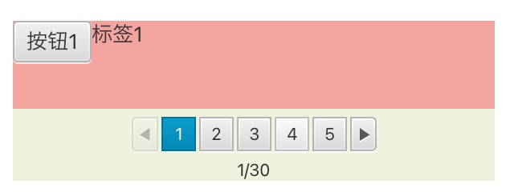
>
> ```java
> package org.example;
> 
> import javafx.application.Application;
> import javafx.beans.value.ChangeListener;
> import javafx.beans.value.ObservableValue;
> import javafx.scene.Node;
> import javafx.scene.Scene;
> import javafx.scene.control.*;
> import javafx.scene.layout.AnchorPane;
> import javafx.scene.layout.HBox;
> import javafx.stage.Stage;
> import javafx.util.Callback;
> 
> public class Launch extends Application {
>     @Override
>     public void init() throws Exception {
> 
>     }
> 
>     @Override
>     public void stop() throws Exception {
> 
>     }
> 
>     @Override
>     public void start(Stage stage) throws Exception{
> 
>         AnchorPane ap = new AnchorPane();
>         ap.setStyle("-fx-background-color: #ffffff");
>         Pagination pg = new Pagination();
>         // 设置总记录条数
>         pg.setPageCount(30);
>         // 设置每页的记录数
>         pg.setMaxPageIndicatorCount(5);
>         // 监听页码改变事件
>         pg.currentPageIndexProperty().addListener(new ChangeListener<Number>() {
>             @Override
>             public void changed(ObservableValue<? extends Number> observableValue, Number oldVal, Number newVal) {
>                 System.out.println(newVal);
>             }
>         });
> 
>         // 设置每一页的显示内容
>         pg.setPageFactory(new Callback<Integer, Node>() {
>             @Override
>             public Node call(Integer pageIndex) {
>                 System.out.println("page = " + pageIndex);
>                 HBox hBox = new HBox();
>                 Button b1 = new Button("按钮" + (pageIndex + 1));
>                 Label lab1 = new Label("标签" + (pageIndex + 1));
>                 hBox.setStyle("-fx-background-color: #F4A49E");
>                 hBox.getChildren().addAll(b1,lab1);
>                 return hBox;
>             }
>         });
> 
>         pg.setLayoutX(100.0);
>         pg.setLayoutY(100.0);
>         pg.setPrefWidth(300);
>         pg.setPrefHeight(100);
>         pg.setStyle("-fx-background-color: #EFF3DE");
>         ap.getChildren().addAll(pg);
>         Scene scene = new Scene(ap);
>         stage.setScene(scene);
>         stage.setWidth(500);
>         stage.setHeight(500);
>         stage.show();
>     }
> 
> }
> ```
>

### Slider（滑动条）

> 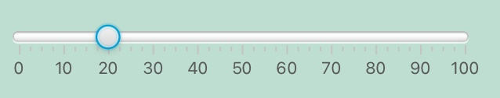
>
> ```java
> package org.example;
> 
> import javafx.application.Application;
> import javafx.beans.value.ChangeListener;
> import javafx.beans.value.ObservableValue;
> import javafx.geometry.Orientation;
> import javafx.scene.Scene;
> import javafx.scene.control.Slider;
> import javafx.scene.layout.AnchorPane;
> import javafx.stage.Stage;
> import javafx.util.StringConverter;
> 
> public class Launch extends Application {
>     @Override
>     public void init() throws Exception {
> 
>     }
> 
>     @Override
>     public void stop() throws Exception {
> 
>     }
> 
>     @Override
>     public void start(Stage stage) throws Exception{
> 
>         AnchorPane ap = new AnchorPane();
>         ap.setStyle("-fx-background-color: #BEDED1");
>         Slider slider = new Slider(0, 100, 50);
>         slider.setPrefWidth(300);
>         // 设置滑动条显示刻度
>         slider.setShowTickMarks(true);
>         // 设置滑动条显示刻度值
>         slider.setShowTickLabels(true);
>         // 设置滑动条刻度每格的大小
>         slider.setMajorTickUnit(10);
>         slider.setValue(20);
>         // 设置滑动条是垂直还是水平显示
>         slider.setOrientation(Orientation.HORIZONTAL);
> 
>         // 这里用来转换滑动条刻度的文本显示
> //        slider.setLabelFormatter(new StringConverter<Double>() {
> //            @Override
> //            public String toString(Double val) {
> //                if(val.doubleValue() == 0){
> //                    return "零";
> //                } else if (val.doubleValue() == 10) {
> //                    return "拾";
> //                } else{
> //                    return "未知";
> //                }
> //
> //            }
> //
> //            @Override
> //            public Double fromString(String s) {
> //                return 0.0;
> //            }
> //        });
> 
>         // 监听滑动条数值改变事件
>         slider.valueProperty().addListener(new ChangeListener<Number>() {
>             @Override
>             public void changed(ObservableValue<? extends Number> observableValue, Number oldVal, Number newVal) {
>                 System.out.println(newVal);
>             }
>         });
> 
>         AnchorPane.setTopAnchor(slider,100.0);
>         AnchorPane.setLeftAnchor(slider,100.0);
>         ap.getChildren().addAll(slider);
>         Scene scene = new Scene(ap);
>         stage.setScene(scene);
>         stage.setWidth(500);
>         stage.setHeight(500);
>         stage.show();
>     }
> }
> ```

### ProgressBar和ProgressIndicator(进度条)

> 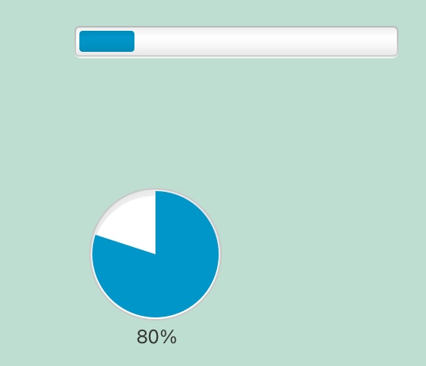
>
> ```java
> package org.example;
> 
> import javafx.application.Application;
> import javafx.concurrent.ScheduledService;
> import javafx.concurrent.Task;
> import javafx.scene.Scene;
> import javafx.scene.control.ProgressBar;
> import javafx.scene.control.ProgressIndicator;
> import javafx.scene.layout.AnchorPane;
> import javafx.stage.Stage;
> import javafx.util.Duration;
> 
> public class Launch extends Application {
> 
>     ScheduledService<Double> service;
> 
>     @Override
>     public void init() throws Exception {
> 
>     }
> 
>     @Override
>     public void stop() throws Exception {
> 
>     }
> 
>     @Override
>     public void start(Stage stage) throws Exception{
> 
>         AnchorPane ap = new AnchorPane();
>         ap.setStyle("-fx-background-color: #BEDED1");
>         ProgressBar pb = new ProgressBar();
>         // 取值0到1，表示0%到100%
>         pb.setProgress(0.5);
>         // 未知进度
> //        pb.setProgress(ProgressBar.INDETERMINATE_PROGRESS);
> 
>         pb.setPrefWidth(200);
>         AnchorPane.setTopAnchor(pb, 100.0);
>         AnchorPane.setLeftAnchor(pb, 100.0);
> 
>         ProgressIndicator pi = new ProgressIndicator();
>         pi.setProgress(0.8);
>         // jdk10以后，setPrefWidth和setPrefHeight会失效
>         pi.setMinSize(100,100);
>         AnchorPane.setTopAnchor(pi, 200.0);
>         AnchorPane.setLeftAnchor(pi, 100.0);
>         ap.getChildren().addAll(pb,pi);
>         Scene scene = new Scene(ap);
>         stage.setScene(scene);
>         stage.setWidth(500);
>         stage.setHeight(500);
>         stage.show();
> 
>         // 按时间跑满进度条功能
>         service = new ScheduledService<>() {
>             Double i = 0.0;
>             @Override
>             protected Task<Double> createTask() {
>                 Task<Double> task = new Task<>() {
>                     @Override
>                     protected Double call() throws Exception {
>                         return i = i + 0.1;
>                     }
> 
>                     @Override
>                     protected void updateValue(Double value) {
>                         pb.setProgress(value);
>                         if(value >= 1){
>                             service.cancel();
>                         }
>                     }
>                 };
>                 return task;
>             }
>         };
> 
>         service.setDelay(Duration.millis(0));
>         service.setPeriod(Duration.millis(1000));
>         service.start();
>     }
> }
> ```

### SplitPane(左右或上下分割框，可拖动)

> 
>
> ```java
> package org.example;
> 
> import javafx.application.Application;
> import javafx.concurrent.ScheduledService;
> import javafx.geometry.Orientation;
> import javafx.scene.Scene;
> import javafx.scene.control.Button;
> import javafx.scene.control.SplitPane;
> import javafx.scene.layout.AnchorPane;
> import javafx.scene.layout.StackPane;
> import javafx.stage.Stage;
> 
> public class Launch extends Application {
> 
>     ScheduledService<Double> service;
> 
>     @Override
>     public void init() throws Exception {
> 
>     }
> 
>     @Override
>     public void stop() throws Exception {
> 
>     }
> 
>     @Override
>     public void start(Stage stage) throws Exception{
> 
>         AnchorPane ap = new AnchorPane();
>         ap.setStyle("-fx-background-color: #BEDED1");
>         Button b1 = new Button("按钮一");
>         Button b2 = new Button("按钮二");
>         Button b3 = new Button("按钮三");
>         Button b4 = new Button("按钮四");
>         SplitPane sp = new SplitPane();
>         sp.setPrefWidth(500);
> 
>         StackPane sp1 = new StackPane();
>         sp1.getChildren().add(b1);
>         StackPane sp2 = new StackPane();
>         sp2.getChildren().add(b2);
>         StackPane sp3 = new StackPane();
>         sp3.getChildren().add(b3);
>         StackPane sp4 = new StackPane();
>         sp4.getChildren().add(b4);
> 
>         //  设置布局方式，为垂直分布
>         // sp.setOrientation(Orientation.VERTICAL);
>         sp.getItems().addAll(sp1, sp2, sp3, sp4);
> 
>         // 设置分割位置
>         sp.setDividerPosition(0,0.25);
>         sp.setDividerPosition(1,0.5);
>         sp.setDividerPosition(2,0.75);
>         sp.setDividerPosition(3,1.0);
> 
>         AnchorPane.setTopAnchor(sp,100.0);
>         ap.getChildren().addAll(sp);
>         Scene scene = new Scene(ap);
>         stage.setScene(scene);
>         stage.setWidth(500);
>         stage.setHeight(500);
>         stage.show();
>     }
> }
> ```

### Spinner

> 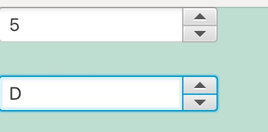
>
> ```java
> package org.example;
> 
> import javafx.application.Application;
> import javafx.collections.FXCollections;
> import javafx.collections.ObservableList;
> import javafx.concurrent.ScheduledService;
> import javafx.scene.Scene;
> import javafx.scene.control.Spinner;
> import javafx.scene.layout.AnchorPane;
> import javafx.stage.Stage;
> 
> public class Launch extends Application {
> 
>     ScheduledService<Double> service;
> 
>     @Override
>     public void init() throws Exception {
> 
>     }
> 
>     @Override
>     public void stop() throws Exception {
> 
>     }
> 
>     @Override
>     public void start(Stage stage) throws Exception{
> 
>         AnchorPane ap = new AnchorPane();
>         ap.setStyle("-fx-background-color: #BEDED1");
>         Spinner<Integer> spr = new Spinner<>(0,10,5);
>         // 最后一个参数2是步进值
>         // Spinner<Integer> spr = new Spinner<>(0,10,5,2);
> 
>         ObservableList<String> list = FXCollections.observableArrayList();
>         list.addAll("A","B","C","D");
>         Spinner<String> spr1 = new Spinner<>(list);
> 
>         AnchorPane.setTopAnchor(spr1,50.0);
>         ap.getChildren().addAll(spr,spr1);
>         Scene scene = new Scene(ap);
>         stage.setScene(scene);
>         stage.setWidth(500);
>         stage.setHeight(500);
>         stage.show();
>     }
> }
> ```

### ScrollBar,ScrollPane,Separator

> 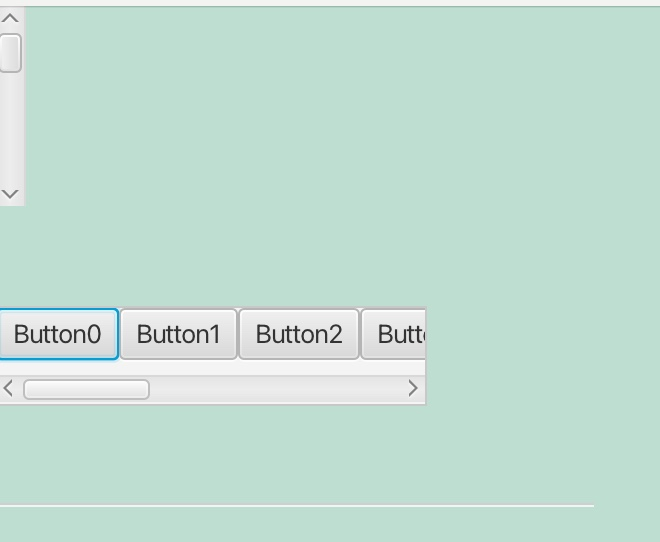
>
> ```java
> package org.example;
> 
> import javafx.application.Application;
> import javafx.concurrent.ScheduledService;
> import javafx.geometry.HPos;
> import javafx.geometry.Orientation;
> import javafx.geometry.VPos;
> import javafx.scene.Scene;
> import javafx.scene.control.Button;
> import javafx.scene.control.ScrollBar;
> import javafx.scene.control.ScrollPane;
> import javafx.scene.control.Separator;
> import javafx.scene.layout.AnchorPane;
> import javafx.scene.layout.HBox;
> import javafx.stage.Stage;
> 
> public class Launch extends Application {
> 
>     ScheduledService<Double> service;
> 
>     @Override
>     public void init() throws Exception {
> 
>     }
> 
>     @Override
>     public void stop() throws Exception {
> 
>     }
> 
>     @Override
>     public void start(Stage stage) throws Exception{
> 
>         AnchorPane ap = new AnchorPane();
>         ap.setStyle("-fx-background-color: #BEDED1");
>         ScrollBar sb = new ScrollBar();
>         sb.setOrientation(Orientation.VERTICAL);
> 
>         ScrollPane sp = new ScrollPane();
>         sp.setPrefViewportWidth(200);
>         sp.setPrefHeight(50);
>         HBox hBox = new HBox();
>         for (int i = 0; i < 10; i++) {
>             hBox.getChildren().add(new Button("Button" + i));
>         }
>         AnchorPane.setTopAnchor(sp,150.0);
>         sp.setContent(hBox);
> 
>         Separator sep = new Separator();
>         sep.setPrefWidth(300);
>         sep.setPrefHeight(100);
>         sep.setHalignment(HPos.CENTER);
>         sep.setValignment(VPos.CENTER);
>         AnchorPane.setTopAnchor(sep,200.0);
> 
>         ap.getChildren().addAll(sb,sp,sep);
>         Scene scene = new Scene(ap);
>         stage.setScene(scene);
>         stage.setWidth(500);
>         stage.setHeight(500);
>         stage.show();
>     }
> }
> ```
>

### 属性的单向绑定和双向绑定

> ```java
> package org.example;
> 
> import javafx.application.Application;
> import javafx.beans.property.SimpleIntegerProperty;
> import javafx.concurrent.ScheduledService;
> import javafx.scene.Scene;
> import javafx.scene.layout.AnchorPane;
> import javafx.stage.Stage;
> 
> public class Launch extends Application {
> 
>     ScheduledService<Double> service;
> 
>     @Override
>     public void init() throws Exception {
> 
>     }
> 
>     @Override
>     public void stop() throws Exception {
> 
>     }
> 
>     @Override
>     public void start(Stage stage) throws Exception{
> 
>         AnchorPane ap = new AnchorPane();
>         ap.setStyle("-fx-background-color: #BEDED1");
>         // 单向绑定
>         SimpleIntegerProperty x = new SimpleIntegerProperty(1);
>         SimpleIntegerProperty y = new SimpleIntegerProperty(5);
>         x.bind(y);
>         System.out.println(y.get());
>         y.set(10);
>         System.out.println(y.get());
>         System.out.println(x.get());
> 
>         // 双向绑定
>         SimpleIntegerProperty a = new SimpleIntegerProperty(3);
>         SimpleIntegerProperty b = new SimpleIntegerProperty(6);
>         a.bindBidirectional(b);
>         a.set(20);
>         System.out.println(a.get());
>         System.out.println(b.get());
>         b.set(30);
>         System.out.println(a.get());
>         System.out.println(b.get());
> 
>         Scene scene = new Scene(ap);
>         stage.setScene(scene);
>         stage.setWidth(500);
>         stage.setHeight(500);
>         stage.show();
>     }
> }
> ```

### fxml

> 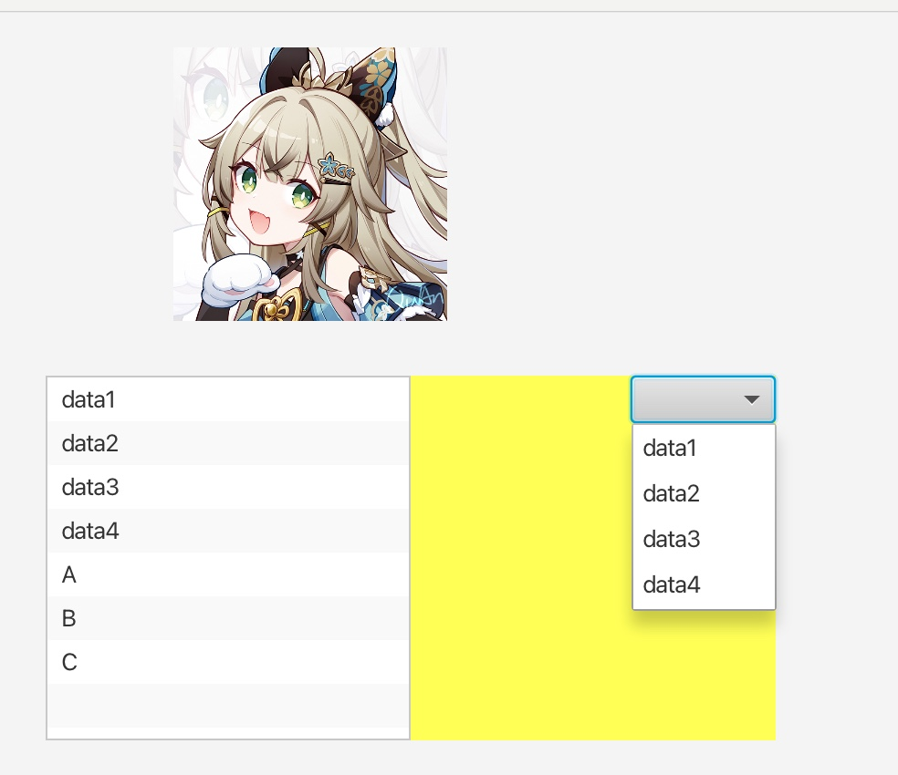
>
> 示例一：
>
> Launch.java
>
> ```java
> package org.example;
> 
> import javafx.application.Application;
> import javafx.fxml.FXMLLoader;
> import javafx.scene.Scene;
> import javafx.scene.layout.AnchorPane;
> import javafx.stage.Stage;
> 
> public class Launch extends Application {
> 
> @Override
> public void init() throws Exception {
> 
> }
> 
> @Override
> public void stop() throws Exception {
> 
> }
> 
> @Override
> public void start(Stage stage) throws Exception{
> 
>   FXMLLoader fx = new FXMLLoader();
>   fx.setLocation(getClass().getResource("/demo.fxml"));
>   AnchorPane root = (AnchorPane) fx.load();
> 
>   DemoController de = fx.getController();
> 
>   Scene scene = new Scene(root);
>   stage.setScene(scene);
>   stage.setWidth(500);
>   stage.setHeight(500);
>   stage.show();
> }
> }
> ```
>
> demo.fxml
>
> ```xml
> <?xml version="1.0" encoding="UTF-8"?>
> 
> <?import java.lang.*?>
> <?import java.util.*?>
> <?import javafx.scene.*?>
> <?import javafx.scene.control.*?>
> <?import javafx.scene.layout.*?>
> <?import javafx.scene.image.ImageView?>
> <?import javafx.scene.image.Image?>
> <?import javafx.collections.FXCollections?>
> 
> <AnchorPane xmlns="http://javafx.com/javafx"
>       xmlns:fx="http://javafx.com/fxml"
>       fx:controller="org.example.DemoController"
>       prefHeight="400.0" prefWidth="600.0">
> <ImageView AnchorPane.topAnchor="20.0" AnchorPane.leftAnchor="100.0" fitWidth="150" fitHeight="150" preserveRatio="true">
>   <Image url="@icon/kirara.jpg"></Image>
> </ImageView>
> <BorderPane style="-fx-background-color: #ffff55" prefWidth="400" prefHeight="200" AnchorPane.leftAnchor="30" AnchorPane.topAnchor="200">
>   <left>
>       <ListView fx:id="listView" prefWidth="200" prefHeight="200">
>           <items>
>               <FXCollections fx:factory="observableArrayList">
>                   <String fx:value="data1"></String>
>                   <String fx:value="data2"></String>
>                   <String fx:value="data3"></String>
>                   <String fx:value="data4"></String>
>               </FXCollections>
>           </items>
>       </ListView>
>   </left>
>   <right>
>       <ComboBox>
>           <items>
>               <FXCollections fx:factory="observableArrayList">
>                   <String fx:value="data1"></String>
>                   <String fx:value="data2"></String>
>                   <String fx:value="data3"></String>
>                   <String fx:value="data4"></String>
>               </FXCollections>
>           </items>
>       </ComboBox>
>   </right>
> </BorderPane>
> </AnchorPane>
> ```
>
> DemoControll.java
>
> ```java
> package org.example;
> 
> import javafx.beans.value.ChangeListener;
> import javafx.beans.value.ObservableValue;
> import javafx.fxml.FXML;
> import javafx.scene.control.ListView;
> 
> public class DemoController {
> 
> @FXML
> public ListView<String> listView;
> 
> public DemoController() {
> 
> }
> 
> @FXML
> public void initialize(){
>   listView.getItems().addAll("A","B","C");
>   listView.getSelectionModel().selectedItemProperty().addListener((new ChangeListener<String>() {
>       @Override
>       public void changed(ObservableValue<? extends String> observableValue, String oldVal, String newVal) {
>           System.out.println(newVal);
>       }
>   }));
> }
> }
> ```
>
> **自定义fxml标签**
>
> ```xml
> <?xml version="1.0" encoding="UTF-8"?>
> 
> <?import java.lang.*?>
> <?import java.util.*?>
> <?import javafx.scene.*?>
> <?import javafx.scene.control.*?>
> <?import javafx.scene.layout.*?>
> 
> <?import org.example.Person?>
> <Person name="宵宫" age="18"></Person>
> ```
>
> Launch.java
>
> ```java
> package org.example;
> 
> import javafx.application.Application;
> import javafx.fxml.FXMLLoader;
> import javafx.scene.Scene;
> import javafx.scene.layout.AnchorPane;
> import javafx.stage.Stage;
> 
> public class Launch extends Application {
> 
>  @Override
>  public void init() throws Exception {
> 
>  }
> 
>  @Override
>  public void stop() throws Exception {
> 
>  }
> 
>  @Override
>  public void start(Stage stage) throws Exception{
> 
>      FXMLLoader fx = new FXMLLoader();
>      fx.setLocation(getClass().getResource("/person.fxml"));
> 
>      fx.setBuilderFactory(new PersonBuilderFactory());
> 
>      Person p = (Person) fx.load();
>      System.out.println(p.getName());
>      System.out.println(p.getAge());
> 
>      AnchorPane ap = new AnchorPane();
>      Scene scene = new Scene(ap);
>      stage.setScene(scene);
>      stage.setWidth(500);
>      stage.setHeight(500);
>      stage.show();
>  }
> }
> ```
>
> Person.java
>
> ```java
> package org.example;
> 
> public class Person {
>  private String name;
>  private int age;
> 
>  public Person() {
>      System.out.println("person constructor");
>  }
> 
>  public Person(String name, int age) {
>      this.name = name;
>      this.age = age;
>  }
> 
>  public int getAge() {
>      return age;
>  }
> 
>  public void setAge(int age) {
>      this.age = age;
>  }
> 
>  public String getName() {
>      return name;
>  }
> 
>  public void setName(String name) {
>      this.name = name;
>  }
> }
> ```
>
> PersonBuilder.java
>
> ```java
> package org.example;
> 
> import javafx.util.Builder;
> 
> public class PersonBuilder implements Builder<Person> {
> 
>  private String name;
>  private int age;
> 
>  public String getName() {
>      return name;
>  }
> 
>  public void setName(String name) {
>      this.name = name;
>  }
> 
>  public int getAge() {
>      return age;
>  }
> 
>  public void setAge(int age) {
>      this.age = age;
>  }
> 
>  @Override
>  public Person build() {
>      return new Person(name,age);
>  }
> }
> ```
>
> PersonBuilderFactory.java
>
> ```java
> package org.example;
> 
> import javafx.fxml.JavaFXBuilderFactory;
> import javafx.util.Builder;
> import javafx.util.BuilderFactory;
> 
> public class PersonBuilderFactory implements BuilderFactory {
> 
>  private final JavaFXBuilderFactory factory = new JavaFXBuilderFactory();
> 
>  @Override
>  public Builder<?> getBuilder(Class<?> type) {
> 
>      if(type == Person.class){
>          return new PersonBuilder();
>      }else {
>          return factory.getBuilder(type);
>      }
>  }
> }
> ```
>
> **常用标签**
>
> demo.fxml
>
> ```xml
> <?xml version="1.0" encoding="UTF-8"?>
> 
> <?import javafx.scene.control.*?>
> <?import javafx.scene.layout.*?>
> <?import javafx.geometry.Insets ?>
> <AnchorPane xmlns="http://javafx.com/javafx"
>             xmlns:fx="http://javafx.com/fxml"
>             fx:controller="org.example.DemoController"
>             prefHeight="400.0" prefWidth="600.0">
> 
>    <fx:define>
>       <ToggleGroup fx:id="group"></ToggleGroup>
>       <Insets fx:id="margin" top="10" left="10" bottom="10" right="10"></Insets>
>       <Button fx:id="btn" text="按钮"></Button>
>    </fx:define>
>    <HBox>
>       <RadioButton text="A" toggleGroup="$group"></RadioButton>
>       <RadioButton text="B" toggleGroup="$group"></RadioButton>
>       <RadioButton text="C" toggleGroup="$group"></RadioButton>
>       <Button text="hello" HBox.margin="$margin"></Button>
>       <Button text="world" HBox.margin="$margin"></Button>
> 
>       <!--这里只能引用一次，否则会报错-->
>       <fx:reference source="btn" HBox.margin="$margin"/>
>       <fx:include source="other.fxml"/>
>    </HBox>
> </AnchorPane>
> ```
>
> other.fxml
>
> ```xml
> <?xml version="1.0" encoding="UTF-8"?>
> 
> <?import javafx.scene.layout.VBox?>
> <?import javafx.scene.control.Label?>
> <?import javafx.scene.control.Button?>
> <VBox>
>     <Label text="宵宫"/>
>     <Label text="优菈"/>
>     <Label text="雷电将军"/>
>     <Button>纳西妲</Button>
>     <Button>雷电将军</Button>
> </VBox>
> ```
>

### css

> 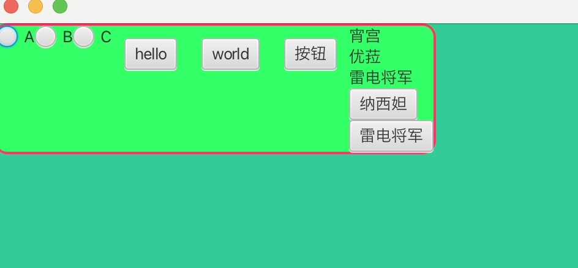
>
> Launch.java
>
> ```java
> package org.example;
> 
> import javafx.application.Application;
> import javafx.fxml.FXMLLoader;
> import javafx.scene.Scene;
> import javafx.scene.layout.AnchorPane;
> import javafx.stage.Stage;
> 
> public class Launch extends Application {
> 
>     @Override
>     public void init() throws Exception {
> 
>     }
> 
>     @Override
>     public void stop() throws Exception {
> 
>     }
> 
>     @Override
>     public void start(Stage stage) throws Exception{
> 
>         FXMLLoader fx = new FXMLLoader();
>         fx.setLocation(getClass().getResource("/demo.fxml"));
>         AnchorPane ap = (AnchorPane) fx.load();
>         Scene scene = new Scene(ap);
>         scene.getStylesheets().add(getClass().getResource("/style.css").toExternalForm());
>         stage.setScene(scene);
>         stage.setWidth(500);
>         stage.setHeight(500);
>         stage.show();
>     }
> }
> ```
>
> demo.fxml
>
> ```xml
> <?xml version="1.0" encoding="UTF-8"?>
> 
> <?import javafx.scene.control.*?>
> <?import javafx.scene.layout.*?>
> <?import javafx.geometry.Insets ?>
> <AnchorPane xmlns="http://javafx.com/javafx"
>             xmlns:fx="http://javafx.com/fxml"
>             fx:controller="org.example.DemoController"
>             fx:id="main"
>             prefHeight="400.0" prefWidth="600.0">
> 
>    <fx:define>
>       <ToggleGroup fx:id="group"></ToggleGroup>
>       <Insets fx:id="margin" top="10" left="10" bottom="10" right="10"></Insets>
>       <Button fx:id="btn" text="按钮"></Button>
>    </fx:define>
>    <HBox fx:id="btn_group">
>       <RadioButton text="A" toggleGroup="$group"></RadioButton>
>       <RadioButton text="B" toggleGroup="$group"></RadioButton>
>       <RadioButton text="C" toggleGroup="$group"></RadioButton>
>       <Button text="hello" HBox.margin="$margin"></Button>
>       <Button text="world" HBox.margin="$margin"></Button>
> 
>       <!--这里只能引用一次，否则会报错-->
>       <fx:reference source="btn" HBox.margin="$margin"/>
>       <fx:include source="other.fxml"/>
>    </HBox>
> </AnchorPane>
> ```
>
> style.css
>
> ```css
> #main{
>     -fx-background-color: #33CC99;
> }
> 
> #btn_group{
>     -fx-background-color: #33FF66;
>     -fx-background-radius: 10;
>     -fx-border-width: 2;
>     -fx-border-color: #FF3366;
>     -fx-border-radius: 10;
> }
> ```
>
> 