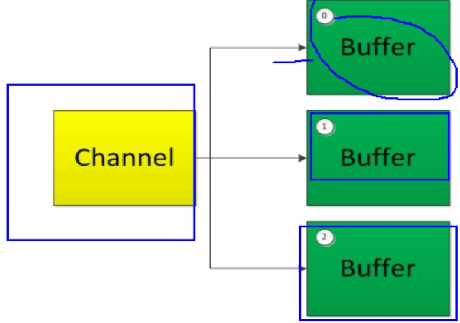
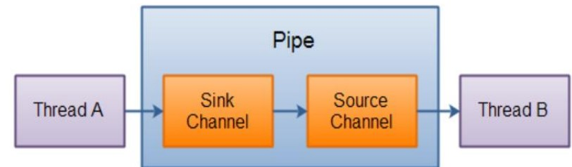

# NIO学习笔记

### Java NIO简介

##### 基本介绍

> Java NIO ( New IO ) 是从Java1.4版本开始引入的一个新的IO API，可以替代标准的Java IO API。NIO与原来的IO有同样的作用和目的，但是使用的方式完全不同，NIO支持面向缓冲区的、基于通道的IO操作。NIO将以更加高效的方式进行文件的读写操作。

##### Java NIO与IO的主要区别

| IO                         | NIO                            |
| -------------------------- | ------------------------------ |
| 面向流 ( Stream Oriented ) | 面向缓冲区 ( Buffer Oriented ) |
| 阻塞IO ( Blocking IO )     | 非阻塞IO ( Non Blocking IO )   |
| （无）                     | 选择器 ( Selectors )           |

##### 通道和缓冲区

> Java NIO 系统的核心在于：通道(Channel)和缓冲区(Buffer)。通道表示打开到IO设备（例如：文件、套接字）的连接。若需要使用NIO系统，需要获取用于连接IO设备的通道以及用于容纳数据的缓冲区。然后操作缓冲区，对数据进行处理。
>
> ==简而言之，Channel负责传输，Buffer负责存储==
>
> **缓冲区**
>
> * 缓冲区（Buffer）：一个用于特定基本数据类型的容器。由java.nio包定义的，所有缓冲区都是Buffer抽象类的子类。
> * Java NIO 中的Buffer主要用于与NIO通道进行交互，数据是从通道读入缓冲区，从缓冲区写入通道中的。
>
> **缓冲区常用方法**
>
> ```java
> package com.nio;
> 
> import org.junit.Test;
> 
> import java.nio.ByteBuffer;
> 
> /**
>  *  一、缓冲区（Buffer）：在Java NIO中负责数据的存取。缓冲区就是数组，用于存储不同数据类型的数据
>  *  根据数据类型不同(boolean除外)，提供了相应类型的缓冲区
>  *  ByteBuffer,CharBuffer,ShortBuffer,IntBuffer,LongBuffer,FloatBuffer,DoubleBuffer
>  *  上述缓冲区的管理方式几乎一致，通过allocate获取缓冲区
>  *
>  *  二、缓冲区存取数据的两个核心方法
>  *  put() : 存入数据到缓冲区中
>  *  get() : 获取缓冲区中的数据
>  *
>  *  三：缓冲区中的四个核心属性
>  *  capacity : 容量，表示缓冲区中最大存储数据的容量，一旦声明不能改变
>  *  limit : 界限，表示缓冲区中可以操作数据的大小。（limit后数据不能进行读写）
>  *  position : 位置，表示缓冲区中正在操作数据的位置
>  *  position <= limit <= capacity
>  *  mark : 标记，表示记录当前position的位置，可以通过reset() 恢复到mark的位置
>  *  0 <= mark <= position <= limit <= capacity
>  */
> public class TestBuffer {
> 
>     @Test
>     public void test1(){
>         String str = "abcde";
>         // 1.分配一个指定大小的缓冲区
>         ByteBuffer buf = ByteBuffer.allocate(1024);
>         System.out.println("-------------------");
>         System.out.println(buf.position());
>         System.out.println(buf.limit());
>         System.out.println(buf.capacity());
>         // 2.利用put存入数据到缓冲区中
>         buf.put(str.getBytes());
>         System.out.println("--------put()-----------");
>         System.out.println(buf.position());
>         System.out.println(buf.limit());
>         System.out.println(buf.capacity());
>         // 3.flip()切换成读取数据模式
>         buf.flip();
>         System.out.println("--------flip()-----------");
>         System.out.println(buf.position());
>         System.out.println(buf.limit());
>         System.out.println(buf.capacity());
>         // 4.利用get() 读取缓冲区中的数据
>         byte[] dst = new byte[buf.limit()];
>         buf.get(dst);
>         System.out.println(new String(dst,0,dst.length));
>         System.out.println("--------get()-----------");
>         System.out.println(buf.position());
>         System.out.println(buf.limit());
>         System.out.println(buf.capacity());
>         // 5.可重复读，即把指针重新指向数据开头
>         buf.rewind();
>         System.out.println("--------rewind()-----------");
>         System.out.println(buf.position());
>         System.out.println(buf.limit());
>         System.out.println(buf.capacity());
>         // 6.clear() : 清空缓冲区，但是缓冲区中的数据依然存在，但是处于“被遗忘”状态，指针指向了缓冲区开头
>         buf.clear();
>         System.out.println("--------clear()-----------");
>         System.out.println(buf.position());
>         System.out.println(buf.limit());
>         System.out.println(buf.capacity());
>         System.out.println((char)buf.get());
>     }
> 
>     @Test
>     public void test2(){
>         String str = "abcde";
>         ByteBuffer buf = ByteBuffer.allocate(1024);
>         buf.put(str.getBytes());
>         buf.flip();
>         byte[] dst = new byte[buf.limit()];
>         buf.get(dst,0,2);
>         System.out.println(new String(dst,0,2));
>         System.out.println(buf.position());
>         // mark() : 标记
>         buf.mark();
>         buf.get(dst,2,2);
>         System.out.println(new String(dst,2,2));
>         System.out.println(buf.position());
>         // reset() : 恢复到mark的位置
>         buf.reset();
>         System.out.println(buf.position());
>         // 判断缓冲区中是否还有剩余数据
>         if(buf.hasRemaining()){
>             // 获取缓冲区中可以操作的数量
>             System.out.println(buf.remaining());
>         }
>     }
> }
> ```

##### 直接缓冲区和非直接缓冲区

> **非直接缓冲区**
>
> 通过allocate()方法分配缓冲区，将缓冲区建立在JVM的内存中
>
> **直接缓冲区**
>
> 通过allocateDirect()方法分配直接缓冲区，将缓冲区建立在物理内存中
>
> * 字节缓冲区要么是直接的，要么是非直接的。如果为直接字节缓冲区，则Java虚拟机会尽最大努力直接在此缓冲区上执行本机I/O操作。也就是说，在每次调用基础操作系统的一个本机I/O操作之前（或之后），虚拟机都会尽量避免将缓冲区的内容复制到中间缓冲区中（或从中间缓冲区中复制内容）
> * 直接字节缓冲区可以通过调用此类的==allocateDirect()==工厂方法来创建。此方法返回的==缓冲区进行分配和取消分配所需成本通常高于非直接缓冲区。==直接缓冲区的内容可以驻留在常规的垃圾回收堆之外，因此，它们对应用程序的内存需求量造成的影响可能并不明显。所以建议将直接缓冲区主要分配给那些易受基础系统的本机I/O操作影响的大型、持久的缓冲区。一般情况下，最好仅在直接缓冲区能在程序性能方面带来明显好处时分配它们。
> * 直接字节缓冲区还可以 通过==FileChannel的map()方法==将文件区域直接映射到内存中创建。该方法返回==MappedByteBuffer==。Java平台的实现有助于通过JNI从本机代码创建直接字节缓冲区。如果以上这些缓冲区中的某个缓冲区实例指的是不可访问的内存区域，则试图访问该区域不会更改该缓冲区的内容，并且将会在访问期间或稍后的某个时间导致抛出不确定的异常。
> * 字节缓冲区是直接缓冲区还是非直接缓冲区可通过调用其==isDirect()==方法来确定。提供此方法是为了能够在性能关键型代码中执行显式缓冲区管理。
>
> ```java
> public void test1(){
>     // 分配直接缓冲区
>     ByteBuffer buf = ByteBuffer.allocateDirect(1024);
>     System.out.println(buf.isDirect());
> }
> ```

##### 通道（Channel）

> **通道的概念**
>
> 通道( Channel )：由java.nio.channels包定义的。Channel表示IO源与目标打开的连接。Channel类似于传统的“流”。只不过Channel本身不能直接访问数据，Channel只能与Buffer进行交互
>
> **分散（Scatter）和聚集（Gather）**
>
> 分散读取（Scattering Reads）是指从Channel中读取的数据“分散”到多个Buffer中
>
> 
>
> 注意：按照缓冲区的顺序，从channel中读取的数据依次将Buffer填满
>
> 聚集写入（Gathering Writes）是指将多个Buffer中的数据“聚集”到Channel
>
> 注意：按照缓冲区的顺序，写入position和limit之间的数据到channel
>
> ```java
> package com.nio;
> import org.junit.Test;
> import java.io.*;
> import java.nio.ByteBuffer;
> import java.nio.CharBuffer;
> import java.nio.MappedByteBuffer;
> import java.nio.channels.FileChannel;
> import java.nio.charset.Charset;
> import java.nio.charset.CharsetDecoder;
> import java.nio.charset.CharsetEncoder;
> import java.nio.file.Paths;
> import java.nio.file.StandardOpenOption;
> /**
>  * 一、通道（ Channel）：用于源节点与目标节点的连接。在Java NIO中负责缓冲区中数据的传输。Channel本身不存储数据，因此需要配合缓冲区进行传输
>  * 二、通道的主要实现类
>  *  java.nio.channels.Channel接口：
>  *      |--FileChannel
>  *      |--SocketChannel
>  *      |--ServerSocketChannel
>  *      |--DatagramChannel
>  *
>  * 三、获取通道
>  *  1.Java针对支持通道的类提供了getChannel()方法
>  *      本地IO：
>  *      FileInputStream/FileOutputStream
>  *      RandomAccessFile
>  *      网络IO:
>  *      Socket
>  *      ServerSocket
>  *      DatagramSocket
>  *  2.在JDK1.7中的NIO.2针对各个通道提供了静态方法open()
>  *  3.在JDK1.7中的NIO.2的Files工具类的newByteChannel()
>  *
>  *  四、通道之间的数据传输
>  *  transferFrom()
>  *  transferTo()
>  *
>  *  五、分散（Scatter）与聚集（Gather）
>  *  分散读取（Scattering Reads）：将通道中的数据分散到多个缓冲区中
>  *  聚集写入（Gathering Writes）：将多个缓冲区中的数据聚集到通道中
>  *
>  *  六、字符集：Charset
>  *  编码：字符串  ->  字节数组
>  *  解码：字节数组 -> 字符串
>  *
>  *
>  */
> public class TestChannel {
>     /**
>      * 利用通道完成文件的复制
>      */
>     @Test
>     public void test1() throws IOException {
> 
>         FileInputStream fis = new FileInputStream("1.jpg");
>         FileOutputStream fos = new FileOutputStream("2.jpg");
>         // 获取通道
>         FileChannel inChannel = fis.getChannel();
>         FileChannel outChannel = fos.getChannel();
>         // 分配指定大小的缓冲区
>         ByteBuffer buf = ByteBuffer.allocate(1024);
>         // 将通道中的数据存入缓冲区
>         while(inChannel.read(buf) != -1){
>             // 切换成读取数据的模式
>             buf.flip();
>             // 将缓冲区中的数据写入通道
>             outChannel.write(buf);
>             // 清空缓冲区
>             buf.clear();
>         }
> 
>         outChannel.close();
>         inChannel.close();
>         fos.close();
>         fis.close();
>     }
> 
>     /**
>      *  使用直接缓冲区完成文件的复制（内存映射文件）
>      */
>     @Test
>     public void test2() throws IOException {
>         FileChannel inChannel = FileChannel.open(Paths.get("1.jpg"),StandardOpenOption.READ);
>         FileChannel outChannel = FileChannel.open(Paths.get("2.jpg"), StandardOpenOption.WRITE, StandardOpenOption.READ,StandardOpenOption.CREATE_NEW);
>         // 内存映射文件
>         MappedByteBuffer inMappedBuf = inChannel.map(FileChannel.MapMode.READ_ONLY, 0, inChannel.size());
>         MappedByteBuffer outMappedBuf = outChannel.map(FileChannel.MapMode.READ_WRITE, 0, inChannel.size());
>         // 直接对缓冲区进行数据的读写操作
>         byte[] dst = new byte[inMappedBuf.limit()];
>         inMappedBuf.get(dst);
>         outMappedBuf.put(dst);
>         inChannel.close();
>         outChannel.close();
>     }
> 
>     /**
>      *  通道之间的数据传输
>      */
>     @Test
>     public void test3() throws IOException {
>         FileChannel inChannel = FileChannel.open(Paths.get("1.jpg"), StandardOpenOption.READ);
>         FileChannel outChannel = FileChannel.open(Paths.get("2.jpg"), StandardOpenOption.WRITE,StandardOpenOption.READ,StandardOpenOption.CREATE_NEW);
>         inChannel.transferTo(0, inChannel.size(), outChannel);
>         // 与上面等价
>         /// outChannel.transferFrom(inChannel, 0, inChannel.size());
>         inChannel.close();
>         outChannel.close();
>     }
> 
>     /**
>      *  分散和聚集
>      */
>     @Test
>     public void test4() throws Exception {
>         RandomAccessFile raf1 = new RandomAccessFile("1.txt", "rw");
>         // 1.获取通道
>         FileChannel channel1 = raf1.getChannel();
>         // 2.分配指定大小的缓冲区
>         ByteBuffer buf1 = ByteBuffer.allocate(100);
>         ByteBuffer buf2 = ByteBuffer.allocate(1024);
>         // 3.分散读取
>         ByteBuffer[] bufs = {buf1,buf2};
>         channel1.read(bufs);
>         for (ByteBuffer buf : bufs) {
>             buf.flip();
>         }
>         System.out.println(new String(bufs[0].array(),0,bufs[0].limit()));
>         System.out.println("-------------------");
>         System.out.println(new String(bufs[1].array(),0,bufs[1].limit()));
> 
>         // 4.聚集写入
>         RandomAccessFile raf2 = new RandomAccessFile("2.txt", "rw");
>         FileChannel channel2 = raf2.getChannel();
>         channel2.write(bufs);
>     }
> 
>     /**
>      *  字符集
>      */
>     @Test
>     public void test5() throws Exception {
>         // 获取编码器
>         Charset cs1 = Charset.forName("GBK");
>         CharsetEncoder ce = cs1.newEncoder();
>         // 获取解码器
>         CharsetDecoder cd = cs1.newDecoder();
>         CharBuffer cBuffer = CharBuffer.allocate(1024);
>         cBuffer.put("山下一群鹅");
>         cBuffer.flip();
>         // 编码
>         ByteBuffer bBuffer = ce.encode(cBuffer);
>         for (int i = 0; i < 10; i++) {
>             System.out.println(bBuffer.get());
>         }
>         // 解码
>         bBuffer.flip();
>         CharBuffer cBuffer2 = cd.decode(bBuffer);
>         System.out.println(cBuffer2.toString());
>     }
> }
> ```

##### NIO的非阻塞式网络通信

> **阻塞与非阻塞**
>
> *  传统的 IO 流都是阻塞式的。也就是说，当一个线程调用 read() 或 write()时，该线程被阻塞，直到有一些数据被读取或写入，该线程在此期间不能执行其他任务。因此，在完成网络通信进行 IO 操作时，由于线程会阻塞，所以服务器端必须为每个客户端都提供一个独立的线程进行处理，当服务器端需要处理大量客户端时，性能急剧下降。
> *  Java NIO 是非阻塞模式的。当线程从某通道进行读写数据时，若没有数据可用时，该线程可以进行其他任务。线程通常将非阻塞 IO 的空闲时间用于在其他通道上执行 IO 操作，所以单独的线程可以管理多个输入
>   和输出通道。因此，NIO 可以让服务器端使用一个或有限几个线程来同时处理连接到服务器端的所有客户端。
>
> **选择器( Selector )**
>
> * 选择器（Selector） 是 SelectableChannle 对象的多路复用器，Selector 可以同时监控多个 SelectableChannel 的 IO 状况，也就是说，利用 Selector可使一个单独的线程管理多个 Channel。Selector 是非阻塞 IO 的核心。
>
> **NIO阻塞式**
>
> ```java
> package com.nio;
> import org.junit.Test;
> import java.io.IOException;
> import java.net.InetSocketAddress;
> import java.nio.ByteBuffer;
> import java.nio.channels.FileChannel;
> import java.nio.channels.ServerSocketChannel;
> import java.nio.channels.SocketChannel;
> import java.nio.file.Paths;
> import java.nio.file.StandardOpenOption;
> 
> public class TestBlockingNIO {
> 
>     @Test
>     public void client() throws IOException {
>         // 1. 获取通道
>         SocketChannel sChannel = SocketChannel.open(new InetSocketAddress("127.0.0.1", 9000));
>         FileChannel inChannel = FileChannel.open(Paths.get("1.jpg"), StandardOpenOption.READ);
>         // 2. 分配指定大小的缓冲区域
>         ByteBuffer buf = ByteBuffer.allocate(1024);
>         // 3.读取本地文件，并发送到服务端
>         while(inChannel.read(buf) != -1){
>             buf.flip();
>             sChannel.write(buf);
>             buf.clear();
>         }
>         // 4.关闭通道
>         inChannel.close();
>         sChannel.close();
>     }
> 
>     @Test
>     public void server() throws IOException {
>         // 1.获取通道
>         ServerSocketChannel ssChannel = ServerSocketChannel.open();
>         FileChannel outChannel = FileChannel.open(Paths.get("3.jpg"), StandardOpenOption.WRITE, StandardOpenOption.CREATE);
>         // 2.绑定连接
>         ssChannel.bind(new InetSocketAddress(9000));
>         // 3.获取客户端连接的通道
>         SocketChannel sChannel = ssChannel.accept();
>         // 4. 分配指定大小的缓冲区
>         ByteBuffer buf = ByteBuffer.allocate(1024);
>         // 5.接收客户端的数据，并保存到本地
>         while(sChannel.read(buf) != -1){
>             buf.flip();
>             outChannel.write(buf);
>             buf.clear();
>         }
>         // 6.关闭对应的通道
>         sChannel.close();
>         outChannel.close();
>         ssChannel.close();
>     }
> }
> ```
>
> ```java
> package com.nio;
> import org.junit.Test;
> import java.io.IOException;
> import java.net.InetSocketAddress;
> import java.nio.ByteBuffer;
> import java.nio.channels.FileChannel;
> import java.nio.channels.ServerSocketChannel;
> import java.nio.channels.SocketChannel;
> import java.nio.file.Paths;
> import java.nio.file.StandardOpenOption;
> 
> public class TestBlockingNIO2 {
> 
>     @Test
>     public void client() throws IOException {
>         SocketChannel sChannel = SocketChannel.open(new InetSocketAddress("127.0.0.1", 9000));
>         FileChannel inChannel = FileChannel.open(Paths.get("1.jpg"), StandardOpenOption.READ);
>         ByteBuffer buf = ByteBuffer.allocate(1024);
>         while(inChannel.read(buf) != -1){
>             buf.flip();
>             sChannel.write(buf);
>             buf.clear();
>         }
>         sChannel.shutdownOutput();
>         // 接收服务端的反馈
>         int len = 0;
>         while((len = sChannel.read(buf)) != -1){
>             buf.flip();
>             System.out.println(new String(buf.array(),0,len));
>             buf.clear();
>         }
>         inChannel.close();
>         sChannel.close();
>     }
> 
>     @Test
>     public void server() throws IOException {
>         ServerSocketChannel ssChannel = ServerSocketChannel.open();
>         FileChannel outChannel = FileChannel.open(Paths.get("2.jpg"), StandardOpenOption.WRITE, StandardOpenOption.CREATE);
>         ssChannel.bind(new InetSocketAddress(9000));
>         SocketChannel sChannel = ssChannel.accept();
>         ByteBuffer buf = ByteBuffer.allocate(1024);
>         while(sChannel.read(buf) != -1){
>             buf.flip();
>             outChannel.write(buf);
>             buf.clear();
>         }
> 
>         // 发送反馈给客户端
>         buf.put("服务端接收数据成功！".getBytes());
>         buf.flip();
>         sChannel.write(buf);
>         sChannel.close();
>         ssChannel.close();
>         outChannel.close();;
>     }
> }
> ```
>
> **NIO非阻塞式**
>
> ```java
> package com.nio;
> import org.junit.Test;
> import java.io.IOException;
> import java.net.InetSocketAddress;
> import java.nio.ByteBuffer;
> import java.nio.channels.*;
> import java.util.Date;
> import java.util.Iterator;
> import java.util.Scanner;
> 
> /**
>  *  一、使用NIO完成网络通信的三个核心：
>  *  1. 通道 ( Channel ) ： 负责连接
>  *      java.nio.channels.Channel接口：
>  *          |--SelectableChannel
>  *              !--SocketChannel
>  *              !--ServerSocketChannel
>  *              |--DatagramChannel
>  *
>  *              |--Pipe.SinkChannel
>  *              !--Pipe.SourceChannel
>  *
>  *  2. 缓冲区 ( Buffer ) ：负责数据的存取
>  *  3. 选择器 ( Selector ) ： 是SelectableChannel的多路复用器。用于监控SelectableChannel的IO状况
>  *
>  */
> public class TestNonBlockingNIO {
> 
>     @Test
>     public void client() throws IOException {
>         // 1. 获取通道
>         SocketChannel sChannel = SocketChannel.open(new InetSocketAddress("127.0.0.1", 9000));
>         // 2. 切换非阻塞模式
>         sChannel.configureBlocking(false);
>         // 3. 分配指定大小的缓冲区
>         ByteBuffer buf = ByteBuffer.allocate(1024);
>         // 4. 发送数据给服务端
>         Scanner scan = new Scanner(System.in);
>         while(scan.hasNext()){
>             String str = scan.next();
>             buf.put((new Date().toString() + "\n" + str).getBytes());
>             buf.flip();
>             sChannel.write(buf);
>             buf.clear();
>         }
> 
>         // 5. 关闭通道
>         sChannel.close();
>     }
> 
>     @Test
>     public void server() throws IOException {
>         // 1. 获取通道
>         ServerSocketChannel ssChannel = ServerSocketChannel.open();
>         // 2. 切换非阻塞模式
>         ssChannel.configureBlocking(false);
>         // 3. 绑定连接
>         ssChannel.bind(new InetSocketAddress(9000));
>         // 4. 获取选择器
>         Selector selector = Selector.open();
>         // 5. 将通道注册到选择器上，并且指定“监听接收事件”
>         ssChannel.register(selector, SelectionKey.OP_ACCEPT);
>         // 6. 轮询式的获取选择器上已经“准备就绪”的事件
>         while(selector.select() > 0){
>             // 7. 获取当前选择器中所有注册的“选择键（已就绪的监听事件）”
>             Iterator<SelectionKey> it = selector.selectedKeys().iterator();
>             while (it.hasNext()){
>                 // 8. 获取准备“就绪”的事件
>                 SelectionKey sk = it.next();
>                 // 9. 判断具体是什么事件准备就绪
>                 if(sk.isAcceptable()){
>                     // 10. 若“接收就绪”获取客户端连接
>                     SocketChannel sChannel = ssChannel.accept();
>                     // 11. 切换非阻塞模式
>                     sChannel.configureBlocking(false);
>                     // 12. 将该通道注册到选择器上
>                     sChannel.register(selector, SelectionKey.OP_READ);
> 
>                 }else if(sk.isReadable()){
>                     // 13. 获取当前选择器上“读就绪”状态的通道
>                     SocketChannel sChannel = (SocketChannel) sk.channel();
>                     // 14. 读取数据
>                     ByteBuffer buf = ByteBuffer.allocate(1024);
>                     int len = 0;
>                     while((len = sChannel.read(buf)) > 0){
>                         buf.flip();
>                         System.out.println(new String(buf.array(),0,len));
>                         buf.clear();
>                     }
>                 }
>                 // 15.取消选择键SelectionKey
>                 it.remove();
>             }
>         }
>     }
> }
> ```
>
> **选择器( Selector )的应用**
>
> * 当调用 register(Selector sel, int ops) 将通道注册选择器时，选择器对通道的监听事件，需要通过第二个参数 ops 指定。
> * 可以监听的事件类型（用 可使用 SelectionKey  的四个常量 表示）
>   * 读 : SelectionKey.OP_READ 
>   * 写 : SelectionKey.OP_WRITE
>   * 连接 : SelectionKey.OP_CONNECT
>   * 接收 : SelectionKey.OP_ACCEPT
> * 若注册时不止监听一个事件，则可以使用“位或”操作符连接  （例如：SelectionKey.OP_READ | SelectionKey.OP_WRITE）
>
> **DatagramChannel**
>
> * Java NIO中的DatagramChannel是一个能收发UDP包的通道
>
> ```java
> package com.nio;
> import org.junit.Test;
> import java.io.IOException;
> import java.net.InetSocketAddress;
> import java.nio.ByteBuffer;
> import java.nio.channels.DatagramChannel;
> import java.nio.channels.SelectionKey;
> import java.nio.channels.Selector;
> import java.util.Date;
> import java.util.Iterator;
> import java.util.Scanner;
> 
> public class TestNonBlockingNIO2 {
> 
>     @Test
>     public void send() throws IOException {
>         DatagramChannel dc = DatagramChannel.open();
>         dc.configureBlocking(false);
>         ByteBuffer buf = ByteBuffer.allocate(1024);
>         Scanner scan = new Scanner(System.in);
>         while(scan.hasNext()){
>             String str = scan.next();
>             buf.put((new Date().toString() + ":\n" + str).getBytes());
>             buf.flip();
>             dc.send(buf, new InetSocketAddress("127.0.0.1",9000));
>             buf.clear();
>         }
> 
>         dc.close();
>     }
> 
>     @Test
>     public void receive() throws IOException {
>         DatagramChannel dc = DatagramChannel.open();
>         dc.configureBlocking(false);
>         dc.bind(new InetSocketAddress(9000));
>         Selector selector = Selector.open();
>         dc.register(selector, SelectionKey.OP_READ);
>         while(selector.select() > 0){
>             Iterator<SelectionKey> it = selector.selectedKeys().iterator();
>             while(it.hasNext()){
>                 SelectionKey sk = it.next();
>                 if(sk.isReadable()){
>                     ByteBuffer buf = ByteBuffer.allocate(1024);
>                     dc.receive(buf);
>                     buf.flip();
>                     System.out.println(new String(buf.array(),0,buf.limit()));
>                     buf.clear();
>                 }
>             }
> 
>             it.remove();;
>         }
>     }
> }
> ```

##### 管道 (Pipe)

> * Java NIO 管道是2个线程之间的单向数据连接。Pipe有一个source通道和一个sink通道。数据会被写到sink通道，从source通道读取。
>
> 
>
> ```java
> package com.nio;
> import org.junit.Test;
> import java.io.IOException;
> import java.nio.ByteBuffer;
> import java.nio.channels.Pipe;
> 
> public class TestPipe {
> 
>     @Test
>     public void test1() throws IOException {
>         // 1.获取管道
>         Pipe pipe = Pipe.open();
>         // 2.将缓冲区中的数据写入管道
>         ByteBuffer buf = ByteBuffer.allocate(1024);
>         Pipe.SinkChannel sinkChannel = pipe.sink();
>         buf.put("通过单向管道发送数据！".getBytes());
>         buf.flip();
>         sinkChannel.write(buf);
>         // 3. 读取缓冲区的数据
>         Pipe.SourceChannel sourceChannel = pipe.source();
>         buf.flip();
>         int len = sourceChannel.read(buf);
>         System.out.println(new String(buf.array(),0,len));
>         sourceChannel.close();
>         sinkChannel.close();
>     }
> }
> ```
>
> 

