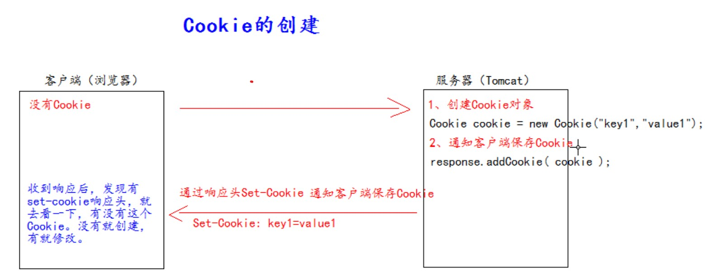
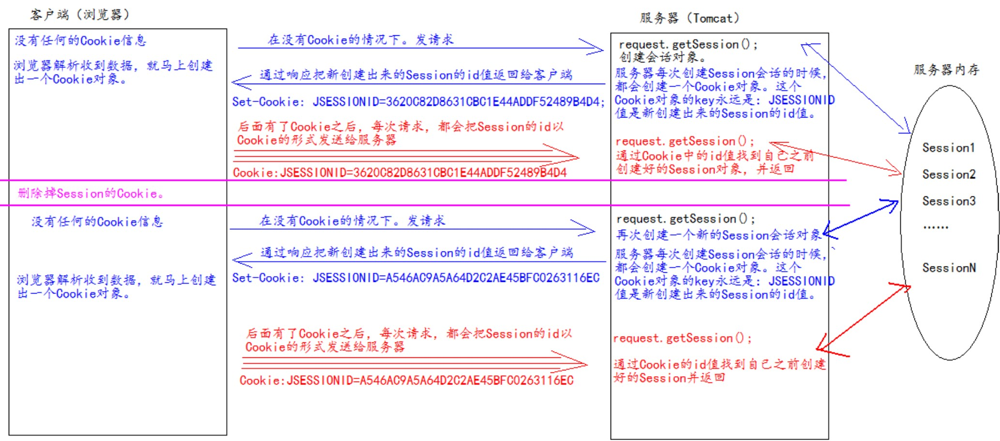
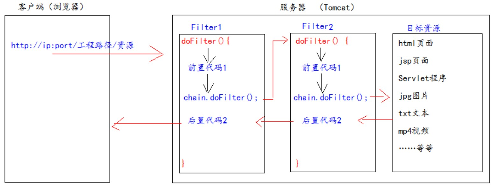
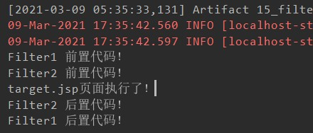

# JavaWeb学习笔记

------

### Servlet

##### HttpServletRequest常用API

> ```java
> package com.atguigu.servlet;
> 
> import javax.servlet.ServletException;
> import javax.servlet.http.HttpServlet;
> import javax.servlet.http.HttpServletRequest;
> import javax.servlet.http.HttpServletResponse;
> import java.io.IOException;
> 
> public class RequestAPIServlet extends HttpServlet {
>     @Override
>     protected void doGet(HttpServletRequest req, HttpServletResponse resp) throws ServletException, IOException {
>         // getRequestURI()  获取请求的资源路径
>         System.out.println("URI => " + req.getRequestURI());
>         // getRequestURL() 获取请求的统一资源定位符（绝对路径）
>         System.out.println("URL => " + req.getRequestURL());
>         // getRemoteHost() 获取客户端的IP地址
>         System.out.println("Host => " + req.getRemoteHost());
>         // getHeader() 获取请求头
>         System.out.println("User-Agent => " + req.getHeader("User-Agent"));
>         // getMethod() 获取请求的方式
>         System.out.println("请求的方式 => " + req.getMethod());
>     }
> }
> ```
>

##### 获取请求参数

> ```java
> package com.atguigu.servlet;
> 
> import javax.servlet.ServletException;
> import javax.servlet.http.HttpServlet;
> import javax.servlet.http.HttpServletRequest;
> import javax.servlet.http.HttpServletResponse;
> import java.io.IOException;
> import java.util.Arrays;
> 
> public class ParameterServlet extends HttpServlet {
>     @Override
>     protected void doGet(HttpServletRequest req, HttpServletResponse resp) throws ServletException, IOException {
>         // 获取请求的参数
>         String username = req.getParameter("username");
>         String password = req.getParameter("password");
>         String[] hobbies = req.getParameterValues("hobby");
>         System.out.println("username: " + username);
>         System.out.println("password: " + password);
>         System.out.println("hobby: " + Arrays.toString(hobbies));
>     }
> 
>     @Override
>     protected void doPost(HttpServletRequest req, HttpServletResponse resp) throws ServletException, IOException {
>         // 获取请求的参数
>         // 设置请求体的字符集为UTF-8，从而解决POST请求的中文乱码问题
>         req.setCharacterEncoding("UTF-8");
>         String username = req.getParameter("username");
>         String password = req.getParameter("password");
>         String[] hobbies = req.getParameterValues("hobby");
>         System.out.println("username: " + username);
>         System.out.println("password: " + password);
>         System.out.println("hobby: " + Arrays.toString(hobbies));
>     }
> }
> ```
>
> web.xml配置
>
> ```xml
> <?xml version="1.0" encoding="UTF-8"?>
> <web-app xmlns="http://xmlns.jcp.org/xml/ns/javaee"
>          xmlns:xsi="http://www.w3.org/2001/XMLSchema-instance"
>          xsi:schemaLocation="http://xmlns.jcp.org/xml/ns/javaee http://xmlns.jcp.org/xml/ns/javaee/web-app_4_0.xsd"
>          version="4.0">
>     <servlet>
>         <servlet-name>RequestAPIServlet</servlet-name>
>         <servlet-class>com.atguigu.servlet.RequestAPIServlet</servlet-class>
>     </servlet>
>     <servlet-mapping>
>         <servlet-name>RequestAPIServlet</servlet-name>
>         <url-pattern>/request1</url-pattern>
>     </servlet-mapping>
>     <servlet>
>         <servlet-name>ParameterServlet</servlet-name>
>         <servlet-class>com.atguigu.servlet.ParameterServlet</servlet-class>
>     </servlet>
>     <servlet-mapping>
>         <servlet-name>ParameterServlet</servlet-name>
>         <url-pattern>/param</url-pattern>
>     </servlet-mapping>
> </web-app>
> ```

##### 请求转发

> 请求转发是指服务器收到请求后，从一个资源跳转到另一个资源的操作叫做请求转发
>
> 请求转发的特点
>
> 1. 浏览器地址栏没有变化
> 2. 他们是一次请求
> 3. 他们共享Request域中的数据
> 4. 可以转发到WEB-INF目录下
>
> ```java
> package com.atguigu.servlet;
> 
> import javax.servlet.RequestDispatcher;
> import javax.servlet.ServletException;
> import javax.servlet.http.HttpServlet;
> import javax.servlet.http.HttpServletRequest;
> import javax.servlet.http.HttpServletResponse;
> import java.io.IOException;
> 
> public class Servlet1 extends HttpServlet {
>     protected void doPost(HttpServletRequest request, HttpServletResponse response) throws ServletException, IOException {
> 
>     }
> 
>     protected void doGet(HttpServletRequest request, HttpServletResponse response) throws ServletException, IOException {
>         // 获取请求的参数
>         String username = request.getParameter("username");
>         System.out.println("servlet1 查看参数 username : " + username);
>         // 设置已处理过的标记
>         request.setAttribute("isHandled",true);
>         // 转发请求
>         RequestDispatcher requestDispatcher = request.getRequestDispatcher("/servlet2");
>         requestDispatcher.forward(request,response);
>     }
> }
> ```
>
> ```java
> package com.atguigu.servlet;
> 
> import javax.servlet.ServletException;
> import javax.servlet.http.HttpServlet;
> import javax.servlet.http.HttpServletRequest;
> import javax.servlet.http.HttpServletResponse;
> import java.io.IOException;
> 
> public class Servlet2 extends HttpServlet {
>     protected void doPost(HttpServletRequest request, HttpServletResponse response) throws ServletException, IOException {
> 
>     }
> 
>     protected void doGet(HttpServletRequest request, HttpServletResponse response) throws ServletException, IOException {
>         String username = request.getParameter("username");
>         System.out.println("servlet2中查看 username : " + username);
>         // 查看servlet1是否处理过
>         Object isHandled = request.getAttribute("isHandled");
>         System.out.println("处理标记：" + isHandled);
>         System.out.println("servlet2处理业务！");
>     }
> }
> ```
>
> ```xml
> <?xml version="1.0" encoding="UTF-8"?>
> <web-app xmlns="http://xmlns.jcp.org/xml/ns/javaee"
>          xmlns:xsi="http://www.w3.org/2001/XMLSchema-instance"
>          xsi:schemaLocation="http://xmlns.jcp.org/xml/ns/javaee http://xmlns.jcp.org/xml/ns/javaee/web-app_4_0.xsd"
>          version="4.0">
>     <servlet>
>         <servlet-name>Servlet1</servlet-name>
>         <servlet-class>com.atguigu.servlet.Servlet1</servlet-class>
>     </servlet>
>     <servlet-mapping>
>         <servlet-name>Servlet1</servlet-name>
>         <url-pattern>/servlet1</url-pattern>
>     </servlet-mapping>
>     <servlet>
>         <servlet-name>Servlet2</servlet-name>
>         <servlet-class>com.atguigu.servlet.Servlet2</servlet-class>
>     </servlet>
>     <servlet-mapping>
>         <servlet-name>Servlet2</servlet-name>
>         <url-pattern>/servlet2</url-pattern>
>     </servlet-mapping>
> </web-app>
> ```

##### HttpServletResponse类

> HttpServletResponse类和HttpServletRequest类一样。每次请求进来，Tomcat服务器都会创建一个Response对象传递给Servlet程序去使用。HttpServletRequest表示请求过来的信息，HttpServletResponse表示所有响应的信息，我们如果需要设置返回给客户端的信息，都可以通过HttpServletResponse对象来设置。
>
> ```java
> package com.atguigu.servlet;
> 
> import javax.servlet.ServletException;
> import javax.servlet.http.HttpServlet;
> import javax.servlet.http.HttpServletRequest;
> import javax.servlet.http.HttpServletResponse;
> import java.io.IOException;
> import java.io.PrintWriter;
> 
> public class ResponseIOServlet extends HttpServlet {
>     @Override
>     protected void doGet(HttpServletRequest req, HttpServletResponse resp) throws ServletException, IOException {
>         // 解决响应中文乱码问题（第一种方法）
> //        resp.setCharacterEncoding("UTF-8");
> //        resp.setHeader("Content-Type","text/html;charset=UTF-8");
>         System.out.println(resp.getCharacterEncoding());
> 
>         // 第二种方法
>         // 它会同时设置服务器和客户端都使用UTF-8字符集，还设置了响应头
>         // 此方法一定要在获取流对象之前调用才有效
>         resp.setContentType("text/html;charset=UTF-8");
>         System.out.println(resp.getCharacterEncoding());
>         PrintWriter writer = resp.getWriter();
>         writer.write("你好世界");
>     }
> }
> ```

##### 请求重定向

> 请求重定向的特点：
>
> 1. 浏览器地址栏会发生变化
> 2. 两次请求
> 3. 不共享Request域中数据
> 4. 不能访问WEB-INF下的资源
> 5. 可以访问工程外的资源
>
> ```java
> package com.atguigu.servlet;
> 
> import javax.servlet.ServletException;
> import javax.servlet.http.HttpServlet;
> import javax.servlet.http.HttpServletRequest;
> import javax.servlet.http.HttpServletResponse;
> import java.io.IOException;
> 
> public class Response1 extends HttpServlet {
>     @Override
>     protected void doGet(HttpServletRequest req, HttpServletResponse resp) throws ServletException, IOException {
>         System.out.println("曾到此一游！");
>         // 设置响应状态码302，表示重定向
>         // 第一种方式
> //        resp.setStatus(302);
> //        resp.setHeader("Location","http://localhost:8080/resp2");
>         // 第二种方式
>         resp.sendRedirect("http://localhost:8080/resp2");
>     }
> }
> ```
>
> ```java
> package com.atguigu.servlet;
> 
> import javax.servlet.ServletException;
> import javax.servlet.http.HttpServlet;
> import javax.servlet.http.HttpServletRequest;
> import javax.servlet.http.HttpServletResponse;
> import java.io.IOException;
> 
> public class Response2 extends HttpServlet {
>     @Override
>     protected void doGet(HttpServletRequest req, HttpServletResponse resp) throws ServletException, IOException {
>         resp.getWriter().write("response2's result");
>     }
> }
> ```
>
> ```xml
> <?xml version="1.0" encoding="UTF-8"?>
> <web-app xmlns="http://xmlns.jcp.org/xml/ns/javaee"
>          xmlns:xsi="http://www.w3.org/2001/XMLSchema-instance"
>          xsi:schemaLocation="http://xmlns.jcp.org/xml/ns/javaee http://xmlns.jcp.org/xml/ns/javaee/web-app_4_0.xsd"
>          version="4.0">
>     <servlet>
>         <servlet-name>Response1</servlet-name>
>         <servlet-class>com.atguigu.servlet.Response1</servlet-class>
>     </servlet>
>     <servlet-mapping>
>         <servlet-name>Response1</servlet-name>
>         <url-pattern>/resp1</url-pattern>
>     </servlet-mapping>
>     <servlet>
>         <servlet-name>Response2</servlet-name>
>         <servlet-class>com.atguigu.servlet.Response2</servlet-class>
>     </servlet>
>     <servlet-mapping>
>         <servlet-name>Response2</servlet-name>
>         <url-pattern>/resp2</url-pattern>
>     </servlet-mapping>
> </web-app>
> ```

### JSP

##### 什么是JSP

> jsp的全称是java server pages，即java的服务器页面。jsp的主要作用是代替Servlet程序回传html页面的数据。因为Servlet程序回传html页面数据是一件非常繁琐的事情，开发成本和维护成本都极高。JSP的本质就是一个Servlet程序。

##### jsp的page指令

> ```jsp
> <%@ page import="java.util.*" %>
> <%@ page contentType="text/html;charset=UTF-8"
>          pageEncoding="utf-8"
>          autoFlush="true"
>          buffer="8kb"
>          errorPage="/error.jsp"
>          isErrorPage="false"
>          extends="javax.servlet.HttpServlet"
>          language="java" %>
> ```
>
> - language属性	表示jsp翻译后是什么语言文件，暂时只支持java
> - contentType属性    表示jsp返回的数据类型，也是源码中response.setContentType()中的参数值
> - pageEncoding属性    表示当前jsp页面文件本身的字符集
> - import属性    跟java源代码中一样，用于导包导类
> - autoFlush属性    设置当out输出流缓冲区满了之后，是否自动刷新缓冲区，默认值是true
> - buffer属性    设置out缓冲区的大小，默认是8kb
> - errorPage属性    设置当jsp页面运行出错，自动跳转的错误页面
> - isErrorPage属性    设置当前jsp页面是否是错误信息页面，默认是false，如果是true可以获取异常信息
> - session属性    设置访问当前jsp页面是否会创建HttpSession对象，默认是true，一般不推荐改
> - extends属性    设置jsp翻译出来的java类默认继承谁，一般不推荐改

##### 声明脚本（极少使用）

> 声明的脚本格式是：<%! 声明java代码 %>
>
> 作用：可以给jsp翻译出来的java类，定义属性和方法甚至是静态代码块，内部类等。
>
> ```jsp
> <%--声明类属性--%>
> <%!
>     private Integer id;
>     private String name;
>     private static Map<String,Object> map;
> %>
> <%--声明static静态代码块--%>
> <%!
>     static {
>         map = new HashMap<String,Object>();
>         map.put("key1","value1");
>         map.put("key2","value2");
>     }
> %>
> <%--声明类方法--%>
> <%!
>     public int add (int a,int b){
>         return a + b;
>     }
> %>
> <%--声明内部类--%>
> <%!
>     public static class A {
>         private Integer id;
>         private String abc;
>     }
> %>
> ```

##### 表达式脚本（常用）

> 表达式脚本的格式是：<%=表达式%>
>
> 表达式脚本的作用是：在jsp页面上输出数据
>
> 表达式脚本的特点：
>
> 1. 所有的表达式脚本都会被翻译到 _jspService()方法中
> 2. 表达式脚本都会被翻译成为out.print()输出到页面上
> 3. 由于表达式脚本翻译的内容都在 _jspService()方法中，所以 _jspService()方法中的对象都可以直接使用
> 4. 表达式脚本中的表达式不能以分号结束
>
> ```jsp
> <%-- 1.输出整型
>  2.输出浮点型
>  3.输出字符串
>  4.输出对象--%>
>  <%!
>     private Integer id;
>     private String name;
>     private static Map<String,Object> map;
>  %>
>  <%!
>     static {
>         map = new HashMap<String,Object>();
>         map.put("key1","value1");
>         map.put("key2","value2");
>     }
>  %>
>  <%=12 %> <br>
>  <%=12.12 %> <br>
>  <%="我是字符串" %> <br>
>  <%=map %> <br>
>  <%=request.getParameter("username") %>
> ```

##### 代码脚本

> 代码脚本的格式是：<%   java语句   %>
>
> 代码脚本的作用是：可以在jsp页面中，编写我们自己需要的功能
>
> 代码脚本的特点：
>
> 1. 代码脚本翻译之后，都在 _jspService()方法中
> 2. 代码脚本由于翻译到 _jspService()方法中，所以在 _jspService()方法中的现有对象都可以直接使用
> 3. 还可以由多个代码脚本块组合完成一个完整的java语句
> 4. 代码脚本还可以和表达式脚本一起组合使用，在jsp页面上输出数据
>
> ```jsp
> <%--1.代码脚本，  if语句--%>
> <%
>     int i = 13;
>     if (i == 12) {
>         System.out.println("你好，世界！！！");
>     } else {
>         System.out.println("大家好！！！");
>     }
> %>
> <%--2.代码脚本， for循环语句--%>
> <%
>     for (int j = 0; j < 10; j++) {
>         System.out.println(j);
>     }
> %>
> <%--3.翻译后java文件中_jspService()方法内的代码都可以写--%>
> <%
>     String username = request.getParameter("username");
>     System.out.println("用户名的请求参数值是：" + username);
> %>
> 
> <%
>     for (int j = 0; j < 10; j++) {
> %>
> 
> <%=j %>
> 
> <%
>     }
> %>
> ```

##### JSP中的三种注释

> 1. html注释 （html注释会被翻译到java源代码中，在_jspService()方法里，以out.write输出到客户端）
> 2. java注释（java注释会被翻译到java源代码中）
> 3. jsp注释（jsp注释可以注掉jsp页面中所有代码，不会翻译到java源代码中）
>
> ```jsp
> <!--这是html注释-->
> <%
>     // 单行java注释
>     /*
>         多行java注释
>         多行java注释
>     */
> %>
> <%--这是jsp注释--%>
> ```

##### JSP内置对象

> jsp中的内置对象，是指Tomcat在翻译jsp页面成为Servlet源码后，内部提供的对象，叫内置对象
>
> 1. request 	请求对象
> 2. response    响应对象
> 3. pageContext    jsp的上下文对象
> 4. session    会话对象
> 5. application    ServletContext对象
> 6. config    ServletConfig对象
> 7. out    jsp输出流对象
> 8. page    指向当前jsp的对象
> 9. exception    异常对象（需要设置isErrorPage="true"）
>
> **jsp四大域对象**
>
> 四个域对象分别是：
>
> 1. pageContext(PageContextImpl类)  当前jsp页面范围内有效
>
> 2. request(HttpServletRequest类)  一次请求内有效
>
> 3. session(HttpSession类)  一个会话范围内有效
>
> 4. application(ServletContext类)  整个web工程范围内都有效，只要web工程不停止，数据都在
>
> 域对象是可以像Map一样存取数据的对象，四个域对象功能一样，不同的是它们对数据的存取范围
>
> 虽然四个域对象都可以存取数据，在使用上它们是有优先顺序的，四个域在使用时，优先顺序分别是它们从小到大的范围的顺序
>
> pageContext  ----->  request -----> session -----> application
>
> **jsp中out输出和response.getWriter输出的区别**
>
> response中表示响应，我们经常设置返回给客户端的内容（输出）
>
> out也是给用户做输出使用的
>
> 当jsp页面中的所有代码执行完成后会做以下两个操作：
>
> 1. 执行out.flush()操作，会把out缓冲区中的数据追加写入到response缓冲区末尾
> 2. 执行response的刷新操作，把全部数据写给客户端

##### JSP常用标签

> **jsp静态包含**
>
> ```jsp
> <%--静态包含--%>
> 头部信息 <br>
> 主题内容 <br>
> <%@ include file="/include/footer.jsp"%>
> ```
>
> 静态包含的特点：
>
> 1. 静态包含不会翻译被包含的页面
> 2. 静态包含其实是把被包含的jsp页面的代码拷贝到包含的位置执行输出
>
> **jsp动态包含**
>
> ```jsp
> <%--动态包含--%>
> 头部信息 <br>
> 主题内容 <br>
> <jsp:include page="/include/footer.jsp">
>     <jsp:param name="username" value="bbj"></jsp:param>
>     <jsp:param name="password" value="root"></jsp:param>
> </jsp:include>
> ```
>
> 动态包含的特点：
>
> 1. 动态包含会把包含的jsp页面也翻译成为java代码
> 2. 动态包含底层使用如下代码去调用被包含的jsp页面执行输出：org.apache.jasper.runtime.JspRuntimeLibrary.include(request, response, "/include/footer.jsp", out, false);
> 3. 动态包含还可以传递参数
>
> **jsp请求转发**
>
> ```jsp
> <jsp:forward page="footer.jsp"></jsp:forward>
> ```

##### Listener监听器

> 什么是Listener监听器？
>
> 1. Listener监听器它是JavaWeb的三大组件之一，JavaWeb的三大组件分别是：Servlet程序、Filter过滤器、Listener监听器
> 2. Listener是JavaEE的规范，就是接口
> 3. 监听器的作用是：监听某种事物的变化，然后通过回调函数，反馈给客户(程序)去做一些相应的处理
>
> **ServletContextListener监听器**
>
> 特点：
>
> 1. ServletContextListener它可以监听ServletContext对象的创建和销毁
> 2. ServletContext对象在web工程启动的时候创建，在web工程停止的时候销毁
> 3. 监听到创建和销毁之后，都会分别调用ServletContextListener监听器的方法反馈
>
> ```java
> package com.atguigu.listener;
> 
> import javax.servlet.ServletContextEvent;
> import javax.servlet.ServletContextListener;
> 
> public class MyServletContextListenerImpl implements ServletContextListener {
>     @Override
>     public void contextInitialized(ServletContextEvent servletContextEvent) {
>         System.out.println("ServletContext对象被创建");
>     }
> 
>     @Override
>     public void contextDestroyed(ServletContextEvent servletContextEvent) {
>         System.out.println("ServletContext对象被销毁");
>     }
> }
> ```
>
> ```xml
> <?xml version="1.0" encoding="UTF-8"?>
> <web-app xmlns="http://xmlns.jcp.org/xml/ns/javaee"
>          xmlns:xsi="http://www.w3.org/2001/XMLSchema-instance"
>          xsi:schemaLocation="http://xmlns.jcp.org/xml/ns/javaee http://xmlns.jcp.org/xml/ns/javaee/web-app_4_0.xsd"
>          version="4.0">
>     <!--配置监听器-->
>     <listener>
>         <listener-class>com.atguigu.listener.MyServletContextListenerImpl</listener-class>
>     </listener>
> </web-app>
> ```

##### EL表达式

> **什么是EL表达式，EL表达式的作用**
>
> - EL表达式的全称是：Expression Language ，是表达式语言
> - EL表达式的作用：EL表达式主要是代替jsp页面中的表达式脚本在jsp页面中进行数据的输出
>
> **EL表达式搜索域数据的顺序**
>
> EL表达式主要是在jsp页面中输出数据，主要是输出域对象中的数据
>
> 当四个域中都有相同的key的数据的时候，EL表达式会按照四个域的从小到大的顺序去进行搜索，找到就输出pageContext -----> request -----> session -----> application
>
> **EL表达式输出复杂的Bean对象**
>
> EL表达式输出复杂bean对象的属性，实际上是调用的对应属性的get方法，例如：p.age 实际上调用的是p.getAge()
>
> Person.java
>
> ```java
> package com.atguigu.pojo;
> 
> import java.util.Arrays;
> import java.util.List;
> import java.util.Map;
> 
> public class Person {
>     private String name;
>     private String[] phones;
>     private List<String> cities;
>     private Map<String,Object> map;
> 
>     public Person() {
>     }
> 
>     public Person(String name, String[] phones, List<String> cities, Map<String, Object> map) {
>         this.name = name;
>         this.phones = phones;
>         this.cities = cities;
>         this.map = map;
>     }
> 
>     public String getName() {
>         return name;
>     }
> 
>     public void setName(String name) {
>         this.name = name;
>     }
> 
>     public String[] getPhones() {
>         return phones;
>     }
> 
>     public void setPhones(String[] phones) {
>         this.phones = phones;
>     }
> 
>     public List<String> getCities() {
>         return cities;
>     }
> 
>     public void setCities(List<String> cities) {
>         this.cities = cities;
>     }
> 
>     public Map<String, Object> getMap() {
>         return map;
>     }
> 
>     public void setMap(Map<String, Object> map) {
>         this.map = map;
>     }
> 
>     @Override
>     public String toString() {
>         return "Person{" +
>                 "name=" + name +
>                 ", phones=" + Arrays.toString(phones) +
>                 ", cities=" + cities +
>                 ", map=" + map +
>                 '}';
>     }
> }
> ```
>
> a.jsp
>
> ```jsp
> <%@ page import="com.atguigu.pojo.Person" %>
> <%@ page import="java.util.List" %>
> <%@ page import="java.util.ArrayList" %>
> <%@ page import="java.util.Map" %>
> <%@ page import="java.util.HashMap" %>
> <%@ page contentType="text/html;charset=UTF-8" language="java" %>
> <html>
> <head>
>     <title>Title</title>
> </head>
> <body>
>     <%
>         Person person = new Person();
>         person.setName("宁毅");
>         person.setPhones(new String[]{"18610401223","18688886666","18699998888"});
>         List<String> cities = new ArrayList<>();
>         cities.add("北京");
>         cities.add("上海");
>         cities.add("深圳");
>         person.setCities(cities);
>         Map<String,Object> map = new HashMap<String, Object>();
>         map.put("key1","value1");
>         map.put("key2","value2");
>         map.put("key3","value3");
>         person.setMap(map);
>         pageContext.setAttribute("p",person);
>     %>
>     输出Person：${ p } <br>
>     输出Person的name属性：${ p.name } <br>
>     输出Person的phones数组属性：${ p.phones[0] } <br>
>     输出Person的cities集合中的元素值：${ p.cities[1] } <br>
>     输出Person的map集合属性：${ p.map.key2 } <br>
> </body>
> </html>
> ```
> 
> **关系运算**
> 
> EL表达式支持如下运算符：
> 
> | 关系运算符 | 说明     | 范例                           | 结果  |
>| ---------- | -------- | ------------------------------ | ----- |
> | == 或 eq   | 等于     | `${ 5 == 5 } 或 ${ 5 eq 5}`    | true  |
>| != 或 ne   | 不等于   | `${ 5 != 5} 或 ${ 5 ne 5}`     | false |
> | < 或 lt    | 小于     | `${ 3 < 5 } 或 ${ 3 lt 5}`     | true  |
>| > 或 gt    | 大于     | `${ 2 > 10 } 或 ${ 2 gt 10 }`  | false |
> | <= 或 le   | 小于等于 | `${ 5 <= 12 } 或 ${ 5 le 12 }` | true  |
> | >= 或 ge   | 大于等于 | `${ 3 >= 5} 或 ${ 3 ge 5}`     | false |
> 
> **逻辑运算**
> 
> | 逻辑运算符 | 说明     | 范例                                                    | 结果  |
> | ---------- | -------- | ------------------------------------------------------- | ----- |
> | && 或 and  | 与运算   | `${ 12 == 12 && 12 < 11 } 或 ${ 12 == 12 and 12 < 11 }` | false |
>| \|\| 或 or | 或运算   | `${ 12 == 12 || 12 < 11 } 或 ${ 12 == 12 or 12 < 11 }`  | true  |
> | ! 或 not   | 取反运算 | `${ !true } 或 ${ not true }`                           | false |
>
> **算术运算**
> 
> | 算术运算符 | 说明 | 范例                               | 结果 |
> | ---------- | ---- | ---------------------------------- | ---- |
> | +          | 加法 | ${ 12 + 18 }                       | 30   |
>| _          | 减法 | ${ 18 - 8 }                        | 10   |
> | *          | 乘法 | ${ 11 * 11 }                       | 121  |
>| / 或 div   | 除法 | `${ 121 / 11 } 或 ${ 121 div 11 }` | 11   |
> | % 或 mod   | 取余 | `${ 144 % 10 } 或 ${ 144 mod 10 }` | 4    |
> 
> **empty运算**
> 
> empty运算可以判断一个数据是否为空，如果为空，则输出true，反之输出false
> 
> 以下几种情况为空：
>
> 1. 值为null值的时候，为空
>2. 值为空字符串的时候，为空
> 3. 值是Object类型数组，长度为零的时候
>4. list集合，元素个数为零
> 5. map集合，元素个数为零
>
> ```jsp
> <%
> List list = new ArrayList();
> request.setAttribute("key",list);
> %>
>${ empty key }
> ```
> 
> **三元运算**
> 
> 表达式1  ?   表达式2   :    表达式3
> 
> 如果表达式1的值为真，返回表达式2的值，否则返回表达式3的值
>
> **点运算和中括号运算**
>
> - . 点运算，可以输出Bean对象中某个属性的值
>- []中括号运算，可以输出有序集合中某个元素的值
> - 并且[]中括号运算，还可以输出map集合中key里含有特殊字符的key的值
>
> **EL表达式的11个隐含对象**
>
> EL表达式中11个隐含对象，是EL表达式中自己定义的，可以直接使用
> 
> | 变量             | 类型                 | 作用                                               |
>| ---------------- | -------------------- | -------------------------------------------------- |
> | pageContext      | PageContextImpl      | 可以获取jsp中的九大内置对象                        |
>| pageScope        | Map<String,Object>   | 可以获取pageContext域中的数据                      |
> | requestScope     | Map<String,Object>   | 可以获取Request域中的数据                          |
>| sessionScope     | Map<String,Object>   | 可以获取Session域中的数据                          |
> | applicationScope | Map<String,Object>   | 可以获取ServletContext域中的数据                   |
> | param            | Map<String,String>   | 可以获取请求参数的值                               |
> | paramValues      | Map<String,String[]> | 也可以获取请求参数的值，获取多个值的时候使用       |
> | header           | Map<String,String>   | 可以获取请求头的信息                               |
> | headerValues     | Map<String,String[]> | 可以获取请求头信息，可以获取多个值的情况           |
> | cookie           | Map<String,Cookie>   | 可以获取当前请求的Cookie信息                       |
> | initParam        | Map<String,String>   | 可以获取在web.xml中配置的<context-param>上下文参数 |
> 
> ```jsp
> <%
> pageContext.setAttribute("key1","pageContext1");
> pageContext.setAttribute("key2","pageContext2");
> request.setAttribute("key1","request1");
>request.setAttribute("key2","request2");
> session.setAttribute("key1","session1");
> session.setAttribute("key2","session2");
> application.setAttribute("key1","application1");
> application.setAttribute("key2","application2");
> %>
> ${ pageScope.key1 } <br>
> ${ pageScope.key2 } <br>
> ${ requestScope.key1 } <br>
> ${ requestScope.key2 } <br>
> ${ sessionScope.key1 } <br>
> ${ sessionScope.key2 } <br>
> ${ applicationScope.key1 } <br>
> ${ applicationScope.key2 } <br>
> ```
> 
> ```java
> 协议：<%=request.getScheme() %> <br>
> 协议：${ pageContext.request.scheme } <br>
> 服务器IP：${ pageContext.request.serverName } <br>
> 服务器端口：${ pageContext.request.serverPort } <br>
>工程路径：${ pageContext.request.contextPath } <br>
> 请求方法：${ pageContext.request.method } <br>
> 客户端IP地址：${ pageContext.request.remoteHost } <br>
> 会话ID编号：${ pageContext.session.id } <br>
> <hr>
> 请求参数：${ param } <br>
> 请求参数2：${ paramValues.hobby[0] } <br>
> 请求头：${ header }
> ```

##### JSTL标签库

> JSTL标签库全称是指JSP Standard Tag Library  JSP标准标签库，是一个不断完善的开放源代码的JSP标签库。
>
> EL表达式主要是为了替换jsp中的表达式脚本，而标签库则是为了替换代码脚本。这样使得整个jsp页面变得更加简洁。
>
> JSTL由五个不同功能的标签库组成
>
> | 功能范围           | URI                                    | 前缀 |
> | ------------------ | -------------------------------------- | ---- |
> | 核心标签库（重点） | http://java.sun.com/jsp/jstl/core      | c    |
> | 格式化             | http://java.sun.com/jsp/jstl/fmt       | fmt  |
> | 函数               | http://java.sun.com/jsp/jstl/functions | fn   |
> | 数据库（不使用）   | http://java.sun.com/jsp/jstl/sql       | sql  |
> | XML（不使用）      | http://java.sun.com/jsp/jstl/xml       | x    |
>
> JSTL标签库使用步骤
>
> 1. 先导入jstl标签库的jar包
> 2. 使用taglib指令引入标签库
>
> **set标签**
>
> 作用：set标签可以往域中保存数据
>
> ```jsp
> <%@ taglib prefix="c" uri="http://java.sun.com/jsp/jstl/core" %>
> <%@ page contentType="text/html;charset=UTF-8" language="java" %>
> <html>
> <head>
>     <title>Title</title>
> </head>
> <body>
>     <%--
>         scope 属性设置保存到哪个域
>               page表示PageContext域(默认值)
>               request表示Request域
>               session表示Session域
>               application表示ServletContext域
>          var属性设置key
>          value属性设置值
>     --%>
>     保存之前：${ requestScope.abc }
>     <c:set scope="request" var="abc" value="abcValue"/>
>     保存之后：${ requestScope.abc }
> </body>
> </html>
> ```
>
> **if标签**
>
> ```jsp
> <%@ taglib prefix="c" uri="http://java.sun.com/jsp/jstl/core" %>
> <%@ page contentType="text/html;charset=UTF-8" language="java" %>
> <html>
> <head>
>     <title>Title</title>
> </head>
> <body>
>     <%--
>         test属性表示判断的条件
>     --%>
>     <c:if test="${ 12 == 12 }">
>         <%--条件成立才输出里面的内容--%>
>         <h1>12 等于 12 </h1>
>     </c:if>
> </body>
> </html>
> ```
>
> **choose when otherwise标签**
>
> 作用：多路判断，跟switch ... case ... default  非常接近
>
> ```jsp
> <%
>      request.setAttribute("height",178);
> %>
> <%--
> choose标签开始选择判断
> when标签表示每一种判断情况
>     test属性表示当前这种判断情况的值
> otherwise表示剩下的情况
> 注意事项：
>     1.标签里不要使用html注释，要使用jsp注释
>     2.when标签的父标签一定要是choose标签
> --%>
>  <c:choose>
>      <c:when test="${ requestScope.height > 190 }">
>          <h2>小巨人</h2>
>      </c:when>
>      <c:when test="${ requestScope.height > 180 }">
>          <h2>很高</h2>
>      </c:when>
>      <c:when test="${ requestScope.height > 170 }">
>          <h2>还可以</h2>
>      </c:when>
>      <c:otherwise>
>          <h2>剩下小于等于170的</h2>
>      </c:otherwise>
>  </c:choose>
> ```
>
> **forEach标签**
>
> Student.java
>
> ```java
> package com.atguigu.pojo;
> 
> public class Student {
>     private Integer id;
>     private String username;
>     private String password;
>     private Integer age;
>     private String phone;
> 
>     public Student() {
>     }
> 
>     public Student(Integer id, String username, String password, Integer age, String phone) {
>         this.id = id;
>         this.username = username;
>         this.password = password;
>         this.age = age;
>         this.phone = phone;
>     }
> 
>     public Integer getId() {
>         return id;
>     }
> 
>     public void setId(Integer id) {
>         this.id = id;
>     }
> 
>     public String getUsername() {
>         return username;
>     }
> 
>     public void setUsername(String username) {
>         this.username = username;
>     }
> 
>     public String getPassword() {
>         return password;
>     }
> 
>     public void setPassword(String password) {
>         this.password = password;
>     }
> 
>     public Integer getAge() {
>         return age;
>     }
> 
>     public void setAge(Integer age) {
>         this.age = age;
>     }
> 
>     public String getPhone() {
>         return phone;
>     }
> 
>     public void setPhone(String phone) {
>         this.phone = phone;
>     }
> 
>     @Override
>     public String toString() {
>         return "Student{" +
>                 "id=" + id +
>                 ", username='" + username + '\'' +
>                 ", password='" + password + '\'' +
>                 ", age=" + age +
>                 ", phone='" + phone + '\'' +
>                 '}';
>     }
> }
> ```
>
> a.jsp
>
> ```jsp
> <%@ page import="java.util.Map" %>
> <%@ page import="java.util.HashMap" %>
> <%@ page import="java.util.List" %>
> <%@ page import="com.atguigu.pojo.Student" %>
> <%@ page import="java.util.ArrayList" %>
> <%@ taglib prefix="c" uri="http://java.sun.com/jsp/jstl/core" %>
> <%@ page contentType="text/html;charset=UTF-8" language="java" %>
> <html>
> <head>
>     <title>Title</title>
> </head>
> <body>
> <%--1.遍历1到10输出
>     begin属性：设置开始的索引
>     end属性：设置结束的索引
>     var属性：循环的变量（也是当前正在遍历到的数据）
>     step属性：步长值，默认是1
> --%>
> <c:forEach begin="1" end="10" var="i" step="2">
>     ${ i }
> </c:forEach>
> <hr>
> <%--2.遍历Object数组
>     items表示遍历的数据源
>     var表示当前遍历到的数据
> --%>
> <%
>     request.setAttribute("arr",new String[]{"18610541354","18688886666","18699998888"});
> %>
> <c:forEach items="${ requestScope.arr }" var="item">
>     ${ item }
> </c:forEach>
> <hr>
> <%--3.遍历Map集合--%>
> <%
>     Map<String,Object> map = new HashMap<>();
>     map.put("key1","value1");
>     map.put("key2","value2");
>     map.put("key3","value3");
>     request.setAttribute("map",map);
> %>
> <c:forEach items="${ requestScope.map }" var="entry">
>     ${ entry.key }  :  ${ entry.value } <br>
> </c:forEach>
> <hr>
> <%--4.遍历List集合--%>
> <%
>     List<Student> studentList = new ArrayList<Student>();
>     for (int i = 1; i <= 10; i++) {
>         studentList.add(new Student(i,"username" + i,"pass" + i,18 + i,"phone" + i));
>     }
>     request.setAttribute("stus",studentList);
> %>
> <c:forEach items="${ requestScope.stus }" var="stu">
>     ${ stu } ${ stu.username }<br>
> </c:forEach>
> <hr>
> <%--所有标签组合使用
>     items 表示遍历的集合
>     var 表示遍历到的数据
>     begin 表示遍历的开始索引值（默认从0开始）
>     end 表示结束的索引值
>     step 表示步长值
>     varStatus 表示当前遍历到的属性的状态
> --%>
> <%--varStatus内置方法
>     getCurrent()：获取当前遍历到的数据
>     getIndex()：获取遍历的索引
>     getCount()：表示遍历的个数
>     isFirst()：当前遍历的数据是否是第一条
>     isLast()：当前遍历的数据是否是最后一条
>     getBegin()：获取begin属性值
>     getEnd()：获取end属性值
>     getStep()：获取step属性值
> --%>
> <c:forEach begin="2" end="7" step="2" items="${ requestScope.stus }" var="stu" varStatus="status">
>     ${ stu } ${ stu.username }  ${ status.index }<br>
> </c:forEach>
> </body>
> </html>
> ```

### 文件上传

> ```java
> package com.atguigu.servlet;
> 
> import org.apache.commons.fileupload.FileItem;
> import org.apache.commons.fileupload.FileItemFactory;
> import org.apache.commons.fileupload.disk.DiskFileItemFactory;
> import org.apache.commons.fileupload.servlet.ServletFileUpload;
> 
> import javax.servlet.ServletException;
> import javax.servlet.http.HttpServlet;
> import javax.servlet.http.HttpServletRequest;
> import javax.servlet.http.HttpServletResponse;
> import java.io.File;
> import java.io.IOException;
> import java.util.List;
> 
> public class UploadServlet extends HttpServlet {
>     @Override
>     protected void doPost(HttpServletRequest req, HttpServletResponse resp) throws ServletException, IOException {
>         // 先判断上传的数据是否是多段数据（只有是多段的数据，才是文件上传的）
>         if(ServletFileUpload.isMultipartContent(req)){
>             // 创建FileItemFactory工厂实现类
>             FileItemFactory fileItemFactory = new DiskFileItemFactory();
>             // 创建用于解析上传数据的工具类ServletFileUpload类
>             ServletFileUpload servletFileUpload = new ServletFileUpload(fileItemFactory);
>             // 解析上传的数据，得到每一个表单项FileItem
>             try {
>                 List<FileItem> list = servletFileUpload.parseRequest(req);
>                 // 循环判断，每一个表单项，是普通类型，还是上传的文件
>                 for (FileItem fileItem : list) {
>                     if(fileItem.isFormField()){
>                         // 普通表单项
>                         System.out.println("表单项的name属性值：" + fileItem.getFieldName());
>                         // 参数UTF-8，解决乱码问题
>                         System.out.println("表单项的value值：" + fileItem.getString("UTF-8"));
>                     }else {
>                         // 上传的文件
>                         System.out.println("表单项的name属性值：" + fileItem.getFieldName());
>                         System.out.println("上传的文件名：" + fileItem.getName());
>                         fileItem.write(new File("d:\\" + fileItem.getName()));
>                     }
>                 }
>             } catch (Exception e) {
>                 e.printStackTrace();
>             }
>         }
>     }
> }
> ```
>
> ```jsp
> <%@ page contentType="text/html;charset=UTF-8" language="java" %>
> <html>
> <head>
>     <title>Title</title>
> </head>
> <body>
> <form action="http://localhost:8080/uploadServlet" method="post" enctype="multipart/form-data">
>     用户名：<input type="text" name="username" > <br>
>     头像：<input type="file" name="photo"> <br>
>     <input type="submit" value="上传">
> </form>
> </body>
> </html>
> ```

### 文件下载

> ```java
> package com.atguigu.servlet;
> import org.apache.commons.io.IOUtils;
> import javax.servlet.ServletContext;
> import javax.servlet.ServletException;
> import javax.servlet.http.HttpServlet;
> import javax.servlet.http.HttpServletRequest;
> import javax.servlet.http.HttpServletResponse;
> import java.io.IOException;
> import java.io.InputStream;
> import java.io.OutputStream;
> import java.net.URLEncoder;
> 
> public class Download extends HttpServlet {
>     @Override
>     protected void doGet(HttpServletRequest req, HttpServletResponse resp) throws ServletException, IOException {
>         // 获取要下载的文件名
>         String downloadFileName = "1.jpeg";
>         // 读取要下载的文件内容（通过ServletContext对象可以读取）
>         ServletContext servletContext = getServletContext();
>         // 获取要下载的文件类型
>         String mimeType = servletContext.getMimeType("/file/" + downloadFileName);
>         System.out.println("下载的文件类型：" + mimeType);
>         // 在回传前，通过响应头告诉客户端返回的数据类型
>         resp.setContentType(mimeType);
>         // 告诉客户端收到的数据是用于下载使用（通过设置响应头）
>         // Content-Disposition响应头，表示收到的数据怎么处理
>         // attachment表示附件
>         // filename=  表示指定下载的文件名
>         // URLEncoder防止中文下载文件名乱码
>         resp.setHeader("Content-Disposition","attachment;filename=" + URLEncoder.encode("图片.jpeg","UTF-8"));
>         InputStream resourceAsStream = servletContext.getResourceAsStream("/file/" + downloadFileName);
>         // 获取响应的输出流
>         OutputStream outputStream = resp.getOutputStream();
>         // 把下载的文件内容回传给客户端
>         // 读取输入流中全部的数据，复制给输出流，输出给客户端
>         IOUtils.copy(resourceAsStream,outputStream);
>     }
> }
> ```
>
> **base64编解码操作**
>
> ```java
> package com.atguigu.test;
> 
> import org.junit.Test;
> import sun.misc.BASE64Decoder;
> import sun.misc.BASE64Encoder;
> import java.io.IOException;
> 
> public class Base64Test {
> 
>     @Test
>     public void test() throws IOException {
>         String content = "这是需要Base64编码的内容";
>         // 创建一个Base64编码器
>         BASE64Encoder base64Encoder = new BASE64Encoder();
>         // 执行Base64编码操作
>         String encodeString = base64Encoder.encode(content.getBytes("UTF-8"));
>         System.out.println(encodeString);
>         // 创建Base64解码器
>         BASE64Decoder base64Decoder = new BASE64Decoder();
>         // 解码操作
>         byte[] bytes = base64Decoder.decodeBuffer(encodeString);
>         String str = new String(bytes,"UTF-8");
>         System.out.println(str);
>     }
> }
> ```

### cookie

> **cookie概述**
>
> 1. Cookie是服务器通知客户端保存键值对的一种技术
> 2. 客户端有了Cookie后，每次请求都发送给服务器
> 3. 每个Cookie的大小不能超过4kb
>
> cookie的创建过程
>
> 
>
> Cookie的有效路径Path的设置
>
> Cookie的Path属性可以有效地过滤哪些Cookie可以发送给服务器，哪些不发。
>
> path属性是通过请求的地址来进行有效的过滤
>
> CookieA 	path=/工程路径
>
> CookieB	path=/工程路径/abc
>
> 请求地址如下：
>
> http://ip:port/工程路径/a.html
>
> CookieA发送	CookieB不发送
>
> http://ip:port/工程路径/abc/a.html
>
> CookieA发送	CookieB发送
>
> ```java
> package com.atguigu.servlet;
> 
> import javax.servlet.ServletException;
> import javax.servlet.http.Cookie;
> import javax.servlet.http.HttpServletRequest;
> import javax.servlet.http.HttpServletResponse;
> import java.io.IOException;
> 
> public class CookieServlet extends BaseServlet {
> 
>     protected void createCookie(HttpServletRequest req, HttpServletResponse resp) throws ServletException, IOException {
>         // 创建cookie对象
>         Cookie cookie = new Cookie("key1", "value1");
>         Cookie cookie1 = new Cookie("key2", "value2");
>         // 设置Cookie的存活时间，单位为秒，正数：表示在指定的秒数后过期；负数：表示浏览器关闭的时候，Cookie就会被销毁；零：表示马上删除Cookie
>         cookie.setMaxAge(30);
>         resp.addCookie(cookie);
>         resp.addCookie(cookie1);
>         resp.getWriter().write("Cookie创建成功");
>     }
> 
>     protected void getCookie(HttpServletRequest req, HttpServletResponse resp) throws ServletException, IOException {
>         // 获取Cookie
>         Cookie[] cookies = req.getCookies();
>         for (Cookie cookie : cookies) {
>             // getName方法返回Cookie的key
>             // getValue方法返回Cookie
>             // getValue方法返回Cookie的value值
>             resp.getWriter().write("Cookie[" + cookie.getName() + "=" + cookie.getValue() + "] <br>");
>         }
>     }
> 
>     protected void updateCookie(HttpServletRequest req, HttpServletResponse resp) throws ServletException, IOException {
>         // 修改Cookie
>         // 方案一
>         // 先创建一个同名的Cookie对象
> //        Cookie cookie = new Cookie("key1", "newValue1");
> //        resp.addCookie(cookie);
> //        resp.getWriter().write("key1的cookie已修改");
> 
>         // 方案二
>         // 先查找到需要修改的Cookie对象
>         Cookie[] cookies = req.getCookies();
>         for (Cookie cookie : cookies) {
>             if("key1".equals(cookie.getName())){
>                 cookie.setValue("newValue2");
>                 resp.addCookie(cookie);
>             }
>         }
>     }
> 
>     protected void testPath(HttpServletRequest req, HttpServletResponse resp) throws ServletException, IOException {
>         // Cookie有效路径
>         // getContextPath() 得到工程路径
>         Cookie cookie = new Cookie("path1","path1");
>         cookie.setPath(req.getContextPath() + "/abc");  // =======> 得到工程路径/abc
>         resp.addCookie(cookie);
>         resp.getWriter().write("创建了一个带有Path路径的cookie");
>     }
> }
> ```

### session

> **什么是Session会话**
>
> 1. Session就是一个接口（HttpSession）
> 2. Session就是会话，它是用来维护客户端和服务器关联的一种技术
> 3. 每个客户端都有自己的一个Session会话
> 4. Session会话中，我们经常用来保存用户登录之后的信息
>
> **配置session默认超时时长**
>
> 在当前工程的web.xml做如下配置：
>
> ```xml
> <!--这个配置表示当前web工程默认的session超时时长是20分钟-->
> <session-config>
>     <session-timeout>20</session-timeout>
> </session-config>
> ```
>
> ```java
> package com.atguigu.servlet;
> 
> import javax.servlet.ServletException;
> import javax.servlet.http.HttpServletRequest;
> import javax.servlet.http.HttpServletResponse;
> import javax.servlet.http.HttpSession;
> import java.io.IOException;
> 
> public class SessionServlet extends BaseServlet {
> 
>     protected void createOrGetSession(HttpServletRequest req, HttpServletResponse resp) throws ServletException, IOException {
>         // 创建和获取Session会话对象
>         // getSession() 第一次调用为创建，后面调用为获取
>         HttpSession session = req.getSession();
>         // 判断当前session会话是否是新创建的
>         boolean isNew = session.isNew();
>         // 获取Session会话唯一标识 id
>         String id = session.getId();
>         resp.getWriter().write("SessionId ：" + id + "<br>");
>         resp.getWriter().write("当前session是否是新创建的 ：" + isNew + "<br>");
>     }
> 
>     protected void setAttribute(HttpServletRequest req, HttpServletResponse resp) throws ServletException, IOException {
>         // 往Session域中保存数据
>         req.getSession().setAttribute("key1","value1");
>         resp.getWriter().write("数据存储成功！");
>     }
> 
>     protected void getAttribute(HttpServletRequest req, HttpServletResponse resp) throws ServletException, IOException {
>         // 获取Session域中的数据
>         Object attribute = req.getSession().getAttribute("key1");
>         resp.getWriter().write("从session中获取key1的值为：" + attribute);
>     }
> 
>     protected void defaultLife(HttpServletRequest req, HttpServletResponse resp) throws ServletException, IOException {
>         // 获取session的默认超时时长
>         int maxInactiveInterval = req.getSession().getMaxInactiveInterval();    // 默认为30分钟即1800秒，tomcat默认配置
>         resp.getWriter().write("session默认超时时长为：" + maxInactiveInterval + "秒");
>         // 设置当前session超时时长，正数表示多少秒后过期，负数表示会话永不过期
>         req.getSession().setMaxInactiveInterval(3);
>         resp.getWriter().write("已设置超时时长为3秒");
>     }
>     protected void deleteNow(HttpServletRequest req, HttpServletResponse resp) throws ServletException, IOException {
>         // 马上销毁当前session
>         req.getSession().invalidate();
>         resp.getWriter().write("session已销毁");
>     }
> }
> ```
>
> 

### Filter过滤器

##### Filter过滤器概念

> 1. Filter过滤器是JavaWeb的三大组件之一，三大组件分别是：Servlet程序、Listener监听器、Filter过滤器
> 2. Filter过滤器是JavaEE的规范，也就是接口
> 3. Filter过滤器的作用：拦截请求，过滤响应
>
> 拦截请求常见的应用场景有：
>
> 1. 权限检查
> 2. 日志操作
> 3. 事务管理

##### Filter基本使用

> ```java
> package com.atguigu.filter;
> import javax.servlet.*;
> import javax.servlet.http.HttpServletRequest;
> import javax.servlet.http.HttpSession;
> import java.io.IOException;
> 
> public class AdminFilter implements Filter {
>  @Override
>  public void init(FilterConfig filterConfig) throws ServletException {
> 
>  }
> 
>  /**
>      * doFilter方法，专门用于拦截请求，可以做权限检查
>      * @param servletRequest
>      * @param servletResponse
>      * @param filterChain
>      * @throws IOException
>      * @throws ServletException
>      */
>     @Override
>     public void doFilter(ServletRequest servletRequest, ServletResponse servletResponse, FilterChain filterChain) throws IOException, ServletException {
>         HttpServletRequest httpServletRequest = (HttpServletRequest) servletRequest;
>         HttpSession session = httpServletRequest.getSession();
>         Object user = session.getAttribute("user");
>         // 如果等于null，说明还没有登录
>         if(user == null){
>             servletRequest.getRequestDispatcher("/").forward(servletRequest,servletResponse);
>         }else {
>             // 让程序继续往下访问用户的目标资源
>             filterChain.doFilter(servletRequest,servletResponse);
>         }
>     }
> 
>     @Override
>     public void destroy() {
> 
>     }
> }
> ```
>
> ```xml
> <?xml version="1.0" encoding="UTF-8"?>
> <web-app xmlns="http://xmlns.jcp.org/xml/ns/javaee"
>          xmlns:xsi="http://www.w3.org/2001/XMLSchema-instance"
>          xsi:schemaLocation="http://xmlns.jcp.org/xml/ns/javaee http://xmlns.jcp.org/xml/ns/javaee/web-app_4_0.xsd"
>          version="4.0">
>     <filter>
>         <!--给filter起别名-->
>         <filter-name>AdminFilter</filter-name>
>         <!--配置全类名-->
>         <filter-class>com.atguigu.filter.AdminFilter</filter-class>
>     </filter>
>     <!--配置Filter过滤器的拦截路径-->
>     <filter-mapping>
>         <!--表示当前拦截路径给哪个filter使用-->
>         <filter-name>AdminFilter</filter-name>
>         <!--配置拦截路径-->
>         <url-pattern>/admin/*</url-pattern>
>     </filter-mapping>
> </web-app>
> ```
>
> 

##### Filter生命周期

> Filter的生命周期包含几个方法：
>
> 1. 构造器方法
> 2. init初始化方法（第1,2步在web工程启动的时候执行【Filter已经创建】）
> 3. doFilter过滤方法（第3步每次拦截到请求，就会执行）
> 4. destroy销毁（第4步，停止web工程的时候就会执行【停止web工程，也会销毁Filter过滤器】）

##### FilterConfig类

> FilterConfig类是Filter过滤器的配置文件类，Tomcat每次创建Filter的时候，也会同时创建一个FilterConfig类，这里包含了Filter配置文件的配置信息。
>
> FilterConfig类的作用是获取filter过滤器的配置内容
>
> 1. 获取Filter的名称filter-name的内容
> 2. 获取在web.xml中配置的init-param初始化参数
> 3. 获取ServletContext对象
>
> ```java
> public void init(FilterConfig filterConfig) throws ServletException {
>     //  1. 获取Filter的名称filter-name的内容
>     System.out.println(filterConfig.getFilterName());
>     // 2. 获取在web.xml中配置的init-param初始化参数
>     System.out.println("username : " + filterConfig.getInitParameter("username"));
>     System.out.println("url : " + filterConfig.getInitParameter("url"));
>     // 3. 获取ServletContext对象
>     System.out.println(filterConfig.getServletContext());
> }
> ```
>
> ```xml
> <?xml version="1.0" encoding="UTF-8"?>
> <web-app xmlns="http://xmlns.jcp.org/xml/ns/javaee"
>          xmlns:xsi="http://www.w3.org/2001/XMLSchema-instance"
>          xsi:schemaLocation="http://xmlns.jcp.org/xml/ns/javaee http://xmlns.jcp.org/xml/ns/javaee/web-app_4_0.xsd"
>          version="4.0">
> <filter>
>     <!--给filter起别名-->
>     <filter-name>AdminFilter</filter-name>
>     <!--配置全类名-->
>     <filter-class>com.atguigu.filter.AdminFilter</filter-class>
>     <init-param>
>         <param-name>username</param-name>
>         <param-value>admin</param-value>
>     </init-param>
>     <init-param>
>         <param-name>url</param-name>
>         <param-value>jdbc:mysql://localhost:3306/test</param-value>
>     </init-param>
> </filter>
> <!--配置Filter过滤器的拦截路径-->
> <filter-mapping>
>     <!--表示当前拦截路径给哪个filter使用-->
>     <filter-name>AdminFilter</filter-name>
>     <!--配置拦截路径-->
>     <url-pattern>/admin/*</url-pattern>
> </filter-mapping>
> </web-app>
> ```

##### FilterChain过滤器链

> FilterChain.doFilter()方法的作用：
>
> 1. 执行下一个Filter过滤器（如果有下一个Filter）
> 2. 执行目标资源（没有下一个Filter）
>
> 在多个Filter过滤器执行的时候，它们执行的优先顺序是由它们在web.xml中从上到下的配置的顺序决定
>
> 多个Filter过滤器执行的特点：
>
> 1. 所有Filter和目标资源默认都执行在同一个线程中
> 2. 多个Filter共同执行的时候，它们都使用同一个Request对象
>
> 多个Filter执行的流程图如下：
>
> 
>
> 代码示例：
>
> ```java
> package com.atguigu.filter;
> 
> import javax.servlet.*;
> import java.io.IOException;
> 
> public class Filter1 implements Filter {
> 
>     @Override
>     public void init(FilterConfig filterConfig) throws ServletException {
> 
>     }
> 
>     @Override
>     public void doFilter(ServletRequest servletRequest, ServletResponse servletResponse, FilterChain filterChain) throws IOException, ServletException {
>         System.out.println("Filter1 前置代码！");
>         filterChain.doFilter(servletRequest,servletResponse);
>         System.out.println("Filter1 后置代码！");
>     }
> 
>     @Override
>     public void destroy() {
> 
>     }
> }
> ```
>
> ```java
> package com.atguigu.filter;
> 
> import javax.servlet.*;
> import java.io.IOException;
> 
> public class Filter2 implements Filter {
> 
>     @Override
>     public void init(FilterConfig filterConfig) throws ServletException {
> 
>     }
> 
>     @Override
>     public void doFilter(ServletRequest servletRequest, ServletResponse servletResponse, FilterChain filterChain) throws IOException, ServletException {
>         System.out.println("Filter2 前置代码！");
>         filterChain.doFilter(servletRequest,servletResponse);
>         System.out.println("Filter2 后置代码！");
>     }
> 
>     @Override
>     public void destroy() {
> 
>     }
> }
> ```
>
> ```xml
> <?xml version="1.0" encoding="UTF-8"?>
> <web-app xmlns="http://xmlns.jcp.org/xml/ns/javaee"
>          xmlns:xsi="http://www.w3.org/2001/XMLSchema-instance"
>          xsi:schemaLocation="http://xmlns.jcp.org/xml/ns/javaee http://xmlns.jcp.org/xml/ns/javaee/web-app_4_0.xsd"
>          version="4.0">
> <filter>
>     <!--给filter起别名-->
>     <filter-name>Filter1</filter-name>
>     <!--配置全类名-->
>     <filter-class>com.atguigu.filter.Filter1</filter-class>
> </filter>
> <!--配置Filter过滤器的拦截路径-->
> <filter-mapping>
>     <!--表示当前拦截路径给哪个filter使用-->
>     <filter-name>Filter1</filter-name>
>     <!--配置拦截路径-->
>     <url-pattern>/target.jsp</url-pattern>
> </filter-mapping>
> <filter>
>     <!--给filter起别名-->
>     <filter-name>Filter2</filter-name>
>     <!--配置全类名-->
>     <filter-class>com.atguigu.filter.Filter2</filter-class>
> </filter>
> <!--配置Filter过滤器的拦截路径-->
> <filter-mapping>
>     <!--表示当前拦截路径给哪个filter使用-->
>     <filter-name>Filter2</filter-name>
>     <!--配置拦截路径-->
>     <url-pattern>/target.jsp</url-pattern>
> </filter-mapping>
> </web-app>
> ```
>
> ```jsp
> <%@ page contentType="text/html;charset=UTF-8" language="java" %>
> <html>
> <head>
>     <title>Title</title>
> </head>
> <body>
>     <%
>         System.out.println("target.jsp页面执行了！");
>     %>
> </body>
> </html>
> ```
>
> 运行结果如下图：
>
> 

##### Filter的拦截路径

> - 精确匹配    <url-pattern>/target.jsp</url-pattern>    配置的路径，表示的请求地址必须为：http://ip:port/工程路径/target.jsp
> - 目录匹配    <url-pattern>/admin/* </url-pattern>   配置的路径，表示请求的地址必须为：http://ip:port/工程路径/admin/*
> - 后缀名匹配    <url-pattern>*.html</url-pattern>    配置的路径，表示请求的地址必须以.html结尾才会拦截到

### ThreadLocal

> ThreadLocal的作用：
>
> 1. 可以解决多线程的数据安全问题
> 2. 可以给当前线程关联一个数据（可以是普通变量，对象，数组，集合等）
>
> ThreadLocal的特点：
>
> 1. 可以为当前线程关联一个数据。（可以像Map一样存取数据，key为当前线程）
> 2. 每一个ThreadLocal对象，只能为当前线程关联一个数据，如果要为当前线程关联多个数据，就需要使用多个ThreadLocal对象实例
> 3. 每个ThreadLocal对象实例定义的时候，一般都是static类型
> 4. ThreadLocal中保存的数据，在线程销毁后，会由JVM虚拟机自动释放
>
> ```java
> package com.atguigu.threadlocal;
> 
> import java.util.Map;
> import java.util.Random;
> import java.util.concurrent.ConcurrentHashMap;
> 
> public class ThreadLocalTest {
> 
> //    public final static Map<String,Object> data = new ConcurrentHashMap<>();
>     public static ThreadLocal<Object> threadLocal = new ThreadLocal<Object>();
>     private static Random random = new Random();
> 
>     public static class Task implements Runnable{
>         @Override
>         public void run() {
>             // 在run方法中，随机生成一个变量（线程要关联的数据），然后以当前线程为key保存到map中
>             int i = random.nextInt(1000);
>             // 获取当前线程名
>             String name = Thread.currentThread().getName();
>             System.out.println("线程[" + name + "] 生成的随机数是：" + i);
> //            data.put(name,i);
>             threadLocal.set(i);
>             try {
>                 Thread.sleep(5000);
>             } catch (InterruptedException e) {
>                 e.printStackTrace();
>             }
>             // 在run方法结束之前，以当前线程名获取出数据并打印，查看是否可以取出
> //            Object o = data.get(name);
>             Object o = threadLocal.get();
>             System.out.println("线程[" + name + "] 快结束时，取出的数据是：" + o);
>         }
>     }
> 
>     public static void main(String[] args) {
>         for (int i = 0; i < 3; i++) {
>             new Thread(new Task()).start();
>         }
>     }
> }
> ```

### tomcat配置错误页面

> 在web.xml中做如下配置
>
> ```xml
> <error-page>
>     <!--错误码-->
>     <error-code>500</error-code>
>     <!--错误页面-->
>     <location>/pages/error/error500.jsp</location>
> </error-page>
> ```
>
> 


