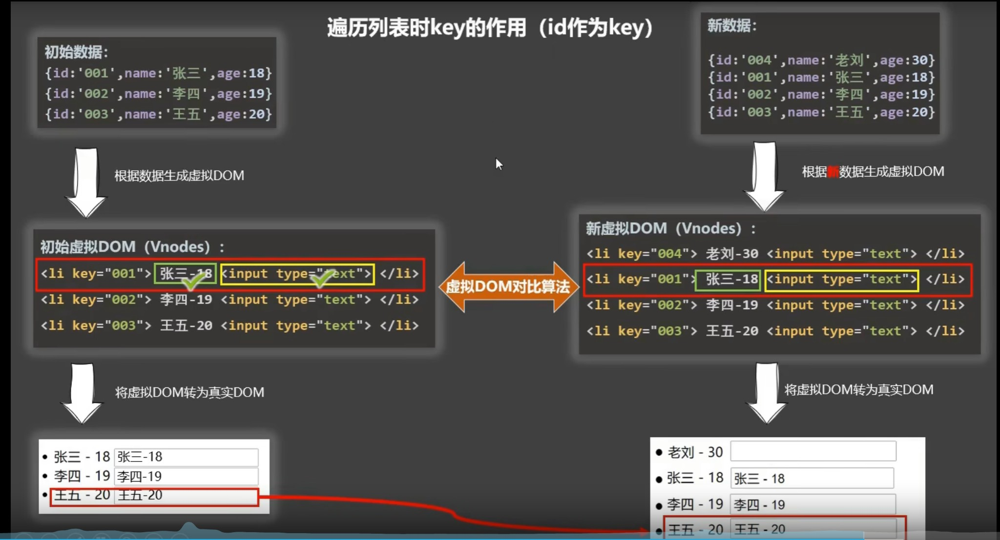

# Vue学习笔记

### Vue基础

##### 入门程序

> ```html
> <!DOCTYPE html>
> <html lang="zh-CN">
> <head>
>     <meta charset="UTF-8">
>     <meta http-equiv="X-UA-Compatible" content="IE=edge">
>     <meta name="viewport" content="width=device-width, initial-scale=1.0">
>     <title>Document</title>
>     <script src="../src/vue.js"></script>
> </head>
> <body>
>     <div id="root">
>         <h1>大家好，{{ msg }}</h1>
>     </div>
>     <script>
>        Vue.config.productionTip = false;
>        // 创建Vue实例
>        new Vue({
>             el: '#root',  // 用于指定当前Vue实例绑定哪个容器，值通常为CSS选择器字符串
>             data: {     // data用于存储数据，数据供el指定的容器使用
>                 msg: '才是真的好!'
>             }
>         });
>     </script>
> </body>
> </html>
> ```

##### 模板语法

> Vue模板语法有2大类
>
> 1. 差值语法：
>
>    功能：用于解析标签体内容
>
>    写法：{{ xxx }} ，xxx是js表达式，且可以读取到data中的所有属性
>
> 2. 指令语法:
>
>    功能：用于解析标签（包括：标签属性、标签体内容、绑定事件……）
>
>    举例：v-bind:herf = "xxx"  或简写为 :href = "xxx"  xxx 同样要写js表达式且可以读取到data中的所有属性
>
>    备注：Vue中有很多的指令，且形式都是v-????  ，此处，我们只是拿v-bind举例
>
> ```html
> <!DOCTYPE html>
> <html lang="zh-CN">
> <head>
>     <meta charset="UTF-8">
>     <meta http-equiv="X-UA-Compatible" content="IE=edge">
>     <meta name="viewport" content="width=device-width, initial-scale=1.0">
>     <title>Document</title>
>     <script src="../src/vue.js"></script>
> </head>
> <body>
>     <div id="root">
>         <h1>差值语法</h1>
>         <h3>你好，{{name}} </h3>
>         <hr/>
>         <h1>指令语法</h1>
>         <a v-bind:href="url" target="_blank">百度一下</a>
>         <a :href="url2" target="_blank">搜狐</a>
>     </div>
>     <script>
>        Vue.config.productionTip = false;
>        // 创建Vue实例
>        new Vue({
>             el: '#root',
>             data: {
>                 name: 'jack',
>                 url: 'https://www.baidu.com',
>                 url2: 'https://www.sohu.com'
>             }
>         });
>     </script>
> </body>
> </html>
> ```
>
> **动态参数**
>
> 从 2.6.0 开始，可以用方括号括起来的 JavaScript 表达式作为一个指令的参数：
>
> ```html
> <a v-bind:[attributeName]="url"> ... </a>
> ```
>
> 这里的 attributeName 会被作为一个 JavaScript 表达式进行动态求值，求得的值将会作为最终的参数来使用。例如，如果你的 Vue 实例有一个 data property attributeName，其值为 "href"，那么这个绑定将等价于 v-bind:href。同样地，你可以使用动态参数为一个动态的事件名绑定处理函数：
>
> ```html
> <a v-on:[eventName]="doSomething"> ... </a>
> ```
>
> *对动态参数的值的约束*
> 动态参数预期会求出一个字符串，异常情况下值为 null。这个特殊的 null 值可以被显性地用于移除绑定。任何其它非字符串类型的值都将会触发一个警告。
>
> *对动态参数表达式的约束*
> 动态参数表达式有一些语法约束，因为某些字符，如空格和引号，放在 HTML attribute 名里是无效的。例如：
>
> ```html
> <!-- 这会触发一个编译警告 -->
> <a v-bind:['foo' + bar]="value"> ... </a>
> ```
>
> 变通的办法是使用没有空格或引号的表达式，或用计算属性替代这种复杂表达式。
>
> 在 DOM 中使用模板时 (直接在一个 HTML 文件里撰写模板)，还需要避免使用大写字符来命名键名，因为浏览器会把 attribute 名全部强制转为小写：
>
> ```html
> <!--
> 在 DOM 中使用模板时这段代码会被转换为 `v-bind:[someattr]`。
> 除非在实例中有一个名为“someattr”的 property，否则代码不会工作。
> -->
> <a v-bind:[someAttr]="value"> ... </a>
> ```
>
> **修饰符**
>
> 修饰符 (modifier) 是以半角句号 . 指明的特殊后缀，用于指出一个指令应该以特殊方式绑定。例如，.prevent 修饰符告诉 v-on 指令对于触发的事件调用 event.preventDefault()：
>
> ```html
> <form v-on:submit.prevent="onSubmit">...</form>
> ```

##### 数据绑定

> ```html
> <!DOCTYPE html>
> <html lang="zh-CN">
> <head>
>  <meta charset="UTF-8">
>  <meta http-equiv="X-UA-Compatible" content="IE=edge">
>  <meta name="viewport" content="width=device-width, initial-scale=1.0">
>  <title>Document</title>
>  <script src="../src/vue.js"></script>
> </head>
> <body>
>  <div id="root">
>      单向数据绑定：<input type="text" v-bind:value="name"><br/>
>      双向数据绑定：<input type="text" v-model:value="name">
>      <hr/>
>      <h1>简写</h1>
>      单向数据绑定：<input type="text" :value="name"><br/>
>      双向数据绑定：<input type="text" v-model="name">
>  </div>
>  <script>
>     Vue.config.productionTip = false;
>     // 创建Vue实例
>     new Vue({
>          el: '#root',
>          data: {
>              name: '君莫笑',
>          }
>      });
>  </script>
> </body>
> </html>
> ```
>
> **el 的两种写法**
>
> ```html
> <div id="root">
>     <h1>你好 {{ name }}</h1>
> </div>
> <script>
>     Vue.config.productionTip = false;
>     // 创建Vue实例
>     // el的两种写法
>     const v = new Vue({
>         // el: '#root',     // 第一种写法
>         data: {
>             name: '君莫笑',
>         }
>     });
>     console.log(v);
>     v.$mount('#root')   // 第二种写法
> </script>
> ```
>
> **data 的两种写法**
>
> ```html
> <div id="root">
>     <h1>你好 {{ name }}</h1>
> </div>
> <script>
>     Vue.config.productionTip = false;
>     const v = new Vue({
>         el: '#root',
>         // data的第一种写法，对象式
>         /**
>             data: {
>                 name: '君莫笑',
>             }
>             */
>         // data的第二种写法，函数式
>         data(){
>             console.log("@@@",this);  // 此处的this是Vue实例对象
>             return {
>                 name: '君莫笑',
>             }
>         }
>     });
> </script>
> ```

##### 理解MVVM

> 
>
> 
>
> 
>
> ```html
> <div id="root">
>     <h1>你好 {{ $options }}</h1>
>     {{ $emit }}
>     <!-- 本质上花括号里面能写Vue实例和Vue实例原型上面的所有属性 -->
> </div>
> <script>
>     Vue.config.productionTip = false;
>     const v = new Vue({
>         el: '#root',
>         // data的第一种写法，对象式
>         /**
>             data: {
>                 name: '君莫笑',
>             }
>             */
>         // data的第二种写法，函数式
>         data(){
>             console.log("@@@",this);  // 此处的this是Vue实例对象
>             return {
>                 name: '君莫笑',
>             }
>         }
>     });
> </script>
> ```
>

##### 数据代理

> Object.defineProperty()
>
> ```javascript
> <div id="root">
>     <h1>你好 {{ $options }}</h1>
> {{ $emit }}
> <!-- 本质上花括号里面能写Vue实例上面的所有属性 -->
> </div>
> <script>
>     //    Vue.config.productionTip = false;
>     //    const v = new Vue({
>     //         el: '#root',
>     //         data(){
>     //             return {
>     //                 name: '君莫笑',
>     //             }
>     //         }
>     //     });
>     let person = {
>         name:'张三',
>         sex:'男',
>     }
> let number = 18
> Object.defineProperty(person,'age',{
>     // value:18,
>     // enumerable:true,  // 控制该属性是否可枚举，默认是false
>     // writable:true,  // 控制属性是否可以被修改，默认值是false
>     // configurable:true,  // 控制属性是否可以被删除，默认值是false
> 
>     // 当有人读取person的age属性时，get函数(getter)就会被调用，且返回值就是age的值
>     get(){
>         return number;
>     },
>     // 当有人修改person的age属性时，set函数(setter)就会被调用，且返回值就是age的值
>     set(value){
>         console.log("设置的值是：",value)
>     }
> 
> })
> // console.log(Object.keys(person))
> </script>
> ```

##### 事件处理

> ```javascript
> <div id="root">
>  <h2>欢迎来到 {{name}} 学习</h2>
> <button v-on:click="showInfo(66,$event)">点我提示信息</button>
> </div>
> <script>
>  Vue.config.productionTip = false;
> const v = new Vue({
>  el: '#root',
>  data(){
>      return {
>          name: '白鹿书院',
>      }
>  },
>  methods:{
>      showInfo(num,e){
>          console.log(num)
>          console.log(e)
>          // alert('同学你好！')
>      }
>  }
> });
> </script>
> ```
>
> **事件修饰符**
>
> Vue中的事件修饰符
>
> 1. prevent ：阻止默认事件（常用）
> 2. stop ：阻止事件冒泡
> 3. once：事件只触发一次
> 4. capture：使用事件的捕获模式
> 5. self：只有event.target是当前操作的元素时才触发事件
> 6. passive：事件的默认行为立即执行，无需等待事件回调执行完毕
>
> ```html
> <div id="root">
>     <h2>欢迎来到 {{name}} 学习</h2>
>     <a href="http://www.baidu.com" @click.prevent="showInfo">点我提示信息</a>
>    <!-- 事件修饰符可以连写-->
>     <a href="http://www.baidu.com" @click.prevent.stop="showInfo">点我提示信息</a>
> </div>
> <script>
>     Vue.config.productionTip = false;
>     const v = new Vue({
>         el: '#root',
>         data(){
>             return {
>                 name: '白鹿书院',
>             }
>         },
>         methods:{
>             showInfo(){
>                 alert('同学你好！')
>             }
>         }
>     });
> </script>
> ```
>
> **键盘事件**
>
> Ⅰ. Vue中常用的按键别名
>
> 1. 回车：enter
> 2. 删除：delete：（捕获“删除”和“退格”键）
> 3. 退出：esc
> 4. 空格：space
> 5. 换行：tab（特殊，必须配合keydown使用）
> 6. 上：up
> 7. 下：down
> 8. 左：left 
> 9. 右：right
>
> Ⅱ. Vue未提供别名的按键，可以使用按键原始的key值去绑定，但注意要转为kebab-case(短横线命名)
>
> Ⅲ. 系统修饰键（用法特殊）：ctrl、alt、shift、meta
>
> 1. 配合keyup使用：按下修饰键的同时，再按下其他键，随后释放其他键，事件才被触发。
> 2. 配合keydown使用：正常触发事件。
>
> Ⅳ. 也可以使用keyCode去指定具体的按键（不推荐）
>
> Ⅴ. Vue.config.keyCodes.自定义键名 = 键码，可以定制按键别名
>
> ```html
> <div id="root">
>     <h2>欢迎来到 {{name}} 学习</h2>
>     <input type="text" placeholder="按下回车，提示输入" @keyup.enter="showInfo">
> </div>
> <script>
>     Vue.config.productionTip = false;
>     const v = new Vue({
>         el: '#root',
>         data(){
>             return {
>                 name: '白鹿书院',
>             }
>         },
>         methods:{
>             showInfo(e){
>                 console.log(e.key);
>             }
>         }
>     });
> </script>
> ```

##### 计算属性

> **定义**：要用的属性不存在，要通过已有的属性计算得来
>
> **原理**：底层借助了Object.defineProperty方法提供的getter和setter
>
> **优势**：与methods实现相比，内部有缓存机制（复用），效率更高，调试方便
>
> **备注**：
>
> 1. 计算属性最终会出现在vm上，直接读取使用即可
> 2. 如果计算属性要被修改，就必须写set函数响应修改，且set中要引起计算时依赖的数据发生改变
>
> ```html
> <div id="root">
>     长：<input type="text" v-model="length"><br/>
>     宽：<input type="text" v-model="width"><br/>
>     高：<input type="text" v-model="height"><br/>
>     体积：<span>{{volume}}</span>
> </div>
> <script>
>     Vue.config.productionTip = false;
>     const v = new Vue({
>         el: '#root',
>         data(){
>             return {
>                 length:0,
>                 width:0,
>                 height:0
>             }
>         },
>         computed:{
>             // 完整写法
>             // volume:{
>             //     // 当读取volume，get就会被调用，且返回值就是volume的值
>             //     // get调用时机，1.初次读取volume时 2.所依赖的数据发生变化时
>             //     get(){
>             //         // 此处的this是vm
>             //         console.log("volume被调用");
>             //         return this.length * this.width * this.height
>             //     },
>             //     // set调用时机：当volume被修改时
>             //     set(value){
>             //         this.length = 2;
>             //         this.width = 1;
>             //         this.height = value / this.length / this.width;
>             //     }
>             // }
> 
>             // 简写（前提：只需要get方法，不需要set方法）
>             // 函数名即为计算属性名
>             volume(){
>                 return this.length * this.width * this.height
>             }
>         },
>         methods:{
> 
>         }
>     });
> </script>
> ```
>

##### 监视属性

> ```html
> <div id="root">
>     <h2>今天的温度是{{degree}} 度</h2>
>     <button @click="degree++">改变温度</button>
> </div>
> <script>
>     Vue.config.productionTip = false;
>     const vm = new Vue({
>         el: '#root',
>         data(){
>             return {
>                 degree:10
>             }
>         },
>         computed:{
>             info(){
>                 return this.degree + 10
>             }
>         },
>         methods:{
> 
>         },
>         watch:{
>             // 不仅可以监视普通属性，计算属性也是可以监视的
>             degree:{
>                 // 初始化时让handler调用一下
>                 immediate:true,
>                 // handler调用时机：当isHot发生改变时
>                 handler(newValue,oldValue){
>                     console.log(newValue + " === " + oldValue)
>                 }
>             }
>         }
>     });
> 
>     // 另一种写法
>     vm.$watch('info',{
>         immediate:false,
>         handler(newValue,oldValue){
>             console.log(newValue + " : " + oldValue)
>         }
>     })
> </script>
> ```
>
> **深度监视**：Vue中的watch默认不监测对象内部值的改变（一层），配置deep:true，可以监测对象内部值的改变（多层）
>
> ```html
> <div id="root">
>     <h3>a的值是{{numbers.a}}</h3>
>     <button @click="numbers.a++">点击a改变</button>
>     <h3>b的值是{{numbers.b}}</h3>
>     <button @click="numbers.b++">点击b改变</button>
> </div>
> <script>
>     Vue.config.productionTip = false;
>     const vm = new Vue({
>         el: '#root',
>         data: {
>             numbers:{
>                 a:1,
>                 b:2
>             }
>         },
>         computed:{
>         },
>         methods:{
>         },
>         watch:{
>             // 监视多级结构中，某个属性的变化
>             // 'numbers.a':{
>             //     handler(){
>             //         console.log("a被改变了")
>             //     }
>             // }
> 
>             // 监视多级结构中属性的变化
>             numbers:{
>                 deep:true,
>                 handler(){
>                     console.log("numbers改变了")
>                 }
>             }
>         }
>     });
> </script>
> ```
>
> **简写形式**
>
> ```html
> <div id="root">
>     <h3>温度：{{degree}} 度</h3>
>     <button @click="degree++">点击</button>
> </div>
> <script>
>     Vue.config.productionTip = false;
>     const vm = new Vue({
>         el: '#root',
>         data: {
>             degree:10
>         },
>         computed:{
>         },
>         methods:{
>         },
>         watch:{
>             // 当只需要handler，不需要其他配置项，可以如下简写
>             degree(newValue,oldValue){
>                 console.log("温度改变了")
>                 console.log(newValue + " : " + oldValue)
>             }
>         }
>     });
> 
>     // 第2种简写方式
>     vm.$watch('degree',function(newValue,oldValue){
>         console.log("温度改变了2")
>         console.log(newValue + " : " + oldValue)
>     })
> </script>
> ```
>
> **computed和watch之间的区别**
>
> * computed能完成的功能，watch都可以完成
> * watch能完成的功能，computed不一定能完成，例如：watch可以进行异步操作
>
> **两个重要的小原则**
>
> * 被Vue管理的函数，最好写成普通函数，这样this的指向才是Vue实例或组件实例对象
> * 所有不被vue管理的函数（定时器的回调函数，ajax的回调函数，Promise的回调函数等），最好写成箭头函数，这样this的指向才是vue实例或组件实例对象
>
> ```html
> <div id="root">
>     姓：<input type="text" v-model="firstName"><br/>
>     名：<input type="text" v-model="lastName"><br/>
>     全名:<span>{{fullName}}</span>
> </div>
> <script>
>     Vue.config.productionTip = false;
>     const vm = new Vue({
>         el: '#root',
>         data: {
>             firstName:"张",
>             lastName:"三",
>             fullName:"张-三"
>         },
>         computed:{
>         },
>         methods:{
>         },
>         watch:{
>             // 计算属性不支持异步回调，监视属性支持异步回调
>             firstName(val){
>                 setTimeout(()=>{   
>                     // 这里的函数必须写成箭头函数的形式，如果写成普通函数的形式，这里的this指向的就不是Vue实例，而是window，this.fullName就找不到
>                     // 因为setTimeout不是vue管理的函数，所以写成普通函数的this指向的是window，写成箭头函数的形式，
>                     // 在函数内部找不到this，就会往外找，找到的firstName，而firstName属于Vue管理的函数，所以this指向的是Vue实例
>                     this.fullName = val + '-' + this.lastName
>                 },2000);
>             },
>             lastName(val){
>                 this.fullName = this.firstName + '-' + val
>             }
>         }
>     });
> </script>
> ```
>

##### 绑定样式

> **绑定class样式**
>
> ```html
> <!DOCTYPE html>
> <html lang="zh-CN">
> <head>
>     <meta charset="UTF-8">
>     <meta http-equiv="X-UA-Compatible" content="IE=edge">
>     <meta name="viewport" content="width=device-width, initial-scale=1.0">
>     <title>Document</title>
>     <script src="../src/vue.js"></script>
>     <style>
>         .basic{
>             width: 200px;
>             height:100px;
>             border: 4px solid red;
>         }
>         .happy{
>             border: 4px solid red;
>             background-color: rgba(255, 255, 0, 0.644);
>             background: linear-gradient(30deg,yellow,pink,orange,yellow);
>         }
>         .sad{
>             background-color: aqua;
>         }
>         .normal{
>             background-color: gray;
>         }
>     </style>
> </head>
> <body>
>     <div id="root">
>         <!-- 绑定class样式--字符串写法，适用于：样式的类名不确定，需要动态指定 -->
>         <div class="basic" :class="mood" @click="changeMood">{{name}}</div>
>         <!-- 绑定class样式数组写法，适用于：要绑定的样式个数不确定，名字也不确定 -->
>         <div :class="arr">{{name}}</div>
>         <!-- 绑定class样式对象写法，适用于：要绑定的样式个数确定，名字也确定，但要动态决定用不用 -->
>         <div :class="obj">{{name}}</div>
>     </div>
>     <script>
>        Vue.config.productionTip = false;
>        const vm = new Vue({
>             el: '#root',
>             data: {
>                 name:'九纹龙-史进',
>                 mood:'normal',
>                 arr:['basic','happy'],
>                 obj:{
>                     happy:false,
>                     basic:true
>                 }
>             },
>             methods:{
>                 changeMood(){
>                     const arr = ['happy','sad','normal'];
>                     const index = Math.floor(Math.random()*3)
>                     this.mood = arr[index]
>                 }
>             }
>         });
>     </script>
> </body>
> </html>
> ```
>
> **绑定style样式**
>
> ```html
> <!DOCTYPE html>
> <html lang="zh-CN">
>     <head>
>         <meta charset="UTF-8">
>         <meta http-equiv="X-UA-Compatible" content="IE=edge">
>         <meta name="viewport" content="width=device-width, initial-scale=1.0">
>         <title>Document</title>
>         <script src="../src/vue.js"></script>
>         <style>
>             .basic{
>                 width: 200px;
>                 height:100px;
>                 border: 4px solid red;
>             }
>         </style>
>     </head>
>     <body>
>         <div id="root">
>             <div class="basic" :style="styleObj">{{name}}</div>
>             <div class="basic" :style="[styleObj,styleObj2]">{{name}}</div>
>         </div>
>         <script>
>             Vue.config.productionTip = false;
>             const vm = new Vue({
>                 el: '#root',
>                 data: {
>                     name:'九纹龙-史进',
>                     styleObj:{
>                         fontSize:'40px'
>                     },
>                     styleObj2:{
>                         backgroundColor:'red'
>                     }
>                 },
>                 methods:{
>                 }
>             });
>         </script>
>     </body>
> </html>
> ```
>

##### 条件渲染

> **v-if**
>
> 写法：
>
> ​	① v-if="表达式"
>
> ​	② v-else-if="表达式"
>
> ​	③ v-else="表达式"
>
> 适用于切换频率较低的场景
>
> 特点：不展示的DOM直接被移除
>
> 注意：v-if可以和v-else-if、v-else一起使用，但要求结构不能被打断
>
> **v-show**
>
> 写法：v-show="表达式"
>
> 适用于切换频率较高的场景
>
> 特点：不展示的DOM元素未被移除，仅仅是使用样式隐藏掉
>
> 备注：使用 v-if 时，元素可能无法获取到，而使用v-show一定可以获取到
>
> ```html
> <div id="root">
>     <h2 v-show="isShow">欢迎来到{{name}}</h2>
>     <h2 v-if="isShow">欢迎来到{{name}}</h2>
> </div>
> <script>
>     Vue.config.productionTip = false;
>     const vm = new Vue({
>         el: '#root',
>         data: {
>             name:"花果山",
>             isShow:false
>         },
>         methods:{
>         }
>     });
> </script>
> ```

##### 列表渲染

> **v-for指令**
>
> 1. 用于展示列表数据
> 2. 语法：v-for="(item,index) in xxx" :key="yyy"
> 3. 可遍历：数组，对象，字符串，指定次数
>
> ```html
> <div id="root">
>     <ul>
>         <!-- key 的特殊 attribute 主要用在 Vue 的虚拟 DOM 算法，在新旧 nodes 对比时辨识 VNodes。如果不使用 key，
> Vue 会使用一种最大限度减少动态元素并且尽可能的尝试就地修改/复用相同类型元素的算法。而使用 key 时，
> 它会基于 key 的变化重新排列元素顺序，并且会移除 key 不存在的元素。
> 有相同父元素的子元素必须有独特的 key。重复的 key 会造成渲染错误。 -->
>         <li v-for="p in personList" :key="p.id">
>             {{p.id}}-{{p.name}}-{{p.age}}
>         </li>
>         <hr/>
>         <li v-for="(p,index) in personList" :key="index">
>             {{p.id}}-{{p.name}}-{{p.age}}
>         </li>
>     </ul>
> 
>     <!-- 遍历对象 -->
>     <ul>
>         <li v-for="(v,k) of car" :key="k">
>             {{k}} --- {{v}}
>         </li>
>     </ul>
>     <!-- 遍历字符串 -->
>     <ul>
>         <li v-for="(char,index) of str" :key="index">
>             {{index}}---{{char}}
>         </li>
>     </ul>
>     <!-- 遍历指定次数 -->
>     <ul>
>         <li v-for="(number,index) of 5">
>             {{number}} --- {{index}}
>         </li>
>     </ul>
> </div>
> <script>
>     Vue.config.productionTip = false;
>     const vm = new Vue({
>         el: '#root',
>         data: {
>             personList:[
>                 {id:'001',name:'张三',age:18},
>                 {id:'002',name:'李四',age:20},
>                 {id:'003',name:'王五',age:16}
>             ],
>             car:{
>                 name:'奥迪A8',
>                 price:'70w',
>                 color:'黑色'
>             },
>             str:'hello'
>         },
>         methods:{
>         }
>     });
> </script>
> ```
>
> **遍历列表时Key的作用（index作为key）**
>
> 
>
> 示例代码（有可能出问题的代码，以index作为key时有可能出现的问题，所以推荐使用ID，作为key，如上图所示）：
>
> ```html
> <div id="root">
>     <h2>人员列表</h2>
>     <button @click.once="add">添加</button>
>     <ul>
>         <li v-for="(p,index) of personList" :key="index">
>             {{p.name}}-{{p.age}}
>             <input type="text">
>         </li>
>     </ul>
> </div>
> <script>
>     Vue.config.productionTip = false;
>     const vm = new Vue({
>         el: '#root',
>         data: {
>             personList:[
>                 {id:'001',name:'张三',age:18},
>                 {id:'002',name:'李四',age:19},
>                 {id:'003',name:'王五',age:20}
>             ]
>         },
>         methods:{
>             add(){
>                 const p = {id:'004',name:'老刘',age:40};
>                 this.personList.unshift(p);
>             }
>         }
>     });
> </script>
> ```
>
> 
>
> **Vue中key的作用**
>
> 1. 虚拟DOM中key的作用：
>    * key是虚拟DOM对象的标识，当数据发生变化时，Vue会根据新数据生成新的虚拟DOM
>    * 随后Vue进行新虚拟DOM与旧虚拟DOM的差异比较，比较规则如下：
> 2. 对比规则：
>    * 旧虚拟DOM中找到了与新虚拟DOM相同的key，若新虚拟DOM中的内容没变，直接使用之前的真实DOM，
>    * 若虚拟DOM中内容变了，则生成新的真实DOM，随后替换掉页面中之前的真实DOM
> 3. 用index作为key可能引发的问题：
>    * 若对数据进行逆序添加，逆序删除等破坏顺序的操作，会产生没有必要的真实DOM更新 ===>  界面效果没问题，但效率低
>    * 如果结构中还包含输入类的DOM，会产生错误DOM更新 === > 界面有问题
> 4. 开发中如何选择key
>    * 最好使用每条数据的唯一标识作为key，比如id，手机号，学号，身份证号等唯一值
>    * 如果不存在对数据的逆序添加，逆序删除等破坏顺序的操作，仅用于渲染列表用于展示，使用index作为key是没有问题的

##### 列表过滤

> **用watch实现过滤**
>
> ```html
> <div id="root">
>     <h2>人员列表</h2>
>     <input type="text" placeholder="请输入名字" v-model="keywords">
>     <ul>
>         <li v-for="(p,index) of filterPersonList">
>             {{p.name}}-{{p.age}}-{{p.sex}}
>         </li>
>     </ul>
> </div>
> <script>
>     Vue.config.productionTip = false;
>     const vm = new Vue({
>         el: '#root',
>         data: {
>             keywords:'', 
>             personList:[
>                 {id:'001',name:'马冬梅',age:18,sex:'女'},
>                 {id:'002',name:'周冬雨',age:19,sex:'女'},
>                 {id:'003',name:'周杰伦',age:20,sex:'男'},
>                 {id:'004',name:'温兆伦',age:25,sex:'男'}
>             ],
>             filterPersonList:[]
>         },
>         methods:{
> 
>         },
>         watch:{
>             keywords:{
>                 immediate:true,
>                 handler(val){
>                     this.filterPersonList = this.personList.filter((p)=>{
>                         return p.name.indexOf(val) != -1
>                     });
>                 }
>             }
>         }
>     });
> </script>
> ```
>
> **用计算属性实现过滤**
>
> ```html
> <div id="root">
>     <h2>人员列表</h2>
>     <input type="text" placeholder="请输入名字" v-model="keywords">
>     <ul>
>         <li v-for="(p,index) of filterPersonList">
>             {{p.name}}-{{p.age}}-{{p.sex}}
>         </li>
>     </ul>
> </div>
> <script>
>     Vue.config.productionTip = false;
>     const vm = new Vue({
>         el: '#root',
>         data: {
>             keywords:'', 
>             personList:[
>                 {id:'001',name:'马冬梅',age:18,sex:'女'},
>                 {id:'002',name:'周冬雨',age:19,sex:'女'},
>                 {id:'003',name:'周杰伦',age:20,sex:'男'},
>                 {id:'004',name:'温兆伦',age:25,sex:'男'}
>             ]
>         },
>         methods:{
> 
>         },
>         computed:{
>             filterPersonList(){
>                 return this.personList.filter((p)=>{
>                     return p.name.indexOf(this.keywords) != -1
>                 });
>             }
>         }
>     });
> </script>
> ```
>

##### Vue set方法

> **格式**
>
> Vue.set( target, propertyName/index, value )
>
> **用法**
>
> 向响应式对象中添加一个 property，并确保这个新 property 同样是响应式的，且触发视图更新。它必须用于向响应式对象上添加新 property，因为 Vue 无法探测普通的新增 property (比如 this.myObject.newProperty = 'hi')
>
> **注意事项**
>
> 注意对象不能是 Vue 实例，或者 Vue 实例的根数据对象。
>
> **示例**
>
> ```html
> <div id="root">
>     {{name}}--{{info.address}}--{{info.tel}}--{{info.age}}
> </div>
> <script>
>     Vue.config.productionTip = false;
>     const vm = new Vue({
>         el: '#root',
>         data: {
>             name:'charles',
>             info:{
>                 address:'China'
>             }
>         },
>         methods:{
>             // Vue后置添加属性
>             addTel(){
>                 Vue.set(this.info,'tel','13526885699')
>             },
>             addAge(){
>                 this.$set(this.info,'age',18)
>             }
>         }
>     });
> </script>
> ```
>
> 

##### 收集表单数据

> ```html
> <input type="text">   v-model收集的是value值，用户输入的就是value值
> <input type="radio">  v-model收集的是value值，且要给标签配置value值
> <input type="checkbox">
> 1.没有配置input的value属性，那么收集的就是checked （勾选or未勾选，是布尔值）   
> 2. 配置input的value属性：
> (1) v-model的初始值是非数组，那么收集的就是checked（勾选or未勾选，是布尔值）
> (2) v-model的初始值是数组，那么收集的就是value组成的数组
> 备注：v-model的三个修饰符
> lazy:失去焦点再收集数据
> number:输入字符串转为有效的数字
> trim:输入首尾空格过滤
> ```
>
> 代码示例：
>
> ```html
> <div id="root">
>     <form @submit.prevent="demo">
>         账号: <input type="text" v-model.trim="form.account"><br/><br/>
>         密码: <input type="password" v-model="form.password"><br/><br/>
>         年龄: <input type="number" v-model.number="form.age"><br/><br/>
>         性别: 
>         男 <input type="radio" name="sex" v-model="form.sex" value="male">
>         女 <input type="radio" name="sex" v-model="form.sex" value="female"><br/><br/>
>         爱好: 
>         学习 <input type="checkbox" name="hobbies" v-model="form.hobbies" value="study">
>         游戏 <input type="checkbox" name="hobbies" v-model="form.hobbies" value="game">
>         音乐 <input type="checkbox" name="hobbies" v-model="form.hobbies" value="music"><br/><br/>
>         所属校区:
>         <select name="school" v-model="form.city">
>             <option value="">请选择校区</option>
>             <option value="BJ">北京校区</option>
>             <option value="SH">上海校区</option>
>             <option value="HZ">杭州校区</option>
>             <option value="GZ">广州校区</option>
>         </select><br/><br/>
>         其他信息: 
>         <textarea name="" cols="30" rows="10" v-model.lazy="form.other"></textarea><br/><br/>
>         <input type="checkbox" v-model="form.agree">阅读并接受<a href="#">《用户协议》</a><br/><br/>
>         <button>提交</button>
>     </form>
> </div>
> <script>
>     Vue.config.productionTip = false;
>     const vm = new Vue({
>         el: '#root',
>         data: {
>             form:{
>                 account:'',
>                 password:'',
>                 age:'',
>                 sex:'female',
>                 hobbies:[],
>                 city:'',
>                 other:'',
>                 agree:''
>             }
>         },
>         methods:{
>             demo(){
>                 console.log(JSON.stringify(this.form))
>             }
>         }
>     });
> </script>
> ```

##### 过滤器

> ```html
> <!DOCTYPE html>
> <html lang="zh-CN">
> <head>
>     <meta charset="UTF-8">
>     <meta http-equiv="X-UA-Compatible" content="IE=edge">
>     <meta name="viewport" content="width=device-width, initial-scale=1.0">
>     <title>Document</title>
>     <script src="../src/vue.js"></script>
>     <script src="../src/dayjs.min.js"></script>
> </head>
> <body>
>     <div id="root">
>         <h2>显示格式化后的时间</h2>
>         <h3>现在是：{{time | timeFormater | mySlice}}</h3>
>     </div>
>     <script>
>        Vue.config.productionTip = false;
>        // 全局过滤器
>        Vue.filter('mySlice',function(value){
>             return value.slice(0,4)
>        })
> 
>        const vm = new Vue({
>             el: '#root',
>             data: {
>                 time:'1651249749662'
>             },
>             methods:{
>             },
>             // 局部过滤器
>             filters:{
>                 timeFormater(value){
>                     return dayjs(value).format('YYYY-MM-DD HH:mm:ss')
>                 }
>             }
>         });
>     </script>
> </body>
> </html>
> ```
>

##### 内置指令

> **v-text**
>
> 作用：向其所在的节点中渲染文本内容
>
> 与插值语法的区别：v-text会替换掉节点中的内容，{{xxx}}则不会
>
> ```html
> <div id="root">
>     <div v-text="name"></div>
> </div>
> <script>
>     Vue.config.productionTip = false;
> 
>     const vm = new Vue({
>         el: '#root',
>         data: {
>             name:'大荒星陨'
>         },
>         methods:{
>         }
>     });
> </script>
> ```
>
> **v-html**
>
> 作用：向指定节点中渲染包含html结构的内容
>
> 与插值语法的区别，v-html会替换掉节点中所有的内容，{{xxx}}则不会，
>
> v-html可以识别html结构
>
> 注意：一定要在可信的内容上使用v-html，否则容易导致xss攻击
>
> ```html
> <div id="root">
>     <div v-html="str"></div>
> </div>
> <script>
>     Vue.config.productionTip = false;
> 
>     const vm = new Vue({
>         el: '#root',
>         data: {
>             str:'<h3>你好啊</h3>'
>         },
>         methods:{
>         }
>     });
> </script>
> ```
>
> **v-cloak**
>
> 作用：配合CSS，在网速较慢的情况下，vue还没有对节点进行处理的时候，不显示节点，处理完之后再进行显示
>
> ```html
> <!DOCTYPE html>
> <html lang="zh-CN">
> <head>
>     <meta charset="UTF-8">
>     <meta http-equiv="X-UA-Compatible" content="IE=edge">
>     <meta name="viewport" content="width=device-width, initial-scale=1.0">
>     <title>Document</title>
>     <script src="../src/dayjs.min.js"></script>
>     <style>
>         [v-cloak]{
>             display: none;
>         }
>     </style>
> </head>
> <body>
>     <div id="root">
>         <div v-cloak>{{name}}</div>
>     </div>
>     <script src="https://cdn.jsdelivr.net/npm/vue@2/dist/vue.js"></script>
>     <script>
>        Vue.config.productionTip = false;
> 
>        const vm = new Vue({
>             el: '#root',
>             data: {
>                 name:'大荒星陨'
>             },
>             methods:{
>             }
>         });
>     </script>
> </body>
> </html>
> ```
>
> **v-once**
>
> 作用：只渲染元素和组件一次。随后的重新渲染，元素/组件及其所有的子节点将被视为静态内容并跳过。这可以用于优化更新性能。
>
> ```html
> <!-- 单个元素 -->
> <span v-once>This will never change: {{msg}}</span>
> <!-- 有子元素 -->
> <div v-once>
>   <h1>comment</h1>
>   <p>{{msg}}</p>
> </div>
> <!-- 组件 -->
> <my-component v-once :comment="msg"></my-component>
> <!-- `v-for` 指令-->
> <ul>
>   <li v-for="i in list" v-once>{{i}}</li>
> </ul>
> ```
>
> **v-pre**
>
> 跳过这个元素和它的子元素的编译过程。可以用来显示原始 Mustache 标签。跳过大量没有指令的节点会加快编译。
>
> ```html
> <span v-pre>{{ this will not be compiled }}</span>
> ```
>

##### 自定义指令

> ```html
> <div id="root">
>     <h2>当前的n值是: <span v-text="n"></span></h2>
>     <h2>放大10倍后的n值是: <span v-big="n"></span></h2>
>     <button @click="n++">点我n+1</button>
>     <hr/>
>     <input type="text" v-fbind:value="n">
> </div>
> <script>
>     Vue.config.productionTip = false;
> 
>     const vm = new Vue({
>         el: '#root',
>         data: {
>             n:1
>         },
>         methods:{
>         },
>         directives:{
>             // big函数调用时机：
>             // 1.指令与元素成功绑定时会被调用
>             // 2.指令所在的模板被重新解析时
>             big(element,binding){
>                 element.innerText = binding.value * 10
>             },
>             fbind:{
>                 // 当指令与元素成功绑定时调用
>                 bind(element,binding){
>                     console.log('bind')
>                     element.value = binding.value
>                 },
>                 // 指令所在元素被插入页面时调用
>                 inserted(element,binding){
>                     console.log('inserted')
>                     element.focus()
> 
>                 },
>                 // 指令所在模板被重新解析时
>                 update(element,binding){
>                     console.log('update')
>                     element.value = binding.value
>                 }
>             }
>         }
>     });
> </script>
> ```

##### 生命周期

> **生命周期流程图**
>
> 
>
> 代码示例：
>
> ```html
> <div id="root">
>     <h2 :style="{opacity}">欢迎学习Vue</h2>
>     <h2>n的值: {{n}}</h2>
>     <button @click="n++">点我n+1</button>
>     <button @click="bye">点我销毁vm</button>
> </div>
> <script>
>     Vue.config.productionTip = false;
> 
>     const vm = new Vue({
>         el: '#root',
>         data: {
>             opacity:1,
>             flag:true,
>             n:1
>         },
>         methods:{
>             change(){
>                 setInterval(()=>{
>                     this.opacity -= 0.01
>                     if(this.opacity <= 0) this.opacity = 1
>                 },16);
>             },
>             bye(){
>                 // 调用这个Vue会执行销毁操作
>                 this.$destroy()
>             }
>         },
>         beforeCreate() {
>             console.log('beforeCreate')
>         },
>         created() {
>             console.log('created')
>         },
>         beforeMount() {
>             console.log('beforeMount')
>         },
>         // Vue完成模板的解析，并把初始的真实DOM元素放入页面后(挂载完毕)调用
>         mounted(){
>             // this.change()
>             console.log('mounted');
>         },
>         beforeUpdate() {
>             console.log('beforeUpdate')
>         },
>         updated() {
>             console.log('updated')
>         },
>         beforeDestroy() {
>             console.log('beforeDestroy')
>         },
>         destroyed() {
>             console.log('destroyed')
>         },
>     });
> </script>
> ```

##### 组件

> **定义组件示例**
>
> ```html
> <div id="root">
> <school></school>
> <hr/>
> <student></student>
> <hr/>
> <hello></hello>
> </div>
> <script>
> Vue.config.productionTip = false;
> // 创建school组件
> const _school = Vue.extend({
>   template:`
>     <div>  
>       <h2>学校名称：{{schoolName}}</h2>
>       <h2>学校地址：{{address}}</h2>
>       <button @click="showName">点我提示学校名</button>
>     </div>  
>    `,
>   // el: '#root', 一定不要写el配置项，因为最终所有的组件都要被一个vm管理，由vm决定服务于哪个容器
>   // data必须写成函数，避免组件被复用时，存在引用关系
>   data(){
>       return {
>           schoolName:'复旦大学',
>           address:'上海校区',
>       }
>   },
>   methods:{
>       showName(){
>           alert(this.schoolName)
>       }
>   }
> })
> // 创建student组件
> const _student = Vue.extend({
>   template:`
>     <div>  
>        <h2>学生姓名：{{studentName}}</h2>
>        <h2>学生年龄：{{age}}</h2>
> 	  </div>  
>   `,
>   data(){
>       return {
>           studentName:'张三',
>           age:18
>       }
>   },
>   methods:{
>   }
> })
> // 创建hello组件
> const hello = Vue.extend({
>   template:`
>      <div>
>       <h2>你好啊！{{name}}</h2>
>      </div>    
>   `,
>   data(){
>       return{
>           name:'Tom'
>       }
>   }
> })
> // 全局注册组件
> Vue.component('hello',hello)
> new Vue({
>   el: '#root',
>   // 注册组件(局部注册)
>   components:{
>       // 如果组件名，跟上面定义的变量名一样，可以简写为school
>       school:_school,
>       student:_student
>   },
>   data: {
>       schoolName:'复旦大学',
>       address:'上海校区',
>       studentName:'张三',
>       age:18
>   },
>   methods:{
>   }
> });
> </script>
> ```
>
> **组件注意事项**
>
> 关于组件名
>
> * 一个单词组成
>   * 第一种写法（首字母小写）: school
>   * 第二种写法（首字母大写）： School
> * 多个单词组成
>   * 第一种写法（kebab-case 命名）：my-school
>   * 第二种写法（CamelCase 命名）：MySchool（需要Vue脚手架支持）
> * 备注
>   * 组件名尽可能回避HTML中已有的元素名称，例如：h2、H2都不行
>   * ○
>     可以使用name配置项指定组件在开发者工具中呈现的名字
>
> 关于组件标签
>
> * 第一种写法：<school></school>
> * 第二种写法：<school/>（需要Vue脚手架支持）
> * 备注：不使用脚手架时，<school/>会导致后续组件不能渲染；一个简写方式：const school = Vue.extend(options)可简写为const school = options，因为父组件components引入的时候会自动创建
>
> **关于 VueComponent**
>
> * school 组件本质是一个名为VueComponent的构造函数，且不是程序员定义的，而是 Vue.extend() 生成的 
> * 我们只需要写 <school/> 或 <school></school>，Vue 解析时会帮我们创建 school 组件的实例对象，即Vue帮我们执行的new VueComponent(options) 
> * 每次调用Vue.extend，返回的都是一个全新的VueComponent，即不同组件是不同的对象
> * 关于 this 指向 
>   * 组件配置中data函数、methods中的函数、watch中的函数、computed中的函数 它们的 this 均是 VueComponent实例对象
>   * new Vue(options)配置中：data函数、methods中的函数、watch中的函数、computed中的函数 它们的 this 均是 Vue实例对象
> * VueComponent的实例对象，以后简称vc（组件实例对象）Vue的实例对象，以后简称vm
>
> 
>
> **单文件组件**
>
> index.html
>
> ```html
> <!DOCTYPE html>
> <html lang="zh-CN">
> <head>
>     <meta charset="UTF-8">
>     <meta http-equiv="X-UA-Compatible" content="IE=edge">
>     <meta name="viewport" content="width=device-width, initial-scale=1.0">
>     <title>Document</title>
> </head>
> <body>
>     <div id="root"></div>
>     <script src="../src/vue.js"></script>
>     <script src="./main.js"></script>
> </body>
> </html>
> ```
>
> main.js
>
> ```javascript
> import App from './App.vue'
> new Vue({
>     el:'#root',
>     template:`<App></App>`,
>     components:{App}
> })
> ```
>
> App.vue
>
> ```vue
> <template>
>     <div>
>         <school></school>
>         <student></student>
>     </div>
> </template>
> 
> <script>
>     // 引入组件
>     import School from './School.vue'
>     import Student from './Student.vue'
> 
>     export default {
>         name:'App',
>         components:{
>             School,
>             Student
>         }
>     }
> </script>
> 
> <style>
> 
> </style>
> ```
>
> School.vue
>
> ```vue
> <template>
>     <!-- 组件的结构 -->
> <div class="demo">  
>     <h2>学校名称：{{schoolName}}</h2>
>     <h2>学校地址：{{address}}</h2>
>     <button @click="showName">点我提示学校名</button>
> </div>  
> </template>
> <script>
>     // 组件交互相关的代码（数据方法等）
>     export default {
>         name:'School',
>         data(){
>             return {
>                 schoolName:'复旦大学',
>                 address:'上海校区',
>             }
>         },
>         methods: {
>             showName(){
>                 alert(this.schoolName)
>             }
>         },
>     }
> </script>
> <style scoped>
>     /* 组件的样式 */
>     .demo{
>         background-color: orange;
>     }
> </style>
> ```
>
> Student.vue
>
> ```vue
> <template>
> <div class="demo">  
>     <h2>学生姓名：{{name}}</h2>
>     <h2>学生年龄：{{age}}</h2>
> </div>  
> </template>
> <script>
>     export default {
>         name:'Student',
>         data(){
>             return {
>                 name:'张三',
>                 age:18,
>             }
>         }
>     }
> </script>
> <style scoped>
> </style>
> ```
>
> **关于不同版本的函数**
>
> 1. vue.js与vue.runtime.xxx.js的区别 
>    * vue.js 是完整版的Vue，包含：核心功能+模板解析器
>    * vue.runtime.xxx.js 是运行版的Vue，只包含核心功能，没有模板解析器，esm 就是 ES6 module
> 2. 因为 vue.runtime.xxx.js 没有模板解析器，所以不能使用template配置项，需要使用render函数接收到的createElement函数去指定具体内容
>
> ```javascript
> import Vue from 'vue'
> import App from './App.vue'
> 
> Vue.config.productionTip = false
> 
> new Vue({
>   render: h => h(App),
> }).$mount('#app')
> 
> ```
>
> **render**
>
> 类型：(createElement: () => VNode) => VNode
>
> 字符串模板的代替方案，允许你发挥 JavaScript 最大的编程能力。该渲染函数接收一个 createElement 方法作为第一个参数用来创建 VNode。
>
> *注意事项：*
>
> Vue 选项中的 render 函数若存在，则 Vue 构造函数不会从 template 选项或通过 el 选项指定的挂载元素中提取出的 HTML 模板编译渲染函数。

### Vue进阶

##### ref属性

> **ref属性介绍**
>
> 1. 被用来给元素或子组件注册引用信息（id的替代者）
> 2. 应用在html标签上获取的是真实DOM元素，应用在组件标签上是组件实例对象（vc）
> 3. 使用方式：
>    * 打标识：`<h1 ref="xxx" ...</h1>`或`<School ref="xxx"></School>`
>    * 获取：`this.$refs.xxx`
>
> 代码示例：
>
> ```vue
> <template>
> <div>
>     
>     <h1 ref="title">{{msg}}</h1>
>     <button @click="showDom">点我输出dom</button>
>     <Student ref="school"/>
>     <Student ref="student" name="李四" age="18"/>
>     </div>
> </template>
> 
> <script>
>     import School from './components/School'
>     import Student from './components/Student'
> 
>     export default {
>         name: 'App',
>         components: {
>             School,
>             Student
>         },
>         data(){
>             return{
>                 msg:'欢迎学习Vue'
>             }
>         },
>         methods: {
>             showDom(){
>                 console.log(this.$refs.title)   // 真实DOM元素
>                 console.log(this.$refs.school)  // School组件的实例对象（VueComponent）
>             }
>         }
>     }
> </script>
> 
> <style>
> 
> </style>
> 
> ```

##### props 配置项

> props让组件接收外部传过来的数据 
>
> * 传递数据`<Demo name="xxx" :age="18"/>`这里age前加:，通过v-bind使得里面的18是数字
> * 接收数据
>   * 第一种方式（只接收）`props:['name', 'age'] `
>   * 第二种方式（限制类型）`props:{name:String, age:Number}`
>   *  第三种方式（限制类型、限制必要性、指定默认值）
> * props是只读的，Vue底层会监测你对props的修改，如果进行了修改，就会发出警告，若业务需求确实需要修改，那么请复制props的内容到data中，然后去修改data中的数据
>
> 代码示例：
>
> App.vue
>
> ```vue
> <template>
>     <div>
>         
>         <Student ref="student" name="李四" :age="20"/>
>     </div>
> </template>
> 
> <script>
>     import School from './components/School'
>     import Student from './components/Student'
> 
>     export default {
>         name: 'App',
>         components: {
>             School,
>             Student
>         },
>         data(){
>             return{
>                 msg:'欢迎学习Vue'
>             }
>         },
>         methods: {
>         }
>     }
> </script>
> 
> <style>
> 
> </style>
> ```
>
> Student.vue
>
> ```vue
> <template>
> <div class="demo">
>     <h1>{{msg}}</h1>  
>     <h2>学生姓名：{{name}}</h2>
>     <h2>学生年龄：{{age+1}}</h2>
> </div>  
> </template>
> <script>
>     export default {
>         name:'Student',
>         data(){
>             return {
>                 msg:'我是一个学生',
>                 // props里的属性原则上不允许修改，如果需要修改，可以在这里重新定义一个跟age不同名的属性
>                 // 间接修改
>                 myAge:this.age
>             }
>         },
>         // props:['name','age']  // 简单接收
>         // 接收的同时，对数据进行限制
>         // props:{
>         //     name:String,
>         //     age:Number
>         // }
> 
>         // 接收的同时进行类型限制，必要性限制，默认值
>         props:{
>             name:{
>                 type:String,    // name的类型是String
>                 required:true  // name是必须要传的
>             },
>             age:{
>                 type:Number, // age类型是Number
>                 default:99   // 不传的话，默认99
>             }
>         }
>     }
> </script>
> <style scoped>
> 
> </style>

##### mixin

> 功能：可以把多个组件共用的配置提取成一个混入对象 
>
> **注意事项：**
>
> 1. 组件和混入对象含有相同的data选项或者methods选项，发生冲突时，将以组件自身的定义为主，不冲突的选项将会进行组合
> 2. 同名生命周期钩子（例如created,mounted,updated等）将合并为一个数组，因此都将被调用。另外，混入对象的钩子将在组件自身钩子之前调用
>
> 代码示例：
>
> mixin.js
>
> ```javascript
> export const mixin = {
>     methods: {
>         showName(){
>             alert(this.name)
>         }
>     },
>     mounted() {
>         console.log("组件加载成功！")
>     },
> }
> ```
>
> Student.vue
>
> ```vue
> <template>
> <div class="demo">
>     <h2 @click="showName">学生姓名：{{name}}</h2>
>     <h2>学生年龄：{{age+1}}</h2>
> </div>  
> </template>
> <script>
>     // 引入一个混入
>     import {mixin} from '../mixin'
>     export default {
>         name:'Student',
>         data(){
>             return {
>                 name:"张三",
>                 age:18
>             }
>         },
>         mixins:[mixin]
>         
>     }
> </script>
> <style scoped>
> 
> </style>
> ```
>
> School.vue
>
> ```vue
> <template>
> <div class="demo">  
>     <h2 @click="showName">学校名称：{{name}}</h2>
>     <h2>学校地址：{{address}}</h2>
> </div>  
> </template>
> <script>
>     import {mixin} from '../mixin'
>     export default {
>         name:'School',
>         data(){
>             return {
>                 name:'复旦大学',
>                 address:'上海校区',
>             }
>         },
>         mixins:[mixin]
>     }
> </script>
> <style scoped>
>     /* 组件的样式 */
>     .demo{
>         background-color: orange;
>     }
> </style>
> ```
>
> **全局混入**
>
> 混入也可以进行全局注册。使用时格外小心！一旦使用全局混入，它将影响每一个之后创建的 Vue 实例。使用恰当时，这可以用来为自定义选项注入处理逻辑。
>
> ```javascript
> // 为自定义的选项 'myOption' 注入一个处理器。
> Vue.mixin({
>   created: function () {
>     var myOption = this.$options.myOption
>     if (myOption) {
>       console.log(myOption)
>     }
>   }
> })
> 
> new Vue({
>   myOption: 'hello!'
> })
> // => "hello!"
> ```
>
> 注意事项:
>
> 请谨慎使用全局混入，因为它会影响每个单独创建的 Vue 实例 (包括第三方组件)。大多数情况下，只应当应用于自定义选项，就像上面示例一样。推荐将其作为插件发布，以避免重复应用混入。

##### 插件(Plugin)

> **基本介绍**
>
> 1. 功能：用于增强Vue
> 2. 本质：包含install方法的一个对象，install的第一个参数是Vue，第二个以后的参数是插件使用者传递的数据
>
> 代码示例：
>
> plugins.js(定义插件)
>
> ```javascript
> export default {
>     install(Vue){
> 
>        // 全局过滤器 
>        Vue.filter('mySlice',function(value){
>             return value.slice(0,4)
>        })
>        // 全局指令
>        Vue.directive('fbind',{
>         bind(element,binding){
>            element.value = binding.value
>         },
>         inserted(element,binding){
>             element.focus()
>         },
>         update(element,binding){
>             element.value = binding.value
>         }
>        })
>        // 全局混入
>        Vue.mixin({
>            data(){
>                return {
>                    x:100,
>                    y:60
>                }
>            }
>        })
>        // 给Vue原型上添加一个方法，（Vue实例和VueComponent实例都能用）
>        Vue.prototype.hello = ()=>{alert('你好啊')}
>     }
> }
> ```
>
> main.js(使用插件)
>
> ```javascript
> import Vue from 'vue'
> import App from './App.vue'
> 
> // 引入插件
> import plugins from './plugins'
> 
> Vue.config.productionTip = false
> 
> // 使用插件
> Vue.use(plugins)
> 
> new Vue({
>   render: h => h(App),
> }).$mount('#app')
> ```
>
> School.vue(使用插件提供的功能)
>
> ```vue
> <template>
> <div class="demo">  
>     <h2>学校名称：{{name | mySlice}}</h2>
>     <h2>学校地址：{{address}}</h2>
>     <input type="text" v-fbind:value="name"><br/>
>     <button @click="hello">点我测试一下</button>
> </div>  
> </template>
> <script>
>     export default {
>         name:'School',
>         data(){
>             return {
>                 name:'复旦大学fdfdfdfd',
>                 address:'上海校区',
>             }
>         }
>     }
> </script>
> ```

##### scoped样式

> 功能：限定CSS样式只在当前组件生效
>
> ```vue
> <template>
> <div class="demo">  
>     <h2>学校名称：{{name}}</h2>
>     <h2>学校地址：{{address}}</h2>
> </div>  
> </template>
> <script>
>     export default {
>         name:'School',
>         data(){
>             return {
>                 name:'复旦大学',
>                 address:'上海校区',
>             }
>         }
>     }
> </script>
> <style scoped>
>     .demo{
>         background-color: skyblue;
>     }
> </style>
> ```
>
> 
