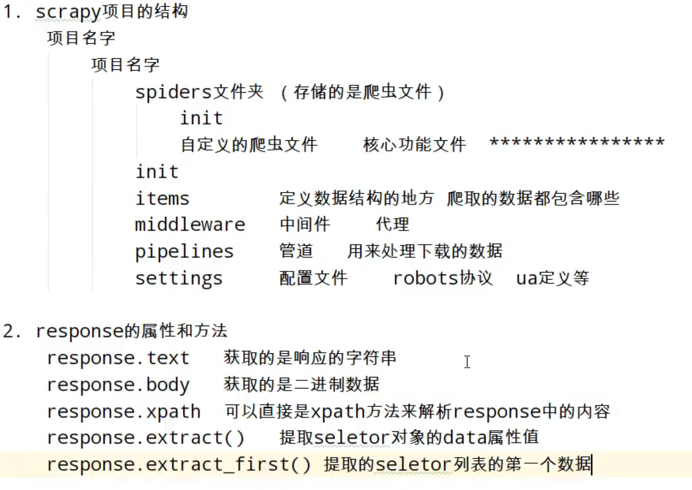
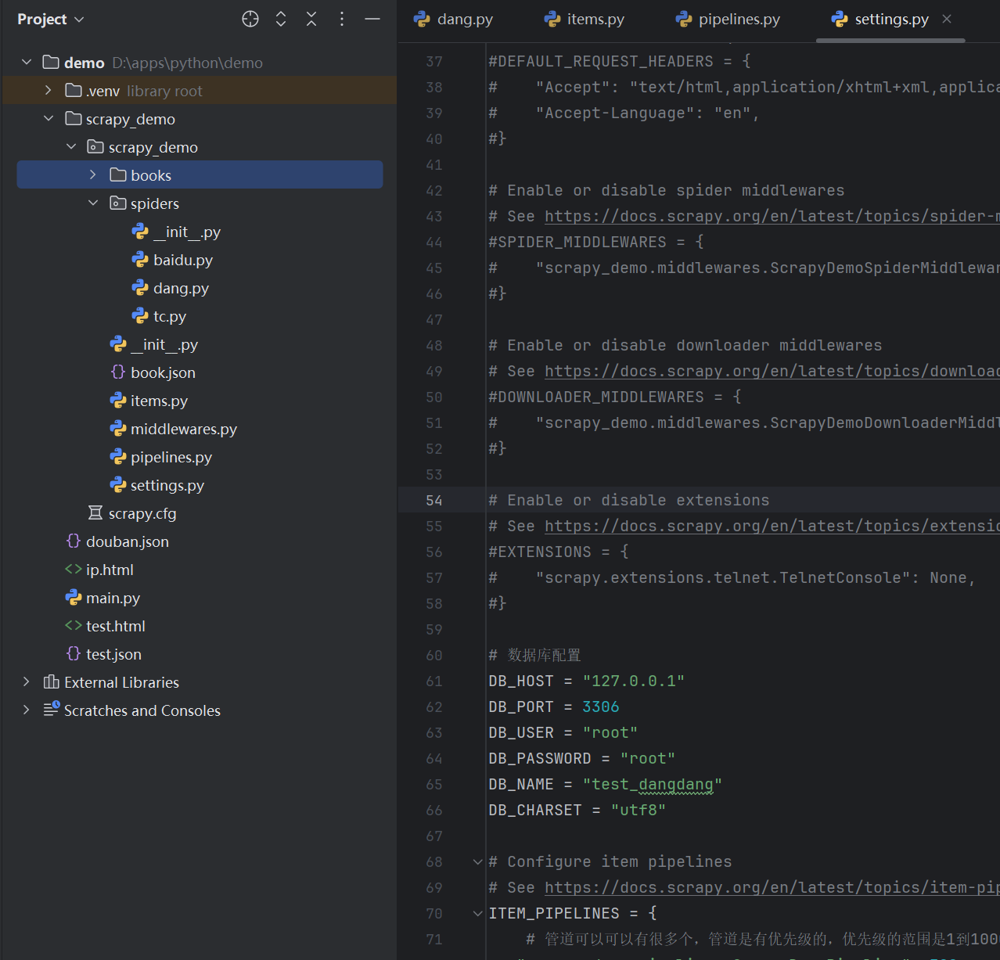

# Python学习笔记

### 基本语法

> 1. 在Python中严格区分大小写
> 2. 在Python中的每一行就是一条语句，每条语句以换行结束
> 3. Python中一条语句可以分多行编写，语句末尾以 \ 结束
> 4. Python是缩进严格的语言，所以在Python中不要随便缩进
> 5. 在Python中使用#来表示注释

### 数值类型

> 1. 整数（Python中所有整数都是int类型，Python整数大小没有限制）
>    * 如果数字过大，可以用下划线分割，如：a = 123_456_789
>    * 二进制以0b开头，如：0b10
>    * 八进制以0o开头，如：0o7
>    * 十六机制以0x开头，如：0x10
> 2. 浮点数（小数），在Python中所有小数都是float类型
> 3. 复数

### 字符串

> **注意事项：**
>
> 1. Python中的字符串，必须用引号包裹 。如 `s = 'abc'`或`s = "abc"`
>
> 2. 单引号和双引号不能跨行使用，如果要跨行，必须使用换行符连接。如：
>
>    ```python
>    s = 'abcdefg \
>    cefg'
>    
>    str = "fdfdfee \
>    fffff"
>    ```
>
> 3. 使用三重引号（3个单引号或者3个双引号都行）来表示一个长字符可以换行，并且会保留字符串中的格式。如：
>
>    ```python
>    str = '''abcdefff
>    '''
>    ```
>
> 4. 可以使用 \ 作为转义字符，在字符串中使用特殊字符
>
> **字符串格式化**
>
> 1. 可以使用print()函数，传多个参数的形式，如：print("a = ",b,c)
>
> 2. 创建字符串，可以在字符串中指定占位符
>
>    ```python
>    # %s在字符串中表示任意字符
>    # %f 浮点数占位符
>    # %d 整数占位符
>    a = "你好 %s"%"神里绫华"
>    b = "你好 %s 吃饭了吗？%s"%("胡桃","甘雨")
>    print("c = %s"%c)
>    
>    # 可以通过在字符串前添加一个f来创建一个格式化字符串
>    # 在格式化字符串中可以直接嵌入变量
>    a = '神里绫华'
>    b = '甘雨'
>    c = f'hello {a} {b}'
>    print(c)
>    ```
>
> **字符串复制**
>
> ```python
> # 将字符串与数字相乘可以完成字符串的复制
> a = "abc"
> b = a*3
> print(b) # 这里会输出abcabcabc
> ```

### 布尔值和空值

> 1. 布尔值有2个，分别是True和False，布尔值实际上也相当于整型，True相当于1，False相当于0
>
>    ```python
>    a = True
>    b = False
>    ```
>
> 2. 空值用None表示，专门用来表示不存在
>
>    ```python
>    b = None
>    ```

### 类型检查

> type()用来检查值的类型，该函数会将检查的结果作为返回值返回
>
> ```python
> a = 123
> print(type(a))
> ```
>

### 类型转换

> 类型转换的四个函数，int()  float()  str()  bool()

### 运算符

> ​	**算术运算符**
>
> 1. 加法运算符（+），如果是2个字符进行操作，会进行拼接操作
> 2. 减法运算符 ( - )
> 3. 乘法运算符 ( * ) ，如果将字符串与数字进行乘法操作，会将字符串复制指定次数，并返回一个新字符串
> 4. 除法运算符( / ) ，运算结果会返回一个浮点数类型
> 5. 整除运算符(  //  )，运算只会保留整数部分
> 6. 幂运算符 ( ** ) ，求一个值的N次幂
> 7. 取余运算符( % )
>
> **赋值运算符**
>
> 1. 赋值运算符（ =  ,  + =  , /=  , //=  ,  *=  , **=  , %= ）
>
> **关系运算符**
>
> 1. 关系运算符（>  ,   >=  , <  , <= ,  ==,  != ）
> 2. 当对字符串进行比较时，实际上比的是字符串的Unicode编码，比较2个字符串的Unicode编码是逐位比较的
> 3. 相等和不等比较的是对象的值，而不是id
> 4. is 比较2个对象是否是同一个对象，比较的是对象的id
> 5. is not 比较2个对象是否不是同一个对象
>
> **逻辑运算符**
>
> 1. not 逻辑非 (相当于其他语言 ! )
> 2. and  逻辑与 （相当于其他语言 && ）
> 3. or  逻辑或   (相当于其他语言 || )
>
> **条件运算符**
>
> 1. 语法   ： 语句1   if   条件表达式  else  语句2
> 2. 如果条件表达式结果为True则执行语句1 否则执行语句2
>
> ```python
> print("hello") if True else print("how are you?") # 这里输出的结果是hello
> ```

### 条件判断语句

> **if语句**
>
> 语法：if 条件表达式  : 语句
>
> 1. 如果条件表达式结果为True，则会执行冒号后面的语句
> 2. 默认情况下，if只会控制冒号后面的那条语句，如果希望if可以控制多条语句，则可以在if后面紧跟一个代码块
>
> ```python
> # 这里if只会控制 : 后面的1条语句
> num1 = 10
> if num1 > 20: print("num1 > 20")
> 
> # 这里 : 后面的两条语句必须使用缩进，来表示这2条语句都受if控制
> num2 = 20
> if num2 > 10:
>     print("num2 > 10")
>     print("success")
> if num2 > 10 and num2 < 20:
>     print("10 < num2 < 20")
> if 10 < num2 < 20:
>     print("10 < num2 < 20")
> ```
>
> **if-else语句**
>
> ```python
> # 语法
> # if 条件表达式 : 
> # 	代码块
> # else:
> # 	代码块
> num = int(input())
> if num > 10:
>     print("num > 10")
> else:
>     print("num <= 10")
> 
> ```

### 循环语句

> **while语句**
>
> ```python
> # 语法
> # while 条件表达式:
> # 	代码块
> i = 0
> while i < 10:
>  i += 1
>  print(i)
> 
> j = 0
> 
> # 如果while语句后接else，则退出循环后执行else后的代码块
> while j < 10:
>  j += 1
>  print(j)
> else:
>  print("退出循环")
> 
> # break可以用来立即退出循环
> k = 0
> while k < 10:
>  k += 1
>  print(k)
>  if k == 3:
>      break
> 
> # continue表示立即完成本次循环，continue后的语句不再执行
> k = 0
> while k < 10:
>  k += 1
>  if k == 3:
>      continue
>  print(k)
> ```
>
> **for语句**
>
> for 语句用于对序列（例如字符串、元组或列表）或其他可迭代对象中的元素进行迭代

### 序列

> **序列的分类**
>
> 1. 可变序列
>    * 列表【List】
> 2. 不可变序列
>    * 字符串【str】
>    * 元组 【tuple】

### 列表(list)

> 创建列表，通过[]创建一个列表【列表类似于Java中的List】
>
> ```python
> # 创建空列表
> myList = []
> 
> # 创建包含5个元素的列表
> myList2 = [1, 2, 3, 4, 5]
> print(myList2)
> 
> # 列表中可以保存任意类型的对象，但一般保存同一类型的对象
> # 列表中的对象都会按照插入的顺序有序存储到列表中
> myList3 = [1, "hello", 1.1, True, [1, 2, 3]]
> print(myList3)
> 
> # 我们可以通过索引来访问列表中的元素，如果使用的索引超出了最大范围会抛出异常
> print(myList3[1])
> 
> # len()函数可以获取列表长度
> print(len(myList3))
> 
> # 向list中添加元素
> myList.append("你")
> myList.append("好")
> print(myList)
> 
> # 截取list部分内容【切片】
> print(myList2[1:])
> ```
>
> **通用操作**
>
> ```python
> myList1 = [1, 2, 3]
> myList2 = [4, 5, 6]
> # 拼接列表
> myList3 = myList1 + myList2
> print(myList3)  # 输出[1, 2, 3, 4, 5, 6]
> # 将列表重复N次
> myList4 = myList1 * 2
> print(myList4)  # 输出 [1, 2, 3, 1, 2, 3]
> 
> # in 和 not in 检查指定元素是否存在于和不存在于列表中
> print(1 in myList1)  # 输出True
> print(2 not in myList1)  # 输出False
> 
> # len() 获取列表中元素个数
> print(len(myList1))  # 输出3
> 
> # max() 获取列表中最大值
> print(max(myList1))  # 输出3
> 
> # min() 获取列表中最小值
> print(min(myList1))  # 输出1
> 
> # index()方法，获取指定元素在列表中第一次出现的索引
> print(myList1.index(2))  # 输出1
> 
> # count()方法，统计指定元素在列表中出现的次数
> print(myList1.count(2))  # 输出1，因为这里2在列表中总共出现了1次
> 
> # 删除元素
> del myList1[2] # 删除索引为2的元素
> 
> # 通过切片修改列表，给切片赋值，必须是一个序列
> myList1[0:1]=[5, 6] # myList1变为[5,6,2,3]
> 
> # 遍历列表
> myList5 = [5, 6, 7]
> for item in myList5:
>     print(item) # 输出5 6 7
> ```

### range

> range()是一个函数，可以用来生成一个自然数序列
>
> ```python
> r = range(5)
> print(list(r))  # 输出[0, 1, 2, 3, 4]
> 
> for i in range(5):
>     print(i)  # 输出 0 1 2 3 4
> ```

### 元组(tuple)

> 元组是一个不可变序列，它的操作方式基本上跟list一样
>
> ```python
> # 创建空元组
> myTuple = ()
> myTuple = (1, 2, 3)
> print(myTuple)
> # myTuple[0] = 2 这里不能重新赋值，会报错，因为元组是不可变序列
> 
> # 当元组不为空时，括号可以省略
> myTuple1 = 1, 2, 3, 4, 5
> myTuple2 = 1,  # 当元组中只有一个元素，并且要省略括号时，必须要有一个逗号
> print(myTuple1)
> print(myTuple2)
> 
> # 元组的解构
> a, b, c, d, e = myTuple1  # 这里的变量个数和元组里面的元组个数必须一样，否则会报错
> print(a)  # 输出 1
> print(b)  # 输出 2
> print(c)  # 输出 3
> print(d)  # 输出 4
> print(e)  # 输出 5
> 
> # 交换a和b的值，可以利用元组的解构
> a, b = b, a
> print(a)
> 
> # 如果我们只想要解构元组的部分元组可以这样写，这样变量个数可以不和元组里的元素个数一样
> # 不能同时出现2个及以上的*变量
> a, b, *c = myTuple1
> *a, b, c = myTuple1
> a, *b, c = myTuple1
> ```

### ==和is

> ```python
> == 和 != 比较的是对象的值是否相等
> is 和 is not 比较的是对象的id是否相等，也就是判断是否是同一个对象
> ```

### 字典（dict）

> - 字典属于一种新的数据结构，称为映射
> - 字典的作用和列表类似，都是用来存储对象的容器【类似于Java中的Map】
>
> **基本使用**
>
> ```python
> # 创建空字典
> d = {}
> print(type(d))
> # 字典的value可以是任意对象
> # 字典的key可以是任意的不可变对象
> d1 = {'name': '神里绫华', 'age': 18, 'gender': 'female'}
> print(d1['name'])
> 
> # 可以使用dict()函数来创建字典
> d2 = dict(name='胡桃', age=18, gender='female')
> print(d2)
> 
> # 也可以将一个包含双值子序列的序列转换为字典
> d3 = dict([('name', '宵宫'), ('country', 'DaoQi')])
> print(d3)
> 
> # len()获取字典键值对个数
> print(len(d3))
> 
> # in 和 not in 检查字典中是否包含指定的key
> print('name' in d3)
> 
> # 获取字典值 这种方式获取字典值，如果key不存在会报错
> print(d3['name'])
> 
> # 获取字典值方式2 这种方式获取，如果key不存在不会报错，会返回None
> # 也可以为第二个参数设置默认值，如果找不到会返回默认值
> print(d3.get('a'))
> print(d3.get('a', '默认值'))
> 
> # 修改字典值
> d3['name'] = '雷电将军'
> print(d3)
> 
> # setDefault() ，如果字典中存在该key，则返回key的值，不会对字典做任何操作
> # 如果key不存在，会向字典中添加key，并设置值
> t = d3.setdefault('name', '八重神子')
> print(t)
> 
> # update() 将其他字典的key - value添加到当前字典中
> # 如果有重复的key，则后面的会替换前面的
> d5 = {'name': '申鹤', 'age': 16}
> d6 = {'country': 'LiYue', 'hobby': 'music'}
> d5.update(d6)
> print(d5)
> 
> # 删除字典值
> del d5['hobby']
> print(d5)
> 
> # 根据key删除字典中的key - value
> # pop(key,default) 如果没有指定默认值，如果key不存在会报错，如果指定了默认值，key不存在不会报错，而是会直接返回默认值
> t = d5.pop('country')
> print(t)
> 
> # clear() 清空字典，会删除字典中的所有key-value
> d5.clear()
> ```
>
> **遍历字典**
>
> ```python
> # keys()该方法会返回字典的所有key
> d = {'name': '甘雨', 'age': 16}
> print(d.keys())
> for k in d.keys():
>     print(d[k])
> # values()该方法会返回字典的所有value
> for v in d.values():
>     print(v)
> # items() 会返回一个包含双值子序列的序列
> for k, v in d.items():
>     print(k, '=', v)
> ```

### 集合（set）

> - 集合和列表非常相似
> - 不同点
>   - 集合只能存储不可变对象
>   - 集合中存储的对象是无序的
>   - 集合中不能出现重复元素
>
> ```python
> # 使用{}创建集合
> s = {1, 2, 3}
> print(type(s))
> 
> # 可以使用set()函数创建空集合，也可以将序列和字典转换为集合
> s1 = set()
> print(type(s1))
> 
> s2 = set([1, 2, 3, 1, 2])
> print(s2)  # 输出 {1, 2, 3}
> 
> # 使用in 和 not in 来检查集合中的元素
> print(1 in s2)
> 
> # 使用len()获取集合中元素的个数
> print(len(s2))
> 
> # add()向集合中添加元素
> s2.add(5)
> print(s2)
> 
> # update()将一个集合中的元素添加到当前集合中
> # update()可以传递序列和字典作为参数，传递字典只会加入key
> s3 = {5, 6, 8}
> s2.update(s3)
> print(s2)
> 
> # pop() 删除集合中的一个元素并返回
> t = s2.pop()
> print(t)
> 
> # remove()删除集合中的指定元素
> s2.remove(3)
> print(s2)
> 
> # clear()清空集合
> s2.clear()
> print(s2)
> 
> # copy() 对集合进行浅复制
> ```
>
> **集合的运算**
>
> ```python
> # 创建2个集合
> s1 = {1, 2, 3, 5, 8, 10}
> s2 = {1, 5, 8, 11, 12}
> 
> # 对集合求交集
> t = s1 & s2
> print(t)
> 
> # 对集合求并集
> t = s1 | s2
> print(t)
> 
> # 对集合求差集
> t = s1 - s2
> print(t)
> 
> # 异或集,即两个集合不一样的元素组成的集合
> t = s1 ^ s2
> print(t)
> 
> # <= 检查一个集合是否是另一个集合的子集
> s3 = {1, 2}
> s4 = {1, 2, 3}
> print(s3 <= s4)
> ```

### 函数

> ```python
> # 定义函数
> def fn():
>     print("hello world")
> 
> 
> # 可以为形参指定默认值
> def add(a, b=2):
>     print(a)
>     print(b)
>     print(a + b)
> 
> 
> # 不定长参数
> # 带*的形参只能有一个
> # 可变参数不是必须写在最后，但带*参数之后的参数，必须以关键字参数形式传递
> # *形参只能接收位置参数，而不能接收关键字参数
> def fn2(*a):
>     print(a)
> 
> 
> # **形参可以接收其他的关键字参数
> # **形参只能有一个，并且必须写在所有参数的最后
> def fn4(**a):
>     print(type(a))
> 
> 
> def fn3(a, *b, c):
>     print(b)
> 
> 
> # 调用函数
> fn()
> add(1, 5)
> 
> # 关键字参数，可以在调用函数时加上关键字，就可以不用按形参定义的顺序来传递参数
> add(b=5, a=1)
> 
> fn2(1, 2, 3, 5)
> 
> # 可以通过*来对元素进行解包来传递参数
> myTuple = (1, 5)
> add(*myTuple)
> 
> # 可以通过**来对字典进行解包传参
> d = {'a': 100, 'b': 200}
> add(**d)
> 
> 
> # 函数的返回值
> # 可以通过return来指定函数返回值，也可以通过一个变量来接收函数返回值
> # 如果仅仅写return后面不跟值，或者不写return相当于返回return None
> def fn6(a, b):
>     return a + b
> 
> 
> t = fn6(3, 5)
> print(t)
> ```
>

### 文档字符串

> 在定义函数时，可以在函数内部编写文档字符串，文档字符串就是函数的说明，当我们编写了文档字符串时，就可以通过help()函数来查看函数的说明
>
> ```python
> def fn(a: int, b: bool, c: str) -> int:
>    """
>    这是一个文档字符串说明
>    参数a 作用 类型:
>    参数b:
>    参数c:
>    """
> 
> 
> help(fn)
> ```
>

### 高阶函数

> 概念：接收函数作为参数，或者将函数作为返回值的函数是高阶函数，将函数作为返回值返回的函数也叫闭包
>
> ```python
> def fn(func, v):
>     func(v)
> 
> 
> def fn3(v):
>     if v % 2 == 0:
>         print("%d是偶数！" % v)
> 
> 
> fn(fn3, 2)
> ```

### 匿名函数

> lambda 表达式（有时称为 lambda 构型）被用于创建匿名函数。 表达式 lambda parameters: expression 会产生一个函数对象 。 该未命名对象的行为类似于用以下方式定义的函数:
>
> ```python
> def <lambda>(parameters):
>     return expression
> ```
>
> ```python
> myList = [1, 2, 3, 4, 5, 6]
> r = filter(lambda i: i % 3 == 0, myList)
> print(list(r))
> ```

### 装饰器

> 装饰器本质上是一个Python函数(其实就是闭包)，它可以让其他函数在不需要做任何代码变动的前提下增加额外功能，装饰器的返回值也是一个函数对象。装饰器用于有以下场景，比如:插入日志、性能测试、事务处理、缓存、权限校验等场景，装饰器可以嵌套使用
>
> ```python
> def fnA(fn):
>     def decorator(*args, **kwargs):
>         print("=========start calculate==========")
>         fn(*args, **kwargs)
>         print("==========end============")
>     return decorator
> 
> 
> @fnA
> def fnB(a, b):
>     print("a + b = ", a + b)
> 
> 
> fnB(2, 3)
> 
> ```

### 类

> **类的定义**
>
> ```python
> class Person:
> print("代码块中的代码执行！")
> 
> # 在类中可以定义一些特殊方法（魔术方法）
> # 特殊方法都是以__开头，__结尾
> # 特殊方法不需要自己调用
> 
> # 创建对象的流程
> # 1. 创建一个变量
> # 2. 在内存中创建一个新对象
> # 3. 执行类的代码块中的代码（实际上不创建对象也会执行代码块中的代码，这个属于类的固有属性，定义类的时候就会执行）
> # 4. __init__(self)方法执行
> # 5. 将对象的id复制给变量
> def __init__(self, name, age, city, address):
>   self.name = name
>   self.age = age
>   # 以双下划线开头的属性表示隐藏属性，不能在类外部访问
>   # 一把以下划线开头的属性都是私有属性
>   self.__address = address
>   self._city = city
> 
> def getAddress(self):
>   return self.__address
> 
> def setAddress(self, address):
>   self.__address = address
> 
> # 这里的self相当于其他语言的this指针
> def sayHello(self):
>   print(self.name + "hello")
> 
> # 添加property装饰器之后，可以像调用属性一样，使用get方法
> @property
> def city(self):
>   print("get方法执行了----")
>   return self._city
> 
> # setter方法装饰器 @属性名.setter
> @city.setter
> def city(self, city):
>   print("set 方法执行了=====")
>   self._city = city
> 
> 
> p1 = Person("宵宫", 16, "稻妻城", "稻妻")
> # 实际上以__开头的属性也能在类外部访问(通过_类名__属性名访问)
> print(p1._Person__address)
> 
> 
> print(p1.getAddress())
> p2 = Person("影", 18, "海祇岛", "稻妻")
> p2.setAddress("璃月")
> print(p2.getAddress())
> 
> p1.sayHello()
> p2.sayHello()
> 
> p1.city = "蒙德城"
> print(p1.city)
> 
> ```
>
> **类的继承**
>
> ```python
> class Animal:
>  def run(self):
>      print("animal run")
> 
>  def sleep(self):
>      print("animal sleep")
> 
> 
> class Dog(Animal):
>  def bark(self):
>      print("dog bark")
> 
> 
> d = Dog()
> d.run()
> d.bark()
> # 检查对象是否是某个类的实例
> print(isinstance(d, Animal))
> # 检查是否是某个类的子类
> print(issubclass(Dog, object))
> ```
>
> **方法重写**
>
> ```python
> class Animal:
>  def __init__(self, name):
>      self._name = name
> 
>  def run(self):
>      print("animal run")
> 
>  def sleep(self):
>      print("animal sleep")
> 
> 
> class Dog(Animal):
>  def __init__(self, name, age):
>      # super()可以获取当前类的父类，并且通过super()返回对象调用父类方法不需要传递self
>      super().__init__(name)
>      self._age = age
> 
>  def run(self):
>      print("dog run")
> 
>  def bark(self):
>      print("dog bark")
> 
> 
> d = Dog(" 旺财", 5)
> d.sleep()
> d.run()
> ```
>
> **多继承**
>
> ```python
> class A:
>  def test(self):
>      print("A test")
> 
> 
> class B:
>  def test(self):
>      print("B test")
> 
>  def test2(self):
>      print("B test2")
> 
> 
> # C继承多个类A,B
> class C(A, B):
>  pass
> 
> 
> obj = C()
> # 输出A test，多重继承，如果多个父类有同名的方法，则会在出现的第一个父类中找，前面的会覆盖后面的
> obj.test()
> obj.test2()
> ```
>
> **类的属性和方法**
>
> ```python
> class A:
>  # 类属性（类似Java静态属性）
>  name = "神里绫华"
> 
>  def __init__(self, name):
>      # 实例属性
>      self._name = name
> 
>  # 类方法，类方法的第一个参数是cls ，也会被自动传递,cls就是当前的类对象
>  @classmethod
>  def test(cls):
>      print("class method")
> 
>  # 静态方法基本上是和当前类无关的方法，静态方法一般是工具方法
>  @staticmethod
>  def test2():
>      print("static method")
> 
>  # 实例方法
>  def test3(self):
>      print("test3")
> 
> 
> a = A()
> a.test()
> A.test()
> A.test2()
> a.test2()
> ```
>
> **特殊方法（魔术方法）**
>
> ```python
> class A:
> 
>     # 类似java构造方法
>     def __init__(self, name, age):
>         print("init")
>         self.name = name
>         self.age = age
> 
>     # 类似Java的toString方法
>     def __str__(self):
>         print("straaa")
>         return "str method"
> 
>     # 比较对象的大小
>     def __gt__(self, other):
>         return self.age > other.age
> 
> 
> a1 = A("神里绫华", 18)
> a2 = A("胡桃", 16)
> print(a1)
> print(a1 > a2)
> ```

### 模块(module)

> **模块化简介**
>
> 模块化是指将一个完整的程序分解成多个小模块，通过将模块组合来搭建一个完整的程序
>
> 模块化的优点：
>
> 1. 方便多人协同开发
> 2. 方便维护
> 3. 模块可以复用
>
> 在python中，一个py文件就是一个模块，要想创建一个模块，实际上就是创建一个python文件
>
> 注意：模块名要符合标识符规范
>
> **引入模块**
>
> 在一个模块中引入外部模块
>
> 1. import  模块名 （模块名就是python文件名，不需要.py）
> 2. import 模块名 as 模块别名
> 3. `__name__`值为`__main__`的模块为主模块，一个程序中只有一个主模块
> 4. 也可以只引入模块中的部分内容  `from m import test`
> 5. 引入模块中的多个内容`from m import Person,test`
> 6. 引入模块所有内容：`from m import *`
>
> 代码示例：
>
> test_module.py
>
> ```python
> a = 10
> b = 20
> 
> 
> def fn1():
>     print("test_module fn1")
> ```
>
> main.py
>
> ```python
> import test_module as test
> print(test.__name__)
> print(__name__)
> 
> # 访问模块中的变量和函数
> print(test.a)
> print(test.b)
> test.fn1()
> ```

### 包

> **基础概念**
>
> 包也是一个模块，当我们模块中代码过多时，或者一个模块需要分解为多个模块时，这时就需要使用包，普通的模块是一个py文件，而包是一个文件夹
>
> 包中必须要有一个文件`__init__.py`，这个文件中可以包含包中的主要内容
>
> 包的结构
>
> 
>
> 代码示例：
>
> ```python
> # main.py
> from utils import DateUtils, StrUtils
> 
> DateUtils.getTime()
> StrUtils.getStr()
> ```
>
> ```python
> # utils/__init__.py
> init_a = 10
> init_b = 20
> ```
>
> ```python
> # utils/DateUtils.py
> def getTime():
>     print("now time")
> ```
>
> ```python
> # utils/StrUtils.py
> def getStr():
>     print("get str")
> ```
>
> 

### 异常

> **基本概念**
>
> 程序在运行中不可避免的会出现一些错误，比如：
>
> 1. 使用了没有赋值过的变量
> 2. 使用了不存在的索引
> 3. 除0
>
> 这些错误我们称之为异常
>
> **处理异常**
>
> 程序运行时出现异常，目的并不是让我们的程序直接终止，我们希望在出现异常时，编写代码对异常进行处理
>
> 格式：
>
> ```python
> try:
>     代码块(可能出现错误的语句)
> except: #这里可以出现多个except捕获各种异常
>     代码块(出现错误之后的处理方式)
> else:(可选)
>     代码块(没出错要执行的语句)
> finally:(可选)
>     代码块(无论是否出现错误，都会执行的代码块)
> ```
>
> ```python
> try:
>     a = 10 / 0
> except Exception as e:
>     print("error")
>     print(e)
> else:
>     print("success")
> finally:
>     print("finally")
> ```
>
> **异常传播**
>
> 当在函数中出现异常时，如果在函数中对异常进行了处理，则异常不会再继续传播，否则异常会继续向外层传播，如果到全局作用域依然没有进行处理，则程序终止，并显示异常信息
>
> **自定义异常**
>
> ```python
> # 自定义异常类，只需要创建一个类继承Exception即可
> class MyError(Exception):
>     pass
> 
> 
> def add(a, b):
>     # 如果a或者b有负数，则抛出异常
>     if a < 0 or b < 0:
>         raise MyError("参数不能有负数")
>     r = a + b
>     return r
> 
> 
> try:
>     result = add(1, -1)
> except MyError as e:
>     print(e)
>     print(type(e))
> 
> ```

### 文件操作

> **文件读取**
>
> ```python
> """
> 绝对路径
> 
> file_name = 'D:/webapp/python/demo/1.txt'
> 
> 在前面加 r 可以把转义字符转为普通字符
> file_name = r'D:\webapp\python\demo\1.txt'
> 
> """
> 
> """
> 普通打开文件和关闭文件
> file_name = "1.txt"
> fd = open(file_name, encoding='utf-8')
> content = fd.read()
> print(content)
> fd.close()
> fd.read()
> """
> 
> # 使用with...as语句不需要手动关闭文件
> # open打开文件，默认是以只读文本文件方式打开的
> file_name = "1.txt"
> with open(file_name, encoding='utf-8') as fd:
>  # read默认参数是-1，读取所有内容
>  # content = fd.read()
>  # print(content)
>  chunk = 4
>  while True:
>      content = fd.read(chunk)
>      if not content:
>          break
>      print(content, end='')
> print("")
> print("============")
> 
> with open(file_name, encoding='utf-8') as fd1:
>  # readline用于读取一行内容
>  c1 = fd1.readline()
>  print(c1, end='')
> 
> 
> print("")
> print("============")
> 
> with open(file_name, encoding='utf-8') as fd2:
>  # readlines用于读取所有行的内容，并将每一行的内容放入一个列表中，每行的内容作为列表中的一个元素
>  list1 = fd2.readlines()
>  print(list1)
> ```
>
> **文件写入**
>
> ```python
> file_name = "1.txt"
> # mode = a 表示以追加方式打开文件
> with open(file_name, mode='a', encoding='utf-8') as fd:
>  r = fd.write(",八重神子")
>  # 这里的r是写入的字符个数
>  print(r)
> ```
>
> **二进制文件读取和写入**
>
> ```python
> file_name = "1.jpg"
> # mode = rb表示读取二进制文件
> with open(file_name, mode='rb') as fd:
>  file_name2 = "2.jpg"
>  with open(file_name2, mode="wb") as fd2:
>      # 定义每次读取大小
>      chunk = 1024
>      while True:
>          # 读取文件内容
>          content = fd.read(chunk)
>          # 如果内容为空则退出循环
>          if not content:
>              break
>          # 将读取的内容写入新文件
>          fd2.write(content)
> ```
>
> **从指定位置读取**
>
> ```python
> from io import SEEK_SET
> 
> file_name = "1.txt"
> with open(file_name, mode='rb') as fd:
>     # print(fd.read(5))
>     # tell()方法可以查看当前读取的位置
>     print("当前读取的位置：", fd.tell())
>     # seek()修改当前读取位置
>     # seek()有2个参数，第一个参数是读取位置，第二个参数是计算位置的参数，可选项有
>     # SEEK_SET(默认值):表示从头开始  SEEK_CUR:从当前位置开始  SEEK_END:从最后位置开始计算
>     fd.seek(10, SEEK_SET)
>     print(fd.read(5))
>     print("当前读取的位置：", fd.tell())
> ```
>
> **文件的其他操作**
>
> ```python
> import os
> from pprint import pprint
> # 获取指定目录的目录结构
> r = os.listdir("./")
> pprint(r)
> # 获取当前所在的目录
> r1 = os.getcwd()
> pprint(r1)
> ```
>

### HTTP请求

> **GET请求**
>
> ```python
> import urllib.request
> import urllib.parse
> 
> url = 'https://www.baidu.com/s?'
> headers = {
> 'User-Agent': 'Mozilla/5.0 (Windows NT 10.0; Win64; x64) AppleWebKit/537.36 (KHTML, like Gecko) Chrome/139.0.0.0 Safari/537.36'
> }
> data = {
> 'wd': '周杰伦',
> 'job': '歌手',
> 'type': 1
> }
> data = urllib.parse.urlencode(data)
> url = url + data
> request = urllib.request.Request(url=url, headers=headers)
> response = urllib.request.urlopen(request)
> content = response.read().decode('utf-8')
> print(content)
> ```
>
> **POST请求**
>
> ```python
> import urllib.request
> import urllib.parse
> import json
> 
> url = 'https://fanyi.baidu.com/sug'
> headers = {
> 'User-Agent': 'Mozilla/5.0 (Windows NT 10.0; Win64; x64) AppleWebKit/537.36 (KHTML, like Gecko) Chrome/139.0.0.0 Safari/537.36'
> }
> data = {
> 'kw': 'spider'
> }
> # POST请求，参数必修要进行编码成字节数据
> data = urllib.parse.urlencode(data).encode('utf-8')
> request = urllib.request.Request(url=url,data=data,headers=headers)
> response = urllib.request.urlopen(request)
> content = response.read().decode('utf-8')
> 
> obj = json.loads(content)
> print(obj)
> ```
>
> **AJAX GET请求**
>
> ```python
> import urllib.request
> import urllib.parse
> 
> 
> def create_request(page_no):
> base_url = 'https://movie.douban.com/j/chart/top_list?type=5&interval_id=100%3A90&action=&'
> data = {
> 'start': (page_no - 1) * 20,
> 'limit': 20
> }
> data = urllib.parse.urlencode(data)
> url = base_url + data
> headers = {
> 'User-Agent': 'Mozilla/5.0 (Windows NT 10.0; Win64; x64) AppleWebKit/537.36 (KHTML, like Gecko) Chrome/139.0.0.0 Safari/537.36'
> }
> req = urllib.request.Request(url=url, headers=headers)
> return req
> 
> 
> def get_content(req):
> response = urllib.request.urlopen(req)
> c = response.read().decode('utf-8')
> return c
> 
> if __name__ == '__main__':
> start_page = int(input('请输入起始页码：'))
> end_page = int(input('请输入结束页码：'))
> 
> for page in range(start_page,end_page + 1):
> request = create_request(page)
> content = get_content(request)
> print(content)
> ```
>
> **AJAX POST请求**
>
> ```python
> import urllib.request
> import urllib.parse
> 
> 
> def create_request(page_no):
> url = 'https://www.kfc.com.cn/kfccda/ashx/GetStoreList.ashx?op=cname'
> data = {
> 'cname' : '深圳',
> 'pid': '',
> 'pageIndex': page_no,
> 'pageSize': 10
> }
> data = urllib.parse.urlencode(data).encode('utf-8')
> headers = {
> 'User-Agent': 'Mozilla/5.0 (Windows NT 10.0; Win64; x64) AppleWebKit/537.36 (KHTML, like Gecko) Chrome/139.0.0.0 Safari/537.36'
> }
> req = urllib.request.Request(url=url, data=data,headers=headers)
> return req
> 
> 
> def get_content(req):
> response = urllib.request.urlopen(req)
> c = response.read().decode('utf-8')
> return c
> 
> if __name__ == '__main__':
> start_page = int(input('请输入起始页码：'))
> end_page = int(input('请输入结束页码：'))
> 
> for page in range(start_page,end_page + 1):
> request = create_request(page)
> content = get_content(request)
> print(content)
> ```
>
> **异常捕获**
>
> ```python
> import urllib.request
> import urllib.error
> 
> 
> url = 'https://blog.csdn.net/yyz_1987/article/details/1480188651'
> headers = {
> 'User-Agent':'Mozilla/5.0 (Windows NT 10.0; Win64; x64) AppleWebKit/537.36 (KHTML, like Gecko) Chrome/89.0.4389.90 Safari/537.36'
> }
> 
> try :
> request = urllib.request.Request(url=url,headers=headers)
> response = urllib.request.urlopen(request)
> content = response.read().decode('utf-8')
> print(content)
> except urllib.error.HTTPError as e:
> print('链接出错')
> print(e)
> except urllib.error.URLError as e:
> print('请求出错')
> print(e)
> ```
>
> **代理访问**
>
> ```python
> import urllib.request
> import urllib.error
> import random
> 
> 
> url = 'https://qifu-api.baidubce.com/ip/local/geo/v1/district?'
> headers = {
> 'User-Agent':'Mozilla/5.0 (Windows NT 10.0; Win64; x64) AppleWebKit/537.36 (KHTML, like Gecko) Chrome/89.0.4389.90 Safari/537.36'
> }
> 
> request = urllib.request.Request(url=url, headers=headers)
> # 获取handler对象
> proxies_pool = [
> {'https':'117.86.91.234:19110'},
> {'https':'114.232.3.79:23425'},
> {'https':'117.86.203.242:20973'}
> ]
> 
> proxies = random.choice(proxies_pool)
> 
> handler = urllib.request.ProxyHandler(proxies=proxies)
> # 获取opener对象
> opener = urllib.request.build_opener(handler)
> # 调用open方法
> response = opener.open(request)
> content = response.read().decode('utf-8')
> print(content)
> with open('ip.html', 'w', encoding='utf-8') as fp:
> fp.write(content)
> ```
>
> **xpath**
>
> ```python
> import urllib.request
> import urllib.error
> import random
> from lxml import etree
> 
> 
> url = 'https://www.sixyin.com/'
> headers = {
> 'User-Agent':'Mozilla/5.0 (Windows NT 10.0; Win64; x64) AppleWebKit/537.36 (KHTML, like Gecko) Chrome/89.0.4389.90 Safari/537.36'
> }
> 
> request = urllib.request.Request(url=url, headers=headers)
> # 获取handler对象
> proxies_pool = [
> {'http':'117.86.91.234:19110'},
> {'http':'114.232.3.79:23425'},
> {'http':'117.86.203.242:20973'}
> ]
> 
> proxies = random.choice(proxies_pool)
> 
> handler = urllib.request.ProxyHandler(proxies=proxies)
> # 获取opener对象
> opener = urllib.request.build_opener(handler)
> # 调用open方法
> response = opener.open(request)
> content = response.read().decode('utf-8')
> 
> tree = etree.HTML(content)
> result = tree.xpath('//posts//h2[@class="item-heading"]/a/text()')
> print(result)
> ```
>
> **jsonpath**
>
> ```python
> import json
> import urllib.request
> import urllib.error
> import random
> import jsonpath
> 
> url = 'https://www.taopiaopiao.com/cityAction.json?activityId&_ksTS=1757058776310_124&jsoncallback=jsonp125&action=cityAction&n_s=new&event_submit_doGetAllRegion=true'
> headers = {
> 'User-Agent': 'Mozilla/5.0 (Windows NT 10.0; Win64; x64) AppleWebKit/537.36 (KHTML, like Gecko) Chrome/89.0.4389.90 Safari/537.36',
> 'cookie': 'cna=3oNBId1DdTwBASQOA7KU6M6H; xlly_s=1; isg=BFpa8Ps-5u8Wp2pDAZxj8oTvqwB8i95lmus2ZWTSw-241_oRTBjKdWwpo6PLB1b9',
> 'referer': 'https://www.taopiaopiao.com/?tbpm=3'
> }
> 
> request = urllib.request.Request(url=url, headers=headers)
> # 获取handler对象
> proxies_pool = [
> {'http': '117.86.91.234:19110'},
> {'http': '114.232.3.79:23425'},
> {'http': '117.86.203.242:20973'}
> ]
> 
> proxies = random.choice(proxies_pool)
> 
> handler = urllib.request.ProxyHandler(proxies=proxies)
> # 获取opener对象
> opener = urllib.request.build_opener(handler)
> # 调用open方法
> response = opener.open(request)
> content = response.read().decode('utf-8')
> content = content.split('(')[1].split(')')[0]
> with open('test.json', 'w', encoding='utf-8') as fp:
> fp.write(content)
> 
> obj = json.load(open('test.json', encoding='utf-8'))
> 
> city_list = jsonpath.jsonpath(obj, '$..regionName')
> print(city_list)
> ```
>
> **requests库基本使用**
>
> ```python
> import requests
> 
> url = 'http://www.baidu.com'
> response = requests.get(url=url)
> # 设置响应编码格式
> response.encoding = 'utf-8'
> print(type(response))
> # 以字符串形式返回网页源码
> # print(response.text)
> # 返回url
> print(response.url)
> # 返回二进制数据
> print(response.content)
> # 返回状态码
> print(response.status_code)
> # 响应头
> print(response.headers)
> ```
>
> **requests get请求**
>
> ```python
> import requests
> 
> url = 'http://www.baidu.com/s'
> 
> headers = {
>     'User-Agent': 'Mozilla/5.0 (Windows NT 10.0; Win64; x64) AppleWebKit/537.36 (KHTML, like Gecko) Chrome/139.0.0.0 Safari/537.36'
> }
> 
> data = {
>     'wd': '北京'
> }
> 
> response = requests.get(url=url,params=data, headers=headers)
> 
> content = response.text
> print(content)
> ```
>
> **requests post请求**
>
> ```python
> import requests
> import json
> 
> url = 'https://fanyi.baidu.com/sug'
> 
> headers = {
>     'User-Agent': 'Mozilla/5.0 (Windows NT 10.0; Win64; x64) AppleWebKit/537.36 (KHTML, like Gecko) Chrome/139.0.0.0 Safari/537.36'
> }
> 
> data = {
>     'kw': 'egg'
> }
> 
> response = requests.post(url=url,data=data, headers=headers)
> 
> content = response.text
> print(content)
> 
> obj = response.json()
> print(obj)
> ```
>
>  **requests 代理**
>
> ```python
> import requests
> 
> url = 'http://www.baidu.com/s'
> 
> headers = {
>     'User-Agent': 'Mozilla/5.0 (Windows NT 10.0; Win64; x64) AppleWebKit/537.36 (KHTML, like Gecko) Chrome/139.0.0.0 Safari/537.36'
> }
> 
> data = {
>     'wd': 'ip'
> }
> 
> proxy = {
>     'http': '121.226.32.88:18541'
> }
> 
> response = requests.get(url=url,params=data, headers=headers,proxies=proxy)
> 
> content = response.text
> print(content)
> ```

### scrapy

##### 创建项目

> ```python
> scrapy startproject 项目名称
> ```

##### 创建爬虫文件

> ```python
> scrapy genspider 爬虫文件的名字 要爬取的网页
> 示例： scrapy genspider baidu www.baidu.com
> ```
>
> **示例文件**
>
> baidu.py
>
> ```python
> import scrapy
> 
> 
> class BaiduSpider(scrapy.Spider):
>     # 爬虫名
>     name = "baidu"
>     # 允许的域名
>     allowed_domains = ["www.baidu.com"]
>     # 起始URL
>     start_urls = ["http://www.baidu.com"]
> 
>     # 执行了start_urls之后执行的方法，方法中的response参数就是请求返回的响应对象
>     def parse(self, response):
>         print("-----=======================爬取网页完毕=====================----")
>         print(response.text)
> 
> ```

##### 运行爬虫代码

> ```python
> scrapy crawl 爬虫名 ，上面代码中BaiduSpider方法的name的赋值
> ```
>
> 运行爬虫，需要将settings.py文件中的遵守robots协议改为False
>
> ROBOTSTXT_OBEY = False
>
> ```python
> # Scrapy settings for scrapy_demo project
> #
> # For simplicity, this file contains only settings considered important or
> # commonly used. You can find more settings consulting the documentation:
> #
> #     https://docs.scrapy.org/en/latest/topics/settings.html
> #     https://docs.scrapy.org/en/latest/topics/downloader-middleware.html
> #     https://docs.scrapy.org/en/latest/topics/spider-middleware.html
> 
> BOT_NAME = "scrapy_demo"
> 
> SPIDER_MODULES = ["scrapy_demo.spiders"]
> NEWSPIDER_MODULE = "scrapy_demo.spiders"
> 
> ADDONS = {}
> 
> 
> # Crawl responsibly by identifying yourself (and your website) on the user-agent
> #USER_AGENT = "scrapy_demo (+http://www.yourdomain.com)"
> 
> # Obey robots.txt rules
> # ROBOTSTXT_OBEY = True
> ROBOTSTXT_OBEY = False
> 
> # Concurrency and throttling settings
> #CONCURRENT_REQUESTS = 16
> CONCURRENT_REQUESTS_PER_DOMAIN = 1
> DOWNLOAD_DELAY = 1
> 
> # Disable cookies (enabled by default)
> #COOKIES_ENABLED = False
> 
> # Disable Telnet Console (enabled by default)
> #TELNETCONSOLE_ENABLED = False
> 
> # Override the default request headers:
> #DEFAULT_REQUEST_HEADERS = {
> #    "Accept": "text/html,application/xhtml+xml,application/xml;q=0.9,*/*;q=0.8",
> #    "Accept-Language": "en",
> #}
> 
> # Enable or disable spider middlewares
> # See https://docs.scrapy.org/en/latest/topics/spider-middleware.html
> #SPIDER_MIDDLEWARES = {
> #    "scrapy_demo.middlewares.ScrapyDemoSpiderMiddleware": 543,
> #}
> 
> # Enable or disable downloader middlewares
> # See https://docs.scrapy.org/en/latest/topics/downloader-middleware.html
> #DOWNLOADER_MIDDLEWARES = {
> #    "scrapy_demo.middlewares.ScrapyDemoDownloaderMiddleware": 543,
> #}
> 
> # Enable or disable extensions
> # See https://docs.scrapy.org/en/latest/topics/extensions.html
> #EXTENSIONS = {
> #    "scrapy.extensions.telnet.TelnetConsole": None,
> #}
> 
> # Configure item pipelines
> # See https://docs.scrapy.org/en/latest/topics/item-pipeline.html
> #ITEM_PIPELINES = {
> #    "scrapy_demo.pipelines.ScrapyDemoPipeline": 300,
> #}
> 
> # Enable and configure the AutoThrottle extension (disabled by default)
> # See https://docs.scrapy.org/en/latest/topics/autothrottle.html
> #AUTOTHROTTLE_ENABLED = True
> # The initial download delay
> #AUTOTHROTTLE_START_DELAY = 5
> # The maximum download delay to be set in case of high latencies
> #AUTOTHROTTLE_MAX_DELAY = 60
> # The average number of requests Scrapy should be sending in parallel to
> # each remote server
> #AUTOTHROTTLE_TARGET_CONCURRENCY = 1.0
> # Enable showing throttling stats for every response received:
> #AUTOTHROTTLE_DEBUG = False
> 
> # Enable and configure HTTP caching (disabled by default)
> # See https://docs.scrapy.org/en/latest/topics/downloader-middleware.html#httpcache-middleware-settings
> #HTTPCACHE_ENABLED = True
> #HTTPCACHE_EXPIRATION_SECS = 0
> #HTTPCACHE_DIR = "httpcache"
> #HTTPCACHE_IGNORE_HTTP_CODES = []
> #HTTPCACHE_STORAGE = "scrapy.extensions.httpcache.FilesystemCacheStorage"
> 
> # Set settings whose default value is deprecated to a future-proof value
> FEED_EXPORT_ENCODING = "utf-8"
> 
> ```

##### 项目结构

> 项目结构图示
>
> 
>
> 代码示例：
>
> ```python
> import scrapy
> 
> 
> class TcSpider(scrapy.Spider):
>     # 爬虫名
>     name = "tc"
>     # 允许的域名
>     allowed_domains = ["cn.58.com"]
>     # 起始URL
>     start_urls = ["https://cn.58.com/sou/?key=%E5%B1%B1%E4%B8%9C%E8%8F%8F%E6%B3%BD&classpolicy=classify_E%2Cuuid_nJNstmFBBbzaPm6WymaHXFEFD36FtMsE%2Chit_composition&search_uuid=nJNstmFBBbzaPm6WymaHXFEFD36FtMsE&search_type=input"]
> 
>     # 执行了start_urls之后执行的方法，方法中的response参数就是请求返回的响应对象
>     def parse(self, response):
>         print("======================================================")
>         # 字符串形式返回网页源码
>         # content = response.text
>         # print(content)
>         # 二进制数据
>         # content = response.body
>         # print(content)
>         content = response.xpath('//div[@class="main"]//span/text()')
>         content2 = response.xpath('//div[@class="main"]//input/@value')
>         print(content)
>         print(content2)
> 
> ```
>

##### 爬虫示例

> dang.py
>
> ```python
> import scrapy
> from scrapy_demo.items import ScrapyDemoItem
> from scrapy.linkextractors import LinkExtractor
> from scrapy.spiders import CrawlSpider, Rule
> 
> class DangSpider(scrapy.Spider):
>     # 爬虫名
>     name = "dang"
>     # 允许的域名
>     allowed_domains = ["dangdang.com"]
>     # 起始URL
>     start_urls = ["https://category.dangdang.com/cp01.01.02.00.00.00.html"]
> 
>     # 链接提取器规则
>     # rules = [
>     #     Rule(LinkExtractor(allow=r'//product.dangdang.com/\d+\.html'), callback='parse', follow=True)
>     # ]
> 
>     base_url = 'https://category.dangdang.com/pg'
>     page = 1
> 
>     def parse(self, response):
>         print('===================================================')
>         li_list = response.xpath('//ul[@id="component_59"]/li')
>         for li in li_list:
>             src = li.xpath('.//img/@data-original').extract_first()
>             if src:
>                 src = src
>             else:
>                 src = li.xpath('.//img/@src').extract_first()
>             name = li.xpath('.//img/@alt').extract_first()
>             price = li.xpath('.//p[@class="price"]/span[1]/text()').extract_first()
>             print(src,name,price)
> 
>             book = ScrapyDemoItem(src=src, name=name, price=price)
>             # 获取一个book就将book交给pipelines
>             yield book
> 
>             if self.page <= 3:
>                 self.page += 1
>                 url = self.base_url + str(self.page) + '-cp01.01.02.00.00.00.html'
>                 yield scrapy.Request(url=url, callback=self.parse)
> ```
>
> items.py
>
> ```python
> # Define here the models for your scraped items
> #
> # See documentation in:
> # https://docs.scrapy.org/en/latest/topics/items.html
> 
> import scrapy
> 
> 
> class ScrapyDemoItem(scrapy.Item):
>     # define the fields for your item here like:
>     # name = scrapy.Field()
> 
>     # 图片
>     src = scrapy.Field()
>     # 名字
>     name = scrapy.Field()
>     # 价格
>     price = scrapy.Field()
> 
> ```
>
> pipelines.py
>
> ```python
> # Define your item pipelines here
> #
> # Don't forget to add your pipeline to the ITEM_PIPELINES setting
> # See: https://docs.scrapy.org/en/latest/topics/item-pipeline.html
> 
> 
> # useful for handling different item types with a single interface
> from itemadapter import ItemAdapter
> from pymysql import connect
> 
> 
> # 如果想使用管道的话，那么就必须在settings中开启管道
> class ScrapyDemoPipeline:
> 
>     # 爬虫请求之前执行的方法
>     def open_spider(self, spider):
>         self.fp = open('book.json','w',encoding='utf-8')
> 
>     # item就是yield后面的book对象
>     def process_item(self, item, spider):
>         # 这种模式不推荐，因为每传递过来一个对象，就会打开一次文件，对文件操作频繁，效率会下降
>         # with open('book.json','a',encoding='utf-8') as fp:
>         #     fp.write(str(item))
>         self.fp.write(str(item))
>         return item
>     # 爬虫请求关闭之后执行的方法
>     def close_spider(self, spider):
>         print('-----------------------------------------')
> 
> 
> import urllib.request
> class ScrapyDemoDownloadPipeline:
> 
>     def process_item(self, item, spider):
>         url = 'https:' + item.get('src')
>         filename = './books/' + item.get('name') + '.jpg'
>         urllib.request.urlretrieve(url, filename)
>         return item
> 
> 
> from scrapy.utils.project import get_project_settings
> import pymysql
> class ScrapyDemoMysqlPipeline:
>     def open_spider(self, spider):
>         settings = get_project_settings()
>         self.host = settings['DB_HOST']
>         self.port = settings['DB_PORT']
>         self.user = settings['DB_USER']
>         self.password = settings['DB_PASSWORD']
>         self.name = settings['DB_NAME']
>         self.charset = settings['DB_CHARSET']
> 
>         self.connect()
> 
>     def connect(self):
>         self.conn = pymysql.connect(host=self.host, port=self.port, user=self.user, password=self.password,
>                                   database=self.name, charset=self.charset)
>         self.cursor = self.conn.cursor()
> 
>     def process_item(self, item, spider):
>         sql = 'insert into book(name,src,price) values ("{}","{}","{}")'.format(item['name'],item['src'],item['price'])
>         self.cursor.execute(sql)
>         self.conn.commit()
>         return item
> 
>     def close_spider(self, spider):
>         self.cursor.close()
>         self.conn.close()
> 
> ```
>
> settings.py
>
> ```python
> # Scrapy settings for scrapy_demo project
> #
> # For simplicity, this file contains only settings considered important or
> # commonly used. You can find more settings consulting the documentation:
> #
> #     https://docs.scrapy.org/en/latest/topics/settings.html
> #     https://docs.scrapy.org/en/latest/topics/downloader-middleware.html
> #     https://docs.scrapy.org/en/latest/topics/spider-middleware.html
> 
> BOT_NAME = "scrapy_demo"
> 
> SPIDER_MODULES = ["scrapy_demo.spiders"]
> NEWSPIDER_MODULE = "scrapy_demo.spiders"
> 
> ADDONS = {}
> 
> 
> # Crawl responsibly by identifying yourself (and your website) on the user-agent
> #USER_AGENT = "scrapy_demo (+http://www.yourdomain.com)"
> 
> # Obey robots.txt rules
> # ROBOTSTXT_OBEY = True
> ROBOTSTXT_OBEY = False
> 
> # Concurrency and throttling settings
> #CONCURRENT_REQUESTS = 16
> CONCURRENT_REQUESTS_PER_DOMAIN = 1
> DOWNLOAD_DELAY = 1
> 
> # Disable cookies (enabled by default)
> #COOKIES_ENABLED = False
> 
> # Disable Telnet Console (enabled by default)
> #TELNETCONSOLE_ENABLED = False
> 
> # Override the default request headers:
> #DEFAULT_REQUEST_HEADERS = {
> #    "Accept": "text/html,application/xhtml+xml,application/xml;q=0.9,*/*;q=0.8",
> #    "Accept-Language": "en",
> #}
> 
> # Enable or disable spider middlewares
> # See https://docs.scrapy.org/en/latest/topics/spider-middleware.html
> #SPIDER_MIDDLEWARES = {
> #    "scrapy_demo.middlewares.ScrapyDemoSpiderMiddleware": 543,
> #}
> 
> # Enable or disable downloader middlewares
> # See https://docs.scrapy.org/en/latest/topics/downloader-middleware.html
> #DOWNLOADER_MIDDLEWARES = {
> #    "scrapy_demo.middlewares.ScrapyDemoDownloaderMiddleware": 543,
> #}
> 
> # Enable or disable extensions
> # See https://docs.scrapy.org/en/latest/topics/extensions.html
> #EXTENSIONS = {
> #    "scrapy.extensions.telnet.TelnetConsole": None,
> #}
> 
> # 数据库配置
> DB_HOST = "127.0.0.1"
> DB_PORT = 3306
> DB_USER = "root"
> DB_PASSWORD = "root"
> DB_NAME = "test_dangdang"
> DB_CHARSET = "utf8"
> 
> # Configure item pipelines
> # See https://docs.scrapy.org/en/latest/topics/item-pipeline.html
> ITEM_PIPELINES = {
>     # 管道可以可以有很多个，管道是有优先级的，优先级的范围是1到1000，值越小，优先级越高
>    "scrapy_demo.pipelines.ScrapyDemoPipeline": 300,
>    "scrapy_demo.pipelines.ScrapyDemoDownloadPipeline": 301,
>    "scrapy_demo.pipelines.ScrapyDemoMysqlPipeline": 302,
> }
> 
> # Enable and configure the AutoThrottle extension (disabled by default)
> # See https://docs.scrapy.org/en/latest/topics/autothrottle.html
> #AUTOTHROTTLE_ENABLED = True
> # The initial download delay
> #AUTOTHROTTLE_START_DELAY = 5
> # The maximum download delay to be set in case of high latencies
> #AUTOTHROTTLE_MAX_DELAY = 60
> # The average number of requests Scrapy should be sending in parallel to
> # each remote server
> #AUTOTHROTTLE_TARGET_CONCURRENCY = 1.0
> # Enable showing throttling stats for every response received:
> #AUTOTHROTTLE_DEBUG = False
> 
> # Enable and configure HTTP caching (disabled by default)
> # See https://docs.scrapy.org/en/latest/topics/downloader-middleware.html#httpcache-middleware-settings
> #HTTPCACHE_ENABLED = True
> #HTTPCACHE_EXPIRATION_SECS = 0
> #HTTPCACHE_DIR = "httpcache"
> #HTTPCACHE_IGNORE_HTTP_CODES = []
> #HTTPCACHE_STORAGE = "scrapy.extensions.httpcache.FilesystemCacheStorage"
> 
> # Set settings whose default value is deprecated to a future-proof value
> FEED_EXPORT_ENCODING = "utf-8"
> 
> ```
>
> 项目目录结构
>
> 


