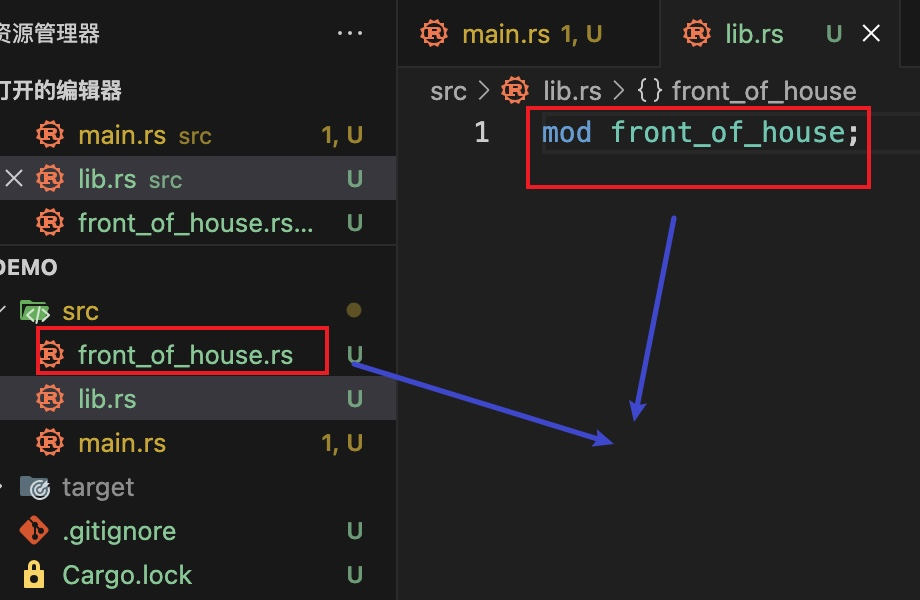
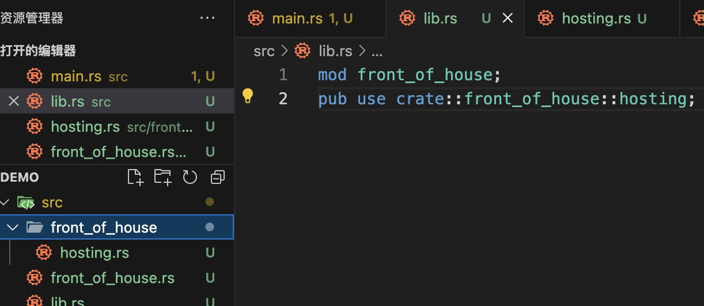
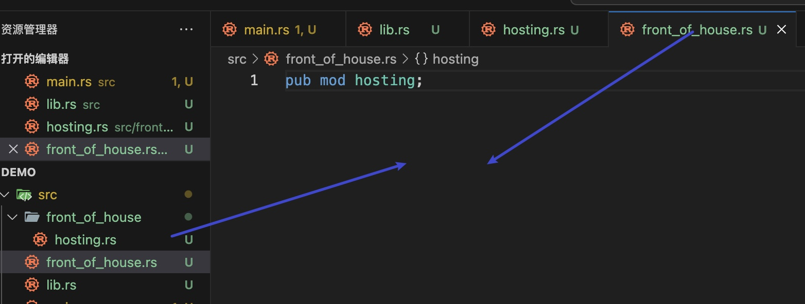

# Rust学习笔记

### 变量与不可变性

> 1. 在Rust中，使用Iet关键字来声明变量
>
> 2. Rust支持类型推导，但你也可以显式指定变量的类型：
>
>    `let x:i32 = 5; //显式指定x的类型为i32`
>
> 3. 变量名蛇形命名法(Snake Case，小写字母加下划线)，而枚举和结构体命名使用帕斯卡命名法(Pascal Case，每个单词首字母都大写) 如果变量没有用到可以前置下划线，消除警告
>
> 4. 强制类型转换
>
>    ` let a = 3.1; let b = a as i32;`
>
> 5. rust中的变量，默认是不可变的
>
> 6. 如果你希望一个变量是可变的，则需要明确使用mut关键字进行明确声明
>
>    ```rust
>    let mut y = 10; // 可变变量
>    y = 20; // 合法的修改
>    ```
>
> 7. rust允许声明一个与现有变量同名的新变量，从而有效的隐藏前一个变量，并且可以改变值，类型和可变性
>
>    ```rust
>    fn main() {
>        let x = 5;
>        println!("{}",x);		// 输出5
>        {
>            let x = 10;
>            println!("{}",x);	// 输出10
>        }
>        println!("{}",x);	// 输出5
>    }
>    ```
>
> 8. 未使用的变量，想屏蔽编译器报错提示，可以在变量名前面加下划线_

### 常量与静态变量

> 1. 常量的值必须是在编译时已知的常量表达式，必须指定类型与值
> 2. 与C语言的宏定义（宏替换）不同，Rust的cost常量的值被直接嵌入到生成的底层机器代码中，而不是进行简单的字符替换
> 3. 常量名与静态变量命名必须全部大写，单词之间加入下划线
> 4. 常量的作用域是块级作用域，它们只在声明它们的作用域内可见
>
> **静态变量**
>
> 1. 与const常量不同，static变量是在运行时分配内存的
> 2. 并不是不可变的，可以使用unsafe修改
> 3. 静态变量的生命周期为整个程序的运行时间
>
> ```rust
> static MY_STATIC: i32 = 100;
> static mut MY_MUT_STATIC: i32 = 50;
> fn main() {
>     const SECOND_HOUR: usize = 3600;
>     const SECOND_DAY: usize = 24 * SECOND_HOUR;
>     println!("{}",SECOND_DAY);
>     {
>         const SE:usize = 1000;
>         println!("{}",SE);
>     }
>     // println!("{}",SE);   // 不在作用域内会报错
>     println!("{MY_STATIC}");
>     unsafe {
>         MY_MUT_STATIC = 60;
>         println!("{MY_MUT_STATIC}");
>     }
> }
> ```

### 基础数据类型

> * 有符号整型：默认推断为i32
>   * i8、i16、i32、i64、i128
> * 无符号整型：u8、u16、u32、u64、u128
> * 平台特定的整型，大小由平台决定
>   * usize、isize
> * 浮点类型
>   * f32和f64
> * 布尔类型：true和false
> * 字符类型
>   * rust支持unicode字符
>   * 表示char类型使用单引号
>
> ```rust
> fn main() {
>     // 整型
>     let a1 = -125;
>     let a2 = 0xff;  // 16进制
>     let a3 = 0o13;  // 8进制
>     let a4 = 0b10;  // 2进制
>     println!("{a1} {a2} {a3} {a4}");
>     println!("u32 max {}",u32::MAX);
>     println!("u32 min {}",u32::MIN);
>     println!("i32 max {}",i32::MAX);
>     println!("i32 min {}",i32::MIN);
>     println!("usize max {}",usize::MAX);
>     println!("u64 max {}",u64::MAX);
> 
>     // 浮点型
>     let f1: f32 = 1.23234;
>     let f2: f64 = 1.888899999;
>     println!("Float f1,f2 are {:.2} {:.2}",f1,f2);  // 四舍五入保留两位小数
> 
>     // 布尔型
>     let is_ok: bool = true;
>     let can_ok: bool = false;
>     println!("{is_ok} {can_ok}");
> 
>     // 字符型
>     let ch: char = 'C';
>     println!("char is {}",ch)
> }
> ```

### 元组与数组

> * 数组是固定长度的同构集合
> * 元组是固定长度的异构集合
>
> ```rust
> fn main() {
>     // 元组
>     let tup: (i32, &str, f64) = (0,"hi",3.4);
>     println!("tup elements {} {} {}",tup.0,tup.1,tup.2);
> 
>     let mut tup2: (i32, &str, f64, bool) = (1,"hello",5.6,true);
>     println!("tup2 elements {} {} {} {}",tup2.0,tup2.1,tup2.2,tup2.3);
>     tup2.1 = "world";
>     println!("tup2 elements {} {} {} {}",tup2.0,tup2.1,tup2.2,tup2.3);
> 
>     // 数组
>   	let mut arr:[i32;5] = [0;5];
>     let mut arr = [1,2,3];
>     arr[0] = 7;
>     println!("arr len = {} first element is {}",arr.len(),arr[0]);
>     for item in arr {
>         println!("{}",item)
>     }
> 
>     let arr1: [i32; 3] = [2;3];
>     for item in arr1 {
>         println!("{}",item)
>     }
> 
>     // ownership
>     let arr3 = [1,2,3];
>     let tup3 = (2,"ff");
>     println!("arr : {:?}",arr3);
>     println!("tup : {:?}",tup3);
>     let arr_ownership = arr3;
>     let tup_ownership = tup3;
>     // 这里简单数据类型进行赋值操作不会进行所有权转移
>     println!("arr : {:?}",arr3);
>     println!("tup : {:?}",tup3);
> 
>     let string_item = String::from("aaa");
>     println!("{}",string_item);
>     let string_item_tt = string_item;
>     // 这里进行了move操作，进行了所有权转移，所以这里使用string_item会报错
>     // println!("{}",string_item)
> }
> ```

### 字符串的两种类型
> * ·Rust的核心语言层面，只有一个字符串类型：字符串切片sr(或&sr)
> * 字符串切片：对存储在其它地方、UTF-8编码的字符串的引用
>   * 字符串字面值：存储在二进制文件中，也是字符串切片
> * String类型：
>   * 来自标准库而不是核心语言
>   * 可增长、可修改、可拥有
>   * UTF-8编码
> * 其他类型字符串：Rust的标准库还包含了很多其它的字符串类型，例如：OsString、OsStr、CString、CStr
>   * String vs Str后缀：拥有或借用的变体
>   * 可存储不同编码的文本或在内存中以不同的形式展现
>   * Library crate（第三方库）针对存储字符串可提供更多的选项
>
> * String是一个堆分配的可变字符串类型
> * &str是指字符串切片引用，是在栈上分配的
>   * 不可变引用，指向存储在其他地方的UTF-8编码的字符串数据
>   * 由指针和长度构成
>
> ```rust
> fn main() {
>    let name = String::from("value C++");
>    let course = "Rust".to_owned();
>    let new_name = name.replace("C++", "CPP");
>    println!("{name} {course} {new_name}");
>    let rust = "\x52\x75\x73\x74";
>    println!("{rust}");
>    let color = "green".to_string();
>    let name = "John";
>    let p = Person{
>       name:name,
>       color:color,
>       age:18,
>    };
> 
>    let value = "hello world!".to_owned();
>    print(&value);
>    print("how are you");
>    print_string_borrow(&value);
> 
>    // print_string_borrow("hi!");   这个会报错
> }
> 
> struct Person<'a> {
>    // 字符串字面量必须要标明生命周期, 'a，这里的name的生命周期表明与结构体Person相同
>    name:&'a str,
>    color:String,
>    age:i32,
> }
> 
> // 可以传&String和&str
> fn print(data:&str){
>    println!("{}",data)
> }
> 
> // 只能传&String
> fn print_string_borrow(data:&String){
>    println!("{}",data)
> }
> ```
> ```rust
> fn main() {
>    let mut s1 = String::from("Hello");
>    let mut s2 = String::from("World");
>    s1.push('a');
>    s1.push_str(" string"); 
> 
>    // 拼接之后，s1被借用，发生了所有权转移，s1将不可用
>    let s3 = s1 + &s2;
>    println!(" s3: {}",s3);
>    println!(" s2: {}",s2);
> 
>    let s4 = String::from("宵宫");
>    let s5 = String::from("雷电将军");
>    let s6 = String::from("刻晴");
>    let s7 = format!("{}-{}-{}",s4,s5,s6);
>    println!(" s7: {}",s7);
> }
> ```
>
> 

### 函数

> **函数的返回值**
>
> * 在->符号后边声明函数返回值的类型，但是不可以为返回值命名
>
> * 在Rust里面，返回值就是函数体里面最后一个表达式的值，若想提前返回，需使用return关键字，并指定一个值
>
>   大多数函数都是默认使用最后一个表达式最为返回值
>
> ```rust
> fn main() {
>     let r = add(1,2);
>     println!("{}",r);
>     let r2 = minus(5,3);
>     println!("{}",r2);
> }
> 
> fn add(a:i32,b:i32) -> i32{
>    // 最后一个表达式作为返回值可以不加分号，会自动加上
>    a + b
> }
> 
> fn minus(a:i32,b:i32) -> i32{
>     return a - b
> }
> ```

### 控制流

> **if表达式**
>
> ```rust
> fn main() {
>  let num = 3;
>  if num < 5 {
>      println!("条件为真");
>  }else {
>      println!("条件为假");
>  }
> }
> ```
>
> ```rust
> fn main() {
>  let num = 6;
>  if num % 4 == 0 {
>    println!("num is divisible by 4");
>  } else if num % 3 == 0 {
>    println!("num is  divisible by 3");
>  }else if num % 2 == 0 {
>    println!("num is divisible by 2");
>  }else {
>    println!("num is not divisible by 4, 3 or 2");
>  }
> }
> ```
>
> ```rust
> fn main() {
>  let condition = true;
>  let number = if condition { 5 } else { 6 };
>  println!("The value of number is: {}", number);
> }
> ```
>
> **循环**
>
> ```rust
> fn main() {
>     let mut counter = 0;
>     loop {
>         counter += 1;
>         if counter >= 10 {
>             break;
>         }
>         println!("loop循环 {}", counter);
>     }
> 
>     let mut counter = 0;
>     while counter < 10 {
>         counter += 1;
>         println!("while条件循环 {}", counter);
>     }
> 
>     for i in (1..10).rev() {
>         println!("for循环 {}", i);
>     }
> }
> ```

### 内存分配与所有权

> Copy trait：可以用于像整数这样完全存放在stack上面的类型，如果一个类型实现了Copy这个trait,.那么旧的变量在赋值后仍然可用
>
> Drop trait：如果一个类型或者该类型的一部分实现了Drop trait，那么RUst不允许让它再去实现Copy trait了
>
> 一些拥有Copy trait的类型：
>
> * 任何简单标量的组合类型都可以是Copy的
> * 任何需要分配内存或某种资源的都不是Copy的
> * 所有的整数类型，例如U32
> * bool
> * char
> * 所有的浮点类型，例如f64
> * Tuple(元组)，如果其所有的字段都是Copy的
>   * (i32,i32)是
>   * (i32,String)不是
>
> **函数与所有权**
>
> ```rust
> fn main() {
>     let s = String::from("hello");
>     take_ownership(s);
>     // println!("{}", s);  这里所有权发生了转移，所以不能使用了
>     let x = 5;
>     make_copy(x);
>     // 这里是i32类型，会执行copy操作，所以没有发生所有权转移，依然可以使用
>     println!("{}", x);
> }
> 
> fn take_ownership(some_string: String) {
>     println!("{}", some_string);
> }
> 
> fn make_copy(some_integer: i32) -> i32 {
>     some_integer
> }
> ```
>
> **返回值与作用域**
>
> * 函数在返回值的过程中同样也会发生所有权的转移
> * 一个变量的所有权总是遵循同样的模式
> * 把一个值赋给其它变量时就会发生移动
> * 当一个包含heap数据的变量离开作用域时，它的值就会被drop函数清理，除非数据的所有权移动到另一个变量上了
>
> **函数使用某个值，但不获得所有权**
>
> ```rust
> fn main() {
>     let s = String::from("hello");
>     let (s2, len) = calc_length(s);
>     println!("{} {}", s2, len);
> }
> 
> fn calc_length(s: String) -> (String, usize) {
>     let length = s.len();
>     (s, length)
> }
> ```
>
> **引用与借用**
>
> * &符号就表示引用：允许你引用某些值而不取得其所有权
> * 我们把引用作为函数参数这个行为叫做借用
> * 默认是不可以修改借用的变量
> * 可变引用有一个重要的限制：在特定作用域内，对某一块数据，只能有一个可变的引用( 同一个作用域内，针对同一个变量，只能有一个可变引用，这是为了防止数据竞争 )
> * 不可以同时拥有一个可变引用和一个不变的引用
>
> ```rust
> fn main() {
>     let s1 = String::from("hello");
>     let len = calc_length(&s1);
>     println!("The length of '{}' is {}.", s1, len);
> }
> 
> fn calc_length(s: &String) -> usize {
>     s.len()
> }
> ```
>
> ```rust
> fn main() {
>     let mut s1 = String::from("hello");
>     let len = calc_length(&mut s1);
>     println!("The length of '{}' is {}.", s1, len);
> }
> 
> fn calc_length(s: &mut String) -> usize {
>     s.push_str(",world");
>     s.len()
> }
> ```
>
> **字符串切片**
>
> ```rust
> fn main() {
>     let mut s = String::from("hello world");
>     let hello = &s[0..5];
>     let hello1 = &s[..5];
>     let world = &s[6..11];
>     let world1 = &s[6..];
>     let whole = &s[..];
>     println!("{} {} {} {} {} ", hello,hello1, world,world1, whole);
>     let first = first_word(&s);
>     println!("{}", first);
> }
> 
> fn first_word(s: &String) -> &str {
>     let bytes = s.as_bytes();
>     for (i, &item) in bytes.iter().enumerate() {
>         if item == b' ' {
>             return &s[..i];
>         }
>     }
>     &s[..]
> }
> ```
>
> 注意：
>
> * 字符串切片的范围索引必须发生在有效的UTF-8字符边界内。
> * 如果尝试从一个多字节的字符中创建字符串切片，程序会报错并退出

### 结构体struct

> ```rust
> fn main() {
>     let rect = Rectangle {
>         width: 30,
>         height: 10,
>     };
>     println!("{}",area(&rect));
>     println!("{:#?}",rect);
> }
> 
> fn area(rect: &Rectangle) -> u32 {
>     rect.width * rect.height
> }
> 
> #[derive(Debug)]
> struct Rectangle {
>     width: u32,
>     height: u32,
> }
> ```
>
> ```rust
> fn main() {
>     let rect = Rectangle {
>         width: 30,
>         height: 10,
>     };
>     let rect2 = Rectangle {
>         width: 10,
>         height: 40,
>     };
>     let s = Rectangle::square(3);
>     println!("{}",rect.area());
>     println!("{}",rect.can_hold(&rect2));
>     println!("{:#?}",rect);
>     println!("{:#?}",s);
> }
> 
> #[derive(Debug)]
> struct Rectangle {
>     width: u32,
>     height: u32,
> }
> 
> impl Rectangle {
>     // 方法必须以self作为第一个参数
>     fn area(&self) -> u32 {
>         self.width * self.height
>     }
> 
>     fn can_hold(&self, other: &Rectangle) -> bool {
>         self.width > other.width && self.height > other.height
>     }
> 
>     // 关联函数可以不需要self参数
>     fn square(size: u32) -> Rectangle {
>         Rectangle {
>             width: size,
>             height: size,
>         }
>     }
> }
> ```

### 枚举

> ```rust
> fn main() {
>     let four = IPAddrKind::V4;
>     let six = IPAddrKind::V6;
>     route(four);
>     route(six);
> }
> 
> enum IPAddrKind {
>     V4,
>     V6,
> }
> 
> fn route(ip_kind: IPAddrKind) {
>     match ip_kind {
>         IPAddrKind::V4 => println!("ipv4"),
>         IPAddrKind::V6 => println!("ipv6"),
>     }
> }
> ```
>
> ```rust
> fn main() {
>     let four = IPAddrKind::V4(127,0,0,1);
>     let six = IPAddrKind::V6(String::from("::1"));
> }
> 
> enum IPAddrKind {
>     V4(u8,u8,u8,u8),
>     V6(String),
> }
> ```
>
> 定义枚举方法
>
> ```rust
> fn main() {
>     let q = Message::Quit;
>     let m = Message::Move { x: 100, y: 100 };
>     let w = Message::Write(String::from("hello"));
>     let c = Message::ChangeColor(0, 160, 230);
>     q.call();
>     m.call();
>     w.call();
>     c.call();
> }
> 
> #[derive(Debug)]
> enum Message {
>     Quit,
>     Move { x: i32, y: i32 },
>     Write(String),
>     ChangeColor(i32, i32, i32),
> }
> 
> impl Message {
>     fn call(&self) {
>         println!("{:?}", self);
>     }
> }
> ```
>
> **Option枚举**
>
> * rust中类似Null的概念Option<T>
>
> * 标准库中的定义
>
>   * ```rust
>     enum Option<T>{
>       Some(T),
>       None,
>     }
>     ```
>
>   * 它包含在Prelude（预导入模块）中，可直接使用Option<T>，Some<T>，None
>
> ```rust
> fn main() {
>    let some_number = Some(5);
>    let some_string = Some("a string");
>    let absent_number: Option<i32> = None;
> }
> ```
>
> ```rust
> fn main() {
>    let x: i8 = 5;
>    let y: Option<i8> = Some(10);
> //    let sum = x + y;  这里会报错，若想使用Option中的T，必须先把Option<T>转换成T
>    let sum = x + y.unwrap_or(0);
>    println!("sum: {}", sum);
> }
> ```

### match

> ```rust
> fn main() {
>     let r = value_in_cents(Coin::Penny);
>     println!("{}", r);
> }
> 
> enum Coin {
>     Penny,
>     Nickel,
>     Dime,
>     Quarter,
> }
> 
> fn value_in_cents(coin: Coin) -> u8 {
>     match coin {
>         Coin::Penny => {
>             println!("Lucky penny!");
>             1
>         },
>         Coin::Nickel => 5,
>         Coin::Dime => 10,
>         Coin::Quarter => 25,
>     }
> }
> ```
>
> 绑定值的模式匹配
>
> ```rust
> fn main() {
>     let c = Coin::Quarter(UsState::Alaska);
>     println!("{}", value_in_cents(c));
> }
> 
> enum Coin {
>     Penny,
>     Nickel,
>     Dime,
>     Quarter(UsState),
> }
> 
> #[derive(Debug)]
> enum UsState {
>     Alabama,
>     Alaska,
> }
> 
> fn value_in_cents(coin: Coin) -> u8 {
>     match coin {
>         Coin::Penny => {
>             println!("Lucky penny!");
>             1
>         },
>         Coin::Nickel => 5,
>         Coin::Dime => 10,
>         Coin::Quarter(state) => {
>             println!("State quarter from {:?}!", state);
>             25
>         },
>     }
> }
> ```
>
> Option模式匹配
>
> ```rust
> fn main() {
>     let five = Some(5);
>     let six = plus_one(five);
>     let none = plus_one(None);
> }
> 
> fn plus_one(x: Option<i32>) -> Option<i32> {
>     match x {
>         None => None,
>         Some(i) => Some(i + 1),
>     }
> }
> ```
>
> **match匹配必须穷举所有的可能**
>
> 可以使用_通配符替代其余没出现的值
>
> ```rust
> fn main() {
>     let v = 0u8;
>     match v {
>         0 => println!("zero"),
>         1 => println!("one"),
>         2 => println!("two"),
>         3 => println!("three"),
>         _ => println!("other"),
>     }
> }
> ```

### if let

> 可以把if let看做match的一种语法糖，当只有一种情况需要匹配处理，适合使用if let
>
> ```rust
> fn main() {
>     let v = Some(0u8);
>     if let Some(3) = v {
>         println!("three");
>     }
> }
> ```

### Rust代码组织

> 代码组织主要包括：
>
> * 哪些细节可以暴露，哪些细节是私有的
> * 作用域内哪些名称有效
>
> **模块系统**
>
> * Package(包)：Cargo的特性，让你构建、测试、共享crate
> * Crate(单元包)：一个模块树，它可产生一个library或可执行文件
> * Module(模块)、Use:让你控制代码的组织、作用域、私有路径
> * Path(路径)：为struct、function或nodule等项命名的方式
>
> **Package和Crate**
>
> Crate的类型：
>
> * binary
> * library
>
> Crate Root:
>
> * 是源代码文件
> * Rust编译器从这里开始，组成你的Crate的根Module
>
> 一个Package:
>
> * 包含1个Cargo.toml,它描述了如何构建这些Crates
> * 只能包含0-1个library crate
> * 可以包含任意数量的binary crate
> * 但必须至少包含一个crate(library或binary)
>
> **Module**
>
> * 在一个crate内，将代码进行分组
> * 增加可读性，易于复用
> * 控制项目(item)的私有性。public、private
> * src/main.rs和src/Iib.rs叫做crate roots
>
> **建立module**
>
> * mod关键字
> * 可嵌套
> * 可包含其它项(struct、.enum、常量、trait、函数等)的定义
>
> lib.rs
>
> ```rust
> mod front_of_house{
>     mod hosting{
>         fn add_to_waitlist(){
>             println!("add to waitlist");
>         }
>         fn seat_at_table(){
>             println!("seat at table");
>         }
>     }
>     mod serving{
>         fn take_order(){
>             println!("take order");
>         }
>         fn serve_order(){
>             println!("serve order");
>         }
>     }
> }
> ```
>
> **路径(path)**
>
> * 为了在Rust的模块中找到某个条目，需要使用路径。
> * 路径的两种形式：
>   * 绝对路径：从crate root开始，使用crate名或字面值crate
>   * 相对路径：从当前模块开始，使用sef,super或当前模块的标识符
> * 路径至少由一个标识符组成，标识符之间使用::
>
> **私有边界**
>
> * 模块不仅可以组织代码，还可以定义私有边界
> * 如果想把函数或struct等设为私有，可以将它放到某个模块中。
> * Rust中所有的条目（函数，方法，struct,enum,模块，常量）默认是私有的。
> * 父级模块无法访问子模块中的私有条目
> * 子模块里可以使用所有祖先模块中的条目
> * 使用pub关键字来将某些条目标记为公共的
>
> lib.rs
>
> ```rust
> mod front_of_house{
>     pub mod hosting{
>         pub fn add_to_waitlist(){
>             println!("add to waitlist");
>         }
>         pub fn seat_at_table(){
>             println!("seat at table");
>         }
>     }
>     mod serving{
>         fn take_order(){
>             println!("take order");
>         }
>         fn serve_order(){
>             println!("serve order");
>         }
>     }
> }
> 
> pub fn eat_at_restaurant(){
>     crate::front_of_house::hosting::add_to_waitlist();
>     front_of_house::hosting::seat_at_table();
> }
> ```
>
> super关键字
>
> * supr:用来访问父级模块路径中的内容，类似文件系统中的..
>
> pub struct
>
> * pub放在struct前：
>   * struct是公共的
>   * struct的字段默认是私有的
> * struct的字段需要单独设置pub来变成共有。
>
> ```rust
> mod back_of_house{
>     pub struct Breakfast{
>         pub toast: String,
>         seasonal_fruit: String,
>     }
>     impl Breakfast{
>         pub fn summer(toast: &str) -> Breakfast{
>             Breakfast{
>                 toast: String::from(toast),
>                 seasonal_fruit: String::from("peaches"),
>             }
>         }
> 
>     }
> }
> 
> pub fn eating_at_restaurant(){
>     let mut meal = back_of_house::Breakfast::summer("Rye");
>     meal.toast = String::from("Wheat");
>     println!("I'd like {} toast please", meal.toast);
>     // println!("And my seasonal fruit is {}", meal.seasonal_fruit);  访问私有的字段会报错
> 
> }
> ```
>
> pub enum
>
> * pub放在enum前
> * enum是公共的
> * erum里的元素也都是公共的
>
> **use关键字**
>
> * 可以使用use关键字将路径导入到作用域内
>   * 仍遵循私有性规则
> * 使用use来指定相对路径
>
> 绝对路径指定
>
> ```rust
> mod front_of_house{
>     pub mod hosting{
>         pub fn add_to_waitlist(){
>             println!("Please add to waitlist");
>         }
>     }
> }
> 
> use crate::front_of_house::hosting;
> pub fn eat_at_restaurant(){
>     hosting::add_to_waitlist();
> }
> ```
>
> 相对路径指定
>
> ```rust
> mod front_of_house{
>     pub mod hosting{
>         pub fn add_to_waitlist(){
>             println!("Please add to waitlist");
>         }
>     }
> }
> 
> use front_of_house::hosting;
> pub fn eat_at_restaurant(){
>     hosting::add_to_waitlist();
> }
> ```
>
> use的习惯用法
>
> * 函数：将函数的父级模块引入作用域（指定到父级）
> * struct,enum,其它：指定完整路径（指定到本身）
> * 同名条目：指定到父级
>
> ```rust
> use std::collections::HashMap;
> fn main() {
>     let mut map = HashMap::new();
>     map.insert(1,2);
> }
> ```
>
> ```rust
> use std::fmt;
> use std::io;
> fn main() {
> 
> }
> 
> fn f1() -> fmt::Result{}
> fn f2() -> io::Result{}
> ```
>
> **as关键字**
>
> * as关键字可以为引入的路径指定本地的别名
>
> ```rust
> use std::fmt::Result;
> use std::io::Result as IOResult;
> fn main() {
> 
> }
> 
> fn f1() -> Result{}
> fn f2() -> IOResult{}
> ```
>
> 使用pub use重新导出名称
>
> * 使用use将路径（名称）导入到作用域内后，该名称在此作用域内是私有的。
> * pub use:重导出
>   * 将条目引入作用域
>   * 该条目可以被外部代码引入到它们的作用域
>
> ```rust
> mod front_of_house{
>     pub mod hosting{
>         pub fn add_to_waitlist(){
>             println!("Please add to waitlist");
>         }
>     }
> }
> 
> pub use front_of_house::hosting;    // 这里使用pub use之后，外部也能使用hosting名称
> pub fn eat_at_restaurant(){
>     hosting::add_to_waitlist();
> }
> ```
>
> **使用外部包(package)**
>
> * Cargo.toml添加依赖的包(package)
>   * https://crates.io/
>
> * 将特定条目引入作用域
>
> * 标准库(sd)也被当做外部包
>   * 不需要修改Cargo.toml来包含std
>   * 需要使用use将std中的特定条目引入当前作用域
>
> 使用嵌套路径清理大量的use语句
>
> * 如果使用同一个包或模块下的多个条目
> * 可使用嵌套路径在同一行内将上述条目进行引入
>   * 路径相同的部分::{路径差异的部分}
> * 如果两个Use路径之一是另一个的子路径
>   * 使用self
>
> ```rust
> // use std::io;
> // use std::cmp::Ordering;
> use std::{cmp::Ordering, io};
> fn main() {}
> ```
>
> ```rust
> // use std::io;
> // use std::io::Write;
> use std::io::{self, Write};
> fn main() {}
> ```
>
> 通配符*
>
> * 使用*可以把路径中所有的公共条目都引入到作用域。
>
> ```rust
> use std::collections::*;
> fn main() {}
> ```
>
> 将模块内容移动到其他文件
>
> * 模块定义时，如果模块名后边是” ; “【分号】，而不是代码块：
>   * Rust会从与模块同名的文件中加载内容
>   * 模块树的结构不会变化
> * 随着模块逐渐变大，该技术让你可以把模块的内容移动到其它文件中
>
> 
>
> 
>
> 

### Vector

> ```rust
> fn main() {
>     // let v: Vec<i32> = Vec::new();
>     // let v = vec![1,2,3];
>     let mut v: Vec<i32> = Vec::new();
>     v.push(1);
>     v.push(2);
>     v.push(3);
>     v.push(4);
>     v.push(5);
>     let third = &v[2];
>     println!("the third element is {}", third);
> 
>     match v.get(2) {
>         Some(num) => println!("the third element is {}", num),
>         None => println!("there is no third element"),
>     }
> 
>     for i in &v {
>         println!("{}", i);
>     }
> }
> ```
>
> ```rust
> fn main() {
>     let mut v = vec![10, 20, 30];
> 
>     for i in &mut v {
>         *i += 50;
>     }
> 
>     for i in &v {
>         println!("{}", i);
>     }
> }
> ```
>
> ```rust
> fn main() {
>    let row = vec![
>       SpreadsheetCell::Int(3),
>       SpreadsheetCell::Text(String::from("blue")),
>       SpreadsheetCell::Float(10.32),
>    ];
> }
> 
> enum SpreadsheetCell {
>     Int(i32),
>     Float(f64),
>     Text(String),
> }
> ```
>
> 

### HashMap

> * HashMap用的较少，不在Prelude【预导入模块】中
> * 标准库对其支持较少，没有内置的宏来创建HashMap
> * 数据存储在heap上
> * 同构的。一个HashMap中：
>   * 所有的K必须是同一种类型
>   * 所有的V必须是同一种类型
>
> **HashMap和所有权**
>
> * 对于实现了Copy trait的类型（例如i32),值会被复制到HashMap中
> * 对于拥有所有权的值（例如String)，值会被移动，所有权会转移给HashMap
> * 如果将值的引用插入到HashMap,值本身不会移动
>   * 在HashMap有效的期间，被引用的值必须保持有效
>
> ```rust
> use std::collections::HashMap;
> 
> fn main() {
>    let mut scores: HashMap<String,i32>  = HashMap::new();
>    scores.insert(String::from("Blue"), 10);
>    scores.insert(String::from("Yellow"), 50);
> 
>    let teams = vec![String::from("Red"), String::from("Orange")];
>    let initial_scores = vec![10, 50];
>    let scores2: HashMap<_, _> = teams.iter().zip(initial_scores.iter()).collect();
> 
>    // 获取值
>    let val: Option<&i32> = scores.get("Blue");
>    match val {
>       Some(score) => println!("Blue score: {}", score),
>       None => println!("No Blue score"),
>    }
> 
>    // 遍历
>    for (key, value) in &scores {
>       println!("{}: {}", key, value);
>    }
>    
>    // 所有权
>    let field_name: String = String::from("Favorite color");
>    let field_value: String = String::from("Blue");
>    let mut map: HashMap<String, String> = HashMap::new();
>    map.insert(field_name, field_value);
>    // println!("{}", field_name);   // 报错，field_name所有权被转移到map中
> 
>    // 更新
>    let mut scores3: HashMap<String,i32>  = HashMap::new();
>    scores3.insert(String::from("Blue"), 10);
>    // 插入相同的key，会覆盖原来的值
>    scores3.insert(String::from("Blue"), 20);
>    // 只在key不存在时插入
>    scores3.entry(String::from("Yellow")).or_insert(50);
>    println!("{:?}", scores3);
> 
>    let text = "hello world wonderful world";
>    let mut map = HashMap::new();
>    for word in text.split_whitespace() {
>       let count = map.entry(word).or_insert(0);
>       *count += 1;
>    }
>    println!("{:?}", map);
> }
> ```

### 错误处理

> * Rust的可靠性：错误处理
>   * 大部分情况下：在编译时提示错误，并处理
> * 错误的分类：
>   * 可恢复【例如文件未找到，可再次尝试】
>   * 不可恢复 【bug,例如访问的索引超出范围】
> * Rust没有类似异常的机制
>   * 可恢复错误：Result<T,E>
>   * 不可恢复：panic!宏
>
> **为应对panic,展开或中止(abort)调用栈**
>
> * 默认情况下，当panic发生：
>   * 程序展开调用栈（工作量大）
>   * Rust沿着调用栈往回走
>   * 清理每个遇到的函数中的数据
> * 或立即中止调用栈
>   * 不进行清理，直接停止程序
>   * 内存需要OS进行清理
>   * 想让二进制文件更小，把设置从“展开”改为“中止”
> * 在Cargo.toml中适当的profile部分设置：
>   * panic=‘abort'
>
> ```toml
> [profile.release]
> panic = 'abort'
> ```
>
> ```rust
> use std::fs::File;
> fn main() {
>    let f = File::open("hello.txt");
>    let f = match f {
>        Ok(file) => {
>          println!("{:?}", file);
>          file
>        },
>        Err(e) => {
>          panic!("打开文件出错了！ 详细错误信息：{}", e)
>        },
>    };
> }
> ```
>
> 匹配不同错误
>
> ```rust
> use std::{fs::File, io::ErrorKind};
> fn main() {
>    let f = File::open("hello.txt");
>    let f = match f {
>        Ok(file) => {
>          println!("{:?}", file);
>          file
>        },
>        Err(e) => match e.kind(){
>          ErrorKind::NotFound => match File::create("hello.txt"){
>            Ok(fc) => {
>              println!("创建文件成功！{:?}", fc);
>              fc
>            },
>            Err(e) => panic!("创建文件失败！{:?}", e)
>          },
>          other_error => {
>            panic!("打开文件出错！ {:?}", other_error)
>          }
>        }
>    };
> }
> ```
>
> 简化后
>
> ```rust
> use std::{fs::File, io::ErrorKind};
> fn main() {
>    let f = File::open("hello.txt").unwrap_or_else(|error|{
>        if error.kind() == ErrorKind::NotFound{
>            println!("file not found");
>            File::create("hello.txt").unwrap()
>        }else{
>            panic!("problem opening the file: {:?}", error);
>        }
>    });
> }
> ```
>
> **unwrap**
>
> * unwrap : match表达式的一个快捷方法：
> * 如果Result结果是Ok,返回Ok里面的值
> * 果Result结果是Err,调用panic!宏
> * 缺点：不能自定义错误信息
>
> ```rust
> use std::fs::File;
> fn main() {
>    let f = File::open("hello.txt").unwrap();
> }
> ```
>
> **expect**
>
> * expect：和unwrap类似，但可指定错误信息
>
> ```rust
> use std::fs::File;
> fn main() {
>    let f = File::open("hello.txt").expect("无法打开文件");
> }
> ```
>
> 传播错误
>
> ```rust
> use std::io::{self, Read};
> use std::fs::File;
> fn main() {
>    let s = read_username_from_file();
>    match s {
>       Ok(s) => println!("{}",s),
>       Err(e) => panic!("Failed to read from file: {}",e),
>    };
> }
> 
> fn read_username_from_file() -> Result<String,io::Error>{
>    let f = File::open("hello.txt");
>    let mut f = match f {
>       Ok(file) => file,
>       Err(e) => return Err(e),
>    };
>    let mut s = String::new();
>    match f.read_to_string(&mut s) {
>       Ok(_) => Ok(s),
>       Err(e) => Err(e),
>    }
> }
> ```
>
> **?运算符**
>
> * ？ 运算符：传播错误的一种快捷方式
> * 如果Result是Ok：Ok中的值就是表达式的结果，然后继续执行程序
> * 如果Result是Er：Err就是整个函数的返回值，就像使用了return
> * ？运算符只能用于返回Result的函数
>
> 利用？运算符，上述传播错误代码可以简写为：
>
> ```rust
> use std::io::{self, Read};
> use std::fs::File;
> fn main() {
>    let s = read_username_from_file();
>    match s {
>       Ok(s) => println!("{}",s),
>       Err(e) => panic!("Failed to read from file: {}",e),
>    };
> }
> 
> fn read_username_from_file() -> Result<String,io::Error>{
>    let mut f = File::open("hello.txt")?;
>    let mut s = String::new();
>    f.read_to_string(&mut s)?;
>    Ok(s)
> }
> ```
>
> **?与from函数**
>
> * Trait std::convert::From上的from函数：
>   * 用于错误之间的转换
> * 被？所应用的错误，会隐式的被from函数处理
> * 当？调用from函数时：
>   * 它所接收的错误类型会被转化为当前函数返回类型所定义的错误类型
> * 用于：针对不同错误原因，返回同一种错误类型
>   * 只要每个错误类型实现了转换为所返回的错误类型的from函数
>
> **？运算符链式调用**
>
> ```rust
> use std::io::{self, Read};
> use std::fs::File;
> fn main() {
>    let s = read_username_from_file();
>    match s {
>       Ok(s) => println!("{}",s),
>       Err(e) => panic!("Failed to read from file: {}",e),
>    };
> }
> 
> fn read_username_from_file() -> Result<String,io::Error>{
>    let mut s = String::new();
>    File::open("hello.txt")?.read_to_string(&mut s)?;
>    Ok(s)
> }
> ```
>
> **panic和Result使用场景**
>
> * 调用你的代码，传入无意义的参数值：panic!
> * 调用外部不可控代码，返回非法状态，你无法修复：panic!
> * 如果失败是可预期的：Result
> * 当你的代码对值进行操作，首先应该验证这些值：panic!
>
> ```rust
> use std::io::stdin;
> fn main() {
>    loop {
>       println!("Please input your guess.");
> 
>       let mut guess = String::new();
>       stdin().read_line(&mut guess).expect("expected a string");
>       let guess: i32 = match guess.trim().parse(){
>           Ok(num) => num,
>           Err(_) => continue,
>       };
>       let guess = Guess::new(guess);
>       println!("You guessed: {}", guess.value());
>    }
> }
> 
> pub struct Guess {
>     value: i32,
> }
> 
> impl Guess {
>     pub fn new(value: i32) -> Guess {
>         if value < 1 || value > 100 {
>             panic!("Guess value must be between 1 and 100, got {}.", value);
>         }
>         Guess { value }
>     }
>     pub fn value(&self) -> i32 {
>         self.value
>     }
> }
> ```

### 泛型

> ```rust
> fn main() {
>    let v = vec![10,5,8,20,15,6,30,50];
>    let num = largest(&v);
>    println!("The largest number is {}", num);
> }
> 
> fn largest<T: std::cmp::PartialOrd>(list:&[T]) -> &T {
>     let mut largest = &list[0];
>     for item in list {
>         if item > largest {
>             largest = item;
>         }
>     }
>     largest
> }
> ```
>
> ```rust
> fn main() {
>    let p1 = Point {x: 5, y: 10.5};
>    let p2 = Point {x: 1.0, y: 4.0};
> }
> 
> struct Point<T,U> {
>     x: T,
>     y: U,
> }
> ```
>
> ```rust
> fn main() {
>    let p1 = Point {x: 5, y: 10};
>    let p2 = Point {x: "Hello", y: 'c'};
>    let p3 = p1.mixup(p2);
>    println!("p3.x = {} p3.y = {}", p3.x, p3.y);
> }
> 
> struct Point<T,U> {
>     x: T,
>     y: U,
> }
> 
> impl <T,U> Point<T,U> {
>     fn x(&self)-> &T {
>         &self.x
>     }
>     fn y(&self) -> &U {
>         &self.y
>     }
> }
> 
> impl Point<i32,i32>{
>    fn x1(&self) -> &i32 {
>        &self.x
>    }
>    fn y1(&self) -> &i32 {
>        &self.y
>    }
> }
> 
> impl <T,U> Point<T,U>{
>     fn mixup<V,W>(self, other: Point<V,W>) -> Point<T,W> {
>         Point {
>             x: self.x,
>             y: other.y,
>         }
>     }
> }
> ```

### Trait

> * Trait告诉Rust编译器：
>   * 某种类型具有哪些并且可以与其它类型共享的功能
> * Trait:抽象的定义共享行为
> * Trait bounds(约束)：泛型类型参数指定为实现了特定行为的类型
> * Trait与其它语言的接口(interface)类似，但有些区别。
> * 默认实现的方法可以调用Trait中其它的方法，即使这些方法没有默认实现。
> * 注意：无法从方法的重写实现里面调用默认的实现。
>
> **实现Trait的约束**
>
> * 可以在某个类型上实现某个rat的前提条件是：
>   * 这个类型或这个trait是在本地crate里定义的
> * 无法为外部类型来实现外部的trait
>   * 这个限制是程序属性的一部分（也就是一致性）
>   * 更具体地说是孤儿规则：之所以这样命名是因为父类型不存在。
>   * 此规则确保其他人的代码不能破坏您的代码，反之亦然。
>   * 如果没有这个规则，两个crate可以为同一类型实现同一个trait,Rust就不知道应该使用哪个实现了。
>
> ```rust
> fn main() {
>    let tweet = Tweet {
>      username: String::from("horse_ebooks"),
>      content: String::from("of course, as you probably already know, people"),
>      reply: false,
>      retweet: false,
>    };
>    println!("1 new tweet: {}", tweet.summarize());
> }
> 
> pub trait Summary{
> //   fn summarize(&self) -> String;
> 
>    // 默认实现  默认实现的方法可以调用Trait中其它的方法，即使这些方法没有默认实现。
>   // 注意：无法从方法的重写实现里面调用默认的实现。
>   fn summarize(&self) -> String{
>     String::from("read more...")
>   }
> }
> 
> pub struct NewsArticle {
>   pub headline: String,
>   pub location: String,
>   pub author: String,
>   pub content: String,
> }
> 
> impl Summary for NewsArticle {
>   fn summarize(&self) -> String {
>     format!("{}, by {} ({})", self.headline, self.author, self.location)
>   }
> }
> 
> struct Tweet {
>   pub username: String,
>   pub content: String,
>   pub reply: bool,
>   pub retweet: bool,
> }
> 
> impl Summary for Tweet {
>   fn summarize(&self) -> String {
>     format!("{}: {}", self.username, self.content)
>   }
> }
> ```
>
> **Trait作为参数**
>
> * impl Trait语法：适用于简单情况
> * Trait bound语法：可用于复杂情况
> * impl Trait语法是Trait bound的语法糖
> * 使用+指定多个Trait bound
> * Trait bound使用where子句
>   * 在方法签名后指定where子句
>
> ```rust
> // pub fn notify(item : impl Summary){
> //   println!("notify! {}", item.summarize());
> // }
> 
> // 实现多个Trait
> // pub fn notify(item : impl Summary + Display){
> //   println!("notify! {}", item.summarize());
> // }
> 
> // 实现多个Trait，用加号 + 连接多个 Trait
> // pub fn notify<T: Summary + Display>(item : T){
> //   println!("notify! {}", item.summarize());
> // }
> 
> pub fn notify<T: Summary + Display,U: Clone + Debug>(a: T,b: U) -> String{
>   format!("notify! {}", a.summarize())
> }
> 
> pub fn notify2<T,U>(a: T,b: U) -> String
> where T: Summary + Display,
>       U: Clone + Debug
> {
>   format!("notify! {}", a.summarize())
> }
> ```
>
> **使用Trait作为返回类型**
>
> * impl Trait语法
> * 注意：impl Trait只能返回确定的同一种类型，返回可能不同类型的代码会报错
>
> ```rust
> fn notify(flag: bool) -> impl Summary{
>   // 这里NewsArticle和Tweet虽然都实现了Summary Trait，但是有可能返回两种类型，会报错
>   // impl Trait这种形式只能返回一种类型
>   if flag {
>       NewsArticle {
>         headline: String::from("Penguins win the Stanley Cup Championship!"),
>         location: String::from("Pittsburgh, PA, USA"),
>         author: String::from("Iceburgh"),
>         content: String::from(
>           "The Pittsburgh Penguins once again are the best \
>            hockey team in the NHL.",
>         ),
>       }
>   }else {
>       Tweet {
>         username: String::from("horse_ebooks"),
>         content: String::from("of course, as you probably already know, people"),
>         reply: false,
>         retweet: false,
>       }
>   }
> }
> ```

### 生命周期

> 